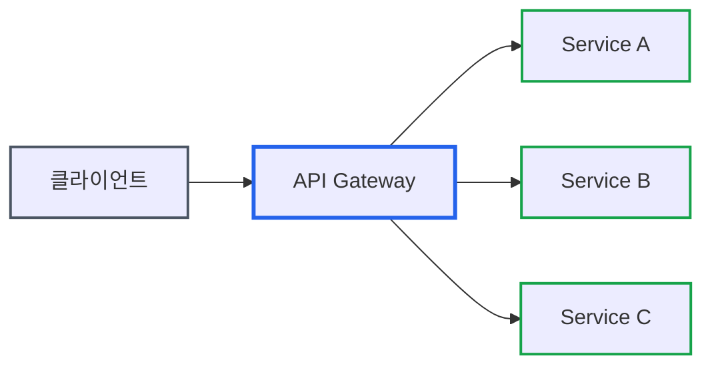
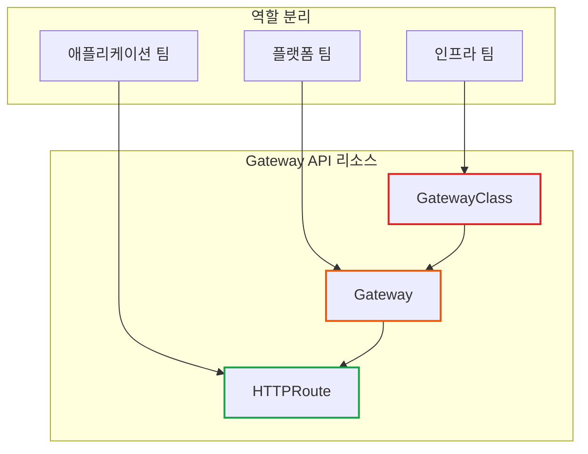
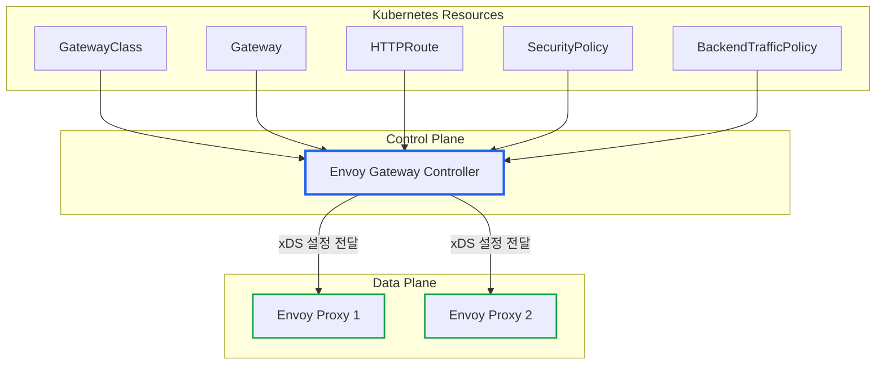
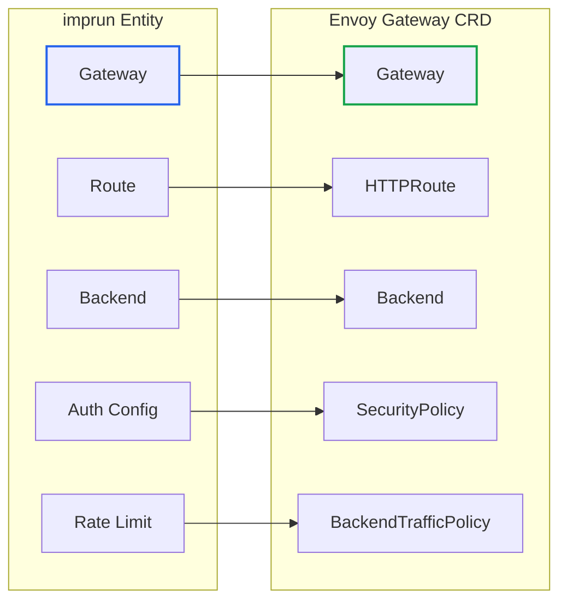

# Envoy Gateway 개요: Kubernetes 네이티브 API Gateway의 새로운 표준

> **작성일**: 2026년 1월 2일
> **카테고리**: Kubernetes, API Gateway, Envoy
> **키워드**: Envoy Gateway, Gateway API, Kubernetes, API Gateway, Envoy Proxy
> **시리즈**: Envoy Gateway 완벽 가이드 (1/6)

## 요약

Envoy Gateway는 Kubernetes Gateway API를 구현한 API Gateway 컨트롤러다. Envoy Proxy의 복잡한 설정을 Kubernetes CRD로 추상화하여, 선언적으로 트래픽 라우팅과 보안 정책을 관리할 수 있다. 이 글에서는 API Gateway의 역할, Gateway API의 등장 배경, Envoy Gateway 아키텍처를 설명하고, imprun apigateway와의 매핑 관계를 소개한다.

## 왜 API Gateway가 필요한가

마이크로서비스 환경에서 각 서비스마다 인증, 로깅, 속도 제한 로직을 구현하면 어떻게 될까?

```
❌ API Gateway 없이
┌─────────────┐  ┌─────────────┐  ┌─────────────┐
│ Service A   │  │ Service B   │  │ Service C   │
│ - 인증 코드  │  │ - 인증 코드  │  │ - 인증 코드  │
│ - 로깅 코드  │  │ - 로깅 코드  │  │ - 로깅 코드  │
│ - 제한 코드  │  │ - 제한 코드  │  │ - 제한 코드  │
└─────────────┘  └─────────────┘  └─────────────┘
→ 코드 중복, 일관성 문제, 변경 시 모든 서비스 수정 필요
```



### API Gateway의 핵심 역할

| 역할 | 설명 | 예시 |
|-----|------|------|
| **인증/인가** | 요청자 신원 확인 및 권한 검증 | JWT 검증, API Key 확인 |
| **라우팅** | 요청을 적절한 백엔드로 전달 | `/api/users` → User Service |
| **속도 제한** | 과도한 요청 차단 | 초당 100요청 제한 |
| **프로토콜 변환** | 클라이언트와 백엔드 간 변환 | HTTP ↔ gRPC |
| **관찰성** | 로깅, 메트릭, 트레이싱 | 요청/응답 기록 |

## Ingress의 한계와 Gateway API의 등장

### Kubernetes Ingress의 문제점

Kubernetes Ingress는 HTTP 트래픽을 클러스터 내부로 라우팅하는 표준 리소스다. 하지만 실무에서 몇 가지 한계가 드러났다.

**1. 기능 부족 → 어노테이션 남발**

```yaml
# Ingress에서 고급 기능을 사용하려면 어노테이션에 의존
apiVersion: networking.k8s.io/v1
kind: Ingress
metadata:
  annotations:
    # 컨트롤러마다 다른 어노테이션
    nginx.ingress.kubernetes.io/rewrite-target: /
    nginx.ingress.kubernetes.io/ssl-redirect: "true"
    nginx.ingress.kubernetes.io/rate-limit: "100"
    # 타입 검증 없음, 오타 발견 어려움
```

**2. 컨트롤러별 파편화**

| Ingress Controller | 속도 제한 어노테이션 |
|-------------------|-------------------|
| NGINX | `nginx.ingress.kubernetes.io/limit-rps` |
| Kong | `konghq.com/plugins: rate-limiting` |
| Traefik | `traefik.ingress.kubernetes.io/rate-limit` |

→ 컨트롤러를 변경하면 모든 어노테이션을 다시 작성해야 한다.

**3. 역할 분리 불가**

Ingress는 단일 리소스에 모든 설정이 포함된다. 인프라 팀과 애플리케이션 팀이 같은 리소스를 수정해야 하므로 권한 분리가 어렵다.

### Gateway API: 차세대 표준

Gateway API는 Kubernetes SIG Network에서 설계한 Ingress의 후속 표준이다.



| 특징 | Ingress | Gateway API |
|-----|---------|-------------|
| **역할 분리** | 불가능 | GatewayClass → Gateway → Route |
| **확장성** | 어노테이션 | 타입 안전한 CRD |
| **프로토콜** | HTTP/HTTPS만 | HTTP, gRPC, TCP, UDP |
| **이식성** | 컨트롤러별 상이 | 표준화된 스펙 |

## Envoy Gateway 아키텍처

### Envoy Proxy란?

Envoy Proxy는 클라우드 네이티브 환경을 위해 설계된 고성능 프록시다. Lyft에서 개발했으며, 현재 CNCF 졸업 프로젝트다. Istio, Contour 등 다양한 프로젝트의 데이터 플레인으로 사용된다.

하지만 Envoy를 직접 설정하려면 복잡한 YAML/JSON 설정 파일을 작성해야 한다.

```yaml
# Envoy 네이티브 설정 예시 (복잡함)
static_resources:
  listeners:
  - name: listener_0
    address:
      socket_address:
        address: 0.0.0.0
        port_value: 10000
    filter_chains:
    - filters:
      - name: envoy.filters.network.http_connection_manager
        typed_config:
          "@type": type.googleapis.com/envoy.extensions.filters.network.http_connection_manager.v3.HttpConnectionManager
          stat_prefix: ingress_http
          route_config:
            name: local_route
            virtual_hosts:
            - name: backend
              domains: ["*"]
              routes:
              - match:
                  prefix: "/"
                route:
                  cluster: service_backend
  clusters:
  - name: service_backend
    connect_timeout: 0.25s
    type: STRICT_DNS
    lb_policy: ROUND_ROBIN
    load_assignment:
      cluster_name: service_backend
      endpoints:
      - lb_endpoints:
        - endpoint:
            address:
              socket_address:
                address: backend
                port_value: 80
```

### Envoy Gateway의 역할

Envoy Gateway는 이 복잡성을 **Kubernetes Gateway API**로 추상화한다.



**동작 흐름:**

1. 사용자가 Gateway, HTTPRoute 등 Kubernetes 리소스를 생성
2. Envoy Gateway Controller가 리소스 변경을 감지
3. Controller가 Envoy 설정(xDS)으로 변환
4. xDS 설정을 Envoy Proxy 인스턴스에 전달
5. Envoy Proxy가 새 설정으로 트래픽 처리

### 3계층 구조


*출처: [Envoy Gateway 공식 문서](https://gateway.envoyproxy.io/docs/concepts/)*

| 계층 | 설명 |
|-----|------|
| **User Configuration** | Gateway API 및 Envoy Gateway CRD로 정책 정의 |
| **Envoy Gateway Controller** | 리소스 감시 → xDS 변환 → Envoy 설정 배포 |
| **Envoy Proxy (Data Plane)** | 실제 트래픽 처리 |

## 핵심 리소스 개요

### Gateway API (표준)

| 리소스 | 역할 | 담당 팀 |
|-------|-----|--------|
| **GatewayClass** | Gateway 컨트롤러 지정 | 인프라 팀 |
| **Gateway** | 리스너(포트, TLS) 정의 | 플랫폼 팀 |
| **HTTPRoute** | 라우팅 규칙 정의 | 애플리케이션 팀 |
| **GRPCRoute** | gRPC 라우팅 규칙 | 애플리케이션 팀 |
| **ReferenceGrant** | 네임스페이스 간 참조 허용 | 플랫폼 팀 |

### Envoy Gateway 확장 (EG API)

| 리소스 | 역할 | 적용 대상 |
|-------|-----|----------|
| **SecurityPolicy** | 인증/인가 (JWT, ExtAuth, CORS) | Gateway, Route |
| **BackendTrafficPolicy** | 백엔드 트래픽 (재시도, 타임아웃, 속도 제한) | Gateway, Route |
| **ClientTrafficPolicy** | 클라이언트 트래픽 (TLS, HTTP/2) | Gateway |
| **Backend** | 외부 URL/IP 백엔드 정의 | Route |
| **EnvoyPatchPolicy** | xDS 직접 패치 | Gateway |

## imprun Entity와 Envoy Gateway 매핑

imprun apigateway의 Entity가 Envoy Gateway CRD로 어떻게 변환되는지 정리한다.



| imprun Entity | Envoy Gateway CRD | 비고 |
|--------------|-------------------|------|
| Gateway | `Gateway` | 리스너, TLS 설정 |
| Route | `HTTPRoute` | Path, Header 매칭 |
| Backend (upstream) | `Backend` + `HTTPRoute.backendRefs` | 외부 URL 지원 |
| auth_mode: apikey | `SecurityPolicy.extAuth` | ExtAuth 서비스 연동 |
| auth_mode: jwt | `SecurityPolicy.jwt` | JWKS 설정 |
| auth_mode: oidc | `SecurityPolicy.oidc` | OIDC Provider 연동 |
| rate_limit | `BackendTrafficPolicy.rateLimit` | Local/Global 지원 |
| retry | `BackendTrafficPolicy.retry` | 재시도 정책 |
| timeout | `BackendTrafficPolicy.timeout` | 타임아웃 설정 |

## 다음 글 미리보기

[Gateway API 핵심 리소스 가이드](https://blog.imprun.dev/107)에서는 GatewayClass, Gateway, HTTPRoute의 스펙과 실전 예제를 다룬다.

## 참고 자료

### 공식 문서
- [Envoy Gateway 공식 문서](https://gateway.envoyproxy.io/docs/)
- [Kubernetes Gateway API](https://gateway-api.sigs.k8s.io/)
- [Envoy Proxy 공식 문서](https://www.envoyproxy.io/docs/envoy/latest/)

### 관련 블로그
- [Kubernetes Gateway API 설계 철학: Ingress를 넘어서](https://blog.imprun.dev/90)
- [API Gateway 입문 가이드: 마이크로서비스의 관문](https://blog.imprun.dev/87)

---

## 시리즈 네비게이션

| 이전 글 | 다음 글 |
|--------|--------|
| - | [Gateway API 핵심 리소스 가이드](https://blog.imprun.dev/107) |

**Envoy Gateway 완벽 가이드 시리즈**
1. **Envoy Gateway 개요** ← 현재 글
2. [Gateway API 핵심 리소스](https://blog.imprun.dev/107)
3. [확장 API](https://blog.imprun.dev/108)
4. [보안](https://blog.imprun.dev/109)
5. [트래픽 관리](https://blog.imprun.dev/110)
6. [확장성](https://blog.imprun.dev/111)