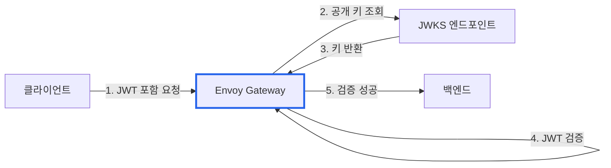
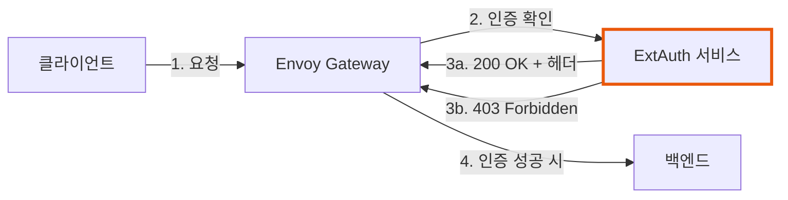
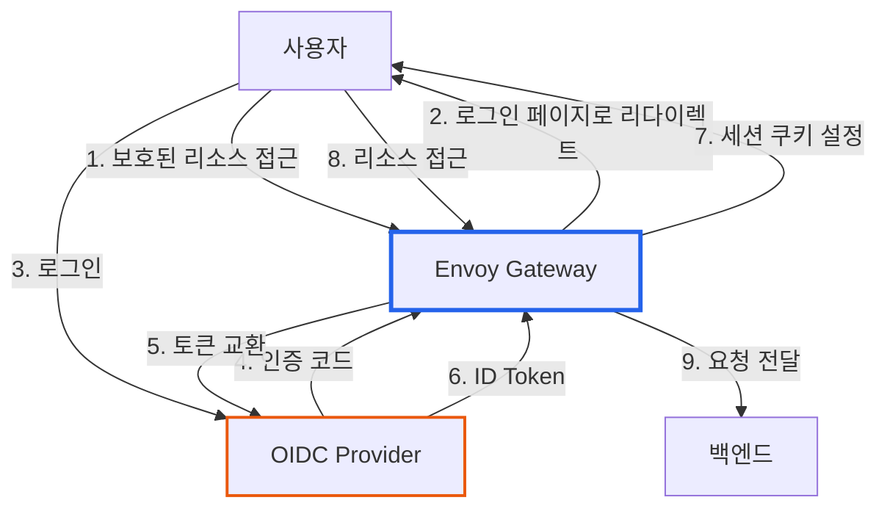

# Envoy Gateway 보안: 인증/인가 완벽 가이드

> **작성일**: 2026년 1월 2일
> **카테고리**: Kubernetes, API Gateway, Security
> **키워드**: Envoy Gateway, SecurityPolicy, JWT, OIDC, ExtAuth, CORS, API Key
> **시리즈**: Envoy Gateway 완벽 가이드 (4/6)

## 요약

Envoy Gateway의 SecurityPolicy는 API 보안의 핵심이다. JWT 검증, OIDC 인증, 외부 인증 서비스, API Key, CORS 등 다양한 인증/인가 메커니즘을 선언적으로 설정할 수 있다. 이 글에서는 각 인증 방식의 동작 원리와 실전 설정 예제를 다룬다.

## SecurityPolicy 인증 흐름

SecurityPolicy는 요청이 백엔드에 도달하기 전에 **인증 검증**을 수행한다.


## JWT 인증

### JWT란?

JWT(JSON Web Token)는 당사자 간 정보를 안전하게 전송하기 위한 개방형 표준(RFC 7519)이다. 토큰 자체에 사용자 정보가 포함되어 있어 별도 세션 저장소가 필요 없다.

### JWKS(JSON Web Key Set)

JWT를 검증하려면 서명에 사용된 **공개 키**가 필요하다. JWKS는 이 키들을 JSON 형식으로 제공하는 엔드포인트다.



### 기본 설정: Remote JWKS

```yaml
apiVersion: gateway.envoyproxy.io/v1alpha1
kind: SecurityPolicy
metadata:
  name: jwt-auth
spec:
  targetRef:
    group: gateway.networking.k8s.io
    kind: HTTPRoute
    name: api-route
  jwt:
    providers:
    - name: auth0
      # JWKS 엔드포인트
      remoteJWKS:
        uri: https://my-tenant.auth0.com/.well-known/jwks.json
```

### 고급 설정: Claim을 헤더로 전달

JWT의 claim 값을 백엔드로 전달할 수 있다.

```yaml
apiVersion: gateway.envoyproxy.io/v1alpha1
kind: SecurityPolicy
metadata:
  name: jwt-with-claims
spec:
  targetRef:
    kind: HTTPRoute
    name: api-route
  jwt:
    providers:
    - name: my-provider
      remoteJWKS:
        uri: https://auth.example.com/.well-known/jwks.json
      # Claim을 헤더로 변환
      claimToHeaders:
      - claim: sub
        header: X-User-ID
      - claim: email
        header: X-User-Email
      - claim: "realm_access.roles"
        header: X-User-Roles
```

백엔드 서비스는 이 헤더를 읽어 사용자 정보를 활용할 수 있다:

```
X-User-ID: user123
X-User-Email: user@example.com
X-User-Roles: ["admin", "user"]
```

### Local JWKS (ConfigMap)

JWKS를 외부에서 가져오지 않고 직접 설정할 수 있다.

```yaml
apiVersion: v1
kind: ConfigMap
metadata:
  name: jwt-local-jwks
data:
  jwks: |
    {
      "keys": [{
        "kty": "RSA",
        "use": "sig",
        "alg": "RS256",
        "kid": "my-key-id",
        "n": "xOHb-i1WDfe...",
        "e": "AQAB"
      }]
    }
---
apiVersion: gateway.envoyproxy.io/v1alpha1
kind: SecurityPolicy
metadata:
  name: jwt-local
spec:
  targetRef:
    kind: HTTPRoute
    name: api-route
  jwt:
    providers:
    - name: local-provider
      localJWKS:
        type: ValueRef
        valueRef:
          group: ""
          kind: ConfigMap
          name: jwt-local-jwks
```

### 자체 서명 인증서 JWKS 연결

내부 인증 서버가 자체 서명 인증서를 사용하는 경우:

```yaml
apiVersion: gateway.envoyproxy.io/v1alpha1
kind: SecurityPolicy
metadata:
  name: jwt-self-signed
spec:
  targetRef:
    kind: HTTPRoute
    name: api-route
  jwt:
    providers:
    - name: internal-auth
      remoteJWKS:
        uri: https://auth.internal.com/.well-known/jwks.json
        backendRefs:
        - group: gateway.envoyproxy.io
          kind: Backend
          name: auth-backend
          port: 443
---
apiVersion: gateway.envoyproxy.io/v1alpha1
kind: Backend
metadata:
  name: auth-backend
spec:
  endpoints:
  - fqdn:
      hostname: auth.internal.com
      port: 443
---
apiVersion: gateway.networking.k8s.io/v1alpha3
kind: BackendTLSPolicy
metadata:
  name: auth-tls
spec:
  targetRefs:
  - group: gateway.envoyproxy.io
    kind: Backend
    name: auth-backend
  validation:
    caCertificateRefs:
    - name: auth-ca-cert
      group: ""
      kind: ConfigMap
    hostname: auth.internal.com
```

## External Authorization (ExtAuth)

### ExtAuth란?

ExtAuth는 인증/인가 로직을 **외부 서비스**에 위임하는 패턴이다. 복잡한 비즈니스 로직이나 기존 인증 시스템과의 통합에 적합하다.



### HTTP ExtAuth

```yaml
apiVersion: gateway.envoyproxy.io/v1alpha1
kind: SecurityPolicy
metadata:
  name: http-ext-auth
spec:
  targetRef:
    kind: HTTPRoute
    name: api-route
  extAuth:
    http:
      backendRefs:
      - name: auth-service
        port: 9001
      # ExtAuth 서비스로 전달할 헤더
      headersToExtAuth:
      - Authorization
      - X-Tenant-ID
      # 인증 성공 시 백엔드로 전달할 헤더
      headersToBackend:
      - X-User-ID
      - X-User-Roles
```

### gRPC ExtAuth

```yaml
apiVersion: gateway.envoyproxy.io/v1alpha1
kind: SecurityPolicy
metadata:
  name: grpc-ext-auth
spec:
  targetRef:
    kind: HTTPRoute
    name: api-route
  extAuth:
    grpc:
      backendRefs:
      - name: grpc-auth-service
        port: 9002
```

### ExtAuth 서비스 구현 예시 (Go)

```go
// HTTP ExtAuth 서비스 예시
func authHandler(w http.ResponseWriter, r *http.Request) {
    token := r.Header.Get("Authorization")

    // 토큰 검증 로직
    userID, roles, err := validateToken(token)
    if err != nil {
        w.WriteHeader(http.StatusForbidden)
        return
    }

    // 인증 성공 - 사용자 정보를 헤더로 반환
    w.Header().Set("X-User-ID", userID)
    w.Header().Set("X-User-Roles", strings.Join(roles, ","))
    w.WriteHeader(http.StatusOK)
}
```

## OIDC 인증

### OIDC란?

OIDC(OpenID Connect)는 OAuth 2.0 기반의 인증 표준이다. 사용자가 Google, Auth0, Keycloak 등의 Provider로 로그인하면, Gateway가 자동으로 인증 플로우를 처리한다.



### 기본 설정

```yaml
apiVersion: v1
kind: Secret
metadata:
  name: oidc-client-secret
type: Opaque
stringData:
  client-secret: your-client-secret-here
---
apiVersion: gateway.envoyproxy.io/v1alpha1
kind: SecurityPolicy
metadata:
  name: oidc-auth
spec:
  targetRef:
    kind: HTTPRoute
    name: web-app
  oidc:
    provider:
      issuer: "https://accounts.google.com"
    clientID: "your-client-id"
    clientSecret:
      name: "oidc-client-secret"
    # 리다이렉트 URL은 HTTPRoute와 일치해야 함
    redirectURL: "https://app.example.com/oauth2/callback"
    logoutPath: "/logout"
```

### 다중 도메인 쿠키 공유

여러 서브도메인에서 OIDC 세션을 공유하려면 `cookieDomain`을 설정한다.

```yaml
apiVersion: gateway.envoyproxy.io/v1alpha1
kind: SecurityPolicy
metadata:
  name: oidc-multi-domain
spec:
  targetRef:
    kind: Gateway
    name: my-gateway
  oidc:
    provider:
      issuer: "https://accounts.google.com"
    clientID: "your-client-id"
    clientSecret:
      name: "oidc-client-secret"
    redirectURL: "https://www.example.com/oauth2/callback"
    logoutPath: "/logout"
    # 서브도메인 간 쿠키 공유
    cookieDomain: "example.com"
```

### Keycloak 연동 (자체 서명 인증서)

```yaml
apiVersion: gateway.envoyproxy.io/v1alpha1
kind: SecurityPolicy
metadata:
  name: keycloak-oidc
spec:
  targetRef:
    kind: HTTPRoute
    name: web-app
  oidc:
    provider:
      issuer: "https://keycloak.internal.com/realms/master"
      authorizationEndpoint: "https://keycloak.internal.com/realms/master/protocol/openid-connect/auth"
      tokenEndpoint: "https://keycloak.internal.com/realms/master/protocol/openid-connect/token"
      backendRefs:
      - group: gateway.envoyproxy.io
        kind: Backend
        name: keycloak-backend
        port: 443
    clientID: "my-app"
    clientSecret:
      name: "keycloak-secret"
    redirectURL: "https://app.example.com/oauth2/callback"
    logoutPath: "/logout"
```

## API Key 인증

### API Key란?

API Key는 클라이언트를 식별하는 간단한 문자열이다. 서버 간 통신이나 공개 API 접근 제어에 주로 사용된다.

### 설정

```yaml
# API Key 저장용 Secret
apiVersion: v1
kind: Secret
metadata:
  name: api-keys
type: Opaque
stringData:
  # 클라이언트ID: API Key
  client-a: "sk_live_abc123"
  client-b: "sk_live_xyz789"
  mobile-app: "sk_live_mobile_456"
---
apiVersion: gateway.envoyproxy.io/v1alpha1
kind: SecurityPolicy
metadata:
  name: apikey-auth
spec:
  targetRef:
    kind: HTTPRoute
    name: api-route
  apiKeyAuth:
    credentialRefs:
    - group: ""
      kind: Secret
      name: api-keys
    extractFrom:
    # 헤더에서 추출
    - headers:
      - X-API-Key
      - Authorization
    # 쿼리 파라미터에서 추출
    - params:
      - api_key
```

### 테스트

```bash
# 헤더로 API Key 전달
curl -H "X-API-Key: sk_live_abc123" https://api.example.com/v1/users

# 쿼리 파라미터로 전달
curl "https://api.example.com/v1/users?api_key=sk_live_abc123"
```

## CORS 설정

### CORS란?

CORS(Cross-Origin Resource Sharing)는 브라우저가 다른 도메인의 리소스에 접근할 수 있도록 허용하는 메커니즘이다. 프론트엔드(app.example.com)가 백엔드 API(api.example.com)를 호출할 때 필요하다.

### SecurityPolicy로 설정

```yaml
apiVersion: gateway.envoyproxy.io/v1alpha1
kind: SecurityPolicy
metadata:
  name: cors-policy
spec:
  targetRef:
    kind: HTTPRoute
    name: api-route
  cors:
    # 허용할 Origin
    allowOrigins:
    - "https://app.example.com"
    - "https://*.example.com"  # 와일드카드
    # 허용할 HTTP 메서드
    allowMethods:
    - GET
    - POST
    - PUT
    - DELETE
    - OPTIONS
    # 허용할 요청 헤더
    allowHeaders:
    - Authorization
    - Content-Type
    - X-Request-ID
    # 노출할 응답 헤더
    exposeHeaders:
    - X-Rate-Limit-Remaining
    - X-Request-ID
    # Preflight 캐시 시간 (초)
    maxAge: 86400
    # 자격 증명 허용
    allowCredentials: true
```

### HTTPRoute 필터로 설정

```yaml
apiVersion: gateway.networking.k8s.io/v1
kind: HTTPRoute
metadata:
  name: api-route
spec:
  parentRefs:
  - name: eg
  rules:
  - backendRefs:
    - name: backend
      port: 8080
    filters:
    - type: CORS
      cors:
        allowOrigins:
        - "https://app.example.com"
        allowMethods:
        - GET
        - POST
        allowHeaders:
        - Authorization
```

## imprun 인증 모드 매핑

imprun apigateway의 인증 설정이 SecurityPolicy로 어떻게 변환되는지 정리한다.

| imprun auth_mode | SecurityPolicy 필드 | 비고 |
|-----------------|---------------------|------|
| `jwt` | `.spec.jwt` | JWKS URL 필요 |
| `apikey` | `.spec.apiKeyAuth` 또는 `.spec.extAuth` | 단순 검증은 apiKeyAuth, 복잡한 로직은 ExtAuth |
| `oidc` | `.spec.oidc` | Provider 연동 필요 |
| `basic` | `.spec.basicAuth` | htpasswd Secret 참조 |
| `none` | 정책 미적용 | HTTPRoute에 SecurityPolicy 없음 |

### 변환 예시

**imprun 설정:**
```json
{
  "route": "/api/v1/*",
  "auth_mode": "jwt",
  "auth_config": {
    "jwks_uri": "https://auth.example.com/.well-known/jwks.json",
    "claim_to_headers": {
      "sub": "X-User-ID",
      "tenant_id": "X-Tenant-ID"
    }
  }
}
```

**생성되는 SecurityPolicy:**
```yaml
apiVersion: gateway.envoyproxy.io/v1alpha1
kind: SecurityPolicy
metadata:
  name: route-api-v1-auth
  namespace: tenant-abc
spec:
  targetRef:
    kind: HTTPRoute
    name: api-v1
  jwt:
    providers:
    - name: default
      remoteJWKS:
        uri: https://auth.example.com/.well-known/jwks.json
      claimToHeaders:
      - claim: sub
        header: X-User-ID
      - claim: tenant_id
        header: X-Tenant-ID
```

## 디버깅 가이드

### 인증 실패 시 확인 사항

| 증상 | 원인 | 해결책 |
|-----|------|-------|
| `401 Jwt is missing` | JWT 누락 | Authorization 헤더 확인 |
| `401 Jwt verification fails` | JWT 서명 불일치 | JWKS URI, 토큰 발급자 확인 |
| `403 RBAC: access denied` | 인가 규칙 불일치 | Authorization 규칙 확인 |
| `503 Service Unavailable` | ExtAuth 서비스 다운 | ExtAuth 서비스 상태 확인 |

### SecurityPolicy 상태 확인

```bash
kubectl get securitypolicy my-policy -o yaml

# 예상 출력
status:
  conditions:
  - type: Accepted
    status: "True"
  - type: Programmed
    status: "True"
```

## 다음 글 미리보기

[Envoy Gateway 트래픽 관리](https://blog.imprun.dev/110)에서는 Rate Limiting, Circuit Breaker, Load Balancing을 다룬다.

## 참고 자료

### 공식 문서
- [SecurityPolicy API Reference](https://gateway.envoyproxy.io/docs/api/extension_types/#securitypolicy)
- [JWT Authentication](https://gateway.envoyproxy.io/docs/tasks/security/jwt-authentication/)
- [External Authorization](https://gateway.envoyproxy.io/docs/tasks/security/ext-auth/)
- [OIDC Authentication](https://gateway.envoyproxy.io/docs/tasks/security/oidc/)

### 관련 블로그
- [Envoy Gateway 확장 API: Policy Attachment 모델](https://blog.imprun.dev/108)
- [Ory 스택 완전 가이드](https://blog.imprun.dev/91)

---

## 시리즈 네비게이션

| 이전 글 | 다음 글 |
|--------|--------|
| [확장 API: Policy Attachment 모델](https://blog.imprun.dev/108) | [트래픽 관리: Rate Limiting, Circuit Breaker](https://blog.imprun.dev/110) |

**Envoy Gateway 완벽 가이드 시리즈**
1. [Envoy Gateway 개요](https://blog.imprun.dev/106)
2. [Gateway API 핵심 리소스](https://blog.imprun.dev/107)
3. [확장 API](https://blog.imprun.dev/108)
4. **보안: 인증/인가 완벽 가이드** ← 현재 글
5. [트래픽 관리](https://blog.imprun.dev/110)
6. [확장성](https://blog.imprun.dev/111)