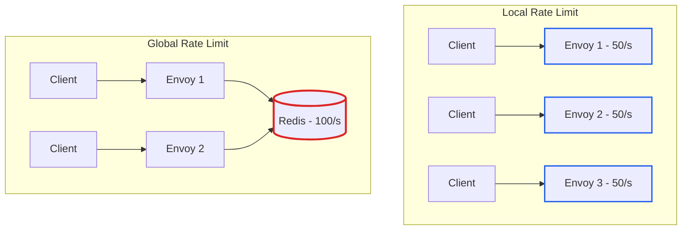
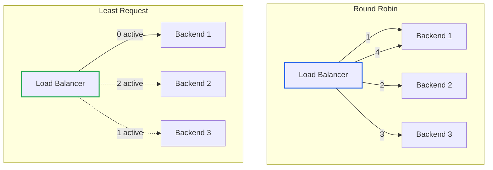

# Envoy Gateway 트래픽 관리: Rate Limiting, Circuit Breaker, Load Balancing

> **작성일**: 2026년 1월 2일
> **카테고리**: Kubernetes, API Gateway, Traffic Management
> **키워드**: Envoy Gateway, BackendTrafficPolicy, Rate Limit, Circuit Breaker, Load Balancing
> **시리즈**: Envoy Gateway 완벽 가이드 (5/6)

## 요약

BackendTrafficPolicy는 Gateway에서 백엔드로 흐르는 트래픽을 제어한다. Rate Limiting(속도 제한), Circuit Breaker(서킷 브레이커), Load Balancing(로드 밸런싱), Retry(재시도), Timeout(타임아웃) 등 탄력적인 시스템 구축에 필수적인 기능을 제공한다. 이 글에서는 각 기능의 동작 원리와 실전 설정을 다룬다.

## Rate Limiting (속도 제한)

### Rate Limiting이란?

Rate Limiting은 일정 시간 동안 허용되는 요청 수를 제한하는 기술이다. DDoS 방어, 백엔드 보호, API 사용량 관리에 필수다.

### Local vs Global Rate Limit

| 구분 | Local Rate Limit | Global Rate Limit |
|-----|------------------|-------------------|
| **범위** | Envoy 인스턴스별 | 전체 Envoy 클러스터 |
| **외부 의존성** | 없음 | Redis 필요 |
| **정확도** | 인스턴스 수에 따라 분산 | 정확한 전역 제한 |
| **지연시간** | 낮음 | Redis 조회 비용 |



### Local Rate Limit 설정

외부 서비스 없이 각 Envoy 인스턴스에서 독립적으로 제한한다.

```yaml
apiVersion: gateway.envoyproxy.io/v1alpha1
kind: BackendTrafficPolicy
metadata:
  name: local-ratelimit
spec:
  targetRef:
    group: gateway.networking.k8s.io
    kind: HTTPRoute
    name: api-route
  rateLimit:
    type: Local
    local:
      rules:
      - limit:
          requests: 100
          unit: Minute
```

**Envoy가 3개 인스턴스라면**: 각 인스턴스가 100req/min을 허용하므로, 이론적 최대치는 300req/min이다.

### Global Rate Limit 설정

Redis를 통해 전체 클러스터에서 공유되는 제한을 적용한다.

**1. Redis 설치**
```yaml
apiVersion: apps/v1
kind: Deployment
metadata:
  name: redis
  namespace: redis-system
spec:
  replicas: 1
  selector:
    matchLabels:
      app: redis
  template:
    metadata:
      labels:
        app: redis
    spec:
      containers:
      - name: redis
        image: redis:7
        ports:
        - containerPort: 6379
---
apiVersion: v1
kind: Service
metadata:
  name: redis
  namespace: redis-system
spec:
  ports:
  - port: 6379
  selector:
    app: redis
```

**2. Envoy Gateway 설정**
```yaml
apiVersion: v1
kind: ConfigMap
metadata:
  name: envoy-gateway-config
  namespace: envoy-gateway-system
data:
  envoy-gateway.yaml: |
    apiVersion: gateway.envoyproxy.io/v1alpha1
    kind: EnvoyGateway
    rateLimit:
      backend:
        type: Redis
        redis:
          url: redis.redis-system.svc.cluster.local:6379
```

**3. BackendTrafficPolicy 적용**
```yaml
apiVersion: gateway.envoyproxy.io/v1alpha1
kind: BackendTrafficPolicy
metadata:
  name: global-ratelimit
spec:
  targetRef:
    kind: HTTPRoute
    name: api-route
  rateLimit:
    type: Global
    global:
      rules:
      - limit:
          requests: 100
          unit: Second
```

### 고급 Rate Limit: Client Selector

특정 조건에 따라 다른 제한을 적용할 수 있다.

**IP 기반 제한**
```yaml
rateLimit:
  type: Global
  global:
    rules:
    - clientSelectors:
      - sourceCIDR:
          type: Distinct  # IP별로 개별 버킷
          value: "0.0.0.0/0"
      limit:
        requests: 10
        unit: Second
```

**헤더 기반 제한**
```yaml
rateLimit:
  type: Global
  global:
    rules:
    # Premium 사용자: 1000 req/min
    - clientSelectors:
      - headers:
        - name: X-User-Tier
          value: premium
      limit:
        requests: 1000
        unit: Minute
    # 일반 사용자: 100 req/min
    - clientSelectors:
      - headers:
        - name: X-User-Tier
          value: free
      limit:
        requests: 100
        unit: Minute
```

### Local + Global 조합

계층화된 보호를 위해 둘을 함께 사용한다.

```yaml
apiVersion: gateway.envoyproxy.io/v1alpha1
kind: BackendTrafficPolicy
metadata:
  name: combined-ratelimit
spec:
  targetRef:
    kind: HTTPRoute
    name: api-route
  rateLimit:
    # Local: 각 인스턴스별 급격한 스파이크 방지
    type: Local
    local:
      rules:
      - limit:
          requests: 50
          unit: Second
    # Global: 전체 클러스터 제한
    global:
      rules:
      - limit:
          requests: 100
          unit: Minute
```

**흐름**:
1. 요청이 Local 제한 통과 (인스턴스별 50/s)
2. 요청이 Global 제한 통과 (전체 100/min)
3. 둘 다 통과해야 백엔드 도달

## Circuit Breaker (서킷 브레이커)

### Circuit Breaker란?

Circuit Breaker는 백엔드 장애 시 **빠르게 실패**하여 시스템 전체 장애를 방지한다. 과부하 시 요청을 차단하여 리소스 낭비를 막는다.


### Circuit Breaker 임계값

| 설정 | 설명 | 권장 값 |
|-----|------|--------|
| `maxConnections` | 최대 동시 연결 수 | 백엔드 용량에 따라 |
| `maxPendingRequests` | 대기 요청 수 | 0~100 |
| `maxParallelRequests` | 동시 처리 요청 수 | 백엔드 처리량 기준 |

### 설정 예제

```yaml
apiVersion: gateway.envoyproxy.io/v1alpha1
kind: BackendTrafficPolicy
metadata:
  name: circuit-breaker
spec:
  targetRef:
    kind: HTTPRoute
    name: api-route
  circuitBreaker:
    maxConnections: 100
    maxPendingRequests: 10
    maxParallelRequests: 100
```

### 동작 테스트

**정상 상태**:
```
100개 동시 요청 → 모두 백엔드로 전달
```

**백엔드 지연 발생 시**:
```
1. 100개 요청이 동시에 진행 중 (maxParallelRequests 도달)
2. 11번째 대기 요청 → 503 Service Unavailable (maxPendingRequests 초과)
3. 빠른 실패로 클라이언트 즉시 응답, 백엔드 부하 방지
```

```bash
# hey 도구로 테스트
hey -n 100 -c 100 -host "www.example.com" http://${GATEWAY_HOST}/?delay=10s

# 결과: 90개 요청이 빠르게 실패, 10개만 백엔드 도달
```

## Load Balancing (로드 밸런싱)

### 로드 밸런싱이란?

로드 밸런싱은 요청을 여러 백엔드에 분산하여 가용성과 성능을 높인다.

### 지원 알고리즘

| 알고리즘 | 설명 | 적합한 상황 |
|---------|------|------------|
| **Least Request** | 활성 요청이 가장 적은 백엔드 | 기본값, 대부분의 경우 |
| **Round Robin** | 순차적으로 분배 | 균일한 요청 처리 시간 |
| **Random** | 무작위 선택 | 단순한 분산 |
| **Consistent Hash** | 해시 기반 고정 라우팅 | 세션 친화도 필요 시 |



### Round Robin 설정

```yaml
apiVersion: gateway.envoyproxy.io/v1alpha1
kind: BackendTrafficPolicy
metadata:
  name: round-robin
spec:
  targetRef:
    kind: HTTPRoute
    name: api-route
  loadBalancer:
    type: RoundRobin
```

### Consistent Hash (세션 친화도)

같은 클라이언트의 요청을 항상 같은 백엔드로 라우팅한다.

```yaml
apiVersion: gateway.envoyproxy.io/v1alpha1
kind: BackendTrafficPolicy
metadata:
  name: consistent-hash
spec:
  targetRef:
    kind: HTTPRoute
    name: stateful-app
  loadBalancer:
    type: ConsistentHash
    consistentHash:
      type: SourceIP  # 또는 Header
      # Header 사용 시
      # header:
      #   name: X-User-ID
```

## Retry (재시도)

### Retry란?

일시적인 오류 발생 시 자동으로 요청을 재시도한다. 네트워크 불안정이나 일시적 백엔드 오류에 효과적이다.

### 설정 예제

```yaml
apiVersion: gateway.envoyproxy.io/v1alpha1
kind: BackendTrafficPolicy
metadata:
  name: retry-policy
spec:
  targetRef:
    kind: HTTPRoute
    name: api-route
  retry:
    numRetries: 3
    perRetry:
      backOff:
        baseInterval: 100ms
        maxInterval: 1s
      timeout: 5s
    retryOn:
      triggers:
      - "5xx"           # 5xx 응답
      - "gateway-error" # 게이트웨이 오류
      - "reset"         # 연결 리셋
      - "connect-failure" # 연결 실패
```

### Retry 흐름

```
요청 → 5xx 응답 → 100ms 대기 → 재시도 1
    → 5xx 응답 → 200ms 대기 → 재시도 2
    → 5xx 응답 → 400ms 대기 → 재시도 3
    → 5xx 응답 → 클라이언트에 실패 반환
```

## Timeout (타임아웃)

### 타임아웃 종류

| 타임아웃 | 설명 |
|---------|------|
| `connectTimeout` | 백엔드 연결 수립 시간 |
| `requestTimeout` | 전체 요청 처리 시간 |
| `idleTimeout` | 유휴 연결 유지 시간 |

### 설정 예제

```yaml
apiVersion: gateway.envoyproxy.io/v1alpha1
kind: BackendTrafficPolicy
metadata:
  name: timeout-policy
spec:
  targetRef:
    kind: HTTPRoute
    name: api-route
  timeout:
    tcp:
      connectTimeout: 5s
    http:
      requestTimeout: 30s
      maxConnectionDuration: 1h
```

## 통합 설정 예제

실전에서 사용하는 복합 정책 예시:

```yaml
apiVersion: gateway.envoyproxy.io/v1alpha1
kind: BackendTrafficPolicy
metadata:
  name: production-policy
spec:
  targetRef:
    kind: HTTPRoute
    name: api-route

  # 로드 밸런싱
  loadBalancer:
    type: LeastRequest

  # 속도 제한
  rateLimit:
    type: Local
    local:
      rules:
      - limit:
          requests: 1000
          unit: Minute

  # 서킷 브레이커
  circuitBreaker:
    maxConnections: 200
    maxPendingRequests: 50
    maxParallelRequests: 200

  # 재시도
  retry:
    numRetries: 2
    perRetry:
      backOff:
        baseInterval: 50ms
        maxInterval: 500ms
    retryOn:
      triggers:
      - "5xx"
      - "reset"

  # 타임아웃
  timeout:
    tcp:
      connectTimeout: 3s
    http:
      requestTimeout: 15s

  # TCP Keepalive
  tcpKeepalive:
    probes: 3
    idleTime: 60s
    interval: 10s
```

## imprun 트래픽 설정 매핑

| imprun 설정 | BackendTrafficPolicy 필드 |
|------------|--------------------------|
| `rate_limit.requests` | `.spec.rateLimit.local.rules[].limit.requests` |
| `rate_limit.window` | `.spec.rateLimit.local.rules[].limit.unit` |
| `retry.max_attempts` | `.spec.retry.numRetries` |
| `retry.backoff` | `.spec.retry.perRetry.backOff` |
| `timeout.request` | `.spec.timeout.http.requestTimeout` |
| `timeout.connect` | `.spec.timeout.tcp.connectTimeout` |
| `circuit_breaker.max_connections` | `.spec.circuitBreaker.maxConnections` |
| `load_balancing` | `.spec.loadBalancer.type` |

## 다음 글 미리보기

[Envoy Gateway 확장성](https://blog.imprun.dev/111)에서는 External Processing, WASM, Lua를 다룬다.

## 참고 자료

### 공식 문서
- [Rate Limiting](https://gateway.envoyproxy.io/docs/concepts/rate-limiting/)
- [Circuit Breaker](https://gateway.envoyproxy.io/docs/tasks/traffic/circuit-breaker/)
- [Load Balancing](https://gateway.envoyproxy.io/docs/concepts/load-balancing/)
- [Global Rate Limit](https://gateway.envoyproxy.io/docs/tasks/traffic/global-rate-limit/)

### 관련 블로그
- [Envoy Gateway 확장 API](https://blog.imprun.dev/108)
- [Envoy Gateway 보안](https://blog.imprun.dev/109)

---

## 시리즈 네비게이션

| 이전 글 | 다음 글 |
|--------|--------|
| [보안: 인증/인가 완벽 가이드](https://blog.imprun.dev/109) | [확장성: ExtProc, WASM, Lua](https://blog.imprun.dev/111) |

**Envoy Gateway 완벽 가이드 시리즈**
1. [Envoy Gateway 개요](https://blog.imprun.dev/106)
2. [Gateway API 핵심 리소스](https://blog.imprun.dev/107)
3. [확장 API](https://blog.imprun.dev/108)
4. [보안](https://blog.imprun.dev/109)
5. **트래픽 관리: Rate Limiting, Circuit Breaker** ← 현재 글
6. [확장성](https://blog.imprun.dev/111)