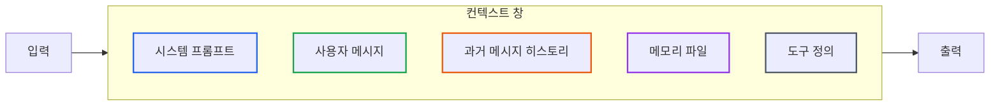
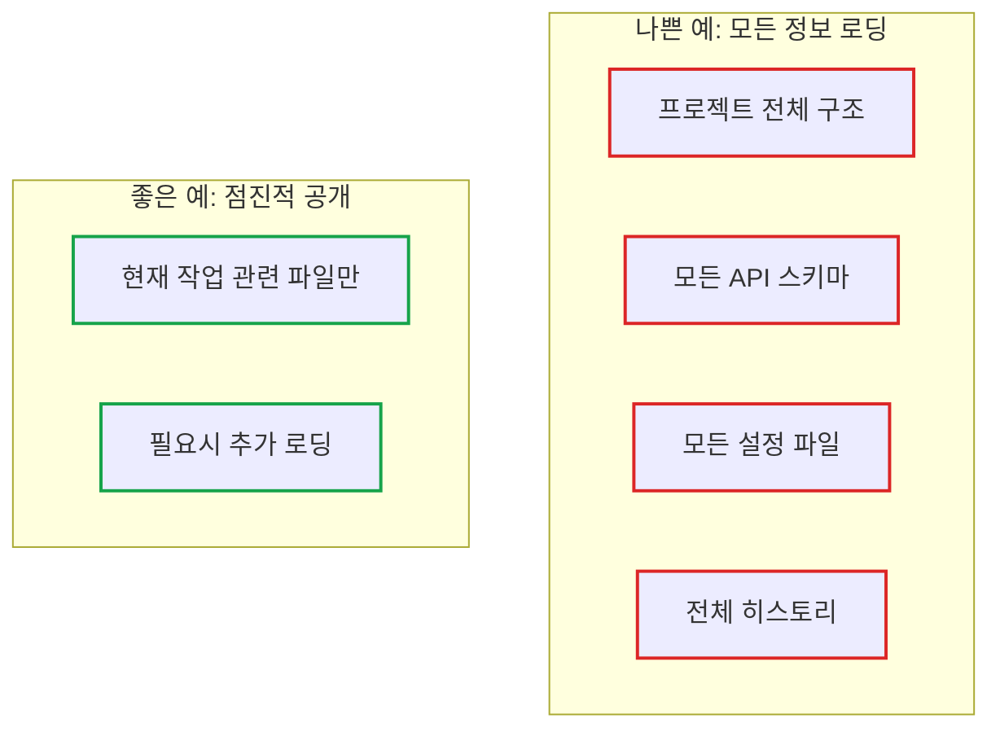
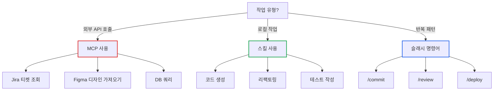
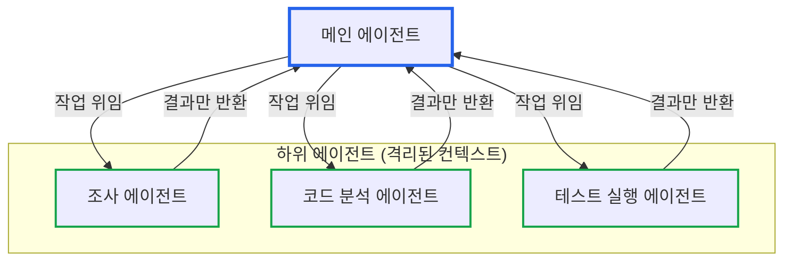
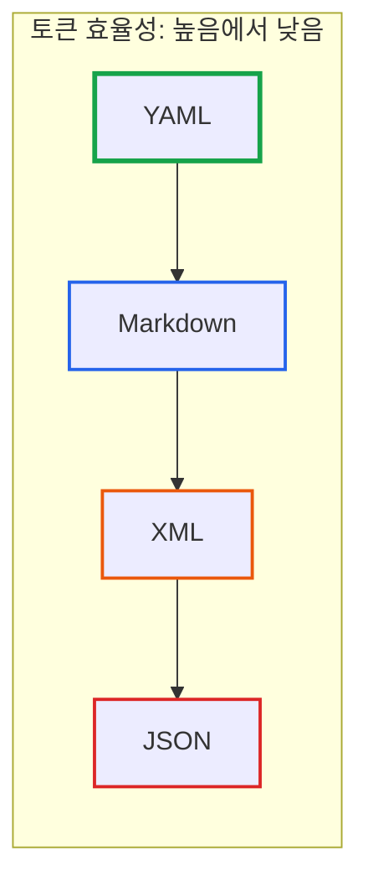

# 컨텍스트 창을 지배하는 자, AI 코딩을 지배한다

> **작성일**: 2026년 1월 6일
> **카테고리**: AI, LLM, Developer Productivity
> **키워드**: Context Window, AI Coding, Claude, MCP, Sub-agents, Token Efficiency

## 요약

AI 코딩 프레임워크를 사용해도 기대한 성능이 나오지 않는 경우가 많다. 근본 원인은 컨텍스트 창(Context Window) 관리에 있다. 이 글에서는 LLM의 컨텍스트 창 원리를 이해하고, 점진적 공개(Progressive Disclosure), 하위 에이전트 활용, 토큰 효율적인 파일 형식 선택 등 실전에서 검증된 최적화 전략을 다룬다.

## AI 코딩 프레임워크의 진짜 문제

BMAD, SpecKit 같은 AI 코딩 프레임워크가 넘쳐난다. 수백 명의 개발자들이 자신만의 워크플로우를 실험하고 공유하지만, 막상 적용해보면 기대한 성능이 나오지 않는 경우가 많다.

**문제의 원인은 프레임워크가 나빠서가 아니다.** 당신의 특정 사용 사례와 맞지 않기 때문이다.

대부분의 앱 개발이 그렇듯, 미리 만들어진 틀에 의존하기보다 직접 만드는 것이 더 효과적일 때가 많다. AI 코딩 워크플로우 역시 만들려는 프로젝트와 정확히 맞아떨어질 때 비로소 제대로 작동한다.

| 실패 원인 | 설명 |
|----------|------|
| 범용 설계 | 모든 상황에 맞추려다 어떤 상황에도 최적이 아님 |
| 컨텍스트 무시 | 프로젝트 특성을 고려하지 않음 |
| 도구 남용 | 필요 없는 기능까지 활성화 |

진정한 해답은 프레임워크를 "사용"하는 것을 넘어, 그 근간을 이루는 **원칙을 지배**하는 데 있다. 그 핵심이 바로 AI 모델의 뇌와도 같은 **컨텍스트 창**이다.

## 컨텍스트 창이란?

컨텍스트 창은 **모델이 한 번에 기억할 수 있는 정보의 양**이다. 인간의 작업 기억(working memory)과 유사하다. 이 범위를 벗어나는 정보는 모델의 "기억"에서 사라진다.



### 주요 모델의 컨텍스트 크기

| 모델 | 컨텍스트 창 | 비고 |
|------|-----------|------|
| Claude (Anthropic) | 200K 토큰 | 약 150,000 단어 |
| Gemini (Google) | 1M 토큰 | 가장 큼 |
| GPT-4 (OpenAI) | 128K 토큰 | - |

숫자만 보면 충분해 보이지만, 실제로는 다양한 요소가 이 공간을 점유한다:

- **시스템 프롬프트**: 모델의 행동 방식 정의
- **사용자 메시지**: 현재 요청
- **과거 대화 히스토리**: 이전 메시지들
- **메모리 파일**: CLAUDE.md, 프로젝트 문서 등
- **도구 정의**: MCP, 스킬 등의 스키마

이 공간을 **효율적으로 활용하는 방법**을 익혀야 AI 코딩의 성능을 끌어올릴 수 있다.

## 핵심 원칙 1: 점진적 공개 (Progressive Disclosure)

가장 중요한 원칙은 **점진적 공개**다. LLM에게 **당장 필요한 정보만** 공개하는 것이다.

"미래에 필요할지도 모르는" 정보로 컨텍스트 창을 채우는 것은 비효율적이다. 모델이 주의를 분산시키고, 정작 중요한 정보에 집중하지 못하게 된다.



### Claude의 스킬: 점진적 공개의 구현체

Claude Code의 **스킬(Skill)** 기능은 점진적 공개 원칙의 대표적인 구현체다.

모든 기능을 컨텍스트에 미리 로딩하는 대신, **각 스킬을 언제 사용해야 할지 알 수 있을 만큼의 정보**만 제공한다.

```yaml
# 스킬 정의 예시 - 전체 로직이 아닌 "언제 사용할지"만 명시
skills:
  - name: code-review
    trigger: "코드 리뷰 요청 시"
    description: "PR 또는 파일의 코드 품질을 검토"

  - name: test-generator
    trigger: "테스트 작성 요청 시"
    description: "함수에 대한 단위 테스트 생성"
```

스킬이 호출될 때 비로소 상세 프롬프트와 도구가 로딩된다.

## 핵심 원칙 2: MCP와 스킬의 올바른 구분

많은 개발자가 저지르는 실수는 **모든 것에 MCP를 사용**하는 것이다.

### MCP vs 스킬 사용 기준

| 상황 | 사용해야 할 것 | 이유 |
|------|--------------|------|
| 외부 데이터 필요 (Jira, Figma, DB) | **MCP** | 외부 시스템과 통신 필요 |
| 로컬 파일 조작, 코드 생성 | **스킬** | 외부 연결 불필요 |
| 반복적인 프롬프트 패턴 | **슬래시 명령어** | 재사용성 |



## 구조화된 노트 필기

당장 필요하지 않은 정보는 컨텍스트 창에 포함되어서는 안 된다. 하지만 중요한 정보를 잃어버려서도 안 된다. 해결책은 **구조화된 노트 필기**다.

```markdown
# decisions.md - 결정 사항 기록

## 2026-01-06: 인증 방식 결정
- 선택: JWT + Refresh Token
- 이유: Stateless 아키텍처 유지, 수평 확장 용이
- 대안 검토: 세션 기반 (Redis 의존성 우려로 제외)

## 2026-01-05: 데이터베이스 선택
- 선택: PostgreSQL
- 이유: JSON 지원, 트랜잭션 안정성
```

```markdown
# tech-debt.md - 기술 부채 기록

## 높음 우선순위
- [ ] 사용자 서비스 N+1 쿼리 최적화
- [ ] 결제 모듈 에러 핸들링 개선

## 낮음 우선순위
- [ ] 로깅 포맷 표준화
- [ ] 테스트 커버리지 80% 달성
```

에이전트는 필요할 때 이 파일들을 참조하여 **중요한 컨텍스트를 유지**할 수 있다.

## 주의 예산(Attention Budget)과 70%의 법칙

에이전트가 장시간 작업 중에 갑자기 멈추거나 이상한 답변을 내는 경우가 있다. 이는 **주의 예산 문제**일 가능성이 높다.

컨텍스트 창 사용량이 **70%를 초과**하면, 모델의 성능은 눈에 띄게 저하되기 시작한다. 이는 단순히 속도가 느려지는 문제가 아니다. AI 에이전트의 경우, 70% 임계치를 넘으면 **할당된 도구 사용을 완전히 멈춰** 전체 워크플로우를 탈선시키는 경우가 빈번하다.

### 컨텍스트 사용률과 성능

| 컨텍스트 사용률 | 상태 | 권장 조치 |
|----------------|------|----------|
| 0-50% | 정상 | 계속 작업 |
| 50-70% | 주의 | 불필요한 정보 정리 |
| **70-90%** | **위험** | **수동 압축 실행** |
| 90%+ | 자동 압축 | 이미 늦음 |

컨텍스트 창이 꽉 차면:
- 모델이 더 많이 "생각"해야 함
- **환각(hallucination)** 발생 확률 증가
- 도구 호출 실패
- 응답 품질 저하

### 주도적인 컨텍스트 관리

```bash
# 컨텍스트 70% 도달 시 수동으로 압축
/compact

# 새로운 작업 시작 시 컨텍스트 초기화
/clear

# 잘못된 방향으로 흘러간 대화는 되감기
# (불필요한 수정 요청으로 컨텍스트 낭비하지 않기)
```

**시스템이 컨텍스트 관리를 좌우하게 두지 말 것.** 90%까지 차서 자동 압축이 실행되기를 기다리는 대신, 70%를 기준으로 수동 압축을 통해 주도권을 선점하는 것이 전문 AI 워크플로우 설계자의 첫 번째 증표다.

## 하위 에이전트(Sub-agents) 활용

점진적 공개 원칙의 고급 활용은 **하위 에이전트**다.

하위 에이전트는 **자신만의 격리된 컨텍스트 창**에서 작업하고, 결과물만 메인 에이전트에게 보고한다.



### 하위 에이전트의 장점

| 장점 | 설명 |
|------|------|
| 컨텍스트 격리 | 도구 호출, 검색 결과가 메인 컨텍스트를 오염시키지 않음 |
| 병렬 처리 | 여러 작업을 동시에 수행 가능 |
| 전문화 | 각 에이전트가 특정 작업에 최적화 |

### 사용 예시

```
사용자: "React와 Vue의 상태 관리 방식을 비교해줘"

메인 에이전트:
  → 하위 에이전트 1: React 상태 관리 조사 (격리된 컨텍스트)
  → 하위 에이전트 2: Vue 상태 관리 조사 (격리된 컨텍스트)
  ← 각 에이전트에서 요약만 수신
  → 비교 분석 제공
```

조사 과정의 모든 중간 결과물이 메인 컨텍스트에 쌓이지 않으므로, **메인 에이전트는 깨끗한 상태를 유지**한다.

## 토큰 효율적인 파일 형식 선택

파일 형식에 따라 토큰 소비량이 다르다. 같은 정보라도 형식 선택에 따라 **컨텍스트 사용량이 달라진다**.

### 형식별 토큰 효율성



### 형식별 권장 용도

| 형식 | 토큰 효율 | 권장 용도 |
|------|----------|----------|
| **YAML** | 최고 | 데이터베이스 스키마, 설정 파일, 보안 정책 |
| **Markdown** | 높음 | 문서화, README, 가이드 |
| **XML** | 중간 | 제약 조건, 구조화된 지시문 (Claude 최적화) |
| **JSON** | 낮음 | API 응답 (불가피한 경우만) |

### 동일 정보의 형식별 비교

**YAML (권장)**
```yaml
database:
  type: postgresql
  host: localhost
  port: 5432
  name: myapp
```

**JSON (비권장)**
```json
{
  "database": {
    "type": "postgresql",
    "host": "localhost",
    "port": 5432,
    "name": "myapp"
  }
}
```

JSON은 괄호, 쉼표, 따옴표가 추가되어 **동일 정보에 더 많은 토큰을 소비**한다.

## Git 통합으로 진행 상황 추적

Git 커밋 히스토리를 **모델에게 진행 상황 알림**으로 활용할 수 있다.

### 커밋 히스토리 활용

```bash
# 최근 작업 내역을 컨텍스트로 제공
git log --oneline -10
```

모델이 이전에 무엇을 했는지 파악하여 **중복 작업을 방지**하고 **일관성을 유지**한다.

### Git Worktree로 병렬 처리

```bash
# 별도 브랜치에서 병렬 작업
git worktree add ../feature-auth feature/auth
git worktree add ../feature-payment feature/payment
```

각 worktree에서 별도의 에이전트가 독립적으로 작업할 수 있다.

## 슬래시 명령어로 워크플로우 표준화

반복적으로 사용하는 프롬프트는 **사용자 지정 슬래시 명령어**로 재사용한다.

### /commit 명령어 예시

```markdown
# .claude/commands/commit.md

커밋 메시지를 작성할 때 다음 규칙을 따르세요:

1. Conventional Commits 형식 사용
2. 제목은 50자 이내
3. 본문에 "왜" 이 변경이 필요한지 설명
4. 관련 이슈 번호 포함

커밋 전 사전 검사:
- [ ] 테스트 통과
- [ ] 린트 에러 없음
- [ ] 타입 체크 통과
```

### /review 명령어 예시

```markdown
# .claude/commands/review.md

코드 리뷰 시 다음 관점에서 검토하세요:

1. 보안 취약점 (OWASP Top 10)
2. 성능 이슈 (N+1, 메모리 누수)
3. 코드 컨벤션 준수
4. 테스트 커버리지

MCP를 사용하여 관련 Jira 티켓의 요구사항과 비교 검토하세요.
```

### MCP와 슬래시 명령어의 결합

슬래시 명령어의 진정한 힘은 **MCP와 결합**할 때 발휘된다.

```markdown
# .claude/commands/design-update.md

1. Figma MCP를 사용하여 최신 스타일 가이드를 가져오세요
2. 현재 코드베이스의 컴포넌트 스타일과 비교하세요
3. 변경이 필요한 부분을 식별하고 적용하세요
4. 변경 사항을 커밋하세요
```

`/design-update` 명령 하나로 디자인 변경 사항이 코드에 자동 반영되는 워크플로우가 완성된다. 이처럼 MCP를 슬래시 명령어에 포함시켜 **전체 워크플로우의 일부**로 만들 수 있다.

## 실전 체크리스트

### 컨텍스트 관리

- [ ] 점진적 공개 원칙 적용 (필요한 정보만 로딩)
- [ ] 컨텍스트 70% 도달 전 수동 압축
- [ ] 새 작업 시작 시 컨텍스트 초기화
- [ ] 구조화된 노트 파일로 중요 정보 외부화

### 도구 선택

- [ ] 외부 데이터만 MCP 사용
- [ ] 로컬 작업은 스킬 사용
- [ ] 반복 패턴은 슬래시 명령어

### 토큰 최적화

- [ ] 설정 파일은 YAML 형식
- [ ] 문서는 Markdown 형식
- [ ] JSON은 불가피한 경우만

### 에이전트 활용

- [ ] 조사 작업은 하위 에이전트 위임
- [ ] Git worktree로 병렬 작업
- [ ] 커밋 히스토리로 진행 상황 추적

## 결론: 컨텍스트 관리자가 되어라

이 글에서 다룬 모든 원칙은 하나의 결론으로 귀결된다.

**효과적인 AI 코딩의 핵심은 "컨텍스트 창을 얼마나 현명하게 관리하는가"에 달려 있다.**

| 원칙 | 핵심 |
|------|------|
| **70%의 법칙** | 컨텍스트 70% 도달 전 수동 압축 |
| **점진적 공개** | 필요한 정보만 필요할 때 제공 |
| **하위 에이전트** | 컨텍스트 오염 원천 차단 |
| **토큰 효율성** | YAML > Markdown > XML > JSON |
| **Git 통합** | 외부 기억장치로 활용 |

범용 프레임워크를 맹목적으로 따르는 것은 AI의 작업 공간을 남에게 맡기는 것이다. 당신은 이제 단순한 프롬프트 엔지니어를 넘어, AI의 작업 공간을 설계하고 지휘하는 **컨텍스트 관리자**가 될 준비를 마쳤다.

컨텍스트 창의 원리를 이해하면 어떤 AI 코딩 도구에서도 최적의 성능을 끌어낼 수 있다.

## 참고 자료

### Claude Code
- [Claude Code 공식 문서](https://docs.anthropic.com/claude-code)
- [Claude Code 베스트 프랙티스](https://blog.imprun.dev/83)

### 관련 블로그
- [Claude Code 컨텍스트 최적화 실전 가이드](https://blog.imprun.dev/103)
- [CLAUDE.md 공식 가이드 정리](https://blog.imprun.dev/82)
