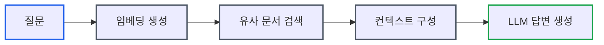
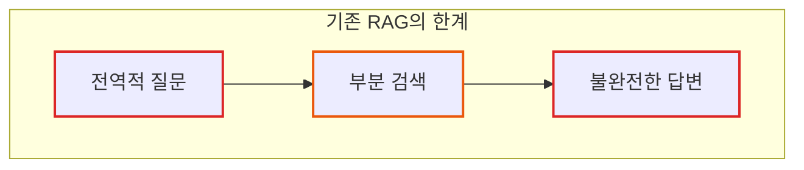
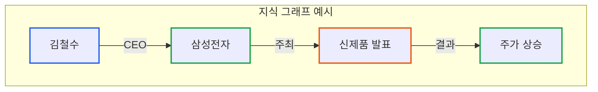
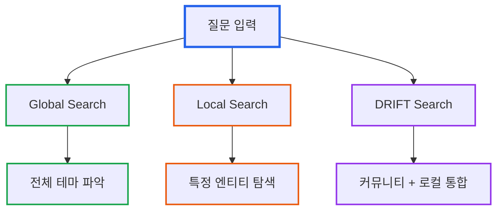

# GraphRAG 시리즈 Part 1: 기존 RAG의 한계와 GraphRAG의 탄생

> **작성일**: 2026년 1월 5일
> **카테고리**: AI, RAG, Knowledge Graph, LLM
> **키워드**: GraphRAG, RAG, Knowledge Graph, Microsoft Research, LLM

## 요약

RAG(Retrieval Augmented Generation)는 LLM이 학습하지 않은 데이터에 대해 답변할 수 있게 해주는 핵심 기술이다. 그러나 기존 RAG는 "데이터셋의 주요 테마는 무엇인가?"와 같은 전역적 질문에 실패한다. Microsoft Research가 개발한 GraphRAG는 지식 그래프와 계층적 클러스터링을 활용하여 이 문제를 해결한다. 이 시리즈에서는 GraphRAG의 동작 원리부터 실전 활용까지 다룬다.

## 기존 RAG의 동작 방식

RAG는 도서관의 사서와 같다. 질문을 받으면 관련 책(문서)을 찾아서 LLM에게 전달하고, LLM은 그 내용을 바탕으로 답변한다.



### 기존 RAG 파이프라인

1. **문서 분할**: 전체 문서를 일정 크기의 청크로 분할
2. **임베딩 생성**: 각 청크를 벡터로 변환
3. **벡터 저장**: 벡터 데이터베이스에 저장
4. **검색**: 질문과 유사한 벡터를 가진 청크 검색
5. **생성**: 검색된 청크를 컨텍스트로 LLM에 전달

```python
# 기존 RAG의 간략한 흐름
def traditional_rag(query: str, documents: list) -> str:
    # 1. 질문을 벡터로 변환
    query_embedding = embed(query)

    # 2. 유사한 문서 청크 검색
    relevant_chunks = vector_search(query_embedding, top_k=5)

    # 3. 컨텍스트로 LLM 호출
    context = "\n".join(relevant_chunks)
    response = llm.generate(f"Context: {context}\nQuestion: {query}")

    return response
```

## 기존 RAG가 실패하는 순간

기존 RAG는 **바늘 찾기(needle-in-haystack)** 유형의 질문에는 효과적이다. "A 회사의 CEO는 누구인가?"처럼 특정 정보를 찾는 질문이다.

그러나 다음과 같은 **전역적 질문**에는 실패한다:

| 질문 유형 | 예시 | 기존 RAG 성능 |
|----------|------|--------------|
| 전체 요약 | "이 데이터셋의 주요 테마는?" | 실패 |
| 관계 탐색 | "A와 B는 어떤 관계인가?" | 부분 성공 |
| 패턴 발견 | "반복되는 문제점은 무엇인가?" | 실패 |
| 종합 분석 | "가장 영향력 있는 인물은?" | 실패 |

### 실패 원인 1: 단절된 정보

기존 RAG는 검색된 청크들 사이의 **관계를 이해하지 못한다**.

```
청크 A: "김철수는 삼성전자 CEO이다."
청크 B: "삼성전자 CEO가 신제품을 발표했다."
청크 C: "신제품 발표 후 주가가 10% 상승했다."
```

질문: "김철수의 발표가 시장에 미친 영향은?"

기존 RAG는 세 청크를 모두 검색하더라도, 이들의 **인과관계**를 파악하지 못한다. 각 청크가 독립적으로 취급되기 때문이다.

### 실패 원인 2: 요약 불가능

"데이터셋의 주요 테마는 무엇인가?"라는 질문에 답하려면 **전체 문서를 읽어야 한다**. 하지만 기존 RAG는:

- 질문과 유사한 일부 청크만 검색
- 전체 맥락을 파악할 수 없음
- 주요 테마를 종합적으로 도출 불가



### 실패 원인 3: 멀티홉 추론 불가

여러 문서를 거쳐야 답을 얻을 수 있는 **멀티홉(multi-hop) 질문**에 취약하다.

```
문서 1: "A 회사는 B 회사에 소프트웨어를 공급한다."
문서 2: "B 회사는 C 회사의 자회사이다."
문서 3: "C 회사는 최근 파산했다."
```

질문: "A 회사의 공급망에 문제가 생길 가능성이 있는가?"

이 질문에 답하려면 A→B→C의 관계 체인을 따라가야 한다. 벡터 유사도 검색만으로는 이 연결고리를 찾기 어렵다.

## GraphRAG: 그래프로 점을 연결하다

GraphRAG는 **지식 그래프(Knowledge Graph)**를 활용하여 기존 RAG의 한계를 극복한다.

지식 그래프는 지하철 노선도와 같다. 각 역(엔티티)이 어떤 노선(관계)으로 연결되어 있는지 한눈에 파악할 수 있다.



### GraphRAG의 핵심 아이디어

1. **엔티티 추출**: LLM이 문서에서 인물, 조직, 장소 등을 식별
2. **관계 추출**: 엔티티 간의 관계를 파악
3. **그래프 구축**: 엔티티와 관계로 지식 그래프 생성
4. **커뮤니티 탐지**: 밀접하게 연결된 엔티티 그룹 식별
5. **계층적 요약**: 각 커뮤니티에 대한 요약 사전 생성

### 기존 RAG vs GraphRAG

| 측면 | 기존 RAG | GraphRAG |
|------|---------|----------|
| 인덱싱 | 벡터 임베딩 | 지식 그래프 + 커뮤니티 요약 |
| 검색 | 벡터 유사도 | 그래프 탐색 + 벡터 검색 |
| 전역 질문 | 실패 | 커뮤니티 요약 활용 |
| 관계 탐색 | 제한적 | 그래프 구조 활용 |
| 비용 | 낮음 | 높음 (인덱싱 비용) |

## Microsoft Research의 실험 결과

Microsoft Research는 약 **100만 토큰** 규모의 데이터셋에서 GraphRAG와 기존 RAG를 비교했다.

### 평가 지표

1. **포괄성(Comprehensiveness)**: 답변이 질문의 모든 측면을 다루는가?
2. **다양성(Diversity)**: 답변이 다양한 관점을 제공하는가?
3. **충실도(Faithfulness)**: 답변이 소스 문서에 충실한가?

### 벤치마크 결과

팟캐스트 데이터셋 기준, GraphRAG는 기존 Vector RAG 대비 명확한 우위를 보였다:

| 평가 지표 | GraphRAG 승률 | 설명 |
|----------|--------------|------|
| **포괄성** | 72-83% | 질문의 모든 측면을 다루는 정도 |
| **다양성** | 75-82% | 다양한 관점 제공 정도 |
| **충실도** | 동등 | 소스 문서 충실도는 유사 |

다만 **간결성(Conciseness)**에서는 기존 RAG가 우위를 보여, 두 접근법 간의 트레이드오프가 존재한다. GraphRAG는 더 포괄적인 답변을 제공하지만, 그만큼 응답이 길어지는 경향이 있다.

특히 "데이터셋의 주요 테마는 무엇인가?"와 같은 **전역적 센스메이킹(sensemaking) 질문**에서 GraphRAG의 강점이 두드러졌다. 커뮤니티 레벨 0(최상위)은 소스 텍스트의 **2.6%** 토큰만으로 전체 데이터셋의 주요 테마를 요약할 수 있었다.

### VIINA 데이터셋 사례

우크라이나 관련 뉴스 데이터셋(VIINA)에서 "Novorossiya"에 관한 질문:

- **기존 RAG**: 답변 불가 (관련 청크를 찾지 못함)
- **GraphRAG**: 관련 엔티티와 관계를 통해 출처 근거와 함께 상세 답변 제공

## GraphRAG의 주요 검색 모드

GraphRAG는 질문 유형에 따라 다양한 검색 모드를 제공한다.



| 검색 모드 | 용도 | 특징 |
|----------|------|------|
| **Global Search** | 전체 데이터셋 분석 | 커뮤니티 요약 활용 |
| **Local Search** | 특정 엔티티 탐색 | 이웃 엔티티 + 원본 텍스트 |
| **DRIFT Search** | 복합 질문 | Global + Local 통합 |
| **Basic Search** | 단순 검색 | 기존 벡터 검색 방식 |

## 다음 편 예고

이번 글에서는 기존 RAG의 한계와 GraphRAG가 이를 어떻게 해결하는지 개념적으로 살펴보았다.

**Part 2: GraphRAG 아키텍처 심층 분석**에서는 다음 내용을 다룬다:

- 인덱싱 파이프라인 상세 구조
- 엔티티 및 관계 추출 과정
- Leiden 알고리즘을 활용한 커뮤니티 탐지
- 계층적 클러스터링과 요약 생성

## 참고 자료

### 공식 자료
- [Microsoft Research - Project GraphRAG](https://www.microsoft.com/en-us/research/project/graphrag/)
- [GraphRAG GitHub Repository](https://github.com/microsoft/graphrag)
- [GraphRAG 공식 문서](https://microsoft.github.io/graphrag/)

### 논문
- [From Local to Global: A Graph RAG Approach to Query-Focused Summarization (arXiv)](https://arxiv.org/abs/2404.16130)

### Microsoft Research 블로그
- [GraphRAG: Unlocking LLM discovery on narrative private data](https://www.microsoft.com/en-us/research/blog/graphrag-unlocking-llm-discovery-on-narrative-private-data/)
- [GraphRAG: New tool for complex data discovery now on GitHub](https://www.microsoft.com/en-us/research/blog/graphrag-new-tool-for-complex-data-discovery-now-on-github/)

---

## GraphRAG 시리즈 네비게이션

| 순서 | 제목 |
|------|------|
| **현재** | Part 1: 기존 RAG의 한계와 GraphRAG의 탄생 |
| 다음 | [Part 2: 인덱싱 파이프라인과 지식 그래프 구축](https://blog.imprun.dev/113) |

**[다음 글: Part 2 →](https://blog.imprun.dev/113)**
