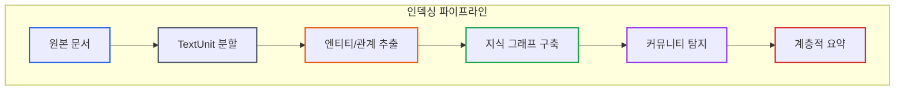
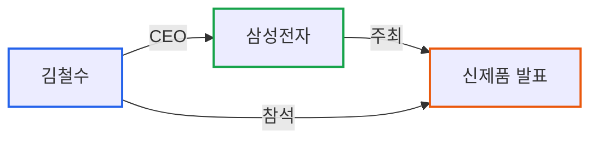
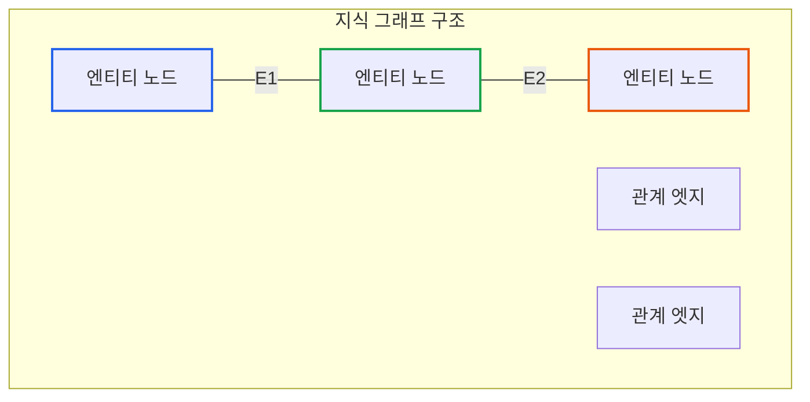
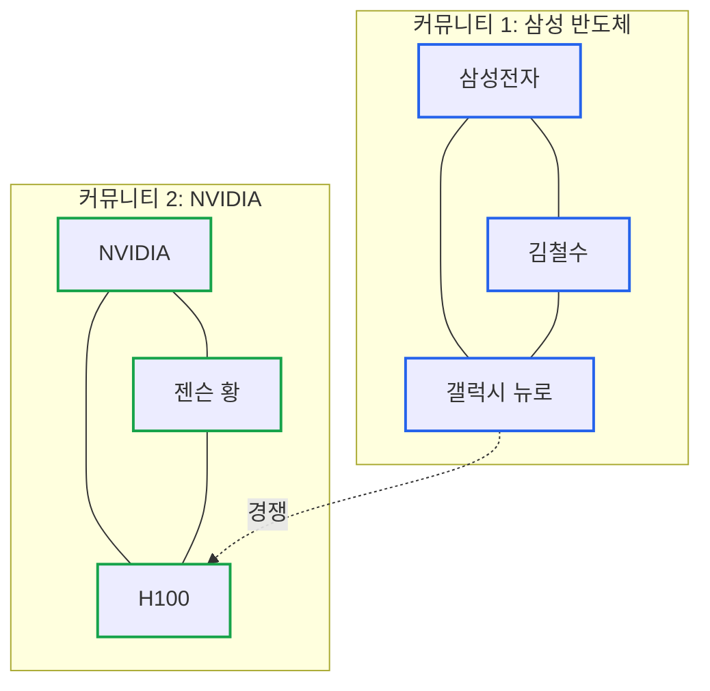
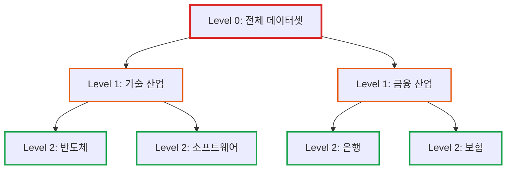
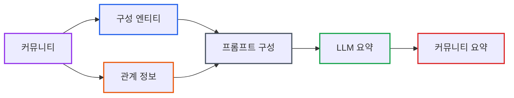
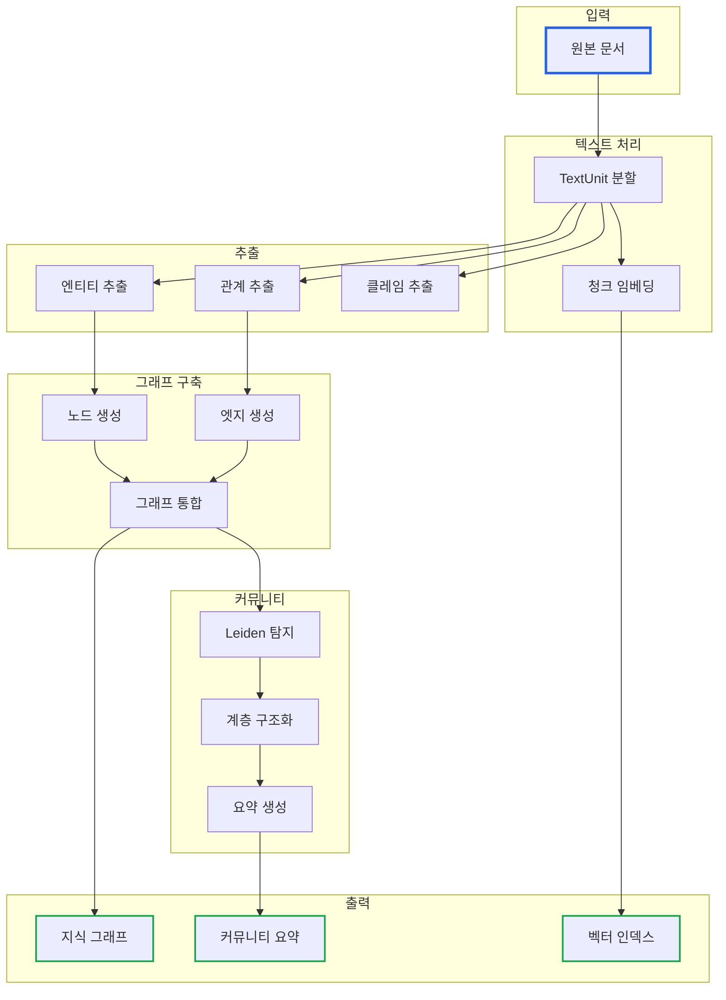

# GraphRAG 시리즈 Part 2: 인덱싱 파이프라인과 지식 그래프 구축

> **작성일**: 2026년 1월 5일
> **카테고리**: AI, RAG, Knowledge Graph, LLM
> **키워드**: GraphRAG, Indexing Pipeline, Knowledge Graph, Leiden Algorithm, Community Detection

## 요약

GraphRAG의 핵심은 인덱싱 단계에서 구축되는 지식 그래프와 계층적 커뮤니티 구조이다. 이 글에서는 TextUnit 분할부터 엔티티/관계 추출, Leiden 알고리즘을 활용한 커뮤니티 탐지, 그리고 계층적 요약 생성까지 전체 인덱싱 파이프라인을 상세히 분석한다.

## 인덱싱 파이프라인 개요

GraphRAG의 인덱싱은 원본 문서를 **쿼리 가능한 지식 구조**로 변환하는 과정이다. 이 과정은 일반 RAG보다 복잡하고 비용이 많이 들지만, 쿼리 시점의 성능을 크게 향상시킨다.



## 1단계: TextUnit 분할

**TextUnit**은 GraphRAG에서 분석의 최소 단위이다. 일반 RAG의 청크(chunk)와 유사하지만, 추후 세밀한 출처 추적을 위해 설계되었다.

### TextUnit의 역할

| 역할 | 설명 |
|------|------|
| 분석 단위 | 엔티티/관계 추출의 입력 |
| 출처 추적 | 최종 답변에서 원본 위치 참조 |
| 임베딩 대상 | 벡터 검색을 위한 임베딩 생성 |

### 분할 전략

```python
# TextUnit 분할 예시 (개념적 코드)
def create_text_units(document: str, chunk_size: int = 300) -> list:
    """
    문서를 TextUnit으로 분할
    - chunk_size: 토큰 기준 분할 크기 (기본 300)
    - overlap: 컨텍스트 유지를 위한 중첩
    """
    text_units = []
    tokens = tokenize(document)

    for i in range(0, len(tokens), chunk_size):
        unit = {
            "id": generate_id(),
            "text": detokenize(tokens[i:i + chunk_size]),
            "document_id": document.id,
            "position": i
        }
        text_units.append(unit)

    return text_units
```

### 구성 옵션

GraphRAG 설정에서 TextUnit 관련 주요 옵션:

```yaml
chunks:
  size: 300          # 청크 크기 (토큰)
  overlap: 100       # 중첩 크기
  group_by_columns:  # 그룹핑 기준 컬럼
    - document_id
```

## 2단계: 엔티티 및 관계 추출

이 단계에서 LLM이 각 TextUnit을 분석하여 **엔티티(Entity)**와 **관계(Relationship)**를 추출한다.

### 엔티티란?

엔티티는 문서에서 식별된 고유한 객체이다. 주민등록증의 이름, 주소와 같이 문서에서 식별 가능한 정보라고 생각하면 된다.

| 엔티티 유형 | 예시 |
|------------|------|
| PERSON | 김철수, 일론 머스크 |
| ORGANIZATION | 삼성전자, Microsoft |
| LOCATION | 서울, 실리콘밸리 |
| EVENT | 신제품 발표, 분기 실적 발표 |
| CONCEPT | 인공지능, 블록체인 |

### 관계란?

관계는 두 엔티티 간의 연결이다. "김철수는 삼성전자의 CEO이다"에서 김철수와 삼성전자 사이의 "CEO" 관계가 추출된다.



### 추출 프롬프트 구조

GraphRAG는 LLM에게 구조화된 프롬프트를 전달하여 엔티티와 관계를 추출한다:

```
주어진 텍스트에서 다음을 추출하세요:

1. 모든 엔티티 (인물, 조직, 장소, 이벤트, 개념)
   - 이름
   - 유형
   - 설명

2. 엔티티 간의 관계
   - 소스 엔티티
   - 타겟 엔티티
   - 관계 설명
   - 강도 (1-10)

텍스트:
{text_unit.text}
```

### 추출 결과 예시

입력 텍스트:
```
삼성전자 CEO 김철수는 2024년 1월 서울 코엑스에서 열린 CES 2024에서
차세대 AI 칩 '갤럭시 뉴로'를 발표했다. 이 칩은 NVIDIA의 H100과
경쟁할 것으로 예상된다.
```

추출된 엔티티:
```json
[
  {"name": "김철수", "type": "PERSON", "description": "삼성전자 CEO"},
  {"name": "삼성전자", "type": "ORGANIZATION", "description": "한국 전자기업"},
  {"name": "CES 2024", "type": "EVENT", "description": "2024년 1월 서울 코엑스 개최"},
  {"name": "갤럭시 뉴로", "type": "PRODUCT", "description": "차세대 AI 칩"},
  {"name": "NVIDIA", "type": "ORGANIZATION", "description": "GPU 제조사"},
  {"name": "H100", "type": "PRODUCT", "description": "NVIDIA의 AI 칩"}
]
```

추출된 관계:
```json
[
  {"source": "김철수", "target": "삼성전자", "relation": "CEO", "strength": 10},
  {"source": "삼성전자", "target": "갤럭시 뉴로", "relation": "개발", "strength": 10},
  {"source": "김철수", "target": "CES 2024", "relation": "발표", "strength": 9},
  {"source": "갤럭시 뉴로", "target": "H100", "relation": "경쟁", "strength": 7}
]
```

### 엔티티 해소 (Entity Resolution)

동일한 엔티티가 다른 이름으로 언급될 수 있다:
- "삼성전자", "삼성", "Samsung Electronics"
- "일론 머스크", "Elon Musk", "머스크"

GraphRAG는 LLM을 활용하여 이러한 **엔티티 중복을 해소**한다.

## 3단계: 지식 그래프 구축

추출된 엔티티와 관계를 바탕으로 **지식 그래프**를 구축한다.

### 그래프 구조



### 노드(Node) 속성

각 엔티티 노드는 다음 정보를 포함한다:

| 속성 | 설명 |
|------|------|
| id | 고유 식별자 |
| name | 엔티티 이름 |
| type | 엔티티 유형 (PERSON, ORG 등) |
| description | LLM이 생성한 설명 |
| source_ids | 출처 TextUnit ID 목록 |

### 엣지(Edge) 속성

각 관계 엣지는 다음 정보를 포함한다:

| 속성 | 설명 |
|------|------|
| source | 소스 엔티티 ID |
| target | 타겟 엔티티 ID |
| description | 관계 설명 |
| weight | 관계 강도 (빈도, 중요도 기반) |
| source_ids | 출처 TextUnit ID 목록 |

## 4단계: 커뮤니티 탐지 (Leiden Algorithm)

지식 그래프가 구축되면, **Leiden 알고리즘**을 사용하여 밀접하게 연결된 엔티티 그룹인 **커뮤니티**를 탐지한다.

### 커뮤니티란?

커뮤니티는 회사의 부서와 같다. 같은 부서 사람들은 서로 자주 소통하고, 다른 부서와는 상대적으로 적게 소통한다. 그래프에서도 마찬가지로, 같은 커뮤니티의 노드들은 서로 많이 연결되어 있다.



### Leiden 알고리즘

Leiden 알고리즘은 Louvain 알고리즘의 개선 버전으로, 더 높은 품질의 커뮤니티를 탐지한다.

**동작 원리:**

1. 각 노드를 개별 커뮤니티로 시작
2. 노드를 이웃 커뮤니티로 이동시켜 모듈러리티(modularity) 최적화
3. 커뮤니티를 슈퍼노드로 집약
4. 변화가 없을 때까지 반복

**모듈러리티(Modularity)**: 커뮤니티 내부의 연결 밀도가 랜덤 그래프 대비 얼마나 높은지 측정하는 지표

### 계층적 커뮤니티 구조

Leiden 알고리즘은 **계층적(hierarchical)** 커뮤니티 구조를 생성한다:



| 레벨 | 설명 | 용도 |
|------|------|------|
| Level 0 | 가장 높은 수준의 테마 | Global Search |
| Level 1 | 중간 수준의 주제 | 주제별 요약 |
| Level 2+ | 세부적인 토픽 | 상세 분석 |

## 5단계: 커뮤니티 요약 생성

각 커뮤니티에 대해 LLM이 **요약(Summary)**을 생성한다. 이 요약은 쿼리 시점에 컨텍스트로 활용된다.

### 요약 생성 프로세스



### 요약 프롬프트 예시

```
다음 커뮤니티에 대한 포괄적인 요약을 작성하세요:

커뮤니티 이름: {community.title}

구성 엔티티:
{entities_list}

주요 관계:
{relationships_list}

요구사항:
- 이 커뮤니티의 주요 테마를 설명
- 핵심 엔티티와 그 역할을 언급
- 중요한 관계와 의미를 포함
- 200-300 단어로 작성
```

### 요약 예시

**커뮤니티**: 삼성 반도체 사업부

**구성 엔티티**: 삼성전자, 김철수 (CEO), 갤럭시 뉴로, 파운드리 사업, 메모리 사업

**생성된 요약**:
```
이 커뮤니티는 삼성전자의 반도체 사업을 중심으로 구성되어 있다.
삼성전자 CEO 김철수는 차세대 AI 칩 '갤럭시 뉴로' 개발을 주도하고
있으며, 이는 NVIDIA의 H100과 직접 경쟁할 것으로 예상된다.

삼성의 반도체 사업은 크게 메모리 반도체와 파운드리(위탁생산)로
나뉜다. 메모리 분야에서는 글로벌 1위를 유지하고 있으며, 파운드리
분야에서는 TSMC를 추격하고 있다.

갤럭시 뉴로는 삼성의 AI 반도체 시장 진출을 위한 핵심 제품으로,
2024년 CES에서 처음 공개되었다. 이 칩은 대규모 언어 모델(LLM)
추론에 최적화되어 있으며, 경쟁사 대비 전력 효율이 높은 것이
특징이다.
```

## 인덱싱 파이프라인 전체 흐름



## 인덱싱 비용 고려사항

GraphRAG 인덱싱은 **LLM 호출이 많아 비용이 높다**. 다음 요소가 비용에 영향을 미친다:

| 요소 | 영향 | 최적화 방법 |
|------|------|-------------|
| 문서 크기 | TextUnit 수 증가 | 불필요한 문서 제거 |
| LLM 모델 | 토큰당 비용 | 작은 모델로 추출, 큰 모델로 요약 |
| 추출 상세도 | 프롬프트 길이 | 프롬프트 튜닝 |
| 커뮤니티 수 | 요약 생성 횟수 | 적절한 해상도 설정 |

### 비용 추정 예시

100만 토큰 규모의 문서 세트를 인덱싱할 때:

```
TextUnit 수: ~3,300개 (300토큰/유닛)
엔티티 추출 호출: ~3,300회
관계 추출 호출: ~3,300회
커뮤니티 수 (예상): ~100개
요약 생성 호출: ~100회

총 LLM 호출: ~6,700회
예상 비용: $5-20 (모델에 따라 상이)
```

## 다음 편 예고

이번 글에서는 GraphRAG의 인덱싱 파이프라인을 상세히 분석했다.

**Part 3: GraphRAG 쿼리 모드 완벽 가이드**에서는 다음 내용을 다룬다:

- Global Search의 Map-Reduce 패턴
- Local Search의 엔티티 중심 탐색
- DRIFT Search의 하이브리드 접근
- 각 모드의 적합한 사용 시나리오

## 참고 자료

### 공식 문서
- [GraphRAG Indexing Overview](https://microsoft.github.io/graphrag/)
- [Configuration Reference](https://microsoft.github.io/graphrag/config/overview/)

### 알고리즘
- [Leiden Algorithm Paper](https://www.nature.com/articles/s41598-019-41695-z)
- [Community Detection in Networks](https://arxiv.org/abs/0906.0612)

### Microsoft Research
- [GraphRAG: Unlocking LLM discovery on narrative private data](https://www.microsoft.com/en-us/research/blog/graphrag-unlocking-llm-discovery-on-narrative-private-data/)

---

## GraphRAG 시리즈 네비게이션

| 순서 | 제목 |
|------|------|
| 이전 | [Part 1: 기존 RAG의 한계와 GraphRAG의 탄생](https://blog.imprun.dev/112) |
| **현재** | Part 2: 인덱싱 파이프라인과 지식 그래프 구축 |
| 다음 | [Part 3: 쿼리 모드 완벽 가이드](https://blog.imprun.dev/114) |

**[← Part 1](https://blog.imprun.dev/112)** | **[Part 3 →](https://blog.imprun.dev/114)**
