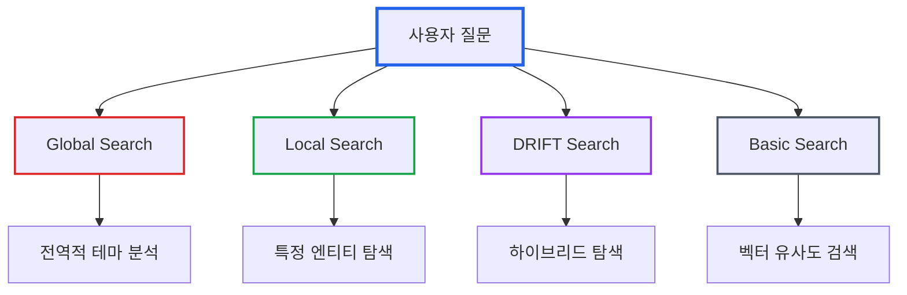
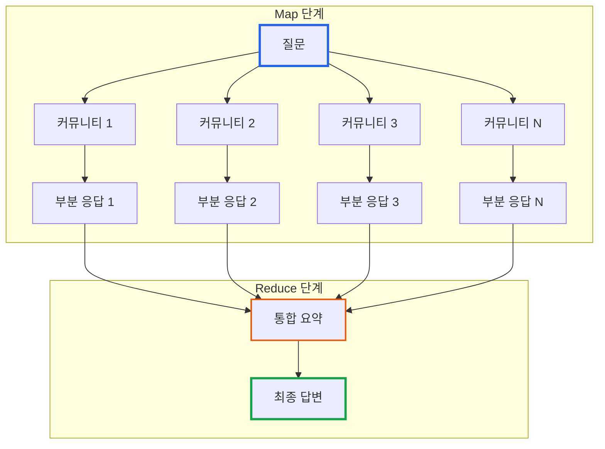
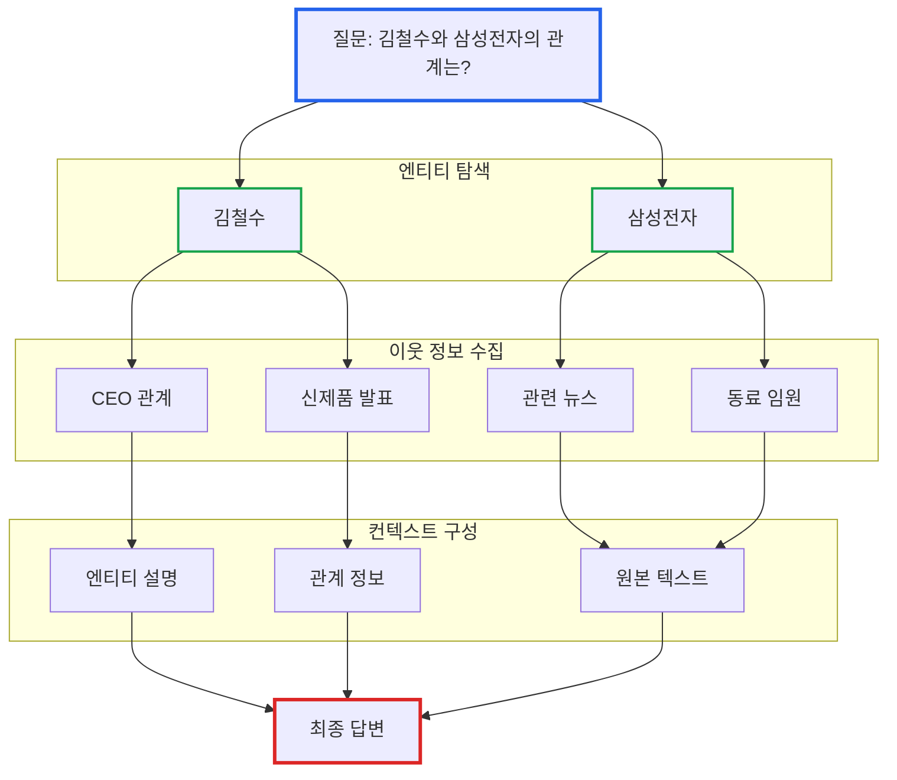
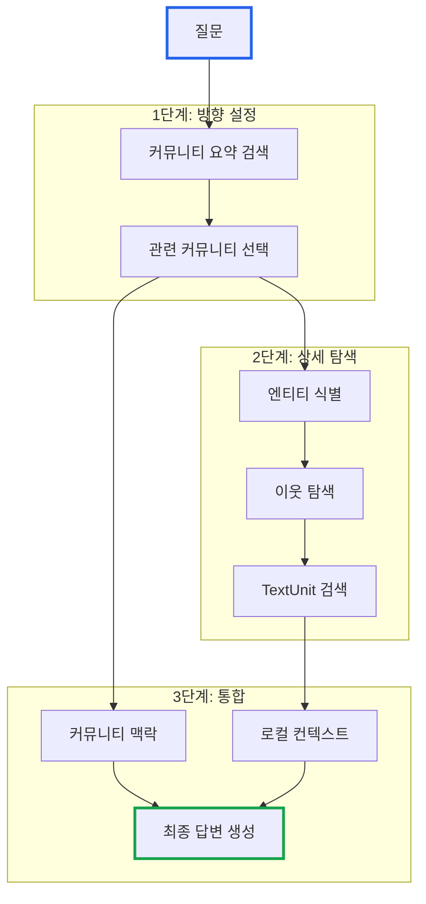
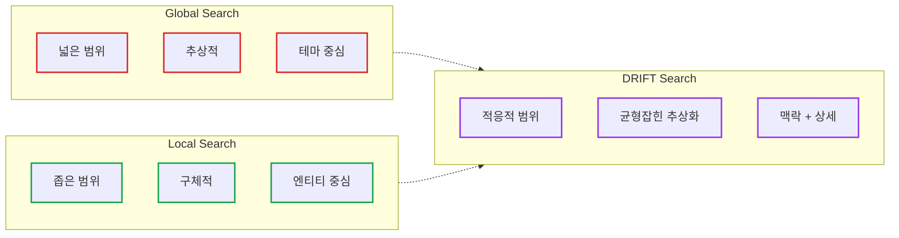
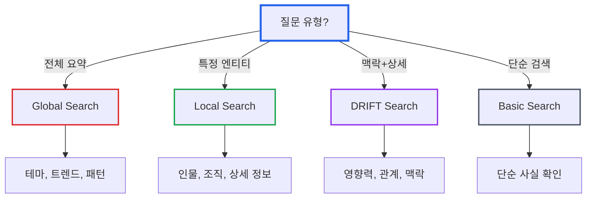

# GraphRAG 시리즈 Part 3: 쿼리 모드 완벽 가이드 - Global, Local, DRIFT

> **작성일**: 2026년 1월 5일
> **카테고리**: AI, RAG, Knowledge Graph, LLM
> **키워드**: GraphRAG, Global Search, Local Search, DRIFT Search, Query Processing

## 요약

GraphRAG는 질문의 특성에 따라 다양한 쿼리 모드를 제공한다. Global Search는 전체 데이터셋의 테마 파악에, Local Search는 특정 엔티티 탐색에, DRIFT Search는 두 방식의 장점을 결합한다. 이 글에서는 각 쿼리 모드의 동작 원리, 적합한 사용 시나리오, 그리고 성능 특성을 분석한다.

## 쿼리 모드 개요

GraphRAG는 네 가지 쿼리 모드를 제공한다:



| 모드 | 용도 | 특징 |
|------|------|------|
| **Global Search** | 전체 데이터셋 분석 | 커뮤니티 요약 기반 |
| **Local Search** | 특정 엔티티 탐색 | 그래프 이웃 탐색 |
| **DRIFT Search** | 복합 질문 | Global + Local 통합 |
| **Basic Search** | 단순 정보 검색 | 기존 RAG 방식 |

## Global Search: 숲을 보는 눈

Global Search는 "이 데이터셋의 주요 테마는 무엇인가?"와 같은 **전역적 질문**에 답한다. 개별 나무가 아닌 숲 전체를 조망하는 방식이다.

### 동작 원리: Map-Reduce 패턴

Global Search는 **Map-Reduce 패턴**을 사용한다. 분할 정복(divide and conquer)과 같은 원리다.



### Map 단계

1. 사전 생성된 **커뮤니티 요약**을 가져온다
2. 각 커뮤니티 요약에 대해 질문과 관련된 **부분 응답** 생성
3. 관련 없는 커뮤니티는 빈 응답 반환

```python
# Map 단계 (개념적 코드)
def map_phase(query: str, community_summaries: list) -> list:
    partial_responses = []

    for summary in community_summaries:
        prompt = f"""
        커뮤니티 요약: {summary.text}

        질문: {query}

        이 커뮤니티가 질문과 관련이 있다면 답변을 제공하세요.
        관련 없다면 "관련 없음"을 반환하세요.
        """
        response = llm.generate(prompt)
        if response != "관련 없음":
            partial_responses.append(response)

    return partial_responses
```

### Reduce 단계

1. 모든 부분 응답을 수집
2. LLM이 부분 응답들을 **종합하여 최종 답변** 생성
3. 중복 제거 및 일관성 확보

```python
# Reduce 단계 (개념적 코드)
def reduce_phase(query: str, partial_responses: list) -> str:
    combined = "\n\n".join(partial_responses)

    prompt = f"""
    다음은 여러 커뮤니티에서 수집한 부분 응답입니다:

    {combined}

    원래 질문: {query}

    모든 부분 응답을 종합하여 포괄적인 최종 답변을 작성하세요.
    중복을 제거하고 일관된 서술로 정리하세요.
    """

    return llm.generate(prompt)
```

### 커뮤니티 레벨 선택

Global Search는 **커뮤니티 레벨**을 선택할 수 있다:

| 레벨 | 커뮤니티 수 | 세부 수준 | 비용 |
|------|-------------|----------|------|
| Level 0 | 적음 | 높은 추상화 | 낮음 |
| Level 1 | 중간 | 중간 세부 | 중간 |
| Level 2+ | 많음 | 상세 | 높음 |

```yaml
# 설정 예시
query:
  global_search:
    community_level: 1  # 사용할 커뮤니티 레벨
    max_tokens: 8000    # 최대 컨텍스트 토큰
```

### Global Search 적합 질문

- "이 문서들의 주요 테마는 무엇인가?"
- "데이터셋에서 반복되는 패턴은?"
- "전체적인 트렌드를 요약해달라"
- "가장 영향력 있는 인물/조직은?"

## Local Search: 나무를 자세히 보다

Local Search는 **특정 엔티티**에 대한 상세 정보를 탐색한다. 특정 인물이나 조직에 대해 깊이 파고드는 방식이다.

### 동작 원리

Local Search는 질문에서 핵심 엔티티를 식별하고, 해당 엔티티의 **이웃(neighbor)** 정보를 수집한다.



### 탐색 과정

1. **엔티티 식별**: 질문에서 핵심 엔티티 추출
2. **이웃 탐색**: 지식 그래프에서 연결된 엔티티/관계 수집
3. **텍스트 검색**: 관련 원본 TextUnit 검색
4. **컨텍스트 구성**: 엔티티 설명 + 관계 + 원본 텍스트
5. **답변 생성**: LLM이 구성된 컨텍스트로 답변

```python
# Local Search (개념적 코드)
def local_search(query: str, knowledge_graph: Graph) -> str:
    # 1. 질문에서 엔티티 식별
    entities = extract_entities(query)

    # 2. 그래프에서 관련 노드 찾기
    matched_nodes = []
    for entity in entities:
        nodes = knowledge_graph.search_nodes(entity)
        matched_nodes.extend(nodes)

    # 3. 이웃 정보 수집
    context_items = []
    for node in matched_nodes:
        # 노드 설명
        context_items.append(node.description)

        # 연결된 관계
        for edge in node.edges:
            context_items.append(edge.description)

        # 관련 원본 텍스트
        for source_id in node.source_ids:
            text_unit = get_text_unit(source_id)
            context_items.append(text_unit.text)

    # 4. 답변 생성
    context = "\n".join(context_items)
    prompt = f"Context: {context}\nQuestion: {query}"

    return llm.generate(prompt)
```

### 컨텍스트 우선순위

Local Search는 컨텍스트 윈도우가 제한되므로, 정보에 **우선순위**를 부여한다:

| 우선순위 | 정보 유형 | 이유 |
|----------|----------|------|
| 1 | 핵심 엔티티 설명 | 질문의 주체 |
| 2 | 직접 관계 | 가장 관련성 높음 |
| 3 | 1-hop 이웃 | 확장된 컨텍스트 |
| 4 | 원본 텍스트 청크 | 상세 정보 |
| 5 | 2-hop 이웃 | 배경 정보 |

### Local Search 적합 질문

- "김철수는 누구인가?"
- "삼성전자와 NVIDIA의 관계는?"
- "갤럭시 뉴로의 특징을 설명해달라"
- "이 인물이 어떤 프로젝트에 참여했는가?"

## DRIFT Search: 최상의 균형

**DRIFT(Dynamic Reasoning and Inference with Flexible Traversal)** Search는 Global과 Local의 장점을 결합한 하이브리드 방식이다.

### 동작 원리

DRIFT는 먼저 커뮤니티 정보로 방향을 잡고, 그 다음 로컬 탐색으로 상세 정보를 수집한다.



### DRIFT의 3단계 프로세스

**1단계: 커뮤니티 기반 방향 설정**
- 질문과 관련된 커뮤니티 요약 검색
- 탐색 범위를 좁히는 "북극성" 역할

**2단계: 로컬 심층 탐색**
- 선택된 커뮤니티 내에서 엔티티 탐색
- 관련 관계와 원본 텍스트 수집

**3단계: 컨텍스트 통합**
- 커뮤니티 수준의 맥락 + 로컬 상세 정보
- 포괄적이면서도 구체적인 답변 생성

### DRIFT vs 다른 모드



### DRIFT Search 적합 질문

- "반도체 산업에서 삼성의 위치는?"
- "AI 칩 시장의 경쟁 구도를 설명해달라"
- "이 회사가 전체 산업에 미친 영향은?"
- 맥락이 필요하면서도 특정 대상에 초점을 맞춘 질문

## Basic Search: 기존 RAG 방식

Basic Search는 기존 RAG와 동일한 **벡터 유사도 검색**을 사용한다. GraphRAG의 그래프 구조를 활용하지 않는다.

### 사용 시나리오

- 단순 정보 검색 (바늘 찾기)
- GraphRAG 인덱싱이 완료되지 않은 경우
- 비용 절감이 필요한 경우

## 쿼리 모드 선택 가이드



### 의사결정 표

| 질문 특성 | 추천 모드 | 이유 |
|----------|----------|------|
| "주요 테마/패턴은?" | Global | 전체 조망 필요 |
| "X는 누구/무엇인가?" | Local | 특정 엔티티 상세 |
| "X와 Y의 관계는?" | Local/DRIFT | 관계 탐색 |
| "X가 전체에 미친 영향은?" | DRIFT | 맥락 + 상세 |
| "X에 대한 사실은?" | Basic | 단순 검색 |

## 성능 비교

### 응답 품질

| 모드 | 포괄성 | 상세도 | 정확성 |
|------|--------|--------|--------|
| Global | 높음 | 낮음 | 중간 |
| Local | 낮음 | 높음 | 높음 |
| DRIFT | 중간-높음 | 중간-높음 | 높음 |
| Basic | 낮음 | 중간 | 높음 |

### 비용 및 지연 시간

| 모드 | LLM 호출 | 지연 시간 | 비용 |
|------|----------|----------|------|
| Global | 많음 (Map-Reduce) | 높음 | 높음 |
| Local | 1-2회 | 낮음 | 낮음 |
| DRIFT | 2-3회 | 중간 | 중간 |
| Basic | 1회 | 매우 낮음 | 낮음 |

## 쿼리 설정 예시

```yaml
# settings.yaml
query:
  # Global Search 설정
  global_search:
    community_level: 1
    max_tokens: 8000
    map_max_tokens: 1000
    reduce_max_tokens: 2000

  # Local Search 설정
  local_search:
    max_tokens: 8000
    text_unit_count: 20
    entity_count: 10
    relationship_count: 20
    community_count: 10

  # DRIFT Search 설정
  drift_search:
    max_tokens: 8000
    k: 10  # 초기 커뮤니티 수
    n: 5   # 확장 단계 수
```

## 다음 편 예고

이번 글에서는 GraphRAG의 네 가지 쿼리 모드를 상세히 분석했다.

**Part 4: GraphRAG 실전 설치 및 설정 가이드**에서는 다음 내용을 다룬다:

- Python 환경에서 GraphRAG 설치
- 설정 파일 작성 및 최적화
- 인덱싱 실행 및 모니터링
- 비용 관리 전략

## 참고 자료

### 공식 문서
- [GraphRAG Query Overview](https://microsoft.github.io/graphrag/query/overview/)
- [Global Search Documentation](https://microsoft.github.io/graphrag/query/global_search/)
- [Local Search Documentation](https://microsoft.github.io/graphrag/query/local_search/)

### 논문
- [From Local to Global: A Graph RAG Approach (arXiv)](https://arxiv.org/abs/2404.16130)
- [DRIFT Search: Dynamic Reasoning and Inference](https://www.microsoft.com/en-us/research/project/graphrag/)

### Microsoft Research
- [GraphRAG: Unlocking LLM discovery on narrative private data](https://www.microsoft.com/en-us/research/blog/graphrag-unlocking-llm-discovery-on-narrative-private-data/)

---

## GraphRAG 시리즈 네비게이션

| 순서 | 제목 |
|------|------|
| 이전 | [Part 2: 인덱싱 파이프라인과 지식 그래프 구축](https://blog.imprun.dev/113) |
| **현재** | Part 3: 쿼리 모드 완벽 가이드 |
| 다음 | [Part 4: 실전 설치 및 설정 가이드](https://blog.imprun.dev/115) |

**[← Part 2](https://blog.imprun.dev/113)** | **[Part 4 →](https://blog.imprun.dev/115)**
