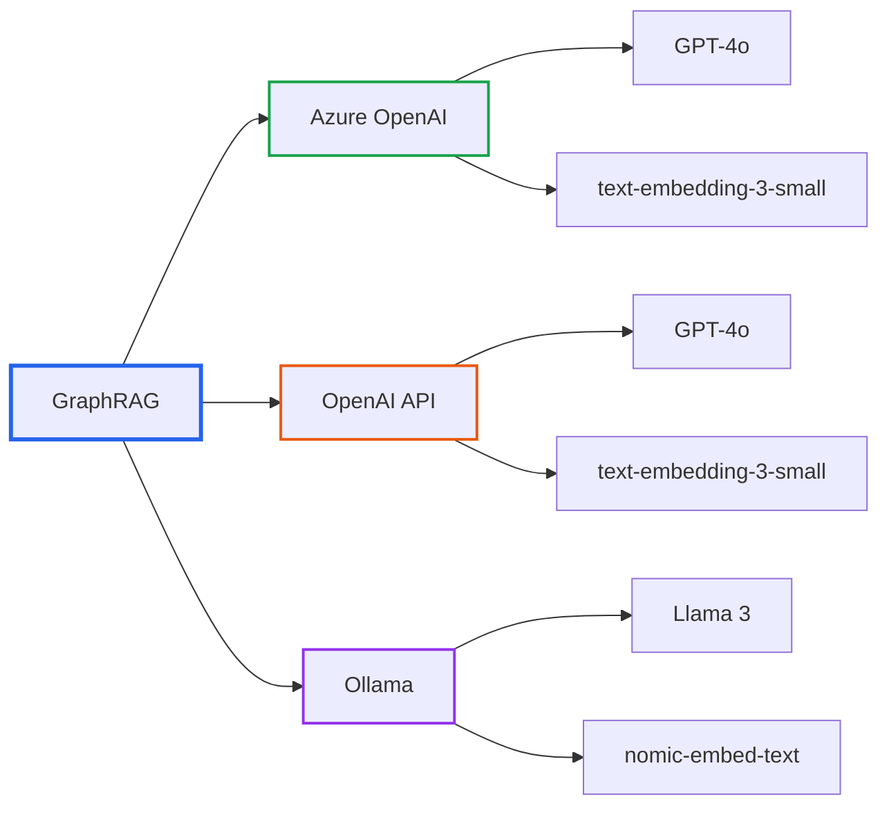
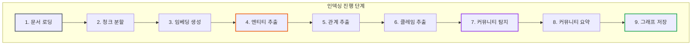
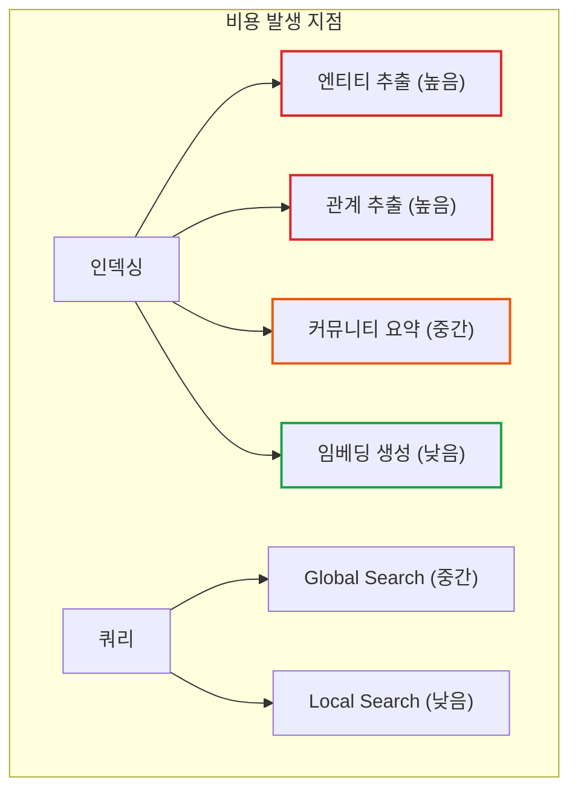

# GraphRAG 시리즈 Part 4: 실전 설치 및 설정 가이드

> **작성일**: 2026년 1월 5일
> **카테고리**: AI, RAG, Knowledge Graph, LLM
> **키워드**: GraphRAG, Installation, Configuration, Azure OpenAI, Cost Management

## 요약

GraphRAG를 실제 프로젝트에 적용하려면 환경 설정, 인덱싱 실행, 쿼리 테스트까지의 전 과정을 이해해야 한다. 이 글에서는 Python 환경에서 GraphRAG를 설치하고, 설정 파일을 작성하며, 인덱싱을 실행하고 쿼리하는 전체 과정을 단계별로 안내한다. 특히 비용 관리에 대한 실전 팁도 포함한다.

## 사전 요구사항

### 시스템 요구사항

| 항목 | 최소 요구사항 | 권장 |
|------|--------------|------|
| Python | 3.10 이상 | 3.11 |
| RAM | 8GB | 16GB 이상 |
| 디스크 | 10GB | SSD 50GB 이상 |
| OS | Windows/macOS/Linux | Linux |

### LLM API 요구사항

GraphRAG는 다음 LLM 제공자를 지원한다:

- **Azure OpenAI** (권장)
- **OpenAI API**
- **Ollama** (로컬 모델)



## 설치

### 1. Python 환경 구성

```bash
# 가상환경 생성
python -m venv graphrag-env

# 활성화 (Windows)
graphrag-env\Scripts\activate

# 활성화 (macOS/Linux)
source graphrag-env/bin/activate
```

### 2. GraphRAG 설치

```bash
# PyPI에서 설치
pip install graphrag

# 버전 확인
graphrag --version
```

### 3. 프로젝트 초기화

```bash
# 작업 디렉토리 생성
mkdir my-graphrag-project
cd my-graphrag-project

# GraphRAG 초기화
graphrag init --root .
```

초기화 후 생성되는 파일 구조:

```
my-graphrag-project/
├── settings.yaml       # 주요 설정 파일
├── .env               # API 키 등 환경 변수
└── input/             # 입력 문서 디렉토리
```

## 설정 파일 작성

### settings.yaml 기본 구조

```yaml
# settings.yaml
encoding_model: cl100k_base
skip_workflows: []
llm:
  api_key: ${GRAPHRAG_API_KEY}
  type: azure_openai_chat
  model: gpt-4o
  api_base: ${GRAPHRAG_API_BASE}
  api_version: 2024-02-15-preview
  deployment_name: gpt-4o

embeddings:
  async_mode: threaded
  llm:
    api_key: ${GRAPHRAG_API_KEY}
    type: azure_openai_embedding
    model: text-embedding-3-small
    api_base: ${GRAPHRAG_API_BASE}
    api_version: 2024-02-15-preview
    deployment_name: text-embedding-3-small
```

### Azure OpenAI 설정

```yaml
# Azure OpenAI 전체 설정 예시
llm:
  api_key: ${GRAPHRAG_API_KEY}
  type: azure_openai_chat
  model: gpt-4o
  api_base: https://your-resource.openai.azure.com/
  api_version: 2024-02-15-preview
  deployment_name: gpt-4o
  max_tokens: 4000
  temperature: 0
  top_p: 1
  request_timeout: 180.0
  tokens_per_minute: 80000      # Rate limit
  requests_per_minute: 480      # Rate limit
  max_retries: 10
  max_retry_wait: 10.0
  concurrent_requests: 25       # 동시 요청 수
```

### OpenAI API 설정

```yaml
# OpenAI API 설정 예시
llm:
  api_key: ${OPENAI_API_KEY}
  type: openai_chat
  model: gpt-4o
  max_tokens: 4000
  temperature: 0
```

### Ollama (로컬 모델) 설정

```yaml
# Ollama 로컬 모델 설정 예시
llm:
  api_key: ollama
  type: openai_chat
  model: llama3:70b
  api_base: http://localhost:11434/v1
  max_tokens: 4000

embeddings:
  llm:
    api_key: ollama
    type: openai_embedding
    model: nomic-embed-text
    api_base: http://localhost:11434/v1
```

### 환경 변수 설정 (.env)

```bash
# .env 파일
GRAPHRAG_API_KEY=your-api-key-here
GRAPHRAG_API_BASE=https://your-resource.openai.azure.com/
```

## 인덱싱 설정

### 청크(Chunk) 설정

```yaml
chunks:
  size: 300           # 청크 크기 (토큰)
  overlap: 100        # 청크 간 중첩
  group_by_columns:
    - id
```

### 엔티티 추출 설정

```yaml
entity_extraction:
  prompt: prompts/entity_extraction.txt
  entity_types:
    - organization
    - person
    - geo
    - event
  max_gleanings: 1    # 추가 추출 라운드
```

### 커뮤니티 보고서 설정

```yaml
community_reports:
  prompt: prompts/community_report.txt
  max_length: 2000
  max_input_length: 8000
```

### 클러스터링 설정

```yaml
cluster_graph:
  max_cluster_size: 10
```

## 인덱싱 실행

### 입력 데이터 준비

```bash
# input 폴더에 텍스트 파일 배치
input/
├── document1.txt
├── document2.txt
└── document3.txt
```

지원 파일 형식:
- `.txt` (텍스트)
- `.csv` (CSV, text 컬럼 필요)
- `.json` (JSON)

### 인덱싱 명령

```bash
# 기본 인덱싱 실행
graphrag index --root .

# 상세 로그 출력
graphrag index --root . --verbose

# 특정 설정 파일 사용
graphrag index --root . --config custom-settings.yaml
```

### 인덱싱 진행 상황



### 출력 결과물

인덱싱이 완료되면 `output` 폴더에 결과물이 생성된다:

```
output/
├── artifacts/
│   ├── create_base_entity_graph.parquet
│   ├── create_base_text_units.parquet
│   ├── create_final_communities.parquet
│   ├── create_final_community_reports.parquet
│   ├── create_final_documents.parquet
│   ├── create_final_entities.parquet
│   ├── create_final_nodes.parquet
│   ├── create_final_relationships.parquet
│   └── create_final_text_units.parquet
└── stats.json
```

## 쿼리 실행

### Global Search

```bash
# Global Search 실행
graphrag query \
  --root . \
  --method global \
  --query "이 데이터셋의 주요 테마는 무엇인가?"
```

### Local Search

```bash
# Local Search 실행
graphrag query \
  --root . \
  --method local \
  --query "김철수는 누구인가?"
```

### DRIFT Search

```bash
# DRIFT Search 실행
graphrag query \
  --root . \
  --method drift \
  --query "반도체 산업에서 삼성의 위치는?"
```

### Python API 사용

```python
import asyncio
from graphrag.query.indexer_adapters import (
    read_indexer_entities,
    read_indexer_relationships,
    read_indexer_reports,
    read_indexer_text_units,
)
from graphrag.query.llm.oai.chat_openai import ChatOpenAI
from graphrag.query.llm.oai.embedding import OpenAIEmbedding
from graphrag.query.structured_search.global_search.search import GlobalSearch
from graphrag.query.structured_search.local_search.search import LocalSearch


async def run_query():
    # LLM 설정
    llm = ChatOpenAI(
        api_key="your-api-key",
        model="gpt-4o",
        api_base="https://your-resource.openai.azure.com/",
        deployment_name="gpt-4o",
    )

    # 인덱스 데이터 로드
    entities = read_indexer_entities("output/artifacts")
    relationships = read_indexer_relationships("output/artifacts")
    reports = read_indexer_reports("output/artifacts")
    text_units = read_indexer_text_units("output/artifacts")

    # Global Search 실행
    global_search = GlobalSearch(
        llm=llm,
        context_builder=global_context_builder,
        token_encoder=token_encoder,
        max_data_tokens=12000,
    )

    result = await global_search.asearch("주요 테마는?")
    print(result.response)


# 실행
asyncio.run(run_query())
```

## 비용 관리

GraphRAG 인덱싱은 **비용 집약적**이다. 소규모 프로젝트에서도 수십 달러가 소요될 수 있으므로, 비용 구조를 정확히 이해하고 최적화 전략을 적용해야 한다.

### 모델별 비용 비교

| 모델 | 입력 비용 (1M 토큰) | 출력 비용 (1M 토큰) | 권장 용도 |
|------|-------------------|-------------------|----------|
| **GPT-4o** | $2.50 | $10.00 | 최적 균형점 (권장) |
| **GPT-4o-mini** | $0.15 | $0.60 | 비용 민감한 인덱싱 |
| **GPT-4-Turbo** | $10.00 | $30.00 | 최고 품질 필요시 |

### 실제 비용 사례

| 문서 규모 | 예상 비용 (GPT-4-Turbo) | 예상 비용 (GPT-4o) |
|----------|------------------------|-------------------|
| 32,000단어 (소설 1권) | $7-15 | $2-5 |
| 100,000단어 | $25-50 | $8-15 |
| 1,000페이지 PDF | $100-120 | $30-50 |

### 비용 발생 구조

GraphRAG의 비용은 주로 **인덱싱 단계**에서 발생한다.



### 비용 추정 공식

```
인덱싱 비용 ≈ (문서 토큰 수 / 청크 크기) × 추출 비용 + 커뮤니티 수 × 요약 비용

예시 (100만 토큰 문서):
- TextUnit 수: 1,000,000 / 300 ≈ 3,333
- 엔티티 추출: 3,333 × $0.003 ≈ $10
- 관계 추출: 3,333 × $0.003 ≈ $10
- 커뮤니티 요약 (100개): 100 × $0.01 ≈ $1
- 임베딩: 3,333 × $0.0001 ≈ $0.33

총 예상 비용: ~$21
```

### 비용 절감 전략

**1. 작은 데이터셋으로 테스트**

```bash
# 샘플 데이터로 먼저 테스트
head -1000 large_document.txt > sample.txt
```

**2. 저렴한 모델 사용**

```yaml
# 인덱싱에는 저렴한 모델
llm:
  model: gpt-4o-mini  # gpt-4o 대신
```

**3. Rate Limit 조정**

```yaml
llm:
  tokens_per_minute: 50000    # 낮추면 비용 예측 용이
  requests_per_minute: 300
  concurrent_requests: 10     # 동시 요청 제한
```

**4. 청크 크기 조정**

```yaml
chunks:
  size: 500  # 더 큰 청크 = 더 적은 LLM 호출
```

### 비용 모니터링

```bash
# 인덱싱 통계 확인
cat output/stats.json | jq .

# 주요 지표
# - llm_calls: LLM 호출 횟수
# - tokens_used: 사용된 토큰 수
# - time_elapsed: 소요 시간
```

## 한국어 문서 최적화

한국어 문서에 GraphRAG를 적용할 때는 추가적인 최적화가 필요하다.

### 토크나이저와 청크 크기

기본 `cl100k_base` 토크나이저는 영어에 최적화되어 있다. 한국어 텍스트는 동일한 의미량에 **더 많은 토큰**이 필요하므로, 청크 크기를 상향 조정해야 한다.

```yaml
# 한국어 문서용 청크 설정
chunks:
  size: 800        # 영어 300 → 한국어 800-1200 권장
  overlap: 200     # 오버랩도 비례 증가
```

### 한국어 최적화 임베딩 모델

OpenAI 기본 임베딩 모델보다 한국어에 특화된 모델이 더 나은 성능을 보인다:

| 모델 | 유형 | 특징 |
|------|------|------|
| **Upstage Embedding** | 상용 API | 한국어 RAG 벤치마크 상위 |
| **voyage-multilingual-2** | 상용 API | 다국어 지원, 한국어 우수 |
| **jhgan/ko-sroberta-multitask** | 오픈소스 | HuggingFace, 무료 |
| **BM-K/KoSimCSE-roberta** | 오픈소스 | 한국어 유사도 특화 |

### 프롬프트 튜닝

한국어 도메인에 맞는 프롬프트를 자동 생성할 수 있다:

```bash
graphrag prompt-tune \
  --root ./project \
  --language Korean \
  --domain "세금, 행정 문서" \
  --discover-entity-types
```

### 도메인 특화 엔티티 유형

기본 엔티티 유형(person, organization 등) 외에 도메인 특화 유형을 추가하면 추출 품질이 향상된다.

**세금/행정 도메인 예시:**

```yaml
entity_extraction:
  entity_types:
    # 기본 유형
    - person
    - organization
    # 도메인 특화 유형
    - tax_type          # 소득세, 법인세, 부가세
    - deduction_item    # 공제항목
    - deadline          # 신고기한
    - tax_rate          # 세율
    - government_agency # 국세청, 세무서
    - law_article       # 법률조항
    - form              # 서식 (종합소득세 신고서 등)
```

**의료 도메인 예시:**

```yaml
entity_extraction:
  entity_types:
    - disease           # 질병명
    - medication        # 약물명
    - symptom           # 증상
    - procedure         # 의료 시술
    - body_part         # 신체 부위
```

## 트러블슈팅

### 일반적인 오류

**1. Rate Limit 오류**

```
Error: Rate limit exceeded
```

해결:
```yaml
llm:
  max_retries: 20
  max_retry_wait: 30.0
  tokens_per_minute: 30000  # 낮춤
```

**2. 메모리 부족**

```
Error: Out of memory
```

해결:
```yaml
# 동시 처리 줄이기
llm:
  concurrent_requests: 5
```

**3. 타임아웃**

```
Error: Request timeout
```

해결:
```yaml
llm:
  request_timeout: 300.0  # 5분으로 증가
```

### 디버깅 팁

```bash
# 상세 로그 활성화
graphrag index --root . --verbose

# 특정 단계만 실행
graphrag index --root . --skip-workflows "create_final_community_reports"
```

## 다음 편 예고

이번 글에서는 GraphRAG의 설치부터 인덱싱, 쿼리까지 실전 과정을 다루었다.

**Part 5: GraphRAG 고급 기능과 최적화**에서는 다음 내용을 다룬다:

- LazyGraphRAG: 비용 효율적인 대안
- 프롬프트 튜닝으로 품질 향상
- 대규모 데이터셋 처리 전략
- 프로덕션 환경 배포 고려사항

## 참고 자료

### 공식 문서
- [GraphRAG Getting Started](https://microsoft.github.io/graphrag/get_started/)
- [Configuration Reference](https://microsoft.github.io/graphrag/config/overview/)
- [CLI Reference](https://microsoft.github.io/graphrag/cli/)

### GitHub
- [GraphRAG Repository](https://github.com/microsoft/graphrag)
- [Examples and Notebooks](https://github.com/microsoft/graphrag/tree/main/examples)

### Azure OpenAI
- [Azure OpenAI Service Documentation](https://learn.microsoft.com/en-us/azure/ai-services/openai/)
- [Rate Limits and Quotas](https://learn.microsoft.com/en-us/azure/ai-services/openai/quotas-limits)

---

## GraphRAG 시리즈 네비게이션

| 순서 | 제목 |
|------|------|
| 이전 | [Part 3: 쿼리 모드 완벽 가이드](https://blog.imprun.dev/114) |
| **현재** | Part 4: 실전 설치 및 설정 가이드 |
| 다음 | [Part 5: 고급 기능과 최적화 전략](https://blog.imprun.dev/116) |

**[← Part 3](https://blog.imprun.dev/114)** | **[Part 5 →](https://blog.imprun.dev/116)**
