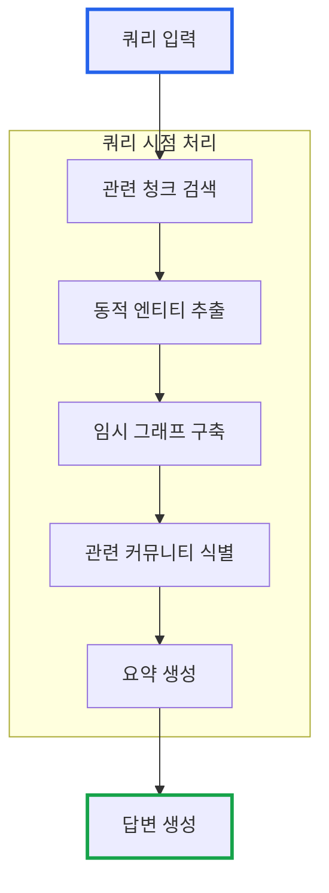
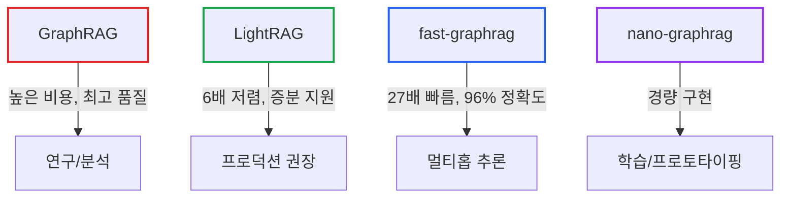
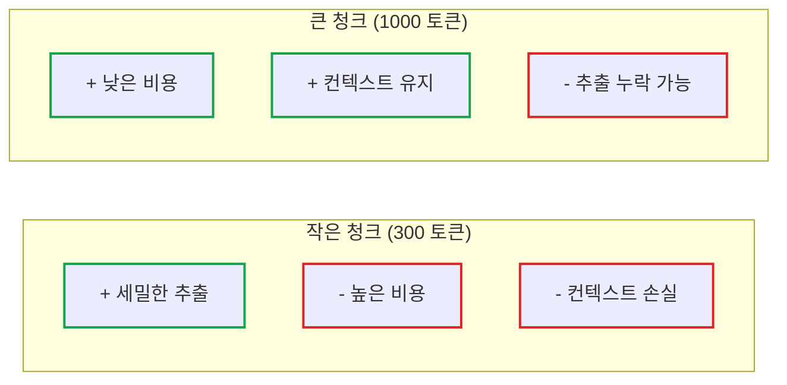
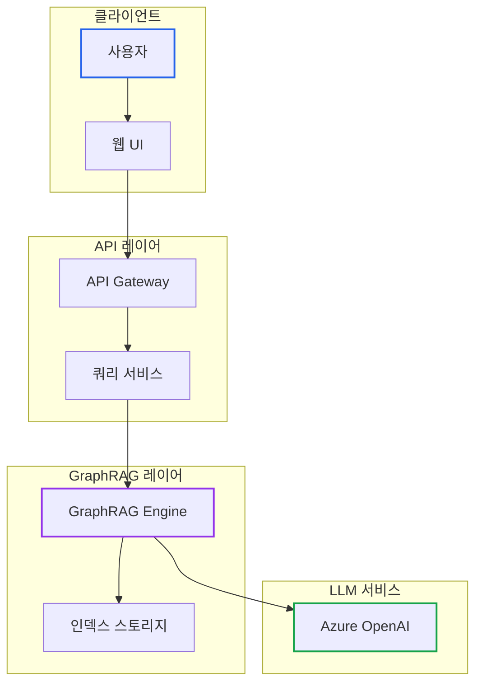

# GraphRAG 시리즈 Part 5: 고급 기능과 최적화 전략

> **작성일**: 2026년 1월 5일
> **카테고리**: AI, RAG, Knowledge Graph, LLM
> **키워드**: GraphRAG, LazyGraphRAG, Prompt Tuning, Optimization, Production

## 요약

GraphRAG를 프로덕션 환경에서 효과적으로 운영하려면 비용과 품질 사이의 균형이 필요하다. 이 글에서는 비용 효율적인 LazyGraphRAG, 도메인에 맞춘 프롬프트 튜닝, 대규모 데이터셋 처리 전략, 그리고 프로덕션 배포 시 고려사항을 다룬다.

## LazyGraphRAG: 비용 효율적인 대안

**LazyGraphRAG**는 기존 GraphRAG의 비용 문제를 해결하기 위해 개발된 경량 버전이다. 전체 인덱싱 없이도 유사한 품질의 결과를 얻을 수 있다.

### 기존 GraphRAG vs LazyGraphRAG


### 핵심 차이점

| 측면 | 기존 GraphRAG | LazyGraphRAG |
|------|--------------|--------------|
| 인덱싱 비용 | 높음 ($5-20+) | 낮음 (~$0.1) |
| 인덱싱 시간 | 수 시간 | 수 분 |
| 쿼리 비용 | 낮음 | 중간 |
| 쿼리 속도 | 빠름 | 보통 |
| 전역 쿼리 품질 | 높음 | 중간-높음 |

### LazyGraphRAG 동작 원리

LazyGraphRAG는 **쿼리 시점에 필요한 그래프만 구축**한다.



### 사용 시나리오

**LazyGraphRAG가 적합한 경우:**
- 예산이 제한적인 프로젝트
- 자주 업데이트되는 데이터
- 프로토타이핑 및 실험 단계
- 단발성 분석 작업

**기존 GraphRAG가 적합한 경우:**
- 고품질 전역 분석이 필수
- 동일 데이터에 반복 쿼리
- 응답 속도가 중요한 서비스
- 프로덕션 환경의 핵심 기능

## GraphRAG의 한계와 대안 기술

GraphRAG는 강력하지만 명확한 한계가 있다. 상황에 따라 대안 기술이 더 적합할 수 있다.

### GraphRAG의 핵심 한계

| 한계 | 상세 |
|------|------|
| **높은 인덱싱 비용** | 1,000페이지 PDF에 $100+ 소요 가능 |
| **증분 업데이트 불가** | 새 문서 추가 시 전체 그래프 재구축 필요 |
| **높은 토큰 소비** | 법률 데이터셋 기준 검색에 ~610,000 토큰 소요 |
| **긴 인덱싱 시간** | 대규모 데이터셋은 수 시간 소요 |

### 대안 기술 비교



### LightRAG (HKU Data Science Lab)

GraphRAG의 비용 문제를 해결한 경량 대안이다.

**핵심 특징:**
- 커뮤니티 클러스터링 대신 **키워드 기반 이중 레벨 검색** 사용
- 검색당 **~100 토큰**만 소모 (GraphRAG 대비 극적 감소)
- **증분 업데이트** 지원 (단순 Union 연산)
- GraphRAG 대비 **6배 저렴**한 비용

```bash
# LightRAG 설치
pip install lightrag-hku
```

**적합한 경우:** 프로덕션 환경, 자주 업데이트되는 데이터, 비용 민감한 프로젝트

### fast-graphrag (Circlemind)

Leiden 알고리즘 대신 **Personalized PageRank**를 사용하여 성능을 극대화했다.

**벤치마크 결과 (2wikimultihopqa):**

| 솔루션 | 완벽 검색률 | 속도 |
|--------|-----------|------|
| **fast-graphrag** | 96% | 기준 |
| GraphRAG | 73% | 27배 느림 |
| LightRAG | 47% | - |

**적합한 경우:** 멀티홉 추론이 필요한 에이전트 워크플로우, 최고 정확도가 필요한 경우

### nano-graphrag

**~1,100줄**의 경량 구현으로, GraphRAG 학습과 커스터마이징에 적합하다.

**특징:**
- 코드 이해가 용이한 미니멀 구현
- Neo4j, Milvus 등 다양한 스토리지 백엔드 지원
- 커스터마이징이 쉬움

```bash
# nano-graphrag 설치
pip install nano-graphrag
```

**적합한 경우:** GraphRAG 학습 목적, 커스텀 구현 필요, 프로토타이핑

### 솔루션 선택 가이드

| 시나리오 | 권장 솔루션 | 이유 |
|----------|------------|------|
| 비용 최적화 + 프로덕션 | **LightRAG** | 6배 저렴, 증분 업데이트 |
| 멀티홉 추론 + 최고 정확도 | **fast-graphrag** | 96% 정확도, 27배 빠름 |
| 전역 요약 품질 최우선 | **GraphRAG** | 여전히 최고 품질 |
| 학습 및 프로토타이핑 | **nano-graphrag** | 간결한 코드 |

## 프롬프트 튜닝

GraphRAG의 품질은 **프롬프트**에 크게 의존한다. 도메인에 맞는 프롬프트 튜닝으로 추출 품질을 크게 향상시킬 수 있다.

### 자동 프롬프트 튜닝

GraphRAG는 입력 데이터를 분석하여 최적의 프롬프트를 생성하는 자동 튜닝 기능을 제공한다.

```bash
# 자동 프롬프트 튜닝 실행
graphrag prompt-tune --root . --config settings.yaml
```

### 튜닝 결과물

```
prompts/
├── entity_extraction.txt     # 엔티티 추출 프롬프트
├── summarize_descriptions.txt # 설명 요약 프롬프트
└── community_report.txt      # 커뮤니티 보고서 프롬프트
```

### 수동 프롬프트 커스터마이징

특정 도메인에서는 수동 조정이 필요할 수 있다.

**엔티티 추출 프롬프트 예시:**

```text
# 원본 (일반적)
다음 텍스트에서 모든 엔티티를 추출하세요.
엔티티 유형: PERSON, ORGANIZATION, LOCATION, EVENT

# 도메인 특화 (의료)
다음 의료 문서에서 엔티티를 추출하세요.
엔티티 유형:
- DISEASE: 질병명 (예: 당뇨병, 고혈압)
- MEDICATION: 약물명 (예: 메트포르민, 인슐린)
- SYMPTOM: 증상 (예: 두통, 발열)
- PROCEDURE: 의료 시술 (예: MRI, 내시경)
- BODY_PART: 신체 부위 (예: 간, 심장)
```

### 엔티티 유형 확장

```yaml
# settings.yaml
entity_extraction:
  entity_types:
    # 기본 유형
    - organization
    - person
    - geo
    - event
    # 도메인 특화 유형 추가
    - technology
    - product
    - regulation
    - metric
```

### Few-shot 예시 추가

프롬프트에 예시를 추가하면 추출 품질이 향상된다.

```text
예시 입력:
"삼성전자 CEO 김철수는 갤럭시 S25 출시 행사에서 신제품을 발표했다."

예시 출력:
- PERSON: 김철수 (삼성전자 CEO)
- ORGANIZATION: 삼성전자 (전자기업)
- PRODUCT: 갤럭시 S25 (스마트폰)
- EVENT: 갤럭시 S25 출시 행사 (제품 발표)
```

## 대규모 데이터셋 처리

### 청크 전략 최적화

대규모 데이터셋에서는 청크 전략이 비용과 품질에 직접적인 영향을 미친다.



| 청크 크기 | 추천 용도 | 비용 영향 |
|----------|----------|----------|
| 200-300 | 고품질 추출 필요 | 높음 |
| 500-600 | 균형잡힌 선택 | 중간 |
| 800-1000 | 비용 절감 우선 | 낮음 |

### 배치 처리

대규모 데이터는 배치로 처리하여 안정성을 확보한다.

```python
import os
from pathlib import Path

def batch_indexing(input_dir: str, batch_size: int = 100):
    """대규모 데이터셋을 배치로 처리"""
    files = list(Path(input_dir).glob("*.txt"))

    for i in range(0, len(files), batch_size):
        batch = files[i:i + batch_size]
        batch_dir = f"batch_{i // batch_size}"

        # 배치 디렉토리 생성
        os.makedirs(f"input/{batch_dir}", exist_ok=True)

        # 파일 복사
        for f in batch:
            # 배치 디렉토리로 복사

        # 배치 인덱싱 실행
        os.system(f"graphrag index --root {batch_dir}")

        print(f"Batch {i // batch_size} completed")
```

### 병렬 처리 설정

```yaml
# 병렬 처리 최적화
llm:
  concurrent_requests: 50     # 동시 요청 (리소스에 따라 조정)
  tokens_per_minute: 150000   # 분당 토큰 제한
  requests_per_minute: 1000   # 분당 요청 제한

embeddings:
  async_mode: threaded
  llm:
    concurrent_requests: 100  # 임베딩은 더 많이 가능
```

### 증분 인덱싱

데이터가 추가될 때 전체 재인덱싱 대신 증분 인덱싱을 사용한다.

```bash
# 새 문서만 인덱싱 (기존 인덱스 유지)
graphrag index --root . --update
```

## 프로덕션 환경 배포

### 아키텍처 설계



### 캐싱 전략

```python
from functools import lru_cache
import hashlib

class GraphRAGCache:
    def __init__(self, ttl_seconds: int = 3600):
        self.cache = {}
        self.ttl = ttl_seconds

    def get_cache_key(self, query: str, method: str) -> str:
        """쿼리 캐시 키 생성"""
        return hashlib.md5(f"{query}:{method}".encode()).hexdigest()

    def get(self, query: str, method: str):
        """캐시된 결과 조회"""
        key = self.get_cache_key(query, method)
        if key in self.cache:
            entry = self.cache[key]
            if time.time() - entry["timestamp"] < self.ttl:
                return entry["result"]
        return None

    def set(self, query: str, method: str, result):
        """결과 캐싱"""
        key = self.get_cache_key(query, method)
        self.cache[key] = {
            "result": result,
            "timestamp": time.time()
        }
```

### 모니터링

```python
import logging
from dataclasses import dataclass
from datetime import datetime

@dataclass
class QueryMetrics:
    query_id: str
    query_text: str
    method: str
    start_time: datetime
    end_time: datetime
    token_count: int
    cost_estimate: float
    success: bool
    error_message: str = None

class GraphRAGMonitor:
    def __init__(self):
        self.metrics = []
        self.logger = logging.getLogger("graphrag")

    def log_query(self, metrics: QueryMetrics):
        """쿼리 메트릭 기록"""
        self.metrics.append(metrics)

        duration = (metrics.end_time - metrics.start_time).total_seconds()
        self.logger.info(
            f"Query: {metrics.query_id} | "
            f"Method: {metrics.method} | "
            f"Duration: {duration:.2f}s | "
            f"Tokens: {metrics.token_count} | "
            f"Cost: ${metrics.cost_estimate:.4f}"
        )

    def get_daily_stats(self):
        """일일 통계 조회"""
        today = datetime.now().date()
        today_metrics = [m for m in self.metrics
                        if m.start_time.date() == today]

        return {
            "total_queries": len(today_metrics),
            "total_tokens": sum(m.token_count for m in today_metrics),
            "total_cost": sum(m.cost_estimate for m in today_metrics),
            "avg_duration": sum(
                (m.end_time - m.start_time).total_seconds()
                for m in today_metrics
            ) / len(today_metrics) if today_metrics else 0
        }
```

### 에러 처리

```python
from tenacity import retry, stop_after_attempt, wait_exponential

class GraphRAGClient:
    @retry(
        stop=stop_after_attempt(3),
        wait=wait_exponential(multiplier=1, min=4, max=60)
    )
    async def query(self, query_text: str, method: str = "local"):
        """재시도 로직이 포함된 쿼리"""
        try:
            result = await self.graphrag.aquery(query_text, method)
            return result
        except RateLimitError:
            # Rate limit 시 더 긴 대기
            await asyncio.sleep(60)
            raise
        except TimeoutError:
            self.logger.warning(f"Query timeout: {query_text[:50]}...")
            raise
        except Exception as e:
            self.logger.error(f"Query error: {e}")
            raise
```

## 성능 최적화 체크리스트

### 인덱싱 최적화

- [ ] 청크 크기 조정 (도메인에 맞게)
- [ ] 불필요한 문서 제거
- [ ] 프롬프트 튜닝 실행
- [ ] 병렬 처리 설정 최적화
- [ ] Rate limit에 맞춘 요청 제한

### 쿼리 최적화

- [ ] 적절한 쿼리 모드 선택
- [ ] 캐싱 구현
- [ ] 컨텍스트 크기 조정
- [ ] 타임아웃 설정

### 비용 최적화

- [ ] 모델 선택 최적화 (gpt-4o-mini 검토)
- [ ] 토큰 사용량 모니터링
- [ ] 불필요한 인덱싱 제거
- [ ] LazyGraphRAG 검토

## GraphRAG 로드맵 및 최신 기능

### 2024년 주요 업데이트

| 버전 | 주요 기능 |
|------|----------|
| v1.0 | 안정 버전 릴리스 |
| DRIFT Search | 하이브리드 검색 모드 |
| LazyGraphRAG | 비용 효율적 대안 |
| Auto-tuning | 자동 프롬프트 튜닝 |
| Claimify | 고품질 클레임 추출 |
| VeriTrail | 환각 감지 및 출처 추적 |

### 향후 발전 방향

- 더 효율적인 인덱싱 알고리즘
- 멀티모달 지원 (이미지, 테이블)
- 실시간 스트리밍 인덱싱
- 더 나은 엔티티 해소 (Entity Resolution)

## 시리즈 마무리

이 시리즈를 통해 GraphRAG의 핵심 개념부터 실전 적용까지 다루었다.

### 시리즈 요약

| Part | 주제 | 핵심 내용 |
|------|------|----------|
| 1 | 소개 | 기존 RAG 한계, GraphRAG 탄생 배경 |
| 2 | 아키텍처 | 인덱싱 파이프라인, 지식 그래프 구축 |
| 3 | 쿼리 모드 | Global, Local, DRIFT Search |
| 4 | 실전 가이드 | 설치, 설정, 인덱싱, 쿼리 |
| 5 | 고급 기능 | LazyGraphRAG, 최적화, 프로덕션 |

### 핵심 교훈

1. **GraphRAG는 만능이 아니다**: 단순 검색에는 기존 RAG가 더 효율적
2. **비용 관리가 핵심**: 인덱싱 비용을 사전에 추정하고 관리
3. **도메인 특화가 중요**: 프롬프트 튜닝으로 품질 향상
4. **적절한 쿼리 모드 선택**: 질문 유형에 맞는 모드 사용

## 참고 자료

### 공식 자료
- [Microsoft Research - Project GraphRAG](https://www.microsoft.com/en-us/research/project/graphrag/)
- [GraphRAG GitHub Repository](https://github.com/microsoft/graphrag)
- [GraphRAG 공식 문서](https://microsoft.github.io/graphrag/)

### 논문
- [From Local to Global: A Graph RAG Approach (arXiv)](https://arxiv.org/abs/2404.16130)

### 커뮤니티
- [GitHub Discussions](https://github.com/microsoft/graphrag/discussions)
- [Microsoft Research Blog](https://www.microsoft.com/en-us/research/blog/graphrag-unlocking-llm-discovery-on-narrative-private-data/)

---

## GraphRAG 시리즈 네비게이션

| 순서 | 제목 |
|------|------|
| 이전 | [Part 4: 실전 설치 및 설정 가이드](https://blog.imprun.dev/115) |
| **현재** | Part 5: 고급 기능과 최적화 전략 (완결) |

**[← Part 4](https://blog.imprun.dev/115)** | **[시리즈 처음으로](https://blog.imprun.dev/112)**
