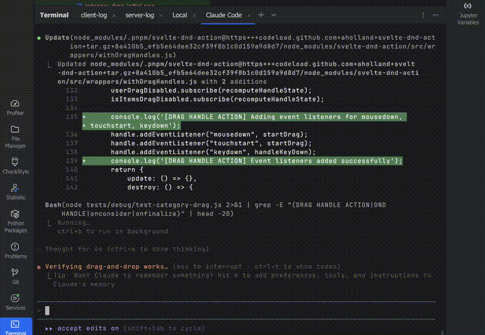

# Claude Code 스크롤 버그, Warp로 해결하기

> **작성일**: 2026년 01월 08일
> **카테고리**: Developer Tools, Terminal, Troubleshooting
> **키워드**: Warp, Terminal, Claude Code, VSCode, Cursor, 스크롤 버그, GPU 가속

## 요약

VSCode와 Cursor의 내장 터미널에서 Claude Code를 사용하면 심각한 스크롤 버그가 발생한다. 스트리밍 출력 시 초당 4,000-6,700회의 스크롤 이벤트가 발생하여 화면 깜빡임과 성능 저하가 나타난다. 이 문제는 2025년 3월부터 GitHub에 621개 이상의 thumbs-up을 받았지만, 2025년 12월 기준 여전히 미해결 상태다. Warp 터미널을 외부 터미널로 사용하면 이 문제를 효과적으로 우회할 수 있다.

## 문제 상황: VSCode/Cursor 스크롤 버그

### 증상

Claude Code를 VSCode나 Cursor의 내장 터미널에서 실행하면 다음과 같은 현상이 발생한다.

- 화면이 심하게 깜빡인다 (flickering)
- 터미널 반응 속도가 급격히 저하된다
- CPU 사용률이 비정상적으로 상승한다
- 일부 환경에서 VSCode 자체가 충돌한다


*출처: [GitHub Issue #9083](https://github.com/anthropics/claude-code/issues/9083)*

### 원인 분석

Claude Code는 스트리밍 응답 시 **매 청크마다 전체 터미널 화면을 다시 그린다**. 일반적인 터미널 애플리케이션과 비교하면 스크롤 이벤트 발생 빈도 차이가 명확하다.

| 애플리케이션 | 스크롤 이벤트/초 |
|-------------|-----------------|
| vim 편집 | 10-50 |
| tail -f 로그 | 1-100 |
| **Claude Code** | **4,000-6,700** |

VSCode/Cursor의 터미널 렌더러는 이 수준의 스크롤 이벤트를 처리하도록 최적화되어 있지 않다.

### GitHub 이슈 현황

관련 이슈들이 다수 보고되어 있다.

- [Issue #3648](https://github.com/anthropics/claude-code/issues/3648) - 621+ thumbs-up
- [Issue #1913](https://github.com/anthropics/claude-code/issues/1913) - 223+ thumbs-up
- [Issue #9083](https://github.com/anthropics/claude-code/issues/9083) - GIF 자료 포함
- [Issue #10794](https://github.com/anthropics/claude-code/issues/10794) - VSCode 충돌 보고

2025년 12월 기준, 이 문제는 여전히 미해결 상태다.

### 기존 해결 시도와 한계

커뮤니티에서 시도한 방법들과 그 결과다.

| 시도 | 결과 |
|------|------|
| 터미널 스크롤백 500줄로 축소 | 일시적 완화, 근본 해결 불가 |
| GPU 가속 비활성화 | 효과 미미 |
| 부드러운 스크롤 비활성화 | 효과 미미 |
| `/clear` 명령어 자주 사용 | 증상 지연, 해결 불가 |

**결론**: VSCode/Cursor 내장 터미널 대신 외부 터미널을 사용하는 것이 현재 가장 효과적인 우회 방법이다.

## 해결책: Warp 터미널

Warp는 Rust로 작성된 GPU 가속 터미널 에뮬레이터다. 블록 기반 렌더링 구조로 인해 Claude Code의 대량 출력을 안정적으로 처리한다.

### Warp의 무료 기능

Warp는 AI 에이전트 기능을 유료로 제공하지만, **터미널 핵심 기능은 완전 무료**다. Claude Code 스크롤 버그 해결에 필요한 모든 기능이 무료 플랜에 포함된다.

**블록 기반 UI**

각 명령과 출력이 하나의 "블록"으로 그룹화된다.

```
┌─────────────────────────────────────────┐
│ $ claude                                │  <- 입력 블록
├─────────────────────────────────────────┤
│ Claude Code의 응답...                    │
│ (길어도 블록 단위로 관리됨)               │  <- 출력 블록
└─────────────────────────────────────────┘
```

- 블록 단위로 탐색, 검색, 복사 가능
- 전체 화면이 아닌 **변경된 블록만 다시 그림**
- 스크롤 이벤트 폭주로 인한 화면 깜빡임 감소

**GPU 가속 렌더링**

| 플랫폼 | 렌더링 기술 |
|--------|------------|
| macOS | Metal 기반 GPU 렌더링 |
| Windows/Linux | wgpu 기반 GPU 렌더링 |

400+ FPS 렌더링을 지원하며, 대량 출력 처리에 강점을 보인다.

**IDE 스타일 편집**

| 기존 터미널 | Warp |
|------------|------|
| 방향키로만 커서 이동 | 마우스 클릭으로 커서 위치 지정 |
| 텍스트 선택 불편 | 드래그로 자유롭게 선택 |
| 한 줄 편집 | 멀티라인 편집 지원 |

**스마트 자동완성**

400개 이상의 CLI 도구에 대한 TAB 완성을 지원한다. git, docker, kubectl 등 자주 사용하는 명령어의 하위 명령과 옵션을 자동완성한다.

### 셸 호환성

Warp는 대부분의 셸 환경을 지원한다.

- Zsh, Bash, fish
- PowerShell
- WSL (Windows Subsystem for Linux)
- Git Bash

기존 셸 설정(`.zshrc`, `.bashrc` 등)을 그대로 사용할 수 있다.

### 플랫폼 지원

| 플랫폼 | 지원 상태 |
|--------|----------|
| macOS | 완전 지원 (Intel/Apple Silicon) |
| Linux | 완전 지원 (주요 배포판) |
| Windows | 2025년 2월 정식 출시 |

### 가격 정책 (2025년 10월 기준)

| 플랜 | 가격 | 포함 내용 |
|------|------|----------|
| **Free** | $0 | 모든 터미널 기능 + 월 75 AI 크레딧 (처음 2개월 150) |
| Build | $18/월 | 1,500 AI 크레딧 + BYOK |

AI 에이전트 기능(자연어 명령 변환, 에이전트 모드 등)은 크레딧 기반 유료 서비스다. 그러나 **블록 UI, GPU 가속, IDE 스타일 편집** 등 터미널 핵심 기능은 Free 플랜에서 제한 없이 사용할 수 있다.

## VSCode/Cursor 연동 방법

### 왜 외부 터미널로만 사용해야 하는가?

"Warp를 VSCode 내장 터미널로 쓸 수 없나?"라는 질문이 있을 수 있다. 결론부터 말하면 **불가능하다**.

VSCode의 내장 터미널은 VSCode 자체의 터미널 렌더러를 사용한다. 설정에서 변경할 수 있는 것은 **셸(Shell)**뿐이다.

| 변경 가능 | 변경 불가 |
|----------|----------|
| 셸 종류 (PowerShell → Bash, Zsh 등) | 터미널 에뮬레이터 자체 |
| 셸 경로, 인자 | 렌더링 엔진 |
| 환경 변수 | GPU 가속, 블록 UI 등 |

Warp는 독립적인 터미널 애플리케이션이다. 자체 GPU 렌더러와 블록 기반 UI를 가지고 있어서 VSCode 내부에 임베드할 수 없다. 따라서 Claude Code 스크롤 버그를 피하려면 **외부 터미널로 사용**해야 한다.

### 외부 터미널 설정

Warp를 VSCode/Cursor의 외부 터미널로 설정하면, 단축키 하나로 현재 프로젝트 경로에서 Warp를 열 수 있다.

### Windows 설정

1. VSCode/Cursor에서 설정(Settings) 열기 (`Ctrl+,`)
2. `Terminal › External: Windows Exec` 검색
3. 값을 아래로 변경:
   - 단일 사용자 설치: `%LOCALAPPDATA%\Programs\Warp\warp.exe`
   - 전체 사용자 설치: `C:\Program Files\Warp\warp.exe`

```json
{
  "terminal.external.windowsExec": "%LOCALAPPDATA%\\Programs\\Warp\\warp.exe"
}
```

### macOS 설정

1. VSCode/Cursor에서 설정 열기 (`Cmd+,`)
2. `Terminal › External: Osx Exec` 검색
3. 값을 `Warp.app`으로 변경

```json
{
  "terminal.external.osxExec": "Warp.app"
}
```

### Linux 설정

1. VSCode/Cursor에서 설정 열기 (`Ctrl+,`)
2. `Terminal › External: Linux Exec` 검색
3. 값을 `warp-terminal`로 변경

```json
{
  "terminal.external.linuxExec": "warp-terminal"
}
```

### 사용 방법

설정 완료 후, 단축키로 Warp를 실행한다.

| 플랫폼 | 단축키 |
|--------|--------|
| Windows/Linux | `Ctrl+Shift+C` |
| macOS | `Cmd+Shift+C` |

Warp가 현재 프로젝트 경로에서 열린다.

## 워크플로우 예시

### Claude Code + Warp + VSCode 연동 워크플로우

```
1. VSCode에서 코드 편집
2. Ctrl+Shift+C (또는 Cmd+Shift+C)로 Warp 열기
3. Warp에서 Claude Code 실행: claude
4. Claude Code 작업 결과를 VSCode에서 확인
```

이 워크플로우의 장점이다.

- Claude Code의 스크롤 버그 회피
- 블록 기반 UI로 Claude 출력 탐색 용이
- VSCode의 파일 편집 기능 유지
- 프로젝트 경로 자동 동기화

### Warp에서 Claude Code 사용 시 추가 이점

| 기능 | 설명 |
|------|------|
| 블록 복사 | Claude 응답을 블록 단위로 쉽게 복사 |
| 출력 검색 | 긴 대화에서 특정 내용 빠르게 검색 (`Ctrl+Shift+F`) |
| 세션 관리 | 탭으로 여러 Claude 세션 동시 관리 |

## 설치 방법

### macOS

```bash
brew install --cask warp
```

### Linux (Debian/Ubuntu)

```bash
wget -qO- https://releases.warp.dev/linux/keys/warp.asc | sudo gpg --dearmor -o /etc/apt/keyrings/warp.gpg
echo "deb [signed-by=/etc/apt/keyrings/warp.gpg] https://releases.warp.dev/linux/deb stable main" | sudo tee /etc/apt/sources.list.d/warp.list
sudo apt update && sudo apt install warp-terminal
```

### Windows

```powershell
winget install Warp.Warp
```

## 제한 사항 및 대안

### Warp의 제한 사항

1. **로그인 필수**: 계정 생성 없이는 사용 불가
2. **프라이빗 소스**: 오픈소스가 아님
3. **텔레메트리**: 사용 데이터 수집 (비활성화 가능)

### 오픈소스 대안

로그인이나 프라이빗 소스가 우려된다면, 다음 오픈소스 터미널도 VSCode/Cursor 스크롤 버그를 우회할 수 있다.

| 터미널 | 특징 | 렌더링 속도 |
|--------|------|------------|
| Alacritty | 가장 빠른 렌더링, 설정 파일 기반 | 16.78ms |
| Warp | 블록 UI, 편의 기능 풍부 | 66.47ms |
| iTerm2 (macOS) | 기능 풍부, 무료 | 93.01ms |
| Ghostty | 경량, 최신 | 측정 중 |

렌더링 속도만 보면 Alacritty가 가장 빠르지만, Warp의 블록 UI와 편의 기능이 Claude Code 사용 경험을 개선하는 데 유리하다.

## 결론

VSCode/Cursor의 내장 터미널에서 발생하는 Claude Code 스크롤 버그는 2025년 12월 기준 미해결 상태다. 외부 터미널을 사용하는 것이 현재 가장 실용적인 우회 방법이며, Warp는 그 중 블록 기반 UI와 GPU 가속으로 Claude Code 사용 경험을 개선하는 선택지다.

Warp의 AI 에이전트 기능은 유료지만, 스크롤 버그 해결에 필요한 터미널 핵심 기능은 Free 플랜에서 제한 없이 사용할 수 있다. 로그인 필수와 프라이빗 소스가 우려된다면 Alacritty나 iTerm2 같은 오픈소스 대안도 동일한 효과를 제공한다.

## 참고 자료

### Claude Code 스크롤 버그 관련
- [GitHub Issue #3648: Terminal Flickering](https://github.com/anthropics/claude-code/issues/3648) - 621+ thumbs-up
- [GitHub Issue #1913: Terminal Flickering](https://github.com/anthropics/claude-code/issues/1913) - 223+ thumbs-up
- [GitHub Issue #9083: Terminal Flickering (GIF 출처)](https://github.com/anthropics/claude-code/issues/9083)
- [GitHub Issue #10794: VSCode Crashes from Flickering](https://github.com/anthropics/claude-code/issues/10794)

### Warp 공식 문서
- [Warp 공식 웹사이트](https://www.warp.dev/)
- [Warp All Features](https://www.warp.dev/all-features)
- [Warp 가격 정책](https://www.warp.dev/pricing)
- [Warp VSCode 연동 가이드](https://www.warp.dev/blog/how-to-open-warp-vscode)

### 대안 터미널
- [Alacritty GitHub](https://github.com/alacritty/alacritty)
- [iTerm2](https://iterm2.com/)
- [Ghostty](https://ghostty.org/)
