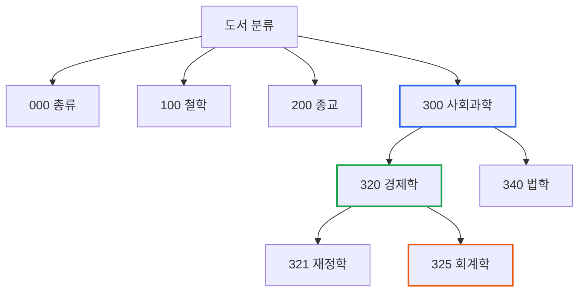
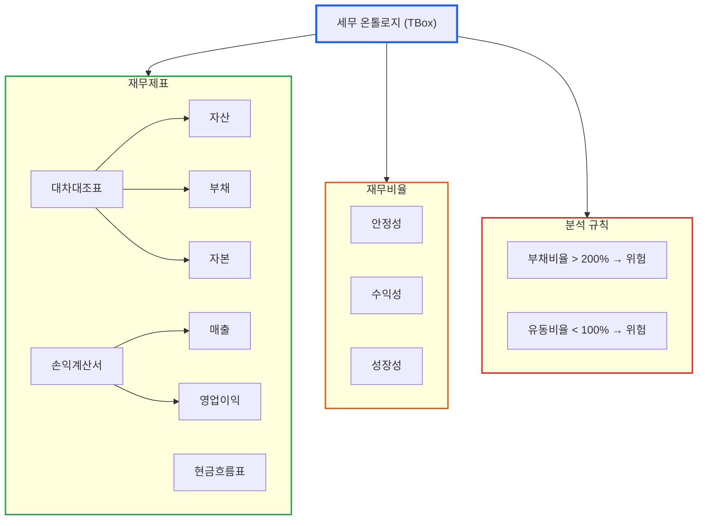

# 온톨로지란 무엇인가: 데이터에 '의미'를 부여하는 기술

> **작성일**: 2026년 1월 9일
> **카테고리**: AI, Ontology, Knowledge Graph
> **키워드**: 온톨로지, 지식 표현, 시맨틱 웹, TBox, 세무 데이터
> **시리즈**: [온톨로지 + AI 에이전트: 세무 컨설팅 시스템 아키텍처](https://blog.imprun.dev/120) (1부/총 20부)
> **대상 독자**: 온톨로지에 입문하는 시니어 개발자

---

## 핵심 질문

> **"왜 데이터에 '의미'를 부여해야 하는가?"**

JSON, SQL, NoSQL 어떤 형태로 데이터를 저장하든 기계는 그 안의 숫자와 문자열이 무엇을 의미하는지 모른다. `revenue: 5000000000`이 매출인지 자산인지, 이 숫자가 높은 건지 낮은 건지 기계는 알지 못한다. 온톨로지는 이 문제를 해결한다.

---

## 요약

온톨로지는 특정 도메인의 지식을 컴퓨터가 이해할 수 있도록 구조화하는 방법이다. 사전이 단어의 의미를 정의하듯, 온톨로지는 개념과 개념 사이의 관계를 명확하게 정의한다. 세무 데이터에 온톨로지를 적용하면 AI가 "매출"과 "영업이익"의 관계를 이해하고, "부채비율이 높다"는 것이 무엇을 의미하는지 추론할 수 있다.

---

## 왜 온톨로지가 필요한가?

### 문제: AI는 숫자만 보고 의미를 모른다

다음 JSON 데이터를 살펴본다.

```json
{
  "company_id": "12345",
  "year": 2025,
  "revenue": 5000000000,
  "operating_income": 800000000,
  "total_debt": 3000000000,
  "total_equity": 2000000000
}
```

시니어 개발자인 당신은 이 데이터를 보고 즉시 파악한다:
- 매출 50억 원
- 영업이익 8억 원 (영업이익률 16%)
- 부채 30억 원, 자본 20억 원 (부채비율 150%)

하지만 LLM에게 이 데이터를 그냥 던져주면?

```
Q: 이 회사의 재무 상태가 건전한가?
A: 데이터만으로는 판단하기 어렵습니다...
```

LLM은 `revenue`가 매출이라는 것, 영업이익률이 `operating_income / revenue`라는 것, 부채비율 150%가 업종 평균 대비 높은지 낮은지 **알지 못한다**.

### 왜 지식 기반 접근인가?

세 가지 접근 방식을 비교해본다.

| 접근 방식 | 장점 | 한계 |
|----------|------|------|
| **LLM만 사용** | 자연스러운 대화, 범용성 | 환각(Hallucination), 최신 데이터 부재, 계산 오류 |
| **규칙 기반** | 정확한 계산, 일관성 | 유연성 부족, 자연어 처리 어려움 |
| **지식 그래프 + LLM** | 정확성 + 유연성 | 초기 구축 비용 |

LLM만으로 세무 컨설팅을 하면 "부채비율 150%는 위험합니다"라고 답하다가, "업종 평균이 200%면 오히려 양호합니다"라는 맥락을 놓칠 수 있다. 규칙 기반 시스템은 정확하지만 "이 회사 상태 어때?"라는 자연어 질문에 답하기 어렵다.

**지식 그래프 + LLM** 조합은 두 세계의 장점을 취한다:
- **지식 그래프**: 재무/세무 데이터의 정확한 저장과 추론
- **온톨로지**: 도메인 개념과 규칙의 명시적 정의
- **LLM**: 자연어 이해와 리포트 생성
- **통합**: 지식 그래프가 LLM의 "지식 창고" 역할

### 해결: 지식의 구조를 가르친다

온톨로지는 AI에게 다음을 가르친다:
1. **용어 정의**: `revenue`는 매출이고, 기업의 주요 수익원이다
2. **관계 정의**: 영업이익률 = 영업이익 / 매출
3. **규칙 정의**: 부채비율 200% 초과 시 "재무 위험" 경고

이렇게 지식의 구조를 정의해두면, AI는 숫자만 보고도 맥락을 이해하고 추론할 수 있다.

---

## 온톨로지란 무엇인가?

### 철학에서의 온톨로지

온톨로지(Ontology)는 원래 철학 용어로 **존재론(存在論)**을 의미한다. "무엇이 존재하는가?"에 대한 탐구다. 아리스토텔레스는 모든 존재를 **실체(Substance)**, **양(Quantity)**, **질(Quality)**, **관계(Relation)** 등 10가지 범주로 분류했다.

### 정보과학에서의 온톨로지

Tom Gruber(1993)의 정의:
> "An ontology is an explicit specification of a conceptualization."
> **온톨로지는 개념화(conceptualization)의 명시적 명세(specification)이다.**

핵심 키워드:
- **개념화(Conceptualization)**: 관심 영역에 대한 추상적, 단순화된 관점
- **명시적(Explicit)**: 암묵적 지식이 아닌 형식적으로 정의된 것
- **명세(Specification)**: 기계가 처리할 수 있는 형식적 표현

확장된 정의(Studer et al., 1998):
> "An ontology is a **formal, explicit** specification of a **shared** conceptualization."

- **공유된(Shared)**: 커뮤니티/그룹이 합의한 지식
- **형식적(Formal)**: 기계가 처리 가능한 형식 언어로 표현

### 기술적 정의와 구성 요소

온톨로지(Ontology)는 **특정 도메인의 개념, 속성, 관계를 형식적으로 명세한 것**이다.

| 구성 요소 | 설명 | 예시 |
|----------|------|------|
| **클래스(Class)** | 개념의 범주 | 기업, 재무제표, 계정과목 |
| **인스턴스(Instance)** | 클래스의 실제 예시 | (주)ABC, 2025년 손익계산서 |
| **속성(Property)** | 개념의 특성 | 기업명, 설립일, 매출액 |
| **관계(Relation)** | 개념 간 연결 | "손익계산서"는 "재무제표"의 하위 유형 |
| **공리(Axiom)** | 항상 참인 명제, 규칙 | 자산 = 부채 + 자본 |

### 일상적 비유: 도서관 분류 체계

도서관의 십진분류법을 생각해본다.



이 분류 체계는 다음을 정의한다:
- **개념(클래스)**: "철학", "경제학", "회계학"이라는 범주가 존재한다
- **계층 관계**: "회계학"은 "경제학"의 하위 개념이다
- **포함 관계**: 세무 관련 책은 "325 회계학" 아래에 배치된다

온톨로지도 동일한 역할을 한다. 단, 사람을 위한 것이 아니라 **컴퓨터를 위한 분류 체계**라는 점이 다르다.

---

## TBox와 ABox: 스키마와 데이터의 분리

온톨로지 세계에서 자주 등장하는 용어가 TBox와 ABox다. 시니어 개발자에게 익숙한 비유로 설명한다.

| 개념 | 데이터베이스 비유 | 객체지향 비유 | 설명 |
|------|------------------|--------------|------|
| **TBox** | DDL (CREATE TABLE) | Class Definition | 스키마, 규칙 정의 |
| **ABox** | DML (INSERT VALUES) | Object Instance | 실제 데이터 |

**TBox (Terminological Box)**: 용어와 규칙의 정의
```
재무제표 ⊃ {대차대조표, 손익계산서, 현금흐름표}
영업이익률 = 영업이익 / 매출 × 100
부채비율 > 200% → 재무위험
```

**ABox (Assertional Box)**: 실제 데이터
```
(주)ABC는 기업이다
(주)ABC의 2025년 매출은 50억 원이다
(주)ABC의 2025년 영업이익은 8억 원이다
```

이 분리가 왜 중요한가?
- **재사용성**: 동일한 TBox로 여러 기업(ABox) 데이터를 처리
- **유지보수성**: 세법 개정 시 TBox만 수정, ABox는 불변
- **추론 효율성**: TBox는 한 번 컴파일 후 재사용, ABox는 증분 추론

---

## 세무 데이터에 온톨로지가 필요한 이유

### 사례: 회계 ERP에서 가져온 세무 데이터

회계 ERP에서 추출한 데이터가 다음과 같다고 가정하자.

```json
{
  "bs": {
    "assets": {
      "current": 1200000000,
      "non_current": 3800000000
    },
    "liabilities": {
      "current": 800000000,
      "non_current": 2200000000
    },
    "equity": 2000000000
  },
  "is": {
    "revenue": 5000000000,
    "cogs": 3500000000,
    "operating_expense": 700000000,
    "operating_income": 800000000
  }
}
```

### 문제 1: 용어의 불일치

같은 개념이 다른 이름으로 존재한다:
- `revenue` = `매출액` = `sales` = `총수익`
- `operating_income` = `영업이익` = `영업손익`

API마다, ERP마다, 심지어 같은 회사 내 부서마다 다른 용어를 쓴다. 온톨로지는 이들을 **동의어(synonym)**로 정의하고 표준 용어로 매핑한다.

### 문제 2: 암묵적 관계

데이터에는 드러나지 않는 관계가 존재한다:
- 유동자산 + 비유동자산 = 총자산
- 총자산 = 총부채 + 자본 (대차대조표 등식)
- 매출총이익 = 매출 - 매출원가

이런 관계를 AI가 모르면, "총자산이 얼마야?"라는 질문에 답하지 못한다.

### 문제 3: 도메인 규칙

세무 분석에는 업계에서 통용되는 규칙이 있다:
- 유동비율 200% 이상이 안정적
- 부채비율 100% 이하가 건전
- 영업이익률 업종 평균 대비 ±5% 이내가 정상

이 규칙들이 정의되어 있어야 AI가 "이 회사 재무 상태 괜찮아?"라는 질문에 의미 있는 답변을 제공할 수 있다.

### 해결: 세무 온톨로지 구축



이 구조가 정의되면:
1. AI는 `revenue`가 "매출"이고 "손익계산서"의 항목임을 안다
2. "총자산"을 물으면 유동자산 + 비유동자산을 계산한다
3. "재무 위험이 있나?"를 물으면 부채비율 규칙을 적용한다

---

## 실습: 온톨로지적 사고방식

### 연습 1: 클래스와 인스턴스 구분하기

다음 중 클래스(범주)와 인스턴스(실제 예시)를 구분한다.

| 항목 | 클래스 or 인스턴스? | 설명 |
|------|-------------------|------|
| 기업 | 클래스 | 범주를 정의 |
| (주)삼성전자 | 인스턴스 | 기업 클래스의 구체적 예 |
| 재무제표 | 클래스 | 문서 유형을 정의 |
| 2025년 3분기 손익계산서 | 인스턴스 | 재무제표의 구체적 예 |
| 부채비율 | 클래스 | 재무비율의 하위 클래스 |
| 150% | 인스턴스 | 특정 기업의 부채비율 값 |

### 연습 2: 관계 정의하기 (트리플)

모든 지식을 "주어 - 관계 - 목적어" 형태로 표현하는 것이 온톨로지의 기본 원리다.

**원문**: "(주)ABC의 2025년 매출은 50억 원이다"

**트리플 형태**:
```
주어: (주)ABC_2025년_손익계산서
관계: 매출액
목적어: 5,000,000,000 (원)
```

**원문**: "손익계산서는 재무제표의 일종이다"

**트리플 형태**:
```
주어: 손익계산서
관계: 하위유형 (rdfs:subClassOf)
목적어: 재무제표
```

다음 편에서 이를 정식으로 표현하는 **RDF(Resource Description Framework)**의 기초를 다룬다.

---

## 핵심 정리

| 개념 | 설명 | 세무 시스템에서의 역할 |
|------|------|----------------------|
| 온톨로지 | 지식을 구조화하는 체계 | 세무 용어와 규칙을 정의 |
| 클래스 | 개념의 범주 | 재무제표, 계정과목, 재무비율 |
| 인스턴스 | 클래스의 실제 예시 | 특정 기업의 특정 연도 데이터 |
| 속성 | 개념의 특성값 | 매출액, 영업이익률, 부채비율 |
| TBox | 용어와 규칙 정의 | 세무 분석 규칙 (스키마) |
| ABox | 실제 데이터 | 회계 ERP에서 가져온 실제 재무 데이터 |

---

## 다음 단계 미리보기

**2부: 지식그래프 입문 - RDB vs Graph DB, 언제 무엇을 쓰는가**

온톨로지로 정의한 지식을 실제로 저장하고 조회하려면 **지식그래프(Knowledge Graph)**가 필요하다. 2부에서는:

- 관계형 데이터베이스(SQL)의 한계
- 그래프 데이터베이스의 장점
- 트리플 스토어와 지식그래프 개념
- 세무 데이터를 그래프로 표현하면 얻는 이점

을 다룬다.

---

## 참고 자료

### 온톨로지 기초
- [Stanford Encyclopedia of Philosophy - Ontology](https://plato.stanford.edu/entries/logic-ontology/)
- [W3C Semantic Web](https://www.w3.org/standards/semanticweb/)
- Gruber, T. R. (1993). "A translation approach to portable ontology specifications"
- Noy, N. F., & McGuinness, D. L. (2001). "Ontology Development 101"

### 관련 시리즈
- [다음: 지식그래프 입문](https://blog.imprun.dev/122)
- [시리즈 목차](https://blog.imprun.dev/120)
