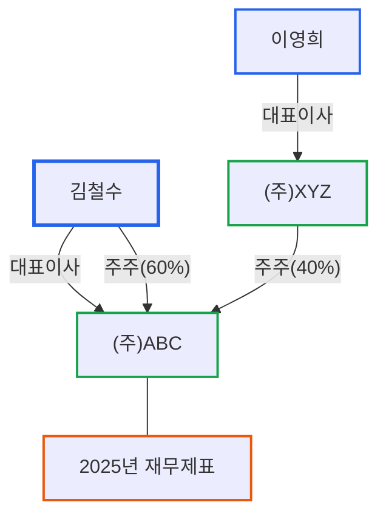
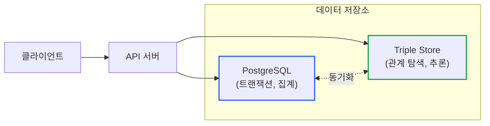
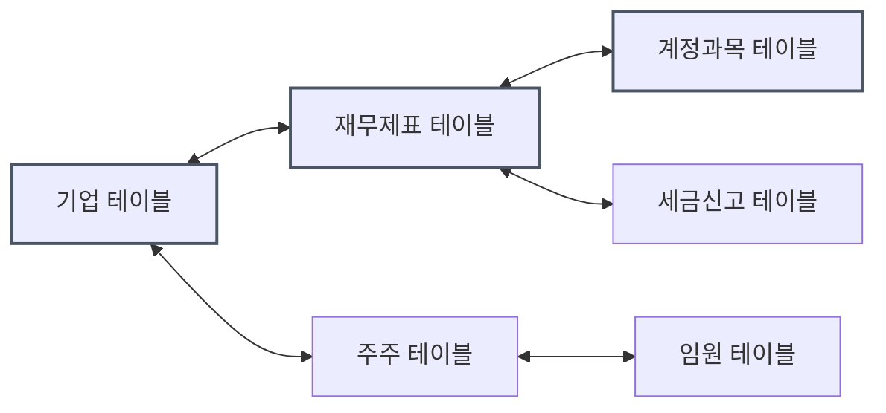
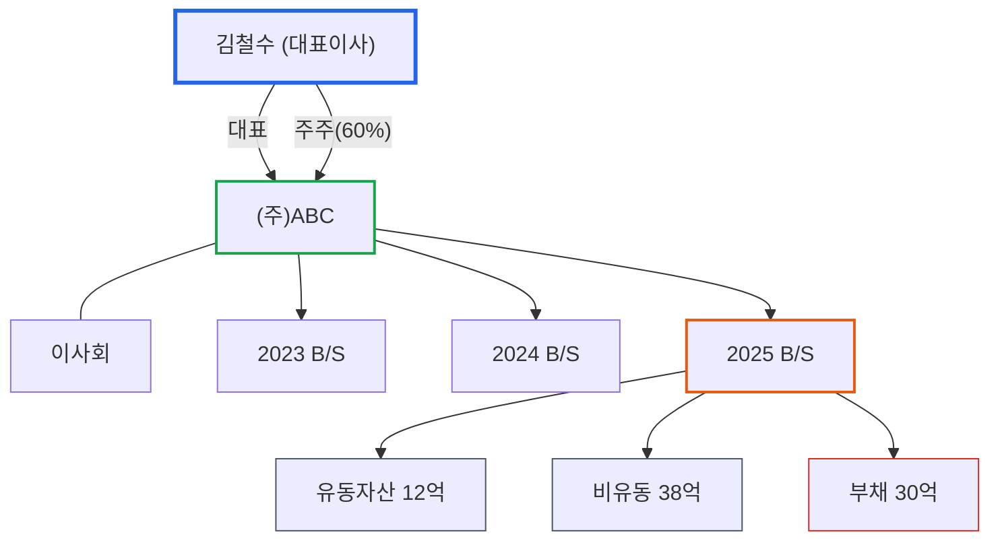

# 지식그래프 입문: RDB vs Graph DB, 언제 무엇을 쓰는가

> **작성일**: 2026년 1월 9일
> **카테고리**: AI, Knowledge Graph, Database
> **키워드**: 지식그래프, 그래프 데이터베이스, 트리플, RDF, 관계형 데이터베이스
> **시리즈**: [온톨로지 + AI 에이전트: 세무 컨설팅 시스템 아키텍처](https://blog.imprun.dev/120) (2부/총 20부)
> **대상 독자**: 온톨로지에 입문하는 시니어 개발자

---

## 핵심 질문

> **"RDB vs Graph DB, 언제 무엇을 쓰는가?"**

관계형 데이터베이스(RDB)와 그래프 데이터베이스(Graph DB)는 서로 대체재가 아니라 상호 보완재다. 문제는 "어느 것이 더 좋은가"가 아니라 **"어떤 유형의 질의에 어느 것이 적합한가"**다. 이 글에서는 세무 데이터의 특성을 분석하고, 왜 지식그래프가 이 도메인에 적합한지 아키텍처적 관점에서 설명한다.

---

## 요약

지식그래프는 데이터를 "노드(개체)"와 "엣지(관계)"로 표현하는 구조다. 엑셀이나 관계형 데이터베이스가 테이블 형태로 데이터를 저장한다면, 지식그래프는 그물망처럼 연결된 형태로 저장한다. 세무 데이터처럼 복잡한 관계가 얽힌 데이터를 다룰 때, 지식그래프는 "A 회사의 대표이사가 B 회사의 주주이기도 한가?"와 같은 관계 탐색 질문에 훨씬 효율적으로 답할 수 있다.

---

## 이전 내용 복습

1부에서 배운 핵심 개념:
- **온톨로지**: 지식을 구조화하는 체계 (도서관 분류법과 유사)
- **클래스와 인스턴스**: 범주(기업)와 실제 예시((주)ABC)
- **TBox**: 용어와 규칙 정의 (스키마)
- **ABox**: 실제 데이터 (인스턴스)

이번 2부에서는 온톨로지로 정의한 지식을 **실제로 저장하고 조회하는 방법**, 즉 지식그래프를 다룬다.

---

## 데이터 저장소 선택의 기준

### 시니어 개발자의 질문

새로운 프로젝트에서 데이터 저장소를 선택할 때 고려하는 요소:
1. **쿼리 패턴**: 어떤 유형의 질의가 주로 발생하는가?
2. **스키마 유연성**: 스키마 변경이 얼마나 자주 일어나는가?
3. **관계의 깊이**: 몇 단계의 관계 탐색이 필요한가?
4. **트랜잭션 vs 분석**: OLTP인가 OLAP인가?
5. **팀의 역량**: 어떤 기술 스택에 익숙한가?

### 세무 데이터의 특성

세무 컨설팅 시스템에서 필요한 질의 유형:

| 질의 유형 | 예시 | 관계 깊이 |
|----------|------|----------|
| 단순 조회 | "A사의 2025년 매출은?" | 1 |
| 집계 | "모든 고객사의 평균 부채비율은?" | 1 |
| **관계 탐색** | "김철수가 지배하는 모든 기업은?" | 3+ |
| **경로 분석** | "A사와 B사는 어떻게 연결되어 있는가?" | N |
| **패턴 매칭** | "대표이사가 다른 회사의 주주이기도 한 기업은?" | 3 |
| **추론** | "이 기업은 중소기업인가?" | TBox + ABox |

단순 조회와 집계는 RDB가 효율적이다. 하지만 관계 탐색, 경로 분석, 패턴 매칭은 그래프 DB가 압도적으로 유리하다.

---

## RDB의 한계: 세무 데이터 사례

### 세무 데이터의 현실

회계 ERP에서 가져온 세무 데이터를 관계형 테이블로 관리한다고 가정한다.

**테이블 1: 기업 정보**
| 기업ID | 기업명 | 대표자 | 설립일 | 업종 |
|--------|--------|--------|--------|------|
| C001 | (주)ABC | 김철수 | 2015-03-01 | 제조업 |
| C002 | (주)XYZ | 이영희 | 2018-07-15 | 서비스업 |

**테이블 2: 재무제표**
| 기업ID | 연도 | 매출 | 영업이익 | 총자산 | 총부채 |
|--------|------|------|----------|--------|--------|
| C001 | 2023 | 30억 | 3억 | 50억 | 25억 |
| C001 | 2024 | 40억 | 5억 | 60억 | 28억 |
| C001 | 2025 | 50억 | 8억 | 75억 | 30억 |

**테이블 3: 주주 정보**
| 기업ID | 주주명 | 지분율 | 주주유형 |
|--------|--------|--------|----------|
| C001 | 김철수 | 60% | 개인 |
| C001 | (주)XYZ | 40% | 법인 |

### 문제 1: 관계 추적의 복잡성

**질문**: "김철수가 직접 또는 간접적으로 영향력을 행사하는 모든 기업은?"

RDB로 답하려면:
1. 김철수가 대표인 기업 찾기 → (주)ABC
2. 김철수가 주주인 기업 찾기 → (주)ABC
3. (주)ABC가 주주인 다른 기업 찾기 → ?
4. 그 기업의 자회사는? → ??

관계가 3단계만 넘어가도 사실상 추적이 어렵다.

### 문제 2: N+1 Query 또는 복잡한 JOIN

SQL로 "3단계 이내에 연결된 모든 기업" 찾기:

```sql
-- 1단계 관계
SELECT related_company FROM shareholders WHERE company_id = 'C001'
UNION
-- 2단계 관계
SELECT s2.related_company
FROM shareholders s1
JOIN shareholders s2 ON s1.related_company = s2.company_id
WHERE s1.company_id = 'C001'
UNION
-- 3단계 관계 (이미 복잡해짐)
SELECT s3.related_company
FROM shareholders s1
JOIN shareholders s2 ON s1.related_company = s2.company_id
JOIN shareholders s3 ON s2.related_company = s3.company_id
WHERE s1.company_id = 'C001'
```

단계가 늘어날수록 JOIN이 기하급수적으로 증가한다. 성능도 급격히 저하된다.

### 문제 3: 스키마 변경의 고통

새로운 요구사항: "각 기업의 주거래 은행 정보도 관리하고 싶다"

RDB 방식:
1. 새 테이블 생성: `company_banks`
2. 기존 쿼리 전부 수정
3. 은행별 여신 한도, 금리 정보도 추가하면? 또 새 테이블...

관계가 추가될 때마다 스키마를 변경하고, 기존 코드를 수정해야 한다.

---

## 지식그래프란 무엇인가?

### 정의

**지식그래프(Knowledge Graph)**는 현실 세계의 **엔티티(Entity)**와 그들 간의 **관계(Relationship)**를 그래프 형태로 표현한 지식 베이스다.

### 트리플(Triple): 지식그래프의 기본 단위

모든 지식은 **주어 - 술어 - 목적어** 형태의 트리플로 표현된다.

```
(Subject, Predicate, Object)
(주어,    술어,      목적어)
```

| 주어 (Subject) | 술어 (Predicate) | 목적어 (Object) |
|----------------|------------------|-----------------|
| (주)ABC | 대표이사 | 김철수 |
| (주)ABC | 매출(2025) | 50억 원 |
| 김철수 | 주주 | (주)ABC |
| 김철수 | 지분율 | 60% |
| (주)XYZ | 주주 | (주)ABC |

이 트리플들이 모여 그래프를 형성한다.



### 핵심 특징

1. **개체 중심**: 테이블의 행이 아니라 "개체"가 중심
2. **관계 명시**: 개체 간 연결이 데이터의 핵심
3. **유연한 스키마**: 새로운 관계 추가가 자유로움
4. **추론 가능**: 명시되지 않은 관계도 유추 가능

---

## RDB vs Graph DB: 아키텍처적 비교

### 데이터 모델 비교

| 특성 | 관계형 DB (RDB) | 지식 그래프 (KG) |
|------|-----------------|------------------|
| **데이터 모델** | 테이블, 행, 열 | 노드, 엣지 (트리플) |
| **스키마** | 고정적, 사전 정의 | 유연한, 점진적 확장 |
| **관계 표현** | JOIN 연산 필요 | 직접 연결 (명시적) |
| **추론** | 제한적 | 내장된 추론 엔진 |
| **의미론** | 암묵적 | 명시적 (온톨로지) |

### 성능 비교: 관계 탐색

"김철수와 3단계 이내로 연결된 모든 개체를 찾아라"

**SQL (PostgreSQL)**
```sql
-- 복잡한 재귀 CTE 필요
WITH RECURSIVE connections AS (
  SELECT target, 1 as depth
  FROM relationships
  WHERE source = '김철수'
  UNION
  SELECT r.target, c.depth + 1
  FROM relationships r
  JOIN connections c ON r.source = c.target
  WHERE c.depth < 3
)
SELECT DISTINCT target FROM connections;
```

실행 시간: 데이터 크기에 따라 수 초 ~ 수십 초

**그래프 쿼리 (Cypher - Neo4j)**
```cypher
MATCH (start:Person {name: '김철수'})-[*1..3]-(connected)
RETURN DISTINCT connected
```

실행 시간: 밀리초 단위

그래프 DB는 관계 탐색에 최적화되어 있어, 관계 깊이가 깊어져도 성능이 크게 저하되지 않는다. 이는 **인덱스 프리 인접(Index-Free Adjacency)** 때문이다. 각 노드가 연결된 노드에 대한 직접 참조를 가지고 있어, 탐색 시 인덱스 조회가 필요 없다.

### 스키마 유연성 비교

**SQL**: 새 관계 추가 시

```sql
-- 새 테이블 생성
CREATE TABLE company_banks (
  company_id VARCHAR(10),
  bank_name VARCHAR(50),
  credit_limit BIGINT
);

-- 기존 쿼리 수정 필요
-- JOIN 추가, 애플리케이션 코드 수정...
```

**그래프**: 새 관계 추가 시

```cypher
// 그냥 관계 추가
MATCH (c:Company {id: 'C001'})
CREATE (c)-[:BANKS_WITH {credit_limit: 1000000000}]->(:Bank {name: '우리은행'})
```

기존 쿼리나 코드 수정 없이 새로운 관계를 추가할 수 있다.

---

## 언제 RDB를, 언제 Graph DB를 쓰는가?

### RDB가 적합한 경우

- **단순한 CRUD 작업**: 개체 생성, 읽기, 수정, 삭제
- **집계/통계 질의**: SUM, AVG, GROUP BY
- **트랜잭션 무결성이 중요**: 금융 거래, 재고 관리
- **스키마가 안정적**: 변경이 거의 없음
- **팀이 SQL에 익숙**: 학습 비용 최소화

### Graph DB가 적합한 경우

- **관계 탐색**: 2단계 이상의 관계 탐색
- **경로 분석**: 최단 경로, 연결 여부
- **패턴 매칭**: 특정 구조의 부분 그래프 찾기
- **추천 시스템**: "이 사람이 좋아할 것" 추론
- **스키마가 유동적**: 관계 유형이 자주 추가됨
- **의미론적 추론**: 온톨로지 기반 추론

### 하이브리드 아키텍처

실제 프로덕션에서는 둘을 함께 사용하는 경우가 많다.



- **RDB**: 원천 데이터 저장, 트랜잭션 처리
- **Graph DB**: RDB 데이터를 주기적으로 동기화, 관계 질의 처리

---

## 세무 데이터에 지식그래프를 적용하면

### 적용 전: 분리된 테이블들



각 테이블이 외래 키(FK)로 연결되어 있지만, 전체 그림을 파악하기 어렵다.

### 적용 후: 연결된 지식그래프



### 지식그래프로 가능해지는 질의

**1. 경로 탐색**
```
Q: 김철수와 이영희는 어떻게 연결되어 있는가?

A: 김철수 → 주주(60%) → (주)ABC ← 주주(40%) ← (주)XYZ ← 대표이사 ← 이영희
   (김철수가 대주주인 회사에 이영희가 대표인 회사가 투자)
```

**2. 패턴 매칭**
```
Q: 부채비율 150% 초과인 기업 중, 대표이사가 다른 기업의 주주인 경우?

패턴: (기업)-[부채비율]->(150% 초과)
      (기업)-[대표이사]->(사람)-[주주]->(다른기업)
```

**3. 추론**
```
Q: 김철수가 실질적으로 지배하는 기업은?

추론:
- 직접 대표인 기업: (주)ABC
- 60% 이상 지분 보유 기업: (주)ABC
- (주)ABC가 40% 지분 보유한 기업: 간접 영향력
→ 결과: (주)ABC (직접), (주)XYZ 경유 영향력 있음
```

---

## 실습: 세무 데이터를 트리플로 변환하기

### 연습 1: JSON 데이터를 트리플로 변환

**입력 데이터 (회계 ERP JSON)**
```json
{
  "company": {
    "id": "C001",
    "name": "(주)ABC",
    "ceo": "김철수",
    "established": "2015-03-01"
  },
  "financials": {
    "year": 2025,
    "revenue": 5000000000,
    "operating_income": 800000000
  }
}
```

**트리플 변환 결과**

| 주어 | 술어 | 목적어 |
|------|------|--------|
| C001 | rdf:type | 기업 |
| C001 | 기업명 | "(주)ABC" |
| C001 | 대표이사 | 김철수 |
| C001 | 설립일 | "2015-03-01" |
| C001_2025_IS | rdf:type | 손익계산서 |
| C001_2025_IS | 소속기업 | C001 |
| C001_2025_IS | 회계연도 | 2025 |
| C001_2025_IS | 매출 | 5000000000 |
| C001_2025_IS | 영업이익 | 800000000 |

### 연습 2: 관계 질문 만들기

위 트리플 데이터로 답할 수 있는 질문을 만들어본다.

**단순 질의**
- "(주)ABC의 대표이사는?" → C001 - 대표이사 - ? → 김철수
- "2025년 매출이 50억 이상인 기업은?" → ? - 매출 - (>=50억)

**관계 질의**
- "김철수가 대표인 기업의 영업이익률은?"
  1. 김철수 ← 대표이사 - ? → C001
  2. C001 - 소속기업 ← C001_2025_IS
  3. C001_2025_IS - 영업이익 / 매출 → 16%

---

## 지식그래프 도구 미리보기

### 트리플 스토어

트리플을 저장하고 조회하는 전문 데이터베이스:

| 도구 | 특징 | 라이선스 |
|------|------|----------|
| **Apache Jena** | Java 기반, SPARQL 지원 | Apache 2.0 |
| **RDFLib** | Python 기반, 경량 | BSD |
| **GraphDB** | 엔터프라이즈급, 추론 엔진 | 상용/무료 |
| **Blazegraph** | 고성능, Wikidata가 사용 | GPL 2.0 |

이 시리즈에서는 Python 친화적인 **RDFLib**를 주로 사용한다.

### 쿼리 언어

- **SPARQL**: RDF 그래프용 표준 쿼리 언어 (SQL과 유사)
- **Cypher**: Neo4j 그래프 DB용 쿼리 언어
- **Gremlin**: Apache TinkerPop 그래프 순회 언어

이 시리즈에서는 W3C 표준인 **SPARQL**을 다룬다 (7부에서 상세히).

---

## 핵심 정리

| 개념 | 엑셀/SQL | 지식그래프 |
|------|----------|-----------|
| 데이터 구조 | 테이블 (행/열) | 그래프 (노드/엣지) |
| 기본 단위 | 행 (Row) | 트리플 (Subject-Predicate-Object) |
| 관계 표현 | 외래 키 + JOIN | 엣지 (직접 연결) |
| 스키마 변경 | 테이블 수정 필요 | 새 관계 추가만 |
| 관계 탐색 | 복잡한 JOIN | 자연스러운 순회 |
| 추론 | 불가능 | 규칙 기반 추론 가능 |

### 세무 시스템에서의 활용

- **관계 분석**: 기업-주주-임원 간 복잡한 관계 파악
- **시계열 연결**: 연도별 재무제표 변화 추적
- **규칙 적용**: TBox에 정의된 세무 규칙으로 자동 검증
- **AI 컨텍스트**: LLM에게 구조화된 지식 제공

---

## 다음 단계 미리보기

**3부: AI 에이전트 개념 - 에이전트가 '도구'를 사용한다는 것의 의미는?**

지금까지 데이터를 어떻게 구조화할지 배웠다. 하지만 이 데이터를 분석하고 리포트를 작성하는 주체가 필요하다. 3부에서는:

- 챗봇과 AI 에이전트의 차이
- 에이전트의 핵심: 도구(Tool) 사용
- ReAct 패턴: 추론하고 행동하기
- 세무 분석 에이전트의 역할 정의

를 다룬다.

---

## 참고 자료

### 지식그래프 기초
- [Google Knowledge Graph 소개](https://blog.google/products/search/introducing-knowledge-graph-things-not/)
- [W3C RDF Primer](https://www.w3.org/TR/rdf11-primer/)
- [Knowledge Graphs - ACM Computing Surveys](https://dl.acm.org/doi/10.1145/3447772)

### 그래프 데이터베이스
- [Neo4j Graph Database](https://neo4j.com/)
- [RDFLib Documentation](https://rdflib.readthedocs.io/)
- [Apache Jena](https://jena.apache.org/)

### 관련 시리즈
- [이전: 온톨로지란 무엇인가](https://blog.imprun.dev/121)
- [다음: AI 에이전트 개념](https://blog.imprun.dev/123)
- [시리즈 목차](https://blog.imprun.dev/120)
