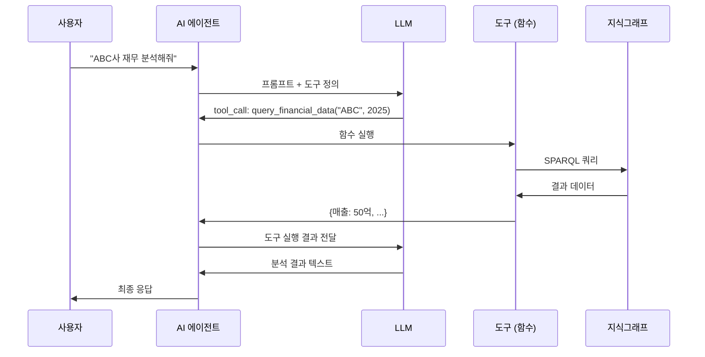
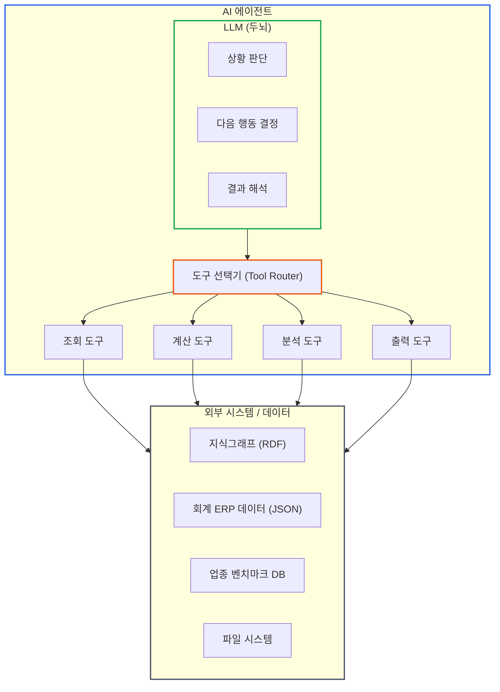
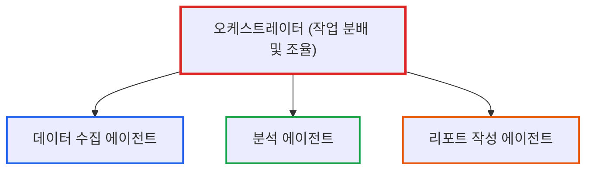

# AI 에이전트 개념: 에이전트가 '도구'를 사용한다는 것의 의미

> **작성일**: 2026년 1월 9일
> **카테고리**: AI, Agent, LLM
> **키워드**: AI 에이전트, LLM, 도구 사용, ReAct, 자율성
> **시리즈**: [온톨로지 + AI 에이전트: 세무 컨설팅 시스템 아키텍처](https://blog.imprun.dev/120) (3부/총 20부)
> **대상 독자**: 온톨로지에 입문하는 시니어 개발자

---

## 핵심 질문

> **"에이전트가 '도구'를 사용한다는 것의 의미는?"**

LLM 기반 챗봇은 텍스트를 입력받아 텍스트를 출력한다. 그 안에서 모든 "생각"이 일어난다. 하지만 실제 업무를 수행하려면 **외부 세계와 상호작용**해야 한다. 데이터베이스를 조회하고, API를 호출하고, 파일을 생성해야 한다. 에이전트는 LLM에게 **도구(Tool)**라는 인터페이스를 통해 이 능력을 부여한다. 이 글에서는 에이전트의 아키텍처적 의미와 도구 사용 패턴을 설명한다.

---

## 요약

AI 에이전트는 단순히 질문에 답하는 챗봇이 아니라, **스스로 판단하고 도구를 사용해 목표를 달성하는 자율적 시스템**이다. 챗봇이 "재무제표를 분석해줘"라는 요청에 일반적인 조언만 한다면, 에이전트는 실제로 데이터베이스에서 재무제표를 조회하고, 계산하고, 이상 징후를 탐지한 후 구체적인 분석 결과를 제공한다. 이 글에서는 에이전트의 핵심 개념인 도구(Tool) 사용과 ReAct 패턴을 다룬다.

---

## 이전 내용 복습

1부와 2부에서 배운 핵심:
- **온톨로지**: 세무 지식을 구조화하는 체계 (TBox = 규칙, ABox = 데이터)
- **지식그래프**: 트리플 기반의 그래프 데이터 구조
- **트리플**: 주어-술어-목적어 형태의 지식 표현

이제 이 구조화된 지식을 **활용**하는 주체가 필요하다. 그것이 AI 에이전트다.

---

## 챗봇과 에이전트의 차이

### 아키텍처적 관점

시니어 개발자의 관점에서 두 시스템의 차이를 비교한다.

**챗봇 아키텍처**
```
User Input → LLM → Text Output
```

**에이전트 아키텍처**
```
User Input → LLM → [Plan] → Tool Call → [Result] → LLM → [Reflect] → ...
                     ↑__________________________________________________|
```

챗봇은 **단일 패스(single-pass)**로 동작한다. 입력을 받아 출력을 내면 끝이다.
에이전트는 **루프(loop)**로 동작한다. 목표를 달성할 때까지 계획-실행-반성을 반복한다.

### 구체적 사례 비교

**챗봇: 수동적인 응답기**

일반적인 LLM 챗봇에게 세무 분석을 요청하면:

```
사용자: (주)ABC의 2025년 재무 상태를 분석해줘

챗봇: 재무 상태를 분석하려면 다음 지표들을 확인해야 합니다:
- 유동비율: 유동자산 / 유동부채
- 부채비율: 총부채 / 자기자본
- 영업이익률: 영업이익 / 매출

해당 기업의 재무제표 데이터를 제공해주시면
더 구체적인 분석을 도와드리겠습니다.
```

챗봇은 **일반적인 지식**만 제공한다. 실제 데이터에 접근하지 못하기 때문이다.

**에이전트: 능동적인 실행자**

동일한 요청을 AI 에이전트에게 하면:

```
사용자: (주)ABC의 2025년 재무 상태를 분석해줘

에이전트 (내부 처리):
1. [생각] 재무 상태 분석을 위해 해당 기업의 재무제표 데이터가 필요하다
2. [도구 호출] query_financial_data(company="ABC", year=2025)
3. [결과] {매출: 50억, 영업이익: 8억, 총자산: 75억, 총부채: 30억, 자본: 45억}
4. [생각] 주요 재무비율을 계산해야 한다
5. [도구 호출] calculate_ratios(data=...)
6. [결과] {영업이익률: 16%, 부채비율: 66.7%, 유동비율: 150%}
7. [생각] 업종 평균과 비교해야 한다
8. [도구 호출] get_industry_benchmark(industry="제조업")
9. [결과] {평균 영업이익률: 8%, 평균 부채비율: 100%}
10. [생각] 분석 결과를 정리하자

에이전트 (최종 응답):
(주)ABC의 2025년 재무 분석 결과입니다:

**수익성**: 영업이익률 16%로 업종 평균(8%) 대비 2배 높음. 우수한 수익 구조
**안정성**: 부채비율 66.7%로 업종 평균(100%) 대비 양호. 재무 건전성 확보
**유동성**: 유동비율 150%로 단기 지급 능력 양호

종합 평가: 수익성과 안정성 모두 업종 상위권.
다만 3년 연속 부채 증가 추세(25억→28억→30억)에 대한 모니터링 권장.
```

에이전트는 **실제로 데이터를 조회하고, 계산하고, 비교**한다.

### 핵심 차이점

| 구분 | 챗봇 | 에이전트 |
|------|------|----------|
| 데이터 접근 | 불가능 | 도구를 통해 가능 |
| 계산 수행 | 제한적 (내장 지식만) | 외부 도구로 정확한 계산 |
| 자율성 | 질문에만 반응 | 스스로 필요한 작업 결정 |
| 멀티스텝 | 단일 응답 | 여러 단계 자동 수행 |
| 외부 시스템 연동 | 불가능 | API, DB, 파일 등 연동 |

---

## 에이전트의 핵심: 도구(Tool)

### 도구란 무엇인가?

도구(Tool)는 에이전트가 **외부 세계와 상호작용하는 인터페이스**다.

기술적으로 도구는 **함수(Function)**다. 정의된 시그니처(입력/출력)를 가지고, LLM이 언제 어떤 인자로 호출할지 결정한다.

```python
@tool
def query_financial_data(company_id: str, year: int) -> dict:
    """특정 기업의 재무제표 데이터를 조회한다"""
    ...
```

LLM에게 이 함수의 **시그니처와 설명**을 제공하면, LLM은 적절한 시점에 이 함수를 호출하기로 "결정"하고, 필요한 인자를 생성한다.

### 도구 호출의 흐름



### 세무 분석 에이전트의 도구들

세무 컨설팅 시스템에서 필요한 도구들:

**데이터 조회 도구**
```python
@tool
def query_financial_data(company_id: str, year: int) -> dict:
    """특정 기업의 재무제표 데이터를 지식그래프에서 조회한다.

    Args:
        company_id: 기업 식별자 (예: "C001")
        year: 회계연도 (예: 2025)

    Returns:
        재무제표 데이터 딕셔너리
    """
    sparql_query = f"""
    SELECT ?revenue ?operating_income ?total_assets ?total_liabilities ?equity
    WHERE {{
        ?company a :Company ;
                 :companyId "{company_id}" .
        ?fs a :FinancialStatement ;
            :belongsTo ?company ;
            :fiscalYear {year} ;
            :revenue ?revenue ;
            :operatingIncome ?operating_income ;
            :totalAssets ?total_assets ;
            :totalLiabilities ?total_liabilities ;
            :equity ?equity .
    }}
    """
    return knowledge_graph.query(sparql_query)


@tool
def get_shareholder_info(company_id: str) -> list:
    """주주 정보를 조회한다"""
    ...
```

**계산 도구**
```python
@tool
def calculate_financial_ratios(financials: dict) -> dict:
    """재무비율을 계산한다"""
    return {
        "영업이익률": financials["영업이익"] / financials["매출"] * 100,
        "부채비율": financials["총부채"] / financials["자본"] * 100,
        "유동비율": financials["유동자산"] / financials["유동부채"] * 100,
    }
```

**분석 도구**
```python
@tool
def detect_anomalies(financials: dict, rules: list) -> list:
    """SHACL 규칙 기반으로 이상 징후를 탐지한다"""
    ...

@tool
def compare_with_benchmark(ratios: dict, industry: str) -> dict:
    """업종 평균과 비교한다"""
    ...
```

**출력 도구**
```python
@tool
def generate_report(analysis: dict, template: str) -> str:
    """분석 결과를 리포트로 생성한다"""
    ...
```

### 도구 설계 원칙

시니어 개발자로서 도구를 설계할 때 고려해야 할 원칙:

1. **단일 책임**: 각 도구는 하나의 명확한 작업만 수행
2. **명확한 시그니처**: 입력/출력 타입을 명확히 정의
3. **풍부한 Docstring**: LLM이 언제 사용할지 판단하는 근거
4. **에러 핸들링**: 실패 시 의미 있는 에러 메시지 반환
5. **멱등성**: 같은 입력에 같은 출력 (가능한 경우)

---

## ReAct 패턴: 추론하고 행동하기

### ReAct란?

ReAct(Reasoning + Acting)는 에이전트가 **생각(Reasoning)과 행동(Acting)을 번갈아 수행**하는 패턴이다.

```
Observation → Thought → Action → Observation → Thought → Action → ...
```

이는 사람이 문제를 해결하는 방식과 유사하다. "이게 뭐지? → 이렇게 해볼까 → 결과가 이렇네 → 그럼 다음엔..."

### 세무 분석 예시

**요청**: "(주)ABC의 재무 건전성에 문제가 있는지 확인해줘"

**ReAct 흐름**:

```
[Observation] 사용자가 (주)ABC의 재무 건전성 확인을 요청함

[Thought] 재무 건전성을 판단하려면 먼저 최근 재무제표 데이터가 필요하다.
         부채비율, 유동비율 등 안정성 지표를 확인해야 한다.

[Action] query_financial_data(company_id="ABC", year=2025)

[Observation] 결과: {매출: 50억, 영업이익: 8억, 총자산: 75억, 총부채: 30억,
             유동자산: 12억, 유동부채: 8억}

[Thought] 데이터를 받았다. 이제 재무비율을 계산해야 한다.

[Action] calculate_financial_ratios(financials=위_데이터)

[Observation] 결과: {부채비율: 66.7%, 유동비율: 150%, 자기자본비율: 60%}

[Thought] 부채비율 66.7%는 일반적으로 양호한 수준이다.
         하지만 업종 특성을 고려해야 한다. 업종 평균과 비교하자.

[Action] compare_with_benchmark(ratios=위_결과, industry="제조업")

[Observation] 결과: {업종평균_부채비율: 100%, 업종평균_유동비율: 120%}

[Thought] 부채비율은 업종 평균보다 낮고, 유동비율은 평균보다 높다.
         추가로 최근 3년 추세를 확인해서 악화 경향이 있는지 보자.

[Action] query_financial_data(company_id="ABC", year=2023)
[Action] query_financial_data(company_id="ABC", year=2024)

[Observation] 2023: {부채: 25억}, 2024: {부채: 28억}, 2025: {부채: 30억}

[Thought] 부채가 매년 증가하고 있다. 증가율을 계산하자.
         25→28 (12%), 28→30 (7.1%). 증가세가 둔화되고 있다.
         현재 수준은 양호하지만, 지속적인 모니터링이 필요하다.

[Final Answer]
(주)ABC의 재무 건전성 분석 결과:

**현재 상태: 양호**
- 부채비율 66.7% (업종 평균 100% 대비 양호)
- 유동비율 150% (업종 평균 120% 대비 양호)
- 자기자본비율 60% (자본 구조 안정적)

**주의 사항**
- 부채가 3년 연속 증가 중 (25억→28억→30억)
- 다만 증가율은 둔화 추세 (12%→7.1%)

**권고**
- 현재 재무 건전성에 문제 없음
- 부채 증가 추세 모니터링 권장
- 다음 분기 부채비율 70% 초과 시 심층 분석 필요
```

### ReAct의 장점

1. **투명성**: 에이전트의 사고 과정이 명시적으로 드러남
2. **수정 가능**: 잘못된 판단을 중간에 교정 가능
3. **신뢰성**: 근거 기반 결론 도출
4. **디버깅 용이**: 문제 발생 시 어느 단계에서 잘못됐는지 파악 가능

---

## 에이전트 아키텍처

### 단일 에이전트 구조



### 멀티 에이전트 구조 (19부에서 상세히)

복잡한 작업은 여러 전문 에이전트가 협업한다:



이 구조는 마이크로서비스 아키텍처와 유사하다. 각 에이전트는:
- **단일 책임**: 하나의 전문 영역만 담당
- **독립 배포**: 개별적으로 업데이트 가능
- **인터페이스 정의**: 명확한 입출력 스펙

---

## 세무 분석 에이전트의 역할 정의

### 에이전트가 수행할 작업 목록

1. **데이터 수집**: 회계 ERP 데이터를 지식그래프에서 조회
2. **재무 분석**: 재무비율 계산, 추세 분석
3. **이상 탐지**: SHACL 규칙 기반 위반 사항 탐지
4. **벤치마크 비교**: 업종 평균과 비교 분석
5. **인사이트 도출**: 분석 결과를 경영 시사점으로 변환
6. **리포트 생성**: 월간 컨설팅 리포트 작성

### 에이전트에게 부여할 도구

| 도구 이름 | 기능 | 입력 | 출력 |
|----------|------|------|------|
| `query_kg` | 지식그래프 SPARQL 쿼리 | 쿼리문 | 결과 데이터 |
| `calc_ratios` | 재무비율 계산 | 재무 데이터 | 비율 딕셔너리 |
| `detect_violations` | SHACL 규칙 위반 탐지 | 데이터, 규칙셋 | 위반 목록 |
| `get_benchmark` | 업종 벤치마크 조회 | 업종 코드 | 평균 지표 |
| `analyze_trend` | 시계열 추세 분석 | 연도별 데이터 | 추세 분석 결과 |
| `generate_insight` | 인사이트 생성 | 분석 결과 | 경영 시사점 |
| `create_report` | 리포트 생성 | 분석 전체 결과 | PDF/마크다운 |

### 에이전트 프롬프트 설계 (미리보기)

```python
SYSTEM_PROMPT = """
당신은 기업 재무 분석 전문 AI 컨설턴트입니다.

## 역할
- 기업의 재무제표를 분석하여 경영 인사이트를 제공
- 이상 징후를 조기에 탐지하여 경고
- 업종 대비 포지션을 객관적으로 평가

## 사용 가능한 도구
- query_kg: 지식그래프에서 데이터 조회
- calc_ratios: 재무비율 계산
- detect_violations: SHACL 규칙 기반 이상 탐지
- get_benchmark: 업종 평균 지표 조회
- analyze_trend: 시계열 추세 분석

## 분석 원칙
1. 수치에 근거한 객관적 분석
2. 업종 특성을 고려한 상대 평가
3. 단기/중기/장기 관점의 균형
4. 실행 가능한 권고안 제시

## 응답 형식
- 결론을 먼저 제시
- 근거 데이터를 명시
- 권고 사항을 구체적으로 제안
"""
```

---

## 실습: 에이전트적 사고방식 연습

### 연습 1: 도구 분해

다음 작업을 수행하려면 어떤 도구들이 필요한지 나열해보자.

**작업**: "지난 3년간 매출이 감소한 기업들의 공통점을 분석하라"

**필요한 도구**:
1. `query_kg`: 모든 기업의 3년간 매출 데이터 조회
2. `filter_declining`: 매출 감소 기업 필터링 (또는 LLM이 직접 판단)
3. `query_kg`: 해당 기업들의 업종, 규모, 지역 등 속성 조회
4. `analyze_pattern`: 공통 패턴 분석 (또는 LLM이 직접 분석)

### 연습 2: ReAct 흐름 설계

**작업**: "이번 달 세금 납부 기한을 놓칠 위험이 있는 기업을 찾아라"

**ReAct 흐름**:
```
[Thought] 세금 납부 기한을 놓칠 위험이 있는 기업을 찾으려면:
         1. 이번 달 납부 예정인 세금 내역 조회
         2. 각 기업의 현금 보유량 확인
         3. 납부 금액 대비 현금 부족 기업 필터링

[Action] query_kg(이번_달_세금_납부_예정_기업)

[Observation] 결과: [{기업A, 부가세 1억}, {기업B, 법인세 5천만}, ...]

[Thought] 각 기업의 현금 보유량을 확인해야 한다

[Action] query_kg(각_기업_현금_및_현금성자산)

[Observation] 결과: [{기업A, 현금 8천만}, {기업B, 현금 2억}, ...]

[Thought] 기업A는 현금 8천만인데 부가세 1억을 내야 한다.
         2천만 원 부족. 위험 기업으로 분류.
         기업B는 현금 2억으로 법인세 5천만 납부 충분.

[Final Answer]
세금 납부 기한 위험 기업: 기업A
- 납부 예정: 부가세 1억 원
- 현금 보유: 8천만 원
- 부족분: 2천만 원
- 권고: 즉시 자금 조달 방안 마련 필요
```

---

## 핵심 정리

| 개념 | 설명 | 세무 시스템 적용 |
|------|------|-----------------|
| AI 에이전트 | 도구를 사용해 자율적으로 작업 수행 | 재무 분석, 리포트 생성 자동화 |
| 도구(Tool) | 외부 시스템과 상호작용하는 인터페이스 | 지식그래프 조회, 계산, 파일 생성 |
| ReAct | 추론과 행동을 번갈아 수행하는 패턴 | 단계별 분석 과정 투명화 |
| 프롬프트 | 에이전트의 역할과 규칙 정의 | 세무 분석 전문가로서의 페르소나 |

### 챗봇 vs 에이전트 핵심 차이

- **챗봇**: "이렇게 하면 됩니다" (조언만 제공)
- **에이전트**: "확인해보니 이렇습니다" (실제로 수행)

---

## 다음 단계 미리보기

**4부: 세무 AI 시스템 아키텍처 설계 - 전체 시스템을 어떻게 구성하는가?**

지금까지 온톨로지, 지식그래프, AI 에이전트 개념을 배웠다. 4부에서는 이 모든 것을 통합하는 **전체 시스템 아키텍처**를 설계한다:

- 데이터 흐름: 회계 ERP JSON → RDF → 지식그래프
- 지식 계층: TBox(스키마) + SHACL(규칙) + ABox(데이터)
- 에이전트 계층: 수집 → 분석 → 리포트 에이전트
- 출력 계층: 월간 컨설팅 리포트 (PDF)

---

## 참고 자료

### AI 에이전트
- [ReAct: Synergizing Reasoning and Acting in Language Models](https://arxiv.org/abs/2210.03629)
- [LangChain Agents Documentation](https://python.langchain.com/docs/modules/agents/)

### 도구 사용
- [Tool Use in Large Language Models](https://www.anthropic.com/research/tool-use)
- [Function Calling - OpenAI](https://platform.openai.com/docs/guides/function-calling)

### 관련 시리즈
- [이전: 지식그래프 입문](https://blog.imprun.dev/122)
- [다음: 세무 AI 시스템 아키텍처 설계](https://blog.imprun.dev/124)
- [시리즈 목차](https://blog.imprun.dev/120)
