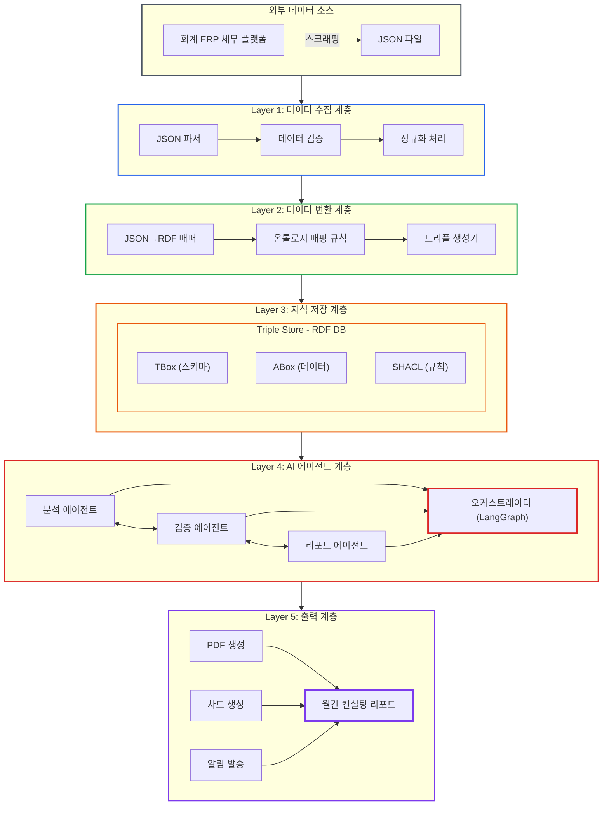
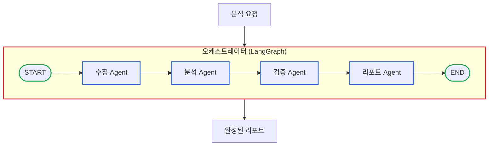
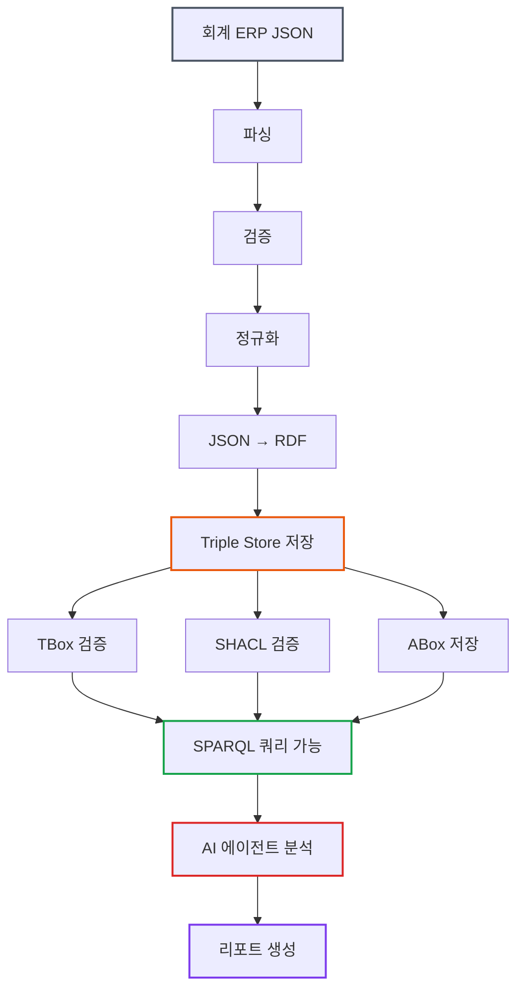

# 세무 AI 시스템 아키텍처 설계: 전체 시스템을 어떻게 구성하는가

> **작성일**: 2026년 1월 9일
> **카테고리**: Architecture, AI, System Design
> **키워드**: 시스템 아키텍처, 데이터 파이프라인, 지식그래프, AI 에이전트, ETL
> **시리즈**: [온톨로지 + AI 에이전트: 세무 컨설팅 시스템 아키텍처](https://blog.imprun.dev/120) (4부/총 20부)
> **대상 독자**: 온톨로지에 입문하는 시니어 개발자

---

## 핵심 질문

> **"전체 시스템을 어떻게 구성하는가?"**

지금까지 온톨로지, 지식그래프, AI 에이전트의 개념을 배웠다. 이제 이 모든 것을 하나의 시스템으로 통합해야 한다. 회계 ERP의 JSON 데이터가 어떻게 RDF로 변환되고, 지식그래프에 저장되며, AI 에이전트가 이를 분석하여 리포트를 생성하는지 전체 흐름을 설계한다.

---

## 요약

이 글에서는 지금까지 배운 온톨로지, 지식그래프, AI 에이전트를 통합하는 **전체 시스템 아키텍처**를 설계한다. 회계 ERP에서 스크래핑한 JSON 데이터가 RDF로 변환되어 지식그래프에 저장되고, AI 에이전트가 이를 분석하여 월간 컨설팅 리포트를 생성하기까지의 전체 흐름을 다룬다. 각 계층의 역할과 컴포넌트 간 상호작용을 명확히 정의한다.

---

## 이전 내용 복습

Part A에서 배운 핵심 개념들:

| 부 | 주제 | 핵심 개념 |
|----|------|----------|
| 1부 | 온톨로지 | TBox(스키마), ABox(데이터), 지식의 구조화 |
| 2부 | 지식그래프 | 트리플, 노드-엣지 구조, 관계 탐색 |
| 3부 | AI 에이전트 | 도구(Tool), ReAct 패턴, 자율적 실행 |

이제 이 모든 것을 하나의 시스템으로 통합한다.

---

## 시스템 요구사항

### 기능적 요구사항

1. **데이터 수집**: 회계 ERP에서 스크래핑한 세무 데이터를 주기적으로 처리
2. **데이터 변환**: JSON 형식의 원시 데이터를 RDF 트리플로 변환
3. **지식 저장**: 변환된 데이터를 지식그래프에 저장
4. **규칙 적용**: SHACL 규칙으로 데이터 검증 및 이상 탐지
5. **분석 수행**: AI 에이전트가 재무 분석 및 인사이트 도출
6. **리포트 생성**: 월간 컨설팅 리포트 자동 생성

### 비기능적 요구사항

- **확장성**: 관리 기업 수 증가에 대응
- **유지보수성**: 새로운 분석 규칙 추가 용이
- **추적가능성**: 분석 근거 명확히 기록
- **보안**: 민감한 재무 데이터 보호

### 아키텍처 결정 근거

시니어 개발자로서 아키텍처 결정의 근거를 명확히 한다.

| 결정 | 선택 | 근거 |
|------|------|------|
| 데이터 모델 | RDF/OWL | 의미론적 추론, 유연한 스키마, 표준화 |
| 저장소 | Triple Store | SPARQL 지원, 추론 엔진 내장 |
| 검증 | SHACL | 선언적 규칙, 검증과 추론 분리 |
| 에이전트 프레임워크 | LangGraph | 상태 기반 워크플로우, 디버깅 용이 |
| 하이브리드 저장소 | RDB + Graph | 트랜잭션(RDB) + 관계 탐색(Graph) |

---

## 전체 시스템 아키텍처

### 아키텍처 개요도



---

## 각 계층 상세 설계

### Layer 1: 데이터 수집 계층

회계 ERP에서 스크래핑한 JSON 데이터를 시스템으로 가져온다.

**입력 데이터 예시**:
```json
{
  "company_info": {
    "business_number": "123-45-67890",
    "company_name": "(주)ABC",
    "representative": "김철수",
    "industry_code": "C29",
    "established_date": "2015-03-01"
  },
  "financial_statements": {
    "fiscal_year": 2025,
    "balance_sheet": {
      "assets": {
        "current_assets": 1200000000,
        "non_current_assets": 3800000000
      },
      "liabilities": {
        "current_liabilities": 800000000,
        "non_current_liabilities": 2200000000
      },
      "equity": {
        "capital": 1000000000,
        "retained_earnings": 1000000000
      }
    },
    "income_statement": {
      "revenue": 5000000000,
      "cost_of_sales": 3500000000,
      "operating_expenses": 700000000,
      "operating_income": 800000000,
      "net_income": 600000000
    }
  },
  "tax_filings": [
    {
      "tax_type": "VAT",
      "period": "2025-Q1",
      "amount": 150000000,
      "due_date": "2025-04-25"
    }
  ]
}
```

**처리 단계**:

1. **JSON 파서**: 원시 JSON 파일 읽기
2. **데이터 검증**: 필수 필드 존재 여부, 데이터 타입 확인
3. **정규화 처리**: 금액 단위 통일, 날짜 형식 표준화

```python
class DataCollector:
    def collect(self, json_path: str) -> dict:
        # 1. JSON 파싱
        raw_data = self.parse_json(json_path)

        # 2. 데이터 검증
        validated_data = self.validate(raw_data)

        # 3. 정규화
        normalized_data = self.normalize(validated_data)

        return normalized_data

    def validate(self, data: dict) -> dict:
        required_fields = ['company_info', 'financial_statements']
        for field in required_fields:
            if field not in data:
                raise ValueError(f"필수 필드 누락: {field}")
        return data

    def normalize(self, data: dict) -> dict:
        # 금액을 원 단위로 통일
        # 날짜를 ISO 형식으로 변환
        return data
```

### Layer 2: 데이터 변환 계층

JSON 데이터를 RDF 트리플로 변환한다.

**변환 규칙 (매핑 스키마)**:

```python
MAPPING_RULES = {
    "company_info.business_number": {
        "predicate": "tax:businessNumber",
        "datatype": "xsd:string"
    },
    "company_info.company_name": {
        "predicate": "tax:companyName",
        "datatype": "xsd:string"
    },
    "financial_statements.income_statement.revenue": {
        "predicate": "fin:revenue",
        "datatype": "xsd:decimal"
    },
    # ...
}
```

**변환 결과 (Turtle 형식 RDF)**:

```turtle
@prefix tax: <http://example.org/tax#> .
@prefix fin: <http://example.org/financial#> .
@prefix xsd: <http://www.w3.org/2001/XMLSchema#> .

tax:Company_12345678901 a tax:Company ;
    tax:businessNumber "123-45-67890" ;
    tax:companyName "(주)ABC" ;
    tax:representative "김철수" ;
    tax:industryCode "C29" ;
    tax:establishedDate "2015-03-01"^^xsd:date .

fin:FinancialStatement_12345678901_2025 a fin:FinancialStatement ;
    fin:belongsTo tax:Company_12345678901 ;
    fin:fiscalYear 2025 ;
    fin:revenue 5000000000 ;
    fin:operatingIncome 800000000 ;
    fin:netIncome 600000000 ;
    fin:totalAssets 5000000000 ;
    fin:totalLiabilities 3000000000 ;
    fin:totalEquity 2000000000 .
```

### Layer 3: 지식 저장 계층

RDF 트리플을 저장하고 조회하는 트리플 스토어.

**구성 요소**:

| 구성 요소 | 역할 | 내용 |
|----------|------|------|
| **TBox** | 스키마 정의 | 클래스, 프로퍼티, 계층 관계 |
| **ABox** | 실제 데이터 | 기업 정보, 재무제표, 세금 내역 |
| **SHACL** | 검증 규칙 | 데이터 무결성, 비즈니스 규칙 |

**TBox 예시 (온톨로지 스키마)**:

```turtle
@prefix tax: <http://example.org/tax#> .
@prefix fin: <http://example.org/financial#> .
@prefix owl: <http://www.w3.org/2002/07/owl#> .
@prefix rdfs: <http://www.w3.org/2000/01/rdf-schema#> .

# 클래스 정의
tax:Company a owl:Class ;
    rdfs:label "기업" .

fin:FinancialStatement a owl:Class ;
    rdfs:label "재무제표" .

fin:BalanceSheet a owl:Class ;
    rdfs:subClassOf fin:FinancialStatement ;
    rdfs:label "대차대조표" .

fin:IncomeStatement a owl:Class ;
    rdfs:subClassOf fin:FinancialStatement ;
    rdfs:label "손익계산서" .

# 프로퍼티 정의
fin:revenue a owl:DatatypeProperty ;
    rdfs:domain fin:IncomeStatement ;
    rdfs:range xsd:decimal ;
    rdfs:label "매출" .

fin:belongsTo a owl:ObjectProperty ;
    rdfs:domain fin:FinancialStatement ;
    rdfs:range tax:Company ;
    rdfs:label "소속 기업" .
```

**SHACL 규칙 예시**:

```turtle
@prefix sh: <http://www.w3.org/ns/shacl#> .
@prefix tax: <http://example.org/tax#> .
@prefix fin: <http://example.org/financial#> .

# 부채비율 경고 규칙
fin:DebtRatioWarningShape a sh:NodeShape ;
    sh:targetClass fin:FinancialStatement ;
    sh:sparql [
        sh:message "부채비율이 200%를 초과합니다. 재무 위험 경고." ;
        sh:severity sh:Warning ;
        sh:select """
            SELECT $this
            WHERE {
                $this fin:totalLiabilities ?liabilities .
                $this fin:totalEquity ?equity .
                FILTER(?equity > 0)
                BIND(?liabilities / ?equity * 100 AS ?debtRatio)
                FILTER(?debtRatio > 200)
            }
        """
    ] .

# 필수 필드 검증 규칙
fin:FinancialStatementShape a sh:NodeShape ;
    sh:targetClass fin:FinancialStatement ;
    sh:property [
        sh:path fin:revenue ;
        sh:minCount 1 ;
        sh:datatype xsd:decimal ;
        sh:message "매출 정보가 누락되었습니다."
    ] ;
    sh:property [
        sh:path fin:fiscalYear ;
        sh:minCount 1 ;
        sh:datatype xsd:integer ;
        sh:message "회계연도가 누락되었습니다."
    ] .
```

### Layer 4: AI 에이전트 계층

지식그래프를 활용하여 분석을 수행하는 AI 에이전트들.

**에이전트 구성**:



**각 에이전트의 역할**:

| 에이전트 | 역할 | 도구 |
|----------|------|------|
| **수집 Agent** | 지식그래프에서 필요한 데이터 조회 | `query_sparql`, `get_company_info` |
| **분석 Agent** | 재무비율 계산, 추세 분석, 벤치마크 비교 | `calc_ratios`, `analyze_trend`, `compare_benchmark` |
| **검증 Agent** | SHACL 규칙 실행, 이상 탐지 | `run_shacl_validation`, `detect_anomalies` |
| **리포트 Agent** | 분석 결과를 리포트로 정리 | `generate_report`, `create_chart` |

### Layer 5: 출력 계층

최종 결과물을 생성하고 전달한다.

**월간 리포트 구조**:

```markdown
# (주)ABC 2025년 1월 재무 컨설팅 리포트

## 1. 요약
- 종합 재무 건전성: 양호
- 주요 이슈: 부채 증가 추세 모니터링 필요
- 권고 사항: 2건

## 2. 재무 현황

### 2.1 주요 재무지표
| 지표 | 수치 | 업종 평균 | 평가 |
|------|------|----------|------|
| 영업이익률 | 16% | 8% | 우수 |
| 부채비율 | 66.7% | 100% | 양호 |
| 유동비율 | 150% | 120% | 양호 |

### 2.2 추세 분석
[매출 및 영업이익 추세 차트]

## 3. 이상 탐지 결과
- 경고 사항: 없음
- 주의 사항: 부채 3년 연속 증가 (25억→28억→30억)

## 4. 권고 사항
1. 부채 증가 추세 모니터링 강화
2. 다음 분기 자금 조달 계획 수립 검토

## 5. 첨부
- 상세 재무제표
- 업종 비교 분석 데이터
```

---

## 데이터 흐름 상세

### 전체 데이터 흐름



### 월간 리포트 생성 흐름

```python
async def generate_monthly_report(company_id: str, month: str):
    # 1. 데이터 수집
    financial_data = await collect_agent.run(
        f"{company_id}의 {month} 재무 데이터 수집"
    )

    # 2. 분석 수행
    analysis_result = await analysis_agent.run(
        f"재무 데이터 분석: {financial_data}"
    )

    # 3. 검증 수행
    validation_result = await validation_agent.run(
        f"SHACL 규칙 기반 검증: {financial_data}"
    )

    # 4. 리포트 생성
    report = await report_agent.run(
        f"""
        리포트 생성:
        - 분석 결과: {analysis_result}
        - 검증 결과: {validation_result}
        - 형식: 월간 컨설팅 리포트
        """
    )

    return report
```

---

## 기술 스택 정리

### 선택한 기술

| 계층 | 기술 | 선택 이유 |
|------|------|----------|
| **데이터 수집** | Python + JSON | 단순하고 범용적 |
| **데이터 변환** | RDFLib | Python 친화적, 경량 |
| **지식 저장** | RDFLib + SQLite | 소규모에 적합, 설치 간편 |
| **쿼리** | SPARQL | RDF 표준 쿼리 언어 |
| **검증** | pySHACL | Python SHACL 구현체 |
| **AI 에이전트** | LangChain + LangGraph | 에이전트 구축 표준 |
| **LLM** | Claude / GPT-4 | 고품질 추론 |
| **리포트** | Jinja2 + WeasyPrint | 템플릿 기반 PDF 생성 |

### 기술 선택 근거 (시니어 개발자 관점)

**RDFLib vs GraphDB/Neo4j**
- **RDFLib 선택 이유**: 학습 목적에 적합, 설치 간편, Python 통합 용이
- **프로덕션 전환 시**: GraphDB(추론 엔진 필요 시) 또는 Neo4j(고성능 필요 시) 검토

**LangGraph vs AutoGen vs CrewAI**
- **LangGraph 선택 이유**: 상태 관리 명확, 디버깅 용이, LangChain 생태계 통합
- **멀티 에이전트 필요 시**: 동일 프레임워크 내에서 확장 가능

### 디렉토리 구조

```
tax-consulting-system/
├── config/
│   └── settings.py           # 환경 설정
├── data/
│   ├── raw/                  # 회계 ERP JSON 원본
│   ├── processed/            # 정규화된 데이터
│   └── output/               # 생성된 리포트
├── ontology/
│   ├── tbox.ttl              # TBox (스키마)
│   ├── shacl_rules.ttl       # SHACL 규칙
│   └── mapping_rules.py      # JSON→RDF 매핑
├── src/
│   ├── collectors/           # 데이터 수집
│   ├── transformers/         # 데이터 변환
│   ├── knowledge_graph/      # 지식그래프 관리
│   ├── agents/               # AI 에이전트
│   │   ├── collect_agent.py
│   │   ├── analysis_agent.py
│   │   ├── validation_agent.py
│   │   └── report_agent.py
│   ├── tools/                # 에이전트 도구
│   └── reports/              # 리포트 생성
├── templates/
│   └── monthly_report.html   # 리포트 템플릿
├── tests/
└── main.py                   # 진입점
```

---

## 구현 로드맵

### Phase 1: 지식 표현 기반 구축 (5-9부)

```
Week 1-2: RDF 기초 학습 및 실습
Week 3-4: OWL TBox 설계
Week 5-6: SPARQL 쿼리 학습
Week 7-8: SHACL 규칙 정의
Week 9-10: 재무제표 온톨로지 완성
```

### Phase 2: LangChain/LangGraph 학습 (10-13부)

```
Week 11-12: LangChain 기초
Week 13-14: RAG 구현
Week 15-16: LangGraph 에이전트
Week 17-18: 커스텀 도구 개발
```

### Phase 3: 도메인 적용 (14-17부)

```
Week 19-20: 회계 ERP JSON → RDF 변환
Week 21-22: 세무 분석 SHACL 규칙
Week 23-24: GraphRAG 통합
Week 25-26: 세무 분석 에이전트
```

### Phase 4: 시스템 통합 (18-20부)

```
Week 27-28: 리포트 파이프라인
Week 29-30: 멀티 에이전트 시스템
Week 31-32: 프로덕션 배포
```

---

## 핵심 정리

### 5개 계층 요약

| 계층 | 역할 | 핵심 기술 |
|------|------|----------|
| 데이터 수집 | 원시 데이터 정규화 | Python, JSON |
| 데이터 변환 | JSON → RDF 변환 | RDFLib, 매핑 규칙 |
| 지식 저장 | 트리플 저장 및 조회 | Triple Store, SPARQL |
| AI 에이전트 | 분석 및 추론 | LangGraph, ReAct |
| 출력 | 리포트 생성 | Jinja2, PDF |

### 핵심 설계 원칙

1. **관심사 분리**: 각 계층은 독립적으로 변경 가능
2. **규칙 기반**: 비즈니스 로직은 SHACL 규칙으로 외부화
3. **투명성**: 에이전트의 추론 과정 추적 가능
4. **확장성**: 새로운 분석 규칙 추가 용이

### 아키텍처 결정 요약

| 결정 포인트 | 선택 | 대안 | 트레이드오프 |
|------------|------|------|-------------|
| 데이터 모델 | RDF | 프로퍼티 그래프 | 표준화 vs 단순성 |
| 저장소 | RDFLib (개발), GraphDB (프로덕션) | Neo4j | 추론 vs 성능 |
| 에이전트 | LangGraph | AutoGen, CrewAI | 유연성 vs 학습곡선 |
| 검증 | SHACL | OWL 제약 | 검증 vs 추론 |

---

## 다음 단계 미리보기

**Part B: 지식 표현 기술 (5-9부)**

이제 아키텍처 설계가 완료되었다. Part B에서는 지식 표현 계층을 실제로 구현한다:

- **5부**: RDF 기초 - 트리플 작성 실습
- **6부**: OWL TBox - 세무 온톨로지 스키마 설계
- **7부**: SPARQL - 지식그래프 쿼리 마스터
- **8부**: SHACL - 검증 규칙 정의
- **9부**: 재무제표 온톨로지 완성

다음 5부에서는 RDF의 기본 문법과 Turtle 포맷으로 실제 트리플을 작성하는 방법을 다룬다.

---

## 참고 자료

### 시스템 아키텍처
- [The Twelve-Factor App](https://12factor.net/)
- [Clean Architecture](https://blog.cleancoder.com/uncle-bob/2012/08/13/the-clean-architecture.html)

### 지식그래프 아키텍처
- [Enterprise Knowledge Graph Foundation](https://www.poolparty.biz/what-is-an-enterprise-knowledge-graph)
- [Building Knowledge Graphs (O'Reilly)](https://www.oreilly.com/library/view/building-knowledge-graphs/9781098127091/)

### 관련 시리즈
- [이전: AI 에이전트 개념](https://blog.imprun.dev/123)
- [다음: RDF 기초](https://blog.imprun.dev/125)
- [시리즈 목차](https://blog.imprun.dev/120)
