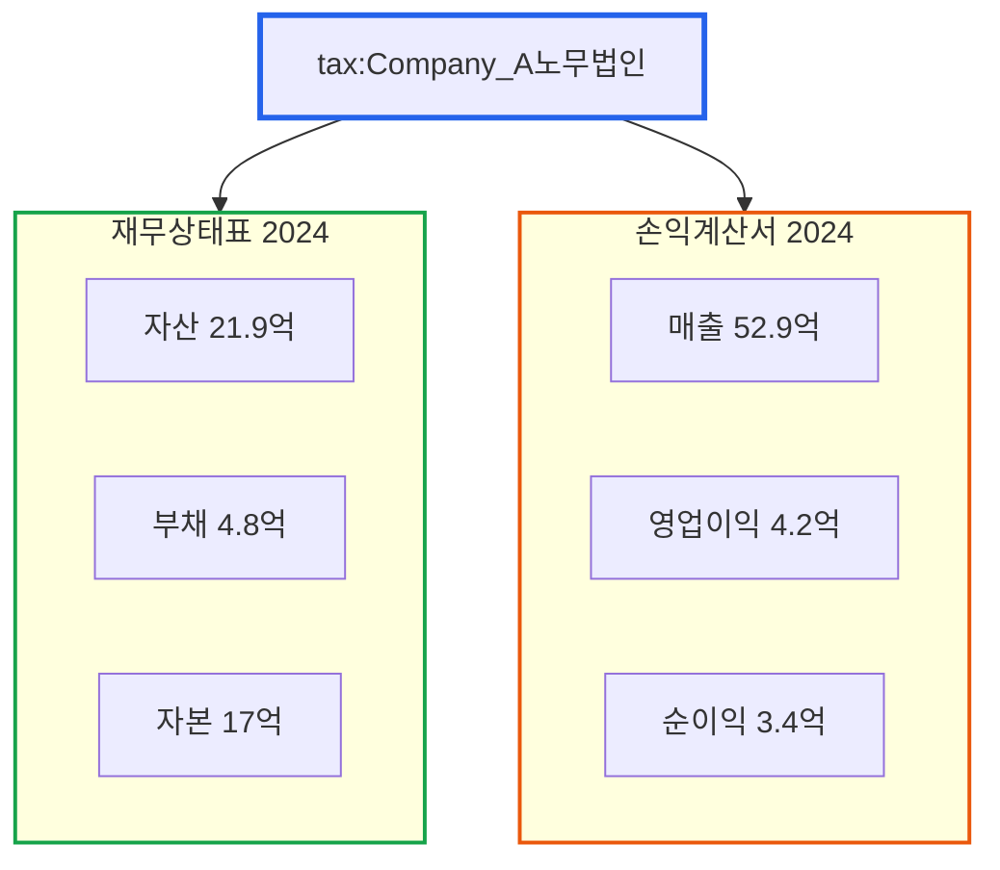

# RDF 기초: 세계를 트리플로 표현하기

> **작성일**: 2026년 1월 9일
> **카테고리**: Ontology, RDF, Semantic Web
> **키워드**: RDF, 트리플, Turtle, 시맨틱 웹, 지식 표현
> **시리즈**: [온톨로지 + AI 에이전트: 세무 컨설팅 시스템 아키텍처](https://blog.imprun.dev/120) (5부/총 20부)
> **대상 독자**: 온톨로지에 입문하는 시니어 개발자

---

## 핵심 질문

> **(주어, 술어, 목적어)만으로 무엇을 표현할 수 있는가?**

이 질문에 답하기 위해 이번 편에서 다루는 내용:
- 왜 관계형 테이블이 아닌 그래프인가?
- 트리플의 세 구성 요소와 URI의 역할
- 실제 재무 데이터를 트리플로 변환하는 전략
- Turtle 문법과 네임스페이스의 설계 의도

---

## 요약

RDF(Resource Description Framework)는 웹에서 데이터를 표현하는 W3C 표준이다. 모든 정보를 "주어-술어-목적어" 형태의 트리플로 표현하며, 이 트리플들이 모여 지식그래프를 형성한다. 이 글에서는 실제 세무 데이터(재무상태표, 손익계산서)를 RDF 트리플로 변환하는 과정을 다룬다. Python의 RDFLib 라이브러리를 사용하여 JSON 데이터를 RDF로 변환하고 저장하는 실습을 진행한다.

---

## 이전 내용 복습

Part A에서 배운 핵심 개념:
- **온톨로지**: 지식을 구조화하는 체계 (TBox + ABox)
- **지식그래프**: 트리플 기반의 그래프 데이터 구조
- **AI 에이전트**: 도구를 사용해 자율적으로 작업 수행
- **시스템 아키텍처**: 5개 계층 (수집 → 변환 → 저장 → 분석 → 출력)

이제 Part B에서 실제로 지식 표현 기술을 구현한다. 첫 단계는 RDF다.

---

## 실제 세무 데이터 살펴보기

실습에서 사용할 데이터는 **A노무법인**의 실제 재무 데이터다. 먼저 원본 JSON 구조를 살펴본다.

### 재무상태표 (Balance Sheet)

```json
{
  "name": "2024",
  "type": "BS",
  "contents": {
    "title": "재무상태표",
    "company": "A노무법인",
    "당기": "제 4기  2024년  12월  31일  현재",
    "전기": "제 3기  2023년  12월  31일  현재",
    "year": "2024",
    "sum": {
      "자산총계": [2194433171, 2579529430, 0],
      "부채총계": [486333117, 1212553609, 0],
      "자본총계": [1708100054, 1366975821, 0],
      "유동자산": [766807888, 1220566005, 0],
      "비유동자산": [1427625283, 1358963425, 0],
      "유동부채": [486333117, 608248031, 0],
      "비유동부채": [0, 604305578, 0]
    },
    "data": {
      "자산": {
        "유동자산": {
          "당좌자산": {
            "보통예금": [685741852, 1183577300, 0],
            "외상매출금": [0, 4450000, 0],
            "미수금": [10200481, 3085740, 0],
            "선급금": [35754157, 2860480, 0]
          }
        },
        "비유동자산": {
          "유형자산": {
            "토지": [113646000, 113646000, 0],
            "건물": [103673263, 106406953, 0],
            "비품": [66717992, 56904134, 0]
          }
        }
      }
    },
    "당기순이익": [341124233, 630485442]
  }
}
```

**데이터 구조 특징**:
- 배열의 인덱스: `[당기, 전기, 전전기]` (3개년)
- 계층 구조: 자산 > 유동자산 > 당좌자산 > 보통예금
- 숫자 단위: 원 (정수)

### 손익계산서 (Income Statement)

```json
{
  "name": "2024",
  "type": "IS",
  "contents": {
    "title": "손익계산서",
    "company": "A노무법인",
    "당기": "제 4(당)기 2024년  1월  1일부터  2024년 12월 31일까지",
    "year": "2024",
    "sum": {
      "매출액": [5297933879, 4733703948, 3012297097],
      "영업이익": [420100720, 741223433, 472096906],
      "당기순이익": [341124233, 630485442, 514169773],
      "판매비와관리비": [4877833159, 3992480515, 2540200191]
    },
    "data": {
      "매출액": {
        "수수료수입": [5297933879, 4733703948, 3012297097]
      },
      "판매비와관리비": {
        "임원급여": [1200000000, 1200000000, 918560000],
        "직원급여": [2115389334, 1632617894, 832105490],
        "복리후생비": [252091099, 145149876, 99712973],
        "광고선전비": [189845118, 166949273, 130572667]
      }
    }
  }
}
```

---

## 왜 그래프인가?

관계형 데이터베이스의 테이블 구조는 스키마가 고정되어 있다. 재무상태표에 새 계정과목이 추가되면 ALTER TABLE이 필요하다. 반면 그래프 구조는 새로운 관계를 언제든 추가할 수 있다.

| 관계형 DB | 그래프 DB |
|----------|----------|
| 테이블 + 외래키 조인 | 노드 + 엣지 |
| 스키마 변경 = DDL 작업 | 새 트리플 추가만으로 확장 |
| 다대다 관계 = 조인 테이블 | 직접 연결 |
| NULL로 빈 칸 표현 | 해당 트리플 자체가 없음 |

세무 분석에서는 "A회사가 B회사를 지배한다", "C계정이 D계정의 하위 항목이다"처럼 **관계 자체가 핵심 정보**다. 이런 관계를 가장 자연스럽게 표현하는 방법이 그래프다.

---

## RDF란 무엇인가?

### 기본 개념: 트리플

RDF의 핵심은 **트리플(Triple)**이다. 모든 정보를 세 부분으로 표현한다:

```
주어 (Subject)  ──  술어 (Predicate)  ──  목적어 (Object)
```

예시:
```
A노무법인  ──  매출액  ──  52.9억 원
A노무법인  ──  업종  ──  노무법인
직원A  ──  근무처  ──  A노무법인
```

### URI: 전 세계에서 유일한 식별자

RDF에서 모든 개념은 **URI(Uniform Resource Identifier)**로 식별된다.

```
http://example.org/company/A노무법인
http://example.org/financial/revenue
http://example.org/employee/직원A
```

URI를 사용하면:
1. **유일성**: 전 세계에서 같은 개념은 같은 URI로 표현
2. **연결성**: 다른 시스템의 데이터와 연결 가능
3. **확장성**: 새로운 개념 추가 시 충돌 없음

### 네임스페이스와 접두사

긴 URI를 매번 쓰기 번거로우므로 **접두사(Prefix)**를 사용한다.

```turtle
@prefix company: <http://example.org/company/> .
@prefix fin: <http://example.org/financial/> .

# 이제 짧게 쓸 수 있다
company:A노무법인 fin:revenue 5297933879 .
```

---

## Turtle 형식으로 RDF 작성하기

### Turtle이란?

Turtle(Terse RDF Triple Language)은 RDF를 사람이 읽기 쉬운 형태로 작성하는 문법이다.

### 기본 문법

```turtle
# 주석은 #로 시작

# 접두사 선언
@prefix rdf: <http://www.w3.org/1999/02/22-rdf-syntax-ns#> .
@prefix rdfs: <http://www.w3.org/2000/01/rdf-schema#> .
@prefix xsd: <http://www.w3.org/2001/XMLSchema#> .
@prefix company: <http://example.org/company/> .
@prefix fin: <http://example.org/financial/> .

# 트리플 작성 (마침표로 끝남)
company:A노무법인 rdf:type company:Company .
company:A노무법인 rdfs:label "A노무법인" .
company:A노무법인 fin:industry "노무법인" .
```

### 같은 주어에 대한 여러 술어

세미콜론(;)을 사용하면 같은 주어에 대해 여러 술어를 연결할 수 있다.

```turtle
company:A노무법인
    rdf:type company:Company ;
    rdfs:label "A노무법인" ;
    fin:industry "노무법인" ;
    fin:establishedYear 2021 .
```

### 같은 주어-술어에 대한 여러 목적어

쉼표(,)를 사용하면 같은 주어-술어에 대해 여러 목적어를 나열할 수 있다.

```turtle
company:A노무법인
    fin:hasEmployee company:직원A , company:직원B , company:직원C .
```

### 데이터 타입 지정

```turtle
# 정수
fin:amount "5297933879"^^xsd:integer .

# 날짜
fin:date "2024-12-31"^^xsd:date .

# 문자열 (기본값, 생략 가능)
rdfs:label "A노무법인"^^xsd:string .
rdfs:label "A노무법인" .  # 동일
```

---

## 실습: 재무상태표를 RDF로 변환하기

### 변환 전략

JSON의 계층 구조를 RDF 트리플로 변환하는 전략:

1. **회사** → 클래스 인스턴스로 표현
2. **재무제표** → 회사에 연결된 별도 리소스
3. **계정과목** → 재무제표에 연결된 속성
4. **연도별 값** → 각 연도별 재무제표 리소스

### 변환 결과 (Turtle)

```turtle
@prefix rdf: <http://www.w3.org/1999/02/22-rdf-syntax-ns#> .
@prefix rdfs: <http://www.w3.org/2000/01/rdf-schema#> .
@prefix xsd: <http://www.w3.org/2001/XMLSchema#> .
@prefix tax: <http://example.org/tax/> .
@prefix fin: <http://example.org/financial/> .
@prefix acc: <http://example.org/account/> .

# 회사 정보
tax:Company_A노무법인
    rdf:type tax:Company ;
    rdfs:label "A노무법인" ;
    tax:companyType "노무법인" ;
    tax:fiscalPeriod 4 .

# 2024년 재무상태표
fin:BS_A노무법인_2024
    rdf:type fin:BalanceSheet ;
    fin:belongsTo tax:Company_A노무법인 ;
    fin:fiscalYear 2024 ;
    fin:fiscalPeriod "제 4기" ;
    fin:reportDate "2024-12-31"^^xsd:date ;

    # 자산
    acc:totalAssets 2194433171 ;
    acc:currentAssets 766807888 ;
    acc:nonCurrentAssets 1427625283 ;

    # 유동자산 상세
    acc:cashAndDeposits 685741852 ;
    acc:accountsReceivable 0 ;
    acc:otherReceivables 10200481 ;
    acc:prepaidExpenses 35754157 ;

    # 비유동자산 상세
    acc:land 113646000 ;
    acc:buildings 103673263 ;
    acc:equipment 66717992 ;

    # 부채
    acc:totalLiabilities 486333117 ;
    acc:currentLiabilities 486333117 ;
    acc:nonCurrentLiabilities 0 ;

    # 자본
    acc:totalEquity 1708100054 ;
    acc:paidInCapital 30000000 ;
    acc:retainedEarnings 1678100054 .

# 2023년 재무상태표
fin:BS_A노무법인_2023
    rdf:type fin:BalanceSheet ;
    fin:belongsTo tax:Company_A노무법인 ;
    fin:fiscalYear 2023 ;
    fin:fiscalPeriod "제 3기" ;
    fin:reportDate "2023-12-31"^^xsd:date ;

    acc:totalAssets 2579529430 ;
    acc:currentAssets 1220566005 ;
    acc:nonCurrentAssets 1358963425 ;
    acc:totalLiabilities 1212553609 ;
    acc:currentLiabilities 608248031 ;
    acc:nonCurrentLiabilities 604305578 ;
    acc:totalEquity 1366975821 .
```

### 손익계산서 RDF 변환

```turtle
# 2024년 손익계산서
fin:IS_A노무법인_2024
    rdf:type fin:IncomeStatement ;
    fin:belongsTo tax:Company_A노무법인 ;
    fin:fiscalYear 2024 ;
    fin:periodStart "2024-01-01"^^xsd:date ;
    fin:periodEnd "2024-12-31"^^xsd:date ;

    # 수익
    acc:revenue 5297933879 ;
    acc:serviceIncome 5297933879 ;

    # 비용
    acc:sellingAndAdminExpenses 4877833159 ;
    acc:executiveSalaries 1200000000 ;
    acc:employeeSalaries 2115389334 ;
    acc:welfareExpenses 252091099 ;
    acc:advertisingExpenses 189845118 ;

    # 이익
    acc:operatingIncome 420100720 ;
    acc:incomeBeforeTax 413490303 ;
    acc:incomeTax 72366070 ;
    acc:netIncome 341124233 .

# 2023년 손익계산서
fin:IS_A노무법인_2023
    rdf:type fin:IncomeStatement ;
    fin:belongsTo tax:Company_A노무법인 ;
    fin:fiscalYear 2023 ;

    acc:revenue 4733703948 ;
    acc:operatingIncome 741223433 ;
    acc:netIncome 630485442 .

# 2022년 손익계산서
fin:IS_A노무법인_2022
    rdf:type fin:IncomeStatement ;
    fin:belongsTo tax:Company_A노무법인 ;
    fin:fiscalYear 2022 ;

    acc:revenue 3012297097 ;
    acc:operatingIncome 472096906 ;
    acc:netIncome 514169773 .
```

---

## Python으로 RDF 생성하기

### RDFLib 설치

```bash
pip install rdflib
```

### JSON을 RDF로 변환하는 코드

```python
from rdflib import Graph, Namespace, Literal, URIRef
from rdflib.namespace import RDF, RDFS, XSD
import json

# 네임스페이스 정의
TAX = Namespace("http://example.org/tax/")
FIN = Namespace("http://example.org/financial/")
ACC = Namespace("http://example.org/account/")

def create_graph():
    """RDF 그래프 생성 및 네임스페이스 바인딩"""
    g = Graph()
    g.bind("tax", TAX)
    g.bind("fin", FIN)
    g.bind("acc", ACC)
    return g

def add_company(g, company_name: str):
    """회사 정보를 그래프에 추가"""
    company_uri = TAX[f"Company_{company_name}"]
    g.add((company_uri, RDF.type, TAX.Company))
    g.add((company_uri, RDFS.label, Literal(company_name)))
    return company_uri

def convert_balance_sheet(g, company_uri, bs_data: dict):
    """재무상태표 JSON을 RDF로 변환"""
    contents = bs_data["contents"]
    year = int(contents["year"])
    company_name = "A노무법인"  # 익명화

    # 재무상태표 리소스 생성
    bs_uri = FIN[f"BS_{company_name}_{year}"]
    g.add((bs_uri, RDF.type, FIN.BalanceSheet))
    g.add((bs_uri, FIN.belongsTo, company_uri))
    g.add((bs_uri, FIN.fiscalYear, Literal(year, datatype=XSD.integer)))

    # 요약 항목 추가 (당기 = 인덱스 0)
    summary = contents["sum"]

    mapping = {
        "자산총계": ACC.totalAssets,
        "부채총계": ACC.totalLiabilities,
        "자본총계": ACC.totalEquity,
        "유동자산": ACC.currentAssets,
        "비유동자산": ACC.nonCurrentAssets,
        "유동부채": ACC.currentLiabilities,
        "비유동부채": ACC.nonCurrentLiabilities,
    }

    for kor_name, predicate in mapping.items():
        if kor_name in summary:
            value = summary[kor_name][0]  # 당기 값
            g.add((bs_uri, predicate, Literal(value, datatype=XSD.integer)))

    return bs_uri

def convert_income_statement(g, company_uri, is_data: dict):
    """손익계산서 JSON을 RDF로 변환"""
    contents = is_data["contents"]
    year = int(contents["year"])
    company_name = "A노무법인"

    # 손익계산서 리소스 생성
    is_uri = FIN[f"IS_{company_name}_{year}"]
    g.add((is_uri, RDF.type, FIN.IncomeStatement))
    g.add((is_uri, FIN.belongsTo, company_uri))
    g.add((is_uri, FIN.fiscalYear, Literal(year, datatype=XSD.integer)))

    # 요약 항목 추가
    summary = contents["sum"]

    mapping = {
        "매출액": ACC.revenue,
        "영업이익": ACC.operatingIncome,
        "당기순이익": ACC.netIncome,
        "판매비와관리비": ACC.sellingAndAdminExpenses,
        "법인세등": ACC.incomeTax,
    }

    for kor_name, predicate in mapping.items():
        if kor_name in summary:
            value = summary[kor_name][0]  # 당기 값
            g.add((is_uri, predicate, Literal(value, datatype=XSD.integer)))

    # 판관비 상세 항목
    if "data" in contents and "판매비와관리비" in contents["data"]:
        expenses = contents["data"]["판매비와관리비"]
        expense_mapping = {
            "임원급여": ACC.executiveSalaries,
            "직원급여": ACC.employeeSalaries,
            "복리후생비": ACC.welfareExpenses,
            "광고선전비": ACC.advertisingExpenses,
        }

        for kor_name, predicate in expense_mapping.items():
            if kor_name in expenses:
                value = expenses[kor_name][0]
                g.add((is_uri, predicate, Literal(value, datatype=XSD.integer)))

    return is_uri

# 실행 예시
if __name__ == "__main__":
    # 그래프 생성
    g = create_graph()

    # JSON 파일 로드 (실제 경로로 수정)
    with open("재무상태표-bs.json", "r", encoding="utf-8") as f:
        bs_data = json.load(f)

    with open("손익계산서-is.json", "r", encoding="utf-8") as f:
        is_data = json.load(f)

    # 회사 추가
    company_uri = add_company(g, "A노무법인")

    # 재무제표 변환
    convert_balance_sheet(g, company_uri, bs_data)
    convert_income_statement(g, company_uri, is_data)

    # Turtle 형식으로 출력
    print(g.serialize(format="turtle"))

    # 파일로 저장
    g.serialize("tax_knowledge_graph.ttl", format="turtle")
    print(f"\n총 {len(g)} 개의 트리플이 생성되었습니다.")
```

### 실행 결과

```turtle
@prefix acc: <http://example.org/account/> .
@prefix fin: <http://example.org/financial/> .
@prefix rdfs: <http://www.w3.org/2000/01/rdf-schema#> .
@prefix tax: <http://example.org/tax/> .
@prefix xsd: <http://www.w3.org/2001/XMLSchema#> .

tax:Company_A노무법인 a tax:Company ;
    rdfs:label "A노무법인" .

fin:BS_A노무법인_2024 a fin:BalanceSheet ;
    acc:currentAssets 766807888 ;
    acc:currentLiabilities 486333117 ;
    acc:nonCurrentAssets 1427625283 ;
    acc:nonCurrentLiabilities 0 ;
    acc:totalAssets 2194433171 ;
    acc:totalEquity 1708100054 ;
    acc:totalLiabilities 486333117 ;
    fin:belongsTo tax:Company_A노무법인 ;
    fin:fiscalYear 2024 .

fin:IS_A노무법인_2024 a fin:IncomeStatement ;
    acc:advertisingExpenses 189845118 ;
    acc:employeeSalaries 2115389334 ;
    acc:executiveSalaries 1200000000 ;
    acc:incomeTax 72366070 ;
    acc:netIncome 341124233 ;
    acc:operatingIncome 420100720 ;
    acc:revenue 5297933879 ;
    acc:sellingAndAdminExpenses 4877833159 ;
    acc:welfareExpenses 252091099 ;
    fin:belongsTo tax:Company_A노무법인 ;
    fin:fiscalYear 2024 .
```

---

## 트리플 구조 시각화

생성된 트리플을 그래프로 시각화하면:



---

## RDF의 장점

### 1. 유연한 스키마

새로운 속성을 추가해도 기존 데이터에 영향 없음:

```turtle
# 나중에 추가해도 됨
fin:BS_A노무법인_2024
    acc:inventories 0 ;  # 재고자산 (원래 없던 속성)
    acc:intangibleAssets 114616667 .  # 무형자산
```

### 2. 데이터 연결

다른 데이터셋과 연결 가능:

```turtle
# 업종 분류 코드 연결
tax:Company_A노무법인
    tax:industryCode <http://example.org/ksic/N> .  # 한국표준산업분류

# 외부 지식베이스 연결 (개념적 예시)
tax:Company_A노무법인
    owl:sameAs <http://dbpedia.org/resource/Labor_law_firm> .
```

### 3. 추론 가능

규칙을 정의하면 새로운 사실을 추론:

```turtle
# 규칙: 부채비율 = 부채총계 / 자본총계 × 100
# 부채비율 200% 초과 시 "고위험" 분류

# 추론 결과
fin:BS_A노무법인_2024
    fin:debtRatio 28.47 ;  # 486333117 / 1708100054 × 100
    fin:riskLevel "저위험" .
```

---

## 핵심 정리

| 개념 | 설명 | 예시 |
|------|------|------|
| 트리플 | RDF의 기본 단위 | (A노무법인, 매출액, 52.9억) |
| URI | 리소스의 고유 식별자 | `http://example.org/company/A노무법인` |
| 접두사 | URI 축약 표현 | `tax:Company_A노무법인` |
| Turtle | RDF 직렬화 형식 | `.ttl` 파일 |
| RDFLib | Python RDF 라이브러리 | `from rdflib import Graph` |

### JSON → RDF 변환 핵심

1. **리소스 식별**: 각 개체에 URI 부여
2. **관계 정의**: 적절한 술어(predicate) 선택
3. **데이터 타입**: 숫자, 날짜 등 타입 명시
4. **계층 표현**: 중첩 구조는 별도 리소스로 분리

---

## 다음 단계 미리보기

**6부: OWL로 세무 용어 정의하기 - TBox 설계**

5부에서 데이터(ABox)를 RDF로 표현했다. 하지만 "재무상태표란 무엇인가?", "영업이익은 어떻게 계산하는가?"와 같은 **스키마(TBox)**는 아직 정의하지 않았다.

6부에서는 OWL(Web Ontology Language)을 사용하여:
- 클래스 계층 정의 (재무제표 > 재무상태표, 손익계산서)
- 속성의 도메인/레인지 정의
- 계산 규칙 표현 (영업이익 = 매출 - 판관비)
- 제약 조건 정의 (자산총계 = 부채총계 + 자본총계)

를 다룬다.

---

## 참고 자료

### RDF 표준
- [W3C RDF 1.1 Primer](https://www.w3.org/TR/rdf11-primer/)
- [W3C RDF 1.1 Turtle](https://www.w3.org/TR/turtle/)

### RDFLib
- [RDFLib Documentation](https://rdflib.readthedocs.io/)
- [RDFLib GitHub](https://github.com/RDFLib/rdflib)

### 관련 시리즈
- [이전: 세무 AI 시스템 아키텍처 설계](https://blog.imprun.dev/124)
- [다음: OWL로 세무 용어 정의하기](https://blog.imprun.dev/126)
- [시리즈 목차](https://blog.imprun.dev/120)
