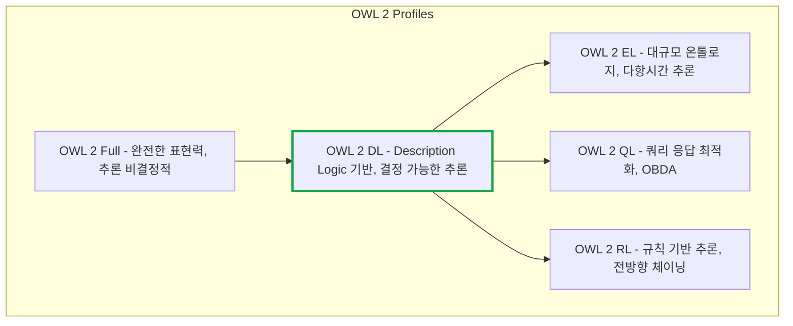
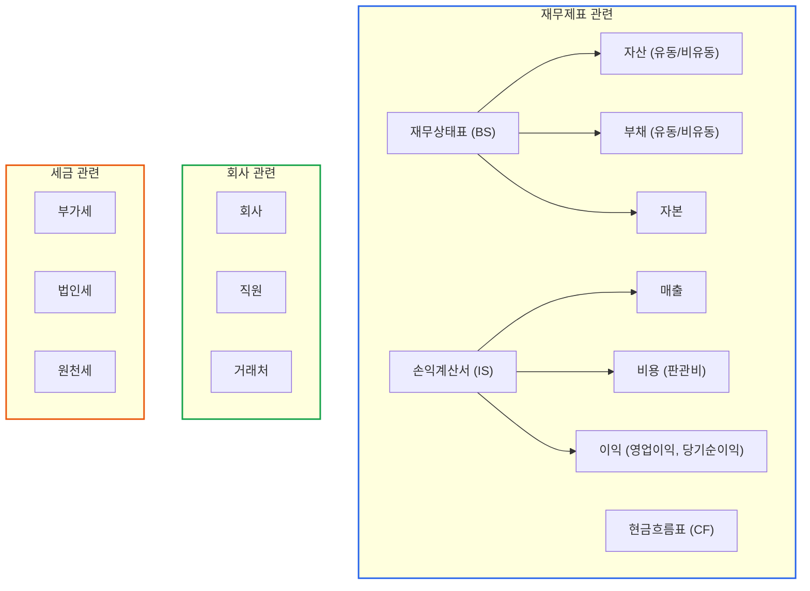
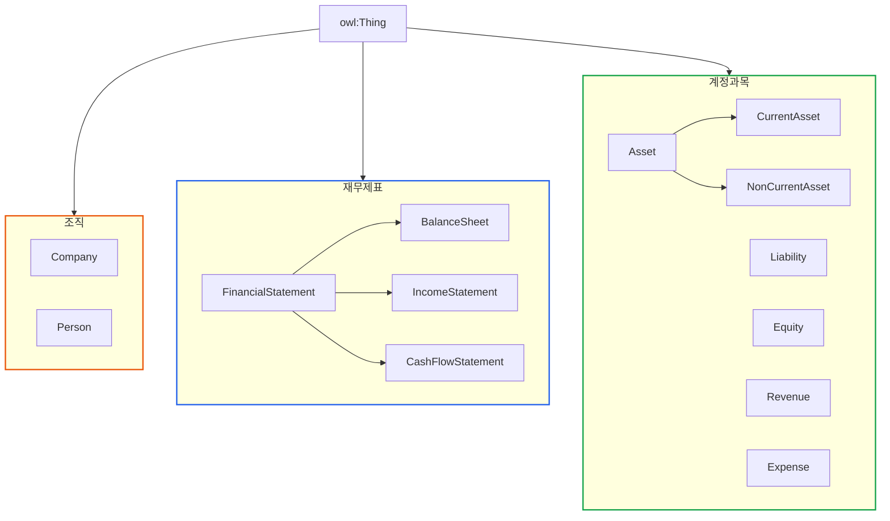

# OWL로 세무 용어 정의하기: TBox 설계

> **작성일**: 2026년 1월 9일
> **카테고리**: Ontology, OWL, Knowledge Modeling
> **키워드**: OWL, TBox, 온톨로지 스키마, 클래스 계층, 속성 정의, OWL 2 DL
> **시리즈**: [온톨로지 + AI 에이전트: 세무 컨설팅 시스템 아키텍처](https://blog.imprun.dev/120) (6부/총 20부)
> **대상 독자**: 온톨로지에 입문하는 시니어 개발자

---

## 핵심 질문

> **클래스 계층과 제약조건을 어떻게 정의하는가?**

이 질문에 답하기 위해 이번 편에서 다루는 내용:
- TBox(스키마)와 ABox(데이터)의 분리 원칙
- OWL 2 DL 표현력: 교집합, 합집합, 여집합 클래스
- 존재 제한과 전칭 제한의 차이
- 카디널리티 제약으로 필수 속성 정의
- OWL 2 프로파일 선택 기준 (DL vs EL vs QL vs RL)

---

## 요약

OWL(Web Ontology Language)은 온톨로지의 스키마(TBox)를 정의하는 W3C 표준 언어다. 5부에서 작성한 RDF 데이터(ABox)가 "A노무법인의 2024년 매출은 52.9억 원이다"라는 사실을 표현했다면, OWL은 "매출이란 무엇인가?", "손익계산서와 재무상태표는 어떤 관계인가?"를 정의한다. 이 글에서는 실제 세무 데이터 구조를 기반으로 재무제표 온톨로지의 TBox를 설계하고 구현한다.

---

## 이전 내용 복습

5부에서 배운 핵심:
- **RDF**: 트리플(주어-술어-목적어) 기반 데이터 표현
- **Turtle**: RDF를 사람이 읽기 쉽게 작성하는 형식
- **RDFLib**: Python에서 RDF를 다루는 라이브러리
- **ABox**: 실제 데이터 (A노무법인의 매출 = 52.9억)

이번 6부에서는 **TBox**(스키마)를 정의한다.

---

## TBox와 ABox 다시 보기

### 비유: 도서관 시스템

**TBox (스키마)**: 도서 분류 규칙
- "책"이라는 개념이 있다
- 책에는 "제목", "저자", "출판년도"가 있다
- "소설"은 "책"의 하위 분류다

**ABox (데이터)**: 실제 도서 목록
- "해리포터"는 책이다
- "해리포터"의 저자는 "J.K. 롤링"이다
- "해리포터"는 소설이다

### 세무 시스템에서

**TBox (스키마)**: 재무 용어 정의
- "재무제표"라는 개념이 있다
- 재무제표에는 "회계연도", "보고일"이 있다
- "손익계산서"는 "재무제표"의 하위 유형이다
- "영업이익"은 "매출" - "판관비"로 계산된다

**ABox (데이터)**: 실제 재무 데이터
- "A노무법인_2024_IS"는 손익계산서다
- "A노무법인_2024_IS"의 매출은 52.9억이다

---

## OWL 기본 개념

### OWL이란?

OWL(Web Ontology Language)은 RDF를 확장하여 **더 풍부한 의미론**을 표현할 수 있는 언어다.

RDF만으로는:
- "손익계산서"가 "재무제표"의 일종이라는 것
- "매출"은 양수여야 한다는 것
- "자산총계 = 부채총계 + 자본총계"라는 것

을 표현하기 어렵다. OWL은 이런 관계와 제약을 명확히 정의할 수 있다.

### OWL의 구성 요소

| 구성 요소 | 설명 | 예시 |
|----------|------|------|
| **클래스(Class)** | 개념의 범주 | `IncomeStatement`, `Company` |
| **개체(Individual)** | 클래스의 인스턴스 | `A노무법인`, `A노무법인_2024_IS` |
| **객체 속성(Object Property)** | 개체 간 관계 | `belongsTo` (손익계산서 → 회사) |
| **데이터 속성(Datatype Property)** | 개체의 값 | `revenue` (매출액 = 52.9억) |

### OWL 2 프로파일 선택

OWL 2는 표현력과 추론 복잡도에 따라 여러 프로파일을 제공한다.



**프로파일 선택 기준**:

| 프로파일 | 사용 사례 | 추론 복잡도 |
|---------|----------|-----------|
| OWL 2 DL | 복잡한 도메인 규칙 표현 | EXPTIME |
| OWL 2 EL | 대규모 의료/생명과학 온톨로지 (SNOMED CT) | PTIME |
| OWL 2 QL | 데이터베이스 위 가상 지식그래프 | LogSpace (쿼리) |
| OWL 2 RL | 대용량 RDF 데이터 추론 | PTIME |

**세무 온톨로지에 OWL 2 DL을 선택한 이유**:
- 중소기업 판정 규칙처럼 **복합 조건** 표현 필요
- 클래스 간 **분리 공리**(내국법인 vs 외국법인) 정의 필요
- 속성 **카디널리티 제약**(회계연도당 재무상태표 1개) 필요
- 추론 결과의 **설명 가능성** 요구

---

## OWL 2 DL 표현력 활용

OWL 2 DL은 Description Logic(기술 논리)에 기반한 표현력을 제공한다. 세무 도메인에서 활용할 수 있는 주요 표현 방법을 살펴본다.

### 클래스 표현식

**1. 교집합 (Intersection) - AND 연산**

"제조업이면서 매출 1,500억 이하인 기업"처럼 여러 조건을 동시에 만족하는 클래스를 정의한다.

```turtle
# 내국법인: 법인이면서 관할구역이 한국인 개체
tax:DomesticCorporation a owl:Class ;
    owl:equivalentClass [
        a owl:Class ;
        owl:intersectionOf (
            tax:Corporation
            [ a owl:Restriction ;
              owl:onProperty tax:jurisdiction ;
              owl:hasValue tax:Korea ]
        )
    ] .
```

**2. 합집합 (Union) - OR 연산**

"법인 또는 개인사업자"처럼 여러 클래스 중 하나에 속하면 되는 경우다.

```turtle
# 과세 대상 법인: 내국법인 또는 외국법인
tax:TaxableEntity a owl:Class ;
    owl:equivalentClass [
        a owl:Class ;
        owl:unionOf (
            tax:DomesticCorporation
            tax:ForeignCorporation
        )
    ] .
```

**3. 여집합 (Complement) - NOT 연산**

"중소기업이 아닌 기업"을 정의할 때 사용한다.

```turtle
# 비중소기업
tax:NonSME a owl:Class ;
    owl:equivalentClass [
        a owl:Class ;
        owl:complementOf tax:SmallMediumEnterprise
    ] .
```

### 제한 표현식 (Restrictions)

**존재 제한 (Existential Restriction)**: "최소한 하나의 ~를 가진"

```turtle
# 자회사를 보유한 회사 = 모회사
tax:ParentCompany a owl:Class ;
    rdfs:subClassOf [
        a owl:Restriction ;
        owl:onProperty tax:hasSubsidiary ;
        owl:someValuesFrom tax:Corporation
    ] .
```

**전칭 제한 (Universal Restriction)**: "모든 ~가 ~인"

```turtle
# 모든 주주가 모회사인 회사 = 완전자회사
tax:WhollyOwnedSubsidiary a owl:Class ;
    rdfs:subClassOf [
        a owl:Restriction ;
        owl:onProperty tax:hasShareHolder ;
        owl:allValuesFrom tax:ParentCompany
    ] .
```

### 카디널리티 제약

회계연도당 재무상태표는 정확히 1개여야 한다. 이런 수량 제약을 표현한다.

```turtle
# 회계연도는 정확히 1개의 재무상태표와 1개의 손익계산서를 가짐
tax:FiscalYear a owl:Class ;
    rdfs:subClassOf [
        a owl:Restriction ;
        owl:onProperty tax:hasBalanceSheet ;
        owl:qualifiedCardinality "1"^^xsd:nonNegativeInteger ;
        owl:onClass tax:BalanceSheet
    ] ;
    rdfs:subClassOf [
        a owl:Restriction ;
        owl:onProperty tax:hasIncomeStatement ;
        owl:qualifiedCardinality "1"^^xsd:nonNegativeInteger ;
        owl:onClass tax:IncomeStatement
    ] .
```

### 정의된 클래스 (Defined Class) 예시

중소기업 판정 기준을 OWL로 표현하면 추론기가 자동으로 분류한다.

```turtle
# 제조업 중소기업 정의
tax:ManufacturingSME a owl:Class ;
    rdfs:label "제조업 중소기업"@ko ;
    owl:equivalentClass [
        a owl:Class ;
        owl:intersectionOf (
            tax:Corporation
            # 업종: 제조업 (10~33)
            [ a owl:Restriction ;
              owl:onProperty tax:industryCode ;
              owl:someValuesFrom [
                  a rdfs:Datatype ;
                  owl:onDatatype xsd:string ;
                  owl:withRestrictions (
                      [ xsd:pattern "^(1[0-9]|2[0-9]|3[0-3]).*" ]
                  )
              ] ]
            # 매출액 기준: 1,500억원 이하
            [ a owl:Restriction ;
              owl:onProperty tax:averageRevenue3Years ;
              owl:someValuesFrom [
                  a rdfs:Datatype ;
                  owl:onDatatype xsd:decimal ;
                  owl:withRestrictions (
                      [ xsd:maxInclusive "150000000000"^^xsd:decimal ]
                  )
              ] ]
            # 독립성 기준: 대기업 계열 아님
            [ a owl:Class ;
              owl:complementOf tax:ConglomerateAffiliate ]
        )
    ] .
```

### 분리 공리 (Disjoint Axioms)

상호 배타적인 클래스를 정의한다. 하나의 개체가 두 클래스에 동시에 속할 수 없다.

```turtle
# 내국법인과 외국법인은 상호 배타적
[] a owl:AllDisjointClasses ;
    owl:members (
        tax:DomesticCorporation
        tax:ForeignCorporation
    ) .

# 재무제표 유형은 상호 배타적
[] a owl:AllDisjointClasses ;
    owl:members (
        tax:BalanceSheet
        tax:IncomeStatement
        tax:CashFlowStatement
    ) .
```

---

## 세무 온톨로지 TBox 설계

### 도메인 분석

실제 JSON 데이터에서 추출한 개념들:



### 클래스 계층 설계



---

## OWL TBox 작성 (Turtle 형식)

### 네임스페이스 선언

```turtle
@prefix rdf: <http://www.w3.org/1999/02/22-rdf-syntax-ns#> .
@prefix rdfs: <http://www.w3.org/2000/01/rdf-schema#> .
@prefix owl: <http://www.w3.org/2002/07/owl#> .
@prefix xsd: <http://www.w3.org/2001/XMLSchema#> .
@prefix tax: <http://example.org/tax/> .
@prefix fin: <http://example.org/financial/> .
@prefix acc: <http://example.org/account/> .

# 온톨로지 선언
<http://example.org/tax-ontology>
    rdf:type owl:Ontology ;
    rdfs:label "세무 분석 온톨로지"@ko ;
    rdfs:comment "세무 데이터 분석을 위한 온톨로지 스키마"@ko ;
    owl:versionInfo "1.0" .
```

### 클래스 정의

```turtle
# ===== 회사 관련 클래스 =====

tax:Company
    rdf:type owl:Class ;
    rdfs:label "회사"@ko ;
    rdfs:comment "법인 또는 개인사업자"@ko .

tax:Corporation
    rdf:type owl:Class ;
    rdfs:subClassOf tax:Company ;
    rdfs:label "법인"@ko .

tax:SoleProprietorship
    rdf:type owl:Class ;
    rdfs:subClassOf tax:Company ;
    rdfs:label "개인사업자"@ko .

tax:Person
    rdf:type owl:Class ;
    rdfs:label "개인"@ko .

tax:Employee
    rdf:type owl:Class ;
    rdfs:subClassOf tax:Person ;
    rdfs:label "직원"@ko .

# ===== 재무제표 클래스 =====

fin:FinancialStatement
    rdf:type owl:Class ;
    rdfs:label "재무제표"@ko ;
    rdfs:comment "기업의 재무 상태를 나타내는 보고서"@ko .

fin:BalanceSheet
    rdf:type owl:Class ;
    rdfs:subClassOf fin:FinancialStatement ;
    rdfs:label "재무상태표"@ko ;
    rdfs:comment "특정 시점의 자산, 부채, 자본을 나타내는 재무제표"@ko .

fin:IncomeStatement
    rdf:type owl:Class ;
    rdfs:subClassOf fin:FinancialStatement ;
    rdfs:label "손익계산서"@ko ;
    rdfs:comment "일정 기간의 수익과 비용을 나타내는 재무제표"@ko .

fin:CashFlowStatement
    rdf:type owl:Class ;
    rdfs:subClassOf fin:FinancialStatement ;
    rdfs:label "현금흐름표"@ko .

# ===== 계정과목 클래스 =====

acc:Account
    rdf:type owl:Class ;
    rdfs:label "계정과목"@ko .

acc:AssetAccount
    rdf:type owl:Class ;
    rdfs:subClassOf acc:Account ;
    rdfs:label "자산 계정"@ko .

acc:LiabilityAccount
    rdf:type owl:Class ;
    rdfs:subClassOf acc:Account ;
    rdfs:label "부채 계정"@ko .

acc:EquityAccount
    rdf:type owl:Class ;
    rdfs:subClassOf acc:Account ;
    rdfs:label "자본 계정"@ko .

acc:RevenueAccount
    rdf:type owl:Class ;
    rdfs:subClassOf acc:Account ;
    rdfs:label "수익 계정"@ko .

acc:ExpenseAccount
    rdf:type owl:Class ;
    rdfs:subClassOf acc:Account ;
    rdfs:label "비용 계정"@ko .
```

### 객체 속성 정의 (Object Properties)

```turtle
# ===== 관계 속성 =====

fin:belongsTo
    rdf:type owl:ObjectProperty ;
    rdfs:label "소속"@ko ;
    rdfs:comment "재무제표가 어떤 회사에 속하는지"@ko ;
    rdfs:domain fin:FinancialStatement ;
    rdfs:range tax:Company .

tax:hasEmployee
    rdf:type owl:ObjectProperty ;
    rdfs:label "직원 보유"@ko ;
    rdfs:domain tax:Company ;
    rdfs:range tax:Employee ;
    owl:inverseOf tax:worksFor .

tax:worksFor
    rdf:type owl:ObjectProperty ;
    rdfs:label "근무처"@ko ;
    rdfs:domain tax:Employee ;
    rdfs:range tax:Company .

fin:hasPreviousPeriod
    rdf:type owl:ObjectProperty ;
    rdfs:label "전기"@ko ;
    rdfs:comment "이전 회계기간의 재무제표"@ko ;
    rdfs:domain fin:FinancialStatement ;
    rdfs:range fin:FinancialStatement .
```

### 데이터 속성 정의 (Datatype Properties)

```turtle
# ===== 회사 속성 =====

tax:companyName
    rdf:type owl:DatatypeProperty ;
    rdfs:label "회사명"@ko ;
    rdfs:domain tax:Company ;
    rdfs:range xsd:string .

tax:businessNumber
    rdf:type owl:DatatypeProperty ;
    rdfs:label "사업자등록번호"@ko ;
    rdfs:domain tax:Company ;
    rdfs:range xsd:string .

tax:industryCode
    rdf:type owl:DatatypeProperty ;
    rdfs:label "업종코드"@ko ;
    rdfs:domain tax:Company ;
    rdfs:range xsd:string .

# ===== 재무제표 속성 =====

fin:fiscalYear
    rdf:type owl:DatatypeProperty ;
    rdfs:label "회계연도"@ko ;
    rdfs:domain fin:FinancialStatement ;
    rdfs:range xsd:integer .

fin:fiscalPeriod
    rdf:type owl:DatatypeProperty ;
    rdfs:label "회계기수"@ko ;
    rdfs:comment "예: 제4기"@ko ;
    rdfs:domain fin:FinancialStatement ;
    rdfs:range xsd:string .

fin:reportDate
    rdf:type owl:DatatypeProperty ;
    rdfs:label "보고일"@ko ;
    rdfs:domain fin:FinancialStatement ;
    rdfs:range xsd:date .

# ===== 재무상태표 금액 속성 =====

acc:totalAssets
    rdf:type owl:DatatypeProperty ;
    rdfs:label "자산총계"@ko ;
    rdfs:domain fin:BalanceSheet ;
    rdfs:range xsd:integer .

acc:currentAssets
    rdf:type owl:DatatypeProperty ;
    rdfs:label "유동자산"@ko ;
    rdfs:domain fin:BalanceSheet ;
    rdfs:range xsd:integer .

acc:nonCurrentAssets
    rdf:type owl:DatatypeProperty ;
    rdfs:label "비유동자산"@ko ;
    rdfs:domain fin:BalanceSheet ;
    rdfs:range xsd:integer .

acc:totalLiabilities
    rdf:type owl:DatatypeProperty ;
    rdfs:label "부채총계"@ko ;
    rdfs:domain fin:BalanceSheet ;
    rdfs:range xsd:integer .

acc:currentLiabilities
    rdf:type owl:DatatypeProperty ;
    rdfs:label "유동부채"@ko ;
    rdfs:domain fin:BalanceSheet ;
    rdfs:range xsd:integer .

acc:nonCurrentLiabilities
    rdf:type owl:DatatypeProperty ;
    rdfs:label "비유동부채"@ko ;
    rdfs:domain fin:BalanceSheet ;
    rdfs:range xsd:integer .

acc:totalEquity
    rdf:type owl:DatatypeProperty ;
    rdfs:label "자본총계"@ko ;
    rdfs:domain fin:BalanceSheet ;
    rdfs:range xsd:integer .

acc:paidInCapital
    rdf:type owl:DatatypeProperty ;
    rdfs:label "자본금"@ko ;
    rdfs:domain fin:BalanceSheet ;
    rdfs:range xsd:integer .

acc:retainedEarnings
    rdf:type owl:DatatypeProperty ;
    rdfs:label "이익잉여금"@ko ;
    rdfs:domain fin:BalanceSheet ;
    rdfs:range xsd:integer .

# ===== 손익계산서 금액 속성 =====

acc:revenue
    rdf:type owl:DatatypeProperty ;
    rdfs:label "매출액"@ko ;
    rdfs:domain fin:IncomeStatement ;
    rdfs:range xsd:integer .

acc:costOfSales
    rdf:type owl:DatatypeProperty ;
    rdfs:label "매출원가"@ko ;
    rdfs:domain fin:IncomeStatement ;
    rdfs:range xsd:integer .

acc:grossProfit
    rdf:type owl:DatatypeProperty ;
    rdfs:label "매출총이익"@ko ;
    rdfs:domain fin:IncomeStatement ;
    rdfs:range xsd:integer .

acc:sellingAndAdminExpenses
    rdf:type owl:DatatypeProperty ;
    rdfs:label "판매비와관리비"@ko ;
    rdfs:domain fin:IncomeStatement ;
    rdfs:range xsd:integer .

acc:operatingIncome
    rdf:type owl:DatatypeProperty ;
    rdfs:label "영업이익"@ko ;
    rdfs:domain fin:IncomeStatement ;
    rdfs:range xsd:integer .

acc:incomeBeforeTax
    rdf:type owl:DatatypeProperty ;
    rdfs:label "법인세차감전이익"@ko ;
    rdfs:domain fin:IncomeStatement ;
    rdfs:range xsd:integer .

acc:incomeTax
    rdf:type owl:DatatypeProperty ;
    rdfs:label "법인세등"@ko ;
    rdfs:domain fin:IncomeStatement ;
    rdfs:range xsd:integer .

acc:netIncome
    rdf:type owl:DatatypeProperty ;
    rdfs:label "당기순이익"@ko ;
    rdfs:domain fin:IncomeStatement ;
    rdfs:range xsd:integer .

# ===== 판관비 상세 속성 =====

acc:executiveSalaries
    rdf:type owl:DatatypeProperty ;
    rdfs:label "임원급여"@ko ;
    rdfs:subPropertyOf acc:sellingAndAdminExpenses ;
    rdfs:range xsd:integer .

acc:employeeSalaries
    rdf:type owl:DatatypeProperty ;
    rdfs:label "직원급여"@ko ;
    rdfs:subPropertyOf acc:sellingAndAdminExpenses ;
    rdfs:range xsd:integer .

acc:welfareExpenses
    rdf:type owl:DatatypeProperty ;
    rdfs:label "복리후생비"@ko ;
    rdfs:subPropertyOf acc:sellingAndAdminExpenses ;
    rdfs:range xsd:integer .

acc:advertisingExpenses
    rdf:type owl:DatatypeProperty ;
    rdfs:label "광고선전비"@ko ;
    rdfs:subPropertyOf acc:sellingAndAdminExpenses ;
    rdfs:range xsd:integer .

acc:rentExpenses
    rdf:type owl:DatatypeProperty ;
    rdfs:label "지급임차료"@ko ;
    rdfs:subPropertyOf acc:sellingAndAdminExpenses ;
    rdfs:range xsd:integer .
```

---

## Python으로 OWL TBox 생성

### 코드 구현

```python
from rdflib import Graph, Namespace, Literal, URIRef
from rdflib.namespace import RDF, RDFS, OWL, XSD

# 네임스페이스 정의
TAX = Namespace("http://example.org/tax/")
FIN = Namespace("http://example.org/financial/")
ACC = Namespace("http://example.org/account/")

def create_tbox():
    """세무 온톨로지 TBox 생성"""
    g = Graph()

    # 네임스페이스 바인딩
    g.bind("tax", TAX)
    g.bind("fin", FIN)
    g.bind("acc", ACC)
    g.bind("owl", OWL)

    # ===== 온톨로지 메타데이터 =====
    ontology_uri = URIRef("http://example.org/tax-ontology")
    g.add((ontology_uri, RDF.type, OWL.Ontology))
    g.add((ontology_uri, RDFS.label, Literal("세무 분석 온톨로지", lang="ko")))
    g.add((ontology_uri, OWL.versionInfo, Literal("1.0")))

    # ===== 클래스 정의 =====

    # 회사 클래스
    g.add((TAX.Company, RDF.type, OWL.Class))
    g.add((TAX.Company, RDFS.label, Literal("회사", lang="ko")))

    g.add((TAX.Corporation, RDF.type, OWL.Class))
    g.add((TAX.Corporation, RDFS.subClassOf, TAX.Company))
    g.add((TAX.Corporation, RDFS.label, Literal("법인", lang="ko")))

    # 재무제표 클래스 계층
    g.add((FIN.FinancialStatement, RDF.type, OWL.Class))
    g.add((FIN.FinancialStatement, RDFS.label, Literal("재무제표", lang="ko")))

    g.add((FIN.BalanceSheet, RDF.type, OWL.Class))
    g.add((FIN.BalanceSheet, RDFS.subClassOf, FIN.FinancialStatement))
    g.add((FIN.BalanceSheet, RDFS.label, Literal("재무상태표", lang="ko")))

    g.add((FIN.IncomeStatement, RDF.type, OWL.Class))
    g.add((FIN.IncomeStatement, RDFS.subClassOf, FIN.FinancialStatement))
    g.add((FIN.IncomeStatement, RDFS.label, Literal("손익계산서", lang="ko")))

    # ===== 객체 속성 정의 =====

    g.add((FIN.belongsTo, RDF.type, OWL.ObjectProperty))
    g.add((FIN.belongsTo, RDFS.label, Literal("소속", lang="ko")))
    g.add((FIN.belongsTo, RDFS.domain, FIN.FinancialStatement))
    g.add((FIN.belongsTo, RDFS.range, TAX.Company))

    # ===== 데이터 속성 정의 =====

    # 재무상태표 속성
    balance_sheet_properties = [
        (ACC.totalAssets, "자산총계"),
        (ACC.currentAssets, "유동자산"),
        (ACC.nonCurrentAssets, "비유동자산"),
        (ACC.totalLiabilities, "부채총계"),
        (ACC.currentLiabilities, "유동부채"),
        (ACC.nonCurrentLiabilities, "비유동부채"),
        (ACC.totalEquity, "자본총계"),
        (ACC.paidInCapital, "자본금"),
        (ACC.retainedEarnings, "이익잉여금"),
    ]

    for prop, label in balance_sheet_properties:
        g.add((prop, RDF.type, OWL.DatatypeProperty))
        g.add((prop, RDFS.label, Literal(label, lang="ko")))
        g.add((prop, RDFS.domain, FIN.BalanceSheet))
        g.add((prop, RDFS.range, XSD.integer))

    # 손익계산서 속성
    income_statement_properties = [
        (ACC.revenue, "매출액"),
        (ACC.costOfSales, "매출원가"),
        (ACC.grossProfit, "매출총이익"),
        (ACC.sellingAndAdminExpenses, "판매비와관리비"),
        (ACC.operatingIncome, "영업이익"),
        (ACC.incomeBeforeTax, "법인세차감전이익"),
        (ACC.incomeTax, "법인세등"),
        (ACC.netIncome, "당기순이익"),
    ]

    for prop, label in income_statement_properties:
        g.add((prop, RDF.type, OWL.DatatypeProperty))
        g.add((prop, RDFS.label, Literal(label, lang="ko")))
        g.add((prop, RDFS.domain, FIN.IncomeStatement))
        g.add((prop, RDFS.range, XSD.integer))

    # 공통 속성
    g.add((FIN.fiscalYear, RDF.type, OWL.DatatypeProperty))
    g.add((FIN.fiscalYear, RDFS.label, Literal("회계연도", lang="ko")))
    g.add((FIN.fiscalYear, RDFS.domain, FIN.FinancialStatement))
    g.add((FIN.fiscalYear, RDFS.range, XSD.integer))

    return g

# 실행
if __name__ == "__main__":
    tbox = create_tbox()

    # Turtle 형식으로 저장
    tbox.serialize("tax_tbox.ttl", format="turtle")

    # 통계 출력
    classes = list(tbox.subjects(RDF.type, OWL.Class))
    obj_props = list(tbox.subjects(RDF.type, OWL.ObjectProperty))
    data_props = list(tbox.subjects(RDF.type, OWL.DatatypeProperty))

    print(f"클래스: {len(classes)}개")
    print(f"객체 속성: {len(obj_props)}개")
    print(f"데이터 속성: {len(data_props)}개")
    print(f"총 트리플: {len(tbox)}개")
```

### 실행 결과

```
클래스: 4개
객체 속성: 1개
데이터 속성: 18개
총 트리플: 89개
```

---

## TBox와 ABox 통합

### 통합 그래프 생성

```python
from rdflib import Graph

def create_full_knowledge_graph():
    """TBox와 ABox를 통합한 지식그래프 생성"""

    # TBox 로드
    tbox = Graph()
    tbox.parse("tax_tbox.ttl", format="turtle")

    # ABox 로드 (5부에서 생성한 데이터)
    abox = Graph()
    abox.parse("tax_knowledge_graph.ttl", format="turtle")

    # 통합
    full_graph = tbox + abox

    print(f"TBox 트리플: {len(tbox)}")
    print(f"ABox 트리플: {len(abox)}")
    print(f"통합 트리플: {len(full_graph)}")

    return full_graph
```

### 통합 그래프의 장점

TBox + ABox가 통합되면:

1. **타입 검증**: "이 데이터가 올바른 클래스에 속하는가?"
2. **속성 검증**: "이 속성이 해당 클래스에 적용 가능한가?"
3. **추론**: "손익계산서는 재무제표의 일종이므로, 재무제표 관련 쿼리에 포함된다"

---

## 도메인/레인지 활용

### 도메인(Domain)과 레인지(Range)란?

```turtle
acc:revenue
    rdfs:domain fin:IncomeStatement ;  # 이 속성은 손익계산서에만 적용
    rdfs:range xsd:integer .           # 값은 정수형
```

- **Domain**: 이 속성을 가질 수 있는 주어의 클래스
- **Range**: 이 속성의 목적어 타입

### 도메인/레인지의 효과

```turtle
# 이 트리플이 있으면
fin:IS_A노무법인_2024 acc:revenue 5297933879 .

# OWL 추론기는 자동으로 유추
fin:IS_A노무법인_2024 rdf:type fin:IncomeStatement .
```

`acc:revenue`의 도메인이 `fin:IncomeStatement`이므로, 이 속성을 가진 개체는 자동으로 손익계산서로 분류된다.

---

## 핵심 정리

| 개념 | 설명 | 예시 |
|------|------|------|
| TBox | 스키마/용어 정의 | "손익계산서는 재무제표의 하위 유형" |
| ABox | 실제 데이터/사실 | "A노무법인_2024_IS의 매출은 52.9억" |
| owl:Class | 클래스 정의 | `fin:IncomeStatement` |
| owl:ObjectProperty | 개체 간 관계 | `fin:belongsTo` |
| owl:DatatypeProperty | 개체의 값 | `acc:revenue` |
| rdfs:subClassOf | 클래스 계층 | 손익계산서 ⊂ 재무제표 |
| rdfs:domain | 속성의 주어 타입 | revenue → IncomeStatement |
| rdfs:range | 속성의 목적어 타입 | revenue → xsd:integer |

### 실제 데이터 기반 TBox 설계 팁

1. **데이터에서 출발**: 실제 JSON 구조를 분석하여 클래스 도출
2. **계층은 단순하게**: 너무 깊은 계층은 복잡성만 증가
3. **한글 라벨 필수**: `rdfs:label`로 가독성 확보
4. **도메인/레인지 명시**: 데이터 검증에 활용

---

## 다음 단계 미리보기

**7부: SPARQL 쿼리 마스터하기**

TBox(스키마)와 ABox(데이터)를 작성했다. 이제 이 데이터를 **조회하고 분석**해야 한다. 7부에서는 SPARQL을 사용하여:

- 기본 SELECT 쿼리
- 필터링과 조건
- 집계 함수 (SUM, AVG, COUNT)
- 그래프 패턴 매칭
- 실제 재무 분석 쿼리 (부채비율, 영업이익률 계산)

를 다룬다.

---

## 참고 자료

### OWL 표준
- [W3C OWL 2 Web Ontology Language](https://www.w3.org/TR/owl2-overview/)
- [OWL 2 Primer](https://www.w3.org/TR/owl2-primer/)

### 온톨로지 도구
- [Protégé (온톨로지 편집기)](https://protege.stanford.edu/)
- [WebVOWL (온톨로지 시각화)](http://vowl.visualdataweb.org/webvowl.html)

### 관련 시리즈
- [이전: RDF 기초](https://blog.imprun.dev/125)
- [다음: SPARQL 쿼리 마스터하기](https://blog.imprun.dev/127)
- [시리즈 목차](https://blog.imprun.dev/120)
