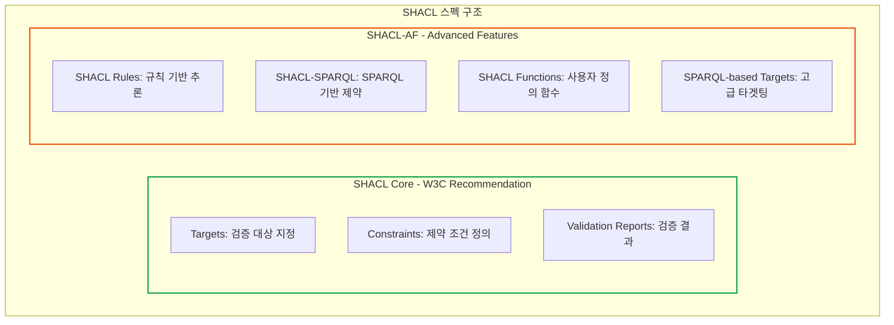
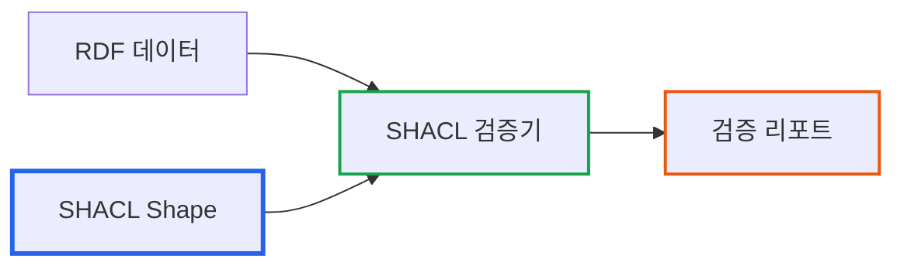

# SHACL 규칙으로 데이터 검증하기

> **작성일**: 2026년 1월 9일
> **카테고리**: SHACL, Data Validation, Knowledge Graph
> **키워드**: SHACL, SHACL-AF, 데이터 검증, 비즈니스 규칙, 제약 조건, 이상 탐지, sh:rule
> **시리즈**: [온톨로지 + AI 에이전트: 세무 컨설팅 시스템 아키텍처](https://blog.imprun.dev/120) (8부/총 20부)
> **대상 독자**: 온톨로지에 입문하는 시니어 개발자

---

## 핵심 질문

> **비즈니스 규칙을 어떻게 선언적으로 정의하는가?**

이 질문에 답하기 위해 이번 편에서 다루는 내용:
- SHACL Core vs SHACL-AF(Advanced Features)의 차이
- 검증(Validation)과 추론(Inference)의 역할 분담
- sh:rule을 활용한 파생 속성 자동 계산
- SPARQL 기반 타겟팅으로 복잡한 조건 표현
- 세무 도메인 비즈니스 규칙 (부채비율 경고, 접대비 한도, 세액공제 적격)

---

## 요약

SHACL(Shapes Constraint Language)은 RDF 데이터의 구조와 값을 검증하는 W3C 표준이다. "부채비율 200% 초과 시 경고", "매출액은 반드시 양수여야 함"과 같은 비즈니스 규칙을 정의하고 자동으로 검증한다. 세무 분석에서 SHACL은 데이터 품질 보장과 이상 징후 탐지에 핵심적인 역할을 한다. 이 글에서는 실제 재무 데이터에 적용할 SHACL 규칙을 작성하고, Python pySHACL로 검증을 수행한다.

---

## 이전 내용 복습

- **5부**: RDF로 데이터 표현 (ABox)
- **6부**: OWL로 스키마 정의 (TBox)
- **7부**: SPARQL로 데이터 조회

이제 **데이터 검증**이 필요하다.

---

## 왜 SHACL이 필요한가?

### 문제: 잘못된 데이터가 들어오면?

```turtle
# 실수로 음수 매출 입력
fin:IS_A노무법인_2024 acc:revenue -5297933879 .

# 필수 필드 누락
fin:IS_A노무법인_2024 a fin:IncomeStatement .
# acc:revenue 누락!

# 부채비율 200% 초과 (재무 위험)
fin:BS_B회사_2024
    acc:totalLiabilities 3000000000 ;
    acc:totalEquity 1000000000 .  # 부채비율 300%
```

이런 문제를 **자동으로** 탐지해야 한다.

### 해결: SHACL로 규칙 정의

```turtle
# 매출액은 양수여야 한다
acc:revenue sh:minInclusive 0 .

# 매출액은 필수 항목이다
fin:IncomeStatement sh:property [
    sh:path acc:revenue ;
    sh:minCount 1 ;
] .

# 부채비율 200% 초과 시 경고
# (SPARQL 기반 검증)
```

---

## SHACL Core vs SHACL-AF

SHACL은 두 가지 주요 스펙으로 구성된다.



**SHACL Core**: 데이터 형식 검증 (필수 필드, 데이터 타입, 값 범위)

**SHACL-AF**: 추론 및 복잡한 규칙 (파생 속성 계산, 조건부 검증)

세무 도메인에서는 두 가지 모두 필요하다:
- **검증**: 재무제표 필수 항목, 대차평균 원리
- **추론**: 재무비율 자동 계산, 위험 수준 분류

---

## SHACL 기본 개념

### Shape란?

SHACL에서 **Shape**는 데이터가 따라야 할 형태(제약 조건)를 정의한다.



### 두 가지 Shape 타입

| 타입 | 설명 | 예시 |
|------|------|------|
| **NodeShape** | 특정 노드(개체)에 대한 제약 | "손익계산서는 매출액을 가져야 한다" |
| **PropertyShape** | 특정 속성에 대한 제약 | "매출액은 양수 정수여야 한다" |

---

## SHACL 기본 문법

### 네임스페이스

```turtle
@prefix sh: <http://www.w3.org/ns/shacl#> .
@prefix tax: <http://example.org/tax/> .
@prefix fin: <http://example.org/financial/> .
@prefix acc: <http://example.org/account/> .
@prefix xsd: <http://www.w3.org/2001/XMLSchema#> .
```

### NodeShape 정의

```turtle
# 손익계산서 Shape
fin:IncomeStatementShape
    a sh:NodeShape ;
    sh:targetClass fin:IncomeStatement ;  # 대상 클래스
    sh:property [
        sh:path acc:revenue ;              # 검증할 속성
        sh:minCount 1 ;                    # 최소 1개 필수
        sh:maxCount 1 ;                    # 최대 1개
        sh:datatype xsd:integer ;          # 정수형
        sh:minInclusive 0 ;                # 0 이상
        sh:message "매출액은 필수이며 0 이상의 정수여야 합니다" ;
    ] .
```

---

## 세무 데이터 검증 규칙 작성

### 규칙 1: 필수 필드 검증

```turtle
# 손익계산서 필수 필드
fin:IncomeStatementShape
    a sh:NodeShape ;
    sh:targetClass fin:IncomeStatement ;

    # 회계연도 필수
    sh:property [
        sh:path fin:fiscalYear ;
        sh:minCount 1 ;
        sh:datatype xsd:integer ;
        sh:minInclusive 2000 ;
        sh:maxInclusive 2100 ;
        sh:message "회계연도는 2000-2100 사이의 정수여야 합니다" ;
    ] ;

    # 매출액 필수
    sh:property [
        sh:path acc:revenue ;
        sh:minCount 1 ;
        sh:datatype xsd:integer ;
        sh:minInclusive 0 ;
        sh:message "매출액은 필수이며 0 이상이어야 합니다" ;
    ] ;

    # 영업이익 필수
    sh:property [
        sh:path acc:operatingIncome ;
        sh:minCount 1 ;
        sh:datatype xsd:integer ;
        sh:message "영업이익은 필수입니다" ;
    ] ;

    # 당기순이익 필수
    sh:property [
        sh:path acc:netIncome ;
        sh:minCount 1 ;
        sh:datatype xsd:integer ;
        sh:message "당기순이익은 필수입니다" ;
    ] .
```

### 규칙 2: 재무상태표 검증

```turtle
# 재무상태표 Shape
fin:BalanceSheetShape
    a sh:NodeShape ;
    sh:targetClass fin:BalanceSheet ;

    # 자산총계 필수
    sh:property [
        sh:path acc:totalAssets ;
        sh:minCount 1 ;
        sh:datatype xsd:integer ;
        sh:minInclusive 0 ;
        sh:message "자산총계는 필수이며 0 이상이어야 합니다" ;
    ] ;

    # 부채총계 필수
    sh:property [
        sh:path acc:totalLiabilities ;
        sh:minCount 1 ;
        sh:datatype xsd:integer ;
        sh:minInclusive 0 ;
        sh:message "부채총계는 필수이며 0 이상이어야 합니다" ;
    ] ;

    # 자본총계 필수
    sh:property [
        sh:path acc:totalEquity ;
        sh:minCount 1 ;
        sh:datatype xsd:integer ;
        sh:message "자본총계는 필수입니다" ;
    ] ;

    # 소속 회사 필수
    sh:property [
        sh:path fin:belongsTo ;
        sh:minCount 1 ;
        sh:class tax:Company ;
        sh:message "재무상태표는 회사에 소속되어야 합니다" ;
    ] .
```

### 규칙 3: SPARQL 기반 비즈니스 규칙

복잡한 규칙은 SPARQL로 정의한다.

```turtle
# 부채비율 200% 초과 경고
fin:DebtRatioWarningShape
    a sh:NodeShape ;
    sh:targetClass fin:BalanceSheet ;
    sh:severity sh:Warning ;  # 경고 수준
    sh:sparql [
        sh:message "부채비율이 200%를 초과합니다: {?debtRatio}%" ;
        sh:select """
            PREFIX acc: <http://example.org/account/>

            SELECT $this ?debtRatio
            WHERE {
                $this acc:totalLiabilities ?liabilities ;
                      acc:totalEquity ?equity .
                FILTER(?equity > 0)
                BIND(?liabilities * 100.0 / ?equity AS ?debtRatio)
                FILTER(?debtRatio > 200)
            }
        """ ;
    ] .

# 자본잠식 경고 (자본총계 < 자본금)
fin:CapitalErosionShape
    a sh:NodeShape ;
    sh:targetClass fin:BalanceSheet ;
    sh:severity sh:Violation ;  # 위반 수준
    sh:sparql [
        sh:message "자본잠식 상태입니다. 자본총계({?equity})가 자본금({?capital})보다 작습니다." ;
        sh:select """
            PREFIX acc: <http://example.org/account/>

            SELECT $this ?equity ?capital
            WHERE {
                $this acc:totalEquity ?equity ;
                      acc:paidInCapital ?capital .
                FILTER(?equity < ?capital)
            }
        """ ;
    ] .

# 영업이익률 음수 경고
fin:NegativeOpMarginShape
    a sh:NodeShape ;
    sh:targetClass fin:IncomeStatement ;
    sh:severity sh:Warning ;
    sh:sparql [
        sh:message "영업손실 발생. 영업이익률: {?opMargin}%" ;
        sh:select """
            PREFIX acc: <http://example.org/account/>

            SELECT $this ?opMargin
            WHERE {
                $this acc:revenue ?revenue ;
                      acc:operatingIncome ?opIncome .
                FILTER(?revenue > 0)
                BIND(?opIncome * 100.0 / ?revenue AS ?opMargin)
                FILTER(?opMargin < 0)
            }
        """ ;
    ] .
```

### 규칙 4: 대차대조표 등식 검증

```turtle
# 자산 = 부채 + 자본 검증
fin:BalanceSheetEquationShape
    a sh:NodeShape ;
    sh:targetClass fin:BalanceSheet ;
    sh:severity sh:Violation ;
    sh:sparql [
        sh:message "대차대조표 등식 불일치: 자산({?assets}) ≠ 부채({?liabilities}) + 자본({?equity})" ;
        sh:select """
            PREFIX acc: <http://example.org/account/>

            SELECT $this ?assets ?liabilities ?equity
            WHERE {
                $this acc:totalAssets ?assets ;
                      acc:totalLiabilities ?liabilities ;
                      acc:totalEquity ?equity .
                BIND(?liabilities + ?equity AS ?sum)
                FILTER(ABS(?assets - ?sum) > 1)  # 1원 오차 허용
            }
        """ ;
    ] .
```

---

## SHACL Rules: 규칙 기반 추론

SHACL-AF의 핵심 기능인 `sh:rule`을 사용하면 새로운 트리플을 생성할 수 있다. 재무비율 자동 계산, 위험 수준 분류 등에 활용한다.

### 재무비율 자동 계산

부채비율, 유동비율 같은 파생 속성을 데이터에서 자동 계산한다.

```turtle
@prefix sh: <http://www.w3.org/ns/shacl#> .
@prefix tax: <http://example.org/tax#> .

# 재무비율 계산 규칙
tax:FinancialRatioRules a sh:NodeShape ;
    sh:targetClass fin:BalanceSheet ;

    # 부채비율 = 부채총계 / 자본총계
    sh:rule [
        a sh:SPARQLRule ;
        sh:order 1 ;
        sh:construct """
            CONSTRUCT {
                $this tax:debtToEquityRatio ?ratio .
            }
            WHERE {
                $this acc:totalLiabilities ?liabilities ;
                      acc:totalEquity ?equity .
                FILTER(?equity != 0)
                BIND(?liabilities / ?equity AS ?ratio)
            }
        """
    ] ;

    # 유동비율 = 유동자산 / 유동부채
    sh:rule [
        a sh:SPARQLRule ;
        sh:order 2 ;
        sh:construct """
            CONSTRUCT {
                $this tax:currentRatio ?ratio .
            }
            WHERE {
                $this acc:currentAssets ?ca ;
                      acc:currentLiabilities ?cl .
                FILTER(?cl != 0)
                BIND(?ca / ?cl AS ?ratio)
            }
        """
    ] .
```

### 위험 수준 자동 분류

부채비율과 적자 여부를 기반으로 위험 수준을 분류한다. `sh:order`로 규칙 실행 순서를 제어한다.

```turtle
# 위험 수준 분류 규칙 (순서 중요)
tax:RiskClassificationRules a sh:NodeShape ;
    sh:targetClass tax:Company ;

    # 고위험: 부채비율 200% 초과 AND 적자
    sh:rule [
        a sh:SPARQLRule ;
        sh:order 1 ;
        sh:construct """
            CONSTRUCT {
                ?company tax:riskLevel tax:HighRisk ;
                         tax:riskFactors "부채비율 200% 초과, 적자" .
            }
            WHERE {
                ?company a tax:Company .
                ?bs fin:belongsTo ?company ;
                    a fin:BalanceSheet ;
                    acc:totalLiabilities ?liabilities ;
                    acc:totalEquity ?equity .
                ?is fin:belongsTo ?company ;
                    a fin:IncomeStatement ;
                    acc:netIncome ?ni .

                FILTER(?equity > 0)
                BIND(?liabilities / ?equity AS ?der)
                FILTER(?der > 2.0 && ?ni < 0)
            }
        """
    ] ;

    # 중위험: 부채비율 150% 초과 OR 적자
    sh:rule [
        a sh:SPARQLRule ;
        sh:order 2 ;
        sh:construct """
            CONSTRUCT {
                ?company tax:riskLevel tax:MediumRisk .
            }
            WHERE {
                ?company a tax:Company .
                # 아직 위험 수준이 할당되지 않은 경우만
                FILTER NOT EXISTS { ?company tax:riskLevel ?anyLevel }

                ?bs fin:belongsTo ?company ;
                    a fin:BalanceSheet ;
                    acc:totalLiabilities ?liabilities ;
                    acc:totalEquity ?equity .
                ?is fin:belongsTo ?company ;
                    a fin:IncomeStatement ;
                    acc:netIncome ?ni .

                FILTER(?equity > 0)
                BIND(?liabilities / ?equity AS ?der)
                FILTER(?der > 1.5 || ?ni < 0)
            }
        """
    ] ;

    # 저위험: 나머지 (기본값)
    sh:rule [
        a sh:SPARQLRule ;
        sh:order 3 ;
        sh:construct """
            CONSTRUCT {
                ?company tax:riskLevel tax:LowRisk .
            }
            WHERE {
                ?company a tax:Company .
                FILTER NOT EXISTS { ?company tax:riskLevel ?anyLevel }
            }
        """
    ] .
```

### SPARQL 기반 타겟팅

복잡한 조건으로 검증 대상을 지정할 때 SPARQL 타겟을 사용한다.

```turtle
# 제조업 중소기업만 대상으로 검증
tax:ManufacturingSMEShape a sh:NodeShape ;
    sh:target [
        a sh:SPARQLTarget ;
        sh:select """
            SELECT ?this
            WHERE {
                ?this a tax:Company ;
                      tax:industryCode ?code ;
                      tax:averageRevenue3Years ?revenue .
                # 제조업이면서 매출 1,500억 이하
                FILTER(STRSTARTS(?code, "10") || STRSTARTS(?code, "20"))
                FILTER(?revenue <= 150000000000)
            }
        """
    ] ;

    # R&D 세액공제 검토 권장
    sh:property [
        sh:path tax:hasRnDExpenditure ;
        sh:minCount 0 ;
        sh:message "제조업 중소기업은 R&D 세액공제 검토 권장"@ko ;
        sh:severity sh:Info
    ] .
```

### 세액공제 적격성 판정 규칙

R&D 세액공제 적격 여부를 자동 판정한다.

```turtle
tax:TaxCreditEligibilityRules a sh:NodeShape ;
    sh:targetClass tax:Company ;

    # R&D 세액공제 적격 판정
    sh:rule [
        a sh:SPARQLRule ;
        sh:construct """
            CONSTRUCT {
                ?company tax:eligibleForCredit tax:RnDTaxCredit ;
                         tax:estimatedCreditAmount ?creditAmount .
            }
            WHERE {
                ?company a tax:Company ;
                         tax:hasRnDExpenditure ?rndExp .

                ?rndExp tax:expenditureAmount ?amount .

                # 공제율: 중소기업 25%, 일반기업 8%
                OPTIONAL {
                    ?company a tax:SmallMediumEnterprise .
                    BIND(0.25 AS ?rate)
                }
                BIND(COALESCE(?rate, 0.08) AS ?finalRate)
                BIND(?amount * ?finalRate AS ?creditAmount)
            }
        """
    ] .
```

---

## Python pySHACL로 검증 실행

### 설치

```bash
pip install pyshacl
```

### 기본 검증 코드

```python
from pyshacl import validate
from rdflib import Graph

def validate_financial_data(data_file, shapes_file):
    """SHACL 검증 실행"""

    # 데이터 그래프 로드
    data_graph = Graph()
    data_graph.parse(data_file, format="turtle")

    # SHACL Shape 로드
    shapes_graph = Graph()
    shapes_graph.parse(shapes_file, format="turtle")

    # 검증 실행
    conforms, results_graph, results_text = validate(
        data_graph,
        shacl_graph=shapes_graph,
        inference='rdfs',  # RDFS 추론 활성화
        abort_on_first=False,  # 모든 위반 찾기
        meta_shacl=False,
        debug=False
    )

    print("=" * 60)
    print("SHACL 검증 결과")
    print("=" * 60)
    print(f"적합 여부: {'통과' if conforms else '위반 발견'}")
    print()

    if not conforms:
        print("위반 상세:")
        print(results_text)

    return conforms, results_graph

# 실행
conforms, results = validate_financial_data(
    "tax_knowledge_graph.ttl",
    "tax_shacl_rules.ttl"
)
```

### 검증 결과 분석

```python
from rdflib import Namespace
from rdflib.namespace import RDF, SH

SH = Namespace("http://www.w3.org/ns/shacl#")

def analyze_validation_results(results_graph):
    """검증 결과 상세 분석"""

    violations = []
    warnings = []

    for result in results_graph.subjects(RDF.type, SH.ValidationResult):
        severity = results_graph.value(result, SH.resultSeverity)
        message = results_graph.value(result, SH.resultMessage)
        focus = results_graph.value(result, SH.focusNode)
        path = results_graph.value(result, SH.resultPath)

        item = {
            "focus": str(focus),
            "path": str(path) if path else None,
            "message": str(message)
        }

        if severity == SH.Violation:
            violations.append(item)
        elif severity == SH.Warning:
            warnings.append(item)

    print(f"\n위반(Violation): {len(violations)}건")
    for v in violations:
        print(f"  - {v['focus']}: {v['message']}")

    print(f"\n경고(Warning): {len(warnings)}건")
    for w in warnings:
        print(f"  - {w['focus']}: {w['message']}")

    return violations, warnings
```

---

## 전체 SHACL 규칙 파일

```turtle
@prefix sh: <http://www.w3.org/ns/shacl#> .
@prefix tax: <http://example.org/tax/> .
@prefix fin: <http://example.org/financial/> .
@prefix acc: <http://example.org/account/> .
@prefix xsd: <http://www.w3.org/2001/XMLSchema#> .
@prefix rdfs: <http://www.w3.org/2000/01/rdf-schema#> .

# ===== 손익계산서 검증 =====

fin:IncomeStatementShape
    a sh:NodeShape ;
    sh:targetClass fin:IncomeStatement ;
    rdfs:label "손익계산서 검증 Shape"@ko ;

    sh:property [
        sh:path fin:fiscalYear ;
        sh:minCount 1 ;
        sh:maxCount 1 ;
        sh:datatype xsd:integer ;
        sh:minInclusive 2000 ;
        sh:maxInclusive 2100 ;
        sh:message "회계연도는 2000-2100 사이의 정수여야 합니다"@ko ;
    ] ;

    sh:property [
        sh:path acc:revenue ;
        sh:minCount 1 ;
        sh:maxCount 1 ;
        sh:datatype xsd:integer ;
        sh:minInclusive 0 ;
        sh:message "매출액은 필수이며 0 이상이어야 합니다"@ko ;
    ] ;

    sh:property [
        sh:path acc:operatingIncome ;
        sh:minCount 1 ;
        sh:datatype xsd:integer ;
        sh:message "영업이익은 필수입니다"@ko ;
    ] ;

    sh:property [
        sh:path acc:netIncome ;
        sh:minCount 1 ;
        sh:datatype xsd:integer ;
        sh:message "당기순이익은 필수입니다"@ko ;
    ] ;

    sh:property [
        sh:path fin:belongsTo ;
        sh:minCount 1 ;
        sh:class tax:Company ;
        sh:message "손익계산서는 회사에 소속되어야 합니다"@ko ;
    ] .

# ===== 재무상태표 검증 =====

fin:BalanceSheetShape
    a sh:NodeShape ;
    sh:targetClass fin:BalanceSheet ;
    rdfs:label "재무상태표 검증 Shape"@ko ;

    sh:property [
        sh:path acc:totalAssets ;
        sh:minCount 1 ;
        sh:datatype xsd:integer ;
        sh:minInclusive 0 ;
        sh:message "자산총계는 필수이며 0 이상이어야 합니다"@ko ;
    ] ;

    sh:property [
        sh:path acc:totalLiabilities ;
        sh:minCount 1 ;
        sh:datatype xsd:integer ;
        sh:minInclusive 0 ;
        sh:message "부채총계는 필수이며 0 이상이어야 합니다"@ko ;
    ] ;

    sh:property [
        sh:path acc:totalEquity ;
        sh:minCount 1 ;
        sh:datatype xsd:integer ;
        sh:message "자본총계는 필수입니다"@ko ;
    ] .

# ===== 비즈니스 규칙 (SPARQL) =====

# 부채비율 200% 초과 경고
fin:DebtRatioWarningShape
    a sh:NodeShape ;
    sh:targetClass fin:BalanceSheet ;
    sh:severity sh:Warning ;
    rdfs:label "부채비율 경고"@ko ;
    sh:sparql [
        sh:message "부채비율이 200%를 초과합니다"@ko ;
        sh:select """
            PREFIX acc: <http://example.org/account/>
            SELECT $this
            WHERE {
                $this acc:totalLiabilities ?liabilities ;
                      acc:totalEquity ?equity .
                FILTER(?equity > 0)
                FILTER(?liabilities * 100.0 / ?equity > 200)
            }
        """ ;
    ] .

# 유동비율 100% 미만 경고
fin:CurrentRatioWarningShape
    a sh:NodeShape ;
    sh:targetClass fin:BalanceSheet ;
    sh:severity sh:Warning ;
    rdfs:label "유동비율 경고"@ko ;
    sh:sparql [
        sh:message "유동비율이 100% 미만입니다. 단기 지급 능력에 주의가 필요합니다"@ko ;
        sh:select """
            PREFIX acc: <http://example.org/account/>
            SELECT $this
            WHERE {
                $this acc:currentAssets ?curAssets ;
                      acc:currentLiabilities ?curLiab .
                FILTER(?curLiab > 0)
                FILTER(?curAssets * 100.0 / ?curLiab < 100)
            }
        """ ;
    ] .

# 영업손실 경고
fin:OperatingLossWarningShape
    a sh:NodeShape ;
    sh:targetClass fin:IncomeStatement ;
    sh:severity sh:Warning ;
    rdfs:label "영업손실 경고"@ko ;
    sh:sparql [
        sh:message "영업손실이 발생했습니다"@ko ;
        sh:select """
            PREFIX acc: <http://example.org/account/>
            SELECT $this
            WHERE {
                $this acc:operatingIncome ?opIncome .
                FILTER(?opIncome < 0)
            }
        """ ;
    ] .

# 자본잠식 위반
fin:CapitalErosionViolationShape
    a sh:NodeShape ;
    sh:targetClass fin:BalanceSheet ;
    sh:severity sh:Violation ;
    rdfs:label "자본잠식 위반"@ko ;
    sh:sparql [
        sh:message "자본잠식 상태입니다. 자본총계가 자본금보다 작습니다"@ko ;
        sh:select """
            PREFIX acc: <http://example.org/account/>
            SELECT $this
            WHERE {
                $this acc:totalEquity ?equity ;
                      acc:paidInCapital ?capital .
                FILTER(?equity < ?capital)
            }
        """ ;
    ] .
```

---

## 검증 결과 활용

### AI 에이전트 연동

SHACL 검증 결과를 AI 에이전트의 도구로 활용:

```python
from langchain.tools import tool

@tool
def validate_company_financials(company_id: str, year: int) -> dict:
    """
    특정 기업의 재무 데이터를 SHACL 규칙으로 검증합니다.

    Args:
        company_id: 기업 식별자
        year: 회계연도

    Returns:
        검증 결과 딕셔너리
        - conforms: 적합 여부
        - violations: 위반 목록
        - warnings: 경고 목록
    """
    # 그래프 로드 및 검증 실행
    conforms, results = run_shacl_validation(company_id, year)

    violations, warnings = parse_results(results)

    return {
        "conforms": conforms,
        "violations": violations,
        "warnings": warnings,
        "summary": f"위반 {len(violations)}건, 경고 {len(warnings)}건"
    }
```

---

## 핵심 정리

| 개념 | 설명 | 예시 |
|------|------|------|
| Shape | 데이터 제약 조건 정의 | `fin:IncomeStatementShape` |
| sh:targetClass | 검증 대상 클래스 | `fin:IncomeStatement` |
| sh:property | 속성별 제약 | minCount, datatype |
| sh:sparql | SPARQL 기반 복잡한 규칙 | 부채비율 계산 후 검증 |
| sh:severity | 심각도 수준 | Violation, Warning, Info |
| sh:message | 위반 시 메시지 | "부채비율 200% 초과" |

### 세무 분석에서 SHACL 활용

1. **데이터 품질 보장**: 필수 필드, 데이터 타입 검증
2. **비즈니스 규칙**: 재무비율 임계치 검증
3. **이상 탐지**: 자본잠식, 영업손실 등 자동 탐지
4. **AI 연동**: 검증 결과를 에이전트 도구로 활용

---

## 다음 단계 미리보기

**9부: 재무제표 온톨로지 완성하기**

5-8부에서 배운 RDF, OWL, SPARQL, SHACL을 통합하여 **완전한 재무제표 온톨로지**를 구축한다:

- TBox + ABox + SHACL 통합
- 급여, 외상매출금, 외상매입금 데이터 추가
- 관계 그래프 완성
- 전체 시스템 테스트

---

## 참고 자료

### SHACL 표준
- [W3C SHACL Specification](https://www.w3.org/TR/shacl/)
- [SHACL Advanced Features](https://www.w3.org/TR/shacl-af/)

### pySHACL
- [pySHACL GitHub](https://github.com/RDFLib/pySHACL)
- [pySHACL Documentation](https://github.com/RDFLib/pySHACL#command-line-use)

### 관련 시리즈
- [이전: SPARQL 쿼리 마스터하기](https://blog.imprun.dev/127)
- [다음: 재무제표 온톨로지 완성하기](https://blog.imprun.dev/129)
- [시리즈 목차](https://blog.imprun.dev/120)
