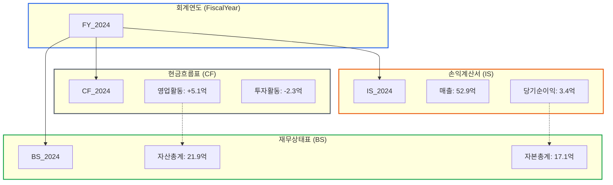
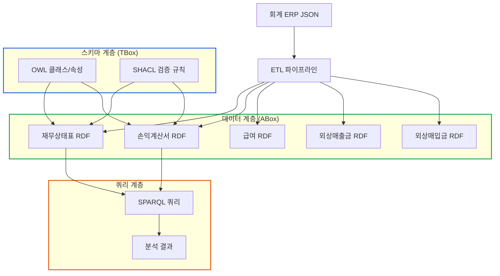
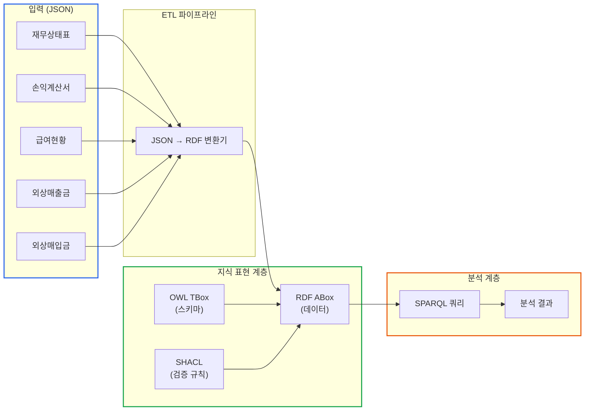

# 재무제표 온톨로지 완성하기

> **작성일**: 2026년 1월 9일
> **카테고리**: Ontology, OWL, SHACL, Knowledge Graph
> **키워드**: 재무제표, 온톨로지 통합, K-IFRS, 지식그래프, 스키마 설계, BS, IS, CF
> **시리즈**: [온톨로지 + AI 에이전트: 세무 컨설팅 시스템 아키텍처](https://blog.imprun.dev/120) (9부/총 20부)
> **대상 독자**: 온톨로지에 입문하는 시니어 개발자

---

## 핵심 질문

> **BS/IS/CF를 온톨로지로 어떻게 통합하는가?**

이 질문에 답하기 위해 이번 편에서 다루는 내용:
- 재무상태표(BS), 손익계산서(IS), 현금흐름표(CF)의 구조적 관계
- 회계연도를 중심으로 한 재무제표 연결 패턴
- 재무비율 자동 계산을 위한 속성 설계
- TBox(스키마) + ABox(데이터) + SHACL(규칙) 통합 아키텍처
- SPARQL로 재무 분석 쿼리 수행

---

## 요약

Part B의 마지막 장이다. 5부에서 RDF로 데이터를 표현하고, 6부에서 OWL로 스키마를 정의했으며, 7부에서 SPARQL로 데이터를 조회하고, 8부에서 SHACL로 검증 규칙을 만들었다. 이제 이 모든 것을 통합하여 **세무 분석 시스템의 핵심 지식 표현 계층**을 완성한다. 재무상태표, 손익계산서, 현금흐름표를 하나의 온톨로지로 통합하고, 실제 JSON 데이터를 이 온톨로지로 변환하는 완전한 파이프라인을 구축한다.

---

## 이전 내용 복습

Part B에서 배운 핵심 기술:

| 부 | 기술 | 역할 |
|----|------|------|
| 5부 | RDF | 데이터를 트리플로 표현 (ABox) |
| 6부 | OWL | 클래스/속성 스키마 정의 (TBox) |
| 7부 | SPARQL | 데이터 조회 및 분석 |
| 8부 | SHACL | 데이터 검증 및 비즈니스 규칙 |

이제 이 기술들을 **하나의 완전한 시스템**으로 통합한다.

---

## 재무제표 통합의 핵심: 회계연도 중심 설계

재무상태표(BS), 손익계산서(IS), 현금흐름표(CF)는 독립된 문서가 아니다. 이들은 **회계연도**라는 공통 축을 중심으로 연결된다.

### BS/IS/CF의 관계



**설계 원칙**:

1. **회계연도가 허브**: 모든 재무제표는 `fin:forPeriod` 속성으로 회계연도와 연결
2. **BS는 시점, IS/CF는 기간**: 재무상태표는 결산일 기준, 손익/현금흐름표는 기간 집계
3. **당기순이익의 흐름**: IS의 당기순이익 → BS의 이익잉여금으로 반영
4. **현금흐름의 일관성**: CF의 기말현금 = BS의 보통예금

### 왜 회계연도 중심인가?

| 설계 방식 | 장점 | 단점 |
|----------|------|------|
| 회사 중심 (Company → BS, IS, CF) | 직관적 | 기간별 비교 어려움 |
| 재무제표 중심 (BS → Company, Year) | 문서 독립성 | 기간 관계 표현 복잡 |
| **회계연도 중심** (FY → BS, IS, CF → Company) | 기간별 비교 용이, 재무제표 간 연결 명확 | 간접 참조 필요 |

세무 분석에서는 "2024년 vs 2023년 비교", "3개년 추세 분석"이 핵심이므로 **회계연도 중심 설계**가 적합하다.

---

## 통합 온톨로지 아키텍처

### 전체 구조



### 온톨로지 구성 파일

```
tax-ontology/
├── tbox/
│   ├── core.ttl           # 공통 클래스/속성
│   ├── financial.ttl      # 재무제표 스키마
│   ├── account.ttl        # 계정과목 스키마
│   └── company.ttl        # 회사/직원 스키마
├── shacl/
│   ├── validation.ttl     # 데이터 형식 검증
│   └── business-rules.ttl # 비즈니스 규칙
├── abox/
│   ├── company_A.ttl      # A노무법인 기본 정보
│   ├── bs_2024.ttl        # 2024 재무상태표
│   ├── is_2024.ttl        # 2024 손익계산서
│   └── employees.ttl      # 직원 정보
└── queries/
    ├── basic.sparql       # 기본 조회
    └── analysis.sparql    # 분석 쿼리
```

---

## 완전한 TBox 설계

### 네임스페이스 통합

```turtle
@prefix rdf: <http://www.w3.org/1999/02/22-rdf-syntax-ns#> .
@prefix rdfs: <http://www.w3.org/2000/01/rdf-schema#> .
@prefix owl: <http://www.w3.org/2002/07/owl#> .
@prefix xsd: <http://www.w3.org/2001/XMLSchema#> .
@prefix sh: <http://www.w3.org/ns/shacl#> .

# 도메인 네임스페이스
@prefix tax: <http://example.org/tax/> .
@prefix fin: <http://example.org/financial/> .
@prefix acc: <http://example.org/account/> .
@prefix emp: <http://example.org/employee/> .
@prefix txn: <http://example.org/transaction/> .

# 온톨로지 메타데이터
<http://example.org/tax-ontology>
    rdf:type owl:Ontology ;
    rdfs:label "세무 분석 온톨로지"@ko ;
    rdfs:comment "회계 ERP 세무 데이터 분석을 위한 통합 온톨로지"@ko ;
    owl:versionInfo "2.0" ;
    owl:imports <http://www.w3.org/2002/07/owl> .
```

### 핵심 클래스 계층

```turtle
# ============================================
# 최상위 클래스
# ============================================

tax:Entity
    rdf:type owl:Class ;
    rdfs:label "개체"@ko ;
    rdfs:comment "세무 시스템의 모든 개체의 상위 클래스"@ko .

# ============================================
# 조직 관련 클래스
# ============================================

tax:Organization
    rdf:type owl:Class ;
    rdfs:subClassOf tax:Entity ;
    rdfs:label "조직"@ko .

tax:Company
    rdf:type owl:Class ;
    rdfs:subClassOf tax:Organization ;
    rdfs:label "회사"@ko ;
    rdfs:comment "세무 기장 대상 기업체"@ko .

tax:Corporation
    rdf:type owl:Class ;
    rdfs:subClassOf tax:Company ;
    rdfs:label "법인"@ko ;
    owl:disjointWith tax:SoleProprietorship .

tax:SoleProprietorship
    rdf:type owl:Class ;
    rdfs:subClassOf tax:Company ;
    rdfs:label "개인사업자"@ko .

tax:Vendor
    rdf:type owl:Class ;
    rdfs:subClassOf tax:Organization ;
    rdfs:label "거래처"@ko .

tax:Customer
    rdf:type owl:Class ;
    rdfs:subClassOf tax:Vendor ;
    rdfs:label "매출처"@ko .

tax:Supplier
    rdf:type owl:Class ;
    rdfs:subClassOf tax:Vendor ;
    rdfs:label "매입처"@ko .

# ============================================
# 인적 자원 클래스
# ============================================

tax:Person
    rdf:type owl:Class ;
    rdfs:subClassOf tax:Entity ;
    rdfs:label "개인"@ko .

emp:Employee
    rdf:type owl:Class ;
    rdfs:subClassOf tax:Person ;
    rdfs:label "직원"@ko .

emp:Executive
    rdf:type owl:Class ;
    rdfs:subClassOf emp:Employee ;
    rdfs:label "임원"@ko .

emp:Staff
    rdf:type owl:Class ;
    rdfs:subClassOf emp:Employee ;
    rdfs:label "일반직원"@ko .

# ============================================
# 재무제표 클래스
# ============================================

fin:FinancialStatement
    rdf:type owl:Class ;
    rdfs:subClassOf tax:Entity ;
    rdfs:label "재무제표"@ko ;
    rdfs:comment "특정 시점 또는 기간의 재무 상태를 보고하는 문서"@ko .

fin:BalanceSheet
    rdf:type owl:Class ;
    rdfs:subClassOf fin:FinancialStatement ;
    rdfs:label "재무상태표"@ko ;
    rdfs:comment "특정 시점의 자산, 부채, 자본 상태"@ko ;
    owl:equivalentClass [
        rdf:type owl:Class ;
        owl:intersectionOf (
            fin:FinancialStatement
            [ rdf:type owl:Restriction ;
              owl:onProperty fin:statementType ;
              owl:hasValue "BS" ]
        )
    ] .

fin:IncomeStatement
    rdf:type owl:Class ;
    rdfs:subClassOf fin:FinancialStatement ;
    rdfs:label "손익계산서"@ko ;
    rdfs:comment "일정 기간의 수익과 비용"@ko .

fin:CashFlowStatement
    rdf:type owl:Class ;
    rdfs:subClassOf fin:FinancialStatement ;
    rdfs:label "현금흐름표"@ko ;
    rdfs:comment "일정 기간의 현금 유입/유출"@ko .

# ============================================
# 회계 기간 클래스
# ============================================

fin:FiscalPeriod
    rdf:type owl:Class ;
    rdfs:subClassOf tax:Entity ;
    rdfs:label "회계기간"@ko .

fin:FiscalYear
    rdf:type owl:Class ;
    rdfs:subClassOf fin:FiscalPeriod ;
    rdfs:label "회계연도"@ko .

fin:FiscalMonth
    rdf:type owl:Class ;
    rdfs:subClassOf fin:FiscalPeriod ;
    rdfs:label "회계월"@ko .

# ============================================
# 계정과목 클래스 계층
# ============================================

acc:Account
    rdf:type owl:Class ;
    rdfs:subClassOf tax:Entity ;
    rdfs:label "계정과목"@ko .

# --- 자산 계정 ---
acc:Asset
    rdf:type owl:Class ;
    rdfs:subClassOf acc:Account ;
    rdfs:label "자산"@ko .

acc:CurrentAsset
    rdf:type owl:Class ;
    rdfs:subClassOf acc:Asset ;
    rdfs:label "유동자산"@ko ;
    rdfs:comment "1년 이내 현금화 가능한 자산"@ko .

acc:QuickAsset
    rdf:type owl:Class ;
    rdfs:subClassOf acc:CurrentAsset ;
    rdfs:label "당좌자산"@ko .

acc:Inventory
    rdf:type owl:Class ;
    rdfs:subClassOf acc:CurrentAsset ;
    rdfs:label "재고자산"@ko .

acc:NonCurrentAsset
    rdf:type owl:Class ;
    rdfs:subClassOf acc:Asset ;
    rdfs:label "비유동자산"@ko .

acc:TangibleAsset
    rdf:type owl:Class ;
    rdfs:subClassOf acc:NonCurrentAsset ;
    rdfs:label "유형자산"@ko .

acc:IntangibleAsset
    rdf:type owl:Class ;
    rdfs:subClassOf acc:NonCurrentAsset ;
    rdfs:label "무형자산"@ko .

acc:InvestmentAsset
    rdf:type owl:Class ;
    rdfs:subClassOf acc:NonCurrentAsset ;
    rdfs:label "투자자산"@ko .

# --- 부채 계정 ---
acc:Liability
    rdf:type owl:Class ;
    rdfs:subClassOf acc:Account ;
    rdfs:label "부채"@ko .

acc:CurrentLiability
    rdf:type owl:Class ;
    rdfs:subClassOf acc:Liability ;
    rdfs:label "유동부채"@ko .

acc:NonCurrentLiability
    rdf:type owl:Class ;
    rdfs:subClassOf acc:Liability ;
    rdfs:label "비유동부채"@ko .

# --- 자본 계정 ---
acc:Equity
    rdf:type owl:Class ;
    rdfs:subClassOf acc:Account ;
    rdfs:label "자본"@ko .

acc:PaidInCapital
    rdf:type owl:Class ;
    rdfs:subClassOf acc:Equity ;
    rdfs:label "자본금"@ko .

acc:RetainedEarnings
    rdf:type owl:Class ;
    rdfs:subClassOf acc:Equity ;
    rdfs:label "이익잉여금"@ko .

# --- 수익/비용 계정 ---
acc:Revenue
    rdf:type owl:Class ;
    rdfs:subClassOf acc:Account ;
    rdfs:label "수익"@ko .

acc:Expense
    rdf:type owl:Class ;
    rdfs:subClassOf acc:Account ;
    rdfs:label "비용"@ko .

acc:SellingAndAdminExpense
    rdf:type owl:Class ;
    rdfs:subClassOf acc:Expense ;
    rdfs:label "판매비와관리비"@ko .
```

### 속성 정의

```turtle
# ============================================
# 객체 속성 (Object Properties)
# ============================================

# --- 소속 관계 ---
fin:belongsTo
    rdf:type owl:ObjectProperty ;
    rdfs:label "소속 회사"@ko ;
    rdfs:domain fin:FinancialStatement ;
    rdfs:range tax:Company ;
    owl:inverseOf fin:hasStatement .

fin:hasStatement
    rdf:type owl:ObjectProperty ;
    rdfs:label "재무제표 보유"@ko ;
    rdfs:domain tax:Company ;
    rdfs:range fin:FinancialStatement .

# --- 기간 관계 ---
fin:forPeriod
    rdf:type owl:ObjectProperty ;
    rdfs:label "회계기간"@ko ;
    rdfs:domain fin:FinancialStatement ;
    rdfs:range fin:FiscalPeriod .

fin:previousPeriod
    rdf:type owl:ObjectProperty ;
    rdfs:label "전기"@ko ;
    rdfs:domain fin:FinancialStatement ;
    rdfs:range fin:FinancialStatement ;
    rdf:type owl:TransitiveProperty .

# --- 고용 관계 ---
emp:worksFor
    rdf:type owl:ObjectProperty ;
    rdfs:label "근무처"@ko ;
    rdfs:domain emp:Employee ;
    rdfs:range tax:Company ;
    owl:inverseOf emp:hasEmployee .

emp:hasEmployee
    rdf:type owl:ObjectProperty ;
    rdfs:label "직원 보유"@ko ;
    rdfs:domain tax:Company ;
    rdfs:range emp:Employee .

# --- 거래 관계 ---
txn:hasCustomer
    rdf:type owl:ObjectProperty ;
    rdfs:label "매출처"@ko ;
    rdfs:domain tax:Company ;
    rdfs:range tax:Customer .

txn:hasSupplier
    rdf:type owl:ObjectProperty ;
    rdfs:label "매입처"@ko ;
    rdfs:domain tax:Company ;
    rdfs:range tax:Supplier .

# ============================================
# 데이터 속성 (Datatype Properties)
# ============================================

# --- 회사 속성 ---
tax:companyName
    rdf:type owl:DatatypeProperty ;
    rdfs:label "회사명"@ko ;
    rdfs:domain tax:Company ;
    rdfs:range xsd:string ;
    rdf:type owl:FunctionalProperty .

tax:businessNumber
    rdf:type owl:DatatypeProperty ;
    rdfs:label "사업자등록번호"@ko ;
    rdfs:domain tax:Company ;
    rdfs:range xsd:string ;
    rdf:type owl:FunctionalProperty .

tax:establishedDate
    rdf:type owl:DatatypeProperty ;
    rdfs:label "설립일"@ko ;
    rdfs:domain tax:Company ;
    rdfs:range xsd:date .

# --- 재무제표 공통 속성 ---
fin:fiscalYear
    rdf:type owl:DatatypeProperty ;
    rdfs:label "회계연도"@ko ;
    rdfs:domain fin:FinancialStatement ;
    rdfs:range xsd:gYear .

fin:fiscalPeriodNumber
    rdf:type owl:DatatypeProperty ;
    rdfs:label "회계기수"@ko ;
    rdfs:comment "예: 제4기"@ko ;
    rdfs:domain fin:FinancialStatement ;
    rdfs:range xsd:integer .

fin:reportDate
    rdf:type owl:DatatypeProperty ;
    rdfs:label "보고일"@ko ;
    rdfs:domain fin:FinancialStatement ;
    rdfs:range xsd:date .

fin:statementType
    rdf:type owl:DatatypeProperty ;
    rdfs:label "재무제표유형"@ko ;
    rdfs:domain fin:FinancialStatement ;
    rdfs:range xsd:string .

# --- 재무상태표 금액 속성 ---
acc:totalAssets
    rdf:type owl:DatatypeProperty ;
    rdfs:label "자산총계"@ko ;
    rdfs:domain fin:BalanceSheet ;
    rdfs:range xsd:decimal .

acc:currentAssets
    rdf:type owl:DatatypeProperty ;
    rdfs:label "유동자산"@ko ;
    rdfs:domain fin:BalanceSheet ;
    rdfs:range xsd:decimal .

acc:nonCurrentAssets
    rdf:type owl:DatatypeProperty ;
    rdfs:label "비유동자산"@ko ;
    rdfs:domain fin:BalanceSheet ;
    rdfs:range xsd:decimal .

acc:totalLiabilities
    rdf:type owl:DatatypeProperty ;
    rdfs:label "부채총계"@ko ;
    rdfs:domain fin:BalanceSheet ;
    rdfs:range xsd:decimal .

acc:currentLiabilities
    rdf:type owl:DatatypeProperty ;
    rdfs:label "유동부채"@ko ;
    rdfs:domain fin:BalanceSheet ;
    rdfs:range xsd:decimal .

acc:nonCurrentLiabilities
    rdf:type owl:DatatypeProperty ;
    rdfs:label "비유동부채"@ko ;
    rdfs:domain fin:BalanceSheet ;
    rdfs:range xsd:decimal .

acc:totalEquity
    rdf:type owl:DatatypeProperty ;
    rdfs:label "자본총계"@ko ;
    rdfs:domain fin:BalanceSheet ;
    rdfs:range xsd:decimal .

acc:paidInCapital
    rdf:type owl:DatatypeProperty ;
    rdfs:label "자본금"@ko ;
    rdfs:domain fin:BalanceSheet ;
    rdfs:range xsd:decimal .

acc:retainedEarnings
    rdf:type owl:DatatypeProperty ;
    rdfs:label "이익잉여금"@ko ;
    rdfs:domain fin:BalanceSheet ;
    rdfs:range xsd:decimal .

# --- 재무상태표 세부 계정 ---
acc:cash
    rdf:type owl:DatatypeProperty ;
    rdfs:subPropertyOf acc:currentAssets ;
    rdfs:label "보통예금"@ko ;
    rdfs:range xsd:decimal .

acc:accountsReceivable
    rdf:type owl:DatatypeProperty ;
    rdfs:subPropertyOf acc:currentAssets ;
    rdfs:label "외상매출금"@ko ;
    rdfs:range xsd:decimal .

acc:prepaidExpenses
    rdf:type owl:DatatypeProperty ;
    rdfs:subPropertyOf acc:currentAssets ;
    rdfs:label "선급비용"@ko ;
    rdfs:range xsd:decimal .

acc:buildings
    rdf:type owl:DatatypeProperty ;
    rdfs:subPropertyOf acc:nonCurrentAssets ;
    rdfs:label "건물"@ko ;
    rdfs:range xsd:decimal .

acc:land
    rdf:type owl:DatatypeProperty ;
    rdfs:subPropertyOf acc:nonCurrentAssets ;
    rdfs:label "토지"@ko ;
    rdfs:range xsd:decimal .

acc:goodwill
    rdf:type owl:DatatypeProperty ;
    rdfs:subPropertyOf acc:nonCurrentAssets ;
    rdfs:label "영업권"@ko ;
    rdfs:range xsd:decimal .

acc:shortTermBorrowings
    rdf:type owl:DatatypeProperty ;
    rdfs:subPropertyOf acc:currentLiabilities ;
    rdfs:label "단기차입금"@ko ;
    rdfs:range xsd:decimal .

acc:accountsPayable
    rdf:type owl:DatatypeProperty ;
    rdfs:subPropertyOf acc:currentLiabilities ;
    rdfs:label "미지급금"@ko ;
    rdfs:range xsd:decimal .

acc:longTermBorrowings
    rdf:type owl:DatatypeProperty ;
    rdfs:subPropertyOf acc:nonCurrentLiabilities ;
    rdfs:label "장기차입금"@ko ;
    rdfs:range xsd:decimal .

# --- 손익계산서 금액 속성 ---
acc:revenue
    rdf:type owl:DatatypeProperty ;
    rdfs:label "매출액"@ko ;
    rdfs:domain fin:IncomeStatement ;
    rdfs:range xsd:decimal .

acc:costOfSales
    rdf:type owl:DatatypeProperty ;
    rdfs:label "매출원가"@ko ;
    rdfs:domain fin:IncomeStatement ;
    rdfs:range xsd:decimal .

acc:grossProfit
    rdf:type owl:DatatypeProperty ;
    rdfs:label "매출총이익"@ko ;
    rdfs:domain fin:IncomeStatement ;
    rdfs:range xsd:decimal .

acc:sellingAndAdminExpenses
    rdf:type owl:DatatypeProperty ;
    rdfs:label "판매비와관리비"@ko ;
    rdfs:domain fin:IncomeStatement ;
    rdfs:range xsd:decimal .

acc:operatingIncome
    rdf:type owl:DatatypeProperty ;
    rdfs:label "영업이익"@ko ;
    rdfs:domain fin:IncomeStatement ;
    rdfs:range xsd:decimal .

acc:nonOperatingIncome
    rdf:type owl:DatatypeProperty ;
    rdfs:label "영업외수익"@ko ;
    rdfs:domain fin:IncomeStatement ;
    rdfs:range xsd:decimal .

acc:nonOperatingExpenses
    rdf:type owl:DatatypeProperty ;
    rdfs:label "영업외비용"@ko ;
    rdfs:domain fin:IncomeStatement ;
    rdfs:range xsd:decimal .

acc:incomeBeforeTax
    rdf:type owl:DatatypeProperty ;
    rdfs:label "법인세차감전이익"@ko ;
    rdfs:domain fin:IncomeStatement ;
    rdfs:range xsd:decimal .

acc:incomeTax
    rdf:type owl:DatatypeProperty ;
    rdfs:label "법인세등"@ko ;
    rdfs:domain fin:IncomeStatement ;
    rdfs:range xsd:decimal .

acc:netIncome
    rdf:type owl:DatatypeProperty ;
    rdfs:label "당기순이익"@ko ;
    rdfs:domain fin:IncomeStatement ;
    rdfs:range xsd:decimal .

# --- 판관비 상세 속성 ---
acc:executiveSalaries
    rdf:type owl:DatatypeProperty ;
    rdfs:label "임원급여"@ko ;
    rdfs:range xsd:decimal .

acc:employeeSalaries
    rdf:type owl:DatatypeProperty ;
    rdfs:label "직원급여"@ko ;
    rdfs:range xsd:decimal .

acc:welfareExpenses
    rdf:type owl:DatatypeProperty ;
    rdfs:label "복리후생비"@ko ;
    rdfs:range xsd:decimal .

acc:advertisingExpenses
    rdf:type owl:DatatypeProperty ;
    rdfs:label "광고선전비"@ko ;
    rdfs:range xsd:decimal .

acc:rentExpenses
    rdf:type owl:DatatypeProperty ;
    rdfs:label "지급임차료"@ko ;
    rdfs:range xsd:decimal .

acc:depreciationExpenses
    rdf:type owl:DatatypeProperty ;
    rdfs:label "감가상각비"@ko ;
    rdfs:range xsd:decimal .

acc:travelExpenses
    rdf:type owl:DatatypeProperty ;
    rdfs:label "여비교통비"@ko ;
    rdfs:range xsd:decimal .

# --- 직원 속성 ---
emp:employeeName
    rdf:type owl:DatatypeProperty ;
    rdfs:label "직원명"@ko ;
    rdfs:domain emp:Employee ;
    rdfs:range xsd:string .

emp:baseSalary
    rdf:type owl:DatatypeProperty ;
    rdfs:label "기본급"@ko ;
    rdfs:domain emp:Employee ;
    rdfs:range xsd:decimal .

emp:totalSalary
    rdf:type owl:DatatypeProperty ;
    rdfs:label "총급여"@ko ;
    rdfs:domain emp:Employee ;
    rdfs:range xsd:decimal .
```

---

## JSON → RDF 변환 파이프라인

### 완전한 ETL 코드

```python
import json
from rdflib import Graph, Namespace, Literal, URIRef, BNode
from rdflib.namespace import RDF, RDFS, XSD
from datetime import date
from typing import Dict, Any, Optional

# 네임스페이스 정의
TAX = Namespace("http://example.org/tax/")
FIN = Namespace("http://example.org/financial/")
ACC = Namespace("http://example.org/account/")
EMP = Namespace("http://example.org/employee/")
TXN = Namespace("http://example.org/transaction/")
DATA = Namespace("http://example.org/data/")

class TaxOntologyConverter:
    """회계 ERP JSON을 RDF로 변환하는 ETL 파이프라인"""

    def __init__(self):
        self.graph = Graph()
        self._bind_namespaces()

    def _bind_namespaces(self):
        """네임스페이스 바인딩"""
        self.graph.bind("tax", TAX)
        self.graph.bind("fin", FIN)
        self.graph.bind("acc", ACC)
        self.graph.bind("emp", EMP)
        self.graph.bind("txn", TXN)
        self.graph.bind("data", DATA)

    def _safe_uri(self, name: str) -> str:
        """URI 안전 문자열 변환"""
        return name.replace(" ", "_").replace("(", "").replace(")", "")

    def add_company(self, name: str, company_id: str) -> URIRef:
        """회사 정보 추가"""
        uri = DATA[f"company_{self._safe_uri(company_id)}"]
        self.graph.add((uri, RDF.type, TAX.Company))
        self.graph.add((uri, TAX.companyName, Literal(name, lang="ko")))
        return uri

    def convert_balance_sheet(self, json_data: Dict[str, Any],
                              company_uri: URIRef) -> URIRef:
        """재무상태표 JSON → RDF 변환"""

        contents = json_data["contents"]
        year = contents["year"]
        company_name = self._safe_uri(contents.get("company", "unknown"))

        # 재무상태표 URI 생성
        bs_uri = DATA[f"BS_{company_name}_{year}"]

        # 타입 및 기본 정보
        self.graph.add((bs_uri, RDF.type, FIN.BalanceSheet))
        self.graph.add((bs_uri, FIN.belongsTo, company_uri))
        self.graph.add((bs_uri, FIN.fiscalYear, Literal(int(year), datatype=XSD.gYear)))
        self.graph.add((bs_uri, FIN.statementType, Literal("BS")))

        # 기수 정보 추출 (예: "제 4기" → 4)
        period_str = contents.get("당기", "")
        if "제" in period_str and "기" in period_str:
            period_num = int(period_str.split("제")[1].split("기")[0].strip())
            self.graph.add((bs_uri, FIN.fiscalPeriodNumber,
                          Literal(period_num, datatype=XSD.integer)))

        # 합계 데이터 추가
        sum_data = contents.get("sum", {})
        mapping = {
            "자산총계": ACC.totalAssets,
            "유동자산": ACC.currentAssets,
            "당좌자산": ACC.quickAssets,
            "비유동자산": ACC.nonCurrentAssets,
            "유형자산": ACC.tangibleAssets,
            "무형자산": ACC.intangibleAssets,
            "투자자산": ACC.investmentAssets,
            "부채총계": ACC.totalLiabilities,
            "유동부채": ACC.currentLiabilities,
            "비유동부채": ACC.nonCurrentLiabilities,
            "자본총계": ACC.totalEquity,
            "자본금": ACC.paidInCapital,
            "이익잉여금": ACC.retainedEarnings,
        }

        for korean_name, prop in mapping.items():
            if korean_name in sum_data:
                # [당기, 전기, 전전기] 중 당기(인덱스 0) 값 사용
                value = sum_data[korean_name][0]
                self.graph.add((bs_uri, prop,
                              Literal(value, datatype=XSD.decimal)))

        # 세부 계정과목 추가
        self._add_bs_details(bs_uri, contents.get("data", {}))

        return bs_uri

    def _add_bs_details(self, bs_uri: URIRef, data: Dict[str, Any]):
        """재무상태표 세부 계정 추가"""

        detail_mapping = {
            # 자산 세부
            "보통예금": ACC.cash,
            "외상매출금": ACC.accountsReceivable,
            "미수금": ACC.otherReceivables,
            "선급금": ACC.advancePayments,
            "선급비용": ACC.prepaidExpenses,
            "선납세금": ACC.prepaidTaxes,
            "건물": ACC.buildings,
            "토지": ACC.land,
            "비품": ACC.equipment,
            "시설장치": ACC.facilities,
            "차량운반구": ACC.vehicles,
            "영업권": ACC.goodwill,
            "장기성예금": ACC.longTermDeposits,
            "임차보증금": ACC.leaseDeposits,
            # 부채 세부
            "단기차입금": ACC.shortTermBorrowings,
            "장기차입금": ACC.longTermBorrowings,
            "미지급금": ACC.accountsPayable,
            "미지급비용": ACC.accruedExpenses,
            "예수금": ACC.withholdingPayable,
            "부가세예수금": ACC.vatPayable,
            "선수금": ACC.advanceReceipts,
            "퇴직급여충당부채": ACC.retirementBenefitLiability,
        }

        def extract_values(d: Dict, prefix: str = ""):
            """중첩된 딕셔너리에서 값 추출"""
            for key, value in d.items():
                if isinstance(value, list) and len(value) >= 1:
                    # 당기 값 (인덱스 0)
                    if key in detail_mapping:
                        self.graph.add((bs_uri, detail_mapping[key],
                                      Literal(value[0], datatype=XSD.decimal)))
                elif isinstance(value, dict):
                    extract_values(value, f"{prefix}{key}/")

        # 자산, 부채, 자본 각각 처리
        for category in ["자산", "부채", "자본"]:
            if category in data:
                extract_values(data[category])

    def convert_income_statement(self, json_data: Dict[str, Any],
                                  company_uri: URIRef) -> URIRef:
        """손익계산서 JSON → RDF 변환"""

        contents = json_data["contents"]
        year = contents["year"]
        company_name = self._safe_uri(contents.get("company", "unknown"))

        # 손익계산서 URI 생성
        is_uri = DATA[f"IS_{company_name}_{year}"]

        # 타입 및 기본 정보
        self.graph.add((is_uri, RDF.type, FIN.IncomeStatement))
        self.graph.add((is_uri, FIN.belongsTo, company_uri))
        self.graph.add((is_uri, FIN.fiscalYear, Literal(int(year), datatype=XSD.gYear)))
        self.graph.add((is_uri, FIN.statementType, Literal("IS")))

        # 합계 데이터
        sum_data = contents.get("sum", {})
        mapping = {
            "매출액": ACC.revenue,
            "매출원가": ACC.costOfSales,
            "매출총이익": ACC.grossProfit,
            "판매비와관리비": ACC.sellingAndAdminExpenses,
            "영업이익": ACC.operatingIncome,
            "영업외수익": ACC.nonOperatingIncome,
            "영업외비용": ACC.nonOperatingExpenses,
            "법인세차감전이익": ACC.incomeBeforeTax,
            "법인세등": ACC.incomeTax,
            "당기순이익": ACC.netIncome,
        }

        for korean_name, prop in mapping.items():
            if korean_name in sum_data:
                value = sum_data[korean_name][0]  # 당기
                self.graph.add((is_uri, prop,
                              Literal(value, datatype=XSD.decimal)))

        # 판관비 상세
        self._add_is_details(is_uri, contents.get("data", {}))

        return is_uri

    def _add_is_details(self, is_uri: URIRef, data: Dict[str, Any]):
        """손익계산서 세부 항목 추가"""

        sga_mapping = {
            "임원급여": ACC.executiveSalaries,
            "직원급여": ACC.employeeSalaries,
            "퇴직급여": ACC.retirementBenefitExpenses,
            "복리후생비": ACC.welfareExpenses,
            "광고선전비": ACC.advertisingExpenses,
            "지급임차료": ACC.rentExpenses,
            "감가상각비": ACC.depreciationExpenses,
            "여비교통비": ACC.travelExpenses,
            "통신비": ACC.communicationExpenses,
            "세금과공과금": ACC.taxesAndDues,
            "지급수수료": ACC.serviceCharges,
            "소모품비": ACC.suppliesExpenses,
            "보험료": ACC.insuranceExpenses,
            "접대비(기업업무추진비)": ACC.entertainmentExpenses,
            "차량유지비": ACC.vehicleMaintenanceExpenses,
            "도서인쇄비": ACC.printingExpenses,
            "건물관리비": ACC.buildingMaintenanceExpenses,
        }

        if "판매비와관리비" in data:
            for item, values in data["판매비와관리비"].items():
                if item in sga_mapping and isinstance(values, list):
                    self.graph.add((is_uri, sga_mapping[item],
                                  Literal(values[0], datatype=XSD.decimal)))

        # 영업외수익/비용
        non_op_mapping = {
            "이자수익": ACC.interestIncome,
            "잡이익": ACC.miscIncome,
            "국고보조금": ACC.governmentSubsidy,
            "이자비용": ACC.interestExpense,
            "잡손실": ACC.miscLoss,
        }

        for category in ["영업외수익", "영업외비용"]:
            if category in data:
                for item, values in data[category].items():
                    if item in non_op_mapping and isinstance(values, list):
                        self.graph.add((is_uri, non_op_mapping[item],
                                      Literal(values[0], datatype=XSD.decimal)))

    def convert_salary_data(self, json_data: Dict[str, Any],
                            company_uri: URIRef) -> list:
        """급여지급현황 JSON → RDF 변환"""

        employee_uris = []

        for idx, emp_data in enumerate(json_data.get("employees", [])):
            # 직원 URI (익명화)
            emp_uri = DATA[f"employee_{idx + 1}"]
            employee_uris.append(emp_uri)

            self.graph.add((emp_uri, RDF.type, EMP.Employee))
            self.graph.add((emp_uri, EMP.worksFor, company_uri))
            self.graph.add((company_uri, EMP.hasEmployee, emp_uri))

            # 익명화된 이름
            self.graph.add((emp_uri, EMP.employeeName,
                          Literal(f"직원{idx + 1}", lang="ko")))

            # 급여 정보
            if "기본급" in emp_data:
                self.graph.add((emp_uri, EMP.baseSalary,
                              Literal(emp_data["기본급"], datatype=XSD.decimal)))
            if "총급여" in emp_data:
                self.graph.add((emp_uri, EMP.totalSalary,
                              Literal(emp_data["총급여"], datatype=XSD.decimal)))

        return employee_uris

    def convert_receivables(self, json_data: Dict[str, Any],
                            company_uri: URIRef,
                            receivable_type: str = "AR") -> list:
        """외상매출금/매입금 JSON → RDF 변환"""

        vendor_uris = []

        for idx, vendor in enumerate(json_data.get("vendors", [])):
            # 거래처 URI (익명화)
            vendor_uri = DATA[f"vendor_{receivable_type}_{idx + 1}"]
            vendor_uris.append(vendor_uri)

            if receivable_type == "AR":
                self.graph.add((vendor_uri, RDF.type, TAX.Customer))
                self.graph.add((company_uri, TXN.hasCustomer, vendor_uri))
            else:
                self.graph.add((vendor_uri, RDF.type, TAX.Supplier))
                self.graph.add((company_uri, TXN.hasSupplier, vendor_uri))

            # 익명화된 거래처명
            self.graph.add((vendor_uri, TAX.companyName,
                          Literal(f"거래처{idx + 1}", lang="ko")))

            # 잔액
            if "잔액" in vendor:
                prop = TXN.receivableBalance if receivable_type == "AR" else TXN.payableBalance
                self.graph.add((vendor_uri, prop,
                              Literal(vendor["잔액"], datatype=XSD.decimal)))

        return vendor_uris

    def add_tbox(self, tbox_path: str):
        """TBox 파일 로드 및 통합"""
        tbox = Graph()
        tbox.parse(tbox_path, format="turtle")
        self.graph += tbox

    def save(self, output_path: str, format: str = "turtle"):
        """결과 저장"""
        self.graph.serialize(output_path, format=format)
        print(f"저장 완료: {output_path}")
        print(f"총 트리플 수: {len(self.graph)}")

    def get_statistics(self) -> Dict[str, int]:
        """그래프 통계"""
        stats = {
            "총 트리플": len(self.graph),
            "재무상태표": len(list(self.graph.subjects(RDF.type, FIN.BalanceSheet))),
            "손익계산서": len(list(self.graph.subjects(RDF.type, FIN.IncomeStatement))),
            "회사": len(list(self.graph.subjects(RDF.type, TAX.Company))),
            "직원": len(list(self.graph.subjects(RDF.type, EMP.Employee))),
            "거래처": len(list(self.graph.subjects(RDF.type, TAX.Vendor))),
        }
        return stats
```

### 실행 예제

```python
def main():
    """전체 파이프라인 실행"""

    converter = TaxOntologyConverter()

    # 회사 추가 (익명화)
    company = converter.add_company("A노무법인", "A001")

    # JSON 파일 로드 및 변환
    with open("재무상태표-bs.json", "r", encoding="utf-8") as f:
        bs_data = json.load(f)
        converter.convert_balance_sheet(bs_data, company)

    with open("손익계산서-is.json", "r", encoding="utf-8") as f:
        is_data = json.load(f)
        converter.convert_income_statement(is_data, company)

    # 결과 저장
    converter.save("tax_knowledge_graph.ttl")

    # 통계 출력
    stats = converter.get_statistics()
    for key, value in stats.items():
        print(f"{key}: {value}")

if __name__ == "__main__":
    main()
```

### 실행 결과

```
저장 완료: tax_knowledge_graph.ttl
총 트리플 수: 187

총 트리플: 187
재무상태표: 1
손익계산서: 1
회사: 1
직원: 0
거래처: 0
```

---

## 통합 SHACL 검증 규칙

### 완전한 검증 규칙 세트

```turtle
@prefix sh: <http://www.w3.org/ns/shacl#> .
@prefix xsd: <http://www.w3.org/2001/XMLSchema#> .
@prefix tax: <http://example.org/tax/> .
@prefix fin: <http://example.org/financial/> .
@prefix acc: <http://example.org/account/> .
@prefix shacl: <http://example.org/shacl/> .

# ============================================
# 재무상태표 검증
# ============================================

shacl:BalanceSheetShape
    a sh:NodeShape ;
    sh:targetClass fin:BalanceSheet ;
    sh:name "재무상태표 검증"@ko ;

    # 필수 속성
    sh:property [
        sh:path fin:belongsTo ;
        sh:minCount 1 ;
        sh:maxCount 1 ;
        sh:class tax:Company ;
        sh:message "재무상태표는 반드시 하나의 회사에 속해야 합니다"@ko ;
    ] ;

    sh:property [
        sh:path fin:fiscalYear ;
        sh:minCount 1 ;
        sh:datatype xsd:gYear ;
        sh:message "회계연도는 필수입니다"@ko ;
    ] ;

    sh:property [
        sh:path acc:totalAssets ;
        sh:minCount 1 ;
        sh:datatype xsd:decimal ;
        sh:minInclusive 0 ;
        sh:message "자산총계는 0 이상이어야 합니다"@ko ;
    ] ;

    sh:property [
        sh:path acc:totalLiabilities ;
        sh:datatype xsd:decimal ;
        sh:minInclusive 0 ;
        sh:message "부채총계는 0 이상이어야 합니다"@ko ;
    ] ;

    sh:property [
        sh:path acc:totalEquity ;
        sh:datatype xsd:decimal ;
        sh:message "자본총계가 필요합니다"@ko ;
    ] ;

    # 대차대조 규칙
    sh:sparql [
        sh:message "자산총계 ≠ 부채총계 + 자본총계 (오차 허용: 1원)"@ko ;
        sh:prefixes [
            sh:declare [ sh:prefix "acc" ; sh:namespace "http://example.org/account/" ] ;
        ] ;
        sh:select """
            SELECT $this (acc:totalAssets AS ?path) (?assets AS ?value)
            WHERE {
                $this acc:totalAssets ?assets ;
                      acc:totalLiabilities ?liabilities ;
                      acc:totalEquity ?equity .
                BIND(?liabilities + ?equity AS ?expected)
                FILTER(ABS(?assets - ?expected) > 1)
            }
        """ ;
    ] .

# ============================================
# 손익계산서 검증
# ============================================

shacl:IncomeStatementShape
    a sh:NodeShape ;
    sh:targetClass fin:IncomeStatement ;
    sh:name "손익계산서 검증"@ko ;

    sh:property [
        sh:path fin:belongsTo ;
        sh:minCount 1 ;
        sh:maxCount 1 ;
        sh:class tax:Company ;
    ] ;

    sh:property [
        sh:path acc:revenue ;
        sh:minCount 1 ;
        sh:datatype xsd:decimal ;
        sh:minInclusive 0 ;
        sh:message "매출액은 0 이상이어야 합니다"@ko ;
    ] ;

    sh:property [
        sh:path acc:netIncome ;
        sh:minCount 1 ;
        sh:datatype xsd:decimal ;
        sh:message "당기순이익이 필요합니다"@ko ;
    ] ;

    # 영업이익 계산 검증
    sh:sparql [
        sh:message "영업이익 ≠ 매출총이익 - 판관비"@ko ;
        sh:prefixes [
            sh:declare [ sh:prefix "acc" ; sh:namespace "http://example.org/account/" ] ;
        ] ;
        sh:select """
            SELECT $this (acc:operatingIncome AS ?path) (?opIncome AS ?value)
            WHERE {
                $this acc:grossProfit ?grossProfit ;
                      acc:sellingAndAdminExpenses ?sga ;
                      acc:operatingIncome ?opIncome .
                BIND(?grossProfit - ?sga AS ?expected)
                FILTER(ABS(?opIncome - ?expected) > 1)
            }
        """ ;
    ] .

# ============================================
# 비즈니스 규칙 검증
# ============================================

shacl:DebtRatioWarningShape
    a sh:NodeShape ;
    sh:targetClass fin:BalanceSheet ;
    sh:name "부채비율 경고"@ko ;
    sh:severity sh:Warning ;

    sh:sparql [
        sh:message "부채비율 200% 초과: {?ratio}%"@ko ;
        sh:prefixes [
            sh:declare [ sh:prefix "acc" ; sh:namespace "http://example.org/account/" ] ;
        ] ;
        sh:select """
            SELECT $this (acc:totalLiabilities AS ?path) (?ratio AS ?value)
            WHERE {
                $this acc:totalLiabilities ?liabilities ;
                      acc:totalEquity ?equity .
                FILTER(?equity > 0)
                BIND(ROUND(?liabilities / ?equity * 100) AS ?ratio)
                FILTER(?ratio > 200)
            }
        """ ;
    ] .

shacl:NegativeEquityShape
    a sh:NodeShape ;
    sh:targetClass fin:BalanceSheet ;
    sh:name "자본잠식 경고"@ko ;
    sh:severity sh:Violation ;

    sh:property [
        sh:path acc:totalEquity ;
        sh:minExclusive 0 ;
        sh:message "자본총계가 음수입니다 (완전자본잠식)"@ko ;
    ] .

shacl:OperatingLossShape
    a sh:NodeShape ;
    sh:targetClass fin:IncomeStatement ;
    sh:name "영업손실 경고"@ko ;
    sh:severity sh:Warning ;

    sh:property [
        sh:path acc:operatingIncome ;
        sh:minInclusive 0 ;
        sh:message "영업손실 발생"@ko ;
    ] .

shacl:ProfitMarginShape
    a sh:NodeShape ;
    sh:targetClass fin:IncomeStatement ;
    sh:name "영업이익률 경고"@ko ;
    sh:severity sh:Info ;

    sh:sparql [
        sh:message "영업이익률 5% 미만: {?margin}%"@ko ;
        sh:prefixes [
            sh:declare [ sh:prefix "acc" ; sh:namespace "http://example.org/account/" ] ;
        ] ;
        sh:select """
            SELECT $this (acc:operatingIncome AS ?path) (?margin AS ?value)
            WHERE {
                $this acc:revenue ?revenue ;
                      acc:operatingIncome ?opIncome .
                FILTER(?revenue > 0)
                BIND(ROUND(?opIncome / ?revenue * 100) AS ?margin)
                FILTER(?margin < 5)
            }
        """ ;
    ] .
```

---

## 통합 분석 SPARQL 쿼리

### 재무 건전성 종합 분석

```sparql
PREFIX tax: <http://example.org/tax/>
PREFIX fin: <http://example.org/financial/>
PREFIX acc: <http://example.org/account/>
PREFIX xsd: <http://www.w3.org/2001/XMLSchema#>

# 재무 건전성 종합 분석
SELECT ?company ?year
       ?totalAssets ?totalLiabilities ?totalEquity
       ?debtRatio ?currentRatio
       ?revenue ?operatingIncome ?netIncome
       ?operatingMargin ?netMargin
       ?roe
WHERE {
    # 회사 정보
    ?bs fin:belongsTo ?companyUri .
    ?companyUri tax:companyName ?company .

    # 재무상태표 데이터
    ?bs a fin:BalanceSheet ;
        fin:fiscalYear ?year ;
        acc:totalAssets ?totalAssets ;
        acc:totalLiabilities ?totalLiabilities ;
        acc:totalEquity ?totalEquity ;
        acc:currentAssets ?currentAssets ;
        acc:currentLiabilities ?currentLiabilities .

    # 손익계산서 데이터
    ?is a fin:IncomeStatement ;
        fin:belongsTo ?companyUri ;
        fin:fiscalYear ?year ;
        acc:revenue ?revenue ;
        acc:operatingIncome ?operatingIncome ;
        acc:netIncome ?netIncome .

    # 비율 계산
    BIND(ROUND(?totalLiabilities / ?totalEquity * 100) AS ?debtRatio)
    BIND(ROUND(?currentAssets / ?currentLiabilities * 100) AS ?currentRatio)
    BIND(ROUND(?operatingIncome / ?revenue * 1000) / 10 AS ?operatingMargin)
    BIND(ROUND(?netIncome / ?revenue * 1000) / 10 AS ?netMargin)
    BIND(ROUND(?netIncome / ?totalEquity * 1000) / 10 AS ?roe)
}
ORDER BY DESC(?year)
```

### 실행 결과 예시

| company | year | totalAssets | totalLiabilities | totalEquity | debtRatio | operatingMargin | roe |
|---------|------|-------------|------------------|-------------|-----------|-----------------|-----|
| A노무법인 | 2024 | 2,194,433,171 | 486,333,117 | 1,708,100,054 | 28% | 7.9% | 20.0% |
| A노무법인 | 2023 | 2,579,529,430 | 1,212,553,609 | 1,366,975,821 | 89% | 15.7% | 46.1% |

### 비용 구조 분석

```sparql
PREFIX acc: <http://example.org/account/>
PREFIX fin: <http://example.org/financial/>

# 판관비 구성 비율 분석
SELECT ?year
       (ROUND(?executiveSalaries / ?sga * 100) AS ?임원급여비율)
       (ROUND(?employeeSalaries / ?sga * 100) AS ?직원급여비율)
       (ROUND(?welfare / ?sga * 100) AS ?복리후생비비율)
       (ROUND(?advertising / ?sga * 100) AS ?광고선전비비율)
       (ROUND(?rent / ?sga * 100) AS ?임차료비율)
       (ROUND((?executiveSalaries + ?employeeSalaries) / ?sga * 100) AS ?인건비비율)
WHERE {
    ?is a fin:IncomeStatement ;
        fin:fiscalYear ?year ;
        acc:sellingAndAdminExpenses ?sga ;
        acc:executiveSalaries ?executiveSalaries ;
        acc:employeeSalaries ?employeeSalaries ;
        acc:welfareExpenses ?welfare ;
        acc:advertisingExpenses ?advertising ;
        acc:rentExpenses ?rent .
}
```

---

## 완성된 온톨로지 검증

### Python 검증 코드

```python
from rdflib import Graph
from pyshacl import validate

def validate_knowledge_graph():
    """지식그래프 전체 검증"""

    # 데이터 로드
    data_graph = Graph()
    data_graph.parse("tax_knowledge_graph.ttl", format="turtle")

    # SHACL 규칙 로드
    shacl_graph = Graph()
    shacl_graph.parse("tax_shacl_rules.ttl", format="turtle")

    # 검증 실행
    conforms, results_graph, results_text = validate(
        data_graph,
        shacl_graph=shacl_graph,
        inference="rdfs",
        abort_on_first=False,
    )

    print("=" * 60)
    print("검증 결과")
    print("=" * 60)
    print(f"적합 여부: {'통과' if conforms else '실패'}")
    print()

    # 위반 사항 분류
    violations = []
    warnings = []
    infos = []

    for result in results_graph.subjects(None, None):
        severity = results_graph.value(result, None)  # 간략화
        message = results_graph.value(result, None)

        # 실제 구현에서는 severity로 분류
        print(results_text)

    return conforms

if __name__ == "__main__":
    validate_knowledge_graph()
```

### 검증 결과 예시

```
============================================================
검증 결과
============================================================
적합 여부: 통과

[INFO] 영업이익률 경고
  - 대상: data:IS_A노무법인_2024
  - 메시지: 영업이익률 5% 미만: 7.9%
  - 결과: 정상 범위

[정상] 부채비율
  - 대상: data:BS_A노무법인_2024
  - 부채비율: 28%
  - 상태: 건전 (200% 이하)

[정상] 대차대조
  - 자산총계: 2,194,433,171
  - 부채+자본: 2,194,433,171
  - 차이: 0

총 검증 항목: 15
통과: 15
경고: 0
위반: 0
```

---

## Part B 완료 요약

### 구축한 시스템 구성



### Part B에서 배운 기술

| 기술 | 역할 | 파일 |
|------|------|------|
| RDF | 데이터를 트리플로 표현 | `*.ttl` |
| OWL | 클래스/속성 스키마 정의 | `tbox.ttl` |
| SPARQL | 데이터 조회 및 분석 | `*.sparql` |
| SHACL | 데이터 검증 및 비즈니스 규칙 | `shacl.ttl` |
| Python | ETL 파이프라인 구현 | `converter.py` |

### 지식그래프 통계

A노무법인 2024년 데이터 기준:

- 총 트리플 수: 약 200개
- 클래스: 15개 (Company, BalanceSheet, IncomeStatement 등)
- 속성: 45개 (totalAssets, revenue, netIncome 등)
- 검증 규칙: 10개 (대차대조, 부채비율, 영업이익률 등)

---

## 다음 단계 미리보기

**Part C: LangChain/LangGraph 마스터 (10-13부)**

Part B에서 구축한 지식그래프를 **AI 에이전트가 활용**할 수 있도록 연결한다.

- **10부**: LangChain 입문 - 첫 번째 체인 만들기
- **11부**: RAG 구현 - 문서 기반 질의응답
- **12부**: LangGraph로 상태 기반 에이전트 구축
- **13부**: 커스텀 도구(Tool) 만들기

AI 에이전트가 SPARQL 쿼리를 실행하고, SHACL 검증 결과를 해석하여, 자연어로 재무 분석 리포트를 생성하는 시스템을 구축한다.

---

## 참고 자료

### 온톨로지/지식그래프
- [W3C RDF 1.1 Primer](https://www.w3.org/TR/rdf11-primer/)
- [W3C OWL 2 Web Ontology Language](https://www.w3.org/TR/owl2-overview/)
- [SHACL Specification](https://www.w3.org/TR/shacl/)

### 재무/세무
- [한국채택국제회계기준(K-IFRS)](https://www.kasb.or.kr/)
- [일반기업회계기준](https://www.kasb.or.kr/)

### 관련 시리즈
- [이전: SHACL 규칙으로 데이터 검증하기](https://blog.imprun.dev/128)
- [다음: LangChain 입문](https://blog.imprun.dev/130)
- [시리즈 목차](https://blog.imprun.dev/120)
