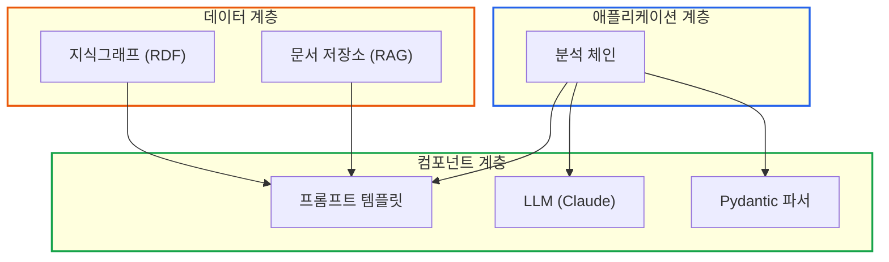

# LangChain 아키텍처: 체인의 개념과 조합

> **작성일**: 2026년 1월 9일
> **카테고리**: AI, LangChain, LLM, Architecture
> **키워드**: LangChain, LCEL, 체인 아키텍처, LLM 오케스트레이션, 프롬프트 설계
> **시리즈**: [온톨로지 + AI 에이전트: 세무 컨설팅 시스템 아키텍처](https://blog.imprun.dev/120) (10부/총 20부)
> **대상 독자**: 온톨로지에 입문하는 시니어 개발자

## 요약

Part C에서는 Part B의 지식그래프를 AI 에이전트와 연결한다. 이 글에서는 LangChain의 핵심 아키텍처 개념인 **체인(Chain)**을 다룬다. 체인은 LLM 호출을 위한 프롬프트, 모델, 파서를 하나의 파이프라인으로 조합하는 추상화다. 왜 직접 API 호출 대신 체인 패턴을 사용하는지, 그리고 세무 분석 시스템에서 어떤 구조가 적합한지 설계 관점에서 분석한다.

---

## 핵심 질문: 체인의 개념과 조합 방법은?

LLM 애플리케이션을 구축할 때 가장 먼저 마주치는 질문이다.

**단순 API 호출의 한계**:
```
사용자 질문 → API 호출 → 응답 텍스트
```

**체인 패턴의 확장성**:
```
사용자 질문 → 프롬프트 템플릿 → LLM → 출력 파서 → 구조화된 결과
                    ↓
              (컨텍스트 주입)
```

체인 패턴은 각 단계를 독립적인 컴포넌트로 분리하여 테스트, 교체, 확장이 용이하다.

---

## Part B 복습: 우리가 만든 것

Part B에서 구축한 지식 표현 계층:

```
지식 표현 계층
├── TBox (OWL): 재무제표 스키마
│   ├── fin:BalanceSheet (재무상태표)
│   ├── fin:IncomeStatement (손익계산서)
│   └── acc:* (계정과목 속성들)
├── ABox (RDF): 실제 재무 데이터
│   └── A노무법인 2024년 재무제표
├── SHACL: 검증 규칙
│   └── 부채비율, 대차대조, 영업이익률 규칙
└── SPARQL: 데이터 조회
    └── 재무 분석 쿼리
```

이제 이 데이터를 **AI 에이전트가 이해하고 분석**하도록 연결해야 한다.

---

## 왜 LangChain인가?

### 문제 상황

LLM에게 재무 분석을 요청한다고 가정하자.

```python
# 단순 API 호출
response = openai.chat.completions.create(
    model="gpt-4",
    messages=[{
        "role": "user",
        "content": "A노무법인의 2024년 재무 상태를 분석해줘"
    }]
)
```

이 접근법의 한계:

| 문제 | 영향 |
|------|------|
| LLM은 A노무법인 데이터를 모름 | 학습 데이터에 없는 정보 |
| 매번 전체 데이터 전송 | API 비용 증가, 토큰 낭비 |
| 프롬프트 하드코딩 | 유지보수 어려움 |
| 응답 형식 불일정 | 후처리 로직 복잡화 |

### 설계 결정: 추상화 계층 도입

LangChain은 이런 문제를 해결하는 **컴포넌트 기반 추상화**를 제공한다.


---

## 체인 아키텍처의 핵심 원칙

### 원칙 1: 단일 책임 분리

각 컴포넌트는 하나의 역할만 담당한다.

| 컴포넌트 | 책임 | 관심사 |
|----------|------|--------|
| 프롬프트 템플릿 | 입력 포맷팅 | 변수 치환, 컨텍스트 구성 |
| LLM | 추론 수행 | 텍스트 생성 |
| 출력 파서 | 응답 구조화 | JSON/Pydantic 변환 |

### 원칙 2: 파이프라인 조합

LCEL(LangChain Expression Language)은 파이프 연산자로 컴포넌트를 연결한다.

```python
# 파이프라인 패턴
chain = prompt | llm | parser
```

이 패턴은 Unix 파이프와 유사하다. 각 단계의 출력이 다음 단계의 입력이 된다.

### 원칙 3: 런타임 다형성

같은 인터페이스로 다른 LLM 프로바이더를 교체할 수 있다.

```python
# 개발 환경: 저렴한 모델
dev_llm = ChatOpenAI(model="gpt-4o-mini")

# 프로덕션 환경: 고성능 모델
prod_llm = ChatAnthropic(model="claude-sonnet-4-20250514")

# 동일한 체인에 적용 가능
chain = prompt | dev_llm | parser  # 개발
chain = prompt | prod_llm | parser  # 프로덕션
```

---

## 컴포넌트별 설계 고려사항

### 프롬프트 템플릿 설계

프롬프트는 **LLM의 행동을 결정**하는 핵심 요소다.

**잘못된 설계**:
```python
# 하드코딩된 프롬프트
prompt = "다음 재무 데이터를 분석해줘: " + data
```

**권장 설계**:
```python
from langchain_core.prompts import ChatPromptTemplate

# 역할, 컨텍스트, 지시사항 분리
analysis_prompt = ChatPromptTemplate.from_messages([
    ("system", """당신은 세무 전문가입니다.
주어진 재무 데이터를 분석하고 핵심 인사이트를 제공하세요.

분석 기준:
- 부채비율 200% 이상: 위험
- 영업이익률 5% 미만: 주의
- 당기순이익 감소: 경고
"""),
    ("human", """다음 재무 데이터를 분석해주세요.

회사명: {company_name}
회계연도: {fiscal_year}

재무상태표:
- 자산총계: {total_assets:,}원
- 부채총계: {total_liabilities:,}원
- 자본총계: {total_equity:,}원

분석 결과를 알려주세요.""")
])
```

**설계 포인트**:
- System 메시지에서 역할과 기준 정의
- Human 메시지에서 데이터와 요청 분리
- 변수 플레이스홀더로 재사용성 확보

### LLM 선택 기준

| 고려사항 | 선택 기준 |
|----------|-----------|
| 정확도 요구 | 높음 → Claude/GPT-4, 낮음 → GPT-4o-mini |
| 응답 속도 | 빠름 → GPT-4o-mini, 품질 우선 → Claude |
| 비용 | 제한적 → 캐싱/배치 처리 전략 |
| 컨텍스트 길이 | 긴 문서 → Claude (200K), 짧은 대화 → GPT |

```python
from langchain_anthropic import ChatAnthropic

# 세무 분석에는 정확도가 중요
llm = ChatAnthropic(
    model="claude-sonnet-4-20250514",
    temperature=0.1,  # 낮은 temperature로 일관성 확보
    max_tokens=2000
)
```

### 출력 파서 설계

LLM 응답을 프로그래밍적으로 활용하려면 **구조화**가 필수다.

```python
from pydantic import BaseModel, Field
from typing import List

class FinancialRatio(BaseModel):
    """재무 비율 분석 결과"""
    name: str = Field(description="지표명")
    value: float = Field(description="수치 (%)")
    status: str = Field(description="상태: 양호/주의/위험")
    comment: str = Field(description="설명")

class FinancialAnalysis(BaseModel):
    """종합 재무 분석"""
    company_name: str
    fiscal_year: int
    ratios: List[FinancialRatio]
    overall_assessment: str
    recommendations: List[str]
```

Pydantic 모델을 사용하면:
- 타입 검증 자동화
- IDE 자동완성 지원
- 스키마 문서화

---

## 세무 시스템을 위한 체인 아키텍처

### 계층 구조 설계



### 데이터 흐름

1. **지식그래프에서 데이터 조회** (SPARQL)
2. **프롬프트 템플릿에 데이터 주입**
3. **LLM이 분석 수행**
4. **Pydantic으로 결과 구조화**
5. **애플리케이션에서 활용**

---

## 트레이드오프 분석

### LangChain vs 직접 API 호출

| 항목 | 직접 API 호출 | LangChain |
|------|-------------|-----------|
| 초기 복잡도 | 낮음 | 중간 |
| 확장성 | 제한적 | 높음 |
| 프롬프트 관리 | 수동 | 템플릿 시스템 |
| 모델 교체 | 코드 수정 필요 | 설정 변경 |
| 출력 파싱 | 직접 구현 | 내장 파서 |
| 디버깅 | 어려움 | 트레이싱 지원 |

**결론**: 프로토타입은 직접 호출, 프로덕션은 LangChain 권장.

### LCEL vs Legacy Chain

LangChain 0.2 이후 LCEL이 표준이다.

| 항목 | Legacy Chain | LCEL |
|------|-------------|------|
| 문법 | 클래스 상속 | 파이프 연산자 |
| 스트리밍 | 수동 구현 | 자동 지원 |
| 비동기 | 별도 메서드 | 자동 지원 |
| 병렬 처리 | 복잡 | RunnableParallel |

```python
# LCEL 방식 (권장)
chain = prompt | llm | parser

# 스트리밍 자동 지원
for chunk in chain.stream({...}):
    print(chunk, end="")

# 비동기 자동 지원
result = await chain.ainvoke({...})
```

---

## 구현 예시: 세무 분석 체인

### 핵심 구조

```python
from langchain_anthropic import ChatAnthropic
from langchain_core.prompts import ChatPromptTemplate
from langchain_core.output_parsers import PydanticOutputParser

class TaxAnalysisChain:
    """세무 분석 체인 - 아키텍처 예시"""

    def __init__(self, model: str = "claude-sonnet-4-20250514"):
        # 컴포넌트 초기화
        self.llm = ChatAnthropic(model=model, temperature=0.1)
        self.parser = PydanticOutputParser(pydantic_object=TaxAnalysisReport)

        # 프롬프트 템플릿 (format_instructions 자동 주입)
        self.prompt = TAX_ANALYSIS_PROMPT.partial(
            format_instructions=self.parser.get_format_instructions()
        )

        # 체인 조합
        self.chain = self.prompt | self.llm | self.parser

    def analyze(self, financial_data: dict) -> TaxAnalysisReport:
        """재무 데이터 분석 실행"""
        return self.chain.invoke(financial_data)
```

### 지식그래프 연동 준비

Part B에서 만든 지식그래프를 LangChain과 연결하면:

```python
# 13부에서 구현할 도구 미리보기
from langchain_core.tools import tool

@tool
def query_financial_data(sparql_query: str) -> str:
    """지식그래프에서 재무 데이터를 조회합니다."""
    from rdflib import Graph
    g = Graph()
    g.parse("tax_knowledge_graph.ttl", format="turtle")
    results = g.query(sparql_query)
    return str(list(results))
```

이런 도구들을 에이전트에 연결하면, AI가 **스스로 필요한 데이터를 조회**할 수 있다.

---

## 핵심 정리

### 체인 아키텍처의 가치

| 개념 | 설명 | 세무 시스템 적용 |
|------|------|-----------------|
| 프롬프트 템플릿 | 변수화된 프롬프트 관리 | 재무 분석 지시문 |
| LCEL | 파이프라인 체인 구성 | 데이터 → 분석 → 리포트 |
| 출력 파서 | LLM 응답 구조화 | Pydantic 리포트 모델 |
| 런타임 교체 | 동일 인터페이스로 모델 변경 | 개발/프로덕션 분리 |

### 설계 원칙 요약

1. **단일 책임**: 각 컴포넌트는 하나의 역할만
2. **조합 가능**: 파이프 연산자로 유연한 연결
3. **테스트 용이**: 컴포넌트별 독립 테스트
4. **확장 가능**: 새 컴포넌트 추가가 기존 코드에 영향 없음

---

## 다음 단계 미리보기

**11부: RAG와 GraphRAG 아키텍처**

LLM은 학습 데이터에 없는 정보를 모른다. 세무 법령, 회계 기준서, 과거 분석 리포트 등 **외부 문서를 검색**하여 LLM에게 제공하는 RAG(Retrieval-Augmented Generation)를 다룬다.

- 일반 RAG vs GraphRAG 비교
- 세무 데이터에 왜 GraphRAG가 적합한지
- 검색 증강 생성의 아키텍처

---

## 참고 자료

### LangChain 공식 문서
- [LangChain Python Documentation](https://python.langchain.com/docs/introduction/)
- [LCEL Conceptual Guide](https://python.langchain.com/docs/concepts/#langchain-expression-language-lcel)
- [Output Parsers](https://python.langchain.com/docs/concepts/#output-parsers)

### LLM API
- [Anthropic API Reference](https://docs.anthropic.com/en/api/getting-started)
- [OpenAI API Reference](https://platform.openai.com/docs/api-reference)

### 관련 시리즈
- [이전: 재무제표 온톨로지 완성하기](https://blog.imprun.dev/129)
- [다음: RAG와 GraphRAG 아키텍처](https://blog.imprun.dev/131)
- [시리즈 목차](https://blog.imprun.dev/120)
