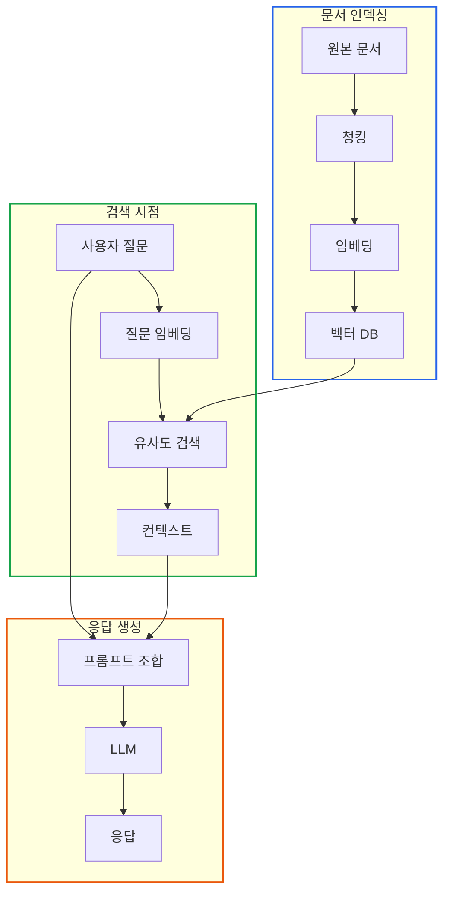
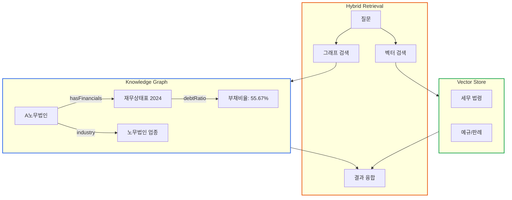
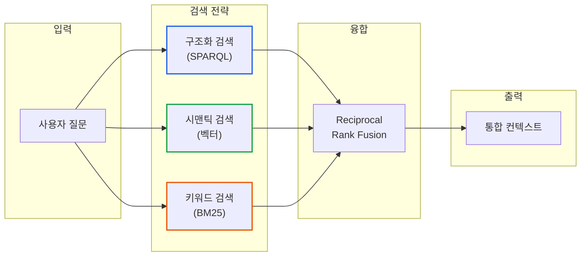
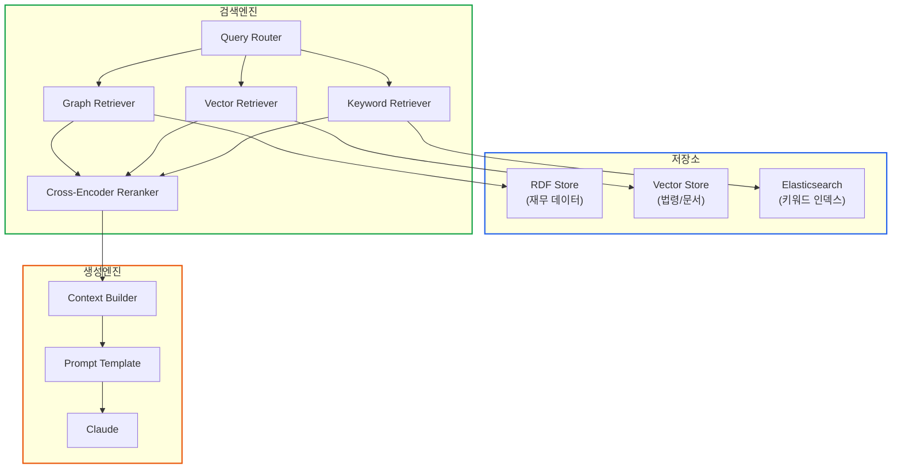

# RAG와 GraphRAG: 검색 증강 생성의 아키텍처

> **작성일**: 2026년 1월 9일
> **카테고리**: AI, RAG, GraphRAG, Knowledge Graph
> **키워드**: RAG, GraphRAG, 벡터 검색, 지식그래프, 하이브리드 검색, 세무 도메인
> **시리즈**: [온톨로지 + AI 에이전트: 세무 컨설팅 시스템 아키텍처](https://blog.imprun.dev/120) (11부/총 20부)
> **대상 독자**: 온톨로지에 입문하는 시니어 개발자

## 요약

LLM은 학습 데이터에 없는 정보를 모른다. 세무 법령, 회계 기준서, 과거 분석 리포트 등 **외부 문서를 검색하여 LLM에게 제공**하는 것이 RAG(Retrieval-Augmented Generation)다. 이 글에서는 일반 RAG와 GraphRAG를 비교하고, 세무 데이터처럼 **관계가 중요한 도메인에서 왜 GraphRAG가 적합한지** 설계 원리 중심으로 분석한다.

---

## 핵심 질문: 검색 증강 생성의 아키텍처는?

RAG는 LLM의 한계를 보완하는 핵심 기법이다. 하지만 어떤 검색 방식을 선택하느냐에 따라 응답 품질이 크게 달라진다.

**근본적인 문제**:
- LLM의 학습 데이터는 과거 시점에 고정됨
- 특정 회사의 재무 데이터는 학습되지 않음
- 세무 법령은 자주 개정됨

**해결 방향**:
```
질문 → 관련 문서 검색 → 컨텍스트 + 질문 → LLM → 응답
```

---

## RAG 아키텍처 기본 구조

### 일반 RAG 파이프라인



### 단계별 설계 고려사항

| 단계 | 핵심 결정 | 트레이드오프 |
|------|---------|-------------|
| 청킹 | 청크 크기 선택 | 작으면 정보 손실, 크면 노이즈 |
| 임베딩 | 모델 선택 | 한국어 특화 vs 다국어 범용 |
| 검색 | 유사도 임계값 | 높으면 재현율 감소, 낮으면 정밀도 감소 |
| 프롬프트 | 컨텍스트 양 | 많으면 토큰 비용, 적으면 정보 부족 |

---

## 일반 RAG의 한계: 세무 도메인 사례

### 문제 시나리오

**질문**: "A노무법인의 부채비율이 높은 이유와 관련 세무 리스크를 분석해주세요"

**일반 RAG의 처리**:
1. "부채비율", "세무 리스크"로 검색
2. 관련 문서 조각 반환
3. LLM이 응답 생성

**문제점**:
- 부채비율 **정의**는 찾지만 **A노무법인의 실제 수치**는 모름
- "높다"의 기준이 **업종별로 다름**을 반영 못함
- 부채비율과 **세무 위험의 관계**를 연결 못함

### 관계 정보의 부재

일반 RAG는 **독립적인 텍스트 조각**만 검색한다.

```
검색 결과 1: "부채비율은 부채총계를 자본총계로 나눈 값이다."
검색 결과 2: "중소기업의 평균 부채비율은 120%이다."
검색 결과 3: "과다부채 기업은 지급이자가 높아 세금 부담이..."
```

이 조각들 사이의 **관계**:
- A노무법인의 부채비율은 얼마인가?
- A노무법인은 중소기업인가?
- A노무법인의 업종 평균은?

이런 관계 정보 없이는 **피상적인 응답**만 가능하다.

---

## GraphRAG: 관계 중심 검색

### GraphRAG 아키텍처



### GraphRAG의 장점

| 측면 | 일반 RAG | GraphRAG |
|------|---------|----------|
| 검색 대상 | 텍스트 청크 | 엔티티 + 관계 + 텍스트 |
| 컨텍스트 | 유사 문장들 | 구조화된 사실 + 관련 문서 |
| 추론 | LLM 의존 | 그래프 순회 + LLM |
| 다중 홉 질문 | 불가능 | 자연스러운 지원 |

### 다중 홉 질문 예시

**질문**: "A노무법인과 같은 업종의 평균 부채비율 대비 어떤가?"

**일반 RAG**:
- "A노무법인"과 "평균 부채비율"로 검색
- 관련 없는 문서 반환 가능
- 비교 계산 불가

**GraphRAG**:
```
1. A노무법인 → industry → 노무법인
2. 노무법인 업종 → 평균 부채비율 → 120%
3. A노무법인 → 부채비율 → 55.67%
4. 비교: 55.67% vs 120% (업종 평균의 46%)
```

---

## 세무 도메인에 GraphRAG가 적합한 이유

### 1. 관계가 핵심인 데이터

세무 데이터는 단순 수치가 아닌 **관계의 집합**이다.

```
회사 → 회계연도 → 재무제표 → 계정과목
      ↓
    업종 → 업종평균 → 비교기준
      ↓
    중소기업 → 세액공제 자격
```

| 데이터 유형 | 관계 예시 |
|------------|---------|
| 재무제표 | 회사-연도-계정 간 계층 |
| 세무 신고 | 신고서-별지-항목 참조 |
| 법령 | 조문 간 참조 관계 |
| 업종 분류 | 계층적 분류 체계 |

### 2. 맥락 의존적 해석

동일한 수치도 **맥락에 따라 의미가 다르다**.

**부채비율 55.67%**:
- 제조업: 양호 (평균 150%)
- 금융업: 위험 (평균 30%)
- 노무법인: 우수 (평균 120%)

GraphRAG는 **맥락(업종, 규모, 연도)을 함께 검색**한다.

### 3. 추론 규칙 통합

Part B에서 정의한 **추론 규칙**을 검색에 활용할 수 있다.

```turtle
# SHACL 규칙에서 추론된 사실
:A노무법인 :hasRiskLevel :LowRisk ;
           :eligibleFor :중소기업세액공제 ;
           :debtRatioStatus "양호" .
```

---

## 하이브리드 검색 아키텍처 설계

### 검색 전략 조합

세무 분석 시스템에서는 **세 가지 검색을 조합**한다.



### 각 검색 전략의 역할

| 전략 | 대상 | 강점 | 약점 |
|------|------|------|------|
| SPARQL | 지식그래프 | 정확한 사실 조회 | 자연어 이해 불가 |
| 벡터 검색 | 문서 저장소 | 의미적 유사도 | 정확한 값 검색 어려움 |
| BM25 | 문서 저장소 | 특정 용어 검색 | 동의어 처리 어려움 |

### 융합 전략: RRF (Reciprocal Rank Fusion)

각 검색 결과의 순위를 역수로 변환하여 합산한다.

```
RRF_score = Σ 1/(k + rank_i)
```

**장점**:
- 검색 방식별 점수 스케일 차이 무시
- 여러 검색에서 상위권이면 가중
- 구현이 단순

---

## 설계 결정: 청킹 전략

### 세무 문서 유형별 청킹

| 문서 유형 | 청킹 전략 | 이유 |
|----------|---------|------|
| 법령 | 조문 단위 | 조문은 독립적 의미 단위 |
| 예규 | 질의-답변 쌍 | QA 형태가 자연스러움 |
| 판례 | 판시사항 단위 | 핵심 논점별 분리 |
| 재무제표 | 테이블 보존 | 구조 정보 유지 |

### 청크 크기 트레이드오프

```
작은 청크 (200토큰)
├── 장점: 정밀한 검색
├── 단점: 맥락 손실
└── 적합: 정의 조회, 용어 검색

큰 청크 (1000토큰)
├── 장점: 맥락 보존
├── 단점: 노이즈 포함
└── 적합: 배경 설명, 사례 분석
```

**권장 전략**: 계층적 청킹
- 상위 청크: 넓은 맥락 (섹션 단위)
- 하위 청크: 정밀 검색 (단락 단위)
- 연결: parent_chunk_id로 관계 유지

---

## 임베딩 모델 선택

### 한국어 세무 도메인 고려사항

| 모델 | 장점 | 단점 | 적합도 |
|------|------|------|--------|
| OpenAI text-embedding-3 | 다국어 지원, 높은 품질 | API 비용, 의존성 | 중 |
| Ko-Sentence-BERT | 한국어 특화, 로컬 실행 | 도메인 미세조정 필요 | 높음 |
| BGE-M3 | 다국어, 오픈소스 | 리소스 필요 | 중 |

**권장**: 도메인 특화 모델
- 세무 용어(예: 손금불산입, 익금산입)가 많음
- 범용 모델은 세무 용어 이해 부족
- Ko-Sentence-BERT + 세무 코퍼스 파인튜닝 검토

---

## 아키텍처 예시: 세무 RAG 시스템

### 컴포넌트 구조



### 쿼리 라우팅 로직

질문 유형에 따라 검색 전략을 선택한다.

| 질문 유형 | 주요 검색 | 보조 검색 |
|----------|---------|---------|
| 수치 조회 ("부채비율은?") | SPARQL | - |
| 정의 질문 ("손금이란?") | 벡터 | BM25 |
| 분석 요청 ("상태를 분석해줘") | SPARQL + 벡터 | BM25 |
| 비교 질문 ("업계 평균 대비?") | SPARQL | 벡터 |

---

## 핵심 설계 원칙

### 1. 구조화 데이터와 비구조화 데이터 분리

```
지식그래프 (구조화)
├── 회사 정보
├── 재무 수치
├── 분류 정보
└── 추론된 사실

문서 저장소 (비구조화)
├── 세무 법령
├── 회계 기준서
├── 예규/판례
└── 해석 문서
```

**원칙**: 정확한 사실은 그래프에서, 해석은 문서에서

### 2. 검색-생성 책임 분리

- 검색: 관련 정보를 빠짐없이 수집
- 생성: 수집된 정보를 바탕으로 추론

**원칙**: LLM에게 사실을 만들게 하지 않음

### 3. 출처 추적 가능성

모든 응답에 **근거 출처**를 포함한다.

```
응답: "A노무법인의 부채비율은 55.67%로 업종 평균(120%)
대비 양호한 수준입니다."

출처:
- 부채비율 55.67%: [KG] A노무법인_2024_재무상태표
- 업종 평균 120%: [Vector] 중소기업통계_2024.pdf
```

---

## 트레이드오프 분석

### GraphRAG vs 일반 RAG

| 항목 | 일반 RAG | GraphRAG |
|------|---------|----------|
| 구축 비용 | 낮음 | 높음 (온톨로지 필요) |
| 유지보수 | 문서 추가만 | 그래프 갱신 필요 |
| 응답 정확도 | 중간 | 높음 |
| 다중 홉 질문 | 어려움 | 자연스러움 |
| 확장성 | 높음 | 중간 |

**결론**: 관계가 중요한 도메인(세무, 의료, 법률)에서는 GraphRAG 권장

### 벡터 검색 vs 키워드 검색

| 항목 | 벡터 검색 | 키워드 검색 |
|------|---------|-----------|
| 동의어 처리 | 자동 | 수동 설정 필요 |
| 정확한 용어 | 약함 | 강함 |
| 계산 비용 | 높음 | 낮음 |
| 설명 가능성 | 어려움 | 쉬움 |

**결론**: 하이브리드 검색으로 양쪽 장점 활용

---

## 핵심 정리

### RAG 아키텍처 선택 가이드

| 도메인 특성 | 권장 아키텍처 |
|------------|--------------|
| 관계 중요, 추론 필요 | GraphRAG |
| 문서 기반, 단순 검색 | 일반 RAG |
| 정확한 수치 필요 | 그래프 + 벡터 하이브리드 |
| 빠른 구축 필요 | 일반 RAG 후 점진적 개선 |

### 세무 시스템 권장 구성

```
데이터 계층
├── RDF Store: 회사, 재무제표, 세무신고
├── Vector Store: 법령, 기준서, 예규
└── Elasticsearch: 키워드 인덱스

검색 계층
├── SPARQL: 구조화 데이터 정확 조회
├── 벡터 검색: 의미적 유사 문서
└── BM25: 특정 용어 검색

융합 계층
└── RRF + Reranking
```

---

## 다음 단계 미리보기

**12부: LangGraph 상태 기반 에이전트**

단일 체인은 복잡한 워크플로우를 처리하기 어렵다. 다음 글에서는 **상태 그래프**로 복잡한 추론 과정을 모델링하는 LangGraph를 다룬다.

- 복잡한 워크플로우를 그래프로 표현하는 방법
- 상태 관리와 조건부 분기
- 세무 분석 워크플로우 설계

---

## 참고 자료

### RAG 관련
- [LangChain RAG Tutorial](https://python.langchain.com/docs/tutorials/rag/)
- [Microsoft GraphRAG](https://github.com/microsoft/graphrag)
- [Pinecone RAG Guide](https://www.pinecone.io/learn/retrieval-augmented-generation/)

### 임베딩 모델
- [OpenAI text-embedding-3](https://platform.openai.com/docs/guides/embeddings)
- [Ko-Sentence-BERT](https://github.com/jhgan/ko-sentence-transformers)

### 관련 시리즈
- [이전: LangChain 아키텍처](https://blog.imprun.dev/130)
- [다음: LangGraph 상태 기반 에이전트](https://blog.imprun.dev/132)
- [시리즈 목차](https://blog.imprun.dev/120)
