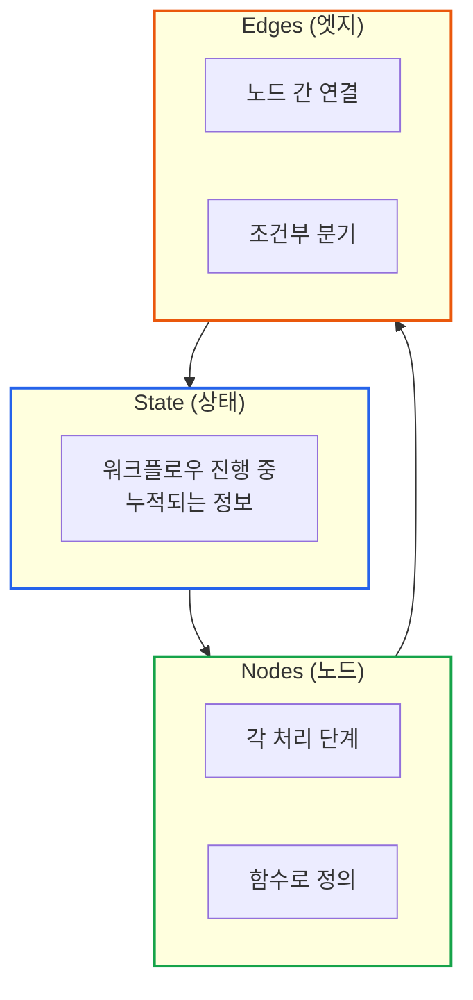
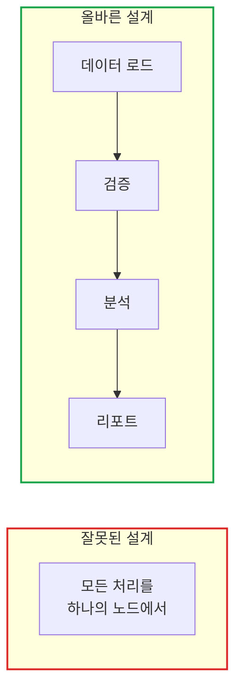
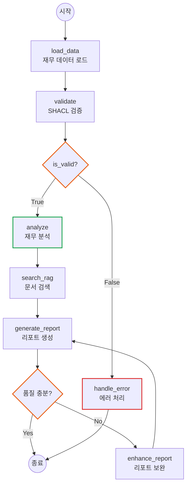
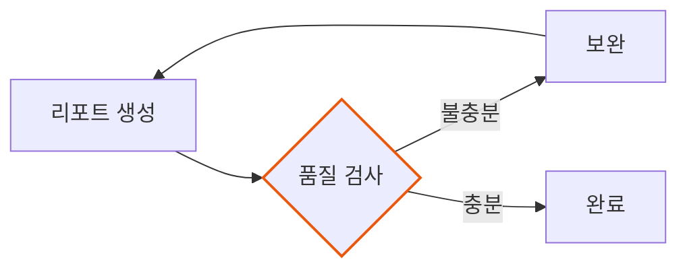
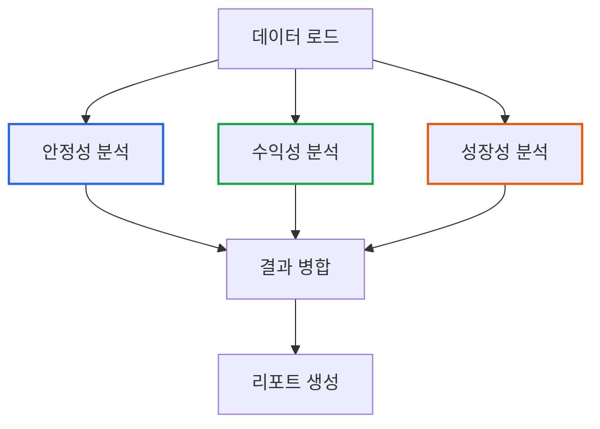
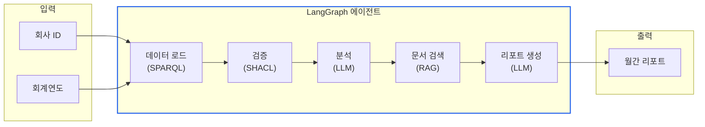

# LangGraph 상태 기반 워크플로우: 그래프로 복잡한 추론 표현하기

> **작성일**: 2026년 1월 9일
> **카테고리**: AI, LangGraph, Agent, Workflow Design
> **키워드**: LangGraph, 상태 그래프, 워크플로우 설계, 조건부 분기, 순환 그래프, 에이전트 아키텍처
> **시리즈**: [온톨로지 + AI 에이전트: 세무 컨설팅 시스템 아키텍처](https://blog.imprun.dev/120) (12부/총 20부)
> **대상 독자**: 온톨로지에 입문하는 시니어 개발자

## 요약

10부에서 LangChain 체인을, 11부에서 RAG를 다뤘다. 하지만 실제 세무 분석은 **단순 질문-응답이 아니다**. 데이터 조회 → 검증 → 분석 → 리포트 생성처럼 여러 단계를 거쳐야 하고, 중간에 조건에 따라 다른 경로로 분기해야 한다. 이 글에서는 **복잡한 워크플로우를 그래프로 모델링**하는 LangGraph의 설계 원리를 분석하고, 세무 분석 시스템에 적합한 아키텍처를 제시한다.

---

## 핵심 질문: 복잡한 워크플로우를 어떻게 그래프로 표현하는가?

단일 체인은 **직선형 파이프라인**만 표현할 수 있다.

```
입력 → 프롬프트 → LLM → 파서 → 출력
```

하지만 현실의 워크플로우는 이렇다.

```
입력 → 데이터 조회 → 검증 → [검증 실패?] → 에러 처리 → 종료
                           ↓ [검증 성공]
                        분석 → [충분한가?] → 보완 → 분석 (반복)
                                    ↓ [충분]
                                 리포트 생성 → 종료
```

이런 **조건부 분기, 반복, 병렬 실행**을 표현하려면 **그래프**가 필요하다.

---

## LangGraph 아키텍처 개요

### 핵심 컴포넌트



| 컴포넌트 | 역할 | 비유 |
|----------|------|------|
| State | 워크플로우 전체에서 공유되는 데이터 | 게임의 세이브 파일 |
| Node | 상태를 입력받아 처리하고 업데이트 | 게임의 각 스테이지 |
| Edge | 다음 노드 결정 (조건부 가능) | 스테이지 간 분기점 |

### LangChain 체인 vs LangGraph

| 측면 | LangChain 체인 | LangGraph |
|------|---------------|-----------|
| 실행 흐름 | 직선형 | 그래프 (분기/루프) |
| 상태 관리 | 암묵적 | 명시적 타입 정의 |
| 조건부 분기 | 어려움 | 네이티브 지원 |
| 반복/재시도 | 불가 | 순환 그래프 |
| 병렬 실행 | 제한적 | Fan-out/Fan-in |
| 디버깅 | 어려움 | 스트리밍/시각화 |

---

## 설계 원칙 1: 상태 모델링

### 상태란?

워크플로우가 진행되면서 **누적되는 모든 정보**를 담는 컨테이너다.

**잘못된 설계**: 함수 간 매개변수 전달
```python
# 매개변수가 계속 늘어남
def analyze(data, validation_result, rag_context, config...):
    ...
```

**올바른 설계**: 상태 타입 정의
```python
class TaxAnalysisState(TypedDict):
    # 입력
    company_id: str
    fiscal_year: int

    # 중간 결과
    financial_data: Optional[FinancialData]
    validation_result: Optional[ValidationResult]
    analysis_result: Optional[AnalysisResult]

    # 누적 로그
    messages: Annotated[List[str], add]

    # 최종 출력
    report: Optional[str]
```

### 상태 설계 시 고려사항

| 고려사항 | 설명 | 예시 |
|----------|------|------|
| 불변성 | 노드는 상태를 직접 수정하지 않고 새 값을 반환 | `return {"report": new_report}` |
| 누적 vs 덮어쓰기 | 리스트는 누적, 단일 값은 덮어쓰기 | `Annotated[List[str], add]` |
| 타입 안정성 | TypedDict로 IDE 자동완성 지원 | 모든 필드에 타입 명시 |
| 선택적 필드 | 초기에는 None, 노드 실행 후 채워짐 | `Optional[AnalysisResult]` |

---

## 설계 원칙 2: 노드 분리

### 단일 책임 원칙

각 노드는 **하나의 명확한 역할**만 담당한다.



### 세무 분석 시스템의 노드 분해

| 노드 | 책임 | 입력 | 출력 |
|------|------|------|------|
| load_data | 지식그래프에서 재무 데이터 조회 | company_id, fiscal_year | financial_data |
| validate | SHACL 규칙 검증 | financial_data | validation_result |
| analyze | 재무 비율 계산 및 위험 평가 | financial_data | analysis_result |
| search_rag | 관련 법령/문서 검색 | analysis_result | rag_context |
| generate_report | LLM으로 리포트 생성 | 모든 중간 결과 | report |
| handle_error | 검증 실패 처리 | validation_result | error_report |

### 노드 함수 패턴

```python
def node_function(state: TaxAnalysisState) -> dict:
    """
    노드 함수의 표준 패턴

    1. 상태에서 필요한 데이터 추출
    2. 처리 로직 수행
    3. 업데이트할 필드만 반환 (전체 상태 아님)
    """
    # 입력 추출
    data = state["financial_data"]

    # 처리
    result = process(data)

    # 업데이트할 필드만 반환
    return {
        "analysis_result": result,
        "messages": ["분석 완료"]  # 누적됨
    }
```

---

## 설계 원칙 3: 조건부 분기

### 라우터 함수 설계

조건부 분기는 **라우터 함수**가 다음 노드를 결정한다.

```python
def should_continue(state: TaxAnalysisState) -> str:
    """검증 결과에 따라 분기"""
    validation = state["validation_result"]

    if validation.is_valid:
        return "analyze"    # 분석 계속
    else:
        return "handle_error"  # 에러 처리로 분기
```

### 분기 조건 설계 시 고려사항

| 고려사항 | 설명 |
|----------|------|
| 명확한 조건 | 모호하지 않은 분기 기준 |
| 완전한 커버리지 | 모든 경우를 처리 (default 분기) |
| 테스트 용이성 | 각 분기 조건을 독립적으로 테스트 가능 |

### 그래프에 분기 추가

```python
# 조건부 엣지 정의
graph.add_conditional_edges(
    "validate",           # 분기점 노드
    should_continue,      # 라우터 함수
    {
        "analyze": "analyze",        # 조건 → 다음 노드
        "handle_error": "handle_error"
    }
)
```

---

## 세무 분석 워크플로우 아키텍처

### 전체 그래프 구조



### 설계 결정 사항

| 결정 | 선택 | 근거 |
|------|------|------|
| 검증 실패 처리 | 별도 분기 | 에러 리포트 형식이 다름 |
| 리포트 품질 검사 | 순환 그래프 | 필수 섹션 누락 시 보완 |
| 최대 재시도 | 3회 | 무한 루프 방지 |

---

## 고급 패턴: 순환 그래프

### 자가 수정 에이전트

분석 결과가 불충분하면 **다시 시도**하는 패턴이다.



### 무한 루프 방지

상태에 **재시도 카운터**를 추가한다.

```python
class TaxAnalysisState(TypedDict):
    # ... 기존 필드들
    retry_count: int  # 재시도 횟수

def check_report_quality(state: TaxAnalysisState) -> str:
    retry_count = state.get("retry_count", 0)

    # 최대 3회까지만 재시도
    if retry_count >= 3:
        return "complete"

    # 품질 검사 로직...
    required_sections = ["요약", "주요 지표", "권고 사항"]
    report = state.get("report", "")

    if all(s in report for s in required_sections):
        return "complete"
    else:
        return "enhance"
```

---

## 고급 패턴: 병렬 실행

### Fan-out / Fan-in 패턴

여러 분석을 **동시에 실행**하고 결과를 합친다.



### 병렬 처리의 트레이드오프

| 장점 | 단점 |
|------|------|
| 총 처리 시간 단축 | 구현 복잡도 증가 |
| 리소스 활용 극대화 | 에러 처리 복잡 |
| 독립적인 분석 가능 | 상태 병합 로직 필요 |

---

## 스트리밍과 관찰 가능성

### 실시간 진행 상황 추적

```python
# 스트리밍 모드로 실행
for step in agent.stream(initial_state):
    for node_name, node_output in step.items():
        print(f"[{node_name}] 완료")
        if "messages" in node_output:
            for msg in node_output["messages"]:
                print(f"  {msg}")
```

출력:
```
[load_data] 완료
  재무 데이터 로드 완료: A노무법인 (2024)
[validate] 완료
  데이터 검증 완료: 통과
[analyze] 완료
  재무 분석 완료: 위험 수준 low
[search_rag] 완료
  관련 문서 3건 검색 완료
[generate_report] 완료
  리포트 생성 완료
```

### 디버깅 전략

| 전략 | 방법 |
|------|------|
| 단계별 실행 | `stream()` 사용 |
| 상태 스냅샷 | 각 노드 후 상태 저장 |
| 조건 분기 로깅 | 라우터 함수에 로깅 추가 |
| 시각화 | `graph.get_graph().draw_png()` |

---

## 트레이드오프 분석

### 언제 LangGraph를 사용해야 하는가?

| 시나리오 | 권장 |
|----------|------|
| 단순 질문-응답 | LangChain 체인 |
| 조건부 분기 필요 | LangGraph |
| 복잡한 다단계 분석 | LangGraph |
| 재시도/보완 로직 | LangGraph |
| 병렬 처리 필요 | LangGraph |

### LangGraph의 비용

| 비용 | 완화 방법 |
|------|---------|
| 학습 곡선 | 간단한 그래프부터 시작 |
| 코드 복잡도 | 노드 함수 단순화 |
| 상태 관리 오버헤드 | 필요한 필드만 정의 |

---

## 핵심 정리

### 그래프 기반 워크플로우 설계 원칙

1. **상태 중심 설계**: 모든 정보는 상태에 명시적으로 정의
2. **노드 단일 책임**: 각 노드는 하나의 역할만 담당
3. **명확한 분기 조건**: 라우터 함수로 다음 경로 결정
4. **안전한 순환**: 최대 재시도 횟수로 무한 루프 방지

### 세무 시스템 워크플로우



---

## 다음 단계 미리보기

**13부: 에이전트 도구 설계**

LangGraph 에이전트의 각 노드는 **외부 도구**를 호출할 수 있다. 다음 글에서는 에이전트가 사용할 도구를 어떻게 설계하는지 다룬다.

- 도구 인터페이스 설계 원칙
- SPARQL 쿼리 도구: 지식그래프 연동
- SHACL 검증 도구: 비즈니스 규칙 검증
- 도구 선택 전략: LLM이 적절한 도구를 선택하는 방법

---

## 참고 자료

### LangGraph 공식 문서
- [LangGraph Documentation](https://langchain-ai.github.io/langgraph/)
- [LangGraph Tutorials](https://langchain-ai.github.io/langgraph/tutorials/)

### 상태 기계 이론
- [Finite-state Machine](https://en.wikipedia.org/wiki/Finite-state_machine)
- [Directed Acyclic Graph](https://en.wikipedia.org/wiki/Directed_acyclic_graph)

### 관련 시리즈
- [이전: RAG와 GraphRAG 아키텍처](https://blog.imprun.dev/131)
- [다음: 에이전트 도구 설계](https://blog.imprun.dev/133)
- [시리즈 목차](https://blog.imprun.dev/120)
