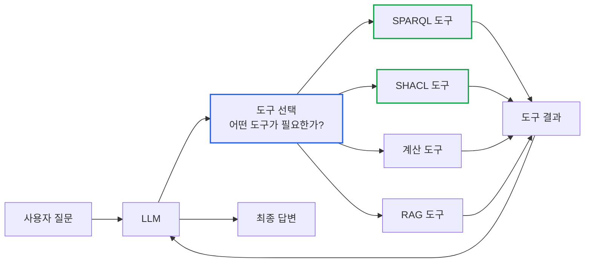
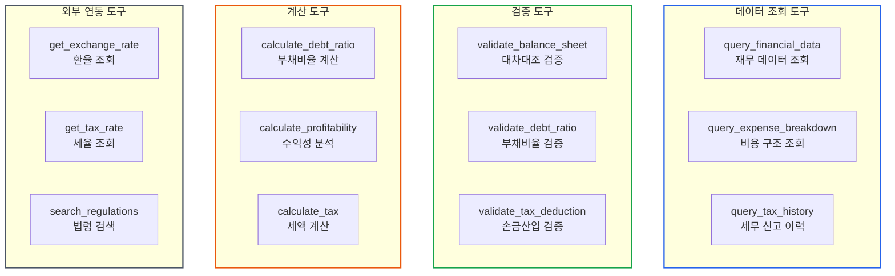
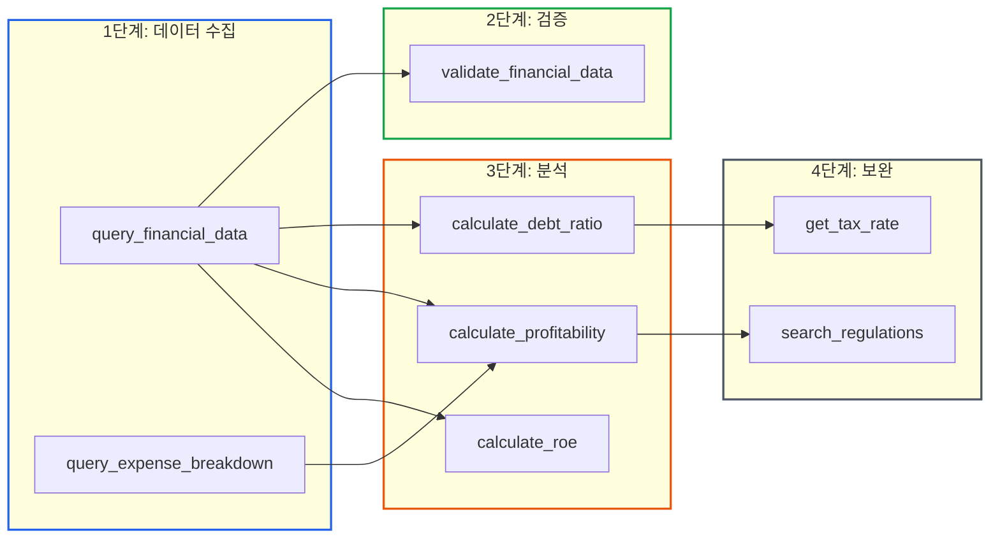
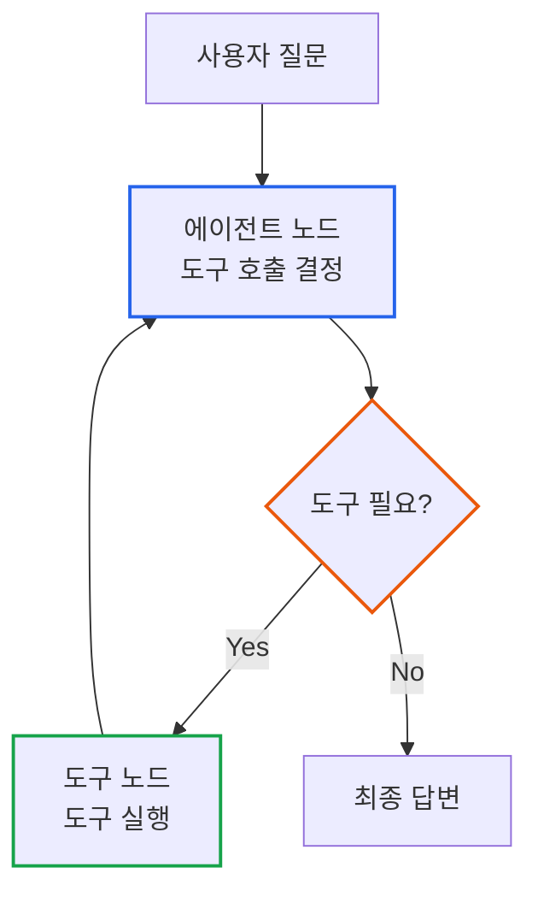
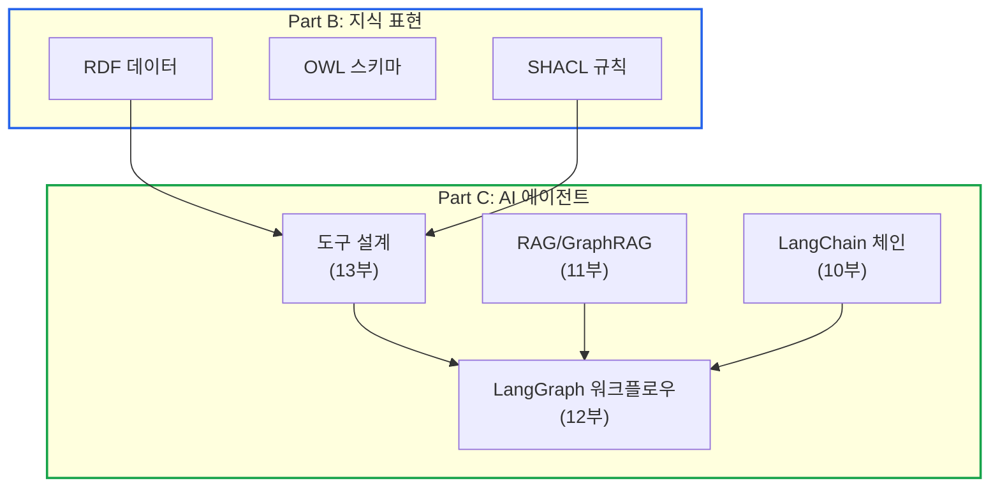

# 에이전트 도구 설계: LLM이 사용하는 도구를 어떻게 만드는가

> **작성일**: 2026년 1월 9일
> **카테고리**: AI, LangChain, Tool Design, Agent Architecture
> **키워드**: LangChain Tool, 도구 인터페이스, SPARQL, SHACL, 도구 선택 전략, ReAct 패턴
> **시리즈**: [온톨로지 + AI 에이전트: 세무 컨설팅 시스템 아키텍처](https://blog.imprun.dev/120) (13부/총 20부)
> **대상 독자**: 온톨로지에 입문하는 시니어 개발자

## 요약

Part C의 마지막 장이다. 10-12부에서 LangChain 체인, RAG, LangGraph 에이전트를 다뤘다. 하지만 에이전트가 진정한 힘을 발휘하려면 **외부 시스템과 상호작용**해야 한다. 이 글에서는 에이전트가 사용할 도구를 **어떻게 설계하는지**, 그리고 LLM이 **적절한 도구를 선택하는 원리**를 분석한다. Part B에서 만든 지식그래프(SPARQL), 검증 규칙(SHACL)과 연동하는 도구 설계를 예시로 다룬다.

---

## 핵심 질문: 에이전트가 사용할 도구를 어떻게 설계하는가?

LLM은 **텍스트 생성**만 할 수 있다. 다음은 불가능하다.

| 불가능한 작업 | 이유 |
|-------------|------|
| 실시간 데이터베이스 조회 | 학습 데이터에 없음 |
| 수학적 정확한 계산 | 추론 기반, 계산 아님 |
| 외부 API 호출 | 네트워크 접근 불가 |
| 파일 시스템 접근 | 환경 접근 불가 |

**도구(Tool)**는 이 한계를 극복하는 인터페이스다.



---

## 도구 인터페이스 설계 원칙

### 원칙 1: 명확한 책임

각 도구는 **하나의 명확한 작업**만 수행한다.

| 좋은 설계 | 나쁜 설계 |
|----------|----------|
| `query_financial_data` | `do_everything` |
| `calculate_debt_ratio` | `analyze_and_report` |
| `validate_balance_sheet` | `process_data` |

### 원칙 2: 자기 설명적 인터페이스

LLM이 **도구 설명만 보고 선택**할 수 있어야 한다.

```python
@tool
def query_financial_data(company_name: str, fiscal_year: int) -> str:
    """특정 회사의 재무 데이터를 조회합니다.

    이 도구는 지식그래프에서 SPARQL 쿼리를 실행하여
    재무상태표와 손익계산서의 주요 항목을 반환합니다.

    Args:
        company_name: 회사명 (예: A노무법인)
        fiscal_year: 회계연도 (예: 2024)

    Returns:
        재무상태표와 손익계산서 주요 항목

    Example:
        >>> query_financial_data("A노무법인", 2024)
    """
```

**설명의 구성 요소**:
1. **첫 줄**: 간결한 요약 (LLM이 빠르게 판단)
2. **상세 설명**: 어떤 시스템과 연동하는지
3. **인자 설명**: 각 매개변수의 역할과 예시
4. **반환값 설명**: 무엇이 돌아오는지
5. **예시**: 구체적인 사용법

### 원칙 3: 예측 가능한 출력

도구의 출력 형식은 **일관되고 구조화**되어야 한다.

```python
# 좋은 예: 구조화된 출력
return f"""
## {company_name} 재무 데이터

### 재무상태표
| 항목 | 금액 |
|------|------|
| 자산총계 | {total_assets:,}원 |
| 부채총계 | {total_liabilities:,}원 |

### 손익계산서
| 항목 | 금액 |
|------|------|
| 매출액 | {revenue:,}원 |
"""

# 나쁜 예: 비구조화된 출력
return f"자산은 {total_assets}이고 부채는 {total_liabilities}입니다"
```

### 원칙 4: 안전한 실패

에러가 발생해도 **유용한 정보**를 반환한다.

```python
@tool
def query_financial_data(company_name: str, fiscal_year: int) -> str:
    """..."""
    try:
        results = execute_query(company_name, fiscal_year)
        if not results:
            return f"조회 결과 없음: {company_name}의 {fiscal_year}년 데이터가 존재하지 않습니다."
        return format_results(results)
    except ConnectionError:
        return "오류: 지식그래프 연결 실패. 잠시 후 재시도하세요."
    except QuerySyntaxError as e:
        return f"오류: 쿼리 구문 오류 - {str(e)}"
```

---

## 도구 분류 체계

### 세무 분석 시스템의 도구 카테고리



### 도구 카테고리별 설계 고려사항

| 카테고리 | 핵심 고려사항 | 예시 |
|----------|-------------|------|
| 데이터 조회 | 캐싱, 연결 관리 | SPARQL 쿼리 결과 캐싱 |
| 검증 | 규칙 버전 관리 | SHACL 규칙 업데이트 |
| 계산 | 정밀도, 반올림 규칙 | 세액 계산 시 원 단위 |
| 외부 연동 | 타임아웃, 재시도 | API 호출 실패 처리 |

---

## 도구 선택 전략: LLM이 도구를 고르는 원리

### ReAct 패턴

LLM은 **Reasoning + Acting** 패턴으로 도구를 선택한다.

```
사용자: "A노무법인의 부채비율을 계산해주세요"

LLM 추론:
1. 부채비율 계산에는 부채총계와 자본총계가 필요하다
2. 먼저 query_financial_data로 데이터를 조회해야 한다
3. 조회 결과로 calculate_debt_ratio를 호출한다

Action: query_financial_data
Input: {"company_name": "A노무법인", "fiscal_year": 2024}

Observation: [재무 데이터 결과]

Action: calculate_debt_ratio
Input: {"total_liabilities": 486333117, "total_equity": 1708100054}

Observation: [부채비율 계산 결과]

Final Answer: A노무법인의 부채비율은 28.5%입니다...
```

### 도구 선택에 영향을 미치는 요소

| 요소 | 설명 | 설계 시 고려 |
|------|------|-------------|
| 도구 이름 | LLM이 처음 보는 것 | 직관적인 동사+명사 |
| 도구 설명 | 선택 기준 | 첫 문장이 핵심 |
| 매개변수 이름 | 입력 매핑 | 도메인 용어 사용 |
| 반환값 설명 | 다음 단계 판단 | 구체적인 형식 명시 |

### 도구 설명 최적화 예시

**개선 전**:
```python
@tool
def get_data(name: str, year: int) -> str:
    """데이터를 가져옵니다."""
```

**개선 후**:
```python
@tool
def query_financial_data(company_name: str, fiscal_year: int) -> str:
    """특정 회사의 재무 데이터(재무상태표, 손익계산서)를 조회합니다.

    지식그래프에서 자산, 부채, 자본, 매출, 영업이익 등을 반환합니다.
    부채비율, 수익성 분석 등의 계산 도구 호출 전에 사용하세요.

    Args:
        company_name: 회사명 (예: A노무법인, B세무법인)
        fiscal_year: 회계연도 (예: 2024, 2023)
    """
```

---

## 세무 시스템 도구 아키텍처

### 도구 간 의존 관계



### 도구 조합 패턴

| 질문 유형 | 도구 조합 순서 |
|----------|--------------|
| "부채비율은?" | query → calculate_debt_ratio |
| "재무 상태 분석해줘" | query → validate → debt + profit + roe |
| "세금 얼마 나와?" | query → get_tax_rate → calculate_tax |
| "법적 문제 없어?" | query → validate → search_regulations |

---

## 트레이드오프 분석

### 도구 수의 트레이드오프

| 도구 수 | 장점 | 단점 |
|--------|------|------|
| 적음 (3-5개) | 선택 용이 | 기능 제한 |
| 많음 (15+개) | 세밀한 제어 | 선택 혼란 |
| 적정 (7-10개) | 균형 | - |

**권장**: 7-10개 핵심 도구 + 확장 가능한 구조

### 도구 세분화의 트레이드오프

**세분화된 도구**:
```python
calculate_debt_ratio(liabilities, equity)
calculate_current_ratio(current_assets, current_liabilities)
calculate_operating_margin(operating_income, revenue)
```

**통합된 도구**:
```python
calculate_financial_ratios(data: dict, ratio_types: List[str])
```

| 접근 | 장점 | 단점 |
|------|------|------|
| 세분화 | LLM 이해 용이 | 도구 수 증가 |
| 통합 | 도구 수 감소 | 매개변수 복잡 |

**권장**: 자주 사용하는 것은 세분화, 드문 것은 통합

---

## LangGraph와 도구 통합

### 도구 호출 흐름



### 도구 선택 전략 구현

```python
def should_use_tools(state: dict) -> str:
    """도구 사용 여부 결정"""
    last_message = state["messages"][-1]

    # LLM이 도구 호출을 요청했는지 확인
    if hasattr(last_message, "tool_calls") and last_message.tool_calls:
        return "tools"
    return "end"
```

---

## 핵심 설계 원칙 요약

### 도구 설계 체크리스트

| 원칙 | 체크 항목 |
|------|---------|
| 명확한 책임 | 하나의 도구 = 하나의 작업 |
| 자기 설명적 | 첫 문장에 핵심 기능 |
| 예측 가능한 출력 | 마크다운 테이블 등 구조화 |
| 안전한 실패 | 에러 시 유용한 메시지 |
| 적절한 세분화 | 7-10개 핵심 도구 |

### 도구 유형별 설계

| 유형 | 핵심 설계 포인트 |
|------|----------------|
| 데이터 조회 | 결과 없음 처리, 캐싱 전략 |
| 검증 | 위반 사항 명확히 표시 |
| 계산 | 정밀도, 단위 명시 |
| 외부 연동 | 타임아웃, 재시도 로직 |

---

## Part C 완료 요약

### 구축한 시스템



### Part C에서 다룬 내용

| 부 | 주제 | 핵심 질문 |
|----|------|---------|
| 10부 | LangChain | 체인의 개념과 조합 방법 |
| 11부 | RAG/GraphRAG | 검색 증강 생성의 아키텍처 |
| 12부 | LangGraph | 그래프로 복잡한 워크플로우 표현 |
| 13부 | 도구 설계 | 에이전트가 사용할 도구 설계 |

---

## 다음 단계 미리보기

**Part D: 세무 도메인 적용 (14-17부)**

Part B의 지식 표현과 Part C의 AI 에이전트를 **실제 세무 분석 시스템**으로 통합한다.

- **14부**: 회계 ERP 데이터를 RDF로 변환하기
- **15부**: 세무 분석 규칙 SHACL로 정의하기
- **16부**: GraphRAG - 지식그래프 + LLM 통합
- **17부**: 세무 분석 에이전트 구현

---

## 참고 자료

### LangChain 도구
- [LangChain Tool Documentation](https://python.langchain.com/docs/concepts/#tools)
- [Creating Custom Tools](https://python.langchain.com/docs/how_to/custom_tools/)

### 에이전트 패턴
- [ReAct: Reasoning and Acting](https://arxiv.org/abs/2210.03629)
- [Anthropic Tool Use](https://docs.anthropic.com/en/docs/build-with-claude/tool-use)

### 관련 시리즈
- [이전: LangGraph 상태 기반 워크플로우](https://blog.imprun.dev/132)
- [다음: 회계 ERP 데이터를 RDF로 변환하기](https://blog.imprun.dev/134)
- [시리즈 목차](https://blog.imprun.dev/120)
