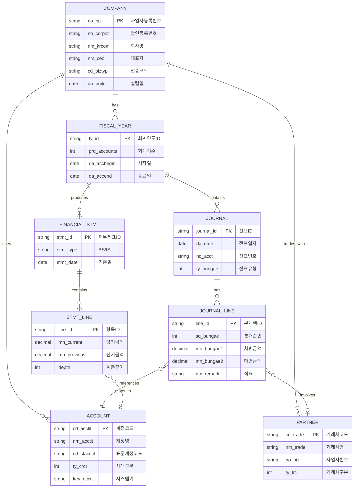
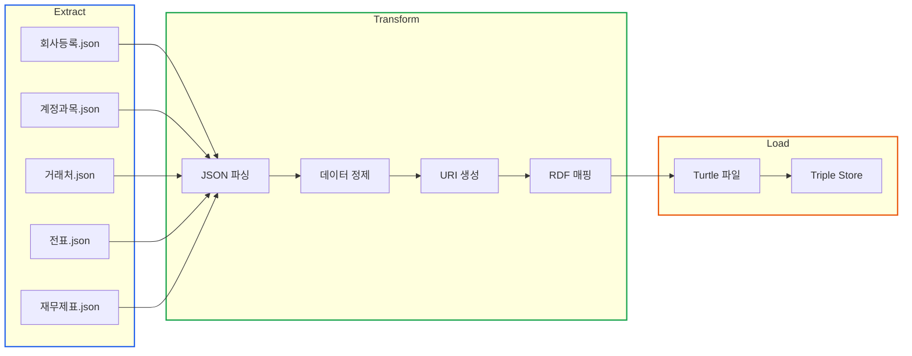

# 회계 ERP 데이터를 RDF로 변환하기

> **작성일**: 2026년 1월 9일
> **카테고리**: ETL, RDF, Data Pipeline
> **키워드**: 회계 ERP, JSON to RDF, ETL, 데이터 변환, 지식그래프
> **시리즈**: [온톨로지 + AI 에이전트: 세무 컨설팅 시스템 아키텍처](https://blog.imprun.dev/120) (14부/총 20부)
> **대상 독자**: 온톨로지에 입문하는 시니어 개발자

## 요약

Part D의 시작이다. Part B에서 온톨로지 스키마(TBox)를, Part C에서 AI 에이전트 프레임워크를 구축했다. 이제 **실제 회계 ERP 데이터**를 지식그래프로 변환하는 ETL(Extract-Transform-Load) 파이프라인을 구축한다. 이 글에서는 계정과목, 거래처, 전표, 재무제표 등 다양한 JSON 데이터를 RDF 트리플로 변환하는 설계 원리와 핵심 매핑 전략을 다룬다.

---

## 핵심 질문: JSON에서 RDF로 어떻게 변환하는가?

ERP 시스템에서 추출한 JSON 데이터를 RDF 트리플로 변환하는 과정은 단순한 포맷 변환이 아니다. **관계형 사고방식에서 그래프 사고방식으로의 전환**이 필요하다.

| 관계형 (JSON/RDB) | 그래프 (RDF) |
|------------------|-------------|
| 테이블, 컬럼 | 클래스, 프로퍼티 |
| 레코드 (행) | 리소스 (URI) |
| 외래키 | 객체 프로퍼티 (관계) |
| 값 | 리터럴 또는 URI |

핵심은 **URI 생성 전략**과 **필드-프로퍼티 매핑 규칙**이다.

---

## 실제 ERP 데이터 구조 분석

### 1. 회사 정보 (05.기초정보관리-회사등록.json)

회사 등록 데이터는 사업자등록번호, 법인등록번호, 업종코드 등 법인의 기본 정보를 포함한다.

```json
{
    "no_biz": "5808702034",
    "no_corpor": "1101118012611",
    "nm_krcom": "(주)에스제이엘이노베이션",
    "nm_ceo": "송충식",
    "cd_biztyp": "452106",
    "nm_bizcond": "건 설 업",
    "nm_item": "크린룸,실내건축공사업",
    "da_build": "20210902",
    "da_accbegin": "20240101",
    "da_accend": "20241231",
    "prd_accounts": 4,
    "add_com1": "서울특별시 강북구 삼양로124길 11",
    "zip_com": "01038",
    "tel_com1": "02",
    "tel_com2": "6949",
    "tel_com3": "6145"
}
```

**주요 필드 의미**:
- `no_biz`: 사업자등록번호 (10자리, 하이픈 없음)
- `no_corpor`: 법인등록번호 (13자리)
- `cd_biztyp`: 업종코드 (6자리)
- `prd_accounts`: 회계기수 (4 = 제4기)
- `da_accbegin/da_accend`: 회계연도 시작/종료일

### 2. 계정과목 (04.기초정보관리-계정과목및적요등록.json)

계정과목은 회계 데이터의 분류 체계다. 현금, 매출, 급여 등 모든 거래는 계정과목으로 분류된다.

```json
{
    "cd_acctit": "10100",
    "nm_acctit": "현금",
    "nm_ename": "Cash",
    "cd_stacctit": "100030",
    "nm_stacctit": "현금및현금성자산",
    "ty_crdr": 1,
    "ty_gj": 3,
    "nm_gj": "일 반",
    "key_acctit": "200701011101010100"
}
```

**주요 필드 의미**:
- `cd_acctit`: 계정코드 (5자리)
- `nm_acctit`: 계정명 (한글)
- `cd_stacctit`: 표준계정코드 (재무제표 분류)
- `ty_crdr`: 차대구분 (1=차변, 2=대변)
- `key_acctit`: 시스템 고유키

### 3. 거래처 (01.기초정보관리-거래처등록_일반.json)

거래처는 매출처, 매입처, 금융기관 등 거래 상대방 정보다.

```json
{
    "cd_trade": "0000000102",
    "nm_trade": "농협은행",
    "no_biz": "1048639742",
    "nm_krname": "권준학",
    "ty_tr1": 1,
    "ty_tr2": 2
}
```

**주요 필드 의미**:
- `cd_trade`: 거래처코드 (10자리)
- `ty_tr1`: 거래처구분1 (1=일반)
- `ty_tr2`: 거래처구분2 (0=일반, 2=금융기관)

### 4. 전표/분개장 (12.전표관리-일반전표, 14.주요장부-분개장)

전표는 회계 거래의 기본 단위다. 복식부기 원칙에 따라 차변과 대변이 일치해야 한다.

```json
{
    "da_date": "20241201",
    "no_acct": "00001",
    "sq_bungae": 1,
    "cd_acctit": "25300",
    "nm_acctit": "미지급금",
    "ty_gubn": 4,
    "nm_gubn": "대변",
    "mn_bungae1": 0.0,
    "mn_bungae2": 5140.0,
    "nm_remark": "2945 통행료",
    "cd_trade": "099609",
    "nm_trade": "농협카드/6056"
}
```

**주요 필드 의미**:
- `da_date`: 전표일자 (YYYYMMDD)
- `no_acct`: 전표번호
- `sq_bungae`: 분개순번 (같은 전표 내 행 번호)
- `ty_gubn`: 차대구분 (3=차변, 4=대변)
- `mn_bungae1`: 차변금액
- `mn_bungae2`: 대변금액

### 5. 재무상태표 (23.결산재무제표-재무상태표.json)

재무상태표는 특정 시점의 자산, 부채, 자본 현황을 보여준다.

```json
{
    "cd_acctit": "10300",
    "nm_acctit": "보통예금",
    "mn_bungae": "580,355,783",
    "mn_bungae_right": 580355783.0,
    "jun_mn_bungae": "274,408,769",
    "diff_rate": 111.49,
    "depth": 4,
    "cd_group": "111",
    "nm_acctitpr": "보통예금",
    "cd_gcode": "10300"
}
```

**주요 필드 의미**:
- `mn_bungae_right`: 당기 금액 (숫자형)
- `jun_mn_bungae`: 전기 금액 (문자열, 콤마 포함)
- `diff_rate`: 전년 대비 증감률
- `depth`: 계층 깊이 (1=대분류, 4=세부계정)
- `cd_group`: 재무제표 분류코드

### 6. 손익계산서 (21.결산재무제표-손익계산서.json)

손익계산서는 일정 기간의 수익과 비용을 보여준다.

```json
{
    "cd_acctit": "40700",
    "nm_acctit": "공사수입금",
    "mn_total1": 5090216000.0,
    "mn_btotal2": 7914990000.0,
    "variation_percent": "-35.68",
    "ord_lcate": "010",
    "cd_gr": "61000"
}
```

---

## ERD: ERP 데이터 엔티티 관계

실제 ERP 데이터의 관계를 ERD로 표현하면 다음과 같다.



---

## JSON에서 RDF로: 매핑 전략

### URI 생성 규칙

URI는 RDF 세계의 "주민등록번호"다. 고유하고, 예측 가능하며, 의미 있어야 한다.

| 엔티티 | URI 패턴 | 예시 |
|-------|---------|------|
| 회사 | `data:company/{사업자번호}` | `data:company/5808702034` |
| 회계연도 | `data:fy/{사업자번호}/{기수}` | `data:fy/5808702034/4` |
| 계정과목 | `data:account/{계정코드}` | `data:account/10100` |
| 거래처 | `data:partner/{거래처코드}` | `data:partner/0000000102` |
| 전표 | `data:journal/{사업자번호}/{일자}/{전표번호}` | `data:journal/5808702034/20241201/00001` |
| 재무상태표 | `data:bs/{사업자번호}/{기수}` | `data:bs/5808702034/4` |

### 필드-프로퍼티 매핑

**회사 정보 매핑**

| ERP 필드 | RDF 프로퍼티 | 데이터타입 |
|---------|------------|-----------|
| `no_biz` | `tax:businessNumber` | `xsd:string` |
| `no_corpor` | `tax:corporateNumber` | `xsd:string` |
| `nm_krcom` | `tax:companyName` | `xsd:string` (lang:ko) |
| `nm_ceo` | `tax:representativeName` | `xsd:string` |
| `cd_biztyp` | `tax:industryCode` | `xsd:string` |
| `da_build` | `tax:foundedDate` | `xsd:date` |
| `prd_accounts` | `tax:fiscalPeriodNumber` | `xsd:integer` |

**계정과목 매핑**

| ERP 필드 | RDF 프로퍼티 | 데이터타입 |
|---------|------------|-----------|
| `cd_acctit` | `acc:accountCode` | `xsd:string` |
| `nm_acctit` | `acc:accountName` | `xsd:string` (lang:ko) |
| `nm_ename` | `acc:accountNameEn` | `xsd:string` (lang:en) |
| `cd_stacctit` | `acc:standardCode` | `xsd:string` |
| `ty_crdr` | `acc:debitCreditType` | `xsd:integer` |

**전표/분개 매핑**

| ERP 필드 | RDF 프로퍼티 | 데이터타입 |
|---------|------------|-----------|
| `da_date` | `txn:transactionDate` | `xsd:date` |
| `no_acct` | `txn:voucherNumber` | `xsd:string` |
| `mn_bungae1` | `txn:debitAmount` | `xsd:decimal` |
| `mn_bungae2` | `txn:creditAmount` | `xsd:decimal` |
| `nm_remark` | `txn:description` | `xsd:string` |

**재무제표 매핑**

| ERP 필드 | RDF 프로퍼티 | 데이터타입 |
|---------|------------|-----------|
| `mn_bungae_right` | `fin:currentAmount` | `xsd:decimal` |
| `jun_mn_bungae` | `fin:previousAmount` | `xsd:decimal` |
| `diff_rate` | `fin:changeRate` | `xsd:decimal` |
| `depth` | `fin:hierarchyLevel` | `xsd:integer` |

---

## ETL 파이프라인 아키텍처

### 전체 흐름



### 데이터 정제 규칙

ERP 데이터는 그대로 사용할 수 없다. 정제 과정이 필요하다.

**1. 날짜 변환**
```
ERP: "20241201" (YYYYMMDD 문자열)
RDF: "2024-12-01"^^xsd:date
```

**2. 금액 정규화**
```
ERP: "580,355,783" (콤마 포함 문자열)
RDF: 580355783^^xsd:decimal
```

**3. 사업자번호 포맷팅**
```
ERP: "5808702034" (10자리 숫자)
RDF: "580-87-02034"^^xsd:string (표준 형식)
```

**4. 빈 값 처리**
```
ERP: "" 또는 null
RDF: 해당 트리플 생략 (optional property)
```

---

## 핵심 변환 로직

### 회사 정보 변환

```python
def transform_company(data: dict) -> Graph:
    """회사 정보를 RDF로 변환"""
    g = Graph()

    biz_no = data.get('no_biz')
    if not biz_no:
        return g

    company_uri = DATA[f"company/{biz_no}"]

    # 타입 선언
    g.add((company_uri, RDF.type, TAX.Corporation))

    # 기본 정보
    g.add((company_uri, TAX.businessNumber,
           Literal(format_biz_number(biz_no))))

    if data.get('no_corpor'):
        g.add((company_uri, TAX.corporateNumber,
               Literal(data['no_corpor'])))

    if data.get('nm_krcom'):
        g.add((company_uri, TAX.companyName,
               Literal(data['nm_krcom'], lang='ko')))

    if data.get('nm_ceo'):
        g.add((company_uri, TAX.representativeName,
               Literal(data['nm_ceo'])))

    # 업종 정보
    if data.get('cd_biztyp'):
        g.add((company_uri, TAX.industryCode,
               Literal(data['cd_biztyp'])))

    # 설립일
    if data.get('da_build'):
        g.add((company_uri, TAX.foundedDate,
               Literal(parse_date(data['da_build']), datatype=XSD.date)))

    return g
```

### 전표 변환

전표는 복식부기의 핵심이다. 차변 합계와 대변 합계가 반드시 일치해야 한다.

```python
def transform_journal(data: dict, company_biz_no: str) -> Graph:
    """전표 데이터를 RDF로 변환"""
    g = Graph()

    # 전표 URI 생성
    date_str = data.get('da_date')
    voucher_no = data.get('no_acct')
    journal_uri = DATA[f"journal/{company_biz_no}/{date_str}/{voucher_no}"]

    g.add((journal_uri, RDF.type, TXN.JournalEntry))
    g.add((journal_uri, TXN.transactionDate,
           Literal(parse_date(date_str), datatype=XSD.date)))

    # 회사 연결
    company_uri = DATA[f"company/{company_biz_no}"]
    g.add((journal_uri, TXN.belongsTo, company_uri))

    # 분개 행 처리
    line_no = data.get('sq_bungae', 1)
    line_uri = DATA[f"journal/{company_biz_no}/{date_str}/{voucher_no}/line/{line_no}"]

    g.add((line_uri, RDF.type, TXN.JournalLine))
    g.add((journal_uri, TXN.hasLine, line_uri))

    # 계정과목 연결
    account_code = data.get('cd_acctit')
    if account_code:
        account_uri = DATA[f"account/{account_code}"]
        g.add((line_uri, TXN.usesAccount, account_uri))

    # 금액
    debit = data.get('mn_bungae1', 0) or 0
    credit = data.get('mn_bungae2', 0) or 0

    if debit > 0:
        g.add((line_uri, TXN.debitAmount,
               Literal(debit, datatype=XSD.decimal)))
    if credit > 0:
        g.add((line_uri, TXN.creditAmount,
               Literal(credit, datatype=XSD.decimal)))

    # 적요
    if data.get('nm_remark'):
        g.add((line_uri, TXN.description,
               Literal(data['nm_remark'])))

    # 거래처 연결
    trade_code = data.get('cd_trade')
    if trade_code:
        partner_uri = DATA[f"partner/{trade_code}"]
        g.add((line_uri, TXN.involvesPartner, partner_uri))

    return g
```

### 재무상태표 변환

재무상태표는 계층 구조를 가진다. depth 필드를 활용해 상위-하위 관계를 표현한다.

```python
def transform_balance_sheet(items: list, company_biz_no: str, fiscal_period: int) -> Graph:
    """재무상태표를 RDF로 변환"""
    g = Graph()

    bs_uri = DATA[f"bs/{company_biz_no}/{fiscal_period}"]
    company_uri = DATA[f"company/{company_biz_no}"]

    g.add((bs_uri, RDF.type, FIN.BalanceSheet))
    g.add((bs_uri, FIN.belongsTo, company_uri))
    g.add((bs_uri, FIN.fiscalPeriod, Literal(fiscal_period, datatype=XSD.integer)))

    for item in items:
        account_code = item.get('cd_acctit')
        if not account_code:
            continue

        line_uri = DATA[f"bs/{company_biz_no}/{fiscal_period}/line/{account_code}"]

        g.add((line_uri, RDF.type, FIN.BalanceSheetLine))
        g.add((bs_uri, FIN.hasLine, line_uri))

        # 계정 연결
        account_uri = DATA[f"account/{account_code}"]
        g.add((line_uri, FIN.forAccount, account_uri))

        # 금액 (당기/전기)
        current_amount = item.get('mn_bungae_right', 0) or 0
        if current_amount != 0:
            g.add((line_uri, FIN.currentAmount,
                   Literal(current_amount, datatype=XSD.decimal)))

        prev_str = item.get('jun_mn_bungae', '')
        if prev_str:
            prev_amount = parse_amount(prev_str)
            g.add((line_uri, FIN.previousAmount,
                   Literal(prev_amount, datatype=XSD.decimal)))

        # 증감률
        diff_rate = item.get('diff_rate')
        if diff_rate is not None:
            g.add((line_uri, FIN.changeRate,
                   Literal(diff_rate, datatype=XSD.decimal)))

        # 계층 수준
        depth = item.get('depth', 0)
        g.add((line_uri, FIN.hierarchyLevel,
               Literal(depth, datatype=XSD.integer)))

    return g
```

---

## 생성된 RDF 예시

위 변환 로직을 실행하면 다음과 같은 RDF(Turtle)가 생성된다.

```turtle
@prefix tax: <http://example.org/tax/> .
@prefix fin: <http://example.org/financial/> .
@prefix acc: <http://example.org/account/> .
@prefix txn: <http://example.org/transaction/> .
@prefix data: <http://example.org/data/> .
@prefix xsd: <http://www.w3.org/2001/XMLSchema#> .

# 회사
data:company/5808702034 a tax:Corporation ;
    tax:businessNumber "580-87-02034" ;
    tax:corporateNumber "1101118012611" ;
    tax:companyName "(주)에스제이엘이노베이션"@ko ;
    tax:representativeName "송충식" ;
    tax:industryCode "452106" ;
    tax:foundedDate "2021-09-02"^^xsd:date .

# 계정과목
data:account/10100 a acc:Account ;
    acc:accountCode "10100" ;
    acc:accountName "현금"@ko ;
    acc:accountNameEn "Cash"@en ;
    acc:standardCode "100030" ;
    acc:debitCreditType 1 .

data:account/10300 a acc:Account ;
    acc:accountCode "10300" ;
    acc:accountName "보통예금"@ko ;
    acc:accountNameEn "Bank deposits"@en ;
    acc:standardCode "100030" ;
    acc:debitCreditType 1 .

# 전표
data:journal/5808702034/20241201/00001 a txn:JournalEntry ;
    txn:transactionDate "2024-12-01"^^xsd:date ;
    txn:belongsTo data:company/5808702034 ;
    txn:hasLine data:journal/5808702034/20241201/00001/line/1 ,
                data:journal/5808702034/20241201/00001/line/2 .

data:journal/5808702034/20241201/00001/line/1 a txn:JournalLine ;
    txn:usesAccount data:account/25300 ;
    txn:creditAmount 5140^^xsd:decimal ;
    txn:description "2945 통행료" ;
    txn:involvesPartner data:partner/099609 .

data:journal/5808702034/20241201/00001/line/2 a txn:JournalLine ;
    txn:usesAccount data:account/82200 ;
    txn:debitAmount 5140^^xsd:decimal ;
    txn:description "2945 통행료 [00000102] 165호2945 제네시스/GV70 (7.기타)" .

# 재무상태표
data:bs/5808702034/4 a fin:BalanceSheet ;
    fin:belongsTo data:company/5808702034 ;
    fin:fiscalPeriod 4 ;
    fin:hasLine data:bs/5808702034/4/line/10100 ,
                data:bs/5808702034/4/line/10300 .

data:bs/5808702034/4/line/10300 a fin:BalanceSheetLine ;
    fin:forAccount data:account/10300 ;
    fin:currentAmount 580355783^^xsd:decimal ;
    fin:previousAmount 274408769^^xsd:decimal ;
    fin:changeRate 111.49^^xsd:decimal ;
    fin:hierarchyLevel 4 .
```

---

## 데이터 품질 검증

ETL 파이프라인에서 데이터 품질은 생명이다. 다음 검증을 수행해야 한다.

### 1. 필수 필드 검증

```python
REQUIRED_FIELDS = {
    'company': ['no_biz', 'nm_krcom'],
    'account': ['cd_acctit', 'nm_acctit'],
    'journal': ['da_date', 'cd_acctit'],
}

def validate_required(data: dict, entity_type: str) -> list:
    """필수 필드 검증"""
    errors = []
    for field in REQUIRED_FIELDS.get(entity_type, []):
        if not data.get(field):
            errors.append(f"Missing required field: {field}")
    return errors
```

### 2. 복식부기 원칙 검증

전표의 차변 합계와 대변 합계가 일치해야 한다.

```python
def validate_journal_balance(journal_lines: list) -> bool:
    """차대 균형 검증"""
    total_debit = sum(line.get('mn_bungae1', 0) or 0 for line in journal_lines)
    total_credit = sum(line.get('mn_bungae2', 0) or 0 for line in journal_lines)
    return abs(total_debit - total_credit) < 0.01  # 1원 미만 오차 허용
```

### 3. 재무상태표 등식 검증

자산 = 부채 + 자본 등식이 성립해야 한다.

```python
def validate_balance_sheet_equation(bs_data: dict) -> tuple:
    """대차평균 검증"""
    assets = bs_data.get('total_assets', 0)
    liabilities = bs_data.get('total_liabilities', 0)
    equity = bs_data.get('total_equity', 0)

    diff = abs(assets - liabilities - equity)
    return diff < 1, diff  # 1원 이내 오차 허용
```

---

## 핵심 정리

### ETL 파이프라인 설계 원칙

| 원칙 | 설명 |
|-----|------|
| **URI 일관성** | 동일 엔티티는 항상 동일한 URI로 식별 |
| **멱등성** | 같은 입력에 대해 항상 같은 결과 |
| **증분 처리** | 변경된 데이터만 처리 |
| **검증 우선** | 변환 전 데이터 품질 검증 |

### JSON-RDF 매핑 핵심

| 개념 | JSON | RDF |
|-----|------|-----|
| 식별자 | `no_biz`, `cd_acctit` | URI |
| 속성 | 필드값 | Literal |
| 관계 | 외래키 | Object Property |
| 타입 | 암묵적 | `rdf:type` |

---

## 다음 단계 미리보기

**15부: 세무 분석 규칙 SHACL로 정의하기**

ETL로 생성한 지식그래프에 **비즈니스 규칙**을 적용한다:
- 부채비율 경고 임계값 (업종별 차등)
- 인건비 비중 분석 규칙
- 연도별 변동 이상 탐지

---

## 참고 자료

### ETL 패턴
- [ETL Design Patterns](https://en.wikipedia.org/wiki/Extract,_transform,_load)
- [Data Pipeline Best Practices](https://www.oreilly.com/library/view/fundamentals-of-data/9781098108298/)

### RDFLib
- [RDFLib Documentation](https://rdflib.readthedocs.io/)
- [RDFLib Graph Creation](https://rdflib.readthedocs.io/en/stable/intro_to_creating_rdf.html)

### 관련 시리즈
- [이전: 커스텀 도구(Tool) 만들기](https://blog.imprun.dev/133)
- [다음: 세무 분석 규칙 SHACL로 정의하기](https://blog.imprun.dev/135)
- [시리즈 목차](https://blog.imprun.dev/120)
