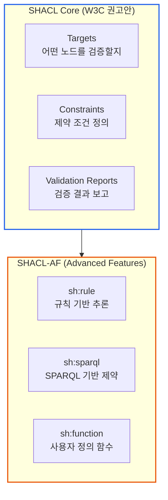
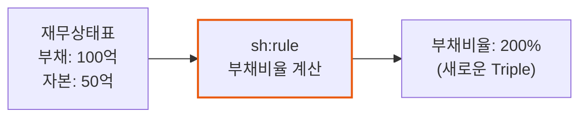

# 세무 분석 규칙 SHACL로 정의하기

> **작성일**: 2026년 1월 9일
> **카테고리**: SHACL, Tax Analysis, Business Rules
> **키워드**: SHACL, 세무 분석, 비즈니스 규칙, 재무비율, 이상 탐지
> **시리즈**: [온톨로지 + AI 에이전트: 세무 컨설팅 시스템 아키텍처](https://blog.imprun.dev/120) (15부/총 20부)
> **대상 독자**: 온톨로지에 입문하는 시니어 개발자

## 요약

14부에서 회계 ERP 데이터를 RDF로 변환하는 ETL 파이프라인을 구축했다. 이제 이 데이터에 **세무 분석 규칙**을 적용해야 한다. 8부에서 SHACL 기초를 다뤘다면, 이번에는 **실무에서 사용하는 재무 분석 규칙**을 SHACL로 정의한다. 부채비율, 유동비율, 인건비 비중 등 핵심 재무지표의 임계값을 설정하고, 연도별 변동 이상 탐지 규칙을 구현한다.

---

## 핵심 질문

> **부채비율 경고, 이상 탐지를 어떻게 규칙화하는가?**

세무사가 재무제표를 분석할 때 머릿속에서 수행하는 판단 로직을 생각해보자. "부채비율이 200%를 넘으면 위험 신호", "매출이 전년 대비 30% 이상 급감하면 원인 파악 필요"와 같은 규칙들이다.

SHACL은 이러한 **도메인 전문가의 암묵지를 형식화**한다. "데이터가 올바른가?"에 그치지 않고 "이 회사의 재무 상태가 건전한가?"까지 기계가 판단할 수 있게 된다.

```
세무사의 머릿속 규칙    →    SHACL 규칙    →    자동화된 분석 리포트
"부채비율 200% 초과"         sh:sparql           "경고: 재무구조 개선 필요"
```

---

## 이전 내용 복습

- **8부**: SHACL 기본 문법 (NodeShape, PropertyShape)
- **14부**: 회계 ERP 데이터를 RDF로 변환 (ETL 파이프라인)

8부에서는 필수 필드 검증, 데이터 타입 검증 같은 **기본 검증 규칙**을 다뤘다. 이제 **도메인 전문가(세무사)의 분석 관점**을 SHACL로 표현한다.

---

## SHACL Core vs SHACL Advanced Features

SHACL은 두 가지 스펙으로 구성된다.



| 구분 | SHACL Core | SHACL-AF |
|------|-----------|----------|
| 역할 | 데이터 검증 | 규칙 기반 추론 |
| 주요 기능 | NodeShape, PropertyShape | sh:rule, sh:sparql |
| 출력 | Validation Report | 새로운 Triple 생성 |
| 사용 예 | "필수 필드 검증" | "부채비율 자동 계산" |

**핵심**: SHACL Core는 "데이터가 규칙을 위반하는가?"를 판단하고, SHACL-AF의 `sh:rule`은 "새로운 사실을 추론"한다.

---

## 기본 검증 vs 분석 규칙

| 구분 | 8부 (기본 검증) | 15부 (분석 규칙) |
|------|----------------|-----------------|
| 목적 | 데이터 무결성 | 비즈니스 인사이트 |
| 예시 | "매출액은 필수" | "매출액이 전년 대비 20% 이상 감소하면 경고" |
| 심각도 | Violation | Warning, Info |
| 대상 | 단일 필드 | 필드 간 관계, 연도 간 비교 |

---

## 재무비율 분석 규칙 (sh:sparql)

### 규칙 1: 부채비율 (Debt Ratio)

부채비율은 기업의 재무 안정성을 나타내는 핵심 지표다. 일반적으로 200%를 초과하면 주의가 필요하다.

**계산식**: 부채비율 = (부채총계 / 자본총계) x 100

```turtle
@prefix sh: <http://www.w3.org/ns/shacl#> .
@prefix tax: <http://example.org/tax/> .
@prefix fin: <http://example.org/financial/> .
@prefix acc: <http://example.org/account/> .
@prefix rdfs: <http://www.w3.org/2000/01/rdf-schema#> .

# ===== 부채비율 경고 (200% 초과) =====
fin:DebtRatioHighShape
    a sh:NodeShape ;
    sh:targetClass fin:BalanceSheet ;
    sh:severity sh:Warning ;
    rdfs:label "부채비율 과다 경고"@ko ;
    rdfs:comment "부채비율이 200%를 초과하면 재무 안정성 검토 필요"@ko ;
    sh:sparql [
        sh:message "부채비율 {?ratio}%: 재무 구조 개선 검토 필요"@ko ;
        sh:select """
            PREFIX acc: <http://example.org/account/>

            SELECT $this (ROUND(?liabilities * 10000.0 / ?equity) / 100 AS ?ratio)
            WHERE {
                $this acc:totalLiabilities ?liabilities ;
                      acc:totalEquity ?equity .
                FILTER(?equity > 0)
                FILTER(?liabilities * 100.0 / ?equity > 200)
            }
        """ ;
    ] .

# ===== 부채비율 위험 (400% 초과) =====
fin:DebtRatioCriticalShape
    a sh:NodeShape ;
    sh:targetClass fin:BalanceSheet ;
    sh:severity sh:Violation ;
    rdfs:label "부채비율 위험"@ko ;
    sh:sparql [
        sh:message "부채비율 {?ratio}%: 자본잠식 위험, 긴급 조치 필요"@ko ;
        sh:select """
            PREFIX acc: <http://example.org/account/>

            SELECT $this (ROUND(?liabilities * 10000.0 / ?equity) / 100 AS ?ratio)
            WHERE {
                $this acc:totalLiabilities ?liabilities ;
                      acc:totalEquity ?equity .
                FILTER(?equity > 0)
                FILTER(?liabilities * 100.0 / ?equity > 400)
            }
        """ ;
    ] .
```

### 규칙 2: 유동비율 (Current Ratio)

유동비율은 단기 지급 능력을 측정한다. 100% 미만이면 유동부채를 유동자산으로 갚을 수 없다는 의미다.

**계산식**: 유동비율 = (유동자산 / 유동부채) x 100

```turtle
# ===== 유동비율 경고 (100% 미만) =====
fin:CurrentRatioLowShape
    a sh:NodeShape ;
    sh:targetClass fin:BalanceSheet ;
    sh:severity sh:Warning ;
    rdfs:label "유동비율 부족 경고"@ko ;
    sh:sparql [
        sh:message "유동비율 {?ratio}%: 단기 지급 능력 주의"@ko ;
        sh:select """
            PREFIX acc: <http://example.org/account/>

            SELECT $this (ROUND(?curAssets * 10000.0 / ?curLiab) / 100 AS ?ratio)
            WHERE {
                $this acc:currentAssets ?curAssets ;
                      acc:currentLiabilities ?curLiab .
                FILTER(?curLiab > 0)
                FILTER(?curAssets * 100.0 / ?curLiab < 100)
            }
        """ ;
    ] .

# ===== 당좌비율 경고 (70% 미만) =====
# 당좌비율 = (유동자산 - 재고자산) / 유동부채
fin:QuickRatioLowShape
    a sh:NodeShape ;
    sh:targetClass fin:BalanceSheet ;
    sh:severity sh:Warning ;
    rdfs:label "당좌비율 부족"@ko ;
    sh:sparql [
        sh:message "당좌비율 {?ratio}%: 즉시 현금화 가능 자산 부족"@ko ;
        sh:select """
            PREFIX acc: <http://example.org/account/>

            SELECT $this (ROUND((?curAssets - COALESCE(?inventory, 0)) * 10000.0 / ?curLiab) / 100 AS ?ratio)
            WHERE {
                $this acc:currentAssets ?curAssets ;
                      acc:currentLiabilities ?curLiab .
                OPTIONAL { $this acc:inventory ?inventory }
                FILTER(?curLiab > 0)
                FILTER((?curAssets - COALESCE(?inventory, 0)) * 100.0 / ?curLiab < 70)
            }
        """ ;
    ] .
```

### 규칙 3: 영업이익률 (Operating Margin)

영업이익률이 낮거나 음수면 본업의 수익성에 문제가 있다.

```turtle
# ===== 영업손실 경고 =====
fin:OperatingLossShape
    a sh:NodeShape ;
    sh:targetClass fin:IncomeStatement ;
    sh:severity sh:Warning ;
    rdfs:label "영업손실 발생"@ko ;
    sh:sparql [
        sh:message "영업손실 {?loss}원: 본업 수익성 개선 시급"@ko ;
        sh:select """
            PREFIX acc: <http://example.org/account/>

            SELECT $this (ABS(?opIncome) AS ?loss)
            WHERE {
                $this acc:operatingIncome ?opIncome .
                FILTER(?opIncome < 0)
            }
        """ ;
    ] .

# ===== 영업이익률 저조 (5% 미만) =====
fin:LowOperatingMarginShape
    a sh:NodeShape ;
    sh:targetClass fin:IncomeStatement ;
    sh:severity sh:Info ;
    rdfs:label "영업이익률 저조"@ko ;
    sh:sparql [
        sh:message "영업이익률 {?margin}%: 비용 구조 점검 권장"@ko ;
        sh:select """
            PREFIX acc: <http://example.org/account/>

            SELECT $this (ROUND(?opIncome * 10000.0 / ?revenue) / 100 AS ?margin)
            WHERE {
                $this acc:revenue ?revenue ;
                      acc:operatingIncome ?opIncome .
                FILTER(?revenue > 0)
                FILTER(?opIncome >= 0)
                FILTER(?opIncome * 100.0 / ?revenue < 5)
            }
        """ ;
    ] .
```

---

## sh:rule을 통한 파생 속성 추론

SHACL-AF의 `sh:rule`은 검증이 아닌 **추론**을 수행한다. 기존 데이터에서 새로운 Triple을 생성한다.



### 재무비율 자동 계산 Rule

```turtle
# ===== SHACL Rules: 재무비율 자동 계산 =====
fin:FinancialRatioRules a sh:NodeShape ;
    sh:targetClass fin:BalanceSheet ;

    # 부채비율 계산 Rule
    sh:rule [
        a sh:SPARQLRule ;
        sh:construct """
            PREFIX fin: <http://example.org/financial/>
            PREFIX acc: <http://example.org/account/>

            CONSTRUCT {
                $this fin:debtToEquityRatio ?ratio .
            }
            WHERE {
                $this acc:totalLiabilities ?liabilities ;
                      acc:totalEquity ?equity .
                FILTER(?equity != 0)
                BIND(ROUND(?liabilities * 10000.0 / ?equity) / 100 AS ?ratio)
            }
        """ ;
    ] ;

    # 유동비율 계산 Rule
    sh:rule [
        a sh:SPARQLRule ;
        sh:construct """
            PREFIX fin: <http://example.org/financial/>
            PREFIX acc: <http://example.org/account/>

            CONSTRUCT {
                $this fin:currentRatio ?ratio .
            }
            WHERE {
                $this acc:currentAssets ?ca ;
                      acc:currentLiabilities ?cl .
                FILTER(?cl != 0)
                BIND(ROUND(?ca * 10000.0 / ?cl) / 100 AS ?ratio)
            }
        """ ;
    ] ;

    # 자기자본비율 계산 Rule
    sh:rule [
        a sh:SPARQLRule ;
        sh:construct """
            PREFIX fin: <http://example.org/financial/>
            PREFIX acc: <http://example.org/account/>

            CONSTRUCT {
                $this fin:equityRatio ?ratio .
            }
            WHERE {
                $this acc:totalEquity ?equity ;
                      acc:totalAssets ?assets .
                FILTER(?assets != 0)
                BIND(ROUND(?equity * 10000.0 / ?assets) / 100 AS ?ratio)
            }
        """ ;
    ] .
```

### 위험 수준 자동 분류 Rule

기업의 재무 상태를 종합적으로 평가하여 위험 수준을 자동 분류한다.

```turtle
# ===== SHACL Rules: 위험 수준 분류 =====
fin:RiskClassificationRules a sh:NodeShape ;
    sh:targetClass tax:Company ;

    # 고위험 분류 Rule
    sh:rule [
        a sh:SPARQLRule ;
        sh:order 1 ;  # 먼저 실행
        sh:construct """
            PREFIX tax: <http://example.org/tax/>
            PREFIX fin: <http://example.org/financial/>
            PREFIX acc: <http://example.org/account/>

            CONSTRUCT {
                $this tax:riskLevel tax:HighRisk ;
                      tax:riskFactors ?factors .
            }
            WHERE {
                $this a tax:Company ;
                      fin:hasBalanceSheet ?bs ;
                      fin:hasIncomeStatement ?is .

                # 고위험 조건 체크
                {
                    ?bs acc:totalLiabilities ?liab ;
                        acc:totalEquity ?eq .
                    FILTER(?eq > 0)
                    FILTER(?liab / ?eq > 2.0)  # 부채비율 200% 초과
                    BIND("부채비율과다" AS ?factors)
                } UNION {
                    ?is acc:netIncome ?ni .
                    FILTER(?ni < 0)  # 순손실
                    BIND("순손실발생" AS ?factors)
                } UNION {
                    ?bs acc:totalEquity ?eq2 .
                    FILTER(?eq2 < 0)  # 자본잠식
                    BIND("자본잠식" AS ?factors)
                }
            }
        """ ;
    ] ;

    # 저위험 분류 Rule (고위험이 아닌 경우)
    sh:rule [
        a sh:SPARQLRule ;
        sh:order 2 ;  # 나중에 실행
        sh:construct """
            PREFIX tax: <http://example.org/tax/>

            CONSTRUCT {
                $this tax:riskLevel tax:LowRisk .
            }
            WHERE {
                $this a tax:Company .
                FILTER NOT EXISTS { $this tax:riskLevel ?anyLevel }
            }
        """ ;
    ] .
```

---

## 연도별 변동 이상 탐지

### 매출 급감 탐지

전년 대비 20% 이상 매출이 감소하면 원인 파악이 필요하다.

```turtle
# ===== 매출 급감 (전년 대비 20% 이상 감소) =====
fin:RevenueSharpDecreaseShape
    a sh:NodeShape ;
    sh:targetClass fin:IncomeStatement ;
    sh:severity sh:Warning ;
    rdfs:label "매출 급감 경고"@ko ;
    sh:sparql [
        sh:message "매출 {?changeRate}% 감소 (전년 {?prevRevenue}원 → 당기 {?curRevenue}원)"@ko ;
        sh:select """
            PREFIX fin: <http://example.org/financial/>
            PREFIX acc: <http://example.org/account/>

            SELECT $this ?curRevenue ?prevRevenue
                   (ROUND((?prevRevenue - ?curRevenue) * 10000.0 / ?prevRevenue) / 100 AS ?changeRate)
            WHERE {
                # 당기 손익계산서
                $this a fin:IncomeStatement ;
                      fin:belongsTo ?company ;
                      fin:fiscalYear ?curYear ;
                      acc:revenue ?curRevenue .

                # 전기 손익계산서
                ?prevIS a fin:IncomeStatement ;
                        fin:belongsTo ?company ;
                        fin:fiscalYear ?prevYear ;
                        acc:revenue ?prevRevenue .

                FILTER(?prevYear = ?curYear - 1)
                FILTER(?prevRevenue > 0)
                FILTER((?prevRevenue - ?curRevenue) * 100.0 / ?prevRevenue > 20)
            }
        """ ;
    ] .

# ===== 매출 급증 (세무 조사 리스크) =====
fin:RevenueSharpIncreaseShape
    a sh:NodeShape ;
    sh:targetClass fin:IncomeStatement ;
    sh:severity sh:Info ;
    rdfs:label "매출 급증 알림"@ko ;
    sh:sparql [
        sh:message "매출 {?changeRate}% 증가: 세무 조사 대비 증빙 확인 권장"@ko ;
        sh:select """
            PREFIX fin: <http://example.org/financial/>
            PREFIX acc: <http://example.org/account/>

            SELECT $this
                   (ROUND((?curRevenue - ?prevRevenue) * 10000.0 / ?prevRevenue) / 100 AS ?changeRate)
            WHERE {
                $this a fin:IncomeStatement ;
                      fin:belongsTo ?company ;
                      fin:fiscalYear ?curYear ;
                      acc:revenue ?curRevenue .

                ?prevIS a fin:IncomeStatement ;
                        fin:belongsTo ?company ;
                        fin:fiscalYear ?prevYear ;
                        acc:revenue ?prevRevenue .

                FILTER(?prevYear = ?curYear - 1)
                FILTER(?prevRevenue > 0)
                FILTER((?curRevenue - ?prevRevenue) * 100.0 / ?prevRevenue > 50)
            }
        """ ;
    ] .
```

### 비용 이상 증가 탐지

판관비가 매출 증가율 대비 비정상적으로 증가하면 비용 구조에 문제가 있다.

```turtle
# ===== 판관비 급증 (매출 증가율 대비 2배 이상) =====
fin:SgaDisproportionateIncreaseShape
    a sh:NodeShape ;
    sh:targetClass fin:IncomeStatement ;
    sh:severity sh:Warning ;
    rdfs:label "판관비 비정상 증가"@ko ;
    sh:sparql [
        sh:message "판관비 증가율({?sgaRate}%)이 매출 증가율({?revRate}%)의 2배 초과"@ko ;
        sh:select """
            PREFIX fin: <http://example.org/financial/>
            PREFIX acc: <http://example.org/account/>

            SELECT $this
                   (ROUND(?revGrowth * 100) / 100 AS ?revRate)
                   (ROUND(?sgaGrowth * 100) / 100 AS ?sgaRate)
            WHERE {
                $this a fin:IncomeStatement ;
                      fin:belongsTo ?company ;
                      fin:fiscalYear ?curYear ;
                      acc:revenue ?curRev ;
                      acc:sellingAndAdminExpenses ?curSga .

                ?prevIS a fin:IncomeStatement ;
                        fin:belongsTo ?company ;
                        fin:fiscalYear ?prevYear ;
                        acc:revenue ?prevRev ;
                        acc:sellingAndAdminExpenses ?prevSga .

                FILTER(?prevYear = ?curYear - 1)
                FILTER(?prevRev > 0 && ?prevSga > 0)

                BIND((?curRev - ?prevRev) * 100.0 / ?prevRev AS ?revGrowth)
                BIND((?curSga - ?prevSga) * 100.0 / ?prevSga AS ?sgaGrowth)

                FILTER(?revGrowth > 0)
                FILTER(?sgaGrowth > ?revGrowth * 2)
            }
        """ ;
    ] .
```

---

## 인건비 분석 규칙

노무법인처럼 인건비가 주요 비용인 서비스업에서는 인건비 비중 분석이 중요하다.

```turtle
# ===== 인건비 비중 (매출 대비 60% 초과) =====
fin:HighLaborCostShape
    a sh:NodeShape ;
    sh:targetClass fin:IncomeStatement ;
    sh:severity sh:Warning ;
    rdfs:label "인건비 비중 과다"@ko ;
    rdfs:comment "서비스업 특성상 인건비 비중이 높으나 60% 초과 시 수익성 검토 필요"@ko ;
    sh:sparql [
        sh:message "인건비 비중 {?ratio}% (임원급여 {?exec}원 + 직원급여 {?emp}원)"@ko ;
        sh:select """
            PREFIX acc: <http://example.org/account/>

            SELECT $this
                   ?exec ?emp
                   (ROUND((?exec + ?emp) * 10000.0 / ?revenue) / 100 AS ?ratio)
            WHERE {
                $this acc:revenue ?revenue ;
                      acc:executiveSalaries ?exec ;
                      acc:employeeSalaries ?emp .
                FILTER(?revenue > 0)
                FILTER((?exec + ?emp) * 100.0 / ?revenue > 60)
            }
        """ ;
    ] .

# ===== 임원급여 집중도 =====
fin:ExecutiveSalaryConcentrationShape
    a sh:NodeShape ;
    sh:targetClass fin:IncomeStatement ;
    sh:severity sh:Info ;
    rdfs:label "임원급여 집중도 높음"@ko ;
    sh:sparql [
        sh:message "임원급여 비중 {?ratio}%: 급여 구조 검토 권장"@ko ;
        sh:select """
            PREFIX acc: <http://example.org/account/>

            SELECT $this (ROUND(?exec * 10000.0 / (?exec + ?emp)) / 100 AS ?ratio)
            WHERE {
                $this acc:executiveSalaries ?exec ;
                      acc:employeeSalaries ?emp .
                FILTER(?exec + ?emp > 0)
                FILTER(?exec * 100.0 / (?exec + ?emp) > 50)
            }
        """ ;
    ] .
```

### A노무법인 데이터 적용 예시

```
매출액: 5,297,933,879원
임원급여: 1,200,000,000원
직원급여: 2,115,389,334원
총인건비: 3,315,389,334원

인건비 비중 = 3,315,389,334 / 5,297,933,879 x 100 = 62.6%
→ 60% 초과로 경고 발생
```

---

## 업종별 차등 규칙

동일한 지표라도 업종에 따라 기준이 다르다. 서비스업은 제조업보다 인건비 비중이 높은 것이 정상이다.

```turtle
# ===== 서비스업 인건비 비중 (70% 초과 시 경고) =====
tax:ServiceLaborCostShape
    a sh:NodeShape ;
    sh:targetClass fin:IncomeStatement ;
    sh:severity sh:Warning ;
    sh:sparql [
        sh:message "서비스업 기준 인건비 비중 초과: {?ratio}%"@ko ;
        sh:select """
            PREFIX acc: <http://example.org/account/>
            PREFIX tax: <http://example.org/tax/>
            PREFIX fin: <http://example.org/financial/>

            SELECT $this (ROUND((?exec + ?emp) * 10000.0 / ?revenue) / 100 AS ?ratio)
            WHERE {
                $this acc:revenue ?revenue ;
                      acc:executiveSalaries ?exec ;
                      acc:employeeSalaries ?emp ;
                      fin:belongsTo ?company .

                # 서비스업 기업만 대상
                ?company tax:industryType "service" .

                FILTER(?revenue > 0)
                FILTER((?exec + ?emp) * 100.0 / ?revenue > 70)
            }
        """ ;
    ] .

# ===== 서비스업 부채비율 (150% 초과 시 경고) =====
# 서비스업은 자산이 적어 부채비율 기준이 더 엄격
tax:ServiceDebtRatioShape
    a sh:NodeShape ;
    sh:targetClass fin:BalanceSheet ;
    sh:severity sh:Warning ;
    sh:sparql [
        sh:message "서비스업 기준 부채비율 초과: {?ratio}%"@ko ;
        sh:select """
            PREFIX acc: <http://example.org/account/>
            PREFIX tax: <http://example.org/tax/>
            PREFIX fin: <http://example.org/financial/>

            SELECT $this (ROUND(?liabilities * 10000.0 / ?equity) / 100 AS ?ratio)
            WHERE {
                $this acc:totalLiabilities ?liabilities ;
                      acc:totalEquity ?equity ;
                      fin:belongsTo ?company .

                ?company tax:industryType "service" .

                FILTER(?equity > 0)
                FILTER(?liabilities * 100.0 / ?equity > 150)
            }
        """ ;
    ] .
```

---

## 세무 리스크 탐지 규칙

### 접대비 한도 초과

```turtle
# ===== 접대비 손금한도 초과 탐지 =====
tax:EntertainmentExpenseExcessShape
    a sh:NodeShape ;
    sh:targetClass fin:IncomeStatement ;
    sh:severity sh:Warning ;
    rdfs:label "접대비 한도 초과"@ko ;
    sh:sparql [
        sh:message "접대비 {?excess}원 한도 초과: 손금불산입 필요"@ko ;
        sh:select """
            PREFIX acc: <http://example.org/account/>
            PREFIX tax: <http://example.org/tax/>
            PREFIX fin: <http://example.org/financial/>

            SELECT $this ?excess
            WHERE {
                $this acc:entertainmentExpense ?actual ;
                      acc:revenue ?revenue ;
                      fin:belongsTo ?company .

                # 접대비 한도 계산 (중소기업: 3,600만원 + 매출액 x 0.3%)
                # 일반기업: 1,200만원 + 매출액 x 0.2%
                BIND(
                    IF(EXISTS { ?company a tax:SmallMediumEnterprise },
                       36000000 + ?revenue * 0.003,
                       12000000 + ?revenue * 0.002)
                    AS ?limit
                )

                BIND(?actual - ?limit AS ?excess)
                FILTER(?excess > 0)
            }
        """ ;
    ] .
```

### 실효세율 이상 탐지

```turtle
# ===== 실효세율 비정상 탐지 =====
tax:AbnormalEffectiveTaxRateShape
    a sh:NodeShape ;
    sh:targetClass tax:TaxReturn ;
    sh:severity sh:Warning ;
    sh:sparql [
        sh:message "실효세율({?effectiveRate}%)이 비정상적으로 낮음: 세무 검토 필요"@ko ;
        sh:select """
            PREFIX tax: <http://example.org/tax/>

            SELECT $this ?effectiveRate ?taxableIncome ?taxPaid
            WHERE {
                $this tax:taxableIncome ?taxableIncome ;
                      tax:totalTaxPayable ?taxPaid .

                FILTER(?taxableIncome > 0)
                BIND(?taxPaid / ?taxableIncome * 100 AS ?effectiveRate)

                # 5% 미만 (세액공제 없이는 불가능한 수준)
                FILTER(?effectiveRate < 5 && ?taxableIncome > 1000000000)
            }
        """ ;
    ] .
```

---

## 재무비율 기준표

| 지표 | 경고 기준 | 위험 기준 | 설명 |
|------|----------|----------|------|
| 부채비율 | > 200% | > 400% | 자본 대비 부채 |
| 유동비율 | < 100% | < 50% | 단기 지급 능력 |
| 영업이익률 | < 5% | < 0% | 본업 수익성 |
| 인건비 비중 (서비스업) | > 60% | > 80% | 매출 대비 인건비 |

---

## 핵심 정리

### SHACL 분석 규칙 설계 원칙

| 원칙 | 설명 | 예시 |
|------|------|------|
| 도메인 전문성 | 세무사/회계사 관점 반영 | 부채비율 200% 기준 |
| 심각도 구분 | Violation/Warning/Info | 자본잠식 vs 영업이익률 저조 |
| 업종 차등 | 업종별 다른 기준 적용 | 서비스업 인건비 70% |
| 변동 탐지 | 전년 대비 비교 | 매출 20% 급감 |

### sh:sparql vs sh:rule

| 용도 | sh:sparql | sh:rule |
|------|-----------|---------|
| 목적 | 검증 (Validation) | 추론 (Inference) |
| 출력 | 위반 리포트 | 새로운 Triple |
| 예시 | "부채비율 200% 초과 경고" | "부채비율 28.5% 계산" |

---

## 다음 단계 미리보기

**16부: GraphRAG: 지식그래프 + LLM 통합**

SHACL 분석 결과를 LLM과 결합하여 **자연어로 해석하고 권고안을 생성**한다:

- NL2SPARQL: 자연어 질문을 SPARQL로 변환
- 하이브리드 검색 (벡터 + 그래프)
- Graph-aware Prompting

---

## 참고 자료

### SHACL 고급 기능
- [SHACL Advanced Features (W3C)](https://www.w3.org/TR/shacl-af/)
- [SHACL-SPARQL](https://www.w3.org/TR/shacl/#sparql-constraints)

### 재무비율 분석
- [재무비율 분석 가이드 (DART)](https://dart.fss.or.kr/)
- [기업 신용평가 기준 (NICE)](https://www.nice.co.kr/)

### 관련 시리즈
- [이전: 회계 ERP 데이터를 RDF로 변환하기](https://blog.imprun.dev/134)
- [다음: GraphRAG: 지식그래프 + LLM 통합](https://blog.imprun.dev/136)
- [시리즈 목차](https://blog.imprun.dev/120)
