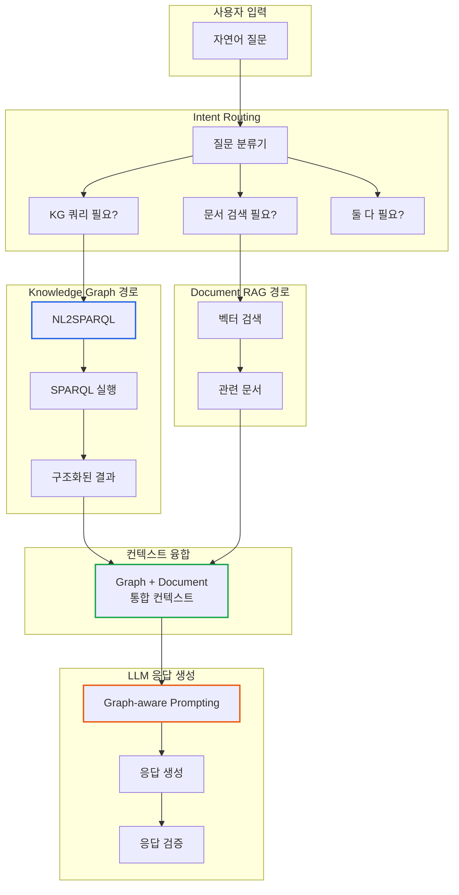
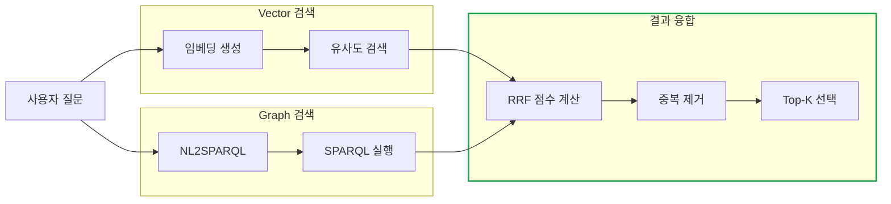
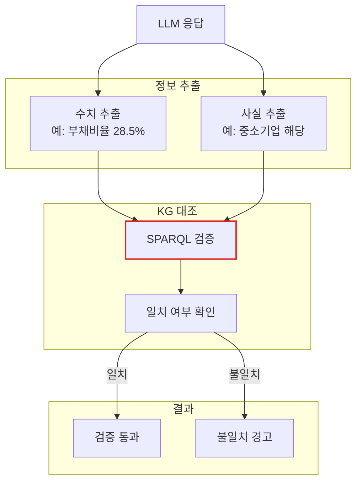
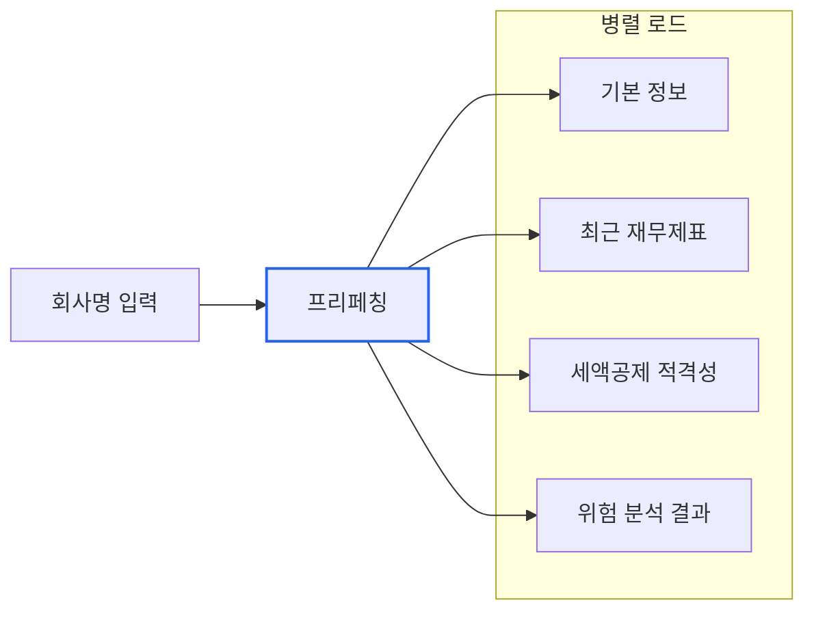
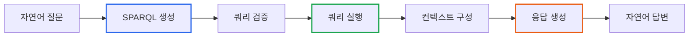

# GraphRAG: 지식그래프와 LLM의 시너지

> **작성일**: 2026년 1월 9일
> **카테고리**: GraphRAG, Knowledge Graph, LLM
> **키워드**: GraphRAG, NL2SPARQL, 하이브리드 검색, Graph-aware Prompting
> **시리즈**: [온톨로지 + AI 에이전트: 세무 컨설팅 시스템 아키텍처](https://blog.imprun.dev/120) (16부/총 20부)
> **대상 독자**: 온톨로지에 입문하는 시니어 개발자

## 요약

15부에서 SHACL로 세무 분석 규칙을 정의했다. 이제 Knowledge Graph의 **구조화된 지식**을 LLM의 **자연어 처리 능력**과 결합한다. 이 조합을 GraphRAG라 부른다. 사용자는 "A노무법인의 부채비율이 업계 평균보다 높나요?"라고 자연어로 질문하고, 시스템은 SPARQL로 정확한 데이터를 조회한 후 LLM이 해석을 덧붙인다.

---

## 핵심 질문

> **구조화된 지식을 LLM 컨텍스트로 어떻게 활용하는가?**

RAG(Retrieval Augmented Generation)는 외부 문서를 검색해서 LLM에 제공하는 기법이다. 그런데 일반적인 RAG는 **비정형 텍스트**에서 유사한 청크를 찾는다. GraphRAG는 여기서 한 걸음 더 나아간다.

```
일반 RAG:    문서 → 벡터화 → 유사도 검색 → LLM
GraphRAG:   지식그래프 → SPARQL 쿼리 → 정확한 데이터 + 관계 → LLM
```

Knowledge Graph의 장점은 **정확성**과 **관계 탐색**이다. "A노무법인의 부채비율"을 묻는다면, 벡터 검색으로 "부채비율이 높은 회사들..."이라는 문서를 찾는 것보다, SPARQL로 `fin:debtToEquityRatio`를 직접 조회하는 것이 정확하다.

---

## 이전 내용 복습

- **11부**: 벡터 기반 RAG (문서 검색 + LLM 응답)
- **15부**: SHACL로 세무 분석 규칙 정의

11부의 RAG는 문서를 벡터로 변환하여 유사도 검색을 수행했다. 하지만 구조화된 재무 데이터에는 **정확한 쿼리**가 더 효과적이다.

---

## GraphRAG 아키텍처



---

## 질문 유형 분류 (Intent Routing)

모든 질문이 Knowledge Graph를 필요로 하지 않는다. 먼저 질문의 성격을 파악해야 한다.

### 질문 유형별 처리 전략

| 질문 유형 | 예시 | 처리 경로 |
|----------|------|----------|
| 수치 조회 | "부채비율이 얼마인가요?" | KG만 |
| 관계 탐색 | "계열사가 있나요?" | KG만 |
| 규정 해석 | "접대비 한도 규정은?" | Document만 |
| 복합 분석 | "R&D 세액공제 받을 수 있나요?" | KG + Document |
| 비교 분석 | "업계 평균 대비 어떤가요?" | KG + Document |

### 라우팅 판단 기준

```
수치/비율 관련 키워드 → KG 쿼리 필요
   "얼마", "몇 퍼센트", "비율", "금액", "매출"

관계 탐색 키워드 → KG 쿼리 필요
   "계열사", "관계사", "모회사", "자회사"

법령/규정 키워드 → Document 검색 필요
   "규정", "법", "조문", "요건", "~인 경우"

분석/판단 키워드 → 둘 다 필요
   "~할 수 있나요", "~에 해당하나요", "비교", "검토"
```

---

## NL2SPARQL: 자연어를 SPARQL로 변환

### 변환 전략

자연어 질문을 SPARQL로 변환하는 방법은 크게 세 가지다.

| 전략 | 장점 | 단점 | 적합한 상황 |
|------|------|------|------------|
| 템플릿 기반 | 정확함, 빠름 | 유연성 부족 | 정형화된 질문 |
| LLM 직접 생성 | 유연함 | 오류 가능성 | 복잡한 질문 |
| 하이브리드 | 균형 잡힘 | 복잡도 증가 | 실서비스 |

### 템플릿 기반 NL2SPARQL

정형화된 질문에는 템플릿이 효과적이다.

```turtle
# 질문 패턴: "{회사}의 부채비율"
# 매칭: 정규식 "(.+)의 부채비율"

PREFIX fin: <http://example.org/financial/>
PREFIX acc: <http://example.org/account/>
PREFIX tax: <http://example.org/tax/>

SELECT ?debtRatio ?totalLiabilities ?totalEquity
WHERE {
    ?company a tax:Company ;
             tax:corporateName "{회사명}" ;
             fin:hasBalanceSheet ?bs .

    ?bs acc:totalLiabilities ?totalLiabilities ;
        acc:totalEquity ?totalEquity .

    OPTIONAL {
        ?bs fin:debtToEquityRatio ?debtRatio .
    }

    # 추론된 값이 없으면 계산
    BIND(IF(BOUND(?debtRatio), ?debtRatio,
            ?totalLiabilities * 100.0 / ?totalEquity) AS ?debtRatio)
}
```

### 온톨로지 스키마 활용

LLM이 SPARQL을 생성할 때, 온톨로지 스키마를 컨텍스트로 제공한다. 그래야 존재하는 클래스와 프로퍼티만 사용한다.

```
## 온톨로지 스키마 (요약)

### 주요 클래스
- tax:Company - 기업
- fin:BalanceSheet - 재무상태표
- fin:IncomeStatement - 손익계산서
- tax:TaxReturn - 세무신고서

### 주요 속성 (DataProperty)
- tax:corporateName - 회사명 (string)
- acc:totalAssets - 자산총계 (decimal)
- acc:totalLiabilities - 부채총계 (decimal)
- acc:totalEquity - 자본총계 (decimal)
- acc:revenue - 매출액 (decimal)
- fin:debtToEquityRatio - 부채비율 (decimal)

### 주요 관계 (ObjectProperty)
- fin:hasBalanceSheet - 재무상태표 보유
- fin:hasIncomeStatement - 손익계산서 보유
- tax:hasSubsidiary - 자회사 보유
- tax:isAffiliatedWith - 계열 관계
```

### SPARQL 검증 및 수정

LLM이 생성한 SPARQL은 실행 전에 검증이 필요하다.

```
검증 체크리스트:
1. 문법 오류 (Syntax Error)
2. 존재하지 않는 PREFIX
3. 존재하지 않는 클래스/프로퍼티
4. 무한 결과 방지 (LIMIT 없음)
5. 보안 위험 (DELETE/INSERT 등)
```

---

## 하이브리드 검색: Vector + Graph

### 왜 하이브리드인가?

| 검색 방식 | 잘하는 것 | 못하는 것 |
|----------|----------|----------|
| Vector | 의미적 유사성, 애매한 질문 | 정확한 수치, 관계 탐색 |
| Graph (SPARQL) | 정확한 수치, 명시적 관계 | 문맥 이해, 동의어 처리 |

"부채비율이 높은 회사"라는 질문:
- Vector 검색: "재무 구조가 불안정한", "차입금 비중이 큰" 등 유사 표현 문서 검색
- Graph 쿼리: `FILTER(?debtRatio > 200)` 정확히 200% 초과 회사 조회

두 방식을 결합하면 **정확성 + 유연성**을 모두 확보한다.

### 검색 결과 융합 (RRF)

두 검색 결과를 통합할 때 Reciprocal Rank Fusion을 사용한다.

```
RRF 점수 = 1 / (k + rank_vector) + 1 / (k + rank_graph)

- k: 상수 (보통 60)
- rank_vector: 벡터 검색 순위
- rank_graph: 그래프 검색 순위

양쪽에서 모두 상위권이면 최종 점수가 높아진다.
```

### 검색 파이프라인 설계



---

## Graph-aware Prompting

### 일반 RAG vs Graph-aware

일반 RAG는 검색된 텍스트를 그대로 프롬프트에 넣는다. Graph-aware Prompting은 **그래프 구조**를 활용하여 더 풍부한 컨텍스트를 제공한다.

```
일반 RAG 프롬프트:
---
관련 문서:
[문서1] 부채비율은 부채를 자본으로 나눈 비율이다...
[문서2] A노무법인의 재무 현황...
---

Graph-aware 프롬프트:
---
[엔티티 정보]
- 회사: A노무법인
- 업종: 서비스업 (노무사 사무실)
- 기업유형: 중소기업

[재무 데이터 (2023)]
- 부채총계: 118,000,000원
- 자본총계: 413,000,000원
- 부채비율: 28.5%

[관계 정보]
- 계열사: 없음
- SHACL 검증: 위험 경고 없음

[관련 규정]
[문서1] 중소기업 세액공제 요건...
---
```

### 프롬프트 구조화

```
## 시스템 지시문
당신은 세무 전문가입니다. 아래 정보를 바탕으로 질문에 답변하세요.
출처가 불분명한 정보는 "확인 필요"라고 명시하세요.

## 엔티티 컨텍스트 (Knowledge Graph)
[회사 기본 정보]
{company_info}

[재무 데이터]
{financial_data}

[분석 결과 (SHACL 추론)]
{shacl_inferences}

## 문서 컨텍스트 (Document RAG)
{retrieved_documents}

## 질문
{user_question}

## 응답 형식
1. 핵심 답변 (수치 기반)
2. 근거 설명
3. 권고 사항 (있을 경우)
```

### 엔티티 컨텍스트 구성

Knowledge Graph에서 질문과 관련된 엔티티를 추출하여 구조화한다.

```turtle
# 예: "A노무법인의 세액공제 적격 여부" 질문 시
# 관련 엔티티: 회사, 재무제표, 세액공제 조건

SELECT ?companyName ?industryType ?smeStatus
       ?revenue ?rndExpense ?employeeCount
       ?eligibleCredits
WHERE {
    ?company a tax:Company ;
             tax:corporateName "A노무법인" ;
             tax:corporateName ?companyName .

    OPTIONAL { ?company tax:industryType ?industryType }
    OPTIONAL { ?company a tax:SmallMediumEnterprise . BIND("중소기업" AS ?smeStatus) }

    OPTIONAL {
        ?company fin:hasIncomeStatement ?is .
        ?is acc:revenue ?revenue .
        OPTIONAL { ?is acc:rndExpense ?rndExpense }
    }

    OPTIONAL { ?company tax:employeeCount ?employeeCount }

    # 추론된 세액공제 적격성
    OPTIONAL {
        GRAPH <http://example.org/inferred> {
            ?company tax:eligibleFor ?eligibleCredits .
        }
    }
}
```

---

## 응답 검증 (Hallucination 방지)

### 검증 전략

LLM이 생성한 응답에 포함된 **수치**와 **사실**을 Knowledge Graph와 대조한다.



### 검증 규칙

| 검증 항목 | 방법 | 허용 오차 |
|----------|------|----------|
| 금액 | KG 데이터와 직접 비교 | 0% |
| 비율 | KG 계산값과 비교 | 0.1% |
| 분류 | KG 클래스 확인 | 정확 일치 |
| 관계 | KG 관계 존재 확인 | 존재 여부 |

### 불확실성 표현 강제

검증되지 않은 정보에는 불확실성 표현을 강제한다.

```
검증된 정보:
"A노무법인의 부채비율은 28.5%입니다."

검증되지 않은 정보:
"업계 평균 부채비율은 약 50% 수준으로 추정됩니다." (확인 필요)
```

---

## 실제 질의응답 흐름

### 예시: "A노무법인이 R&D 세액공제를 받을 수 있나요?"

**Step 1: Intent Routing**
```
키워드 분석: "R&D 세액공제", "받을 수 있나요"
→ 복합 질문 (KG + Document 모두 필요)
```

**Step 2: KG 쿼리**
```turtle
SELECT ?smeStatus ?rndExpense ?industryType ?eligibility
WHERE {
    ?company tax:corporateName "A노무법인" .

    # 중소기업 여부
    OPTIONAL {
        ?company a tax:SmallMediumEnterprise .
        BIND("Y" AS ?smeStatus)
    }

    # R&D 비용
    OPTIONAL {
        ?company fin:hasIncomeStatement ?is .
        ?is acc:rndExpense ?rndExpense .
    }

    # 추론된 적격성
    OPTIONAL {
        GRAPH <http://example.org/inferred> {
            ?company tax:eligibleFor tax:RnDTaxCredit .
            BIND("적격" AS ?eligibility)
        }
    }
}
```

**결과:**
```
smeStatus: "Y"
rndExpense: NULL (R&D 비용 없음)
eligibility: NULL (적격 아님)
```

**Step 3: Document 검색**
```
쿼리: "R&D 세액공제 요건 중소기업"
검색 결과:
[1] 조세특례제한법 제10조 - 연구인력개발비 세액공제
    "연구개발비를 지출한 경우 일정 비율을 세액공제..."
```

**Step 4: Graph-aware Prompt 구성**
```
## 엔티티 정보
- 회사: A노무법인
- 기업유형: 중소기업
- R&D 비용: 없음

## 관련 규정
[조세특례제한법 제10조]
연구개발비를 지출한 경우 25% 세액공제 가능...

## 질문
A노무법인이 R&D 세액공제를 받을 수 있나요?
```

**Step 5: LLM 응답**
```
A노무법인은 현재 R&D 세액공제를 받을 수 없습니다.

[근거]
- 중소기업 여부: 해당 (조건 충족)
- R&D 비용 지출: 없음 (조건 미충족)

R&D 세액공제를 받으려면 연구개발 인력 채용, 연구전담부서 설립,
또는 외부 연구용역 등을 통해 R&D 비용을 지출해야 합니다.

[출처: Knowledge Graph - 재무 데이터, 조세특례제한법 제10조]
```

**Step 6: 응답 검증**
```
검증 항목:
- "중소기업 해당" → KG 확인 → 일치
- "R&D 비용 없음" → KG 확인 → 일치
- "25% 세액공제" → 문서 확인 → 일치

검증 결과: 통과
```

---

## 성능 최적화

### 쿼리 캐싱

자주 묻는 질문 패턴의 SPARQL 결과를 캐싱한다.

```
캐싱 대상:
- 동일 회사의 기본 정보 (TTL: 1일)
- 재무비율 계산 결과 (TTL: 분기)
- 업종별 통계 (TTL: 연간)
```

### 프리페칭

회사 ID가 확인되면 관련 데이터를 미리 로드한다.



---

## 벡터 RAG vs GraphRAG

| 구분 | 벡터 RAG | GraphRAG |
|------|----------|----------|
| 데이터 형태 | 비정형 문서 | 구조화된 그래프 |
| 검색 방식 | 유사도 | 정확한 쿼리 |
| 관계 표현 | 암시적 | 명시적 |
| 수치 계산 | 어려움 | SPARQL로 가능 |
| 적합한 경우 | 법령 해석, 사례 검색 | 재무 분석, 지표 계산 |

### 질문 유형별 적합한 RAG

| 질문 유형 | 적합한 RAG |
|----------|-----------|
| "부채비율은?" | GraphRAG |
| "법인세 규정은?" | 벡터 RAG |
| "부채비율이 높으면 법적으로?" | 하이브리드 |
| "전년 대비 매출 변화는?" | GraphRAG |
| "유사 판례는?" | 벡터 RAG |

---

## 핵심 정리

### GraphRAG 파이프라인



### NL2SPARQL 전략

| 전략 | 적용 상황 |
|------|----------|
| 템플릿 기반 | 정형화된 질문 (부채비율, 매출액 등) |
| LLM 생성 | 복잡한 조건, 집계 질의 |
| 하이브리드 | 템플릿 매칭 실패 시 LLM 폴백 |

### 프롬프트 구성 원칙

1. **엔티티 컨텍스트 우선**: KG 데이터를 먼저 제공
2. **구조화된 정보**: 표 형식으로 수치 정리
3. **출처 명시**: KG/문서 구분 표시
4. **불확실성 표현**: 검증 안 된 정보 명시

---

## 다음 단계 미리보기

**17부: 세무 분석 에이전트 구축**

GraphRAG를 활용하는 **자율 에이전트**를 설계한다:

- ReAct 패턴으로 도구 활용
- 다단계 분석 자동화
- 사용자 피드백 반영

---

## 참고 자료

### GraphRAG
- [Microsoft GraphRAG](https://www.microsoft.com/en-us/research/project/graphrag/)
- [Knowledge Graphs for RAG](https://neo4j.com/developer-blog/knowledge-graph-rag-application/)

### NL2SPARQL
- [Text-to-SQL/SPARQL Benchmarks](https://yale-lily.github.io/spider)
- [KGQA: Knowledge Graph Question Answering](https://paperswithcode.com/task/knowledge-graph-question-answering)

### 관련 시리즈
- [이전: 세무 분석 규칙 SHACL로 정의하기](https://blog.imprun.dev/135)
- [다음: 세무 분석 에이전트 구축](https://blog.imprun.dev/137)
- [시리즈 목차](https://blog.imprun.dev/120)
