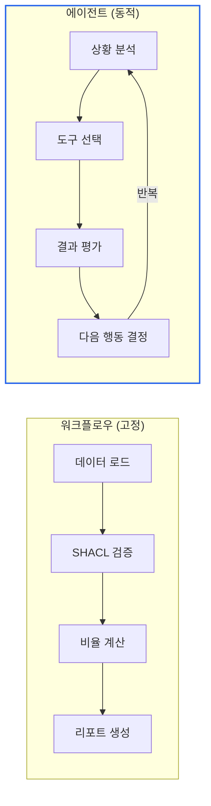
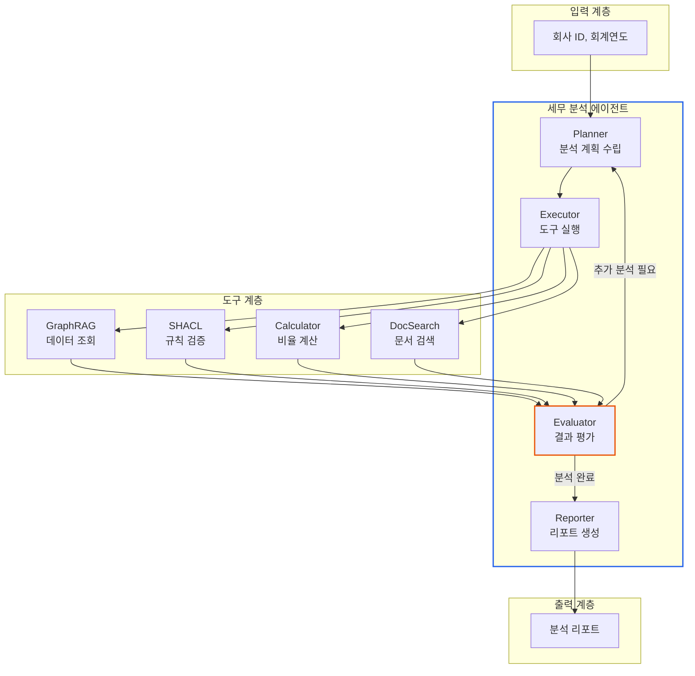
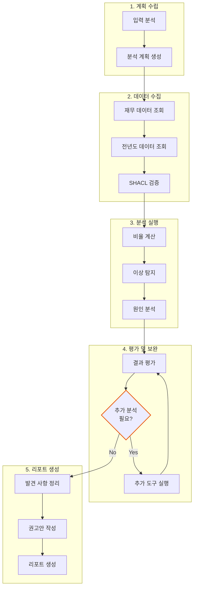

# 세무 분석 에이전트 구축

> **작성일**: 2026년 1월 9일
> **카테고리**: AI Agent, LangGraph, Tax Analysis
> **키워드**: AI 에이전트, ReAct, 도구 활용, 자율 분석, LangGraph
> **시리즈**: [온톨로지 + AI 에이전트: 세무 컨설팅 시스템 아키텍처](https://blog.imprun.dev/120) (17부/총 20부)
> **대상 독자**: 온톨로지에 입문하는 시니어 개발자

## 요약

12부에서 LangGraph 기초를, 13부에서 커스텀 도구를, 16부에서 GraphRAG를 구현했다. 이제 이 모든 것을 **하나의 세무 분석 에이전트**로 통합한다. 데이터 조회 → SHACL 검증 → 재무 분석 → 이상 탐지 → 리포트 생성까지의 전체 워크플로우를 LangGraph로 구현하고, GraphRAG와 SHACL 검증을 도구로 연결한다.

---

## 핵심 질문

> **자율적으로 분석하는 에이전트를 어떻게 설계하는가?**

세무사가 재무제표를 분석할 때의 사고 과정을 생각해보자.

```
1. "먼저 재무상태표를 봐야겠다" → 데이터 조회
2. "부채비율이 높네, 확인해보자" → 규칙 검증
3. "전년 대비 어떻게 변했지?" → 비교 분석
4. "관련 규정이 있나?" → 문서 검색
5. "고객에게 어떻게 설명하지?" → 리포트 생성
```

이 과정을 AI 에이전트로 구현한다는 것은, LLM이 **상황에 따라 적절한 도구를 선택**하고 **다음 행동을 결정**하도록 만드는 것이다.

---

## 이전 내용 복습

- **12부**: LangGraph로 상태 기반 에이전트 구축
- **13부**: 커스텀 도구(Tool) 만들기
- **15부**: SHACL 분석 규칙 정의
- **16부**: GraphRAG 파이프라인

이제 Part D의 마지막 단계로, **완전한 세무 분석 에이전트**를 구현한다.

---

## 에이전트 vs 워크플로우

### 차이점

| 구분 | 워크플로우 | 에이전트 |
|------|-----------|---------|
| 실행 순서 | 고정 | 동적 |
| 분기 조건 | 사전 정의 | LLM 판단 |
| 도구 선택 | 순차적 | 상황 기반 |
| 적합한 경우 | 정형화된 업무 | 복잡한 분석 |

### 세무 분석에서의 선택



**세무 분석은 하이브리드 접근이 적합하다**:
- 기본 흐름은 워크플로우로 정의 (데이터 로드 → 검증 → 분석)
- 이상 탐지 시 에이전트가 추가 분석 결정

---

## ReAct 패턴: Reasoning + Acting

### ReAct란?

LLM이 **생각(Reasoning)**하고 **행동(Acting)**을 반복하는 패턴이다.

```
Thought: 부채비율이 200%를 초과했다. 원인을 파악해야 한다.
Action: query_financial_data("A노무법인", 2023)
Observation: 전년도 부채총계 90,000,000원, 자본 450,000,000원
Thought: 전년도는 부채비율 20%였다. 올해 급격히 증가한 원인은?
Action: query_liability_details("A노무법인", 2024)
Observation: 단기차입금 300,000,000원 신규 발생
Thought: 단기차입금이 크게 늘었다. 관련 규정을 확인해야 한다.
Action: search_documents("단기차입금 증가 세무 리스크")
...
```

### 에이전트 설계 원칙

| 원칙 | 설명 | 세무 분석 적용 |
|------|------|--------------|
| 명확한 목표 | 에이전트가 달성해야 할 것 | "재무 위험을 분석하고 권고안 제시" |
| 적절한 도구 | 필요한 기능 제공 | SPARQL 쿼리, SHACL 검증, 문서 검색 |
| 종료 조건 | 언제 멈출지 정의 | 리포트 생성 완료 또는 오류 발생 |
| 상태 추적 | 진행 상황 관리 | 분석 단계, 발견된 이슈 |

---

## 에이전트 아키텍처

### 전체 구조



### 상태 정의

에이전트의 메모리 역할을 하는 상태 구조.

```python
class TaxAgentState(TypedDict):
    """세무 분석 에이전트 상태"""

    # === 입력 ===
    company_id: str
    fiscal_year: int

    # === 분석 계획 ===
    analysis_plan: List[str]      # 수행할 분석 목록
    current_task: str             # 현재 진행 중인 작업

    # === 수집된 데이터 ===
    financial_data: Optional[dict]
    previous_year_data: Optional[dict]
    shacl_results: Optional[dict]

    # === 분석 결과 ===
    findings: List[str]           # 발견된 이슈
    risk_level: str               # LOW, MEDIUM, HIGH
    recommendations: List[str]    # 권고 사항

    # === 에이전트 추적 ===
    thought_process: List[str]    # Reasoning 로그
    actions_taken: List[str]      # Action 로그
    iteration_count: int          # 반복 횟수

    # === 출력 ===
    report: Optional[str]
```

---

## 도구 설계

### 도구 목록

| 도구 | 기능 | 입력 | 출력 |
|------|------|------|------|
| `query_financial_data` | KG에서 재무 데이터 조회 | 회사ID, 연도 | 재무제표 데이터 |
| `validate_with_shacl` | SHACL 규칙 검증 | 데이터 파일 | 위반/경고 목록 |
| `calculate_ratios` | 재무비율 계산 | 재무 데이터 | 비율 딕셔너리 |
| `compare_years` | 연도별 비교 | 회사ID, 연도 | 변화율 |
| `search_documents` | 관련 문서 검색 | 검색어 | 문서 목록 |

### 도구 정의 예시

```python
@tool
def query_financial_data(company_id: str, fiscal_year: int) -> Dict[str, Any]:
    """
    지식그래프에서 특정 기업의 재무 데이터를 조회합니다.

    Args:
        company_id: 기업 식별자 (예: "A노무법인")
        fiscal_year: 회계연도 (예: 2024)

    Returns:
        재무상태표 및 손익계산서 데이터
    """
    query = f"""
    PREFIX fin: <http://example.org/financial/>
    PREFIX acc: <http://example.org/account/>
    PREFIX tax: <http://example.org/tax/>

    SELECT ?assets ?liabilities ?equity ?revenue ?netIncome
    WHERE {{
        ?company tax:corporateName "{company_id}" ;
                 fin:hasBalanceSheet ?bs ;
                 fin:hasIncomeStatement ?is .

        ?bs fin:fiscalYear {fiscal_year} ;
            acc:totalAssets ?assets ;
            acc:totalLiabilities ?liabilities ;
            acc:totalEquity ?equity .

        ?is fin:fiscalYear {fiscal_year} ;
            acc:revenue ?revenue ;
            acc:netIncome ?netIncome .
    }}
    """
    # SPARQL 실행 및 결과 반환
    ...
```

### 도구 선택 프롬프트

에이전트가 상황에 맞는 도구를 선택하도록 유도.

```
## 사용 가능한 도구

1. **query_financial_data**: 특정 회사의 재무 데이터 조회
   - 언제 사용: 재무상태표, 손익계산서 데이터가 필요할 때
   - 예시: query_financial_data("A노무법인", 2024)

2. **validate_with_shacl**: SHACL 규칙으로 데이터 검증
   - 언제 사용: 재무 데이터의 이상 여부를 확인할 때
   - 예시: validate_with_shacl("data.ttl", "rules.ttl")

3. **calculate_ratios**: 재무비율 계산
   - 언제 사용: 부채비율, 유동비율 등을 계산할 때
   - 예시: calculate_ratios(financial_data)

4. **compare_years**: 전년 대비 비교
   - 언제 사용: 추세 분석이 필요할 때
   - 예시: compare_years("A노무법인", 2024)

5. **search_documents**: 관련 법령/기준서 검색
   - 언제 사용: 세무 규정을 확인해야 할 때
   - 예시: search_documents("접대비 손금한도")

## 판단 기준
- 데이터가 없으면 → query_financial_data
- 이상 징후 확인 → validate_with_shacl
- 수치 분석 → calculate_ratios
- 원인 파악 → compare_years
- 규정 확인 → search_documents
```

---

## 실행 흐름

### 단계별 실행



### 조건부 분기 로직

```python
def should_continue_analysis(state: TaxAgentState) -> str:
    """추가 분석 필요 여부 판단"""

    # 최대 반복 횟수 제한
    if state["iteration_count"] >= 5:
        return "generate_report"

    # 위험 수준이 HIGH면 추가 분석
    if state["risk_level"] == "HIGH" and len(state["findings"]) < 3:
        return "continue_analysis"

    # SHACL 위반이 있으면 원인 분석
    if state["shacl_results"] and len(state["shacl_results"]["violations"]) > 0:
        if "violation_analyzed" not in state["actions_taken"]:
            return "analyze_violations"

    # 권고 사항이 없으면 문서 검색
    if len(state["recommendations"]) == 0:
        return "search_recommendations"

    return "generate_report"
```

---

## 에이전트 실행 예시

### 입력

```
회사: A노무법인
회계연도: 2024
분석 요청: 재무 건전성 분석 및 개선 권고
```

### 실행 로그

```
[Planner] 분석 계획 수립
- Task 1: 재무 데이터 조회
- Task 2: SHACL 검증
- Task 3: 비율 분석
- Task 4: 전년 대비 분석
- Task 5: 리포트 생성

[Executor] Task 1 실행: query_financial_data
→ 자산: 2,194,433,171원, 부채: 486,333,117원, 자본: 1,708,100,054원

[Executor] Task 2 실행: validate_with_shacl
→ 위반: 0건, 경고: 2건
  - 인건비 비중 62.6% (60% 초과)
  - 영업이익률 7.9% (10% 미만)

[Evaluator] 경고 2건 발견, 추가 분석 필요
→ 위험 수준: MEDIUM

[Executor] Task 3 실행: calculate_ratios
→ 부채비율 28.5%, 유동비율 157.7%, ROE 20.0%

[Executor] Task 4 실행: compare_years
→ 매출 +5.2%, 영업이익 -3.1%, 인건비 +8.7%

[Evaluator] 인건비 증가율이 매출 증가율보다 높음
→ 추가 분석: search_documents("인건비 비중 개선")

[Executor] 추가 분석: search_documents
→ 관련 문서 3건 검색

[Evaluator] 분석 완료, 리포트 생성 단계로 이동

[Reporter] 리포트 생성 완료
```

### 생성된 리포트

```markdown
# A노무법인 2024년 재무 분석 리포트

## 요약

A노무법인의 재무 상태는 전반적으로 양호하나, 인건비 비중과
영업이익률에서 개선이 필요합니다. 부채비율 28.5%로 재무
안정성은 우수합니다.

## 주요 지표

| 지표 | 수치 | 평가 | 기준 |
|------|------|------|------|
| 부채비율 | 28.5% | 우수 | 200% 이하 |
| 유동비율 | 157.7% | 양호 | 100% 이상 |
| 영업이익률 | 7.9% | 주의 | 10% 이상 |
| ROE | 20.0% | 양호 | 15% 이상 |
| 인건비 비중 | 62.6% | 주의 | 60% 이하 |

## 발견 사항

1. **인건비 비중 증가**: 전년 대비 8.7% 증가
   - 매출 증가율(5.2%)을 초과하는 인건비 증가
   - 인력 생산성 하락 가능성

2. **영업이익률 하락**: 전년 대비 3.1%p 하락
   - 인건비 증가가 주요 원인

## 권고 사항

1. 인력 1인당 매출 생산성 분석 실시
2. 업무 프로세스 효율화 검토
3. 자동화 가능 업무 식별

## 다음 달 체크포인트

- [ ] 월별 인건비 추이 모니터링
- [ ] 신규 매출 창출 계획 점검
```

---

## 에이전트 안전장치

### 무한 루프 방지

```python
MAX_ITERATIONS = 10

def run_agent(initial_state: TaxAgentState) -> TaxAgentState:
    state = initial_state
    iteration = 0

    while True:
        iteration += 1
        if iteration > MAX_ITERATIONS:
            state["report"] = "분석 반복 횟수 초과로 중단됨"
            break

        next_action = determine_next_action(state)

        if next_action == "done":
            break

        state = execute_action(state, next_action)

    return state
```

### 도구 실행 타임아웃

```python
TOOL_TIMEOUT = 30  # 초

async def execute_tool_with_timeout(tool, args):
    try:
        result = await asyncio.wait_for(
            tool.ainvoke(args),
            timeout=TOOL_TIMEOUT
        )
        return result
    except asyncio.TimeoutError:
        return {"error": f"도구 실행 시간 초과: {tool.name}"}
```

### 오류 복구 전략

```python
def handle_tool_error(state: TaxAgentState, error: str) -> TaxAgentState:
    """도구 실행 오류 처리"""

    state["errors"].append(error)

    # 3회 이상 오류 시 해당 도구 건너뛰기
    if state["error_count"] >= 3:
        state["findings"].append(f"분석 제한: {error}")
        state["current_task"] = "skip_to_report"

    return state
```

---

## 핵심 정리

### 에이전트 설계 체크리스트

| 항목 | 설명 |
|------|------|
| 목표 정의 | 에이전트가 달성해야 할 것 |
| 도구 설계 | 필요한 기능을 도구로 분리 |
| 상태 관리 | 진행 상황과 결과 추적 |
| 분기 로직 | 상황에 따른 다음 행동 결정 |
| 안전장치 | 무한 루프, 타임아웃, 오류 처리 |
| 종료 조건 | 언제 분석을 끝낼지 |

### ReAct 패턴 적용

```
Thought → 현재 상황 분석, 다음 행동 결정
Action → 도구 실행
Observation → 결과 확인
(반복)
Final Answer → 리포트 생성
```

### 워크플로우 vs 에이전트

| 상황 | 권장 방식 |
|------|----------|
| 정형화된 분석 | 워크플로우 |
| 복잡한 이상 탐지 | 에이전트 |
| 대화형 분석 | 에이전트 |
| 배치 처리 | 워크플로우 |

---

## 다음 단계 미리보기

**18부: 월간 리포트 자동 생성 파이프라인**

17부에서 만든 에이전트를 **자동화 파이프라인**으로 확장한다:

- 스케줄러로 월간 자동 실행
- PDF/HTML 리포트 생성
- 이메일 발송 자동화
- 대시보드 연동

---

## 참고 자료

### AI Agent 패턴
- [ReAct: Synergizing Reasoning and Acting](https://arxiv.org/abs/2210.03629)
- [LangGraph Agent Patterns](https://langchain-ai.github.io/langgraph/concepts/agentic_concepts/)

### LangGraph
- [LangGraph Documentation](https://langchain-ai.github.io/langgraph/)
- [Tool Calling in LangGraph](https://langchain-ai.github.io/langgraph/how-tos/tool-calling/)

### 관련 시리즈
- [이전: GraphRAG: 지식그래프 + LLM 통합](https://blog.imprun.dev/136)
- [다음: 월간 리포트 자동 생성 파이프라인](https://blog.imprun.dev/138)
- [시리즈 목차](https://blog.imprun.dev/120)
