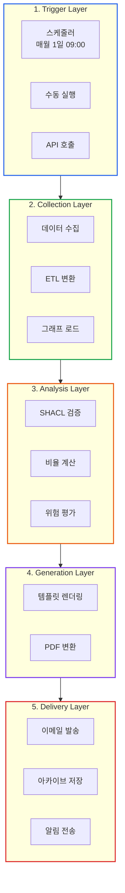
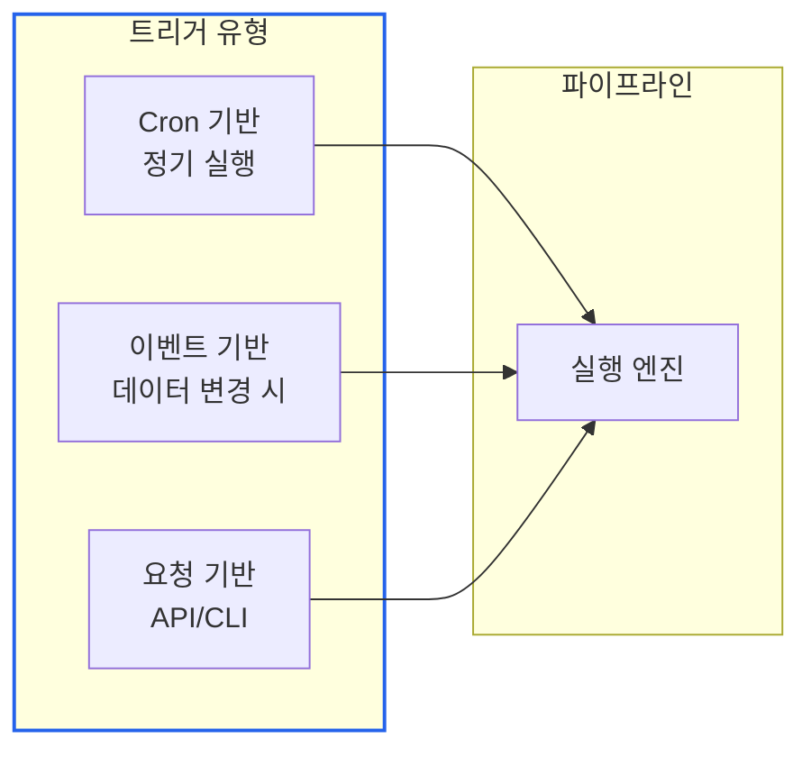
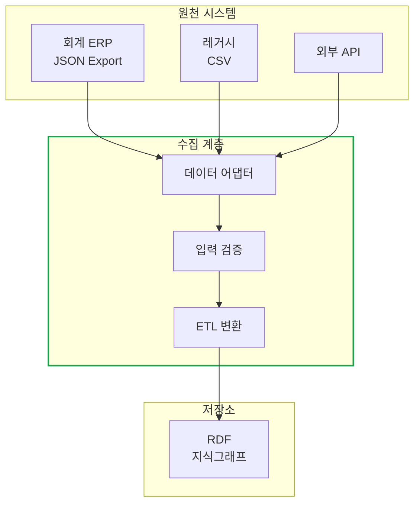
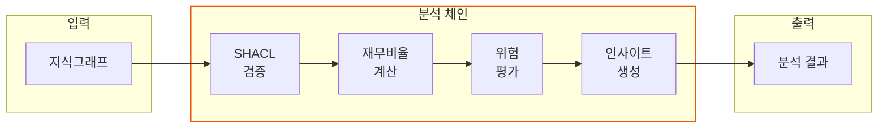
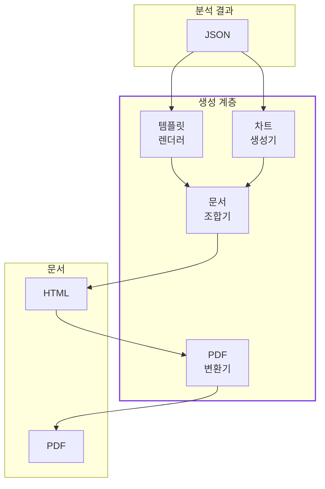
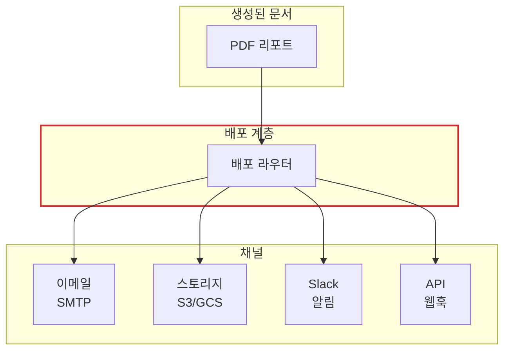
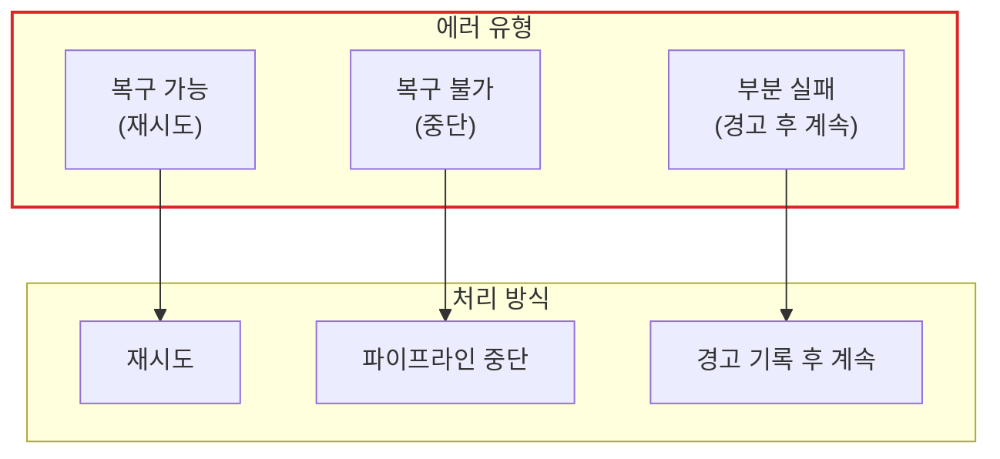
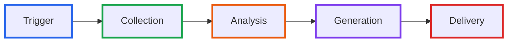

# 월간 리포트 자동 생성 파이프라인

> **작성일**: 2026년 1월 9일
> **카테고리**: Pipeline Architecture, Automation
> **키워드**: 파이프라인, 리포트 생성, 데이터 흐름, 계층 아키텍처
> **시리즈**: [온톨로지 + AI 에이전트: 세무 컨설팅 시스템 아키텍처](https://blog.imprun.dev/120) (18부/총 20부)
> **대상 독자**: 온톨로지에 입문하는 시니어 개발자

## 핵심 질문

> **"데이터 수집부터 PDF 출력까지의 흐름은?"**

세무 분석 에이전트를 구현했더라도, "매월 수동 실행"은 자동화가 아니다. 이 글에서는 **월간 리포트 파이프라인의 아키텍처**를 설계한다. 단순 코드 구현이 아닌, **각 계층의 역할**과 **설계 결정의 근거**를 중심으로 살펴본다.

---

## 요약

회계 ERP 데이터가 CEO 책상 위의 PDF 리포트가 되기까지는 **5개 계층**을 통과한다. 트리거(Trigger), 수집(Collection), 분석(Analysis), 생성(Generation), 배포(Delivery). 각 계층은 명확한 책임을 가지며, 계층 간 인터페이스가 정의되어야 확장과 교체가 가능해진다. 이 글에서는 파이프라인의 아키텍처 설계와 주요 설계 결정을 다룬다.

---

## 파이프라인 5계층 아키텍처

### 전체 흐름



### 계층별 책임

| 계층 | 책임 | 입력 | 출력 |
|------|------|------|------|
| **Trigger** | 실행 시점 결정 | 시간, 이벤트, 요청 | 파이프라인 시작 신호 |
| **Collection** | 원천 데이터 수집 | 회사 ID, 회계연도 | RDF 지식그래프 |
| **Analysis** | 분석 및 인사이트 생성 | 지식그래프 | 분석 결과(JSON) |
| **Generation** | 문서 생성 | 분석 결과 | PDF/HTML 파일 |
| **Delivery** | 결과 전달 | 문서 파일 | 이메일, 알림 |

---

## Layer 1: Trigger Layer

### 왜 트리거 계층이 필요한가?

"언제 실행할 것인가"와 "무엇을 실행할 것인가"를 분리해야 한다. 스케줄 로직이 비즈니스 로직에 섞이면, 수동 테스트나 API 호출이 어려워진다.

### 트리거 유형



### 설계 결정: APScheduler vs Celery Beat

| 기준 | APScheduler | Celery Beat |
|------|-------------|-------------|
| 복잡도 | 단순 | 높음 (Redis/RabbitMQ 필요) |
| 분산 환경 | 제한적 | 지원 |
| 적합 규모 | 소~중형 | 대형 |

이 시스템은 단일 인스턴스에서 월 1회 실행이므로 APScheduler를 선택한다. 트래픽이 증가하면 Celery Beat로 전환할 수 있도록 인터페이스를 추상화한다.

### 트리거 인터페이스

```python
# 트리거는 파이프라인 실행만 담당
class PipelineTrigger(Protocol):
    def schedule(self, company_id: str, config: dict) -> str: ...
    def cancel(self, job_id: str) -> bool: ...
    def run_now(self, company_id: str, fiscal_year: int) -> dict: ...
```

---

## Layer 2: Collection Layer

### 데이터 수집 전략



### 설계 결정: 어댑터 패턴

원천 시스템은 변경될 수 있다. 현재는 JSON Export를 사용하지만, 추후 API 연동이나 실시간 스트리밍으로 변경될 수 있다. **어댑터 패턴**으로 원천 시스템과 파이프라인을 분리한다.

```
┌─────────────┐     ┌──────────────┐     ┌─────────────┐
│   ERP API   │────▶│  ERPAdapter  │────▶│  Collector  │
└─────────────┘     └──────────────┘     └─────────────┘

┌─────────────┐     ┌──────────────┐     ┌─────────────┐
│  CSV File   │────▶│  CSVAdapter  │────▶│  Collector  │
└─────────────┘     └──────────────┘     └─────────────┘
```

각 어댑터는 동일한 인터페이스를 구현하므로, Collector는 원천 시스템의 구체적인 형식을 알 필요가 없다.

### 데이터 품질 게이트

수집된 데이터가 분석 계층으로 넘어가기 전에 **품질 게이트**를 통과해야 한다.

| 검증 항목 | 기준 | 실패 시 동작 |
|----------|------|-------------|
| 필수 필드 | 자산/부채/매출 존재 | 파이프라인 중단 |
| 데이터 타입 | 숫자 필드 정합성 | 변환 시도 후 실패 시 중단 |
| 범위 검증 | 음수 자산 불가 | 경고 후 계속 |
| 참조 무결성 | 회사 ID 존재 | 파이프라인 중단 |

---

## Layer 3: Analysis Layer

### 분석 파이프라인 구조



### SHACL 검증의 역할

SHACL(Shapes Constraint Language)은 단순 데이터 검증이 아니다. **비즈니스 규칙을 선언적으로 정의**하는 도구다.

예를 들어, "부채비율 200% 초과 시 경고"라는 규칙을:
- 코드로 작성하면: `if debt_ratio > 200: warnings.append(...)`
- SHACL로 선언하면: 규칙이 지식그래프의 일부가 되어 추적 가능

### 분석 결과 스키마

분석 계층의 출력은 명확한 스키마를 따른다. 이 스키마가 Generation Layer와의 계약(Contract)이 된다.

```
AnalysisResult:
├── company_info:
│   ├── id: string
│   ├── name: string
│   └── fiscal_year: int
├── financial_data:
│   ├── assets: number
│   ├── liabilities: number
│   └── ...
├── ratios:
│   ├── debt_ratio: number
│   ├── operating_margin: number
│   └── ...
├── validation:
│   ├── violations: list
│   └── warnings: list
├── risk:
│   ├── level: "HIGH" | "MEDIUM" | "LOW"
│   └── factors: list
└── insights: list[string]
```

---

## Layer 4: Generation Layer

### 리포트 생성 아키텍처



### 설계 결정: 템플릿 기반 vs LLM 생성

| 방식 | 장점 | 단점 |
|------|------|------|
| **템플릿 기반** | 일관성, 예측 가능성, 저비용 | 유연성 제한 |
| **LLM 생성** | 자연스러운 서술, 동적 내용 | 비용, 일관성 부족 |

이 시스템은 **하이브리드 방식**을 선택한다:
- 구조와 데이터 표시: 템플릿 기반
- 인사이트 서술: LLM 생성

### PDF 변환 선택

| 라이브러리 | CSS 지원 | 한글 | 라이선스 |
|-----------|---------|------|---------|
| WeasyPrint | 우수 | 폰트 설정 필요 | BSD |
| wkhtmltopdf | 양호 | 양호 | LGPL |
| Puppeteer | 우수 | 우수 | Apache 2.0 |

WeasyPrint를 선택한다. Python 네이티브이며 CSS 지원이 우수하다. 한글 폰트는 Noto Sans CJK를 Docker 이미지에 포함한다.

---

## Layer 5: Delivery Layer

### 배포 전략



### 배포 채널 추상화

채널마다 다른 인터페이스를 가진다. 추상화를 통해 새로운 채널 추가가 쉬워진다.

```
DeliveryChannel (Protocol):
├── send(document: Document, recipients: list) -> bool
├── validate_config() -> bool
└── get_status(delivery_id: str) -> DeliveryStatus

구현체:
├── EmailChannel (SMTP)
├── SlackChannel (Webhook)
├── StorageChannel (S3)
└── WebhookChannel (HTTP POST)
```

### 재시도 정책

네트워크 오류나 일시적 장애에 대비한 재시도 정책을 정의한다.

| 채널 | 최대 재시도 | 간격 | 백오프 |
|------|-----------|------|--------|
| Email | 3 | 5분 | 지수 |
| Slack | 5 | 1분 | 선형 |
| Storage | 3 | 30초 | 지수 |

---

## 에러 처리 전략

### 계층별 에러 처리



### 에러 분류 기준

| 계층 | 에러 예시 | 유형 | 처리 |
|------|----------|------|------|
| Collection | ERP 연결 실패 | 복구 가능 | 재시도 3회 |
| Collection | 필수 필드 누락 | 복구 불가 | 중단 + 알림 |
| Analysis | SHACL 경고 | 부분 실패 | 계속 |
| Analysis | SHACL 위반(Critical) | 복구 불가 | 중단 |
| Generation | 템플릿 렌더링 실패 | 복구 불가 | 중단 |
| Delivery | 이메일 발송 실패 | 복구 가능 | 재시도 |

### 실패 알림

파이프라인 실패 시 관리자에게 즉시 알림을 보낸다. 알림에는 실패 계층, 에러 메시지, 관련 데이터가 포함된다.

---

## 스케줄링 설계

### 실행 타임라인

```
매월 1일 08:00 - 트리거 시작
         08:01 - Collection Layer (예상 10분)
         08:11 - Analysis Layer (예상 5분)
         08:16 - Generation Layer (예상 3분)
         08:19 - Delivery Layer (예상 1분)
         08:20 - 완료

버퍼: 1시간 (09:20까지 미완료 시 알림)
```

### 동시성 제어

여러 기업의 리포트를 생성할 때 동시성을 제어한다.

| 전략 | 설명 | 적합 상황 |
|------|------|----------|
| 순차 실행 | 한 번에 하나씩 | 리소스 제한, 소수 기업 |
| 병렬 실행 | 동시 N개 | 리소스 여유, 다수 기업 |
| 우선순위 큐 | 중요도 기반 | VIP 고객 우선 |

현재는 순차 실행을 기본으로 하고, 기업 수가 증가하면 병렬 실행으로 전환한다.

---

## 성능 고려사항

### 병목 지점 분석

| 계층 | 예상 시간 | 병목 요인 | 최적화 방안 |
|------|----------|----------|------------|
| Collection | 5-10분 | ERP 응답 시간 | 캐싱, 증분 수집 |
| Analysis | 3-5분 | SPARQL 쿼리 | 인덱싱, 쿼리 최적화 |
| Generation | 1-3분 | PDF 렌더링 | 템플릿 캐싱 |
| Delivery | 1-2분 | SMTP 지연 | 비동기 발송 |

### 캐싱 전략

- **데이터 캐싱**: 동일 회계연도 데이터는 변경 전까지 캐싱
- **템플릿 캐싱**: Jinja2 템플릿 컴파일 결과 캐싱
- **LLM 응답 캐싱**: 동일 입력에 대한 인사이트 캐싱 (SQLite)

---

## 핵심 정리

### 아키텍처 원칙

| 원칙 | 적용 |
|------|------|
| **단일 책임** | 각 계층은 하나의 책임만 |
| **계층 분리** | 계층 간 명확한 인터페이스 |
| **확장성** | 어댑터/채널 추가 용이 |
| **장애 격리** | 한 계층 실패가 전체로 전파되지 않음 |

### 파이프라인 구성 요약



---

## 다음 단계 미리보기

**19부: 멀티 에이전트 협업 시스템**

지금까지는 단일 흐름의 파이프라인이었다. 다음 글에서는 **여러 에이전트가 어떻게 협업하는가**를 다룬다. 데이터 에이전트, 검증 에이전트, 분석 에이전트, 리포트 에이전트가 슈퍼바이저의 조율 아래 협업하는 아키텍처를 설계한다.

---

## 참고 자료

### 파이프라인 패턴
- [Pipes and Filters Pattern](https://docs.microsoft.com/en-us/azure/architecture/patterns/pipes-and-filters)
- [ETL Best Practices](https://www.informatica.com/resources/articles/what-is-etl.html)

### 도구
- [APScheduler Documentation](https://apscheduler.readthedocs.io/)
- [WeasyPrint](https://weasyprint.org/)
- [Jinja2 Templates](https://jinja.palletsprojects.com/)

### 관련 시리즈
- [이전: 세무 분석 에이전트 구현](https://blog.imprun.dev/137)
- [다음: 멀티 에이전트 협업 시스템](https://blog.imprun.dev/139)
- [시리즈 목차](https://blog.imprun.dev/120)
