# 멀티 에이전트 협업 시스템

> **작성일**: 2026년 1월 9일
> **카테고리**: Multi-Agent Architecture, Collaboration Pattern
> **키워드**: 멀티 에이전트, 협업 패턴, 슈퍼바이저, 상태 공유, 역할 분담
> **시리즈**: [온톨로지 + AI 에이전트: 세무 컨설팅 시스템 아키텍처](https://blog.imprun.dev/120) (19부/총 20부)
> **대상 독자**: 온톨로지에 입문하는 시니어 개발자

## 핵심 질문

> **"여러 에이전트가 어떻게 협업하는가?"**

단일 에이전트는 모든 작업을 혼자 처리한다. 코드가 길어지고, 병렬 처리가 어려우며, 한 부분의 수정이 전체에 영향을 준다. 이 글에서는 **역할별 전문 에이전트**가 **슈퍼바이저의 조율** 아래 협업하는 아키텍처를 설계한다.

---

## 요약

멀티 에이전트 시스템은 **전문화**, **병렬성**, **확장성**을 제공한다. 데이터 에이전트, 검증 에이전트, 분석 에이전트, RAG 에이전트, 리포트 에이전트가 각자의 전문 영역을 담당하고, 슈퍼바이저가 워크플로우를 조율한다. 에이전트 간 통신은 공유 상태(Shared State)를 통해 이루어지며, LangGraph가 상태 전이를 관리한다.

---

## 왜 멀티 에이전트인가?

### 단일 에이전트의 한계

```
┌──────────────────────────────────────────────────────┐
│                  단일 에이전트                        │
├──────────────────────────────────────────────────────┤
│  데이터 로드 → 검증 → 분석 → RAG → 리포트 생성      │
│                                                      │
│  문제점:                                             │
│  - 모든 로직이 하나의 프롬프트에 집중                │
│  - 순차 실행만 가능                                  │
│  - 한 부분 수정 시 전체 테스트 필요                  │
│  - 에이전트 재사용 불가                              │
└──────────────────────────────────────────────────────┘
```

### 멀티 에이전트 해결책

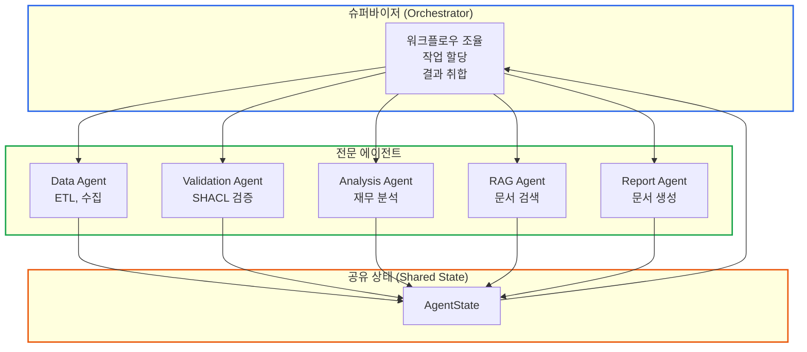

### 비교: 단일 vs 멀티

| 기준 | 단일 에이전트 | 멀티 에이전트 |
|------|-------------|--------------|
| **복잡도 관리** | 하나의 거대한 프롬프트 | 역할별 분리된 프롬프트 |
| **병렬 처리** | 불가 | 독립 작업 동시 실행 |
| **확장성** | 새 기능 추가 어려움 | 새 에이전트 추가 용이 |
| **유지보수** | 전체 수정 필요 | 해당 에이전트만 수정 |
| **재사용** | 불가 | 다른 시스템에 활용 |
| **테스트** | 통합 테스트만 | 에이전트별 단위 테스트 |

---

## 협업 패턴

### 패턴 1: 슈퍼바이저 패턴 (Supervisor)

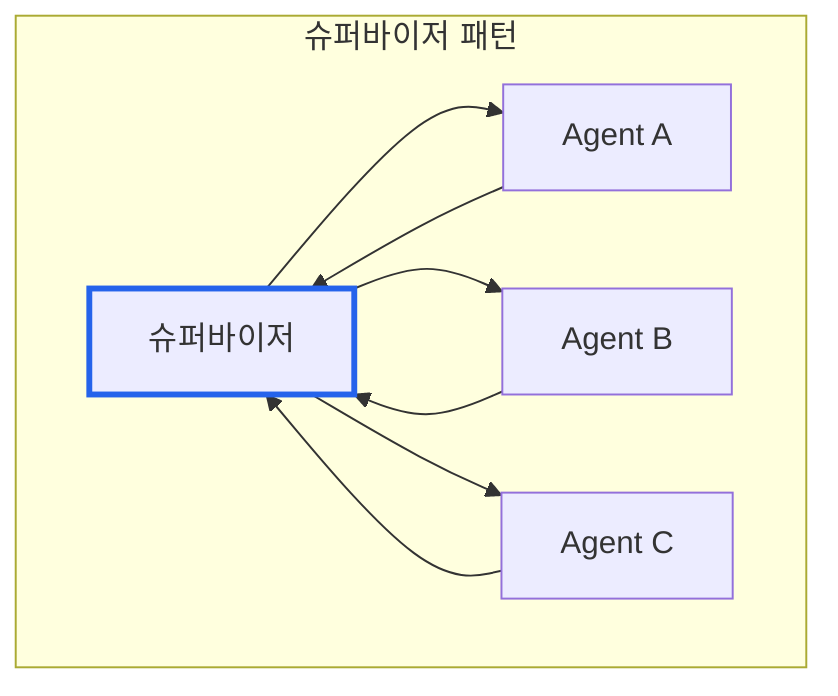

**특징**:
- 중앙 집중식 조율
- 슈퍼바이저가 다음 에이전트 결정
- 에이전트 간 직접 통신 없음

**적합 상황**: 명확한 워크플로우, 순차적 의존성

### 패턴 2: 체인 패턴 (Chain)

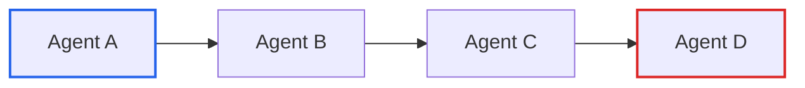

**특징**:
- 선형 흐름
- 각 에이전트가 다음 에이전트 호출
- 단순하지만 유연성 부족

**적합 상황**: 고정된 순서, 단계별 처리

### 패턴 3: 협업 패턴 (Collaboration)

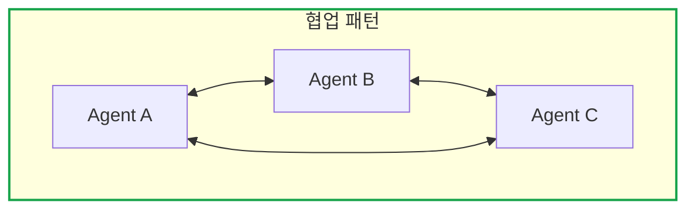

**특징**:
- 에이전트 간 직접 통신
- 유연하지만 복잡
- 데드락 위험

**적합 상황**: 동적 협업, 협상이 필요한 작업

### 이 시스템의 선택: 슈퍼바이저 패턴

세무 분석은 명확한 단계가 있다: 데이터 수집 → 검증 → 분석 → RAG → 리포트. **슈퍼바이저 패턴**이 적합하다. 단, 분석과 RAG는 서로 독립적이므로 병렬 실행을 고려한다.

---

## 에이전트 역할 설계

### 역할 분담 원칙

| 원칙 | 설명 |
|------|------|
| **단일 책임** | 각 에이전트는 하나의 역할만 |
| **명확한 입출력** | 입력과 출력 스키마 정의 |
| **독립성** | 다른 에이전트 구현에 의존하지 않음 |
| **교체 가능** | 동일 인터페이스의 다른 구현으로 대체 가능 |

### 에이전트 정의

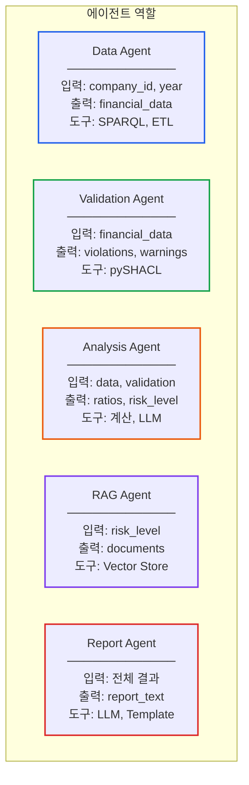

### 역할별 상세

| 에이전트 | 책임 | 입력 | 출력 | 사용 도구 |
|---------|------|------|------|----------|
| **Data** | 데이터 수집 및 변환 | 회사 ID, 연도 | 재무 데이터 | SPARQL, RDFLib |
| **Validation** | 비즈니스 규칙 검증 | 재무 데이터 | 위반/경고 목록 | pySHACL |
| **Analysis** | 재무 분석 및 평가 | 데이터, 검증 결과 | 비율, 위험 수준 | 계산, LLM |
| **RAG** | 관련 문서 검색 | 위험 수준, 컨텍스트 | 관련 문서 | Vector DB |
| **Report** | 최종 리포트 생성 | 전체 결과 | 리포트 텍스트 | LLM, Jinja2 |

---

## 공유 상태 설계

### 상태의 역할

에이전트 간 직접 통신 대신 **공유 상태**를 통해 데이터를 교환한다. 각 에이전트는 상태를 읽고, 자신의 결과를 상태에 기록한다.

```
┌─────────────────────────────────────────────────────────┐
│                    공유 상태 (State)                     │
├─────────────────────────────────────────────────────────┤
│  입력:                                                  │
│    - company_id: str                                   │
│    - fiscal_year: int                                  │
│                                                        │
│  에이전트 결과:                                         │
│    - data_result: dict (Data Agent)                   │
│    - validation_result: dict (Validation Agent)       │
│    - analysis_result: dict (Analysis Agent)           │
│    - rag_result: dict (RAG Agent)                     │
│    - report_result: str (Report Agent)                │
│                                                        │
│  워크플로우:                                            │
│    - next_agent: str                                   │
│    - completed_agents: list[str]                      │
│    - errors: list[str]                                │
│    - has_critical_error: bool                         │
└─────────────────────────────────────────────────────────┘
```

### 상태 전이

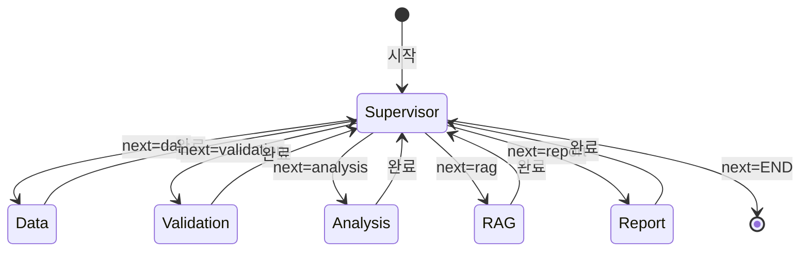

### 불변성 원칙

각 에이전트는 **자신의 결과 필드만 기록**한다. 다른 에이전트의 결과를 수정하지 않는다.

| 에이전트 | 읽기 가능 | 쓰기 가능 |
|---------|----------|----------|
| Data | company_id, fiscal_year | data_result |
| Validation | data_result | validation_result |
| Analysis | data_result, validation_result | analysis_result |
| RAG | analysis_result | rag_result |
| Report | 전체 | report_result |

---

## 슈퍼바이저 설계

### 슈퍼바이저의 책임

1. **다음 에이전트 결정**: 현재 상태를 보고 다음에 실행할 에이전트 선택
2. **에러 처리**: 크리티컬 에러 시 워크플로우 중단
3. **완료 판단**: 모든 에이전트가 완료되면 종료

### 결정 로직

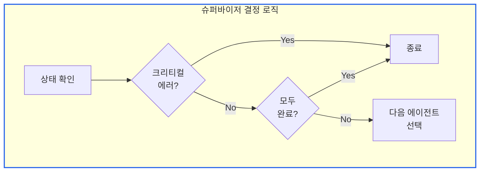

### 실행 순서 결정

```
기본 순서: data → validation → analysis → rag → report

조건부 분기:
- validation에서 Critical 위반 발생 → 바로 report로 (에러 리포트)
- analysis와 rag는 병렬 실행 가능 (서로 독립)
```

---

## 워크플로우 실행 흐름

### 정상 흐름

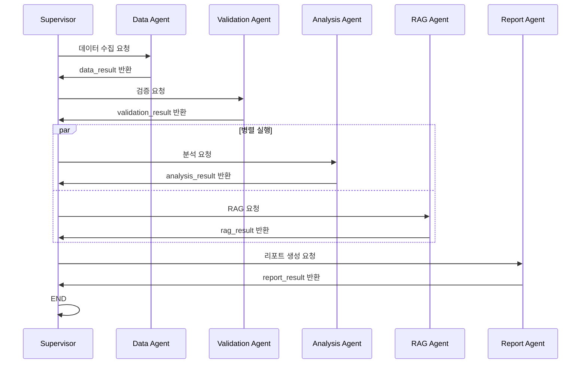

### 에러 처리 흐름

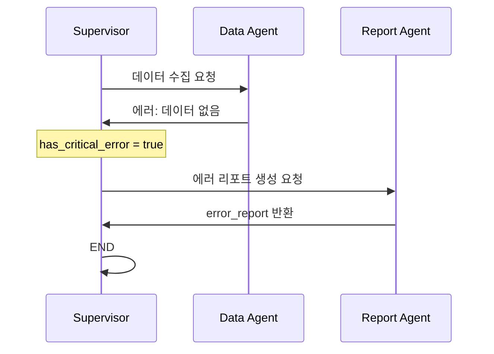

---

## 병렬 실행 설계

### 독립 에이전트 식별

```
의존성 그래프:
                    ┌─────────────┐
                    │    Data     │
                    └──────┬──────┘
                           │
                    ┌──────▼──────┐
                    │ Validation  │
                    └──────┬──────┘
                           │
              ┌────────────┼────────────┐
              │                         │
       ┌──────▼──────┐           ┌──────▼──────┐
       │  Analysis   │           │     RAG     │
       └──────┬──────┘           └──────┬──────┘
              │                         │
              └────────────┬────────────┘
                           │
                    ┌──────▼──────┐
                    │   Report    │
                    └─────────────┘

Analysis와 RAG는 서로 의존하지 않음 → 병렬 실행 가능
```

### 병렬 실행 아키텍처

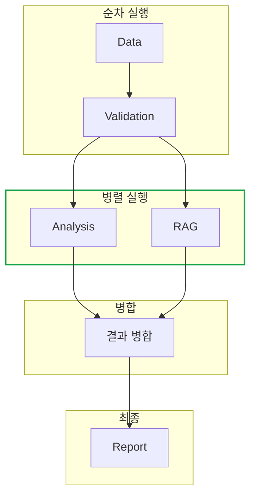

### 병합 전략

병렬 실행된 에이전트의 결과를 어떻게 병합할 것인가?

| 전략 | 설명 | 적용 |
|------|------|------|
| **대기 후 병합** | 모든 병렬 에이전트 완료 대기 | 이 시스템 |
| **먼저 완료된 것 사용** | 첫 번째 결과만 사용 | 속도 우선 |
| **다수결** | 여러 결과 중 합의 | 신뢰성 우선 |

---

## LangGraph 구현 아키텍처

### 그래프 구조

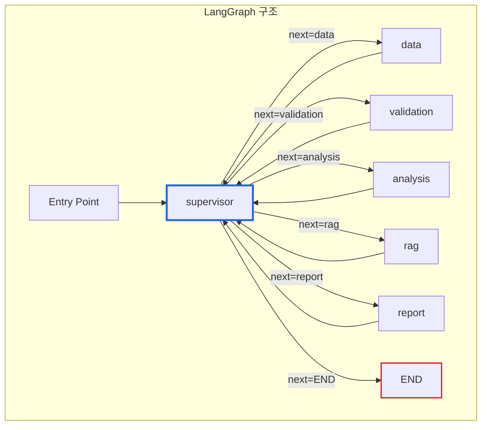

### 조건부 엣지

슈퍼바이저에서 다음 노드로의 분기는 **조건부 엣지(Conditional Edge)**로 구현한다.

```
조건부 엣지 설정:
- 시작점: supervisor
- 조건 함수: decide_next(state) -> str
- 분기 매핑:
    "data" → data 노드
    "validation" → validation 노드
    "analysis" → analysis 노드
    "rag" → rag 노드
    "report" → report 노드
    "END" → 종료
```

---

## 에이전트 인터페이스

### 표준 인터페이스

모든 에이전트는 동일한 인터페이스를 따른다.

```
Agent Protocol:
├── run(state: State) -> StateUpdate
│   └── 상태를 받아서 업데이트를 반환
├── can_run(state: State) -> bool
│   └── 실행 가능 여부 판단
└── get_name() -> str
    └── 에이전트 식별자
```

### 상태 업데이트 규칙

에이전트는 전체 상태를 반환하지 않고, **변경된 부분만** 반환한다.

```
입력 상태:
{
    "company_id": "A노무법인",
    "fiscal_year": 2024,
    "data_result": None,
    ...
}

Data Agent 반환 (변경 부분만):
{
    "data_result": {...},
    "messages": ["데이터 수집 완료"],
    "next_agent": "validation"
}

LangGraph가 자동으로 병합
```

---

## 에러 전파 및 복구

### 에러 수준 정의

| 수준 | 설명 | 처리 |
|------|------|------|
| **Critical** | 진행 불가 | 워크플로우 중단, 에러 리포트 |
| **Error** | 해당 에이전트 실패 | 재시도 또는 건너뛰기 |
| **Warning** | 주의 필요 | 로깅 후 계속 |

### 에러 처리 흐름

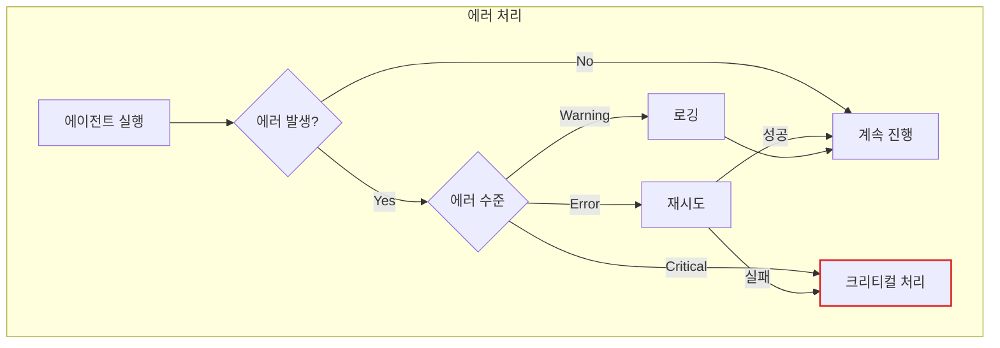

### 재시도 정책

| 에이전트 | 재시도 횟수 | 백오프 | 이유 |
|---------|-----------|--------|------|
| Data | 3 | 지수 | 네트워크 일시 오류 |
| Validation | 1 | 없음 | 결정적 로직 |
| Analysis | 2 | 선형 | LLM 일시 오류 |
| RAG | 2 | 선형 | 벡터 DB 연결 |
| Report | 2 | 선형 | LLM 일시 오류 |

---

## 성능 최적화

### 실행 시간 분석

```
예상 실행 시간:
├── Data Agent: 5-10초 (SPARQL 쿼리)
├── Validation Agent: 2-5초 (SHACL 검증)
├── Analysis Agent: 10-20초 (LLM 호출)
├── RAG Agent: 5-10초 (벡터 검색)
└── Report Agent: 15-30초 (LLM 생성)

순차 실행: 37-75초
병렬 최적화 (Analysis + RAG): 32-60초 (약 15% 단축)
```

### 최적화 전략

| 전략 | 효과 | 복잡도 |
|------|------|--------|
| **병렬 실행** | 15-20% 단축 | 중 |
| **LLM 캐싱** | 반복 호출 시 90% 단축 | 낮음 |
| **스트리밍** | 체감 속도 향상 | 중 |
| **프리페칭** | 대기 시간 감소 | 높음 |

---

## 핵심 정리

### 멀티 에이전트 아키텍처 요약

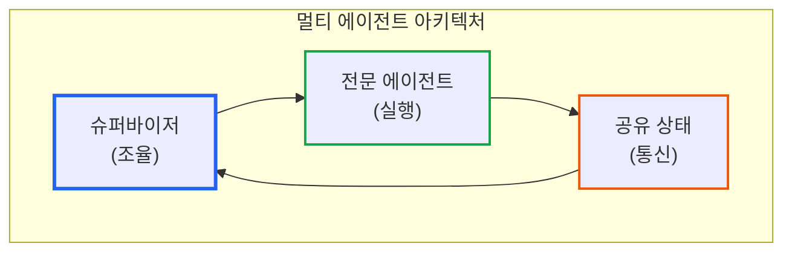

### 설계 원칙 정리

| 원칙 | 적용 |
|------|------|
| **역할 분리** | 5개의 전문 에이전트 |
| **간접 통신** | 공유 상태를 통한 데이터 교환 |
| **중앙 조율** | 슈퍼바이저가 워크플로우 관리 |
| **장애 격리** | 한 에이전트 실패가 전체로 전파되지 않음 |
| **확장성** | 새 에이전트 추가 용이 |

---

## 다음 단계 미리보기

**20부: 배포와 운영: 프로덕션 가이드**

시리즈 마지막으로 **운영 환경의 현실적인 문제**를 다룬다:
- 모니터링 지표: 무엇을 측정해야 하는가?
- 비용 최적화: LLM 비용을 어떻게 관리하는가?
- 장애 대응: 장애 발생 시 어떻게 복구하는가?

---

## 참고 자료

### 멀티 에이전트 패턴
- [LangGraph Multi-Agent Tutorial](https://langchain-ai.github.io/langgraph/tutorials/multi_agent/)
- [Supervisor Pattern](https://langchain-ai.github.io/langgraph/tutorials/multi_agent/supervisor/)

### 분산 시스템
- [Actor Model](https://en.wikipedia.org/wiki/Actor_model)
- [Microservices Patterns](https://microservices.io/patterns/)

### 관련 시리즈
- [이전: 월간 리포트 자동 생성 파이프라인](https://blog.imprun.dev/138)
- [다음: 배포와 운영: 프로덕션 가이드](https://blog.imprun.dev/140)
- [시리즈 목차](https://blog.imprun.dev/120)
