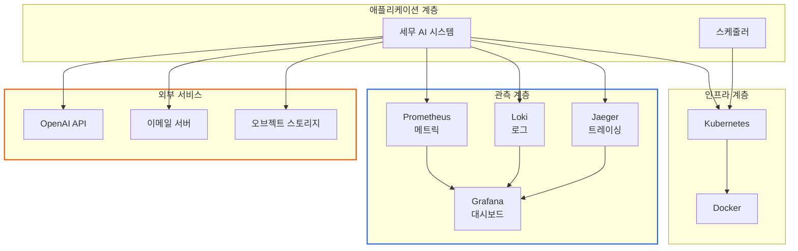
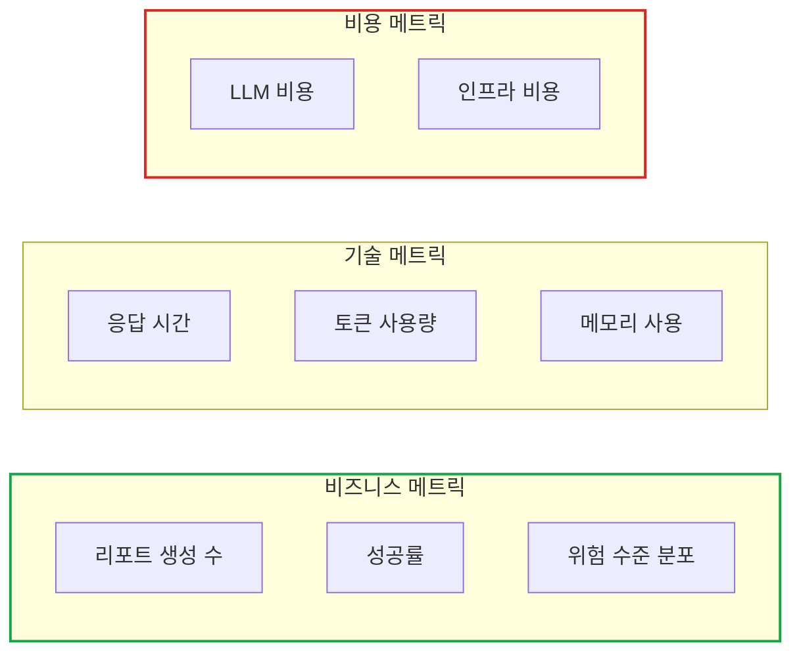
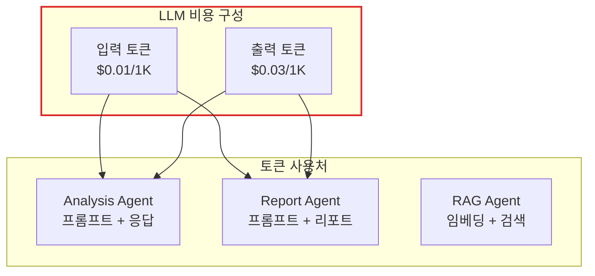
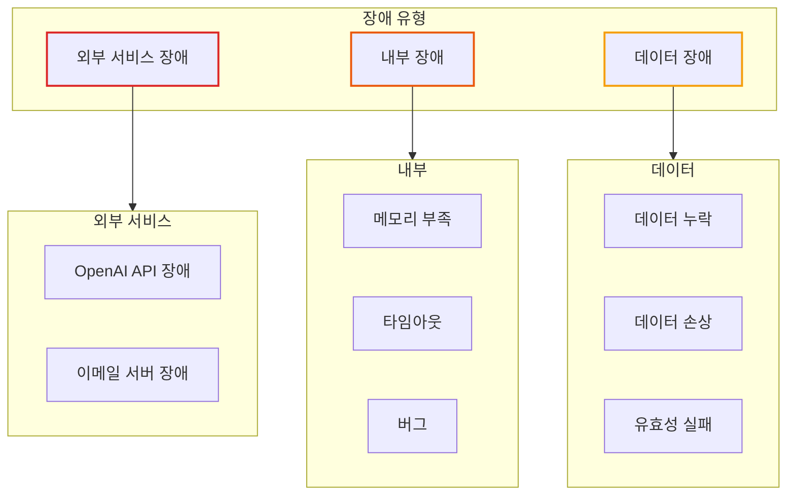
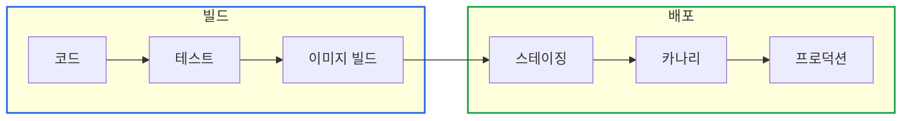
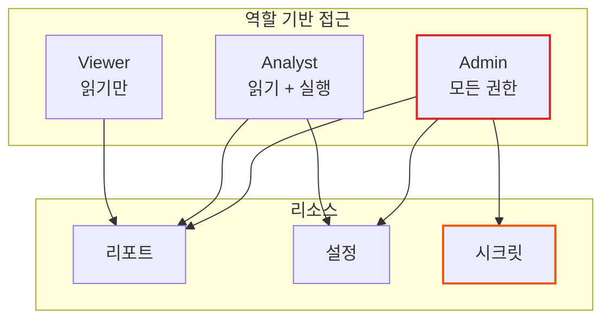
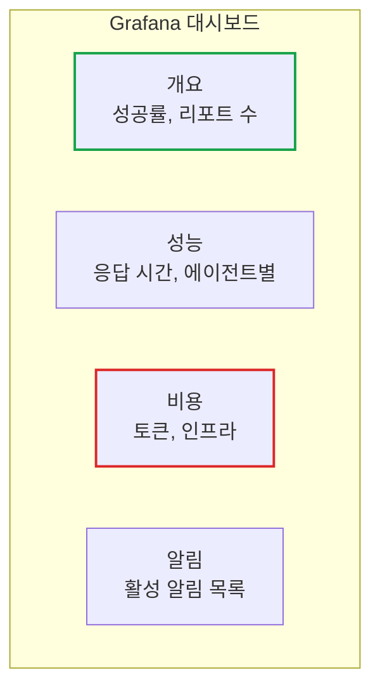
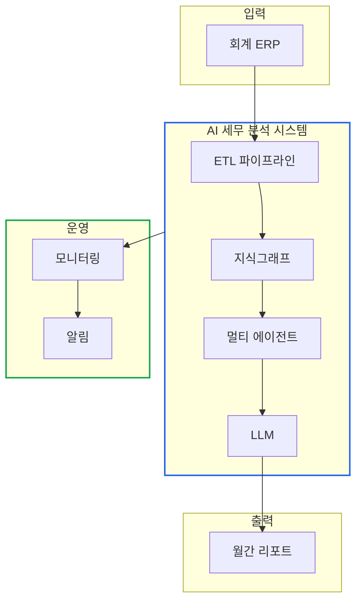

# 배포와 운영: 프로덕션 가이드

> **작성일**: 2026년 1월 9일
> **카테고리**: Operations, Production, DevOps
> **키워드**: 운영, 모니터링, 비용 최적화, 장애 대응, 배포
> **시리즈**: [온톨로지 + AI 에이전트: 세무 컨설팅 시스템 아키텍처](https://blog.imprun.dev/120) (20부/총 20부)
> **대상 독자**: 온톨로지에 입문하는 시니어 개발자

## 핵심 질문

> **"모니터링, 비용 최적화, 장애 대응은?"**

시스템을 구현하는 것과 운영하는 것은 다르다. 이 글에서는 개발 환경을 벗어나 **프로덕션에서 실제로 운영**할 때 마주하는 문제들을 다룬다. 무엇을 모니터링해야 하는가? LLM 비용을 어떻게 관리하는가? 장애가 발생하면 어떻게 대응하는가?

---

## 요약

프로덕션 운영의 핵심은 **가시성(Observability)**, **비용 통제**, **장애 복원력**이다. 모니터링은 "측정하지 않으면 관리할 수 없다"는 원칙을 따른다. LLM 비용은 캐싱과 모델 선택으로 관리한다. 장애 대응은 사전 계획과 런북(Runbook)으로 준비한다. 이 글에서는 AI 세무 컨설팅 시스템의 운영 관점 아키텍처를 다룬다.

---

## 운영 아키텍처 개요

### 프로덕션 구성 요소



### 운영 요소 책임

| 요소 | 책임 | 도구 |
|------|------|------|
| **메트릭** | 숫자 지표 수집 | Prometheus |
| **로그** | 이벤트 기록 | Loki, Structlog |
| **트레이싱** | 요청 추적 | Jaeger, OpenTelemetry |
| **알림** | 이상 탐지 시 통보 | Alertmanager, PagerDuty |
| **대시보드** | 시각화 | Grafana |

---

## 모니터링 전략

### 무엇을 측정해야 하는가?

#### RED Method (서비스 관점)

| 지표 | 설명 | 측정 대상 |
|------|------|----------|
| **Rate** | 초당 요청 수 | API 호출, 리포트 생성 |
| **Error** | 에러율 | 실패한 파이프라인 비율 |
| **Duration** | 지연 시간 | 리포트 생성 소요 시간 |

#### USE Method (리소스 관점)

| 지표 | 설명 | 측정 대상 |
|------|------|----------|
| **Utilization** | 사용률 | CPU, Memory, Disk |
| **Saturation** | 포화도 | 대기열 길이, 지연 |
| **Errors** | 에러 수 | 시스템 에러 카운트 |

### 핵심 메트릭 정의



### 메트릭 구조

| 카테고리 | 메트릭 이름 | 타입 | 라벨 |
|---------|-----------|------|------|
| **파이프라인** | `tax_report_total` | Counter | company_id, status |
| **파이프라인** | `tax_report_duration_seconds` | Histogram | company_id |
| **에이전트** | `tax_agent_execution_seconds` | Histogram | agent_name |
| **LLM** | `tax_llm_tokens_total` | Counter | model, type(input/output) |
| **LLM** | `tax_llm_cost_usd` | Counter | model |
| **에러** | `tax_error_total` | Counter | error_type, agent |

---

## 로깅 전략

### 구조화된 로깅

로그는 **구조화된 JSON 형식**으로 기록한다. grep 검색이 아닌 쿼리 기반 분석이 가능해진다.

```
비구조화 로그 (Bad):
2026-01-09 09:00:15 INFO Report generated for A노무법인

구조화 로그 (Good):
{
  "timestamp": "2026-01-09T09:00:15Z",
  "level": "info",
  "event": "report_generated",
  "company_id": "A노무법인",
  "fiscal_year": 2024,
  "duration_ms": 45230,
  "risk_level": "MEDIUM",
  "trace_id": "abc123"
}
```

### 로그 레벨 가이드

| 레벨 | 용도 | 예시 |
|------|------|------|
| **ERROR** | 즉시 조치 필요 | 파이프라인 실패, API 오류 |
| **WARN** | 주의 필요, 동작은 계속 | SHACL 경고, 재시도 발생 |
| **INFO** | 정상 비즈니스 이벤트 | 리포트 생성 완료, 이메일 발송 |
| **DEBUG** | 개발/디버깅용 | SPARQL 쿼리, 중간 결과 |

### 컨텍스트 전파

여러 에이전트를 거치는 요청을 추적하기 위해 **trace_id**를 전파한다.

```
┌──────────────────────────────────────────────────────────┐
│ trace_id: "abc123"                                       │
├──────────────────────────────────────────────────────────┤
│ [Data Agent]     → {"trace_id": "abc123", ...}          │
│ [Validation Agent] → {"trace_id": "abc123", ...}        │
│ [Analysis Agent] → {"trace_id": "abc123", ...}          │
│ [Report Agent]   → {"trace_id": "abc123", ...}          │
└──────────────────────────────────────────────────────────┘
```

---

## 비용 최적화

### LLM 비용 구조



### 비용 최적화 전략

#### 1. 캐싱

| 캐시 대상 | TTL | 예상 절감 |
|----------|-----|----------|
| **동일 회사 분석** | 24시간 | 70-80% |
| **인사이트 생성** | 1시간 | 30-40% |
| **임베딩** | 영구 | 90% |

#### 2. 모델 선택

| 작업 | 모델 | 이유 |
|------|------|------|
| **인사이트 생성** | GPT-4 | 고품질 필요 |
| **데이터 정리** | GPT-3.5 | 단순 작업 |
| **요약** | GPT-3.5 | 비용 대비 충분한 품질 |

#### 3. 프롬프트 최적화

```
최적화 전:
- 긴 시스템 프롬프트 (2000 토큰)
- 전체 컨텍스트 매번 전송

최적화 후:
- 압축된 프롬프트 (500 토큰)
- 필요한 컨텍스트만 선택적 전송

예상 토큰 절감: 60%
```

### 비용 모니터링

```
일일 비용 알림 기준:
├── 정상: < $10/day
├── 주의: $10-30/day → Slack 알림
└── 위험: > $30/day → PagerDuty 알림
```

### 월간 비용 예측

| 항목 | 단가 | 월간 사용량 | 월 비용 |
|------|------|-----------|--------|
| **GPT-4 입력** | $0.01/1K | 500K 토큰 | $5 |
| **GPT-4 출력** | $0.03/1K | 200K 토큰 | $6 |
| **임베딩** | $0.0001/1K | 100K 토큰 | $0.01 |
| **인프라** | - | - | $20-50 |
| **합계** | | | **$31-61** |

---

## 장애 대응

### 장애 유형 분류



### 장애 대응 런북

#### 시나리오 1: OpenAI API 장애

```
증상: LLM 호출 실패, 타임아웃

진단:
1. OpenAI 상태 페이지 확인 (status.openai.com)
2. 로그에서 에러 패턴 확인
3. 재시도 로직 동작 확인

대응:
1. [자동] 재시도 3회 (지수 백오프)
2. [자동] 폴백 모델로 전환 (GPT-4 → GPT-3.5)
3. [수동] 30분 이상 지속 시 이메일 발송 지연 알림

복구 확인:
- tax_llm_error_total 메트릭 감소
- 정상 리포트 생성 확인
```

#### 시나리오 2: 리포트 생성 실패

```
증상: 특정 기업 리포트 생성 실패

진단:
1. 해당 trace_id로 로그 검색
2. 실패 에이전트 식별
3. 입력 데이터 검증

대응:
1. [자동] 에러 리포트 생성 (관리자 통보)
2. [수동] 원인 분석 및 데이터 수정
3. [수동] 수동 재실행

복구 확인:
- 해당 기업 리포트 정상 생성
- tax_report_total{status="success"} 증가
```

#### 시나리오 3: 스케줄러 미실행

```
증상: 매월 1일 리포트 미생성

진단:
1. CronJob 상태 확인 (kubectl get cronjobs)
2. 스케줄러 Pod 로그 확인
3. 최근 Job 실행 이력 확인

대응:
1. [수동] Job 수동 트리거
2. [수동] 스케줄러 재시작
3. [수동] CronJob 설정 검증

예방:
- 스케줄러 heartbeat 메트릭 모니터링
- 매월 1일 09:30까지 리포트 미생성 시 알림
```

### 에스컬레이션 매트릭스

| 심각도 | 정의 | 대응 시간 | 알림 채널 |
|--------|------|----------|----------|
| **P1** | 전체 서비스 중단 | 15분 | PagerDuty, 전화 |
| **P2** | 주요 기능 장애 | 1시간 | Slack, 이메일 |
| **P3** | 부분 기능 저하 | 4시간 | Slack |
| **P4** | 사소한 이슈 | 1일 | Jira |

---

## 배포 전략

### 배포 파이프라인



### 롤백 전략

| 상황 | 롤백 방법 | 소요 시간 |
|------|----------|----------|
| **이미지 문제** | 이전 버전 재배포 | 2-5분 |
| **설정 문제** | ConfigMap 롤백 | 1분 |
| **데이터 문제** | 스냅샷 복원 | 5-15분 |

### 배포 체크리스트

```
배포 전:
□ 모든 테스트 통과
□ 스테이징 환경 검증
□ 롤백 계획 준비
□ 온콜 엔지니어 확인

배포 중:
□ 카나리 배포 (10% 트래픽)
□ 에러율 모니터링
□ 응답 시간 모니터링

배포 후:
□ 전체 트래픽 전환
□ 30분 관찰
□ 배포 완료 알림
```

---

## 보안 고려사항

### 민감 정보 관리

| 데이터 | 저장 위치 | 암호화 |
|--------|----------|--------|
| **API 키** | Kubernetes Secret | Base64 + SOPS |
| **재무 데이터** | 암호화된 볼륨 | AES-256 |
| **리포트** | 오브젝트 스토리지 | 서버 측 암호화 |

### 접근 제어



### 감사 로그

모든 민감한 작업은 감사 로그에 기록한다.

```
기록 대상:
- 리포트 생성/조회
- 설정 변경
- 사용자 인증
- API 키 사용

로그 보존: 1년
```

---

## 용량 계획

### 현재 규모

| 지표 | 현재 | 예상 성장 |
|------|------|----------|
| 기업 수 | 10 | +5/월 |
| 월간 리포트 | 10 | +5/월 |
| 스토리지 | 1GB | +100MB/월 |
| LLM 토큰 | 700K/월 | +200K/월 |

### 확장 트리거

| 지표 | 임계값 | 조치 |
|------|--------|------|
| **CPU** | 70% | 스케일 아웃 |
| **Memory** | 80% | 스케일 업 또는 아웃 |
| **리포트 큐** | 10개 대기 | 병렬 처리 활성화 |

### 병목 지점

```
현재 병목:
1. LLM 호출 (직렬화) → 캐싱으로 완화
2. PDF 생성 (CPU 집약) → 수평 확장

미래 병목 (기업 100개 이상):
1. 스케줄러 동시 실행 → 분산 스케줄러
2. 지식그래프 크기 → 샤딩 또는 분리
```

---

## 운영 대시보드

### 대시보드 구성



### 주요 패널

| 패널 | 내용 | 새로고침 |
|------|------|---------|
| **리포트 성공률** | 24시간 성공/실패 비율 | 1분 |
| **평균 생성 시간** | p50, p90, p99 | 1분 |
| **LLM 비용** | 일별 누적 비용 | 5분 |
| **에러 로그** | 최근 에러 목록 | 10초 |
| **활성 작업** | 현재 실행 중인 파이프라인 | 10초 |

---

## 핵심 정리

### 운영 원칙

| 원칙 | 적용 |
|------|------|
| **측정** | 측정하지 않으면 관리할 수 없다 |
| **자동화** | 반복 작업은 자동화한다 |
| **문서화** | 런북으로 장애 대응 표준화 |
| **사전 대응** | 알림으로 문제 조기 탐지 |

### 운영 체크리스트

```
일간:
□ 대시보드 리뷰 (5분)
□ 알림 검토

주간:
□ 비용 리뷰
□ 에러 트렌드 분석
□ 용량 검토

월간:
□ 전체 시스템 리뷰
□ 런북 업데이트
□ 보안 패치 적용
```

---

## 시리즈 마무리

### 20부작 완료 요약

| Part | 주제 | 핵심 내용 |
|------|------|----------|
| **A (1-4)** | 기초 개념 | 온톨로지, 지식그래프, AI 에이전트, 아키텍처 |
| **B (5-9)** | 지식 표현 | RDF, OWL, SPARQL, SHACL, 재무제표 온톨로지 |
| **C (10-13)** | LangChain | 체인, RAG, LangGraph, 커스텀 도구 |
| **D (14-17)** | 세무 적용 | ETL, 분석 규칙, GraphRAG, 분석 에이전트 |
| **E (18-20)** | 시스템 통합 | 파이프라인, 멀티 에이전트, 프로덕션 운영 |

### 전체 아키텍처 회고



### 확장 방향

- **멀티테넌트**: 여러 세무법인 지원
- **실시간 분석**: 스트리밍 데이터 처리
- **대화형 인터페이스**: 음성/텍스트 질의응답
- **자동 개선**: 피드백 기반 모델 개선

---

## 참고 자료

### 운영
- [Site Reliability Engineering](https://sre.google/sre-book/table-of-contents/)
- [Prometheus Documentation](https://prometheus.io/docs/)
- [Grafana Documentation](https://grafana.com/docs/)

### 보안
- [OWASP Security Guidelines](https://owasp.org/)
- [Kubernetes Security Best Practices](https://kubernetes.io/docs/concepts/security/)

### 관련 시리즈
- [이전: 멀티 에이전트 협업 시스템](https://blog.imprun.dev/139)
- [시리즈 목차](https://blog.imprun.dev/120)

---

## 시리즈 전체 목차

1. [온톨로지란 무엇인가](https://blog.imprun.dev/121)
2. [지식그래프 입문](https://blog.imprun.dev/120)
3. [AI 에이전트 개념](https://blog.imprun.dev/123)
4. [세무 AI 시스템 아키텍처](https://blog.imprun.dev/124)
5. [RDF 기초](https://blog.imprun.dev/125)
6. [OWL로 세무 용어 정의하기](https://blog.imprun.dev/126)
7. [SPARQL 쿼리 마스터하기](https://blog.imprun.dev/127)
8. [SHACL 규칙으로 데이터 검증하기](https://blog.imprun.dev/128)
9. [재무제표 온톨로지 완성하기](https://blog.imprun.dev/129)
10. [LangChain 입문](https://blog.imprun.dev/130)
11. [RAG 구현](https://blog.imprun.dev/131)
12. [LangGraph로 상태 기반 에이전트](https://blog.imprun.dev/132)
13. [커스텀 도구 만들기](https://blog.imprun.dev/133)
14. [회계 ERP 데이터를 RDF로 변환하기](https://blog.imprun.dev/134)
15. [세무 분석 규칙 SHACL로 정의하기](https://blog.imprun.dev/135)
16. [GraphRAG: 지식그래프 + LLM 통합](https://blog.imprun.dev/136)
17. [세무 분석 에이전트 구현](https://blog.imprun.dev/137)
18. [월간 리포트 자동 생성 파이프라인](https://blog.imprun.dev/138)
19. [멀티 에이전트 협업 시스템](https://blog.imprun.dev/139)
20. [배포와 운영: 프로덕션 가이드](https://blog.imprun.dev/140) (현재)
