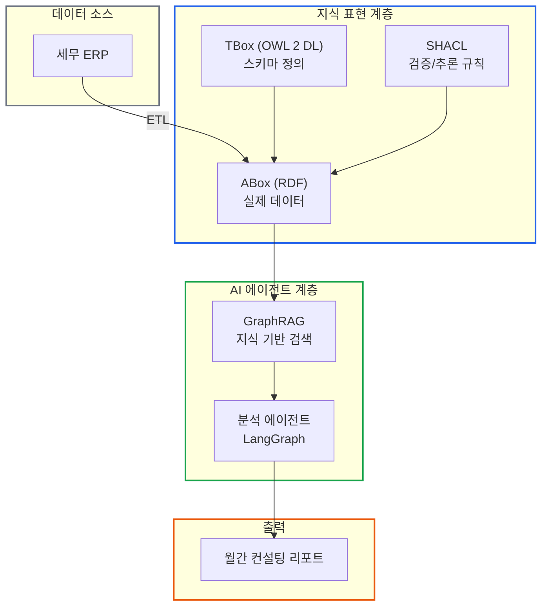

# 온톨로지 + AI 에이전트: 세무 컨설팅 시스템 아키텍처

> **작성일**: 2026년 1월 9일
> **카테고리**: AI, Ontology, Knowledge Graph, Tax Consulting
> **키워드**: 온톨로지, 지식그래프, AI 에이전트, SHACL, GraphRAG, LangGraph
> **블로그 URL**: https://blog.imprun.dev/120

> **시리즈**: 총 20부작
> **대상 독자**: 온톨로지에 입문하는 시니어 개발자
> **기술 스택**: Python, RDF/OWL 2 DL/SHACL, LangChain/LangGraph
> **초점**: 시스템 설계와 작동 원리 (코드 구현보다 아키텍처 이해)

---

## 시리즈 소개

이 시리즈는 **지식그래프(Knowledge Graph)와 AI 에이전트를 결합**하여 세무 데이터 기반 월간 컨설팅 리포트를 자동 생성하는 시스템의 **설계 원리**를 다룬다.

세무사가 기장한 기업의 재무제표, 세금 신고 내역 등 다양한 세무 정보를 수집하고, 이를 **온톨로지로 구조화**한 뒤, AI 에이전트가 분석하여 기업 대표에게 의미 있는 인사이트를 제공하는 것이 최종 목표다.

### 왜 지식그래프인가?

| 접근 방식 | 장점 | 한계 |
|----------|------|------|
| **LLM만 사용** | 자연스러운 대화, 범용성 | 환각(Hallucination), 계산 오류, 최신 데이터 부재 |
| **규칙 기반** | 정확한 계산, 일관성 | 유연성 부족, 자연어 처리 어려움 |
| **지식그래프 + LLM** | 정확성 + 유연성, 추론 가능 | 초기 구축 비용 |

---

## 전체 시스템 아키텍처



---

## 학습 경로

### 시맨틱 웹 경험자 (권장)

```
Part A (4편 훑어보기) → Part B 전체 → Part C → Part D → Part E
```

온톨로지 개념은 알지만 세무 도메인과 실제 적용이 궁금한 경우.

### 시맨틱 웹 처음인 시니어 개발자

```
Part A 전체 (정독) → Part B (5-8편) → Part D (14편) → Part C → Part D-E
```

RDF/OWL/SHACL 기초를 다지고, 실제 데이터 구조를 먼저 파악한 뒤 본격 설계로 진입.

### 빠른 구현 목표

```
4편 (아키텍처) → 8편 (ERP 데이터) → 14편 (ETL) → 16편 (GraphRAG) → 18-20편
```

전체 그림을 잡고 핵심 구현 포인트만 파악.

---

## 목차

### Part A: 기초 개념 (1-4편)

시스템의 철학적/기술적 기반. "왜 이렇게 설계하는가"의 답.

| # | 제목 | 핵심 질문 |
|---|------|----------|
| 1 | [온톨로지란 무엇인가: 데이터에 '의미'를 부여하는 기술](https://blog.imprun.dev/121) | 왜 데이터에 "의미"를 부여해야 하는가? |
| 2 | [지식그래프 입문: RDB vs Graph DB, 언제 무엇을 쓰는가](https://blog.imprun.dev/122) | 관계형 DB와 그래프 DB의 차이는? |
| 3 | [AI 에이전트 개념: 에이전트가 '도구'를 사용한다는 것의 의미](https://blog.imprun.dev/123) | 에이전트가 "도구"를 사용한다는 것의 의미는? |
| 4 | [세무 AI 시스템 아키텍처 설계: 전체 시스템을 어떻게 구성하는가](https://blog.imprun.dev/124) | 전체 시스템을 어떻게 구성하는가? |

### Part B: 지식 표현 기술 (5-9편)

온톨로지 설계의 핵심. TBox/ABox 분리와 SHACL 규칙.

| # | 제목 | 핵심 질문 |
|---|------|----------|
| 5 | [RDF 기초: 세계를 트리플로 표현하기](https://blog.imprun.dev/125) | (주어, 술어, 목적어)만으로 무엇을 표현할 수 있는가? |
| 6 | [OWL로 세무 용어 정의하기: TBox 설계](https://blog.imprun.dev/126) | 클래스 계층과 제약조건을 어떻게 정의하는가? |
| 7 | [SPARQL 쿼리 마스터하기](https://blog.imprun.dev/127) | 그래프 데이터를 어떻게 질의하는가? |
| 8 | [SHACL 규칙으로 데이터 검증하기](https://blog.imprun.dev/128) | 비즈니스 규칙을 어떻게 선언적으로 정의하는가? |
| 9 | [재무제표 온톨로지 완성하기](https://blog.imprun.dev/129) | BS/IS/CF를 온톨로지로 어떻게 통합하는가? |

### Part C: AI 프레임워크 (10-13편)

LangChain/LangGraph 기반 에이전트 설계.

| # | 제목 | 핵심 질문 |
|---|------|----------|
| 10 | [LangChain 아키텍처: 체인의 개념과 조합](https://blog.imprun.dev/130) | 체인의 개념과 조합 방법은? |
| 11 | [RAG와 GraphRAG: 검색 증강 생성의 아키텍처](https://blog.imprun.dev/131) | 검색 증강 생성의 아키텍처는? |
| 12 | [LangGraph 상태 기반 워크플로우: 그래프로 복잡한 추론 표현하기](https://blog.imprun.dev/132) | 복잡한 워크플로우를 어떻게 그래프로 표현하는가? |
| 13 | [에이전트 도구 설계: LLM이 사용하는 도구를 어떻게 만드는가](https://blog.imprun.dev/133) | 에이전트가 사용할 도구를 어떻게 설계하는가? |

### Part D: 세무 도메인 적용 (14-17편)

실제 ERP 데이터를 지식그래프로 변환하고 분석.

| # | 제목 | 핵심 질문 |
|---|------|----------|
| 14 | [회계 ERP 데이터를 RDF로 변환하기](https://blog.imprun.dev/134) | JSON → RDF 매핑 전략은? |
| 15 | [세무 분석 규칙 SHACL로 정의하기](https://blog.imprun.dev/135) | 부채비율 경고, 이상 탐지를 어떻게 규칙화하는가? |
| 16 | [GraphRAG: 지식그래프와 LLM의 시너지](https://blog.imprun.dev/136) | 구조화된 지식을 LLM 컨텍스트로 어떻게 활용하는가? |
| 17 | [세무 분석 에이전트 구축](https://blog.imprun.dev/137) | 자율적으로 분석하는 에이전트를 어떻게 설계하는가? |

### Part E: 시스템 통합 (18-20편)

프로덕션 배포와 운영.

| # | 제목 | 핵심 질문 |
|---|------|----------|
| 18 | [월간 리포트 자동 생성 파이프라인](https://blog.imprun.dev/138) | 데이터 수집부터 PDF 출력까지의 흐름은? |
| 19 | [멀티 에이전트 협업 시스템](https://blog.imprun.dev/139) | 여러 에이전트가 어떻게 협업하는가? |
| 20 | [배포와 운영: 프로덕션 가이드](https://blog.imprun.dev/140) | 모니터링, 비용 최적화, 장애 대응은? |

---

## 핵심 설계 결정

이 시리즈에서 다루는 주요 아키텍처 결정:

### 1. TBox/ABox 분리

```
TBox (스키마): "손익계산서는 매출, 비용, 순이익을 포함한다"
ABox (데이터): "A회사의 2024년 손익계산서의 매출은 52.9억이다"
```

스키마와 데이터를 분리하면 스키마 변경 없이 데이터 추가가 가능하다.

### 2. SHACL vs OWL 규칙

- **OWL**: 개념 정의 (클래스, 상속, 제약)
- **SHACL**: 데이터 검증 + 비즈니스 규칙

```
부채비율 > 200% → 경고 (SHACL Rule)
손익계산서 ⊂ 재무제표 (OWL SubClassOf)
```

### 3. GraphRAG vs 일반 RAG

- **일반 RAG**: 텍스트 청크 검색
- **GraphRAG**: 구조화된 관계 기반 검색

세무 데이터는 관계가 명확하므로 GraphRAG가 더 정확한 답변을 생성한다.

---

## 사용하는 ERP 데이터

이 시리즈는 실제 세무 ERP에서 추출한 다음 데이터를 사용한다:

| 카테고리 | 데이터 | 용도 |
|---------|-------|------|
| 기초정보 | 거래처, 계정과목, 회사정보 | 엔티티 정의 |
| 전표 | 일반전표, 매입매출전표 | 트랜잭션 기록 |
| 장부 | 분개장, 총계정원장, 거래처원장 | 집계 데이터 |
| 결산 | 손익계산서, 재무상태표, 제조원가명세서 | 재무제표 |
| 세무 | 세금계산서합계표, 부가가치세 | 세무 신고 |

---

## 사전 준비 사항

- Python 3.10 이상
- RDF/OWL 개념에 대한 기초 이해 (1-5편에서 다룸)
- (선택) GraphDB 또는 Apache Jena 설치

---

## 참고 자료

### 온톨로지/지식그래프
- [W3C RDF 1.1 Primer](https://www.w3.org/TR/rdf11-primer/)
- [W3C OWL 2 Web Ontology Language](https://www.w3.org/TR/owl2-overview/)
- [W3C SHACL Specification](https://www.w3.org/TR/shacl/)
- [Protege Ontology Editor](https://protege.stanford.edu/)

### LangChain/LangGraph
- [LangChain Documentation](https://python.langchain.com/)
- [LangGraph Documentation](https://langchain-ai.github.io/langgraph/)

### 재무/세무
- [한국채택국제회계기준(K-IFRS)](https://www.kasb.or.kr/)
- [일반기업회계기준](https://www.kasb.or.kr/)
- [법인세법](https://www.law.go.kr/)

---

### 시리즈 시작
- [다음: 온톨로지란 무엇인가](https://blog.imprun.dev/121)
