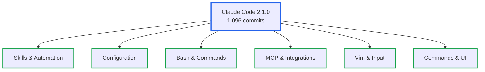
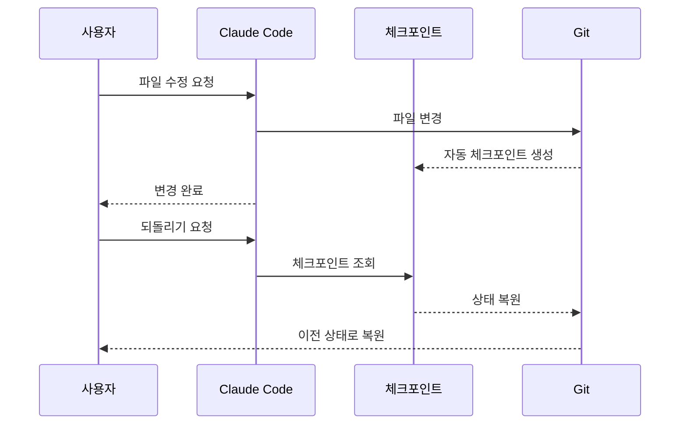

# Claude Code 2.1 릴리즈 노트 리뷰: 스킬 핫리로드부터 Vim 모션까지

> **작성일**: 2026년 1월 9일
> **카테고리**: Claude Code, AI, Developer Tools
> **키워드**: Claude Code, 2.1.0, 2.1.1, 스킬, Vim, MCP, 핫리로드

## 요약

Claude Code 2.1.0이 2026년 1월 7일 출시되었다. 1,096개의 커밋이 반영된 이번 업데이트는 스킬 시스템의 핫리로드, Vim 모션 확장, MCP 동적 업데이트 등 개발자 경험을 근본적으로 개선하는 기능들을 포함한다. 같은 날 배포된 2.1.1 긴급 패치에서는 체크포인팅 시스템이 강화되어 모든 파일 변경 시점에 자동 체크포인트가 생성된다. 이 글에서는 두 버전의 모든 변경사항을 카테고리별로 분석하고, 실무 적용 방안을 제시한다.

## 업데이트 개요: 1,096개 커밋의 의미

2.1.0 릴리스에 포함된 1,096개의 커밋은 Claude Code 역사상 가장 대규모 업데이트에 해당한다. 이전 버전인 2.0.x 시리즈가 안정화와 버그 수정에 집중했다면, 2.1.x는 기능 확장과 개발자 경험 개선에 초점을 맞추었다.

주요 변경 영역은 다음과 같이 분류된다:



## 신규 기능 상세 분석

### 1. Skills & Automation

#### 자동 스킬 핫리로드 (Hot Reload)

스킬 파일 변경 시 Claude Code 재시작 없이 즉시 반영되는 핫리로드 기능이 도입되었다. 스킬은 `~/.claude/skills` (전역) 또는 `.claude/skills` (프로젝트) 디렉토리에 위치한다.

```markdown
<!-- ~/.claude/skills/typescript-patterns.md -->
---
name: TypeScript 패턴 가이드
description: 프로젝트의 TypeScript 코딩 컨벤션
globs: ["**/*.ts", "**/*.tsx"]
---

# TypeScript 패턴

- 인터페이스 명명: `I` 접두사 사용 금지
- 타입 가드: `is` 접두사 사용
- 유니온 타입: 3개 이상 시 별도 타입 정의
```

파일을 저장하는 즉시 Claude Code가 변경을 감지하고 적용한다. 개발 중 스킬을 반복적으로 수정해야 하는 상황에서 생산성 향상을 기대할 수 있다.

#### Fork 서브에이전트 컨텍스트

스킬 프론트매터에 `context: fork` 설정을 추가하면 해당 스킬이 격리된 서브에이전트에서 실행된다. 이는 메인 컨텍스트를 오염시키지 않으면서 독립적인 작업을 수행해야 할 때 유용하다.

```markdown
---
name: 코드 리뷰 에이전트
context: fork
agent: task
---

# 코드 리뷰 수행

독립적인 컨텍스트에서 코드 리뷰를 수행한다.
메인 대화의 컨텍스트에 영향을 주지 않는다.
```

#### 훅 프론트매터 지원

스킬 및 슬래시 명령에서 `PreToolUse`, `PostToolUse`, `Stop` 훅을 정의할 수 있다. 도구 실행 전후에 특정 로직을 삽입하는 것이 가능해졌다.

```markdown
---
name: 배포 가드
hooks:
  PreToolUse:
    - command: "echo 'Deployment check initiated'"
  PostToolUse:
    - command: "notify-slack deployment-channel"
  Stop:
    - command: "cleanup-temp-files"
once: true
---
```

`once: true` 설정은 훅이 세션당 한 번만 실행되도록 제한한다.

### 2. Configuration & Language

#### 언어 설정 (language)

`settings.json`에서 Claude 응답 언어를 지정할 수 있다. 이전에는 프롬프트에서 언어를 명시적으로 요청해야 했으나, 이제 설정 한 번으로 모든 응답에 적용된다.

```json
{
  "language": "korean"
}
```

지원되는 언어 코드는 ISO 639-1 표준을 따른다. `korean`, `japanese`, `chinese`, `english` 등이 사용 가능하다.

#### respectGitignore 설정

프로젝트별로 `@` 멘션 파일 선택기의 동작을 제어한다.

```json
{
  "respectGitignore": true
}
```

`true`로 설정하면 `.gitignore`에 포함된 파일이 `@` 멘션 자동완성에서 제외된다. 대규모 프로젝트에서 `node_modules`나 빌드 산출물이 자동완성 목록을 오염시키는 문제를 해결한다.

#### CLAUDE_CODE_HIDE_ACCOUNT_INFO 환경변수

UI에서 이메일 및 조직 정보를 숨기는 환경변수가 추가되었다.

```bash
export CLAUDE_CODE_HIDE_ACCOUNT_INFO=true
```

화면 공유나 녹화 시 개인정보 노출을 방지하는 용도로 활용된다.

### 3. Bash & Commands

#### 와일드카드 패턴 매칭

Bash 도구 권한에 와일드카드(`*`)를 사용할 수 있게 되었다. 이전에는 각 명령어를 개별적으로 허용해야 했다.

```json
{
  "allowedTools": [
    "Bash(npm *)",
    "Bash(git * main)",
    "Bash(docker compose *)"
  ]
}
```

`Bash(npm *)` 설정은 `npm install`, `npm run`, `npm test` 등 모든 npm 명령을 한 번에 허용한다.

#### 통합 Ctrl+B 백그라운딩

Bash 명령과 에이전트를 `Ctrl+B`로 동시에 백그라운드로 전환할 수 있다. 장시간 실행되는 빌드나 테스트를 백그라운드에서 실행하면서 다른 작업을 계속할 수 있다.

```
> npm run build  # 실행 중 Ctrl+B 입력
[Background] npm run build running...

> # 다른 작업 계속 가능
```

#### 특정 에이전트 비활성화

`Task(AgentName)` 구문으로 특정 에이전트만 선택적으로 비활성화할 수 있다.

```json
{
  "disallowedTools": [
    "Task(CodeReviewAgent)",
    "Task(DeploymentAgent)"
  ]
}
```

또는 CLI 플래그로 지정한다:

```bash
claude --disallowedTools "Task(CodeReviewAgent)"
```

### 4. MCP & Integrations

#### MCP list_changed 알림

MCP 서버가 재연결 없이 동적으로 도구, 프롬프트, 리소스를 업데이트할 수 있게 되었다. 서버 측에서 `list_changed` 알림을 발송하면 클라이언트가 자동으로 목록을 갱신한다.

```typescript
// MCP 서버 측 코드 예시
server.sendNotification("notifications/tools/list_changed", {});
```

MCP 서버 개발자에게 유용한 기능이다. 런타임에 도구를 추가하거나 제거해도 사용자가 Claude Code를 재시작할 필요가 없다.

#### /teleport, /remote-env 명령

claude.ai 구독자를 위한 원격 세션 관리 명령이 추가되었다.

| 명령어 | 설명 |
|--------|------|
| `/teleport` | 로컬 세션을 claude.ai 웹으로 전송 |
| `/remote-env` | 원격 개발 환경 설정 관리 |

SSH 접속 환경이나 원격 서버에서 작업 중인 내용을 웹 인터페이스로 이어서 진행할 수 있다.

### 5. Vim & Input

Vim 모션 지원이 대폭 확장되었다. 이전 버전에서는 기본적인 이동 명령만 지원했으나, 2.1.0에서는 복사/붙여넣기, 텍스트 객체, 인덴트 조작까지 지원한다.

#### 추가된 Vim 모션

**반복 명령**:
- `;` - 마지막 f/F/t/T 검색 반복
- `,` - 마지막 f/F/t/T 검색 역방향 반복

**복사/붙여넣기**:
- `y` - 선택 영역 복사
- `yy` / `Y` - 현재 줄 복사
- `p` - 커서 뒤에 붙여넣기
- `P` - 커서 앞에 붙여넣기

**텍스트 객체**:

| 명령 | 설명 |
|------|------|
| `iw` / `aw` | 단어 내부/주변 |
| `iW` / `aW` | WORD 내부/주변 |
| `i"` / `a"` | 큰따옴표 내부/주변 |
| `i'` / `a'` | 작은따옴표 내부/주변 |
| `i(` / `a(` | 괄호 내부/주변 |
| `i[` / `a[` | 대괄호 내부/주변 |
| `i{` / `a{` | 중괄호 내부/주변 |

**인덴트 조작**:
- `>>` - 인덴트 증가
- `<<` - 인덴트 감소
- `J` - 다음 줄과 현재 줄 합치기

Vim 사용자라면 별도의 학습 없이 기존 근육 기억을 활용할 수 있다.

### 6. Commands & UI

#### /plan 명령

프롬프트 입력 중 `/plan` 명령으로 플랜 모드에 직접 진입할 수 있다.

```
> /plan API 리팩토링 계획 수립
```

이전에는 권한 요청 다이얼로그를 거쳐야 플랜 모드에 진입할 수 있었으나, 이제 즉시 진입이 가능하다.

#### 슬래시 명령 자동완성 개선

입력 필드 어디서든 `/`를 입력하면 자동완성이 작동한다. 문장 중간에서도 슬래시 명령을 트리거할 수 있다.

#### --tools 플래그

대화형 모드에서 내장 도구를 제한하는 플래그가 추가되었다.

```bash
claude --tools "Read,Write,Bash"
```

특정 작업에 필요한 도구만 활성화하여 불필요한 도구 사용을 방지한다.

## 주요 변경사항 (Changed)

### Shift+Enter 기본 동작

iTerm2, WezTerm, Ghostty, Kitty 터미널에서 `Shift+Enter`가 기본적으로 작동한다. 멀티라인 입력 시 별도 설정 없이 사용 가능하다.

### 권한 프롬프트 감소

복잡한 Bash 명령 실행 시 매번 권한을 요청하던 동작이 개선되었다. 한 번 허용한 패턴은 세션 내에서 재요청하지 않는다.

### 플랜 모드 진입

플랜 모드 진입 시 권한 요청 없이 즉시 진입이 가능해졌다. 작업 계획 수립 단계에서 불필요한 인터럽트가 제거되었다.

## 주요 버그 수정 (Fixed)

### 보안 관련

민감 데이터 노출 방지가 강화되었다. OAuth 토큰, API 키 등이 로그나 출력에 노출되던 문제가 수정되었다.

### 세션 관련

- 파일 및 스킬 발견 실패 문제 해결
- 붙여넣기 콘텐츠 손실 문제 해결
- 긴 세션에서 발생하던 메모리 누수 수정

### 터미널 관련

종료 시 키보드 모드가 초기화되지 않던 문제가 수정되었다. 이전에는 Claude Code 종료 후 터미널 입력이 비정상적으로 동작하는 경우가 있었다.

## 2.1.1 긴급 패치

2.1.0 배포 직후 109개의 CLI 개선 커밋이 포함된 2.1.1이 긴급 배포되었다.

### 체크포인팅 시스템 강화

모든 파일 변경 및 사용자 프롬프트마다 자동 체크포인트가 생성된다.



### 세션 되돌리기 (Revert)

이전 상태로 코드 변경 또는 전체 대화를 되돌릴 수 있다. 체크포인트 목록에서 원하는 시점을 선택하면 해당 상태로 복원된다.

```
> /revert
Available checkpoints:
1. [10:30:15] Before API refactoring
2. [10:25:42] Initial state
3. [10:20:11] After config update

Select checkpoint: 1
Reverting to checkpoint "Before API refactoring"...
```

## 실무 적용 가이드

### 스킬 활용 전략

프로젝트별 컨벤션과 패턴을 스킬로 정의하면 일관된 코드 품질을 유지할 수 있다.

```markdown
<!-- .claude/skills/project-conventions.md -->
---
name: 프로젝트 컨벤션
globs: ["**/*.ts", "**/*.tsx"]
---

# 코드 컨벤션

## 명명 규칙
- 컴포넌트: PascalCase
- 훅: use 접두사
- 유틸리티 함수: camelCase

## 파일 구조
- 컴포넌트당 하나의 파일
- 테스트 파일은 __tests__ 디렉토리
```

### 권한 설정 최적화

와일드카드 패턴을 활용하여 권한 설정을 단순화한다.

```json
{
  "allowedTools": [
    "Bash(npm *)",
    "Bash(pnpm *)",
    "Bash(git status)",
    "Bash(git diff *)",
    "Bash(git log *)"
  ],
  "disallowedTools": [
    "Bash(rm -rf *)",
    "Bash(git push --force *)"
  ]
}
```

### 언어 설정 적용

팀 단위로 동일한 언어 설정을 공유하려면 프로젝트 레벨 설정을 사용한다.

```json
// .claude/settings.json
{
  "language": "korean",
  "respectGitignore": true
}
```

## 참고 자료

### 공식 문서
- [Claude Code Changelog](https://github.com/anthropics/claude-code/blob/main/CHANGELOG.md)
- [Claude Code Releases](https://github.com/anthropics/claude-code/releases)
- [Claude Code Skills Documentation](https://code.claude.com/docs/en/skills)

### 관련 블로그
- [Claude Code 컨텍스트 최적화 실전 가이드](https://blog.imprun.dev/103)
- [CLAUDE.md 공식 가이드 정리: 프로젝트 컨텍스트 자동화](https://blog.imprun.dev/82)
- [Claude Code 베스트 프랙티스: Anthropic 공식 가이드 정리](https://blog.imprun.dev/83)
