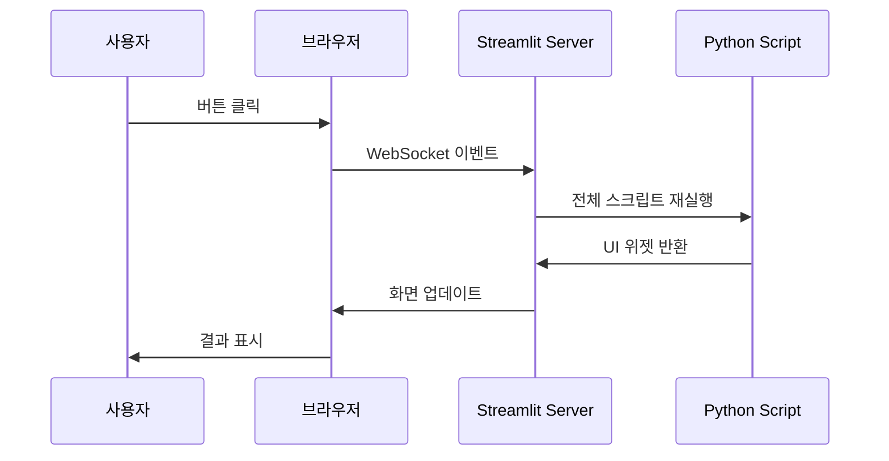

# Streamlit으로 테스트 도구 만들기: API 테스터 구축 실전 가이드

> **작성일**: 2026년 01월 09일
> **카테고리**: Python, Developer Tools, Testing
> **키워드**: Streamlit, Python, API Testing, Developer Experience, Internal Tools

## 요약

API 테스트 도구를 Postman이나 Insomnia 없이 Python만으로 만들 수 있다. Streamlit은 데이터 앱 구축 프레임워크로, 50줄 이내의 코드로 세션 관리와 API 호출 UI를 갖춘 테스트 도구를 만들 수 있다. 이 글에서는 Streamlit의 핵심 기능을 살펴보고, 실제 API Integration Tester 구현 사례를 통해 실무에서 활용하는 방법을 다룬다.

---

## 왜 Streamlit인가?

### Streamlit이란

Streamlit은 Python 스크립트를 인터랙티브 웹 애플리케이션으로 변환하는 프레임워크다. 2019년 오픈소스로 공개되었고, 2022년 Snowflake에 인수되었다. 원래 데이터 사이언티스트가 머신러닝 모델 데모나 데이터 대시보드를 빠르게 만들 수 있도록 설계되었다.

핵심 가치는 "Python만으로 웹 UI를 만든다"는 것이다. HTML, CSS, JavaScript 없이 Python 코드만으로 버튼, 입력 필드, 차트, 테이블이 있는 웹앱을 구축할 수 있다. 이 특성이 데이터 앱뿐 아니라 내부 도구 개발에도 적합하다.

### 내부 도구 개발의 선택지

개발 팀에서 API 테스트 도구가 필요할 때, 선택지는 몇 가지로 압축된다.

| 선택지 | 장점 | 단점 |
|--------|------|------|
| Postman/Insomnia | 완성도 높은 UI | 팀 공유 시 라이선스 비용, 커스터마이징 한계 |
| curl + 쉘 스크립트 | 가볍고 빠름 | UI 없음, 비개발자 사용 불가 |
| React/Vue 웹앱 | 완전한 커스터마이징 | 프론트엔드 개발 리소스 필요 |
| Streamlit | Python만으로 UI 구축 | 복잡한 인터랙션에는 부적합 |

Streamlit은 "Python 코드만으로 웹 UI를 만든다"는 단순한 전제에서 출발한다. 프론트엔드 지식 없이 데이터 사이언티스트가 대시보드를 만들 수 있도록 설계되었지만, 이 특성이 내부 도구 개발에 적합하다.

### 아키텍처 관점에서의 Streamlit

Streamlit의 실행 모델은 전통적인 웹 프레임워크와 다르다.



핵심은 **"사용자 인터랙션마다 전체 스크립트가 재실행된다"**는 점이다. React의 Virtual DOM이나 Vue의 반응형 시스템과 달리, Streamlit은 단순히 위에서 아래로 스크립트를 다시 실행한다. 이 단순함이 학습 곡선을 낮추지만, 상태 관리에서는 별도의 패턴이 필요하다.

### 적합한 사용 사례

Streamlit이 효과적인 영역:

- **데이터 대시보드**: 차트, 테이블, 필터 조합
- **내부 관리 도구**: CRUD 인터페이스, 로그 뷰어
- **API 테스트 클라이언트**: 요청/응답 시각화
- **프로토타입**: 아이디어 검증용 빠른 UI

Streamlit이 부적합한 영역:

- **실시간 협업 도구**: 복잡한 상태 동기화 필요
- **고도화된 인터랙션**: 드래그앤드롭, 복잡한 폼 검증
- **공개 서비스**: 성능과 보안 요구사항이 높은 경우

---

## 핵심 기능과 시작하기

### 설치와 첫 실행

```bash
pip install streamlit
```

첫 번째 앱을 만들어보자.

```python
# app.py
import streamlit as st

st.title("API Tester")
st.write("Streamlit으로 만든 첫 번째 테스트 도구")

url = st.text_input("API URL", "https://api.example.com/health")
method = st.selectbox("Method", ["GET", "POST", "PUT", "DELETE"])

if st.button("Send Request"):
    st.success(f"{method} 요청을 {url}로 전송")
```

실행:

```bash
streamlit run app.py
```

브라우저에서 `http://localhost:8501`이 자동으로 열린다. 12줄의 코드로 입력 필드, 드롭다운, 버튼이 있는 UI가 완성된다.

### 레이아웃 구성

실제 도구에서는 레이아웃 구성이 중요하다. Streamlit은 사이드바, 컬럼, 탭을 제공한다.

```python
import streamlit as st

# 사이드바: 설정, 네비게이션
with st.sidebar:
    st.header("Settings")
    base_url = st.text_input("Base URL", "https://api.example.com")
    timeout = st.slider("Timeout (sec)", 1, 30, 10)

# 메인 영역: 탭으로 구분
tab1, tab2, tab3 = st.tabs(["Request", "Response", "History"])

with tab1:
    col1, col2 = st.columns([3, 1])
    with col1:
        endpoint = st.text_input("Endpoint", "/users")
    with col2:
        method = st.selectbox("Method", ["GET", "POST"])

with tab2:
    st.json({"status": "waiting for request"})

with tab3:
    st.write("No history yet")
```

레이아웃 구조:

```
+------------------+--------------------------------+
|    Sidebar       |           Main Area            |
|                  | +----------------------------+ |
| [Settings]       | | Tab1 | Tab2 | Tab3        | |
| - Base URL       | +----------------------------+ |
| - Timeout        | |                            | |
|                  | |   [Endpoint] [Method]      | |
|                  | |   [Content Area]           | |
|                  | |                            | |
+------------------+--------------------------------+
```

### 상태 관리: st.session_state

Streamlit은 스크립트가 재실행될 때마다 변수가 초기화된다. 이 문제를 해결하는 것이 `st.session_state`다.

```python
import streamlit as st

# 세션 상태 초기화
if "request_history" not in st.session_state:
    st.session_state.request_history = []

if "auth_token" not in st.session_state:
    st.session_state.auth_token = None

# 상태 읽기/쓰기
def add_to_history(request_data):
    st.session_state.request_history.append(request_data)

def set_auth_token(token):
    st.session_state.auth_token = token

# 상태 기반 UI 렌더링
if st.session_state.auth_token:
    st.success(f"Authenticated: {st.session_state.auth_token[:20]}...")
else:
    st.warning("Not authenticated")
```

`st.session_state`는 딕셔너리처럼 동작하며, 브라우저 탭이 열려 있는 동안 값을 유지한다.

### 캐싱으로 성능 최적화

API 호출이나 데이터 로딩은 비용이 크다. `@st.cache_data`와 `@st.cache_resource`로 캐싱한다.

```python
import streamlit as st
import requests

# 데이터 캐싱: 동일한 인자로 호출하면 캐시된 결과 반환
@st.cache_data(ttl=300)  # 5분간 캐시
def fetch_api_data(url: str, method: str):
    response = requests.request(method, url, timeout=10)
    return {
        "status_code": response.status_code,
        "body": response.json() if response.headers.get("content-type", "").startswith("application/json") else response.text,
        "headers": dict(response.headers)
    }

# 리소스 캐싱: DB 커넥션, 모델 등 한 번만 생성
@st.cache_resource
def get_http_session():
    session = requests.Session()
    session.headers.update({"User-Agent": "StreamlitTester/1.0"})
    return session
```

| 데코레이터 | 용도 | 예시 |
|-----------|------|------|
| `@st.cache_data` | 직렬화 가능한 데이터 | API 응답, DataFrame |
| `@st.cache_resource` | 직렬화 불가능한 객체 | DB 커넥션, ML 모델 |

---

## 실제 사례: API Integration Tester

실제 프로젝트에서 구현한 API Integration Tester를 살펴보자. 이 도구는 세션 기반 인증이 필요한 외부 API를 테스트하기 위해 만들었다.

### 요구사항 분석

테스트 대상 API의 특성:

1. **세션 기반 인증**: 로그인 후 세션 정보(테넌트 ID, Portal ID 등)를 모든 요청에 포함
2. **복잡한 요청 구조**: 회사번호, 회계연도 등 다중 파라미터
3. **응답 검증**: JSON 구조 확인, 특정 필드 값 검증

### 프로젝트 구조

```
integration-tester/
├── app.py              # 메인 앱
├── api_client.py       # API 호출 래퍼
├── session_manager.py  # 세션 관리
└── requirements.txt
```

### 세션 관리 구현

```python
# session_manager.py
from dataclasses import dataclass
from datetime import datetime
from typing import Optional
import streamlit as st

@dataclass
class SessionInfo:
    tenant_id: str
    portal_id: str
    company_no: str
    company_code: str
    access_token: str
    created_at: datetime
    expires_at: datetime

    def is_expired(self) -> bool:
        return datetime.now() > self.expires_at

    def to_headers(self) -> dict:
        return {
            "Authorization": f"Bearer {self.access_token}",
            "X-Tenant-Id": self.tenant_id,
            "X-Portal-Id": self.portal_id,
            "X-Company-No": self.company_no
        }

def init_session_state():
    """세션 상태 초기화"""
    if "session_info" not in st.session_state:
        st.session_state.session_info = None
    if "api_history" not in st.session_state:
        st.session_state.api_history = []

def get_session() -> Optional[SessionInfo]:
    """현재 세션 정보 반환"""
    session = st.session_state.session_info
    if session and session.is_expired():
        st.session_state.session_info = None
        return None
    return session

def set_session(session: SessionInfo):
    """세션 정보 저장"""
    st.session_state.session_info = session
```

### API 클라이언트 구현

```python
# api_client.py
import requests
from typing import Optional, Any
from datetime import datetime
import streamlit as st

class APIClient:
    def __init__(self, base_url: str):
        self.base_url = base_url.rstrip("/")
        self.session = requests.Session()

    def request(
        self,
        method: str,
        endpoint: str,
        headers: Optional[dict] = None,
        params: Optional[dict] = None,
        json_body: Optional[dict] = None,
        timeout: int = 30
    ) -> dict:
        """API 요청 실행 및 결과 반환"""
        url = f"{self.base_url}/{endpoint.lstrip('/')}"

        start_time = datetime.now()
        try:
            response = self.session.request(
                method=method,
                url=url,
                headers=headers,
                params=params,
                json=json_body,
                timeout=timeout
            )
            elapsed = (datetime.now() - start_time).total_seconds()

            result = {
                "success": True,
                "status_code": response.status_code,
                "elapsed_seconds": round(elapsed, 3),
                "headers": dict(response.headers),
                "body": self._parse_body(response)
            }
        except requests.RequestException as e:
            elapsed = (datetime.now() - start_time).total_seconds()
            result = {
                "success": False,
                "error": str(e),
                "elapsed_seconds": round(elapsed, 3)
            }

        # 히스토리에 기록
        self._add_to_history(method, endpoint, result)
        return result

    def _parse_body(self, response: requests.Response) -> Any:
        content_type = response.headers.get("content-type", "")
        if "application/json" in content_type:
            try:
                return response.json()
            except ValueError:
                return response.text
        return response.text

    def _add_to_history(self, method: str, endpoint: str, result: dict):
        st.session_state.api_history.insert(0, {
            "timestamp": datetime.now().isoformat(),
            "method": method,
            "endpoint": endpoint,
            "status": result.get("status_code", "ERROR"),
            "elapsed": result.get("elapsed_seconds", 0)
        })
        # 최근 50개만 유지
        st.session_state.api_history = st.session_state.api_history[:50]
```

### 메인 앱 구현

```python
# app.py
import streamlit as st
from datetime import datetime, timedelta
from session_manager import init_session_state, get_session, set_session, SessionInfo
from api_client import APIClient

# 페이지 설정
st.set_page_config(
    page_title="API Integration Tester",
    page_icon="🔧",
    layout="wide"
)

# 세션 상태 초기화
init_session_state()

# API 클라이언트 초기화
@st.cache_resource
def get_client():
    return APIClient("https://api.example.com")

client = get_client()

# === 사이드바: 설정 및 세션 정보 ===
with st.sidebar:
    st.header("Session Info")

    session = get_session()
    if session:
        st.success("Authenticated")
        st.text(f"Tenant: {session.tenant_id}")
        st.text(f"Company: {session.company_code}")
        st.text(f"Expires: {session.expires_at.strftime('%H:%M:%S')}")

        if st.button("Logout"):
            st.session_state.session_info = None
            st.rerun()
    else:
        st.warning("Not authenticated")

        with st.form("login_form"):
            st.subheader("Login")
            tenant_id = st.text_input("Tenant ID")
            portal_id = st.text_input("Portal ID")
            company_no = st.text_input("Company No")
            company_code = st.text_input("Company Code")
            access_token = st.text_input("Access Token", type="password")

            if st.form_submit_button("Login"):
                if all([tenant_id, portal_id, company_no, company_code, access_token]):
                    new_session = SessionInfo(
                        tenant_id=tenant_id,
                        portal_id=portal_id,
                        company_no=company_no,
                        company_code=company_code,
                        access_token=access_token,
                        created_at=datetime.now(),
                        expires_at=datetime.now() + timedelta(hours=1)
                    )
                    set_session(new_session)
                    st.rerun()
                else:
                    st.error("All fields are required")

    st.divider()
    st.header("Service Status")

    # 서비스 상태 체크
    if st.button("Check Health"):
        result = client.request("GET", "/health")
        if result["success"] and result["status_code"] == 200:
            st.success("API Server: Online")
        else:
            st.error("API Server: Offline")

# === 메인 영역: 탭 구성 ===
st.title("API Integration Tester")

tab_api, tab_clients, tab_financial, tab_history = st.tabs([
    "API Test", "Clients", "Financial Statements", "History"
])

# === API 테스트 탭 ===
with tab_api:
    st.subheader("Custom API Request")

    col1, col2 = st.columns([4, 1])
    with col1:
        endpoint = st.text_input("Endpoint", "/api/v1/users")
    with col2:
        method = st.selectbox("Method", ["GET", "POST", "PUT", "DELETE"])

    # 요청 파라미터
    with st.expander("Request Parameters", expanded=False):
        params_text = st.text_area(
            "Query Parameters (JSON)",
            '{"page": 1, "limit": 10}',
            height=100
        )

        if method in ["POST", "PUT"]:
            body_text = st.text_area(
                "Request Body (JSON)",
                '{}',
                height=150
            )

    if st.button("Send Request", type="primary"):
        session = get_session()
        if not session:
            st.error("Please login first")
        else:
            import json

            try:
                params = json.loads(params_text) if params_text.strip() else None
                body = json.loads(body_text) if method in ["POST", "PUT"] and body_text.strip() else None
            except json.JSONDecodeError as e:
                st.error(f"Invalid JSON: {e}")
                params, body = None, None

            if params is not None or body is not None or method == "GET":
                with st.spinner("Sending request..."):
                    result = client.request(
                        method=method,
                        endpoint=endpoint,
                        headers=session.to_headers(),
                        params=params,
                        json_body=body
                    )

                # 결과 표시
                if result["success"]:
                    status = result["status_code"]
                    if 200 <= status < 300:
                        st.success(f"Status: {status} ({result['elapsed_seconds']}s)")
                    elif 400 <= status < 500:
                        st.warning(f"Status: {status} ({result['elapsed_seconds']}s)")
                    else:
                        st.error(f"Status: {status} ({result['elapsed_seconds']}s)")

                    st.subheader("Response Body")
                    st.json(result["body"])

                    with st.expander("Response Headers"):
                        st.json(result["headers"])
                else:
                    st.error(f"Request failed: {result['error']}")

# === 수임처 조회 탭 ===
with tab_clients:
    st.subheader("Client List")

    session = get_session()
    if not session:
        st.info("Please login to view clients")
    else:
        col1, col2 = st.columns(2)
        with col1:
            year = st.selectbox("Year", [2026, 2025, 2024, 2023])
        with col2:
            status = st.selectbox("Status", ["All", "Active", "Inactive"])

        if st.button("Load Clients"):
            with st.spinner("Loading..."):
                result = client.request(
                    method="GET",
                    endpoint="/api/v1/clients",
                    headers=session.to_headers(),
                    params={"year": year, "status": status.lower() if status != "All" else None}
                )

            if result["success"] and result["status_code"] == 200:
                clients = result["body"].get("data", [])
                if clients:
                    st.dataframe(
                        clients,
                        column_config={
                            "client_name": "Client Name",
                            "business_no": "Business No",
                            "status": "Status"
                        },
                        use_container_width=True
                    )
                else:
                    st.info("No clients found")
            else:
                st.error("Failed to load clients")

# === 재무제표 조회 탭 ===
with tab_financial:
    st.subheader("Financial Statements")

    session = get_session()
    if not session:
        st.info("Please login to view financial statements")
    else:
        col1, col2, col3 = st.columns(3)
        with col1:
            client_code = st.text_input("Client Code")
        with col2:
            fiscal_year = st.selectbox("Fiscal Year", [2026, 2025, 2024])
        with col3:
            statement_type = st.selectbox(
                "Statement Type",
                ["Balance Sheet", "Income Statement", "Cash Flow"]
            )

        if st.button("Load Statement"):
            if not client_code:
                st.error("Client code is required")
            else:
                type_map = {
                    "Balance Sheet": "BS",
                    "Income Statement": "IS",
                    "Cash Flow": "CF"
                }

                with st.spinner("Loading..."):
                    result = client.request(
                        method="GET",
                        endpoint=f"/api/v1/financial/{client_code}",
                        headers=session.to_headers(),
                        params={
                            "year": fiscal_year,
                            "type": type_map[statement_type]
                        }
                    )

                if result["success"] and result["status_code"] == 200:
                    st.json(result["body"])
                else:
                    st.error(f"Failed to load statement: {result.get('error', 'Unknown error')}")

# === 히스토리 탭 ===
with tab_history:
    st.subheader("Request History")

    history = st.session_state.api_history
    if history:
        st.dataframe(
            history,
            column_config={
                "timestamp": st.column_config.DatetimeColumn("Time", format="HH:mm:ss"),
                "method": "Method",
                "endpoint": "Endpoint",
                "status": "Status",
                "elapsed": st.column_config.NumberColumn("Time (s)", format="%.3f")
            },
            use_container_width=True,
            hide_index=True
        )

        if st.button("Clear History"):
            st.session_state.api_history = []
            st.rerun()
    else:
        st.info("No requests yet")
```

### 실행 결과

위 코드를 실행하면 다음과 같은 화면이 나타난다.

```
+-----------------------+----------------------------------------+
|     Session Info      |        API Integration Tester       |
|                       |                                        |
| [!] Not authenticated | [API Test] [Clients] [Financial] [Hist]|
|                       | +------------------------------------+ |
| --- Login ---         | | Endpoint: [/api/v1/users    ] [GET]| |
| Tenant ID: [        ] | |                                    | |
| Portal ID: [        ] | | > Request Parameters               | |
| Company No: [       ] | |   {"page": 1, "limit": 10}         | |
| Company Code: [     ] | |                                    | |
| Access Token: [*****] | | [Send Request]                     | |
|                       | |                                    | |
| [Login]               | | Response Body                      | |
|                       | | { "status": "ok" }                 | |
+-----------------------+----------------------------------------+
```

---

## 배포와 다음 단계

### Streamlit Community Cloud 배포

Streamlit은 자체 클라우드 서비스를 무료로 제공한다. GitHub 리포지토리를 연결하면 자동으로 배포된다.

**배포 순서**:

1. GitHub에 코드 푸시
2. [share.streamlit.io](https://share.streamlit.io) 접속
3. "New app" 클릭 후 리포지토리 선택
4. `app.py` 경로 지정
5. "Deploy" 클릭

**requirements.txt** 파일이 필요하다.

```
streamlit>=1.40.0
requests>=2.31.0
```

배포 후 `https://{app-name}.streamlit.app` 형태의 URL이 생성된다. 무료 티어에서는 앱이 일정 시간 사용되지 않으면 슬립 모드로 전환되며, 재접속 시 수 초간 로딩이 발생한다.

### 사내 배포 옵션

외부 클라우드 대신 사내에 배포하려면 Docker를 사용한다.

```dockerfile
FROM python:3.11-slim

WORKDIR /app
COPY requirements.txt .
RUN pip install --no-cache-dir -r requirements.txt

COPY . .

EXPOSE 8501
CMD ["streamlit", "run", "app.py", "--server.port=8501", "--server.address=0.0.0.0"]
```

Kubernetes 환경이라면 Deployment와 Service로 배포할 수 있다.

### 확장 방향

이 튜토리얼에서 다루지 않은 고급 기능:

| 기능 | 설명 | 참고 자료 |
|------|------|----------|
| Multi-page Apps | 여러 페이지로 앱 분리 | `pages/` 디렉토리 사용 |
| Custom Components | React 기반 커스텀 위젯 | streamlit-component-template |
| Authentication | 로그인 기능 추가 | streamlit-authenticator |
| Database 연동 | PostgreSQL, MongoDB 연결 | `@st.cache_resource` 활용 |

### 학습 로드맵

Streamlit을 실무에 적용하기 위한 단계별 학습:

1. **기초** (1-2일): 위젯, 레이아웃, 세션 상태
2. **중급** (3-5일): 캐싱, Multi-page, 데이터베이스 연동
3. **고급** (1-2주): Custom Components, 성능 최적화

공식 문서([docs.streamlit.io](https://docs.streamlit.io))가 잘 정리되어 있어 레퍼런스로 충분하다.

---

## 참고 자료

### 공식 문서
- [Streamlit Documentation](https://docs.streamlit.io)
- [Streamlit API Reference](https://docs.streamlit.io/develop/api-reference)
- [Streamlit Community Cloud](https://streamlit.io/cloud)

### 관련 블로그
- [Python Streamlit GitHub Repository](https://github.com/streamlit/streamlit) - 43K+ Stars

### 버전 정보
- 이 글은 Streamlit 1.40+ 기준으로 작성되었다
- 2025년 후반 릴리즈된 `st.datetime_input`, Custom Components v2는 별도 문서 참고
