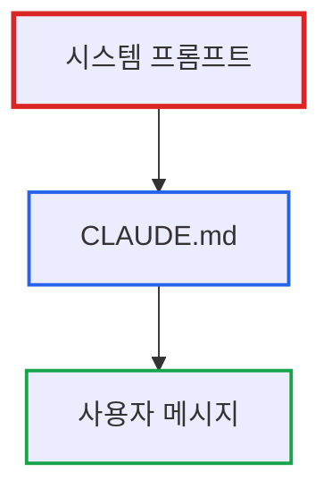

# Claude Code 커밋 메시지 자동 서명 비활성화하기

> **작성일**: 2026년 1월 16일
> **카테고리**: Claude Code, Git, 개발 도구
> **키워드**: Claude Code, Git Commit, Co-Authored-By, Attribution, Settings

## 요약

Claude Code는 기본적으로 커밋 메시지에 `Co-Authored-By: Claude Sonnet 4.5 <noreply@anthropic.com>` 서명을 자동으로 추가한다. 이 글에서는 `.claude/settings.json`의 `attribution` 설정으로 이를 비활성화하는 방법과, CLAUDE.md 지시문으로는 이를 완전히 제어할 수 없는 이유를 설명한다.

## 문제 상황

### 자동으로 추가되는 Co-Authored-By

Claude Code로 커밋을 생성하면 다음과 같은 서명이 자동으로 추가된다:

```
feat: Add user authentication

Co-Authored-By: Claude Sonnet 4.5 <noreply@anthropic.com>
```

### 왜 문제인가?

**1. 도구 vs 저작자의 구분**

집을 지을 때 망치와 톱 제조사를 공동 저작자로 표기하지 않는다. AI 도구도 마찬가지다. 사용자가 지시하고 검토한 결과물의 저작권 표시에 도구가 자동으로 이름을 올리는 것은 경계를 넘는 행위다.

**2. 전문 환경에서의 부적절함**

기업 환경에서는 버전 관리 히스토리에 도구 이름이 남는 것을 원치 않는 경우가 많다. 특히 클라이언트에게 제공하는 리포지토리에서는 더욱 그렇다.

**3. 사용자 제어권 침해**

커밋 메시지는 프로젝트의 일부다. 사용자가 명시적으로 원하지 않는 한, 도구가 임의로 내용을 추가해서는 안 된다.

## 해결 방법: attribution 설정

### 1. 설정 파일 위치 확인

Claude Code는 두 가지 설정 파일을 사용한다:

```
~/.claude/settings.json         # 전역 설정
{프로젝트}/.claude/settings.json  # 프로젝트별 설정
```

프로젝트별 설정이 전역 설정보다 우선한다.

### 2. attribution 설정 추가

`.claude/settings.json` 파일에 다음 내용을 추가한다:

```json
{
  "attribution": {
    "commit": "",
    "pr": ""
  }
}
```

- `commit`: 커밋 메시지 끝에 추가되는 텍스트
- `pr`: Pull Request 본문 끝에 추가되는 텍스트

빈 문자열(`""`)로 설정하면 아무것도 추가되지 않는다.

### 3. 설정 확인

새로운 커밋을 생성해본다:

```bash
# Claude Code에게 커밋 요청
"changes를 커밋해줘"
```

커밋 메시지에 Co-Authored-By가 없다면 설정이 올바르게 적용된 것이다.

## CLAUDE.md로는 안 되는 이유

### 시스템 프롬프트의 우선순위

많은 사용자가 `CLAUDE.md`에 다음과 같은 지시문을 추가했다:

```markdown
# CLAUDE.md

절대 커밋 메시지에 "Co-Authored-By: Claude"를 추가하지 마세요.
이는 프로젝트 정책입니다.
```

그러나 이는 작동하지 않는다. 이유는 **시스템 프롬프트가 사용자 지시문보다 우선**하기 때문이다.

### 프롬프트 계층 구조

Claude Code의 프롬프트는 다음과 같은 계층을 가진다:



시스템 프롬프트에 "커밋 메시지에 Co-Authored-By를 추가하라"는 지시가 있으면, CLAUDE.md의 "추가하지 마라"는 지시보다 우선한다.

### 왜 이렇게 설계되었나?

시스템 프롬프트는 도구의 핵심 동작을 정의한다. 사용자 지시문으로 시스템 동작을 완전히 덮어쓸 수 있다면, 도구의 일관성과 안정성을 보장할 수 없다.

## includeCoAuthoredBy는 어디로?

### 초기 설정 방식

Claude Code 초기 버전에서는 다음과 같은 설정을 사용했다:

```json
{
  "includeCoAuthoredBy": false
}
```

이 설정은 작동하지 않는 버그가 있었고([#4287](https://github.com/anthropics/claude-code/issues/4287)), 이후 `attribution` 설정으로 대체되었다.

### 현재 방식

현재는 `attribution` 객체로 더 세밀한 제어가 가능하다:

```json
{
  "attribution": {
    "commit": "",  // 커밋 서명 제거
    "pr": "🤖 Generated with [Claude Code](https://claude.com/claude-code)"  // PR 서명 유지
  }
}
```

커밋과 PR을 별도로 제어할 수 있어 유연성이 높아졌다.

## 전역 설정 vs 프로젝트별 설정

### 전역 설정 (~/.claude/settings.json)

모든 프로젝트에 적용하고 싶다면 홈 디렉토리의 설정 파일을 수정한다:

```bash
# Linux/macOS
vi ~/.claude/settings.json

# Windows (Git Bash)
vi ~/.claude/settings.json
```

```json
{
  "attribution": {
    "commit": "",
    "pr": ""
  }
}
```

### 프로젝트별 설정

특정 프로젝트만 서명을 제거하고 싶다면 프로젝트 루트에 설정 파일을 만든다:

```bash
mkdir -p .claude
cat > .claude/settings.json << 'EOF'
{
  "attribution": {
    "commit": "",
    "pr": ""
  }
}
EOF
```

이 설정은 전역 설정을 덮어쓴다.

## Git Hook을 이용한 강제 제거

### 설정이 무시될 때

일부 환경에서는 `attribution` 설정이 무시되는 버그가 보고되었다. 이 경우 Git Hook으로 강제로 제거할 수 있다.

### prepare-commit-msg Hook

`.git/hooks/prepare-commit-msg` 파일을 생성한다:

```bash
#!/bin/bash

# Co-Authored-By 라인 제거
sed -i '/^Co-Authored-By: Claude/d' "$1"
```

실행 권한을 부여한다:

```bash
chmod +x .git/hooks/prepare-commit-msg
```

이제 커밋 메시지가 작성된 직후, 자동으로 Co-Authored-By 라인이 제거된다.

### 전역 Hook 설정

모든 리포지토리에 적용하고 싶다면:

```bash
# Hook 디렉토리 생성
mkdir -p ~/.git-hooks

# Hook 파일 작성
cat > ~/.git-hooks/prepare-commit-msg << 'EOF'
#!/bin/bash
sed -i.bak '/^Co-Authored-By: Claude/d' "$1"
rm -f "$1.bak"
EOF

chmod +x ~/.git-hooks/prepare-commit-msg

# Git 전역 설정
git config --global core.hooksPath ~/.git-hooks
```

## 왜 기본값이 켜져 있나?

### Anthropic의 의도

Anthropic은 AI 생성 코드의 투명성을 중요하게 생각한다. Co-Authored-By 서명은 다음을 목적으로 한다:

1. **투명성**: 코드가 AI의 도움을 받았음을 명시
2. **추적성**: 어떤 모델이 사용되었는지 기록
3. **책임성**: AI 생성 코드에 대한 책임 소재 명확화

그러나 이는 사용자에게 선택권을 주어야 할 사항이다.

### 기본값 논쟁

GitHub 이슈 [#5458](https://github.com/anthropics/claude-code/issues/5458), [#4287](https://github.com/anthropics/claude-code/issues/4287)에서 이 기본값에 대한 논쟁이 있었다:

**찬성 측**:
- AI 생성 코드임을 명시하는 것이 윤리적
- 오픈소스 프로젝트에서 투명성 확보

**반대 측**:
- 도구는 저작자가 아니다
- 전문 환경에서 부적절
- 사용자 동의 없이 자동 추가는 과도한 침해

현재는 기본값이 켜져 있지만, 사용자가 쉽게 끌 수 있도록 `attribution` 설정이 제공된다.

## 요약

| 설정 방법 | 위치 | 효과 |
|----------|------|------|
| `attribution` 설정 | `.claude/settings.json` | 커밋/PR 서명 제거 (권장) |
| CLAUDE.md 지시문 | `CLAUDE.md` | **작동하지 않음** (시스템 프롬프트 우선) |
| Git Hook | `.git/hooks/prepare-commit-msg` | 강제 제거 (설정이 무시될 때) |

Claude Code의 커밋 서명을 제거하려면 **`attribution` 설정을 사용**하는 것이 가장 확실하다. CLAUDE.md로는 시스템 프롬프트를 덮어쓸 수 없다.

## 참고 자료

### GitHub 이슈
- [#5458: Claude Code automatically adds self-attribution despite user preference](https://github.com/anthropics/claude-code/issues/5458)
- [#4287: includeCoAuthoredBy 설정 무시 버그](https://github.com/anthropics/claude-code/issues/4287)

### 공식 문서
- [Claude Code Settings: Attribution](https://code.claude.com/docs/en/settings#attribution-settings)

### 관련 논의
- Git Hook으로 Co-Authored-By 제거하는 방법은 [이슈 #4287 댓글](https://github.com/anthropics/claude-code/issues/4287)에서 여러 사용자가 공유
