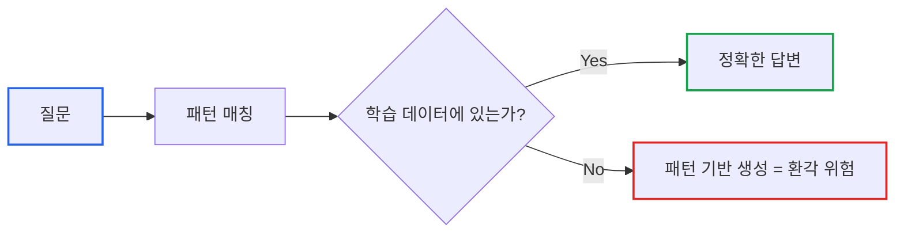
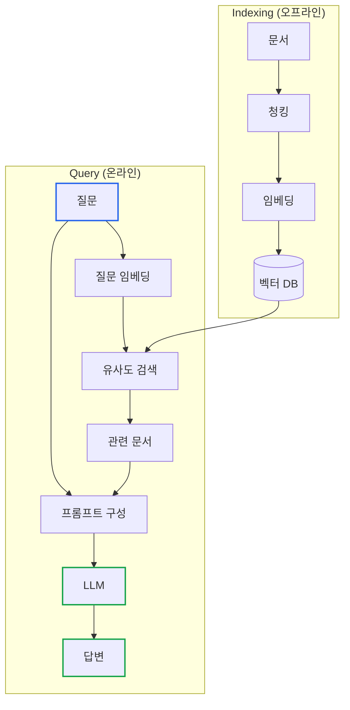

# Essential GraphRAG Part 1: LLM 정확도 향상

> **작성일**: 2026년 01월 19일
> **카테고리**: AI, LLM, RAG
> **키워드**: LLM, Hallucination, Knowledge Cutoff, RAG, Fine-tuning

[##_Image|kage@Ya1Gr/dJMcaaRA6Uz/AAAAAAAAAAAAAAAAAAAAANYZsqOzL195MJtZ2i1Jx-1Jh_vqb8m-LpSrHPnKzzix/img.jpg|alignCenter|width="100%"|_##]

## 요약

대규모 언어 모델(LLM)은 확률적 단어 예측 모델이지, 사실을 저장하고 인출하는 데이터베이스가 아니다. 이 글에서는 LLM이 그럴듯한 거짓말(환각)을 하는 구조적 원인을 분석하고, 이를 극복하기 위한 전략적 접근법으로서 RAG(Retrieval-Augmented Generation)의 필요성을 다룬다.

---

## LLM은 데이터베이스가 아니다

2023년 미국에서 변호사들이 법정에 제출한 서류에 ChatGPT가 생성한 **가짜 판례**가 포함되어 있었다. 해당 판례는 존재하지 않았고, 변호사들은 징계와 벌금형을 받았다. 이 사건은 LLM의 환각(Hallucination) 현상이 전문 영역에서 얼마나 치명적인 결과를 초래할 수 있는지를 보여준다.

Tesla AI 책임자였던 Andrej Karpathy는 이를 명확히 지적했다:

> "우리는 LLM이 일종의 지식 데이터베이스를 구축한다고 이해하지만, 사실 이 지식 베이스는 매우 이상하고 불완전하며 기묘하다."

LLM의 본질은 사실을 '기억'하는 것이 아니라, 학습된 패턴에 따라 다음에 올 단어를 확률적으로 '예측'하는 것이다.

---

## LLM의 4가지 구조적 한계

### 1. 지식 절단 (Knowledge Cutoff)

모델의 학습 데이터는 특정 시점에 고정된다. GPT-4의 경우 2023년 4월, Claude의 경우 2024년 초까지의 데이터만 포함한다.

```
질문: "2025년 대한민국 최저임금은?"
GPT-4: "2023년 기준으로 시간당 9,620원입니다."  ← 오래된 정보
실제: 10,030원 (2025년)
```

실시간 의사결정이 필요한 비즈니스 환경에서 '철 지난 정보'는 단순한 불편을 넘어 리스크가 된다.

### 2. 오래된 정보 (Outdated Information)

과거에는 사실이었으나 현재는 변경된 정보를 그대로 제공한다.

| 시점 | 사실 |
|-----|-----|
| 2022년 | Twitter CEO: 잭 도시 |
| 2023년 | Twitter → X, CEO: 일론 머스크 |
| LLM 응답 | 학습 시점에 따라 다름 |

기업 지배구조, 법규, 정책 등 변경이 잦은 정보에서 특히 문제가 된다.

### 3. 순수 환각 (Pure Hallucinations)

LLM은 추론 엔진이 아닌 확률적 패턴 매칭 시스템이다. Dallas Mavericks의 WikiData ID를 물으면 다음과 같이 답한다:

```
질문: "Dallas Mavericks의 WikiData ID는?"
LLM: "Q152232입니다."  ← 확신에 찬 어조
실제: Q152232는 영화 Womanlight의 ID
```

모델은 "WikiData ID는 Q로 시작하고 숫자가 뒤따른다"는 패턴은 완벽히 학습했지만, 구체적인 사실 관계를 검증하는 로직은 없다.

### 4. 비공개 정보 부재 (Lack of Private Information)

기업 내부 데이터는 공용 모델 학습에 포함되지 않는다.

```
질문: "우리 회사 지난 분기 매출은?"
LLM: "죄송합니다, 해당 정보에 접근할 수 없습니다."
     또는
     "약 150억원으로 추정됩니다." ← 지어낸 숫자
```

사내 지식 노동자의 실무를 보조하려면 내부 데이터에 대한 접근 메커니즘이 필수다.

---

## 왜 환각이 발생하는가: 패턴 매칭의 본질

LLM은 다음 단어를 예측하는 확률 모델이다.

```
입력: "대한민국의 수도는"
모델 내부: P("서울" | "대한민국의 수도는") = 0.95
          P("부산" | "대한민국의 수도는") = 0.02
          ...
출력: "서울"
```

이 방식은 일반적인 사실에는 잘 작동한다. 그러나 학습 데이터에 충분히 등장하지 않은 정보에 대해서는 **"있을 법한" 패턴**을 생성한다.



핵심 문제: **LLM은 자신이 모른다는 것을 모른다.**

---

## Fine-tuning vs RAG: 전략적 선택

LLM의 한계를 극복하는 두 가지 접근법이 있다.

### Fine-tuning (미세 조정)

모델을 특정 도메인 데이터로 재학습시킨다.

```python
# 개념적 예시
model.train(
    dataset="company_internal_docs.jsonl",
    epochs=3
)
```

**한계**:
- 새로운 사실적 지식 주입에 비효율적
- 데이터 업데이트마다 재학습 필요
- 높은 비용과 시간 소요
- 환각 문제를 근본적으로 해결하지 못함

### RAG (Retrieval-Augmented Generation)

외부 지식 베이스에서 관련 정보를 검색하여 LLM에 제공한다.

```python
# 개념적 예시
def answer(question):
    # 1. 관련 문서 검색
    docs = retriever.search(question)

    # 2. 검색 결과를 컨텍스트로 제공
    prompt = f"""
    다음 문서를 참고하여 질문에 답하세요:
    {docs}

    질문: {question}
    """

    # 3. LLM이 검색된 정보 기반으로 답변
    return llm.generate(prompt)
```

**장점**:
- 실시간 정보 반영 가능
- 데이터 업데이트가 즉시 적용
- 답변의 출처 추적 가능
- 환각 감소 (검색된 문서에 기반)

### 비교 표

| 기준 | Fine-tuning | RAG |
|-----|-------------|-----|
| 새 정보 반영 | 재학습 필요 | 즉시 |
| 비용 | 높음 (GPU, 시간) | 낮음 (검색 인프라) |
| 출처 추적 | 불가능 | 가능 |
| 환각 방지 | 제한적 | 효과적 |
| 최신성 유지 | 어려움 | 용이 |

대부분의 기업 환경에서 **RAG가 더 경제적이고 안전한 선택**이다.

---

## RAG의 기본 동작 원리

RAG는 "모르면 찾아보고 답한다"는 단순한 아이디어에 기반한다.

### 아키텍처



### 단계별 설명

**1. 인덱싱 단계 (오프라인)**

문서를 검색 가능한 형태로 변환한다.

```python
# 1. 문서를 청크로 분할
chunks = text_splitter.split(document)

# 2. 각 청크를 벡터로 변환
embeddings = embedding_model.embed(chunks)

# 3. 벡터 DB에 저장
vector_db.insert(chunks, embeddings)
```

**2. 검색 단계 (온라인)**

질문과 유사한 문서를 찾는다.

```python
# 질문을 벡터로 변환
query_embedding = embedding_model.embed(question)

# 유사한 문서 검색
similar_docs = vector_db.search(query_embedding, k=5)
```

**3. 생성 단계**

검색된 문서를 참고하여 답변을 생성한다.

```python
prompt = f"""
다음 문서들을 참고하여 질문에 답하세요.
문서에 없는 내용은 "알 수 없습니다"라고 답하세요.

[문서]
{similar_docs}

[질문]
{question}
"""

answer = llm.generate(prompt)
```

---

## 실제 효과: 환각 감소

RAG 적용 전후 비교:

**RAG 없이**:
```
질문: "아인슈타인의 특허에 대해 설명해주세요."
답변: "아인슈타인은 상대성 이론으로 유명합니다.
      특허에 대해서는 정확한 정보가 없습니다."
```

**RAG 적용 후**:
```
질문: "아인슈타인의 특허에 대해 설명해주세요."
검색된 문서: Caudhuri(2017) "Einstein's Patents and Inventions"
답변: "아인슈타인은 ETH 재학 시절 물리 실험실에서의 직접적인
      관찰에 매료되어 실험 작업에 관심을 가졌습니다. 그는 냉장고
      설계를 포함한 여러 특허를 보유했습니다. (출처: Caudhuri, 2017)"
```

검색된 문서에 기반하므로 출처 추적이 가능하고, 환각 위험이 크게 감소한다.

---

## 비즈니스 관점의 리스크 평가

LLM의 구조적 한계는 단순한 기술적 불편함이 아니다.

| 한계 | 비즈니스 리스크 |
|-----|---------------|
| 지식 절단 | 시장 트렌드 오판, 경쟁사 정보 누락 |
| 오래된 정보 | 법규 위반, 컴플라이언스 이슈 |
| 환각 | 고객 신뢰 하락, 법적 책임 |
| 비공개 정보 부재 | 내부 데이터 활용 불가 |

**추가 리스크**:
- 데이터 편향(Bias)으로 인한 차별적 결과
- 프롬프트 주입(Prompt Injection)을 통한 정보 유출

RAG는 이러한 리스크를 완화하는 아키텍처적 해법이다.

---

## 다음 단계

이 글에서는 LLM의 구조적 한계와 RAG의 필요성을 다뤘다. 다음 글에서는 RAG의 핵심 메커니즘인 **벡터 유사도 검색**과 **하이브리드 검색**의 구현 방법을 상세히 분석한다.

### 시리즈 목차

1. **LLM 정확도 향상** (현재 글)
2. [벡터 검색과 하이브리드 검색](https://blog.imprun.dev/149)
3. [고급 벡터 검색 전략](https://blog.imprun.dev/150)
4. [Text2Cypher: 자연어를 그래프 쿼리로](https://blog.imprun.dev/151)
5. [Agentic RAG](https://blog.imprun.dev/152)
6. [LLM으로 지식 그래프 구축](https://blog.imprun.dev/153)
7. [Microsoft GraphRAG 구현](https://blog.imprun.dev/154)
8. [RAG 평가 체계](https://blog.imprun.dev/155)

---

## 참고 자료

### 공식 문서
- [OpenAI Embeddings Guide](https://platform.openai.com/docs/guides/embeddings)
- [LangChain RAG Documentation](https://python.langchain.com/docs/tutorials/rag/)

### 학술 자료
- Lewis et al. (2020). "Retrieval-Augmented Generation for Knowledge-Intensive NLP Tasks"
- Neumeister (2023). 변호사 ChatGPT 판례 사건 보도

### 관련 블로그
- [Essential GraphRAG 시리즈](https://blog.imprun.dev/147)
