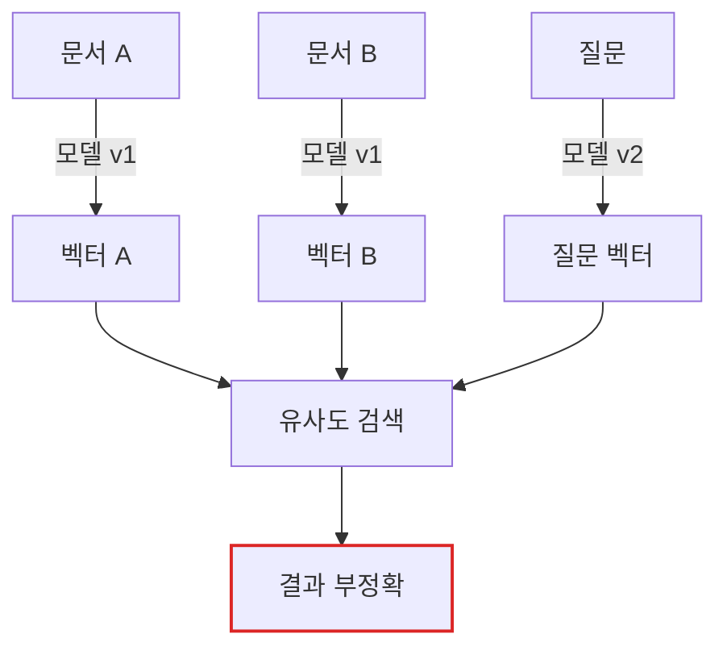
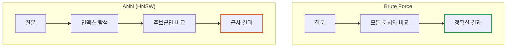
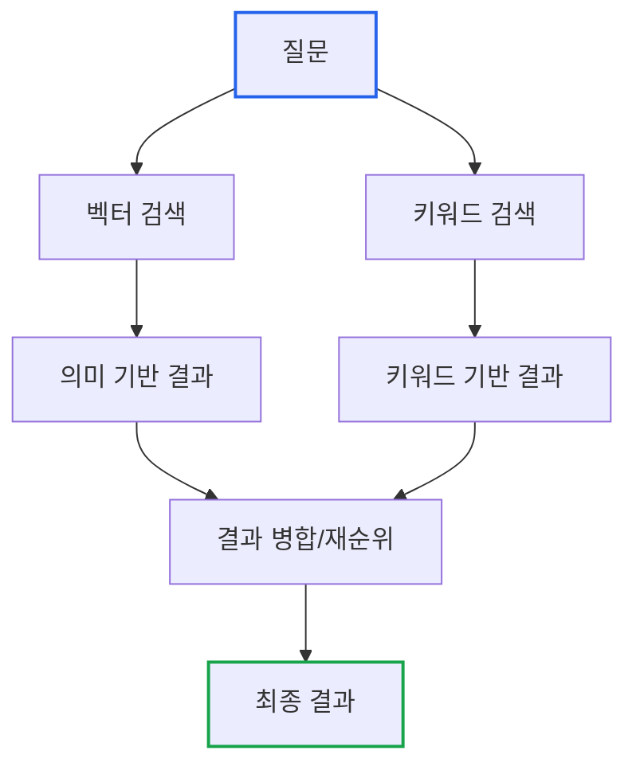

# Essential GraphRAG Part 2: 벡터 검색과 하이브리드 검색

> **작성일**: 2026년 01월 19일
> **카테고리**: AI, RAG, Vector Search
> **키워드**: Embedding, Cosine Similarity, Vector Database, Hybrid Search, Full-text Search

[##_Image|kage@bGm6lz/dJMcacBSAge/AAAAAAAAAAAAAAAAAAAAAHkqZtN1qShMbFG8Ebmv5rRbj71u_QwYMkr7ky6DU8aM/img.jpg|alignCenter|width="100%"|_##]

## 요약

RAG 시스템의 검색 품질은 전체 시스템 성능을 결정한다. 이 글에서는 텍스트를 수학적 벡터로 변환하여 '의미'를 검색하는 벡터 유사도 검색의 메커니즘을 분석하고, 키워드 검색을 결합한 하이브리드 검색 전략을 다룬다.

---

## 검색기(Retriever)의 역할

RAG의 성패는 검색기가 얼마나 정확한 문서를 찾아오느냐에 달려 있다.

```
[좋은 검색] → 관련 문서 → 정확한 답변
[나쁜 검색] → 무관한 문서 → 부정확한 답변 또는 환각
```

전통적인 키워드 검색은 단어의 **정확한 일치**를 찾는다. "자동차"를 검색하면 "자동차"가 포함된 문서만 반환하고, "차량"이나 "vehicle"은 찾지 못한다.

벡터 검색은 다르다. 단어가 아닌 **의미**를 검색한다.

---

## 임베딩: 텍스트를 숫자로 변환

### 임베딩이란

텍스트를 고차원 숫자 벡터로 변환하는 과정이다. **의미가 비슷한 텍스트는 비슷한 벡터를 갖는다.**

```python
from openai import OpenAI
client = OpenAI()

# 텍스트를 벡터로 변환
response = client.embeddings.create(
    model="text-embedding-3-small",
    input="자동차 정비 방법"
)

embedding = response.data[0].embedding
# [0.023, -0.041, 0.089, ...] (1,536차원)
```

### 임베딩의 특성

```
"자동차 정비 방법" → [0.023, -0.041, 0.089, ...]
"차량 수리 가이드" → [0.021, -0.039, 0.091, ...]  ← 의미가 비슷하므로 벡터도 유사
"오늘 날씨가 좋다" → [0.156, 0.234, -0.078, ...]  ← 의미가 다르므로 벡터도 다름
```

이 특성 덕분에 키워드가 정확히 일치하지 않아도 의미적으로 관련된 문서를 찾을 수 있다.

### 임베딩 모델 선택 시 주의사항

**임베딩 모델 일관성**이 핵심이다.



문서 임베딩과 질문 임베딩에 **다른 모델**을 사용하면 벡터 공간이 달라져 검색이 실패한다. 임베딩 모델을 변경하면 **기존 인덱스를 모두 폐기하고 다시 구축**해야 한다. 이는 높은 전환 비용을 수반한다.

---

## 텍스트 청킹: 검색 정밀도의 핵심

### 왜 청킹이 필요한가

100페이지 문서 전체를 하나의 벡터로 만들면 어떻게 될까?

```
문서: [서론 10페이지] + [본론 80페이지] + [결론 10페이지]
질문: "3장의 핵심 내용은?"

→ 전체 문서 벡터는 3장만의 의미를 정확히 담지 못함
→ 검색 실패 또는 부정확한 결과
```

문서를 적절한 크기의 **청크(Chunk)**로 분할해야 정밀한 검색이 가능하다.

### 청킹 전략

**1. 고정 크기 청킹**

```python
# 단순 분할 (비추천)
chunks = [text[i:i+500] for i in range(0, len(text), 500)]
```

문제: 단어나 문장 중간에서 잘릴 수 있다.

**2. 슬라이딩 윈도우 청킹 (권장)**

```python
from langchain.text_splitter import RecursiveCharacterTextSplitter

splitter = RecursiveCharacterTextSplitter(
    chunk_size=500,      # 청크 크기
    chunk_overlap=50,    # 중첩 크기 (문맥 보존)
    separators=["\n\n", "\n", " ", ""]  # 분리 기준 우선순위
)

chunks = splitter.split_text(document)
```

**중첩(Overlap)**을 두면 청크 경계에서 문맥이 단절되는 것을 방지한다.

```
청크 1: [문장 A] [문장 B] [문장 C의 앞부분]
청크 2:         [문장 C] [문장 D] [문장 E]
                ↑ 중첩 영역
```

### 청크 크기 결정 기준

| 청크 크기 | 장점 | 단점 |
|----------|-----|-----|
| 작음 (200자) | 검색 정밀도 높음 | 문맥 부족 |
| 큼 (2000자) | 풍부한 문맥 | 검색 정밀도 낮음 |
| 중간 (500-1000자) | 균형 | - |

일반적으로 **500-1000자** 범위에서 시작하고, 도메인에 맞게 조정한다.

---

## 유사도 계산: 코사인 유사도

### 코사인 유사도란

두 벡터 사이의 **각도**를 측정한다. 방향이 같으면 1, 직각이면 0, 반대면 -1이다.

```
벡터 A = [0.5, 0.5]
벡터 B = [0.4, 0.6]
벡터 C = [-0.5, -0.5]

cos(A, B) = 0.98  ← 매우 유사
cos(A, C) = -1.0  ← 반대 방향
```

### 수식

```
cos(A, B) = (A · B) / (||A|| × ||B||)
```

- A · B: 두 벡터의 내적 (dot product)
- ||A||: 벡터 A의 크기 (magnitude)

### 구현

```python
import numpy as np

def cosine_similarity(vec_a, vec_b):
    dot_product = np.dot(vec_a, vec_b)
    norm_a = np.linalg.norm(vec_a)
    norm_b = np.linalg.norm(vec_b)
    return dot_product / (norm_a * norm_b)

# 사용
similarity = cosine_similarity(query_embedding, doc_embedding)
# 0.92 → 매우 유사
```

---

## 벡터 인덱싱: 대규모 검색의 핵심

### 문제: 브루트포스 검색의 한계

100만 개 문서가 있다면, 질문 하나에 100만 번의 유사도 계산이 필요하다.

```
문서 수: 1,000,000
벡터 차원: 1,536
계산량: 1,000,000 × 1,536 = 15억 연산
```

실시간 서비스에서는 허용할 수 없는 지연이 발생한다.

### 해결: 근사 최근접 이웃 (ANN)

**Approximate Nearest Neighbor** 알고리즘은 정확도를 약간 포기하고 속도를 극대화한다.



**주요 ANN 알고리즘**:

| 알고리즘 | 특징 |
|---------|-----|
| HNSW | 높은 정확도, 메모리 사용 많음 |
| IVF | 빠른 검색, 인덱스 구축 빠름 |
| PQ | 메모리 효율적, 정확도 낮음 |

대부분의 벡터 DB는 HNSW를 기본 인덱스로 사용한다.

### 벡터 DB 선택

```python
# ChromaDB (로컬 개발)
import chromadb
client = chromadb.Client()
collection = client.create_collection("docs")
collection.add(documents=chunks, embeddings=embeddings)

# Pinecone (클라우드)
import pinecone
pinecone.init(api_key="...")
index = pinecone.Index("docs")
index.upsert(vectors=[(id, embedding, metadata)])

# Neo4j (그래프 + 벡터)
# Cypher로 벡터 검색
CALL db.index.vector.queryNodes('doc_embeddings', 5, $queryVector)
```

---

## 벡터 검색의 한계

벡터 검색은 **의미적 유사성**을 찾는 데 탁월하지만, 모든 검색 시나리오에 적합하지 않다.

### 문제 1: 고유 식별자 검색

```
질문: "주문번호 ORD-2024-12345의 상태는?"
벡터 검색: "주문", "상태" 관련 문서 반환
           → 해당 주문번호 문서를 찾지 못함
```

### 문제 2: 정확한 키워드 매칭

```
질문: "ConfigMap 설정 오류"
벡터 검색: Kubernetes 설정 관련 문서들 반환
           → "ConfigMap"이 정확히 포함된 문서 누락 가능
```

### 문제 3: 숫자/날짜 범위 검색

```
질문: "2024년 1월~3월 매출 보고서"
벡터 검색: "매출 보고서" 의미의 문서 반환
           → 날짜 범위 필터링 불가
```

---

## 하이브리드 검색: 벡터 + 키워드

### 아키텍처

벡터 검색과 전체 텍스트 검색(Full-text Search)을 결합한다.



### 구현

```python
from langchain.retrievers import EnsembleRetriever
from langchain.retrievers import BM25Retriever
from langchain_community.vectorstores import Chroma

# 벡터 리트리버
vector_retriever = Chroma.from_documents(docs, embeddings).as_retriever()

# 키워드 리트리버 (BM25)
keyword_retriever = BM25Retriever.from_documents(docs)

# 하이브리드 리트리버
hybrid_retriever = EnsembleRetriever(
    retrievers=[vector_retriever, keyword_retriever],
    weights=[0.5, 0.5]  # 가중치 조절 가능
)

# 검색
results = hybrid_retriever.invoke("ORD-2024-12345 주문 상태")
```

### 가중치 전략

| 시나리오 | 벡터 가중치 | 키워드 가중치 |
|---------|-----------|-------------|
| 일반 질문 | 0.7 | 0.3 |
| 기술 문서 (코드, ID 포함) | 0.4 | 0.6 |
| 법률/의료 (정확한 용어 중요) | 0.3 | 0.7 |

도메인에 따라 가중치를 조정한다.

### BM25란

**Best Matching 25**는 전통적인 정보 검색 알고리즘이다. 단어 빈도(TF)와 역문서 빈도(IDF)를 기반으로 관련도를 계산한다.

```
BM25 점수 = TF 요소 × IDF 요소 × 문서 길이 정규화
```

- 단어가 문서에 자주 등장하면 → 점수 증가
- 단어가 전체 문서에 드물게 등장하면 → 점수 증가 (희소성)

---

## 실습: ChromaDB로 하이브리드 검색

### 환경 설정

```python
pip install chromadb langchain langchain-openai rank-bm25
```

### 전체 코드

```python
from langchain_openai import OpenAIEmbeddings
from langchain_community.vectorstores import Chroma
from langchain.retrievers import BM25Retriever, EnsembleRetriever
from langchain.schema import Document

# 1. 샘플 문서
documents = [
    Document(page_content="주문번호 ORD-2024-12345는 배송 중입니다.", metadata={"type": "order"}),
    Document(page_content="배송 상태를 확인하려면 마이페이지에서 조회하세요.", metadata={"type": "guide"}),
    Document(page_content="주문번호 ORD-2024-67890은 결제 대기 중입니다.", metadata={"type": "order"}),
    Document(page_content="배송 조회 서비스는 오전 9시부터 오후 6시까지 운영됩니다.", metadata={"type": "guide"}),
]

# 2. 벡터 리트리버
embeddings = OpenAIEmbeddings(model="text-embedding-3-small")
vectorstore = Chroma.from_documents(documents, embeddings)
vector_retriever = vectorstore.as_retriever(search_kwargs={"k": 2})

# 3. BM25 리트리버
bm25_retriever = BM25Retriever.from_documents(documents)
bm25_retriever.k = 2

# 4. 하이브리드 리트리버
hybrid_retriever = EnsembleRetriever(
    retrievers=[vector_retriever, bm25_retriever],
    weights=[0.4, 0.6]  # 주문번호 검색이므로 키워드 가중치 높임
)

# 5. 검색 테스트
query = "ORD-2024-12345 상태"

print("=== 벡터 검색 결과 ===")
for doc in vector_retriever.invoke(query):
    print(f"- {doc.page_content}")

print("\n=== BM25 검색 결과 ===")
for doc in bm25_retriever.invoke(query):
    print(f"- {doc.page_content}")

print("\n=== 하이브리드 검색 결과 ===")
for doc in hybrid_retriever.invoke(query):
    print(f"- {doc.page_content}")
```

### 예상 출력

```
=== 벡터 검색 결과 ===
- 배송 상태를 확인하려면 마이페이지에서 조회하세요.
- 주문번호 ORD-2024-12345는 배송 중입니다.

=== BM25 검색 결과 ===
- 주문번호 ORD-2024-12345는 배송 중입니다.
- 주문번호 ORD-2024-67890은 결제 대기 중입니다.

=== 하이브리드 검색 결과 ===
- 주문번호 ORD-2024-12345는 배송 중입니다.
- 배송 상태를 확인하려면 마이페이지에서 조회하세요.
```

하이브리드 검색이 정확한 주문번호를 1순위로 반환한다.

---

## 핵심 정리

| 개념 | 설명 |
|-----|-----|
| 임베딩 | 텍스트를 고차원 벡터로 변환 |
| 코사인 유사도 | 벡터 간 각도로 유사성 측정 |
| 청킹 | 문서를 검색 단위로 분할 |
| ANN 인덱스 | 대규모 데이터 빠른 검색 |
| 하이브리드 검색 | 벡터 + 키워드 검색 결합 |

---

## 다음 단계

기본적인 벡터 검색과 하이브리드 검색을 다뤘다. 다음 글에서는 검색 품질을 더욱 높이기 위한 **고급 벡터 검색 전략**을 분석한다. Step-back Prompting, Parent Document Retriever 등 실무에서 활용되는 기법을 다룬다.

### 시리즈 목차

1. [LLM 정확도 향상](https://blog.imprun.dev/148)
2. **벡터 검색과 하이브리드 검색** (현재 글)
3. [고급 벡터 검색 전략](https://blog.imprun.dev/150)
4. [Text2Cypher: 자연어를 그래프 쿼리로](https://blog.imprun.dev/151)
5. [Agentic RAG](https://blog.imprun.dev/152)
6. [LLM으로 지식 그래프 구축](https://blog.imprun.dev/153)
7. [Microsoft GraphRAG 구현](https://blog.imprun.dev/154)
8. [RAG 평가 체계](https://blog.imprun.dev/155)

---

## 참고 자료

### 공식 문서
- [OpenAI Embeddings](https://platform.openai.com/docs/guides/embeddings)
- [ChromaDB Documentation](https://docs.trychroma.com/)
- [LangChain Retrievers](https://python.langchain.com/docs/modules/data_connection/retrievers/)

### 학술 자료
- Robertson & Zaragoza (2009). "The Probabilistic Relevance Framework: BM25 and Beyond"
