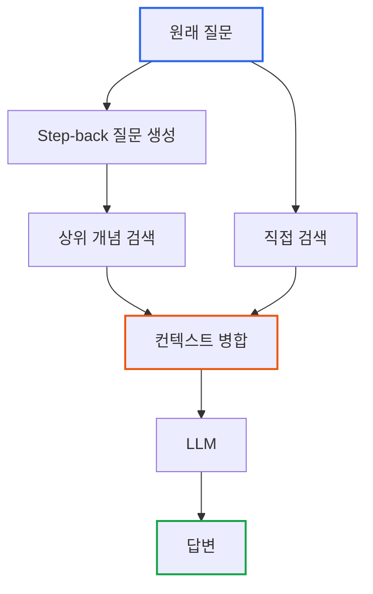
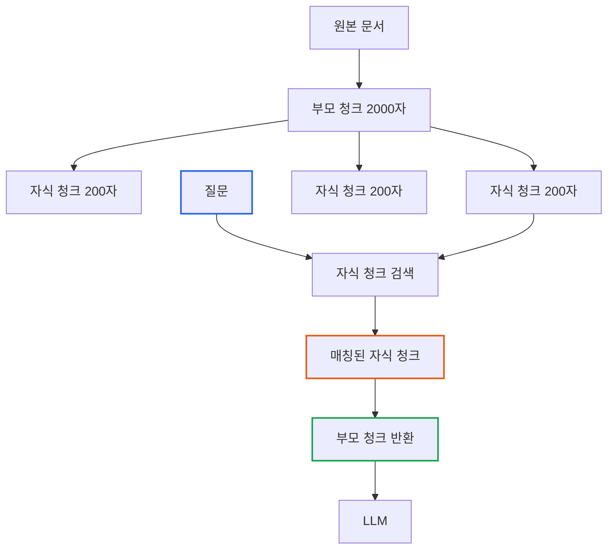
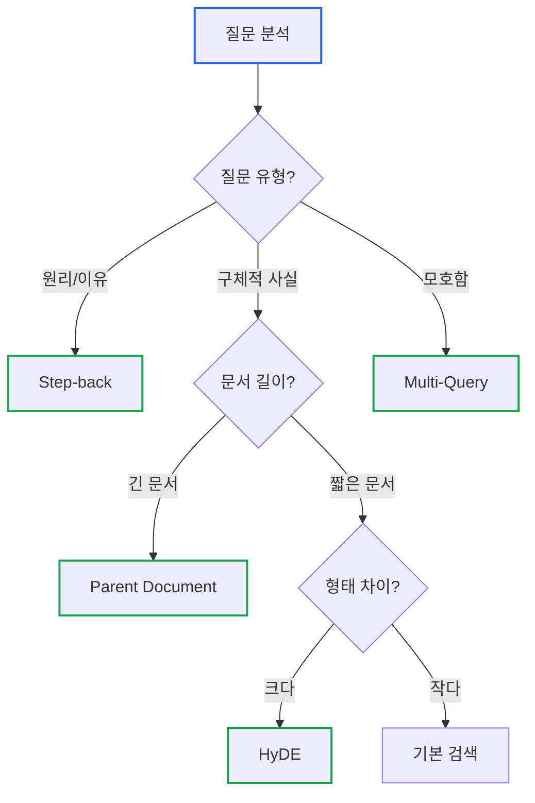

# Essential GraphRAG Part 3: 고급 벡터 검색 전략

> **작성일**: 2026년 01월 19일
> **카테고리**: AI, RAG, Retrieval
> **키워드**: Step-back Prompting, Parent Document Retriever, Multi-Query, HyDE

[##_Image|kage@bNND0W/dJMcahJXHdM/AAAAAAAAAAAAAAAAAAAAALoqUzz6172NGcN3NNn2jRiQ7kBl5ijXduEu9yla9bK-/img.jpg|alignCenter|width="100%"|_##]

## 요약

기본 벡터 검색은 질문과 문서의 직접적인 유사도만 비교한다. 이 접근법은 단순한 질문에는 효과적이지만, 복잡하거나 추상적인 질문에서는 관련 문서를 놓치기 쉽다. 이 글에서는 검색 품질을 향상시키는 4가지 고급 전략을 분석한다.

---

## 기본 검색의 한계

### 문제 상황

```
질문: "왜 마이크로서비스 아키텍처에서 서킷 브레이커가 중요한가?"

기본 벡터 검색 결과:
- "서킷 브레이커 패턴 구현 가이드" (키워드 일치)
- "마이크로서비스 아키텍처 개요" (키워드 일치)

누락된 문서:
- "분산 시스템의 장애 전파 방지" (핵심 원리)
- "복원력(Resilience) 패턴 비교" (상위 개념)
```

직접적인 키워드 유사도에만 의존하면, 질문의 **진짜 의도**와 관련된 문서를 놓칠 수 있다.

---

## 전략 1: Step-back Prompting

### 개념

질문을 추상화하여 **상위 개념의 질문**을 먼저 검색한다.

```
원래 질문: "React 18의 useTransition 훅은 어떻게 사용하나요?"
      ↓ 추상화
Step-back 질문: "React의 동시성(Concurrency) 기능은 무엇인가요?"
```

### 왜 효과적인가

상위 개념을 먼저 검색하면:
1. 더 넓은 범위의 관련 문서 확보
2. 세부 질문에 필요한 **배경 지식** 제공
3. LLM이 맥락을 더 잘 이해하고 답변



### 구현

```python
from langchain_openai import ChatOpenAI
from langchain.prompts import PromptTemplate

llm = ChatOpenAI(model="gpt-4")

# Step-back 질문 생성 프롬프트
stepback_prompt = PromptTemplate(
    input_variables=["question"],
    template="""다음 질문의 답을 찾기 위해 먼저 알아야 할 상위 개념이나 원리를 질문 형태로 작성하세요.

원래 질문: {question}

상위 개념 질문:"""
)

def generate_stepback_question(question: str) -> str:
    return llm.invoke(stepback_prompt.format(question=question)).content

# 사용 예시
original = "React 18의 useTransition 훅은 어떻게 사용하나요?"
stepback = generate_stepback_question(original)
# "React의 동시성(Concurrency) 모델과 우선순위 기반 렌더링은 어떻게 작동하나요?"

# 두 질문 모두로 검색
original_docs = retriever.invoke(original)
stepback_docs = retriever.invoke(stepback)
all_docs = original_docs + stepback_docs
```

### 적용 시나리오

| 적합한 경우 | 부적합한 경우 |
|-----------|-------------|
| 원리/이유를 묻는 질문 | 단순 사실 조회 |
| 기술적 깊이가 필요한 질문 | "X는 무엇인가?" |
| "왜", "어떻게" 질문 | 코드 조회, ID 검색 |

---

## 전략 2: Parent Document Retriever

### 개념

**작은 청크로 검색**하고, **큰 문서로 답변**한다.

```
검색 시: 200자 청크 사용 → 정밀한 매칭
답변 시: 2000자 부모 문서 제공 → 풍부한 맥락
```

### 왜 효과적인가

| 청크 크기 | 검색 정밀도 | 답변 품질 |
|----------|-----------|----------|
| 작음 | 높음 | 낮음 (맥락 부족) |
| 큼 | 낮음 | 높음 (맥락 풍부) |
| Parent Doc | 높음 | 높음 |



### 구현

```python
from langchain.retrievers import ParentDocumentRetriever
from langchain.storage import InMemoryStore
from langchain.text_splitter import RecursiveCharacterTextSplitter
from langchain_community.vectorstores import Chroma
from langchain_openai import OpenAIEmbeddings

# 부모 문서용 스플리터 (큰 청크)
parent_splitter = RecursiveCharacterTextSplitter(chunk_size=2000)

# 자식 문서용 스플리터 (작은 청크)
child_splitter = RecursiveCharacterTextSplitter(chunk_size=200)

# 벡터 스토어 (자식 청크 저장)
vectorstore = Chroma(
    collection_name="split_docs",
    embedding_function=OpenAIEmbeddings()
)

# 문서 스토어 (부모 문서 저장)
docstore = InMemoryStore()

# Parent Document Retriever 생성
retriever = ParentDocumentRetriever(
    vectorstore=vectorstore,
    docstore=docstore,
    child_splitter=child_splitter,
    parent_splitter=parent_splitter,
)

# 문서 추가
retriever.add_documents(documents)

# 검색 (자식으로 검색, 부모 반환)
results = retriever.invoke("useTransition 훅 사용법")
# → 200자 청크로 매칭, 2000자 부모 문서 반환
```

### 동작 예시

```
원본 문서 (5000자):
├── 부모 청크 1 (2000자): "React 동시성 모델..."
│   ├── 자식 1 (200자): "React 18에서 도입된..."
│   ├── 자식 2 (200자): "useTransition은..."  ← 검색 매칭
│   └── 자식 3 (200자): "startTransition 함수..."
├── 부모 청크 2 (2000자): "성능 최적화..."
│   └── ...
└── 부모 청크 3 (1000자): "마이그레이션 가이드..."

질문: "useTransition 훅 사용법"
검색 결과: 자식 2 매칭
반환: 부모 청크 1 전체 (2000자)
```

---

## 전략 3: Multi-Query Retrieval

### 개념

하나의 질문을 **여러 관점에서 재작성**하여 검색한다.

```
원래 질문: "Python에서 메모리 누수를 어떻게 찾나요?"

생성된 질문들:
1. "Python 메모리 프로파일링 도구"
2. "Python 가비지 컬렉션 디버깅"
3. "Python 객체 참조 추적 방법"
4. "memory_profiler 사용법"
```

### 왜 효과적인가

사용자의 질문이 항상 최적의 검색어가 아니다. 같은 의도를 다양한 표현으로 검색하면 **더 많은 관련 문서**를 찾을 수 있다.

### 구현

```python
from langchain.retrievers.multi_query import MultiQueryRetriever
from langchain_openai import ChatOpenAI

llm = ChatOpenAI(model="gpt-4")

# 기본 리트리버
base_retriever = vectorstore.as_retriever()

# Multi-Query 리트리버
multi_query_retriever = MultiQueryRetriever.from_llm(
    retriever=base_retriever,
    llm=llm
)

# 내부적으로 여러 질문 생성 후 결과 병합
results = multi_query_retriever.invoke("Python 메모리 누수 찾기")
```

### 커스텀 질문 생성

```python
from langchain.prompts import PromptTemplate

# 질문 생성 프롬프트 커스터마이징
QUERY_PROMPT = PromptTemplate(
    input_variables=["question"],
    template="""당신은 AI 검색 전문가입니다.
사용자의 질문을 검색에 최적화된 5개의 다른 질문으로 변환하세요.
각 질문은 서로 다른 관점이나 용어를 사용해야 합니다.

원래 질문: {question}

대안 질문들 (한 줄에 하나씩):"""
)

multi_query_retriever = MultiQueryRetriever.from_llm(
    retriever=base_retriever,
    llm=llm,
    prompt=QUERY_PROMPT
)
```

---

## 전략 4: HyDE (Hypothetical Document Embeddings)

### 개념

질문을 **가상의 답변 문서**로 변환한 뒤 검색한다.

```
질문: "쿠버네티스 Pod가 CrashLoopBackOff 상태일 때 해결 방법"
      ↓ LLM이 가상 답변 생성
가상 문서: "CrashLoopBackOff는 컨테이너가 반복적으로 실패할 때 발생합니다.
          주요 원인으로는 이미지 풀 실패, 리소스 부족, 설정 오류가 있습니다.
          kubectl describe pod 명령으로 이벤트를 확인하고..."
      ↓ 가상 문서로 검색
검색 결과: 실제 트러블슈팅 문서들
```

### 왜 효과적인가

질문과 문서는 **형태가 다르다**:
- 질문: "X는 어떻게 하나요?"
- 문서: "X를 하려면 다음 단계를 따르세요..."

가상 답변은 실제 문서와 형태가 비슷하므로 **유사도가 높아진다**.


### 구현

```python
from langchain.chains import HypotheticalDocumentEmbedder
from langchain_openai import OpenAIEmbeddings, ChatOpenAI

# HyDE 임베더 생성
hyde_embeddings = HypotheticalDocumentEmbedder.from_llm(
    llm=ChatOpenAI(model="gpt-4"),
    base_embeddings=OpenAIEmbeddings(),
    prompt_key="web_search"  # 또는 커스텀 프롬프트
)

# 벡터 스토어에 HyDE 임베딩 사용
vectorstore = Chroma.from_documents(
    documents,
    embedding=hyde_embeddings
)

# 검색 시 질문 → 가상 답변 → 임베딩 → 검색
results = vectorstore.similarity_search("Pod CrashLoopBackOff 해결")
```

### 주의사항

| 장점 | 단점 |
|-----|-----|
| 복잡한 질문에 효과적 | LLM 호출 추가 비용 |
| 질문-문서 형태 차이 극복 | 가상 답변이 잘못되면 검색도 실패 |
| 도메인 특화 질문에 유용 | 단순 질문에는 오버헤드 |

---

## 전략 비교 및 선택 가이드

### 전략별 특성

| 전략 | 복잡도 | LLM 호출 | 최적 시나리오 |
|-----|-------|---------|-------------|
| Step-back | 중 | 1회 | 원리/이유 질문 |
| Parent Doc | 낮 | 0회 | 긴 문서 검색 |
| Multi-Query | 중 | 1회 | 모호한 질문 |
| HyDE | 높 | 1회 | 형태 차이가 큰 경우 |

### 선택 플로우차트



### 조합 전략

실무에서는 여러 전략을 조합한다:

```python
# 예: Step-back + Parent Document
def advanced_retrieve(question: str):
    # 1. Step-back 질문 생성
    stepback_q = generate_stepback_question(question)

    # 2. 두 질문으로 Parent Document 검색
    original_docs = parent_retriever.invoke(question)
    stepback_docs = parent_retriever.invoke(stepback_q)

    # 3. 결과 병합 및 중복 제거
    all_docs = deduplicate(original_docs + stepback_docs)

    return all_docs
```

---

## 실습: 전략 비교 테스트

### 테스트 환경

```python
from langchain_community.vectorstores import Chroma
from langchain_openai import OpenAIEmbeddings, ChatOpenAI
from langchain.schema import Document

# 테스트 문서
documents = [
    Document(page_content="""React 18의 동시성 기능은 사용자 경험을 개선하기 위해 도입되었습니다.
    기존 React는 동기식으로 렌더링하여 대규모 업데이트 시 UI가 멈추는 문제가 있었습니다.
    동시성 모드에서는 React가 렌더링 작업을 작은 단위로 나누어 처리합니다."""),

    Document(page_content="""useTransition 훅은 상태 업데이트의 우선순위를 낮출 때 사용합니다.
    const [isPending, startTransition] = useTransition();
    startTransition(() => { setState(newValue); });
    isPending은 트랜지션이 진행 중인지 나타내는 불리언 값입니다."""),

    Document(page_content="""성능 최적화를 위해 React.memo, useMemo, useCallback을 적절히 사용하세요.
    불필요한 리렌더링을 방지하고 메모이제이션으로 계산 비용을 줄일 수 있습니다."""),
]

# 벡터 스토어
vectorstore = Chroma.from_documents(documents, OpenAIEmbeddings())
base_retriever = vectorstore.as_retriever(search_kwargs={"k": 2})
```

### 테스트 실행

```python
question = "React 18에서 무거운 상태 업데이트를 처리하는 방법은?"

# 1. 기본 검색
basic_results = base_retriever.invoke(question)
print("=== 기본 검색 ===")
for doc in basic_results:
    print(f"- {doc.page_content[:50]}...")

# 2. Step-back
stepback_q = generate_stepback_question(question)
print(f"\n=== Step-back 질문: {stepback_q} ===")
stepback_results = base_retriever.invoke(stepback_q)
for doc in stepback_results:
    print(f"- {doc.page_content[:50]}...")

# 3. Multi-Query
multi_results = multi_query_retriever.invoke(question)
print("\n=== Multi-Query ===")
for doc in multi_results:
    print(f"- {doc.page_content[:50]}...")
```

---

## 핵심 정리

| 전략 | 핵심 아이디어 | 언제 사용 |
|-----|-------------|----------|
| Step-back | 상위 개념 먼저 검색 | "왜", "어떻게" 질문 |
| Parent Document | 작게 검색, 크게 반환 | 긴 문서, 맥락 중요 |
| Multi-Query | 다양한 표현으로 검색 | 모호한 질문 |
| HyDE | 가상 답변으로 검색 | 질문-문서 형태 차이 |

---

## 다음 단계

지금까지 벡터 기반 검색 전략을 다뤘다. 그러나 벡터 검색은 **관계**를 이해하지 못한다는 근본적인 한계가 있다. 다음 글에서는 자연어 질문을 **그래프 쿼리(Cypher)**로 변환하여 구조화된 데이터에서 정확한 답을 찾는 방법을 다룬다.

### 시리즈 목차

1. [LLM 정확도 향상](https://blog.imprun.dev/148)
2. [벡터 검색과 하이브리드 검색](https://blog.imprun.dev/149)
3. **고급 벡터 검색 전략** (현재 글)
4. [Text2Cypher: 자연어를 그래프 쿼리로](https://blog.imprun.dev/151)
5. [Agentic RAG](https://blog.imprun.dev/152)
6. [LLM으로 지식 그래프 구축](https://blog.imprun.dev/153)
7. [Microsoft GraphRAG 구현](https://blog.imprun.dev/154)
8. [RAG 평가 체계](https://blog.imprun.dev/155)

---

## 참고 자료

### 논문
- Zheng et al. (2023). "Take a Step Back: Evoking Reasoning via Abstraction in Large Language Models"
- Gao et al. (2022). "Precise Zero-Shot Dense Retrieval without Relevance Labels" (HyDE)

### 공식 문서
- [LangChain Parent Document Retriever](https://python.langchain.com/docs/modules/data_connection/retrievers/parent_document_retriever)
- [LangChain Multi-Query Retriever](https://python.langchain.com/docs/modules/data_connection/retrievers/multi_query)
