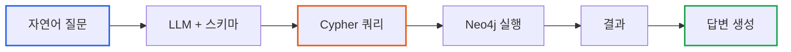
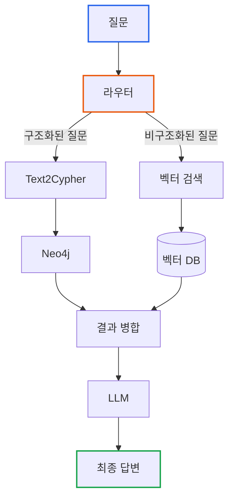

# Essential GraphRAG Part 4: Text2Cypher - 자연어를 그래프 쿼리로

> **작성일**: 2026년 01월 19일
> **카테고리**: AI, RAG, Knowledge Graph
> **키워드**: Text2Cypher, Neo4j, Cypher, Knowledge Graph, Graph Query

[##_Image|kage@3vShk/dJMcacIEsR2/AAAAAAAAAAAAAAAAAAAAAA3SHYFNgguuVrhpnmycj1fgKHZRwWFK_NHWdi-vwyw9/img.jpg|alignCenter|width="100%"|_##]

## 요약

벡터 검색은 의미적 유사성을 찾는 데 탁월하지만, 데이터 간의 **관계**를 추론하지 못한다. "김철수가 완료한 업무가 몇 개인가?"와 같은 질문에 답하려면 구조화된 쿼리가 필요하다. 이 글에서는 자연어 질문을 Neo4j의 Cypher 쿼리로 변환하는 Text2Cypher 기법을 다룬다.

---

## 벡터 검색이 실패하는 질문

### 문제 상황

```
질문: "John Doe가 완료한 업무가 몇 개인가?"

벡터 검색 결과:
- "John Doe는 개발팀 소속입니다."
- "업무 완료 시 상태를 Completed로 변경하세요."
- "John Doe가 Task-123을 진행 중입니다."

→ 정확한 숫자를 알 수 없음
```

벡터 검색은 "John Doe"와 "완료"가 포함된 문서를 찾을 뿐, **관계를 따라가며 집계**하지 못한다.

### 그래프 쿼리가 필요한 이유

지식 그래프에서는 데이터가 **노드(엔티티)**와 **엣지(관계)**로 구조화되어 있다.

```
[John Doe] ─ASSIGNED_TO→ [Task-001] ─HAS_STATUS→ [Completed]
[John Doe] ─ASSIGNED_TO→ [Task-002] ─HAS_STATUS→ [Completed]
[John Doe] ─ASSIGNED_TO→ [Task-003] ─HAS_STATUS→ [In Progress]
```

Cypher 쿼리로 정확한 답을 얻을 수 있다:

```
MATCH (p:Person {name: "John Doe"})-[:ASSIGNED_TO]->(t:Task)-[:HAS_STATUS]->(s:Status {name: "Completed"})
RETURN count(t) AS completed_tasks
// 결과: 2
```

---

## Cypher 쿼리 기초

### Neo4j와 Cypher

**Neo4j**는 가장 널리 사용되는 그래프 데이터베이스이고, **Cypher**는 Neo4j의 쿼리 언어다.

### 기본 문법

**노드 매칭**
```
// Person 레이블을 가진 노드 찾기
MATCH (p:Person)
RETURN p

// 특정 속성을 가진 노드
MATCH (p:Person {name: "John Doe"})
RETURN p
```

**관계 탐색**
```
// p가 t에 ASSIGNED_TO 관계로 연결
MATCH (p:Person)-[:ASSIGNED_TO]->(t:Task)
RETURN p.name, t.title

// 방향 없는 관계
MATCH (a)-[:KNOWS]-(b)
RETURN a, b
```

**필터링과 집계**
```
// WHERE 절로 필터링
MATCH (p:Person)-[:ASSIGNED_TO]->(t:Task)
WHERE t.priority = "High"
RETURN p.name, count(t)

// 정렬
ORDER BY count(t) DESC
LIMIT 10
```

### SQL과의 비교

| SQL | Cypher |
|-----|--------|
| SELECT * FROM users | MATCH (u:User) RETURN u |
| JOIN | 관계 패턴 (-->, <--, --) |
| WHERE | WHERE |
| GROUP BY | 암묵적 (집계 함수 사용 시) |

```sql
-- SQL: 3단계 조인 필요
SELECT p.name, count(*)
FROM persons p
JOIN assignments a ON p.id = a.person_id
JOIN tasks t ON a.task_id = t.id
JOIN statuses s ON t.status_id = s.id
WHERE s.name = 'Completed'
GROUP BY p.name
```

```
-- Cypher: 관계 패턴으로 직관적 표현
MATCH (p:Person)-[:ASSIGNED_TO]->(t:Task)-[:HAS_STATUS]->(:Status {name: "Completed"})
RETURN p.name, count(t)
```

---

## Text2Cypher: 자연어 → Cypher 변환

### 개념

LLM을 사용하여 자연어 질문을 Cypher 쿼리로 변환한다.



### 스키마의 중요성

LLM이 정확한 Cypher를 생성하려면 **그래프 스키마**를 알아야 한다.

```python
# 스키마 예시
schema = """
Node labels: Person, Task, Status, Team
Relationships:
  - (Person)-[:ASSIGNED_TO]->(Task)
  - (Task)-[:HAS_STATUS]->(Status)
  - (Person)-[:BELONGS_TO]->(Team)
Properties:
  - Person: name, email, role
  - Task: title, priority, due_date
  - Status: name (Pending, In Progress, Completed)
  - Team: name, department
"""
```

스키마 없이는 LLM이 존재하지 않는 레이블이나 관계를 생성할 수 있다.

---

## 구현: LangChain GraphCypherQAChain

### 환경 설정

```bash
pip install langchain langchain-openai neo4j
```

### Neo4j 연결

```python
from langchain_community.graphs import Neo4jGraph

# Neo4j 연결
graph = Neo4jGraph(
    url="bolt://localhost:7687",
    username="neo4j",
    password="password"
)

# 스키마 자동 추출
print(graph.schema)
```

### GraphCypherQAChain

```python
from langchain.chains import GraphCypherQAChain
from langchain_openai import ChatOpenAI

llm = ChatOpenAI(model="gpt-4", temperature=0)

# Text2Cypher 체인 생성
chain = GraphCypherQAChain.from_llm(
    llm=llm,
    graph=graph,
    verbose=True,  # 생성된 Cypher 쿼리 출력
    return_intermediate_steps=True
)

# 질문
result = chain.invoke({"query": "John Doe가 완료한 업무가 몇 개인가?"})

print(result["result"])
# "John Doe는 2개의 업무를 완료했습니다."

print(result["intermediate_steps"])
# [{'query': 'MATCH (p:Person {name: "John Doe"})-[:ASSIGNED_TO]->(t:Task)-[:HAS_STATUS]->(:Status {name: "Completed"}) RETURN count(t)'}]
```

### 동작 과정

1. LLM이 스키마를 참고하여 Cypher 쿼리 생성
2. Neo4j에서 쿼리 실행
3. 결과를 자연어 답변으로 변환

```
입력: "John Doe가 완료한 업무가 몇 개인가?"
      ↓ LLM (스키마 참조)
생성된 Cypher:
MATCH (p:Person {name: "John Doe"})
      -[:ASSIGNED_TO]->(t:Task)
      -[:HAS_STATUS]->(:Status {name: "Completed"})
RETURN count(t)
      ↓ Neo4j 실행
결과: [{count(t): 2}]
      ↓ LLM
출력: "John Doe는 2개의 업무를 완료했습니다."
```

---

## 쿼리 생성 품질 향상

### 문제: 잘못된 Cypher 생성

LLM이 스키마를 완벽히 이해하지 못하면 오류가 발생한다.

```
질문: "개발팀에서 가장 많은 업무를 완료한 사람은?"

잘못된 Cypher:
MATCH (p:Person)-[:IN_TEAM]->(t:Team {name: "개발팀"})  // IN_TEAM 관계 없음
RETURN p.name

올바른 Cypher:
MATCH (p:Person)-[:BELONGS_TO]->(t:Team {name: "개발팀"})
RETURN p.name
```

### 해결책 1: Few-shot Examples

```python
from langchain.prompts import FewShotPromptTemplate, PromptTemplate

examples = [
    {
        "question": "John Doe가 속한 팀은?",
        "cypher": "MATCH (p:Person {name: 'John Doe'})-[:BELONGS_TO]->(t:Team) RETURN t.name"
    },
    {
        "question": "개발팀의 팀원은 몇 명인가?",
        "cypher": "MATCH (p:Person)-[:BELONGS_TO]->(t:Team {name: '개발팀'}) RETURN count(p)"
    },
    {
        "question": "우선순위가 High인 업무를 담당하는 사람은?",
        "cypher": "MATCH (p:Person)-[:ASSIGNED_TO]->(t:Task {priority: 'High'}) RETURN DISTINCT p.name"
    }
]

example_prompt = PromptTemplate(
    input_variables=["question", "cypher"],
    template="Question: {question}\nCypher: {cypher}"
)

few_shot_prompt = FewShotPromptTemplate(
    examples=examples,
    example_prompt=example_prompt,
    prefix="다음 예시를 참고하여 Cypher 쿼리를 생성하세요.\n\nSchema:\n{schema}\n",
    suffix="\nQuestion: {question}\nCypher:",
    input_variables=["schema", "question"]
)
```

### 해결책 2: Cypher 검증

생성된 Cypher를 실행 전에 검증한다.

```python
def validate_cypher(cypher: str, graph: Neo4jGraph) -> bool:
    """Cypher 쿼리 문법 검증"""
    try:
        # EXPLAIN으로 실행 계획만 확인 (실제 실행 안 함)
        graph.query(f"EXPLAIN {cypher}")
        return True
    except Exception as e:
        print(f"Cypher 오류: {e}")
        return False

def text2cypher_with_validation(question: str, max_retries: int = 3):
    for attempt in range(max_retries):
        cypher = generate_cypher(question)

        if validate_cypher(cypher, graph):
            return graph.query(cypher)

        # 재시도 시 오류 정보 포함
        question = f"{question}\n\n이전 시도에서 오류 발생. 스키마를 다시 확인하세요."

    raise Exception("Cypher 생성 실패")
```

### 해결책 3: 스키마 명확화

```python
# 상세한 스키마 설명 제공
detailed_schema = """
## 노드 (Nodes)
- Person: 직원 정보
  - name (string): 이름 (예: "John Doe", "김철수")
  - email (string): 이메일
  - role (string): 직급 (Developer, Manager, Designer)

- Task: 업무
  - title (string): 업무 제목
  - priority (string): 우선순위 (Low, Medium, High)
  - due_date (date): 마감일

- Status: 업무 상태
  - name (string): 상태명 (Pending, In Progress, Completed)

- Team: 팀
  - name (string): 팀명 (개발팀, 디자인팀, 기획팀)

## 관계 (Relationships)
- (Person)-[:ASSIGNED_TO]->(Task): 업무 담당
- (Task)-[:HAS_STATUS]->(Status): 업무 상태
- (Person)-[:BELONGS_TO]->(Team): 팀 소속

## 주의사항
- 팀 소속 관계는 BELONGS_TO (IN_TEAM 아님)
- 상태는 Status 노드의 name 속성으로 확인
"""
```

---

## 하이브리드 접근: 벡터 + Cypher

### 언제 무엇을 사용할까

| 질문 유형 | 적합한 방법 |
|----------|-----------|
| "X가 무엇인가?" | 벡터 검색 |
| "X에 대해 설명해줘" | 벡터 검색 |
| "X가 몇 개인가?" | Cypher |
| "X와 Y의 관계는?" | Cypher |
| "X를 담당하는 사람은?" | Cypher |

### 라우터 구현

```python
from langchain_openai import ChatOpenAI

router_llm = ChatOpenAI(model="gpt-4", temperature=0)

def route_question(question: str) -> str:
    """질문 유형에 따라 검색 방법 결정"""
    prompt = f"""다음 질문이 어떤 유형인지 판단하세요.

질문: {question}

유형:
- vector: 개념 설명, 원리, 방법론 등 비구조화된 정보 검색
- cypher: 정확한 수치, 관계, 목록 등 구조화된 데이터 조회

답변은 'vector' 또는 'cypher' 중 하나만 출력하세요."""

    response = router_llm.invoke(prompt)
    return response.content.strip().lower()

def hybrid_search(question: str):
    route = route_question(question)

    if route == "cypher":
        return cypher_chain.invoke({"query": question})
    else:
        return vector_retriever.invoke(question)
```

### 통합 RAG 파이프라인



---

## 실습: 업무 관리 시스템 구축

### Neo4j 데이터 준비

```
// 팀 생성
CREATE (t1:Team {name: "개발팀"})
CREATE (t2:Team {name: "디자인팀"})

// 상태 생성
CREATE (s1:Status {name: "Pending"})
CREATE (s2:Status {name: "In Progress"})
CREATE (s3:Status {name: "Completed"})

// 직원 생성
CREATE (p1:Person {name: "김철수", role: "Developer"})
CREATE (p2:Person {name: "이영희", role: "Designer"})
CREATE (p3:Person {name: "박지훈", role: "Developer"})

// 업무 생성
CREATE (task1:Task {title: "API 개발", priority: "High"})
CREATE (task2:Task {title: "UI 디자인", priority: "Medium"})
CREATE (task3:Task {title: "버그 수정", priority: "High"})
CREATE (task4:Task {title: "문서 작성", priority: "Low"})

// 관계 생성
MATCH (p:Person {name: "김철수"}), (t:Team {name: "개발팀"})
CREATE (p)-[:BELONGS_TO]->(t)

MATCH (p:Person {name: "이영희"}), (t:Team {name: "디자인팀"})
CREATE (p)-[:BELONGS_TO]->(t)

MATCH (p:Person {name: "박지훈"}), (t:Team {name: "개발팀"})
CREATE (p)-[:BELONGS_TO]->(t)

// 업무 할당
MATCH (p:Person {name: "김철수"}), (t:Task {title: "API 개발"})
CREATE (p)-[:ASSIGNED_TO]->(t)

MATCH (p:Person {name: "김철수"}), (t:Task {title: "버그 수정"})
CREATE (p)-[:ASSIGNED_TO]->(t)

MATCH (p:Person {name: "이영희"}), (t:Task {title: "UI 디자인"})
CREATE (p)-[:ASSIGNED_TO]->(t)

MATCH (p:Person {name: "박지훈"}), (t:Task {title: "문서 작성"})
CREATE (p)-[:ASSIGNED_TO]->(t)

// 상태 연결
MATCH (t:Task {title: "API 개발"}), (s:Status {name: "Completed"})
CREATE (t)-[:HAS_STATUS]->(s)

MATCH (t:Task {title: "버그 수정"}), (s:Status {name: "In Progress"})
CREATE (t)-[:HAS_STATUS]->(s)

MATCH (t:Task {title: "UI 디자인"}), (s:Status {name: "Completed"})
CREATE (t)-[:HAS_STATUS]->(s)

MATCH (t:Task {title: "문서 작성"}), (s:Status {name: "Pending"})
CREATE (t)-[:HAS_STATUS]->(s)
```

### Text2Cypher 테스트

```python
# 테스트 질문들
questions = [
    "김철수가 완료한 업무가 몇 개인가?",
    "개발팀에 속한 사람들은?",
    "우선순위가 High인 업무는 누가 담당하나?",
    "진행 중인 업무 목록을 보여줘",
]

for q in questions:
    print(f"\n질문: {q}")
    result = chain.invoke({"query": q})
    print(f"답변: {result['result']}")
```

### 예상 출력

```
질문: 김철수가 완료한 업무가 몇 개인가?
답변: 김철수는 1개의 업무(API 개발)를 완료했습니다.

질문: 개발팀에 속한 사람들은?
답변: 개발팀에는 김철수, 박지훈이 속해 있습니다.

질문: 우선순위가 High인 업무는 누가 담당하나?
답변: 김철수가 High 우선순위 업무(API 개발, 버그 수정)를 담당하고 있습니다.

질문: 진행 중인 업무 목록을 보여줘
답변: 현재 진행 중인 업무는 "버그 수정"입니다.
```

---

## 핵심 정리

| 개념 | 설명 |
|-----|-----|
| Cypher | Neo4j의 그래프 쿼리 언어 |
| Text2Cypher | 자연어 → Cypher 자동 변환 |
| 스키마 | LLM이 정확한 쿼리를 생성하기 위한 필수 정보 |
| 하이브리드 | 벡터 검색 + Cypher를 질문 유형에 따라 선택 |

---

## 다음 단계

Text2Cypher로 구조화된 데이터에서 정확한 답을 얻을 수 있게 되었다. 그러나 현재 구조에서는 "벡터 검색 사용 vs Cypher 사용"을 사람이 결정하거나, 단순 라우터가 판단한다. 다음 글에서는 **에이전트**가 스스로 도구를 선택하고, 결과를 검토하며, 필요시 재검색하는 **Agentic RAG**를 다룬다.

### 시리즈 목차

1. [LLM 정확도 향상](https://blog.imprun.dev/148)
2. [벡터 검색과 하이브리드 검색](https://blog.imprun.dev/149)
3. [고급 벡터 검색 전략](https://blog.imprun.dev/150)
4. **Text2Cypher: 자연어를 그래프 쿼리로** (현재 글)
5. [Agentic RAG](https://blog.imprun.dev/152)
6. [LLM으로 지식 그래프 구축](https://blog.imprun.dev/153)
7. [Microsoft GraphRAG 구현](https://blog.imprun.dev/154)
8. [RAG 평가 체계](https://blog.imprun.dev/155)

---

## 참고 자료

### 공식 문서
- [Neo4j Cypher Manual](https://neo4j.com/docs/cypher-manual/current/)
- [LangChain GraphCypherQAChain](https://python.langchain.com/docs/use_cases/graph/graph_cypher_qa)

### 관련 블로그
- [지식그래프 입문: RDB vs Graph DB](https://blog.imprun.dev/122)
