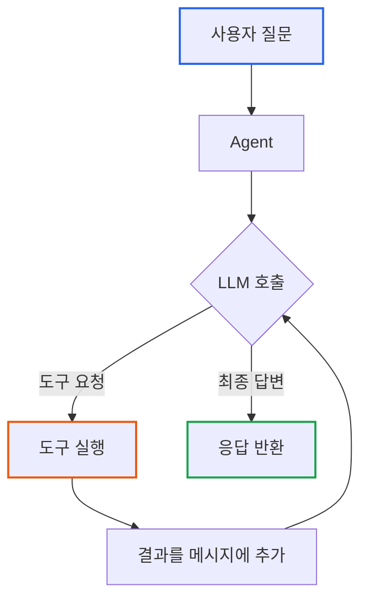

# Essential GraphRAG Part 5: Agentic RAG - 스스로 판단하는 검색 시스템

> **작성일**: 2026년 01월 19일
> **카테고리**: AI, RAG, Agent
> **키워드**: Agentic RAG, LLM Agent, Tool Calling, ReAct, Self-Correction

[##_Image|kage@Go0eE/dJMcaa471HS/AAAAAAAAAAAAAAAAAAAAAPmF8R3IEup_8qoQKGYbl1C_1sU5vGzFAyrc_igyv6Su/img.jpg|alignCenter|width="100%"|_##]

## 요약

기본 RAG는 "질문 → 검색 → 답변"의 고정된 파이프라인을 따른다. Agentic RAG는 이 구조를 탈피하여, LLM이 스스로 검색 도구를 선택하고, 결과를 평가하며, 필요시 재검색하는 자율적 시스템이다. 이 글에서는 Agentic RAG의 핵심 메커니즘인 **에이전트 루프**와 **도구 호출(Tool Calling)**을 분석한다.

---

## 기본 RAG의 한계

### 고정된 파이프라인

```
[기본 RAG]
질문 → 벡터 검색(1회) → LLM → 답변
```

이 구조의 문제점:

1. **단일 검색**: 검색 결과가 부족해도 재검색 불가
2. **고정 도구**: 벡터 검색만 사용, 다른 도구 선택 불가
3. **검증 없음**: 답변 품질을 평가하지 않음

### 복잡한 질문의 실패 사례

```
질문: "김철수 팀의 지난 분기 매출을 분석해줘"

기본 RAG:
1. 벡터 검색: "김철수", "분기 매출" 관련 문서
2. 결과: 매출 분석 가이드 문서 (김철수 팀 정보 없음)
3. 답변: "매출 분석은 다음과 같이 진행합니다..." ← 질문과 무관
```

이 질문에 답하려면:
1. 먼저 김철수가 어느 팀인지 확인 (그래프 쿼리)
2. 해당 팀의 분기 매출 조회 (SQL 또는 그래프)
3. 매출 데이터 분석 (계산)
4. 분석 결과를 자연어로 정리

단일 검색으로는 불가능하다.

---

## 핵심 통찰: LLM은 뇌, 에이전트는 몸

### LLM API의 본질

LLM API 호출은 **1회성 함수 호출**이다.

```python
response = openai.chat.completions.create(
    model="gpt-4",
    messages=[{"role": "user", "content": "안녕"}]
)
# 응답 받으면 끝. 연결 종료.
```

LLM은 스스로:
- 검색할 수 없다
- 반복할 수 없다
- 도구를 실행할 수 없다

**LLM은 텍스트를 입력받아 텍스트를 출력하는 함수일 뿐이다.**

### 에이전트의 역할

"에이전트"는 LLM을 감싸는 **코드**다. 루프를 돌리고, 도구를 실행하는 것은 코드의 역할이다.

```
┌─────────────────────────────────────────────────────┐
│                  Agent (Python 코드)                 │
│  ┌─────────────────────────────────────────────┐   │
│  │  while not done:                             │   │
│  │      response = LLM.call(messages)           │   │ ← 루프는 코드가 돌림
│  │      if response.has_tool_call:              │   │
│  │          result = execute_tool(response)     │   │ ← 도구 실행도 코드
│  │          messages.append(result)             │   │
│  │      else:                                   │   │
│  │          done = True                         │   │
│  └─────────────────────────────────────────────┘   │
└─────────────────────────────────────────────────────┘
```

**비유**:
- LLM = 뇌 (생각만 함)
- Agent 코드 = 몸 (손발을 움직임)
- Tool = 도구 (검색엔진, 계산기, DB)

뇌가 "저 책 가져와"라고 생각하면, 몸이 실제로 걸어가서 책을 가져온다. 뇌 혼자서는 책을 가져올 수 없다.

---

## Tool Calling: LLM이 도구를 요청하는 방법

### 메커니즘

LLM은 텍스트로 "이 도구를 이 파라미터로 호출해달라"고 **요청**한다. 실제 실행은 코드가 한다.

```python
# LLM 응답 예시
{
    "role": "assistant",
    "content": null,           # 텍스트 답변 대신
    "tool_calls": [            # 도구 호출 요청
        {
            "id": "call_abc123",
            "type": "function",
            "function": {
                "name": "search_database",
                "arguments": "{\"query\": \"김철수 팀\"}"
            }
        }
    ]
}
```

### OpenAI Tool Calling 구현

```python
from openai import OpenAI
import json

client = OpenAI()

# 1. 도구 정의
tools = [
    {
        "type": "function",
        "function": {
            "name": "search_vector_db",
            "description": "의미적으로 유사한 문서를 검색합니다",
            "parameters": {
                "type": "object",
                "properties": {
                    "query": {"type": "string", "description": "검색 쿼리"}
                },
                "required": ["query"]
            }
        }
    },
    {
        "type": "function",
        "function": {
            "name": "query_graph_db",
            "description": "구조화된 관계 데이터를 조회합니다",
            "parameters": {
                "type": "object",
                "properties": {
                    "cypher": {"type": "string", "description": "Cypher 쿼리"}
                },
                "required": ["cypher"]
            }
        }
    }
]

# 2. LLM 호출
response = client.chat.completions.create(
    model="gpt-4",
    messages=[{"role": "user", "content": "김철수가 속한 팀은?"}],
    tools=tools
)

# 3. 도구 호출 확인
if response.choices[0].message.tool_calls:
    tool_call = response.choices[0].message.tool_calls[0]
    print(f"도구: {tool_call.function.name}")
    print(f"인자: {tool_call.function.arguments}")
```

출력:
```
도구: query_graph_db
인자: {"cypher": "MATCH (p:Person {name: '김철수'})-[:BELONGS_TO]->(t:Team) RETURN t.name"}
```

---

## 에이전트 루프 구현

### 전체 흐름



### 코드 구현

```python
def agentic_rag(question: str, max_iterations: int = 10) -> str:
    """Agentic RAG 메인 루프"""

    messages = [{"role": "user", "content": question}]

    for i in range(max_iterations):
        # 1. LLM 호출
        response = client.chat.completions.create(
            model="gpt-4",
            messages=messages,
            tools=tools
        )

        assistant_message = response.choices[0].message

        # 2. 도구 호출이 있으면 실행
        if assistant_message.tool_calls:
            messages.append(assistant_message)

            for tool_call in assistant_message.tool_calls:
                # 도구 실행
                result = execute_tool(
                    tool_call.function.name,
                    json.loads(tool_call.function.arguments)
                )

                # 결과를 메시지에 추가
                messages.append({
                    "role": "tool",
                    "tool_call_id": tool_call.id,
                    "content": str(result)
                })

        # 3. 최종 답변이면 반환
        else:
            return assistant_message.content

    return "최대 반복 횟수 초과"


def execute_tool(name: str, args: dict):
    """도구 실행"""
    if name == "search_vector_db":
        return vector_db.search(args["query"])
    elif name == "query_graph_db":
        return graph_db.query(args["cypher"])
    elif name == "calculate":
        return eval(args["expression"])  # 실제로는 안전한 계산기 사용
    else:
        return f"Unknown tool: {name}"
```

### 실행 예시

```
질문: "김철수 팀의 지난 분기 매출은?"

[1회차 LLM 호출]
입력: "김철수 팀의 지난 분기 매출은?"
출력: tool_call: query_graph_db("김철수의 팀 조회")

[Agent가 도구 실행]
→ Neo4j 쿼리 실행 → "개발팀"

[2회차 LLM 호출]
입력: 원래 질문 + "김철수는 개발팀 소속"
출력: tool_call: query_graph_db("개발팀 지난 분기 매출 조회")

[Agent가 도구 실행]
→ Neo4j 쿼리 실행 → "45억원"

[3회차 LLM 호출]
입력: 원래 질문 + "개발팀" + "45억원"
출력: "김철수가 속한 개발팀의 지난 분기 매출은 45억원입니다."

[루프 종료 - 최종 답변 반환]
```

---

## Agentic RAG의 핵심 구성요소

### 1. Retriever Router (검색 라우터)

질문의 성격에 따라 적합한 도구를 선택한다.

```python
tools = [
    {
        "type": "function",
        "function": {
            "name": "semantic_search",
            "description": """의미적으로 유사한 문서를 검색합니다.
            사용 예: 개념 설명, 방법론, 원리, 가이드 등
            사용하지 말 것: 정확한 숫자, 관계 조회, 목록"""
        }
    },
    {
        "type": "function",
        "function": {
            "name": "graph_query",
            "description": """구조화된 관계 데이터를 조회합니다.
            사용 예: "X가 몇 개인가?", "X와 Y의 관계", "X를 담당하는 사람"
            사용하지 말 것: 개념 설명, 요약, 분석 방법론"""
        }
    },
    {
        "type": "function",
        "function": {
            "name": "sql_query",
            "description": """정형 데이터베이스를 조회합니다.
            사용 예: 매출 집계, 기간별 통계, 수치 계산"""
        }
    }
]
```

**도구 설명이 명확할수록 LLM이 올바른 도구를 선택한다.**

### 2. Answer Critic (답변 비평가)

생성된 답변이 검색된 근거에 충실한지 평가한다.

```python
def critique_answer(question: str, context: str, answer: str) -> dict:
    """답변 품질 평가"""
    prompt = f"""다음 답변이 주어진 컨텍스트에 충실한지 평가하세요.

질문: {question}
컨텍스트: {context}
답변: {answer}

평가 기준:
1. 충실성(Faithfulness): 답변이 컨텍스트에만 근거하는가? (1-5)
2. 완전성(Completeness): 질문에 완전히 답했는가? (1-5)
3. 환각 여부: 컨텍스트에 없는 정보를 포함했는가? (Yes/No)

JSON 형식으로 응답:
{{"faithfulness": int, "completeness": int, "hallucination": bool, "feedback": str}}"""

    response = llm.invoke(prompt)
    return json.loads(response.content)
```

### 3. Self-Correction Loop (자가 교정 루프)

답변 품질이 낮으면 재검색한다.

```python
def agentic_rag_with_critique(question: str) -> str:
    """자가 교정이 포함된 Agentic RAG"""

    for attempt in range(3):
        # 1. 검색 및 답변 생성
        context = retrieve(question)
        answer = generate_answer(question, context)

        # 2. 답변 평가
        critique = critique_answer(question, context, answer)

        # 3. 품질 충분하면 반환
        if critique["faithfulness"] >= 4 and not critique["hallucination"]:
            return answer

        # 4. 부족하면 피드백 반영하여 재검색
        question = f"{question}\n\n이전 시도 피드백: {critique['feedback']}"

    return "충분한 정보를 찾지 못했습니다."
```

---

## LangChain Agent 구현

### ReAct Agent

**ReAct** = Reasoning + Acting. 생각하고 행동하는 패턴이다.

```
Thought: 김철수의 팀을 먼저 알아야 한다.
Action: graph_query
Action Input: MATCH (p:Person {name: '김철수'})-[:BELONGS_TO]->(t) RETURN t.name
Observation: 개발팀

Thought: 개발팀의 매출을 조회한다.
Action: sql_query
Action Input: SELECT SUM(amount) FROM sales WHERE team = '개발팀' AND quarter = 'Q4'
Observation: 4500000000

Thought: 정보가 충분하다. 답변을 생성한다.
Final Answer: 김철수가 속한 개발팀의 지난 분기 매출은 45억원입니다.
```

### 코드 구현

```python
from langchain.agents import create_react_agent, AgentExecutor
from langchain_openai import ChatOpenAI
from langchain.tools import Tool
from langchain import hub

# 1. 도구 정의
tools = [
    Tool(
        name="semantic_search",
        func=lambda q: vector_db.search(q),
        description="의미적으로 유사한 문서를 검색합니다. 개념, 방법론, 가이드 검색에 사용."
    ),
    Tool(
        name="graph_query",
        func=lambda cypher: graph_db.query(cypher),
        description="Neo4j Cypher 쿼리를 실행합니다. 관계, 목록, 개수 조회에 사용."
    ),
    Tool(
        name="sql_query",
        func=lambda sql: sql_db.execute(sql),
        description="SQL 쿼리를 실행합니다. 매출, 통계, 집계에 사용."
    )
]

# 2. 프롬프트
prompt = hub.pull("hwchase17/react")

# 3. Agent 생성
llm = ChatOpenAI(model="gpt-4", temperature=0)
agent = create_react_agent(llm, tools, prompt)

# 4. AgentExecutor (루프를 관리하는 실행기)
agent_executor = AgentExecutor(
    agent=agent,
    tools=tools,
    verbose=True,       # 중간 과정 출력
    max_iterations=10,  # 최대 반복 횟수
    handle_parsing_errors=True
)

# 5. 실행
result = agent_executor.invoke({
    "input": "김철수 팀의 지난 분기 매출은?"
})

print(result["output"])
```

---

## 정적 RAG vs Agentic RAG 비교

| 특성 | 정적 RAG | Agentic RAG |
|-----|---------|-------------|
| 검색 횟수 | 1회 고정 | 필요한 만큼 반복 |
| 도구 선택 | 고정 (벡터 검색만) | 동적 (LLM이 판단) |
| 오류 처리 | 없음 | 자가 교정 |
| 복잡한 질문 | 실패 | 단계별 해결 |
| 비용 | 낮음 | 높음 (다수 LLM 호출) |
| 지연 | 짧음 | 김 (다수 호출) |

### 사용 시나리오

```
정적 RAG 적합:
- 단순 FAQ 답변
- 단일 문서 검색
- 빠른 응답 필요

Agentic RAG 적합:
- 다단계 추론 필요
- 여러 데이터 소스 통합
- 정확도가 속도보다 중요
```

---

## 실습: 멀티 도구 에이전트

### 도구 정의

```python
from langchain.tools import Tool
from langchain_community.vectorstores import Chroma
from langchain_community.graphs import Neo4jGraph

# 벡터 검색 도구
def search_docs(query: str) -> str:
    results = vectorstore.similarity_search(query, k=3)
    return "\n".join([doc.page_content for doc in results])

vector_tool = Tool(
    name="document_search",
    func=search_docs,
    description="""회사 문서에서 정보를 검색합니다.
    용도: 정책, 가이드, 절차, 개념 설명
    입력: 검색 키워드"""
)

# 그래프 쿼리 도구
def query_graph(cypher: str) -> str:
    result = graph.query(cypher)
    return str(result)

graph_tool = Tool(
    name="employee_database",
    func=query_graph,
    description="""직원 및 조직 정보를 조회합니다.
    용도: 직원 정보, 팀 구성, 업무 할당
    입력: Cypher 쿼리

    스키마:
    - (Person)-[:BELONGS_TO]->(Team)
    - (Person)-[:ASSIGNED_TO]->(Task)
    - (Task)-[:HAS_STATUS]->(Status)"""
)

# 계산기 도구
def calculate(expression: str) -> str:
    try:
        # 안전한 수식 평가
        result = eval(expression, {"__builtins__": {}}, {})
        return str(result)
    except Exception as e:
        return f"계산 오류: {e}"

calc_tool = Tool(
    name="calculator",
    func=calculate,
    description="""수학 계산을 수행합니다.
    용도: 합계, 평균, 비율 계산
    입력: Python 수식 (예: 100 * 0.15)"""
)

tools = [vector_tool, graph_tool, calc_tool]
```

### 테스트

```python
test_questions = [
    "회사의 휴가 정책은 어떻게 되나요?",          # → document_search
    "개발팀에 몇 명이 있나요?",                   # → employee_database
    "김철수의 완료율이 80%이고 10개 업무가 있다면 완료한 건 몇 개?",  # → calculator
    "김철수 팀의 평균 업무 완료율을 분석해줘",      # → 다중 도구
]

for q in test_questions:
    print(f"\n질문: {q}")
    result = agent_executor.invoke({"input": q})
    print(f"답변: {result['output']}")
```

---

## 핵심 정리

| 개념 | 설명 |
|-----|-----|
| LLM = 뇌 | 텍스트 입출력만 가능, 도구 실행 불가 |
| Agent = 몸 | 루프를 돌리고 도구를 실행하는 코드 |
| Tool Calling | LLM이 도구 사용을 요청하는 프로토콜 |
| ReAct | Reasoning + Acting 패턴 |
| Self-Correction | 답변 품질 평가 후 재검색 |

---

## 다음 단계

Agentic RAG로 자율적인 검색 시스템을 구축했다. 그러나 검색할 **지식 그래프가 존재해야** 한다. 다음 글에서는 LLM을 활용하여 비정형 텍스트에서 **자동으로 지식 그래프를 구축**하는 방법을 다룬다.

### 시리즈 목차

1. [LLM 정확도 향상](https://blog.imprun.dev/148)
2. [벡터 검색과 하이브리드 검색](https://blog.imprun.dev/149)
3. [고급 벡터 검색 전략](https://blog.imprun.dev/150)
4. [Text2Cypher: 자연어를 그래프 쿼리로](https://blog.imprun.dev/151)
5. **Agentic RAG** (현재 글)
6. [LLM으로 지식 그래프 구축](https://blog.imprun.dev/153)
7. [Microsoft GraphRAG 구현](https://blog.imprun.dev/154)
8. [RAG 평가 체계](https://blog.imprun.dev/155)

---

## 참고 자료

### 논문
- Yao et al. (2022). "ReAct: Synergizing Reasoning and Acting in Language Models"

### 공식 문서
- [OpenAI Function Calling](https://platform.openai.com/docs/guides/function-calling)
- [LangChain Agents](https://python.langchain.com/docs/modules/agents/)

### 관련 블로그
- [AI 에이전트 개념: 에이전트가 '도구'를 사용한다는 것의 의미](https://blog.imprun.dev/123)
