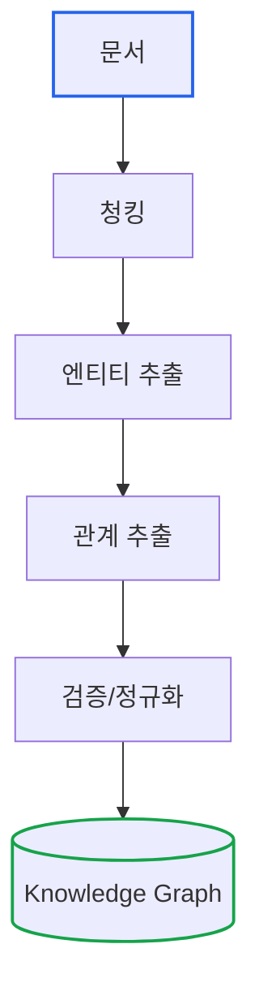

# Essential GraphRAG Part 6: LLM으로 지식 그래프 구축

> **작성일**: 2026년 01월 19일
> **카테고리**: AI, Knowledge Graph, LLM
> **키워드**: Knowledge Graph Construction, Entity Extraction, Relation Extraction, LLM, Neo4j

[##_Image|kage@Oau0U/dJMcagYyzjq/AAAAAAAAAAAAAAAAAAAAAPkZ0ZB89EdHhY8RJcuK6zGsTWFrhi712NmcO0QN7ed8/img.jpg|alignCenter|width="100%"|_##]

## 요약

지식 그래프 기반 RAG는 그래프가 **존재해야** 작동한다. 수동으로 그래프를 구축하는 것은 비용이 크고 확장이 어렵다. 이 글에서는 LLM을 활용하여 비정형 텍스트에서 **자동으로 엔티티와 관계를 추출**하고 지식 그래프를 구축하는 방법을 다룬다.

---

## 수동 그래프 구축의 한계

### 전통적인 방식

```
1. 도메인 전문가가 온톨로지 설계
2. 데이터 분석가가 문서 분석
3. 수작업으로 엔티티/관계 추출
4. 검증 및 품질 관리
```

**문제점**:
- 시간 소요: 문서 1개당 수 시간
- 확장성 부재: 문서가 늘어날수록 비용 증가
- 일관성 문제: 작업자마다 다른 판단
- 업데이트 어려움: 새 문서 추가 시 반복 작업

### LLM 기반 자동화

```
문서 → LLM → 엔티티/관계 추출 → 지식 그래프
```

LLM은 자연어 이해에 탁월하므로, 텍스트에서 구조화된 정보를 추출하는 데 적합하다.

---

## 엔티티/관계 추출 파이프라인

### 전체 아키텍처



### 1단계: 문서 청킹

긴 문서는 LLM의 컨텍스트 한계를 초과한다. 적절한 크기로 분할한다.

```python
from langchain.text_splitter import RecursiveCharacterTextSplitter

splitter = RecursiveCharacterTextSplitter(
    chunk_size=2000,
    chunk_overlap=200,
    separators=["\n\n", "\n", ". ", " "]
)

chunks = splitter.split_text(document)
```

### 2단계: 엔티티 추출

```python
from langchain_openai import ChatOpenAI
from pydantic import BaseModel, Field
from typing import List

class Entity(BaseModel):
    name: str = Field(description="엔티티 이름")
    type: str = Field(description="엔티티 유형 (Person, Organization, Product, Event 등)")
    description: str = Field(description="엔티티에 대한 간단한 설명")

class EntityList(BaseModel):
    entities: List[Entity]

llm = ChatOpenAI(model="gpt-4", temperature=0)
structured_llm = llm.with_structured_output(EntityList)

def extract_entities(text: str) -> List[Entity]:
    prompt = f"""다음 텍스트에서 주요 엔티티(사람, 조직, 제품, 이벤트 등)를 추출하세요.

텍스트:
{text}

각 엔티티에 대해 이름, 유형, 설명을 제공하세요."""

    result = structured_llm.invoke(prompt)
    return result.entities
```

### 3단계: 관계 추출

```python
class Relation(BaseModel):
    source: str = Field(description="관계의 출발 엔티티")
    relation_type: str = Field(description="관계 유형 (WORKS_FOR, FOUNDED, LOCATED_IN 등)")
    target: str = Field(description="관계의 도착 엔티티")
    description: str = Field(description="관계에 대한 설명")

class RelationList(BaseModel):
    relations: List[Relation]

def extract_relations(text: str, entities: List[Entity]) -> List[Relation]:
    entity_names = [e.name for e in entities]

    prompt = f"""다음 텍스트에서 엔티티 간의 관계를 추출하세요.

텍스트:
{text}

추출된 엔티티: {entity_names}

각 관계에 대해 출발 엔티티, 관계 유형, 도착 엔티티, 설명을 제공하세요.
관계 유형은 동사 형태로 작성하세요 (예: WORKS_FOR, FOUNDED, ACQUIRED, LOCATED_IN)."""

    structured_llm = llm.with_structured_output(RelationList)
    result = structured_llm.invoke(prompt)
    return result.relations
```

### 4단계: 그래프 저장

```python
from neo4j import GraphDatabase

def save_to_neo4j(entities: List[Entity], relations: List[Relation]):
    driver = GraphDatabase.driver("bolt://localhost:7687", auth=("neo4j", "password"))

    with driver.session() as session:
        # 엔티티 생성
        for entity in entities:
            session.run(
                f"""
                MERGE (e:{entity.type} {{name: $name}})
                SET e.description = $description
                """,
                name=entity.name,
                description=entity.description
            )

        # 관계 생성
        for rel in relations:
            session.run(
                f"""
                MATCH (a {{name: $source}})
                MATCH (b {{name: $target}})
                MERGE (a)-[r:{rel.relation_type}]->(b)
                SET r.description = $description
                """,
                source=rel.source,
                target=rel.target,
                description=rel.description
            )

    driver.close()
```

---

## 실전 예시

### 입력 텍스트

```
삼성전자는 1969년 이병철 회장이 설립한 대한민국의 대표적인 전자 기업이다.
본사는 서울 서초구에 위치해 있으며, 현재 CEO는 한종희이다.
2023년 반도체 사업부에서 갤럭시 S23 시리즈를 출시했다.
애플과는 스마트폰 시장에서 경쟁 관계에 있다.
```

### 추출 결과

**엔티티**:
```json
[
  {"name": "삼성전자", "type": "Organization", "description": "대한민국 전자 기업"},
  {"name": "이병철", "type": "Person", "description": "삼성전자 설립자"},
  {"name": "한종희", "type": "Person", "description": "삼성전자 현 CEO"},
  {"name": "갤럭시 S23", "type": "Product", "description": "삼성전자 스마트폰"},
  {"name": "애플", "type": "Organization", "description": "스마트폰 제조 기업"},
  {"name": "서울 서초구", "type": "Location", "description": "삼성전자 본사 위치"}
]
```

**관계**:
```json
[
  {"source": "이병철", "relation_type": "FOUNDED", "target": "삼성전자"},
  {"source": "한종희", "relation_type": "CEO_OF", "target": "삼성전자"},
  {"source": "삼성전자", "relation_type": "LOCATED_IN", "target": "서울 서초구"},
  {"source": "삼성전자", "relation_type": "PRODUCES", "target": "갤럭시 S23"},
  {"source": "삼성전자", "relation_type": "COMPETES_WITH", "target": "애플"}
]
```

### 생성된 그래프

```
[이병철] ─FOUNDED→ [삼성전자] ─PRODUCES→ [갤럭시 S23]
                      │
                      ├─LOCATED_IN→ [서울 서초구]
                      │
                      ├─CEO_OF← [한종희]
                      │
                      └─COMPETES_WITH→ [애플]
```

---

## 품질 향상 전략

### 1. 온톨로지 사전 정의

LLM이 일관된 엔티티 타입과 관계 타입을 사용하도록 가이드한다.

```python
ONTOLOGY = """
## 엔티티 타입
- Person: 사람 (이름, 직책)
- Organization: 회사, 기관 (이름, 산업)
- Product: 제품, 서비스 (이름, 카테고리)
- Location: 장소 (이름, 유형)
- Event: 사건, 이벤트 (이름, 날짜)

## 관계 타입
- FOUNDED: Person → Organization (설립)
- WORKS_FOR: Person → Organization (근무)
- CEO_OF: Person → Organization (CEO)
- LOCATED_IN: Organization → Location (위치)
- PRODUCES: Organization → Product (생산)
- ACQUIRED: Organization → Organization (인수)
- COMPETES_WITH: Organization → Organization (경쟁)
- OCCURRED_AT: Event → Location (발생 장소)
"""

prompt = f"""다음 온톨로지를 따라 엔티티와 관계를 추출하세요.

{ONTOLOGY}

텍스트:
{text}
"""
```

### 2. 엔티티 정규화

같은 엔티티가 다른 이름으로 추출될 수 있다.

```python
def normalize_entity(name: str, existing_entities: List[str]) -> str:
    """유사한 기존 엔티티가 있으면 병합"""
    prompt = f"""다음 엔티티 이름이 기존 목록의 어떤 항목과 같은 대상을 가리키는지 판단하세요.

새 엔티티: {name}
기존 엔티티: {existing_entities}

같은 대상이 있으면 해당 이름을 반환하고, 없으면 'NEW'를 반환하세요."""

    result = llm.invoke(prompt).content.strip()

    if result != "NEW" and result in existing_entities:
        return result
    return name

# 예시
normalize_entity("삼성", ["삼성전자", "LG전자"])
# → "삼성전자"
```

### 3. 관계 검증

추출된 관계가 텍스트에 실제로 명시되어 있는지 확인한다.

```python
def verify_relation(text: str, relation: Relation) -> bool:
    """관계가 텍스트에 근거하는지 검증"""
    prompt = f"""다음 텍스트에서 아래 관계가 명시적으로 언급되었는지 판단하세요.

텍스트: {text}

관계: {relation.source} -{relation.relation_type}-> {relation.target}

'YES' 또는 'NO'로만 답하세요."""

    result = llm.invoke(prompt).content.strip().upper()
    return result == "YES"
```

---

## LangChain LLMGraphTransformer

LangChain은 이 과정을 자동화하는 도구를 제공한다.

```python
from langchain_experimental.graph_transformers import LLMGraphTransformer
from langchain_community.graphs import Neo4jGraph
from langchain_openai import ChatOpenAI
from langchain.schema import Document

# 1. LLM 설정
llm = ChatOpenAI(model="gpt-4", temperature=0)

# 2. 그래프 변환기 생성
transformer = LLMGraphTransformer(llm=llm)

# 3. 문서를 그래프로 변환
documents = [
    Document(page_content="""
    삼성전자는 1969년 이병철 회장이 설립한 대한민국의 대표적인 전자 기업이다.
    본사는 서울 서초구에 위치해 있으며, 현재 CEO는 한종희이다.
    """)
]

graph_documents = transformer.convert_to_graph_documents(documents)

# 4. Neo4j에 저장
graph = Neo4jGraph(url="bolt://localhost:7687", username="neo4j", password="password")
graph.add_graph_documents(graph_documents)

# 5. 결과 확인
print(graph.schema)
```

### 허용 엔티티/관계 제한

```python
transformer = LLMGraphTransformer(
    llm=llm,
    allowed_nodes=["Person", "Organization", "Product", "Location"],
    allowed_relationships=["FOUNDED", "WORKS_FOR", "PRODUCES", "LOCATED_IN", "COMPETES_WITH"]
)
```

---

## 대규모 문서 처리

### 배치 처리

```python
import asyncio
from typing import List

async def process_document_batch(documents: List[Document], batch_size: int = 10):
    """문서를 배치로 처리"""
    results = []

    for i in range(0, len(documents), batch_size):
        batch = documents[i:i + batch_size]

        # 병렬 처리
        tasks = [transformer.aconvert_to_graph_documents([doc]) for doc in batch]
        batch_results = await asyncio.gather(*tasks)

        results.extend(batch_results)

        print(f"처리 완료: {min(i + batch_size, len(documents))}/{len(documents)}")

    return results
```

### 증분 업데이트

```python
def update_graph_incrementally(new_document: Document):
    """기존 그래프에 새 문서 추가"""

    # 1. 새 문서에서 그래프 추출
    new_graph = transformer.convert_to_graph_documents([new_document])

    # 2. 기존 엔티티와 병합
    existing_entities = graph.query("MATCH (n) RETURN n.name AS name")
    existing_names = [e["name"] for e in existing_entities]

    for node in new_graph[0].nodes:
        normalized_name = normalize_entity(node.id, existing_names)
        node.id = normalized_name

    # 3. Neo4j에 추가 (MERGE로 중복 방지)
    graph.add_graph_documents(new_graph)
```

---

## 품질 평가

### 수동 검증 샘플링

```python
import random

def sample_for_verification(graph_docs, sample_size: int = 10):
    """검증을 위한 샘플 추출"""
    all_relations = []
    for doc in graph_docs:
        all_relations.extend(doc.relationships)

    sample = random.sample(all_relations, min(sample_size, len(all_relations)))

    print("=== 검증 대상 관계 ===")
    for rel in sample:
        print(f"- {rel.source.id} -{rel.type}-> {rel.target.id}")

    return sample
```

### 자동 품질 지표

```python
def evaluate_extraction_quality(text: str, graph_doc) -> dict:
    """추출 품질 평가"""

    # 1. 커버리지: 텍스트에 언급된 엔티티 중 추출된 비율
    mentioned_entities = extract_all_noun_phrases(text)  # 간단한 NLP
    extracted_entities = [n.id for n in graph_doc.nodes]
    coverage = len(set(extracted_entities) & set(mentioned_entities)) / len(mentioned_entities)

    # 2. 정밀도: 추출된 관계 중 검증된 비율
    verified = sum(1 for rel in graph_doc.relationships if verify_relation(text, rel))
    precision = verified / len(graph_doc.relationships) if graph_doc.relationships else 0

    return {
        "coverage": coverage,
        "precision": precision,
        "entity_count": len(graph_doc.nodes),
        "relation_count": len(graph_doc.relationships)
    }
```

---

## 핵심 정리

| 단계 | 설명 |
|-----|-----|
| 청킹 | 긴 문서를 처리 가능한 크기로 분할 |
| 엔티티 추출 | 텍스트에서 주요 개체 식별 |
| 관계 추출 | 엔티티 간의 관계 식별 |
| 정규화 | 중복 엔티티 병합 |
| 검증 | 추출 결과의 정확성 확인 |

---

## 다음 단계

LLM으로 지식 그래프를 자동 구축하는 방법을 다뤘다. 다음 글에서는 Microsoft가 개발한 **GraphRAG** 구현체를 분석한다. 커뮤니티 탐지와 계층적 요약을 통해 대규모 문서 집합에서 전역적 질문에 답하는 방법을 다룬다.

### 시리즈 목차

1. [LLM 정확도 향상](https://blog.imprun.dev/148)
2. [벡터 검색과 하이브리드 검색](https://blog.imprun.dev/149)
3. [고급 벡터 검색 전략](https://blog.imprun.dev/150)
4. [Text2Cypher: 자연어를 그래프 쿼리로](https://blog.imprun.dev/151)
5. [Agentic RAG](https://blog.imprun.dev/152)
6. **LLM으로 지식 그래프 구축** (현재 글)
7. [Microsoft GraphRAG 구현](https://blog.imprun.dev/154)
8. [RAG 평가 체계](https://blog.imprun.dev/155)

---

## 참고 자료

### 공식 문서
- [LangChain Graph Transformers](https://python.langchain.com/docs/use_cases/graph/constructing)
- [Neo4j LLM Knowledge Graph Builder](https://neo4j.com/labs/genai-ecosystem/llm-graph-builder/)

### 논문
- Pan et al. (2024). "Unifying Large Language Models and Knowledge Graphs: A Roadmap"
