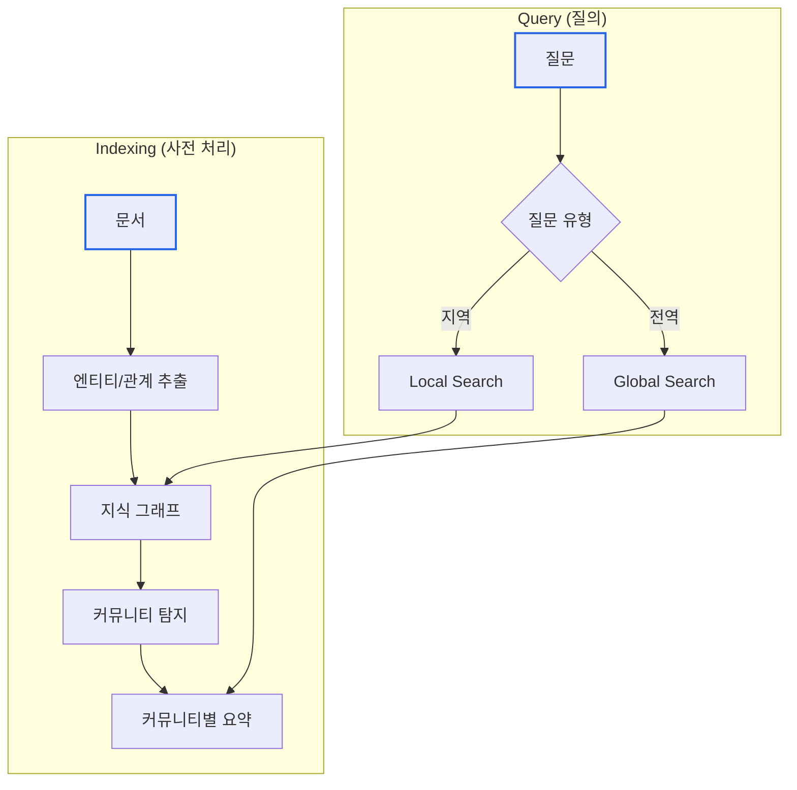
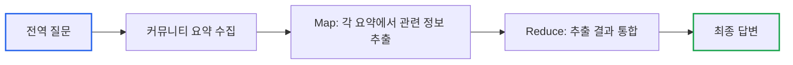
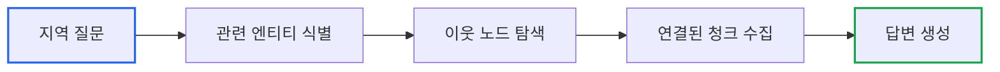

# Essential GraphRAG Part 7: Microsoft GraphRAG 구현

> **작성일**: 2026년 01월 19일
> **카테고리**: AI, RAG, Knowledge Graph
> **키워드**: Microsoft GraphRAG, Community Detection, Global Search, Local Search, Hierarchical Summarization

[##_Image|kage@pSJ00/dJMcagROh1M/AAAAAAAAAAAAAAAAAAAAANr1lrlFP5pKsEfGedfgz_l1uRuMVR0q64PqjuzZZ1Cp/img.jpg|alignCenter|width="100%"|_##]

## 요약

Microsoft의 GraphRAG는 **요약 중심의 RAG**에 특화된 구현체다. 기존 RAG가 "이 문서에 뭐라고 써있어?"라는 질문에 답한다면, GraphRAG는 "전체 데이터에서 주요 테마가 뭐야?"와 같은 **전역적 질문**에 답할 수 있다. 이 글에서는 GraphRAG의 핵심 메커니즘인 커뮤니티 탐지와 계층적 요약을 분석한다.

---

## 기존 RAG의 전역적 질문 한계

### 문제 상황

```
문서 집합: 호메로스의 "오디세이" 전체 텍스트

질문: "이 서사시의 주요 테마는 무엇인가?"

기본 RAG:
1. "테마"와 유사한 청크 검색
2. 랜덤한 몇 개 문단 반환
3. 불완전한 답변

문제: 어떤 청크도 "전체 테마"를 담고 있지 않음
```

기본 RAG는 **로컬 검색**(특정 정보 찾기)에 최적화되어 있다. 전체 데이터를 아우르는 **글로벌 질문**에는 구조적으로 답할 수 없다.

### GraphRAG의 해결책

전체 문서를 **사전에 요약**해두고, 질문 시 요약을 참조한다.



---

## GraphRAG 인덱싱 파이프라인

### 1단계: 텍스트 청킹

```python
# 일반적으로 300-500 토큰 단위
chunks = split_documents(documents, chunk_size=300, overlap=50)
```

### 2단계: 엔티티/관계 추출

Part 6에서 다룬 LLM 기반 추출을 수행한다.

```python
# 각 청크에서 엔티티와 관계 추출
for chunk in chunks:
    entities = extract_entities(chunk)
    relations = extract_relations(chunk, entities)
    graph.add(entities, relations)
```

### 3단계: 커뮤니티 탐지

**커뮤니티**란 그래프에서 밀접하게 연결된 노드 그룹이다.

```
전체 그래프:
[오디세우스] ── [페넬로페]
      │              │
      └──[이타카]────┘
              │
[포세이돈] ── [바다]
      │
[아테나] ── [지혜]
```

커뮤니티 탐지 결과:
```
커뮤니티 1: 오디세우스, 페넬로페, 이타카 (귀향 테마)
커뮤니티 2: 포세이돈, 바다 (신들의 개입)
커뮤니티 3: 아테나, 지혜 (영웅의 조력자)
```

**Leiden 알고리즘**을 주로 사용한다:

```python
import networkx as nx
from cdlib import algorithms

# NetworkX 그래프로 변환
G = nx.Graph()
G.add_edges_from([(r.source, r.target) for r in relations])

# Leiden 커뮤니티 탐지
communities = algorithms.leiden(G)

for i, community in enumerate(communities.communities):
    print(f"커뮤니티 {i}: {community}")
```

### 4단계: 계층적 요약

각 커뮤니티의 내용을 LLM으로 요약한다. 이 요약은 **미리 생성**되어 저장된다.

```python
def summarize_community(community_nodes: List[str], graph) -> str:
    """커뮤니티 내용 요약"""

    # 커뮤니티 내 모든 엔티티와 관계 수집
    context = []
    for node in community_nodes:
        node_info = graph.get_node(node)
        relations = graph.get_relations(node)
        context.append(f"엔티티: {node_info}")
        context.append(f"관계: {relations}")

    prompt = f"""다음 정보를 바탕으로 이 그룹의 핵심 내용을 2-3문장으로 요약하세요.

{chr(10).join(context)}

요약:"""

    return llm.invoke(prompt).content
```

**계층 구조**: 커뮤니티는 여러 레벨로 구성된다.

```
Level 0 (가장 세분화):
  - 커뮤니티 0.1: 오디세우스, 페넬로페
  - 커뮤니티 0.2: 텔레마코스, 멘토르
  - 커뮤니티 0.3: 포세이돈, 바다

Level 1 (중간):
  - 커뮤니티 1.1: 귀향 이야기 (0.1 + 0.2 병합)
  - 커뮤니티 1.2: 신들의 개입 (0.3)

Level 2 (최상위):
  - 커뮤니티 2.1: 오디세이 전체 테마
```

---

## Global Search vs Local Search

### Global Search (전역 검색)

**용도**: 전체 데이터를 아우르는 질문

```
"이 서사시의 주요 테마는?"
"가장 중요한 등장인물 5명은?"
"전체 이야기의 교훈은?"
```

**동작 방식**:



1. **Map 단계**: 각 커뮤니티 요약에 질문을 던져 관련 정보 추출
2. **Reduce 단계**: 추출된 정보들을 통합하여 최종 답변 생성

```python
def global_search(question: str, community_summaries: List[str]) -> str:
    # Map: 각 커뮤니티에서 관련 정보 추출
    partial_answers = []
    for summary in community_summaries:
        prompt = f"""다음 요약에서 질문과 관련된 정보를 추출하세요.
        관련 정보가 없으면 'N/A'를 반환하세요.

        질문: {question}
        요약: {summary}"""

        answer = llm.invoke(prompt).content
        if answer != "N/A":
            partial_answers.append(answer)

    # Reduce: 통합
    reduce_prompt = f"""다음 정보들을 종합하여 질문에 답하세요.

    질문: {question}
    수집된 정보:
    {chr(10).join(partial_answers)}

    종합 답변:"""

    return llm.invoke(reduce_prompt).content
```

### Local Search (지역 검색)

**용도**: 특정 엔티티나 관계에 대한 질문

```
"오디세우스는 누구인가?"
"페넬로페와 오디세우스의 관계는?"
"이타카는 어디인가?"
```

**동작 방식**:



1. 질문에서 엔티티 추출
2. 그래프에서 해당 엔티티와 이웃 노드 검색
3. 관련 텍스트 청크 수집
4. 답변 생성

```python
def local_search(question: str, graph) -> str:
    # 질문에서 엔티티 추출
    entities = extract_entities_from_question(question)

    # 그래프에서 관련 정보 수집
    context = []
    for entity in entities:
        node = graph.get_node(entity)
        neighbors = graph.get_neighbors(entity, depth=2)
        related_chunks = graph.get_chunks(entity)

        context.append(f"엔티티: {node}")
        context.append(f"관련 노드: {neighbors}")
        context.append(f"원문: {related_chunks}")

    prompt = f"""다음 정보를 바탕으로 질문에 답하세요.

    질문: {question}
    컨텍스트: {chr(10).join(context)}"""

    return llm.invoke(prompt).content
```

### 비교

| 특성 | Global Search | Local Search |
|-----|--------------|--------------|
| 질문 유형 | 전체 요약, 테마, 트렌드 | 특정 사실, 엔티티 정보 |
| 검색 대상 | 커뮤니티 요약 | 그래프 노드/엣지 |
| 비용 | 높음 (Map-Reduce) | 낮음 (직접 탐색) |
| 정확도 | 개괄적 | 구체적 |

---

## Microsoft GraphRAG 설치 및 사용

### 설치

```bash
pip install graphrag
```

### 프로젝트 초기화

```bash
# 프로젝트 디렉토리 생성
mkdir my-graphrag-project
cd my-graphrag-project

# GraphRAG 초기화
graphrag init --root .
```

생성되는 파일 구조:
```
my-graphrag-project/
├── settings.yaml       # 설정 파일
├── prompts/           # LLM 프롬프트 템플릿
│   ├── entity_extraction.txt
│   ├── summarize_descriptions.txt
│   └── ...
└── input/             # 입력 문서
```

### 설정 (settings.yaml)

```yaml
llm:
  api_key: ${OPENAI_API_KEY}
  model: gpt-4
  max_tokens: 4000

embeddings:
  model: text-embedding-3-small

chunks:
  size: 300
  overlap: 50

entity_extraction:
  max_gleanings: 1

community_reports:
  max_length: 2000

claim_extraction:
  enabled: false
```

### 인덱싱 실행

```bash
# 입력 문서를 input/ 폴더에 복사
cp odyssey.txt input/

# 인덱싱 실행
graphrag index --root .
```

인덱싱 결과:
```
output/
├── artifacts/
│   ├── create_final_entities.parquet
│   ├── create_final_relationships.parquet
│   ├── create_final_communities.parquet
│   └── create_final_community_reports.parquet
└── reports/
    └── indexing_report.json
```

### 쿼리 실행

```bash
# Global Search
graphrag query --root . --method global --query "오디세이의 주요 테마는?"

# Local Search
graphrag query --root . --method local --query "오디세우스는 누구인가?"
```

---

## Python API 사용

```python
import asyncio
from graphrag.query.context_builder.entity_extraction import EntityVectorStoreKey
from graphrag.query.indexer_adapters import (
    read_indexer_entities,
    read_indexer_relationships,
    read_indexer_reports,
)
from graphrag.query.llm.oai.chat_openai import ChatOpenAI
from graphrag.query.structured_search.global_search.community_context import GlobalCommunityContext
from graphrag.query.structured_search.global_search.search import GlobalSearch

# 데이터 로드
entities = read_indexer_entities(output_dir, entity_config)
relationships = read_indexer_relationships(output_dir)
reports = read_indexer_reports(output_dir, community_level)

# LLM 설정
llm = ChatOpenAI(api_key=api_key, model="gpt-4")

# Global Search 설정
context_builder = GlobalCommunityContext(
    entities=entities,
    relationships=relationships,
    community_reports=reports,
)

search_engine = GlobalSearch(
    llm=llm,
    context_builder=context_builder,
)

# 쿼리 실행
async def run_query():
    result = await search_engine.asearch("오디세이의 주요 테마는?")
    print(result.response)

asyncio.run(run_query())
```

---

## 성능 최적화

### 1. 커뮤니티 레벨 선택

```yaml
# 낮은 레벨: 세분화된 커뮤니티, 정확하지만 비용 높음
community_reports:
  level: 0

# 높은 레벨: 큰 커뮤니티, 빠르지만 개괄적
community_reports:
  level: 2
```

### 2. Map-Reduce 병렬화

```python
# 동시 실행 수 제한
search_engine = GlobalSearch(
    llm=llm,
    context_builder=context_builder,
    map_llm_params={"max_concurrency": 10}
)
```

### 3. 캐싱

인덱싱 결과는 Parquet 파일로 저장되므로 재사용 가능하다. 문서가 추가될 때만 증분 인덱싱을 수행한다.

---

## 활용 사례

### 1. 대규모 문서 분석

```
문서: 회사 10년치 보고서 (수백 개 파일)
질문: "지난 10년간 회사의 전략 변화는?"
→ Global Search로 전체 흐름 파악
```

### 2. 법률 문서 검토

```
문서: 계약서, 판례, 규정 집합
질문: "이 계약의 주요 위험 요소는?"
→ Global Search로 전체 위험 요약
```

### 3. 연구 문헌 조사

```
문서: 특정 분야 논문 100편
질문: "이 분야의 주요 연구 방향은?"
→ Global Search로 트렌드 파악
```

---

## 핵심 정리

| 개념 | 설명 |
|-----|-----|
| 커뮤니티 탐지 | 밀접하게 연결된 노드 그룹 식별 |
| 계층적 요약 | 커뮤니티별 사전 요약 생성 |
| Global Search | 전체 데이터 아우르는 질문 (Map-Reduce) |
| Local Search | 특정 엔티티 관련 질문 (그래프 탐색) |

---

## 다음 단계

GraphRAG로 전역적 질문에 답할 수 있게 되었다. 하지만 "이 답변이 정확한가?"를 어떻게 검증할까? 마지막 글에서는 RAG 시스템의 **평가 체계**를 다룬다. Faithfulness, Ground Truth, RAGAS 지표를 통해 시스템 품질을 정량화하는 방법을 분석한다.

### 시리즈 목차

1. [LLM 정확도 향상](https://blog.imprun.dev/148)
2. [벡터 검색과 하이브리드 검색](https://blog.imprun.dev/149)
3. [고급 벡터 검색 전략](https://blog.imprun.dev/150)
4. [Text2Cypher: 자연어를 그래프 쿼리로](https://blog.imprun.dev/151)
5. [Agentic RAG](https://blog.imprun.dev/152)
6. [LLM으로 지식 그래프 구축](https://blog.imprun.dev/153)
7. **Microsoft GraphRAG 구현** (현재 글)
8. [RAG 평가 체계](https://blog.imprun.dev/155)

---

## 참고 자료

### 공식 문서
- [Microsoft GraphRAG GitHub](https://github.com/microsoft/graphrag)
- [GraphRAG Documentation](https://microsoft.github.io/graphrag/)

### 논문
- Edge et al. (2024). "From Local to Global: A Graph RAG Approach to Query-Focused Summarization"

### 관련 블로그
- [GraphRAG 시리즈](https://blog.imprun.dev/112)
