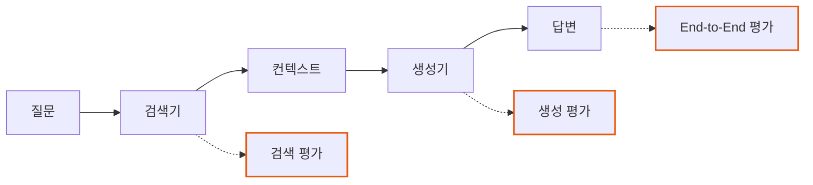
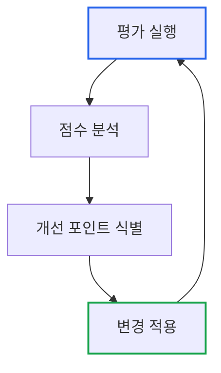

# Essential GraphRAG Part 8: RAG 평가 체계

> **작성일**: 2026년 01월 19일
> **카테고리**: AI, RAG, Evaluation
> **키워드**: RAG Evaluation, RAGAS, Faithfulness, Context Recall, Ground Truth

[##_Image|kage@csGB1F/dJMcaaqwiI3/AAAAAAAAAAAAAAAAAAAAAOZPQtVTf1CQtW1rtRWa2HvxUhvKpIBjL3UyiwPEdJPf/img.jpg|alignCenter|width="100%"|_##]

## 요약

"이 RAG 시스템이 잘 작동하는가?"라는 질문에 "대충 괜찮아 보인다"는 답은 충분하지 않다. 전문 지식 노동자를 위한 시스템은 **정량적 평가**가 필수다. 이 글에서는 RAG 시스템의 품질을 측정하는 핵심 지표와 RAGAS 프레임워크를 활용한 평가 파이프라인 구축을 다룬다.

---

## 왜 평가가 필요한가

### "그럴듯한" vs "정확한"

```
질문: "2024년 4분기 매출은?"

답변 A: "2024년 4분기 매출은 약 150억원 수준으로,
        전분기 대비 성장세를 보였습니다."
        → 그럴듯하지만, 숫자가 맞는지 검증 불가

답변 B: "2024년 4분기 매출은 147억 3천만원입니다.
        (출처: 4분기 실적보고서 p.12)"
        → 검증 가능한 출처 제공
```

인간이 읽었을 때 둘 다 자연스럽다. 그러나 비즈니스 의사결정에는 **정확성**이 필수다.

### 평가의 목적

1. **현재 성능 파악**: 시스템이 얼마나 잘 작동하는가?
2. **개선 방향 도출**: 어디를 개선해야 하는가? (검색? 생성?)
3. **변경 영향 측정**: 프롬프트 수정 후 성능이 좋아졌는가?
4. **SLA 보장**: 프로덕션 배포 기준 충족 여부

---

## RAG 평가의 핵심 지표

### 평가 대상 분리

RAG는 **검색**과 **생성** 두 단계로 구성된다. 각각 별도로 평가해야 문제 원인을 파악할 수 있다.



---

## 검색 품질 지표

### 1. Context Recall (문맥 재현율)

**질문에 답하기 위해 필요한 정보가 검색되었는가?**

```
Ground Truth에 필요한 정보: [A, B, C, D]
검색된 문서에 포함된 정보: [A, B, E]

Context Recall = 2/4 = 0.5
```

낮은 재현율 = 필요한 정보를 찾지 못함 = 답변 품질 저하

```python
def context_recall(ground_truth_facts: List[str], retrieved_context: str) -> float:
    """필요한 정보 중 검색된 비율"""
    found = 0
    for fact in ground_truth_facts:
        if fact_is_present(fact, retrieved_context):
            found += 1

    return found / len(ground_truth_facts)
```

### 2. Context Precision (문맥 정밀도)

**검색된 문서 중 관련 있는 비율**

```
검색된 문서: [Doc1, Doc2, Doc3, Doc4, Doc5]
실제 관련 문서: [Doc1, Doc3]

Context Precision = 2/5 = 0.4
```

낮은 정밀도 = 불필요한 정보가 많음 = 노이즈로 인한 품질 저하

### 3. Context Relevance (문맥 관련성)

**검색된 컨텍스트가 질문과 얼마나 관련 있는가?**

LLM을 사용하여 평가:

```python
def context_relevance(question: str, context: str) -> float:
    prompt = f"""다음 컨텍스트가 질문에 답하는 데 얼마나 관련 있는지 1-5점으로 평가하세요.

질문: {question}
컨텍스트: {context}

점수 (1-5):"""

    score = int(llm.invoke(prompt).content)
    return score / 5
```

---

## 생성 품질 지표

### 1. Faithfulness (충실성)

**가장 중요한 지표**. 답변이 검색된 컨텍스트에만 근거하는가?

```
컨텍스트: "2024년 4분기 매출은 147억원이다."

답변 A: "4분기 매출은 147억원입니다." → Faithful
답변 B: "4분기 매출은 약 150억원입니다." → Not Faithful (다른 숫자)
답변 C: "매출이 전년 대비 20% 증가했습니다." → Not Faithful (컨텍스트에 없음)
```

**측정 방법**:

```python
def faithfulness(context: str, answer: str) -> float:
    # 1. 답변에서 주장(claim) 추출
    claims = extract_claims(answer)

    # 2. 각 주장이 컨텍스트에 근거하는지 검증
    supported = 0
    for claim in claims:
        if is_supported_by_context(claim, context):
            supported += 1

    return supported / len(claims)
```

### 2. Answer Correctness (답변 정확성)

**Ground Truth와 비교하여 정확한가?**

```
Ground Truth: "2024년 4분기 매출은 147억 3천만원이다."
답변: "4분기 매출은 147억원입니다."

정확성: 부분적으로 정확 (근사치)
```

### 3. Answer Relevance (답변 관련성)

**질문에 대한 직접적인 답변인가?**

```
질문: "4분기 매출은?"

답변 A: "4분기 매출은 147억원입니다." → 관련성 높음
답변 B: "매출 보고서는 매 분기 말에 발행됩니다." → 관련성 낮음
```

---

## Ground Truth 구축

### Ground Truth란

**정답 데이터셋**. 평가의 기준이 되는 질문-답변 쌍.

```json
[
  {
    "question": "2024년 4분기 매출은?",
    "ground_truth": "2024년 4분기 매출은 147억 3천만원이다.",
    "context_facts": ["147억 3천만원", "2024년 4분기"]
  },
  {
    "question": "CEO는 누구인가?",
    "ground_truth": "현재 CEO는 김철수이다.",
    "context_facts": ["김철수", "CEO"]
  }
]
```

### Ground Truth 생성 방법

**1. 수동 작성 (Gold Standard)**
- 도메인 전문가가 직접 작성
- 가장 정확하지만 비용 높음
- 핵심 질문 50-100개 권장

**2. LLM 기반 자동 생성**
```python
def generate_qa_pairs(document: str, num_pairs: int = 10) -> List[dict]:
    prompt = f"""다음 문서를 읽고 {num_pairs}개의 질문-답변 쌍을 생성하세요.
    답변은 반드시 문서에 있는 내용만 사용하세요.

    문서:
    {document}

    JSON 형식으로 출력:
    [{{"question": "...", "answer": "...", "supporting_facts": ["..."]}}]"""

    return json.loads(llm.invoke(prompt).content)
```

**3. 하이브리드**
- LLM으로 초안 생성
- 인간이 검토/수정

---

## RAGAS 프레임워크

### RAGAS란

**R**etrieval **A**ugmented **G**eneration **A**ssessment. RAG 시스템 평가를 위한 오픈소스 프레임워크.

```bash
pip install ragas
```

### 기본 사용법

```python
from ragas import evaluate
from ragas.metrics import (
    faithfulness,
    answer_relevancy,
    context_recall,
    context_precision,
)
from datasets import Dataset

# 평가 데이터 준비
eval_data = {
    "question": ["4분기 매출은?", "CEO는 누구?"],
    "answer": ["147억원입니다.", "김철수입니다."],
    "contexts": [
        ["2024년 4분기 매출은 147억 3천만원이다."],
        ["현재 CEO는 김철수이다."]
    ],
    "ground_truth": ["147억 3천만원", "김철수"]
}

dataset = Dataset.from_dict(eval_data)

# 평가 실행
results = evaluate(
    dataset,
    metrics=[
        faithfulness,
        answer_relevancy,
        context_recall,
        context_precision,
    ]
)

print(results)
```

### 출력 예시

```
{
    'faithfulness': 0.92,
    'answer_relevancy': 0.88,
    'context_recall': 0.85,
    'context_precision': 0.78
}
```

### 지표별 해석

| 지표 | 점수 | 해석 |
|-----|-----|-----|
| Faithfulness 0.92 | 높음 | 답변이 컨텍스트에 충실함 |
| Answer Relevancy 0.88 | 높음 | 질문에 적절히 답함 |
| Context Recall 0.85 | 양호 | 필요한 정보 대부분 검색됨 |
| Context Precision 0.78 | 개선 필요 | 불필요한 문서가 일부 포함 |

---

## 평가 파이프라인 구축

### 전체 구조

```python
class RAGEvaluator:
    def __init__(self, rag_system, ground_truth_path: str):
        self.rag = rag_system
        self.ground_truth = self._load_ground_truth(ground_truth_path)

    def _load_ground_truth(self, path: str) -> List[dict]:
        with open(path) as f:
            return json.load(f)

    def run_evaluation(self) -> dict:
        results = []

        for item in self.ground_truth:
            # RAG 시스템 실행
            response = self.rag.query(item["question"])

            # 평가 데이터 수집
            results.append({
                "question": item["question"],
                "answer": response.answer,
                "contexts": response.retrieved_contexts,
                "ground_truth": item["answer"]
            })

        # RAGAS로 평가
        dataset = Dataset.from_list(results)
        scores = evaluate(dataset, metrics=[...])

        return scores

    def generate_report(self, scores: dict) -> str:
        """평가 리포트 생성"""
        report = f"""
# RAG 평가 리포트

## 전체 점수
- Faithfulness: {scores['faithfulness']:.2f}
- Answer Relevancy: {scores['answer_relevancy']:.2f}
- Context Recall: {scores['context_recall']:.2f}
- Context Precision: {scores['context_precision']:.2f}

## 분석
{self._analyze_scores(scores)}

## 권장 조치
{self._recommend_actions(scores)}
"""
        return report

    def _analyze_scores(self, scores: dict) -> str:
        analyses = []
        if scores['faithfulness'] < 0.8:
            analyses.append("- Faithfulness가 낮음: 환각 위험 높음")
        if scores['context_recall'] < 0.8:
            analyses.append("- Context Recall이 낮음: 검색 품질 개선 필요")
        return "\n".join(analyses) or "- 전반적으로 양호"

    def _recommend_actions(self, scores: dict) -> str:
        recommendations = []
        if scores['context_recall'] < 0.8:
            recommendations.append("- 청킹 전략 재검토")
            recommendations.append("- 임베딩 모델 변경 고려")
        if scores['faithfulness'] < 0.8:
            recommendations.append("- 프롬프트에 출처 명시 강조")
            recommendations.append("- 온도(temperature) 낮추기")
        return "\n".join(recommendations) or "- 현재 설정 유지"
```

### 정기 평가 자동화

```python
import schedule
import time

def daily_evaluation():
    evaluator = RAGEvaluator(rag_system, "ground_truth.json")
    scores = evaluator.run_evaluation()
    report = evaluator.generate_report(scores)

    # 결과 저장
    with open(f"reports/eval_{datetime.now().date()}.md", "w") as f:
        f.write(report)

    # 임계값 미달 시 알림
    if scores['faithfulness'] < 0.8:
        send_alert("Faithfulness 점수 저하 감지")

# 매일 오전 6시 실행
schedule.every().day.at("06:00").do(daily_evaluation)

while True:
    schedule.run_pending()
    time.sleep(60)
```

---

## 평가 기반 개선 사이클

### 반복적 개선 프로세스



### 점수별 개선 전략

| 낮은 지표 | 원인 | 개선 방법 |
|----------|-----|----------|
| Context Recall | 검색 누락 | 청킹 크기 조정, 임베딩 모델 변경 |
| Context Precision | 노이즈 | 유사도 임계값 상향, 메타데이터 필터 |
| Faithfulness | 환각 | 프롬프트 강화, temperature 0 |
| Answer Relevancy | 무관한 답변 | 질문 재작성, 프롬프트 개선 |

### A/B 테스트

```python
def ab_test(rag_a, rag_b, test_questions: List[str]) -> dict:
    """두 RAG 시스템 비교"""
    results_a = evaluate_rag(rag_a, test_questions)
    results_b = evaluate_rag(rag_b, test_questions)

    comparison = {
        "system_a": results_a,
        "system_b": results_b,
        "winner": "A" if results_a['faithfulness'] > results_b['faithfulness'] else "B",
        "improvement": abs(results_a['faithfulness'] - results_b['faithfulness'])
    }

    return comparison
```

---

## 프로덕션 모니터링

### 실시간 지표 수집

```python
from prometheus_client import Histogram, Counter

# 지표 정의
faithfulness_score = Histogram(
    'rag_faithfulness_score',
    'Faithfulness score distribution',
    buckets=[0.1, 0.2, 0.3, 0.4, 0.5, 0.6, 0.7, 0.8, 0.9, 1.0]
)

low_faithfulness_count = Counter(
    'rag_low_faithfulness_total',
    'Number of responses with faithfulness < 0.7'
)

def monitored_query(question: str):
    response = rag.query(question)

    # 샘플링하여 평가 (전수 평가는 비용 문제)
    if random.random() < 0.1:  # 10% 샘플
        score = evaluate_faithfulness(response)
        faithfulness_score.observe(score)

        if score < 0.7:
            low_faithfulness_count.inc()

    return response
```

### 대시보드 구성

```yaml
# Grafana 대시보드 패널 구성
panels:
  - title: "Faithfulness Score Distribution"
    type: histogram
    query: "histogram_quantile(0.95, rag_faithfulness_score_bucket)"

  - title: "Low Faithfulness Alerts"
    type: stat
    query: "increase(rag_low_faithfulness_total[1h])"

  - title: "Average Context Recall (24h)"
    type: gauge
    query: "avg_over_time(rag_context_recall[24h])"
```

---

## 핵심 정리

| 단계 | 지표 | 의미 |
|-----|-----|-----|
| 검색 | Context Recall | 필요한 정보를 찾았는가 |
| 검색 | Context Precision | 불필요한 정보가 적은가 |
| 생성 | Faithfulness | 컨텍스트에만 근거하는가 |
| 생성 | Answer Relevancy | 질문에 직접 답하는가 |
| E2E | Answer Correctness | 정답과 일치하는가 |

---

## 시리즈 마무리

Essential GraphRAG 시리즈를 통해 LLM의 한계부터 평가 체계까지 RAG의 전체 스펙트럼을 다뤘다.

### 학습 경로 요약

```
Part 1: LLM의 한계 → 왜 RAG가 필요한가
Part 2: 벡터 검색 → 의미 기반 검색의 기초
Part 3: 고급 전략 → 검색 품질 향상
Part 4: Text2Cypher → 구조화된 데이터 접근
Part 5: Agentic RAG → 자율적 도구 선택
Part 6: 그래프 구축 → 지식 그래프 자동 생성
Part 7: MS GraphRAG → 전역 질문 답변
Part 8: 평가 체계 → 품질 측정과 개선
```

### 다음 단계

- 실제 프로젝트에 RAG 적용
- 도메인 특화 평가 지표 개발
- 프로덕션 모니터링 체계 구축

---

## 시리즈 목차

1. [LLM 정확도 향상](https://blog.imprun.dev/148)
2. [벡터 검색과 하이브리드 검색](https://blog.imprun.dev/149)
3. [고급 벡터 검색 전략](https://blog.imprun.dev/150)
4. [Text2Cypher: 자연어를 그래프 쿼리로](https://blog.imprun.dev/151)
5. [Agentic RAG](https://blog.imprun.dev/152)
6. [LLM으로 지식 그래프 구축](https://blog.imprun.dev/153)
7. [Microsoft GraphRAG 구현](https://blog.imprun.dev/154)
8. **RAG 평가 체계** (현재 글)

---

## 참고 자료

### 공식 문서
- [RAGAS Documentation](https://docs.ragas.io/)
- [LangChain Evaluation](https://python.langchain.com/docs/guides/evaluation/)

### 논문
- Es et al. (2023). "RAGAS: Automated Evaluation of Retrieval Augmented Generation"
