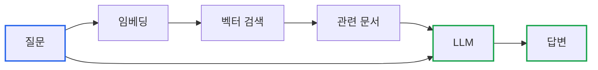
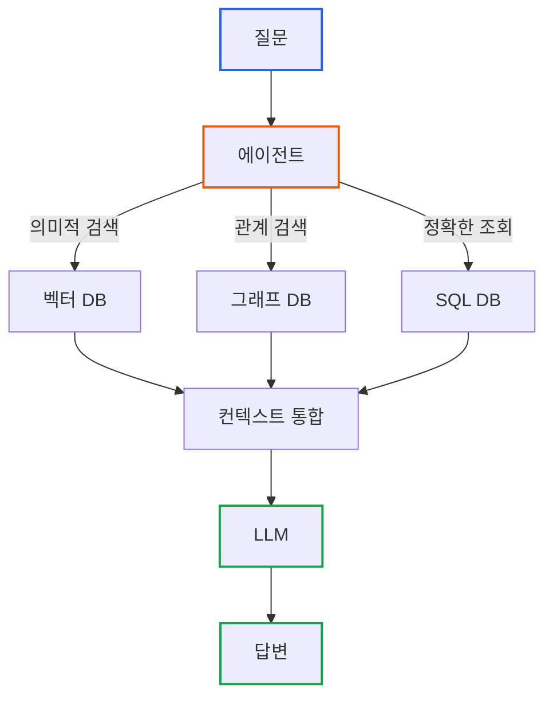

# RAG의 진화: LLM 환각에서 GraphRAG까지

> **작성일**: 2026년 01월 19일
> **카테고리**: AI, LLM, RAG
> **키워드**: RAG, Retrieval-Augmented Generation, GraphRAG, Agentic RAG, Knowledge Graph, LLM

[##_Image|kage@VvQfx/dJMcah4fzaz/AAAAAAAAAAAAAAAAAAAAAJ2ttddx6VjTMI09owIJ1VIvqX_1EqGQoywLDXfYreKd/img.jpg|alignCenter|width="100%"|_##]

## 요약

LLM은 모르는 것을 그럴듯하게 지어낸다(환각). 이 문제를 해결하기 위해 2020년 RAG가 등장했고, 기본 RAG의 한계를 극복하기 위해 두 가지 방향으로 발전했다: **Agentic RAG**(반복 검색, 도구 선택)와 **GraphRAG**(관계 기반 검색). 이 글에서는 RAG 기술의 발전 흐름을 정리하고, **"LLM API는 한 번 호출하면 끝인데, 누가 RAG 루프를 돌리는가?"**라는 질문에 답한다.

---

## 시작점: LLM의 환각 문제

ChatGPT에게 "우리 회사 매출이 얼마야?"라고 물으면 두 가지 중 하나가 벌어진다.

1. "죄송합니다, 그 정보를 알 수 없습니다"
2. 그럴듯한 숫자를 **지어낸다**

후자를 **환각(Hallucination)**이라고 부른다. LLM은 학습 데이터에 없는 정보를 요청받으면, 패턴을 기반으로 "있을 법한" 답을 생성해버린다.

| 한계 | 설명 |
|-----|-----|
| 학습 데이터 이후 정보 없음 | 2024년 3월 이후 뉴스를 모름 |
| 내부 데이터 접근 불가 | 회사 매출, 고객 정보 등 |
| 실시간 정보 부재 | 현재 주가, 날씨 등 |
| 정확성 보장 불가 | "아마 그럴 것이다"를 확신처럼 말함 |

이 문제를 해결하기 위해 **RAG**가 등장했다.

---

## 2020년: 기본 RAG의 등장

### 아이디어: 모르면 찾아보자

2020년, Facebook AI Research(현 Meta AI)의 Lewis et al.이 RAG(Retrieval-Augmented Generation) 논문을 발표했다. 아이디어는 단순하다. **"모르는 건 찾아보고 답하자."**

도서관 사서를 생각해보자. 사서는 모든 책의 내용을 암기하지 않는다. 대신 질문을 받으면:

1. 관련 책을 찾아서
2. 해당 내용을 읽고
3. 질문에 맞게 정리해서 답한다

RAG도 동일하게 작동한다:

```
[사용자 질문] → [관련 문서 검색] → [검색 결과 + 질문을 LLM에 전달] → [답변 생성]
```

### 기본 RAG 아키텍처



**핵심 구성 요소**:

1. **임베딩(Embedding)**: 텍스트를 숫자 벡터로 변환. "의미가 비슷한 텍스트는 비슷한 벡터를 갖는다"
2. **벡터 데이터베이스**: 임베딩된 문서들을 저장하고, 유사한 문서를 빠르게 검색
3. **LLM**: 검색된 문서와 질문을 받아 최종 답변 생성

### 기본 RAG의 한계

기본 RAG를 구현하면 곧바로 여러 문제에 부딪힌다.

**1. 검색 품질 문제**
- 검색된 문서가 질문과 무관하거나 불충분하면, LLM은 여전히 환각을 일으킨다
- 벡터 검색은 "의미적 유사성"만 찾는다. "프로젝트가 몇 개야?" 같은 정확한 숫자는 못 찾는다

**2. 단발성 검색의 한계**
- 검색 1회 → 답변 생성으로 끝난다
- 검색 결과가 부족해도 재검색하지 않는다

**3. 관계 추론 불가**
- "김철수와 같은 팀의 시니어 개발자는?" → 벡터 검색으로는 답할 수 없다
- 엔티티 간의 **관계**를 이해해야 하는 질문에 취약하다

이 한계들을 극복하기 위해 두 가지 방향의 발전이 이루어졌다.

---

## 발전 방향 1: Agentic RAG (2022~)

2022년 Yao et al.의 ReAct 논문이 발표되고, LangChain/LlamaIndex 같은 프레임워크가 등장하면서 **에이전트 기반 RAG**가 확산되었다.

### 핵심 질문: 누가 RAG 루프를 돌리는가?

LLM API를 사용해본 사람이라면 이런 의문이 생긴다:

> "LLM은 Chat API 한 번 호출하면 끝인데, 원하는 답이 나올 때까지 계속 검색하고 재시도하는 건 누가 하는 거지?"

이 질문에 대한 답이 **Agentic RAG**의 핵심이다.

### LLM은 뇌일 뿐, 손발이 없다

LLM API 호출의 본질:

```python
# LLM은 텍스트 입력 → 텍스트 출력, 그게 전부다
response = openai.chat.completions.create(
    model="gpt-4",
    messages=[{"role": "user", "content": "검색해줘"}]
)
# response.content = "네, 검색하겠습니다" ← 말만 한다. 실제로 검색하지 않는다.
```

LLM은 **생각만 할 수 있고, 행동은 할 수 없다**. 데이터베이스에 접속하거나, 파일을 읽거나, API를 호출하는 것은 LLM의 능력 밖이다.

### 에이전트 = LLM의 손발

**에이전트(Agent)**는 LLM에게 "손발"을 달아주는 코드다.

```
LLM = 뇌 (생각, 판단, 계획)
Agent 코드 = 몸 (실제 행동 실행)
```

**에이전트 루프의 구조**:

```python
def agent_loop(question):
    messages = [{"role": "user", "content": question}]

    while True:  # ← 이 루프는 Python 코드가 돌린다!
        # 1. LLM에게 "다음에 뭘 할지" 물어본다
        response = llm.call(messages)

        # 2. LLM이 "도구를 써달라"고 요청했는지 확인
        if response.tool_calls:
            for tool_call in response.tool_calls:
                # 3. 코드가 실제로 도구를 실행한다
                result = execute_tool(tool_call.name, tool_call.arguments)
                messages.append({"role": "tool", "content": result})
        else:
            # 4. 도구 호출이 없으면 최종 답변
            return response.content
```

**핵심 포인트**:
- `while True` 루프는 **Python 코드**가 실행한다
- LLM은 텍스트로 "search_documents 도구를 사용해달라"고 **요청만** 한다
- 실제 검색은 **코드가** 실행한다
- 결과를 다시 LLM에게 전달하면, LLM이 다음 행동을 결정한다

### 기본 RAG vs Agentic RAG

| 기본 RAG | Agentic RAG |
|---------|-------------|
| 검색 1회 → 답변 | 필요한 만큼 반복 검색 |
| 검색 방법 고정 | LLM이 상황에 맞게 선택 |
| 실패 시 그대로 답변 | 실패 감지 → 재시도 |
| 단순 파이프라인 | 자율적 루프 |

Agentic RAG는 **LLM의 판단력**과 **코드의 실행력**을 결합한다.

자세한 구현 방법은 [Agentic RAG](https://blog.imprun.dev/152)에서 다룬다.

---

## 발전 방향 2: GraphRAG (2024~)

기본 RAG의 또 다른 한계를 해결하기 위해 **지식 그래프 기반 RAG**가 등장했다. 2024년 4월 Microsoft가 GraphRAG를 발표하고, 7월에 오픈소스로 공개하면서 이 접근법이 본격적으로 주목받았다.

### 벡터 검색의 한계: 관계를 모른다

벡터 검색은 "의미적 유사성"을 찾는 데 탁월하지만, **관계**를 이해하지 못한다.

**질문**: "김철수 부장과 같은 팀에서 일하는 시니어 개발자는?"

**벡터 검색**:
- "김철수"와 의미적으로 유사한 문서 검색
- 결과: 김철수가 언급된 문서들... 하지만 관계 추론은 불가능

**그래프 검색**:
```cypher
MATCH (p:Person {name: "김철수"})-[:BELONGS_TO]->(t:Team)
      <-[:BELONGS_TO]-(colleague:Person)-[:HAS_ROLE]->(r:Role {level: "Senior"})
WHERE r.type = "Developer"
RETURN colleague.name
```
결과: `["이영희", "박지훈"]` ← 정확한 관계 기반 답변

### GraphRAG: 지식 그래프 + RAG

GraphRAG는 **지식 그래프(Knowledge Graph)**를 RAG에 통합한다.



**에이전트의 역할**:
1. 질문 분석: "이 질문에는 어떤 검색이 필요한가?"
2. 도구 선택: 벡터/그래프/SQL 중 적합한 도구 선택
3. 결과 통합: 여러 소스의 결과를 하나의 컨텍스트로 결합
4. 답변 생성: 통합된 컨텍스트로 최종 답변 생성

### Microsoft GraphRAG

Microsoft가 개발한 [GraphRAG](https://github.com/microsoft/graphrag)는 **전역적 질문**에 답할 수 있는 구현체다.

기존 RAG: "이 문서에 뭐라고 써있어?"
GraphRAG: "전체 데이터에서 주요 테마가 뭐야?"

커뮤니티 탐지와 계층적 요약을 통해 대규모 문서 집합에서 전역적 질문에 답한다.

자세한 내용은 [Microsoft GraphRAG 구현](https://blog.imprun.dev/154)에서 다룬다.

---

## 발전 흐름 정리

```
[LLM 환각 문제]
    ↓
[2020년: 기본 RAG]
    "모르면 찾아보자"
    - 벡터 검색 → 답변 생성
    - 한계: 단발성, 관계 추론 불가
    ↓
    ┌─────────────────────────────────────┐
    │                                     │
    ↓                                     ↓
[방향 1: Agentic RAG]              [방향 2: GraphRAG]
(2022~ ReAct, LangChain)           (2024~ MS GraphRAG)
"필요하면 여러 번 찾아보자"        "관계도 이해하자"
- 에이전트 루프 도입               - 지식 그래프 통합
- LLM = 뇌, 코드 = 손발            - 벡터 + 그래프 하이브리드
- Tool Calling                     - 엔티티 간 관계 추론
    │                                     │
    └─────────────────────────────────────┘
                    ↓
[현재: 하이브리드 RAG 시스템]
    - Agentic + GraphRAG 결합
    - Neo4j, TypeDB 등 그래프 DB
    - 온톨로지 기반 데이터 모델링
```

---

## 기술 스택

| 구성 요소 | 선택지 |
|----------|-------|
| 벡터 DB | Pinecone, Weaviate, Milvus, **Neo4j** (네이티브 벡터 지원) |
| 그래프 DB | Neo4j, Amazon Neptune, TypeDB |
| 오케스트레이션 | LangChain, LlamaIndex, Haystack |
| 임베딩 모델 | OpenAI Ada, Cohere, HuggingFace 모델 |
| LLM | GPT-4, Claude, Gemini, 오픈소스 모델 |

Neo4j는 벡터 검색과 그래프 쿼리를 하나의 DB에서 제공한다. 별도 벡터 DB 운영이 부담스럽다면 고려할 만하다.

---

## 참고 자료

### 공식 문서
- [Neo4j RAG Tutorial](https://neo4j.com/blog/developer/rag-tutorial/) - 이 글의 기반이 된 튜토리얼
- [Microsoft GraphRAG](https://github.com/microsoft/graphrag)
- [LangChain RAG Documentation](https://python.langchain.com/docs/tutorials/rag/)

### 관련 블로그
- [Essential GraphRAG 시리즈: 벡터 검색에서 에이전틱 RAG까지](https://blog.imprun.dev/147)
