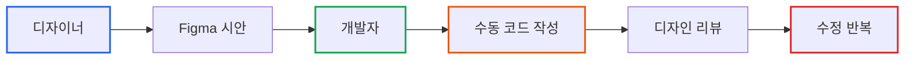
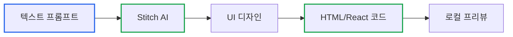
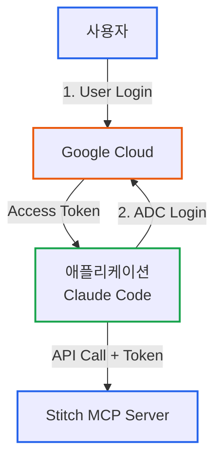
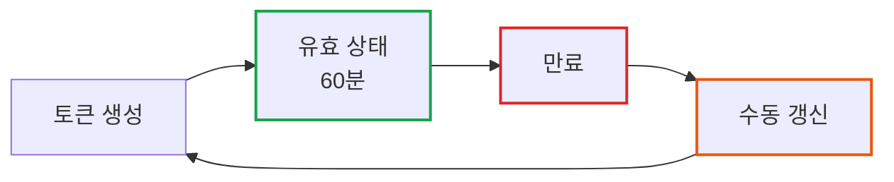

# Claude Code와 Stitch MCP 연동: AI 기반 프론트엔드 개발 워크플로우

> **작성일**: 2026년 01월 23일
> **카테고리**: AI-Assisted Development, Frontend, MCP
> **키워드**: Claude Code, Stitch, MCP, Google Cloud, Remote MCP Server, Frontend Development

## 요약

프론트엔드 개발에서 디자인 시안을 코드로 전환하는 과정은 반복적이고 시간 소모적이다. Google Stitch는 텍스트 프롬프트로 UI 디자인을 생성하고, 이를 HTML 또는 React 컴포넌트로 변환하는 도구다. Model Context Protocol (MCP)을 통해 Claude Code와 연동하면, IDE 내에서 디자인 생성부터 코드 변환까지 자동화할 수 있다. 이 글에서는 Stitch MCP의 아키텍처, Claude Code 연동 설정 과정, 그리고 실제 사용 시나리오를 다룬다.

## 왜 Stitch MCP인가

### 전통적인 프론트엔드 개발 워크플로우의 문제

프론트엔드 개발에서 디자인과 코드 간의 간극은 오래된 문제다.

**전통적인 프로세스:**



각 단계에서 발생하는 문제:
- **커뮤니케이션 비용**: 디자이너와 개발자 간 요구사항 전달 과정에서 정보 손실
- **수동 변환**: 디자인 시안을 CSS/HTML로 변환하는 반복 작업
- **일관성 부족**: 디자인 시스템 적용이 개발자마다 다름
- **반복 비용**: 디자인 변경 시 코드 전체를 다시 작성

### Stitch MCP가 제공하는 해결책

Stitch는 이 과정을 단축한다. 텍스트 프롬프트로 디자인을 생성하고, 생성된 디자인을 즉시 코드로 변환한다.

**Stitch 워크플로우:**



MCP 연동을 통해 IDE 내에서 전체 프로세스를 자동화할 수 있다.

## Stitch MCP 아키텍처 이해

### Remote MCP vs Local MCP

대부분의 MCP 서버는 Local 방식이다. 로컬 파일을 읽거나 로컬 스크립트를 실행한다. Stitch는 **Remote MCP 서버**다.

**비유: 호텔 컨시어지**

| 특성 | Local MCP | Remote MCP (Stitch) |
|------|-----------|---------------------|
| 위치 | 내 컴퓨터 (호텔 방 내부) | 클라우드 (호텔 로비) |
| 접근 방식 | 직접 파일 읽기 (내 서랍 열기) | API 호출 (컨시어지에게 요청) |
| 인증 | 불필요 (내 방) | 필수 (룸키 확인) |
| 데이터 보관 | 로컬 디스크 | 원격 서버 |

Remote MCP는 보안 "handshake"가 필요하다. Google Cloud 인증을 통해 AI 에이전트가 실제로 사용자를 대신하여 디자인을 수정할 권한이 있는지 확인한다.

### 이중 인증 (Double-Layer Authentication)

Stitch는 두 가지 레벨의 인증을 요구한다.



**1. User Login (`gcloud auth login`)**
- 역할: 사용자 본인임을 증명
- 비유: 은행에서 신분증 제시

**2. Application Default Credentials (ADC) Login**
- 역할: 애플리케이션이 사용자를 "대리"할 수 있도록 권한 부여
- 비유: 은행에서 대리인에게 위임장 작성

이 이중 구조는 보안을 강화한다. 사용자가 직접 API를 호출하는 것이 아니라, Claude Code가 사용자를 대신하여 호출하기 때문이다.

### Access Token의 수명 주기

Stitch Access Token은 **1시간** 동안만 유효하다.



만료 후에는 다음 명령어로 토큰을 재생성해야 한다:

```bash
TOKEN=$(gcloud auth application-default print-access-token)
echo "STITCH_ACCESS_TOKEN=$TOKEN" >> .env
```

대부분의 MCP 클라이언트는 `.env` 파일을 자동으로 읽지 않는다. 설정 파일에 수동으로 토큰을 업데이트해야 한다.

## 설정 과정

### 1. Google Cloud SDK 설치

Stitch는 `gcloud` CLI를 사용하여 인증을 처리한다.

**Standalone 설치 (Linux/macOS):**

```bash
# 다운로드 및 설치
curl https://sdk.cloud.google.com | bash
exec -l $SHELL

# 프롬프트 비활성화
export CLOUDSDK_CORE_DISABLE_PROMPTS=1
```

**Homebrew 설치 (macOS):**

```bash
brew install --cask google-cloud-sdk
```

### 2. 이중 인증 실행

두 번의 로그인을 수행한다.

```bash
# 1. 사용자 로그인 (브라우저 열림)
gcloud auth login

# 2. 애플리케이션 기본 자격증명 (ADC) 로그인
gcloud auth application-default login
```

각 명령어는 브라우저를 열어 Google 계정 로그인을 요청한다.

### 3. 프로젝트 설정 및 권한 부여

Google Cloud 프로젝트 ID를 설정하고, Stitch API를 활성화하며, 사용자에게 서비스 사용 권한을 부여한다.

```bash
# 프로젝트 ID 설정 (YOUR_PROJECT_ID를 실제 값으로 교체)
PROJECT_ID="your-gcp-project-id"
gcloud config set project "$PROJECT_ID"

# Stitch API 활성화
gcloud beta services mcp enable stitch.googleapis.com --project="$PROJECT_ID"

# 서비스 사용 권한 부여
USER_EMAIL=$(gcloud config get-value account)
gcloud projects add-iam-policy-binding "$PROJECT_ID" \
    --member="user:$USER_EMAIL" \
    --role="roles/serviceusage.serviceUsageConsumer" \
    --condition=None
```

### 4. Access Token 생성

Access Token을 생성하여 `.env` 파일에 저장한다.

**주의: 이 명령어는 기존 `.env` 파일을 덮어쓴다.**

```bash
# 토큰 생성
TOKEN=$(gcloud auth application-default print-access-token)

# .env 파일에 저장
echo "GOOGLE_CLOUD_PROJECT=$PROJECT_ID" > .env
echo "STITCH_ACCESS_TOKEN=$TOKEN" >> .env

echo "Secrets generated in .env"
```

### 5. Claude Code MCP 서버 등록

`claude mcp` 명령어로 Stitch MCP 서버를 등록한다.

```bash
claude mcp add stitch \
  --transport http https://stitch.googleapis.com/mcp \
  --header "Authorization: Bearer <YOUR_ACCESS_TOKEN>" \
  --header "X-Goog-User-Project: <YOUR_PROJECT_ID>" \
  -s user
```

**파라미터 설명:**
- `-s user`: 사용자 레벨 설정 (`$HOME/.claude.json`에 저장)
- `-s project`: 프로젝트 레벨 설정 (`./.mcp.json`에 저장)

`.env` 파일의 값으로 `<YOUR_ACCESS_TOKEN>`과 `<YOUR_PROJECT_ID>`를 교체해야 한다.

## 사용 시나리오

### 1. 프로젝트 및 스크린 조회

Claude Code에서 Stitch 프로젝트와 스크린 목록을 조회한다.

**프롬프트:**

```
Show me my Stitch projects.
List out each screen under each project and its screen id.
```

**예상 출력:**

```
1. Raffinato Coffee Store App
   Created: Jan 14, 2026 • Desktop • Light Mode • Private

   Screens (3):
   - Home Menu (screen_id: abc123...)
   - Full Menu (screen_id: def456...)
   - Checkout (screen_id: ghi789...)
```

각 Stitch 프로젝트는 여러 스크린을 포함할 수 있다. 스크린이 실제 디자인과 코드를 담고 있는 단위다.

### 2. HTML 코드 다운로드

특정 스크린의 HTML 코드를 다운로드한다.

**프롬프트:**

```
Download the HTML code for the Full Menu screen in the Raffinato project.
Use curl -L to fetch the code.
Create a file named ./tmp/full-menu.html with the HTML code.
```

생성된 HTML 파일은 Tailwind CSS가 포함된 완전한 `<html>` 문서다.

### 3. React 컴포넌트로 변환

HTML을 React 컴포넌트 시스템으로 변환한다.

**Agent Skill 사용 (권장):**

```bash
npx add-skill google-labs-code/stitch-skills --skill react:components --global
```

이 스킬은 Stitch 도구 사용법, 단계별 실행 절차, React 컴포넌트 분리 모범 사례를 AI 에이전트에게 제공한다.

**프롬프트:**

```
Convert the Landing Page screen in the Podcast Project to React components.
```

AI 에이전트가 자동으로:
1. Stitch에서 HTML 다운로드
2. HTML을 React 컴포넌트로 변환
3. Vite 로컬 서버로 실행

### 4. 새 디자인 생성

텍스트 프롬프트로 새로운 스크린을 생성한다.

**사용 가능한 도구:**

```
generate_screen_from_text(
  project_id: string,
  prompt: string,
  model_id: "GEMINI_3_PRO" | "GEMINI_3_FLASH",
  device_type: "MOBILE" | "DESKTOP" | "TABLET"
)
```

**프롬프트 예시:**

```
Create a new mobile checkout screen for the Raffinato project.
Include:
- Order summary with item list
- Delivery address input
- Payment method selection
- Total price with tax breakdown
Use GEMINI_3_FLASH model.
```

생성된 디자인은 Stitch 프로젝트에 새 스크린으로 추가된다.

## 제한사항 및 고려사항

### 1. Access Token 수명 관리

Access Token이 1시간마다 만료되는 것은 운영 환경에서 문제가 될 수 있다.

**해결 방법:**
- CI/CD 파이프라인에서 토큰을 자동 갱신하는 스크립트 작성
- Secret Manager에 토큰을 저장하고 주기적으로 갱신

**자동 갱신 스크립트 예시:**

```bash
#!/bin/bash
# refresh-stitch-token.sh

PROJECT_ID="your-project-id"
TOKEN=$(gcloud auth application-default print-access-token)

# .claude.json 업데이트 (jq 필요)
jq --arg token "$TOKEN" \
  '.mcpServers.stitch.headers.Authorization = "Bearer \($token)"' \
  ~/.claude.json > ~/.claude.json.tmp

mv ~/.claude.json.tmp ~/.claude.json

echo "Token refreshed at $(date)"
```

### 2. 디자인 품질

Stitch가 생성하는 디자인은 프롬프트의 품질에 크게 의존한다.

**효과적인 프롬프트 작성:**
- 구체적인 레이아웃 명시 (헤더, 사이드바, 푸터 위치)
- 색상 팔레트 지정 (브랜드 컬러)
- 인터랙션 명시 (버튼 클릭 시 동작)
- 반응형 요구사항 포함

**예시:**

```
Create a dashboard screen for analytics platform.

Layout:
- Top navigation bar with logo (left) and user menu (right)
- Left sidebar (240px) with navigation items
- Main content area with 3x2 grid of metric cards
- Each card shows: title, value, trend indicator

Colors:
- Primary: #2563eb (blue)
- Background: #f9fafb (light gray)
- Text: #1f2937 (dark gray)

Responsive:
- Mobile: stack cards vertically, hide sidebar
- Tablet: 2x3 grid, collapsible sidebar
```

### 3. 코드 커스터마이징

생성된 코드는 시작점이다. 프로덕션 환경에서는 추가 작업이 필요하다.

**필요한 후속 작업:**
- 상태 관리 추가 (Redux, Zustand)
- API 연동
- 접근성 (ARIA 속성, 키보드 네비게이션)
- 성능 최적화 (코드 스플리팅, 이미지 최적화)
- 에러 핸들링

## 교훈

### 1. Remote MCP의 인증 복잡도

Remote MCP는 Local MCP에 비해 설정이 복잡하다. 이중 인증과 토큰 관리가 추가 부담이다. 그러나 이는 보안을 위한 필수 절차다. 클라우드 기반 리소스에 접근할 때는 항상 인증 오버헤드를 고려해야 한다.

### 2. 프롬프트 엔지니어링의 중요성

Stitch는 프롬프트의 품질에 따라 결과가 크게 달라진다. 디자인 요구사항을 명확하고 구조적으로 작성하는 것이 핵심이다. 이는 AI 기반 도구의 공통적인 특성이다.

### 3. AI 도구는 시작점

Stitch가 생성하는 코드는 완성품이 아니라 시작점이다. 프로덕션 환경에서는 개발자의 추가 작업이 필요하다. AI 도구는 반복 작업을 줄이는 데 효과적이지만, 최종 품질은 개발자의 검토와 개선에 달려 있다.

## 참고 자료

### 공식 문서
- [Stitch MCP Setup Guide](https://stitch.withgoogle.com/docs/mcp/setup/)
- [Stitch MCP Getting Started](https://stitch.withgoogle.com/docs/mcp/guide/)
- [Model Context Protocol Specification](https://code.claude.com/docs/en/mcp)

### 관련 저장소
- [Stitch MCP Server (davideast)](https://github.com/davideast/stitch-mcp)
- [Stitch Agent Skills](https://github.com/google-labs-code/stitch-skills)
- [Stitch MCP Auto Installer](https://github.com/GreenSheep01201/stitch-mcp-auto)

### 추가 리소스
- [Google Cloud SDK Installation](https://cloud.google.com/sdk/docs/install)
- [Agent Skill Open Standard](https://github.com/affaan-m/everything-claude-code)
