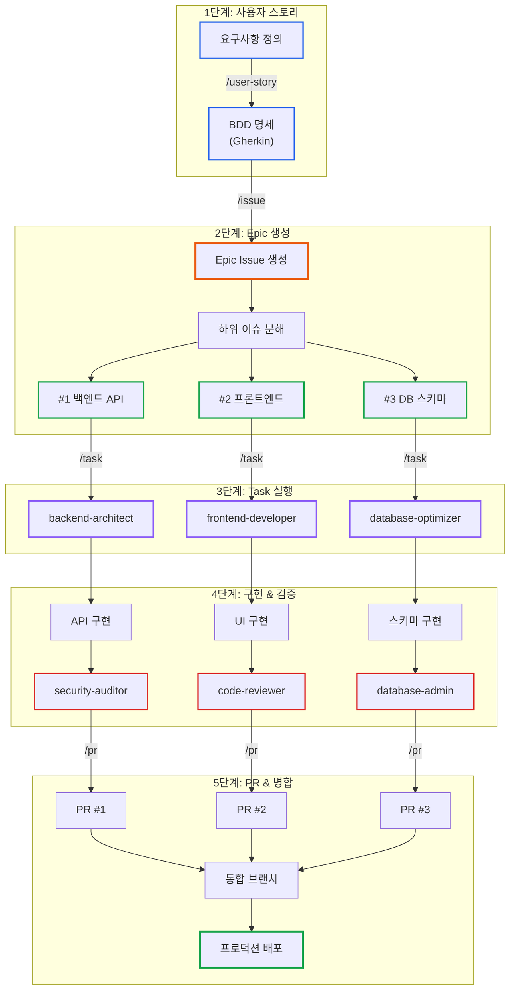
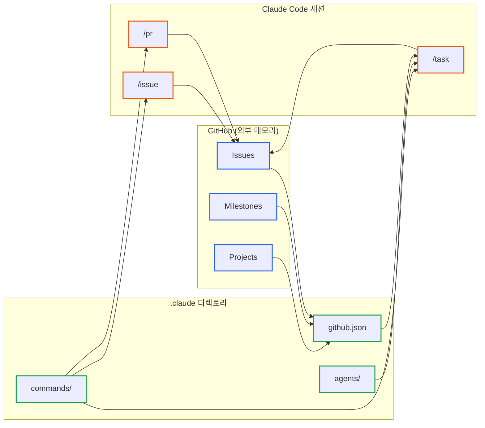
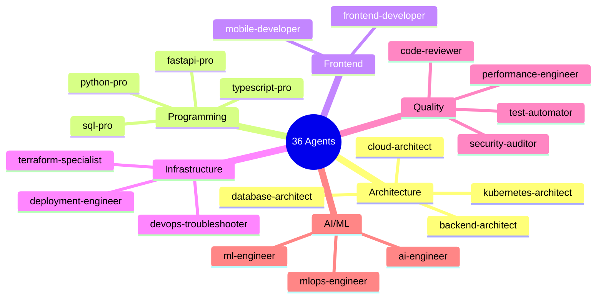
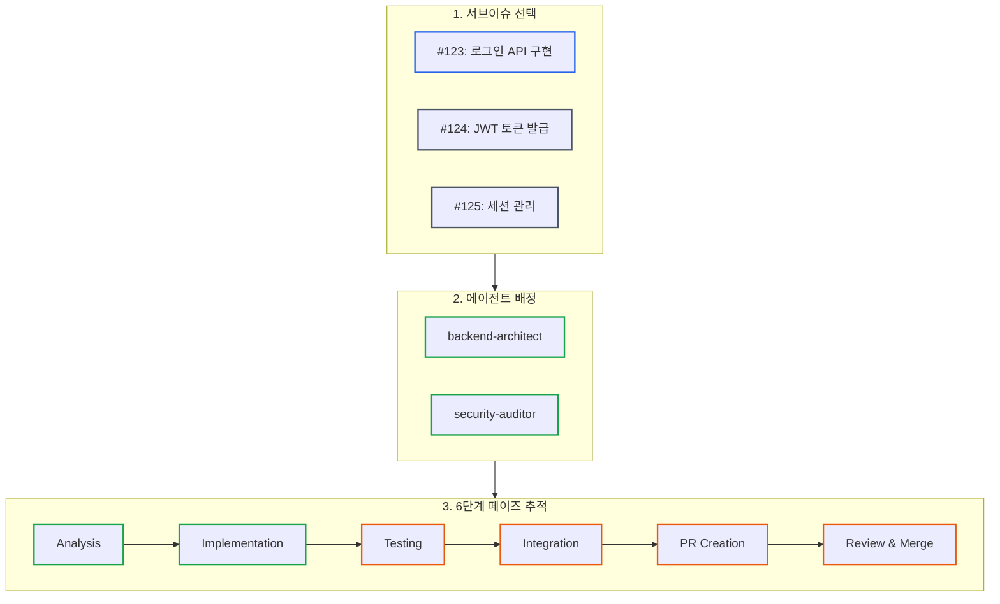
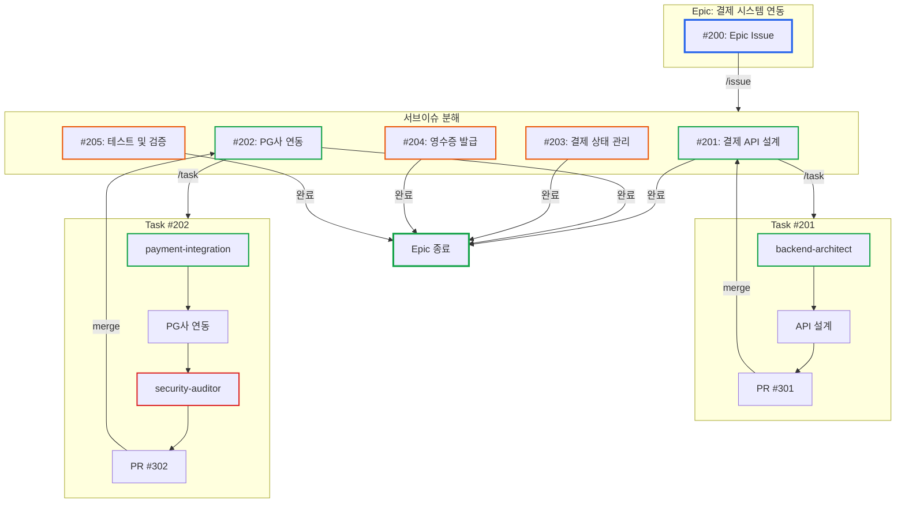
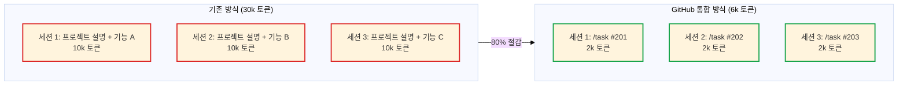
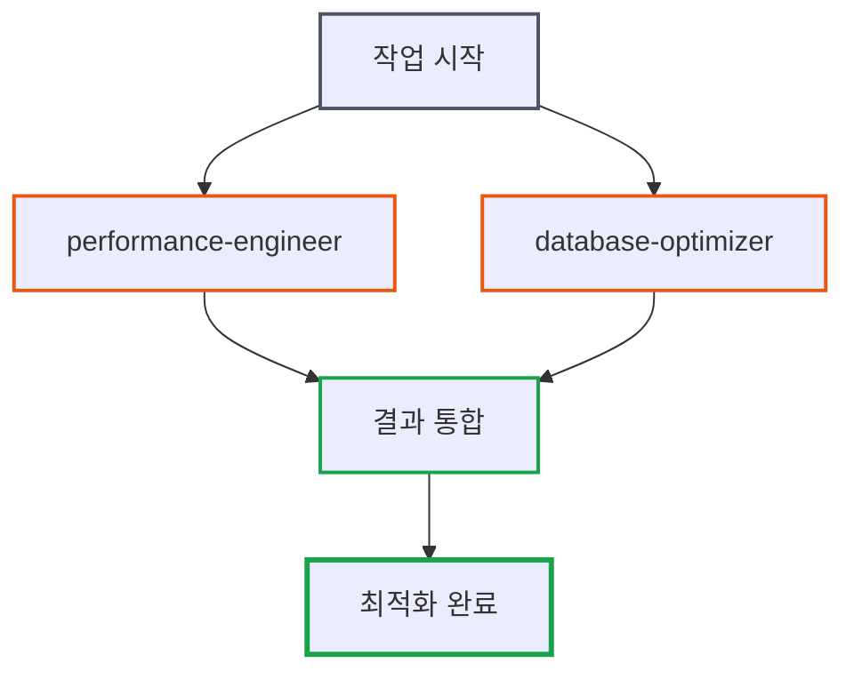
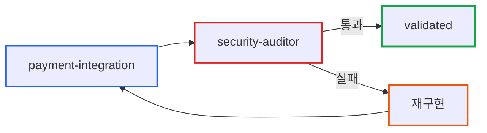
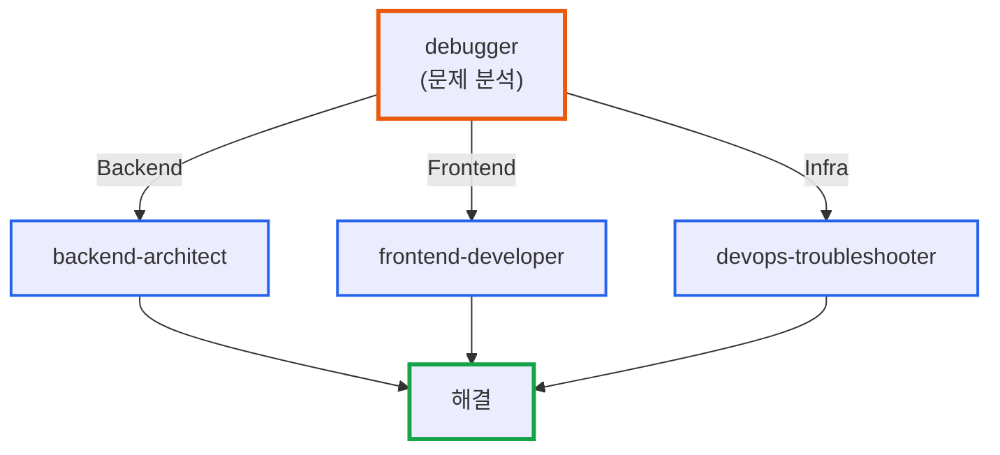

# Claude Code GitHub 통합 워크플로우: 200k Context에서 대규모 프로젝트 관리하기

> **작성일**: 2026년 2월 3일
> **카테고리**: AI, Developer Tools, Workflow
> **키워드**: Claude Code, GitHub Issues, Milestones, Projects, AI Agent, Workflow Automation

[##_Image|kage@bsYRsO/dJMcacaU5vE/AAAAAAAAAAAAAAAAAAAAADrVdn8C-UACoXH95_As3B-bAF2s_12EZzK-BHBrdXa3/img.png?credential=yqXZFxpELC7KVnFOS48ylbz2pIh7yKj8&amp;expires=1772290799&amp;allow_ip=&amp;allow_referer=&amp;signature=OSYKeAwFSnp64lGrUYgpXhtOIrY%3D|CDM|1.3|{"originWidth":1024,"originHeight":600,"style":"alignCenter","width":null}_##]

## 요약

Claude Code는 200k context window를 제공하지만, 대규모 프로젝트에서는 여전히 컨텍스트 관리가 중요하다. GitHub Issues, Milestones, Projects를 `.claude` 디렉토리 설정과 통합하면 컨텍스트 소모를 최소화하면서 복잡한 프로젝트를 체계적으로 관리할 수 있다. 이 글에서는 36개 특화 에이전트와 7개 슬래시 명령을 활용한 워크플로우를 공유한다.

**공개 저장소**: [github.com/junsik/.claude](https://github.com/junsik/.claude)

### 전체 워크플로우 개요



| 단계 | 명령어 | 산출물 |
|------|--------|--------|
| 1. 스토리 | `/user-story` | BDD 명세 (Gherkin) |
| 2. Epic | `/issue` | Epic + 하위 이슈들 |
| 3. Task | `/task` | 에이전트 배정, 페이즈 추적 |
| 4. 구현 | 에이전트 작업 | 코드 + 검증 |
| 5. PR | `/pr` | PR → 병합 → 배포 |

## 문제 상황

### 대규모 프로젝트에서 AI 코딩 어시스턴트의 한계

AI 코딩 어시스턴트로 작업할 때 다음과 같은 상황을 자주 경험한다:

1. **컨텍스트 단절**: 새 세션을 시작할 때마다 이전 작업 내용을 다시 설명
2. **작업 분산**: 여러 기능을 동시에 개발할 때 각 작업의 상태 추적 어려움
3. **에이전트 선택 혼란**: "이 작업에 어떤 프롬프트를 써야 하나?" 매번 고민
4. **GitHub 연동 수동 작업**: 이슈 생성, PR 작성 시 컨벤션 맞추기 위한 반복 작업

### 핵심 문제: 컨텍스트는 유한한 자원

200k 토큰은 충분해 보이지만, 프로젝트 전체 컨텍스트를 매번 불러오면 금방 소진된다.

```
일반적인 접근:
┌──────────────────────────────────────┐
│ "이 프로젝트는 ... 기능이 있고 ...   │
│  이번에 추가할 기능은 ... 이며 ...   │ ← 매번 설명 (수천 토큰)
│  관련 파일은 ... 이고 ..."           │
└──────────────────────────────────────┘
                 ↓
         컨텍스트 낭비
```

필요한 것은 **외부 시스템에 상태를 저장**하고, **필요할 때만 최소한의 컨텍스트**를 불러오는 방식이다.

## 해결 방안: GitHub + .claude 통합

### 아이디어: GitHub를 "외부 메모리"로 활용

GitHub Issues, Milestones, Projects는 이미 프로젝트 관리를 위해 사용하는 도구다. 이를 Claude Code의 외부 메모리로 활용하면:



| 저장 위치 | 저장 내용 |
|-----------|----------|
| GitHub Issues | 각 작업의 요구사항, 수용 기준, 의존성 |
| GitHub Milestones | 릴리즈 단위 작업 그룹 |
| GitHub Projects | 칸반 보드 형태의 진행 상황 |
| `.claude/github.json` | 메타데이터 캐시 (마일스톤, 라벨, 프로젝트 정보) |
| `.claude/commands/` | 반복 작업을 자동화하는 슬래시 명령 |
| `.claude/agents/` | 도메인별 특화 에이전트 |

### 디렉토리 구조

```
.claude/
├── CLAUDE.md                    # 저장소 가이드
├── github.json                  # GitHub 메타데이터 캐시
├── settings.local.json          # 권한 설정
│
├── commands/                    # 슬래시 명령 (7개)
│   ├── issue.md                 # 이슈 생성 + 서브이슈 분해
│   ├── pr.md                    # PR 생성
│   ├── user-story.md            # BDD 사용자 스토리
│   ├── task.md                  # 에이전트 오케스트레이션
│   ├── todos.md                 # 멀티 에이전트 작업 추적
│   ├── gh-sync.md               # GitHub 메타데이터 동기화
│   └── prompt.md                # 프롬프트 엔지니어링
│
├── agents/                      # 특화 에이전트 (36개)
│   ├── backend-architect.md
│   ├── frontend-developer.md
│   ├── database-optimizer.md
│   ├── security-auditor.md
│   └── ...
│
└── templates/                   # GitHub 템플릿
    ├── GH_PARENT_ISSUE_TEMPLATE.md
    ├── GH_SUB_ISSUE_TEMPLATE.md
    └── GH_PR_TEMPLATE.md
```

## 핵심 구성요소

### 1. github.json: 메타데이터 캐시

GitHub API를 매번 호출하면 시간이 걸리고 Rate Limit에 걸릴 수 있다. `github.json`에 메타데이터를 캐싱하면 즉시 참조 가능하다.

```json
{
  "version": "1.0.0",
  "prMode": "github",
  "repository": {
    "owner": "imprun",
    "name": "imprun-semu-ai",
    "url": "https://github.com/imprun/imprun-semu-ai"
  },
  "project": {
    "id": "PVT_kwDODjwv6s4BN9Jx",
    "number": 18,
    "name": "SEMU-AI MVP",
    "fields": {
      "issueType": { "id": "...", "options": { "feat": "...", "fix": "..." } },
      "status": { "id": "...", "options": { "todo": "...", "inProgress": "...", "done": "..." } }
    }
  },
  "milestones": [
    {
      "number": 1,
      "title": "M0: Foundation",
      "dueOn": "2026-02-07T00:00:00Z",
      "openIssues": 3
    }
  ],
  "labels": {
    "area": { "backend": { "color": "1d76db" }, "frontend": { "color": "0e8a16" } },
    "type": { "type:api": { "color": "fbca04" }, "type:ui": { "color": "d876e3" } },
    "size": { "size:s": { "days": 2 }, "size:m": { "days": 3 }, "size:l": { "days": 5 } }
  }
}
```

`prMode` 필드로 GitHub 전용 모드와 이슈 전용 모드(GitLab/Bitbucket 등 사용 시)를 구분한다.

### 2. 36개 특화 에이전트

에이전트는 도메인별 전문 지식과 프롬프트를 캡슐화한 것이다. 매번 "백엔드 아키텍처 관점에서..." 같은 프롬프트를 작성할 필요 없이, 해당 에이전트를 호출하면 된다.



| 카테고리 | 에이전트 예시 |
|----------|-------------|
| 아키텍처 | backend-architect, cloud-architect, database-architect |
| 프로그래밍 | python-pro, typescript-pro, fastapi-pro |
| 프론트엔드 | frontend-developer, mobile-developer |
| 인프라 | devops-troubleshooter, terraform-specialist |
| 품질/보안 | security-auditor, test-automator, code-reviewer |
| AI/ML | ai-engineer, ml-engineer, mlops-engineer |

각 에이전트 파일에는 해당 도메인의:
- 전문 용어와 개념
- 모범 사례와 안티패턴
- 출력 형식과 체크리스트

가 포함되어 있다.

### 3. 7개 슬래시 명령

반복적인 워크플로우를 자동화한다.

#### `/issue` - 이슈 생성 + 서브이슈 분해

```bash
/issue "사용자 인증 시스템 구현"
```

실행 시 다음이 자동으로 수행된다:

1. 저장소 컨벤션 분석 (기존 이슈/PR 패턴 확인)
2. 기능을 서브이슈로 분해
3. 피보나치 스토리 포인트 할당 (1, 2, 3, 5, 8, 13, 21)
4. 의존성 그래프 생성 (Mermaid)
5. 마일스톤/프로젝트 연결
6. GitHub 이슈 생성

#### `/task` - 에이전트 오케스트레이션 (핵심 명령)

```bash
/task
```

`/task`는 이 워크플로우의 핵심이다. 실행하면:

1. 현재 Epic의 서브이슈 목록 표시
2. 작업할 서브이슈 선택
3. 적합한 에이전트 자동 추천/선택
4. 6단계 페이즈 추적 시작
5. 작업 완료 시 PR 생성 또는 로컬 병합



#### 기타 명령

| 명령 | 설명 |
|------|------|
| `/pr` | 템플릿 감지, 컨벤션 분석 기반 PR 생성 |
| `/user-story` | Gherkin 문법의 BDD 명세 생성 |
| `/todos` | 멀티 에이전트 작업 상태 추적 |
| `/gh-sync` | `github.json` 메타데이터 동기화 |
| `/prompt` | 프롬프트 엔지니어링 어시스턴트 |

## 실제 워크플로우

### 새 기능 개발 시나리오



**워크플로우 단계:**

1. `/issue "결제 시스템 연동"` → Epic 이슈 생성 + 5개 서브이슈 자동 분해
2. `/task` → #201 선택 → backend-architect 배정 → 작업 → `/pr`로 PR 생성
3. `/task` → #202 선택 → payment-integration 배정 → security-auditor 검토 → `/pr`
4. 반복하여 모든 서브이슈 완료 → Epic 종료

### 컨텍스트 효율성

이 워크플로우의 핵심 장점은 **컨텍스트 효율성**이다.



| 방식 | 세션당 컨텍스트 | 3세션 총합 | 비고 |
|------|----------------|-----------|------|
| 기존 방식 | ~10k 토큰 | 30k 토큰 | 매번 프로젝트 전체 설명 |
| GitHub 통합 | ~2k 토큰 | 6k 토큰 | 이슈 컨텍스트만 로드 |

각 서브이슈에 필요한 컨텍스트(요구사항, 수용 기준, 의존성)가 GitHub에 저장되어 있으므로, Claude Code는 해당 이슈만 참조하면 된다.

## 멀티 에이전트 오케스트레이션 패턴

복잡한 작업은 여러 에이전트가 협력해야 한다. 다음 패턴을 지원한다.

### 패턴 1: 순차 처리


API를 설계하고, 프론트엔드를 구현하고, 테스트를 작성하고, 보안 검토를 수행한다. 각 단계의 출력이 다음 단계의 입력이 된다.

### 패턴 2: 병렬 실행



성능과 데이터베이스를 동시에 분석하고 결과를 통합한다. Git worktree를 활용하면 브랜치 충돌 없이 병렬 작업이 가능하다.

### 패턴 3: 검증 파이프라인



구현 후 전문 검토를 통과해야 완료로 인정한다. 보안이 중요한 결제, 인증 기능에 적합하다.

### 패턴 4: 조건부 라우팅



디버거가 문제를 분석하고, 원인에 따라 적합한 전문가에게 라우팅한다. 인시던트 대응에 효과적이다.

## 설정 방법

### 1. 저장소 클론

```bash
git clone https://github.com/junsik/.claude ~/claude-workflows
```

### 2. 프로젝트에 복사

```bash
cd your-project
cp -r ~/claude-workflows/* .claude/
```

기존 `.claude` 디렉토리가 있다면 내용이 병합된다. 심볼릭 링크 방식은 기존 `~/.claude` 설정을 덮어쓸 위험이 있으므로 복사 방식을 권장한다.

### 3. github.json 초기화

```bash
# Claude Code에서 실행
/gh-sync
```

현재 저장소의 마일스톤, 라벨, 프로젝트 정보를 `github.json`에 동기화한다.

### 4. 권한 설정

`.claude/settings.local.json`에서 필요한 권한을 설정한다:

```json
{
  "permissions": {
    "allow": [
      "Bash(gh api:*)",
      "Bash(gh issue create:*)",
      "Bash(gh project item-add:*)"
    ]
  }
}
```

## 실전 팁

### 컨텍스트 관리의 한계 인식

이 워크플로우가 컨텍스트를 완전히 복원해주지는 않는다. GitHub Issues에 상태를 저장해도 Claude Code 세션 내 컨텍스트는 별개다.

더 강력한 메모리 관리가 필요하다면:
- **beads**: 세션 간 컨텍스트 영속화
- **claude-mem**: 장기 메모리 관리
- **serena**: 시맨틱 코드 분석

단, 네이티브 Windows 환경에서는 이러한 도구들의 지원이 제한적일 수 있다.

### Auto Compact 방지 전략

Claude Code는 컨텍스트가 차면 자동으로 요약(compact)한다. 이 과정에서 세부 정보가 손실될 수 있다.

**권장 방식:**
```
1. 업무를 작은 단위로 분할 (Sub-issue 단위)
2. 한 Sub-issue 완료 후 /clear로 세션 초기화
3. 다음 Sub-issue는 새 세션에서 /task로 시작
```

이렇게 하면 각 세션이 해당 Sub-issue의 컨텍스트만 유지하므로 compact가 발생할 가능성이 낮아진다.

### AI 리뷰어 설정

PR을 생성하면 Claude Code가 자동으로 리뷰하도록 설정할 수 있다:

```bash
# Claude Code에서 실행
/install-github-app
```

설정 후 PR이 생성되면 Claude Code가 코드 리뷰를 수행하고, 리뷰 결과에 따라 수정 작업을 진행할 수 있다. 멀티 에이전트 오케스트레이션과 결합하면 "구현 에이전트 → PR 생성 → 리뷰 에이전트 → 수정" 사이클이 자동화된다.

## 교훈

### 1. 상태는 외부에, 로직은 프롬프트에

AI 어시스턴트의 컨텍스트는 휘발성이다. 중요한 상태(작업 목록, 진행 상황, 요구사항)는 GitHub 같은 외부 시스템에 저장하고, Claude Code는 해당 상태를 참조하여 로직을 실행하도록 설계하면 세션 간 연속성이 보장된다.

### 2. 에이전트 특화는 품질 향상

"아무 작업이나 잘 하는" 범용 프롬프트보다, "이 작업만 잘 하는" 특화 에이전트가 더 좋은 결과를 낸다. 36개 에이전트는 과한 것처럼 보이지만, 실제로 사용하면 각 에이전트의 출력 품질 차이가 체감된다.

### 3. 자동화는 반복에서 시작

처음에는 이슈를 수동으로 작성했다. 몇 번 반복하다 보니 패턴이 보였고, 그 패턴을 `/issue` 명령으로 자동화했다. PR도 마찬가지다. 불편함을 느끼면 자동화 대상이라고 생각하면 된다.

## 참고 자료

### 공개 저장소
- [junsik/.claude](https://github.com/junsik/.claude) - 이 글에서 소개한 설정 파일 전체

### 관련 문서
- [Claude Code 공식 문서](https://docs.anthropic.com/en/docs/claude-code)
- [GitHub Projects v2 API](https://docs.github.com/en/graphql/reference/objects#projectv2)
- [GitHub CLI 공식 문서](https://cli.github.com/manual/)
