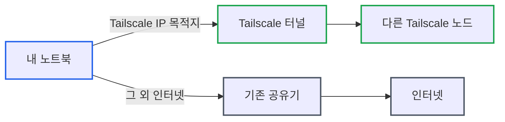
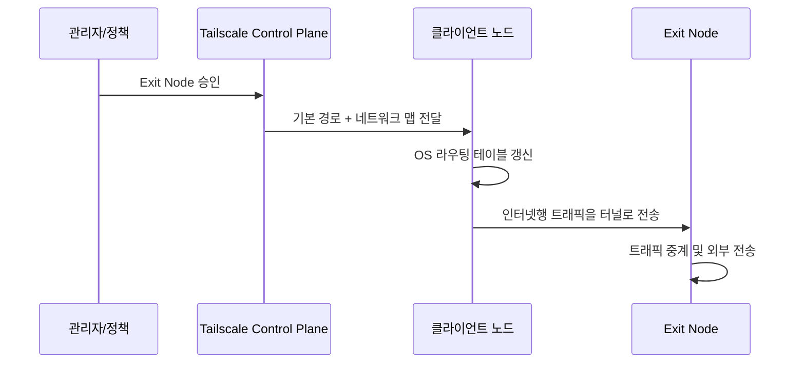
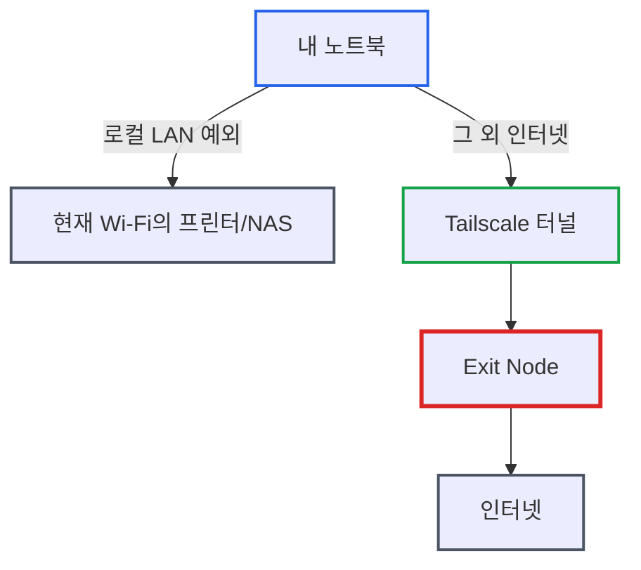

# Tailscale Exit Node: 원격 프록시 대신 한 줄 설정으로 VPN을 얻다

> **작성일**: 2026년 4월 21일
> **카테고리**: Networking, Tailscale, VPN
> **키워드**: Tailscale, Exit Node, WireGuard, Route Injection, Userspace Networking

## 요약

원격 네트워크를 거쳐 인터넷에 나가야 하는 상황이 생겨 처음에는 SSH 터널, SOCKS 프록시, 수동 WireGuard 구성을 고민했다. 결과적으로는 Tailscale의 exit node 한 줄 설정으로 끝났고, 마치 전통적인 full-tunnel VPN을 붙인 것처럼 모든 트래픽이 원격 노드를 경유했다. "OS는 원래 게이트웨이가 아닌데 왜 이렇게 간단하게 되는가"라는 의문을 풀어가면서, Tailscale이 OS에 없던 기능을 새로 만드는 것이 아니라 이미 있던 라우팅 기능을 자동으로 설정하고 플랫폼에 따라 커널 또는 userspace 방식으로 중계까지 구현해 제공한다는 점을 확인한다.

## 문제 상황

### 해결하고 싶었던 것

원격지 노드를 경유해 인터넷에 나가야 할 상황이 있었다. 예를 들면 이런 경우다.

- 특정 공인 IP로만 접근 가능한 내부 서비스 확인
- 해외 리전에서만 보이는 리소스 테스트
- 현재 네트워크에서는 막혀 있는 외부 서비스 접근

요구사항은 명확했다.

- 내 노트북에서 발생하는 **모든** 트래픽이 원격 노드를 통과해 나가야 한다
- 특정 애플리케이션만이 아니라 **OS 레벨**에서 동작해야 한다

### 처음 떠올린 접근

익숙한 방법 세 가지가 먼저 떠올랐다.

**1. 원격 접속 후 그 장비에서 직접 작업**

SSH/RDP로 원격 노드에 접속해 거기서 브라우저와 도구를 실행한다. 단순하지만 내 로컬 환경(IDE, 도구, 설정, 파일)이 아니라 원격 환경에서 일해야 한다는 전제가 붙는다.

**2. SOCKS/HTTP 포워딩 프록시**

`ssh -D`로 SOCKS 프록시를 만들고 브라우저와 개별 도구에 프록시를 설정한다. 애플리케이션 단위 설정이고, 프록시를 지원하지 않는 도구는 누락된다.

**3. 직접 WireGuard/OpenVPN 구성**

full-tunnel VPN을 직접 세팅하면 해결된다. 다만 서버 측 설정, 방화벽, NAT, 클라이언트 설정, 키 관리까지 할 일이 상당하다.

셋 다 어딘가 불편했다. 원하는 건 "원격 노드가 내 인터넷 게이트웨이가 되는 것"이었는데, 여기에 정확히 맞는 건 세 번째인 full VPN뿐이었다.

### 예상하지 못한 해결

Tailscale은 이미 설치해 두고 노드 간 IP 접속용으로만 쓰고 있었다. 문서를 보다 **exit node** 기능을 발견했다.

```bash
# 원격 노드에서 exit node 광고
$ sudo tailscale up --advertise-exit-node
```

```bash
# 내 노트북에서 exit node 사용
$ tailscale up --exit-node=<노드명>
```

한 줄이었다. 바로 내 모든 인터넷 트래픽이 원격 노드의 공인 IP로 나갔다. 전통적인 full-tunnel VPN을 붙인 것과 구분되지 않았다.

여기서 의문이 생겼다.

> Windows나 Linux는 원래 게이트웨이처럼 동작하지 않는데, 왜 별도 설정 없이 이렇게 되지?

이 글은 그 의문을 풀어가는 기록이다.

## 근본 원인 분석

핵심부터 말하면 이렇다.

> Tailscale은 OS에 없던 기능을 새로 만드는 것이 아니라, OS가 이미 가진 네트워크 기능을 자동으로 설정하고, 플랫폼에 따라 커널 또는 userspace 방식으로 트래픽 중계까지 구현해 제품처럼 제공한다.

하나씩 풀어 보자.

### Tailscale은 L2 브리지가 아니다

"여러 장비를 같은 네트워크처럼 묶어 준다"는 설명 때문에 이더넷 브리지나 L2 스위치를 떠올리기 쉽다. 실제로는 다르다.

Tailscale은 **WireGuard 기반의 L3 오버레이 네트워크**를 만든다. 각 장비는 Tailscale IP(100.x.x.x)를 할당받고, 장비 사이에는 암호화된 터널이 형성된다. 각 장비는 자신의 **OS 라우팅 테이블**을 참조해 특정 목적지를 Tailscale 인터페이스로 보낼지 결정한다.


Tailscale은 네트워크를 스위치로 이어 붙이는 것이 아니라 **IP 레벨에서 경로를 주입(route injection)해서** 연결한다.

### Exit Node 이전: Split Tunnel

exit node를 쓰지 않을 때는 **Tailscale 네트워크 대역(100.x.x.x) 목적지 트래픽만** 터널로 들어간다. 나머지 일반 인터넷 트래픽은 원래의 기본 게이트웨이로 나간다.



이게 Tailscale의 기본 split tunnel 동작이다.

### Exit Node: Default Route 재작성

exit node를 지정하면 단 하나가 바뀐다.

> 클라이언트의 **기본 경로(default route, `0.0.0.0/0` 및 `::/0`)** 가 exit node를 향하도록 바뀐다.

인터넷으로 나가던 전체 트래픽이 Tailscale 터널 안으로 들어가고, 반대편 exit node가 대신 바깥으로 내보낸다.


외부 서비스 입장에서 보이는 공인 IP는 내 노트북이 아닌 **exit node의 공인 IP**다.

- **평소**: 내 노트북 → 내 공유기 → 인터넷
- **exit node 사용 시**: 내 노트북 → Tailscale 터널 → exit node → 인터넷

여기서 중요한 점은, 사용자가 `route add`를 직접 치지 않았을 뿐 **라우팅 변경은 실제로 일어난다**는 것이다. 그 작업을 Tailscale이 대신한다.

### "OS는 게이트웨이가 아니다"는 왜 직관과 충돌하는가

이 감각은 정확하다. 다만 두 가지를 구분해야 한다.

**호스트 라우팅: 모든 OS가 기본으로 한다**

내 애플리케이션이 만든 패킷을 어느 인터페이스로 내보낼지 결정하는 일은 모든 OS가 항상 한다.


**포워딩: 기본적으로 꺼져 있거나 제한적이다**

남이 만든 패킷을 받아서 또 다른 네트워크로 넘겨주는 기능은 별개다. 일반 PC는 보통 비활성화되어 있다.


"일반 PC는 게이트웨이가 아니다"라고 할 때 대개 가리키는 것은 두 번째다. exit node를 쓰는 **클라이언트 쪽**은 호스트 라우팅만 바꾸면 되니 어렵지 않다. 실제로 남의 패킷을 넘겨주는 책임은 **exit node 쪽**이 진다.

### Route Injection: Tailscale이 라우트를 대신 넣는 방식

Tailscale은 subnet router, exit node, app connector 설정 시 **route injection**을 수행한다. 컨트롤 플레인에서 승인된 경로를 바탕으로 각 클라이언트가 자신의 라우팅 테이블에 필요한 경로를 반영하게 한다.



사용자가 하지 않을 뿐 **tailscaled 데몬이 라우팅 테이블을 실제로 조정**하고 있다.

### Exit Node에서의 중계: 커널 vs Userspace

exit node 쪽은 사정이 다르다. 여기서는 실제로 남의 패킷을 받아 다른 인터페이스로 내보내야 한다. Tailscale 공식 문서는 이를 두 모드로 설명한다.

- **Kernel mode**: root 권한 Linux 환경
- **Userspace mode (netstack)**: 그 외 모든 장비(Windows, macOS, non-root Linux 등)

**Linux kernel mode의 흐름**


Linux에서 exit node나 subnet router를 본격적으로 운영하려면 `net.ipv4.ip_forward=1`을 켜는 경우가 많다. 전통적 네트워크 장비처럼 커널이 직접 포워딩하기 때문이다.

**Windows/macOS의 userspace netstack**

Windows나 macOS는 원래 범용 라우터로 설계된 OS가 아니다. 그런데도 exit node가 된다. 비결은 **Tailscale이 userspace에서 자체 TCP/IP 스택(netstack)을 돌리고, 거기서 트래픽을 종단 처리한 뒤 OS 소켓 API로 외부에 새 연결을 맺는 방식**이다.


비유하자면, Linux kernel mode는 **"받은 소포를 그대로 다음 우편함에 넣는다"** 에 가깝고, userspace mode는 **"소포를 받아 열어 보고, 내 이름으로 다시 포장해 부친다"** 에 가깝다. 수신자 입장에서는 원 발신자가 아니라 **exit node가 보낸 것처럼 보인다**. 대신 kernel mode 대비 커널-유저 경계를 오가는 오버헤드가 일반적으로 더 크다.

결론적으로 "Windows가 라우터 OS가 아닌데 왜 exit node가 되지?"의 답은 이것이다.

> Tailscale이 플랫폼에 따라 커널 포워딩 대신 **userspace 네트워크 스택**으로 같은 역할을 수행하기 때문이다.

### Exit Node와 Subnet Router의 차이

비슷해 보이지만 범위가 다르다.

| 구분 | Exit Node | Subnet Router |
|------|-----------|---------------|
| 담당 경로 | `0.0.0.0/0`, `::/0` (기본 경로 전체) | `192.168.0.0/24` 등 특정 대역 |
| 목적 | 인터넷 전체 우회 | 특정 사설망 대역 진입 |
| 활용 예 | full VPN 대체, 공인 IP 우회 | 본사 내부망, AWS VPC 진입 |

Tailscale 공식 문서는 subnet router를 "tailnet과 물리 서브넷 사이의 게이트웨이"로 설명한다. exit node는 그 게이트웨이의 **범위가 가장 넓은 버전**이라고 보면 된다.

### Allow LAN Access 옵션의 의미

exit node를 켜면 기본 경로가 바뀌기 때문에 현재 붙어 있는 로컬 네트워크의 장치들(프린터, NAS, 공유기 관리 페이지)에 대한 접근도 함께 터널을 타 버린다. 그래서 Tailscale은 **Allow LAN Access**라는 예외 옵션을 제공한다.



이 옵션의 존재 자체가, exit node가 단순한 "원격 프록시"가 아니라 **클라이언트의 기본 라우팅 경로에 직접 개입하는 기능**임을 보여준다. 애플리케이션 단위 프록시였다면 로컬 LAN과 충돌할 일이 없다.

## 해결 과정

실제 설정은 놀랍도록 짧다.

### 1. 원격 노드에서 exit node 광고

```bash
# Linux
$ sudo tailscale up --advertise-exit-node

# 상태 확인
$ tailscale status
```

### 2. Admin Console에서 승인

Tailscale Admin Console의 머신 목록에서 해당 노드의 "Use as exit node" 설정을 허용한다. 승인이 없으면 클라이언트가 선택할 수 없다.

### 3. 클라이언트에서 Exit Node 선택

```bash
# 이름으로 선택 + 로컬 LAN은 예외 허용
$ tailscale up --exit-node=remote-node --exit-node-allow-lan-access

# 해제
$ tailscale up --exit-node=
```

GUI 환경에서는 메뉴에서 해당 노드를 선택하면 된다.

### 4. 검증

```bash
# 공인 IP 확인 - exit node의 IP가 나와야 한다
$ curl ifconfig.me

# 라우팅 테이블 확인 - 기본 경로가 tailscale 인터페이스로 향해야 한다
$ ip route        # Linux
$ route print     # Windows
```

`curl ifconfig.me`가 exit node의 공인 IP를 반환하면 모든 경로가 우회되고 있다는 뜻이다.

## 교훈

### 1. "어려워 보이는 것이 이미 풀려 있는지"부터 확인한다

포워딩 프록시, 애플리케이션별 설정, 수동 VPN 구성을 먼저 떠올렸지만, 도구는 이미 한 줄로 해결책을 제공하고 있었다. 익숙한 방식으로 풀려다 더 단순한 길을 놓치는 경우가 있다.

### 2. "간단한 UI/CLI" 뒤의 복잡성을 이해해 둔다

Tailscale은 사용자에게 **"Run as exit node"** 버튼 하나만 보여주지만, 그 뒤에서는

- 컨트롤 플레인의 정책 승인
- 클라이언트 OS 라우팅 테이블의 기본 경로 재작성
- Tailscale 가상 인터페이스를 통한 암호화 터널
- 플랫폼별 커널/userspace 중계

가 동시에 돌아간다. 이 구조를 알고 있으면 장애가 났을 때(예: exit node가 인식되는데 트래픽이 안 빠질 때) 어디를 봐야 할지 감이 생긴다.

### 3. Full VPN과 원격 프록시는 다른 계층이다

원격 프록시는 **애플리케이션 단위**, exit node는 **OS 라우팅 테이블 단위**다. "모든 트래픽을 우회"가 요구사항이면 후자가 맞다. 사용자가 수동으로 라우트를 치지 않을 뿐, 내부에서는 동일한 라우팅 테이블 조작이 일어나고 있다.

## 참고 자료

### 공식 문서
- [Tailscale: How it works](https://tailscale.com/blog/how-tailscale-works)
- [Route injection · Tailscale Docs](https://tailscale.com/docs/reference/route-injection)
- [Exit nodes (route all traffic) · Tailscale Docs](https://tailscale.com/docs/features/exit-nodes)
- [Use exit nodes · Tailscale Docs](https://tailscale.com/docs/features/exit-nodes/how-to/setup)
- [Subnet routers · Tailscale Docs](https://tailscale.com/docs/features/subnet-routers)
- [Kernel vs. netstack subnet routing & exit nodes · Tailscale Docs](https://tailscale.com/docs/reference/kernel-vs-userspace-routers)
- [Tailscale and the OSI model](https://tailscale.com/docs/concepts/tailscale-osi)
