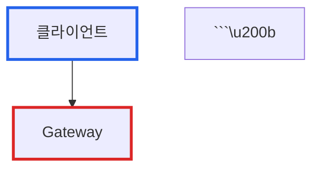

# 블로그 작성 가이드

> **AI Agent 필독**: 이 문서는 imprun.dev 블로그 작성 시 **반드시 따라야 할 강제 규칙**입니다.

---

## 핵심 원칙

**imprun.dev 기술 블로그는 전문 기업 기술 블로그 스타일을 따릅니다.**

### 스타일 지침

- **회사 기술 블로그 스타일**: Netflix Tech Blog, Uber Engineering, LinkedIn Engineering 수준의 전문적인 톤
- **객관적이고 기술적**: 감정적 표현이나 과장 없이 사실 중심으로 작성
- **이모지 사용 자제**: 필요시 최소한으로만 사용 (기본적으로 사용하지 않음)
- **AI 티 제거**: "오늘은", "~해볼까요?", "~해봅시다" 등 AI가 작성한 티가 나는 표현 금지
- **정확성 우선**: MCP로 검증된 사실만 기술, 추정치는 명확히 표기

**이 규칙을 위반하면 사용자가 즉시 재작성을 요구합니다.**

---

## 필수 블로그 구조

### 1. 메타데이터 (필수)

블로그 상단에 다음 메타데이터를 포함해야 합니다:

```markdown
> **작성일**: YYYY년 MM월 DD일
> **카테고리**: 주요 기술 분야 (예: Kubernetes, Storage, Troubleshooting)
> **키워드**: 핵심 키워드 (예: Kubernetes, Ephemeral Storage, Pod Eviction)
```

### 2. 요약 (필수)

**목적**: 독자가 3-4문장으로 전체 내용을 파악할 수 있도록 핵심 요약 제공

```markdown
## 요약

[환경 설명] 환경에서 [문제]가 발생했습니다. 근본 원인은 [원인 설명]이었습니다. 이 글에서는 문제의 원인과 해결 과정, 그리고 재발 방지를 위한 방안을 공유합니다.
```

### 3. 문제 상황 (필수)

**구성**:
- 증상: 발생한 문제의 구체적 현상
- 환경 구성: 시스템 환경 및 설정
- 초기 진단: 문제 파악을 위한 첫 번째 조사

```markdown
## 문제 상황

### 증상

[구체적인 에러 메시지, 현상 설명]

### 환경 구성

- **클라우드**: Oracle Cloud Infrastructure (OCI)
- **인스턴스**: ARM64 기반 무료 티어 (4 Core, 24GB RAM)
- **스토리지 구성**:
  - Boot Volume: 50GB
  - Block Volume: 150GB

### 초기 진단

[초기 조사 결과, 명령어 출력 등]
```

### 4. 근본 원인 분석 (필수)

**구성**:
- 기술 메커니즘 설명
- 설정 오류 분석
- 문제의 본질 파악

```markdown
## 근본 원인 분석

### [기술명] 계산 메커니즘

[기술의 동작 방식 설명]

### 설정 오류

당초 의도한 구성:
[의도한 설정]

실제 구성:
[실제 설정]

[문제점 설명]
```

### 5. 해결 과정 (필수)

**구성**:
- 단계별 해결 방법
- 명령어와 설명
- 결과 검증

```markdown
## 해결 과정

### 1. 상태 확인

\`\`\`bash
# 명령어
$ 명령어 실행
\`\`\`

### 2. 문제 해결

\`\`\`bash
# 해결 명령어
$ 해결 명령어 실행
\`\`\`

### 3. 결과 검증

\`\`\`bash
# 검증 명령어
$ 검증 명령어 실행
\`\`\`

[결과 설명]
```

### 6. 재발 방지 방안 또는 교훈 (필수)

**구성**:
- 예방 조치
- 모니터링 방법
- 핵심 교훈

```markdown
## 재발 방지 방안

### 1. 설치 전 구성 (권장)

[예방 방법 설명]

### 2. 검증 절차

[검증 방법]

### 3. 모니터링

[모니터링 방법]

## 교훈

### 1. [교훈 제목]

[교훈 설명]

### 2. [교훈 제목]

[교훈 설명]
```

### 7. 참고 자료 (필수)

```markdown
## 참고 자료

### 관련 문서
- [문서 제목](링크) - 설명

### 공식 문서
- [공식 문서 제목](링크)
```

---

## 링크 규칙

### 문서 간 링크

- **같은 디렉토리 내**: 상대 경로 사용 `./filename.md`
- **다른 디렉토리**: 상대 경로 사용 `../../path/filename.md`
- **외부 블로그 참조**: 필요시 절대 URL 사용

```markdown
## 참고 자료

### 관련 문서
- [Kubernetes Ephemeral Storage 문제 해결 가이드](./kubernetes-ephemeral-storage-troubleshooting-guide.md) - 상세 기술 문서
- [Oracle Cloud 준비 및 설정](../../10/25/01-preparation-oracle-cloud.md) - Block Volume 설정 가이드

### 공식 문서
- [Kubernetes Node-pressure Eviction](https://kubernetes.io/docs/concepts/scheduling-eviction/node-pressure-eviction/)
```

---

## MCP 검증 원칙

**핵심 원칙**: 검증되지 않은 주장을 사실처럼 기술하지 않음

### 필수 검증 사항

1. **기술 내부 동작**
   - 공식 문서로 확인 가능한 내용만 단정적으로 기술
   - 확인되지 않은 내부 동작은 "일반적으로", "추정됨" 등으로 표현

2. **성능 수치**
   - 실측한 값: 정확한 수치 기록
   - 계산값: "이론적 계산", "예상", "약" 명시
   - 환경 정보 병기 (하드웨어, 소프트웨어 버전)

3. **비교 및 평가**
   - "가장 좋은", "최적의" 등 절대적 표현 지양
   - 특정 환경/조건에서의 결과임을 명시
   - 다른 선택지와의 비교 근거 제시

### 올바른 표현 예시

**기술 검증**:
- "Kubernetes는 root 파티션을 기준으로 ephemeral-storage를 계산합니다." (공식 문서 확인)
- "일반적으로 MongoDB는 서버 측에서 조인을 처리합니다."

**성능 수치**:
- "Root 파티션 사용률이 84%에서 57%로 감소했습니다." (실측)
- "약 27% 개선 예상 (84% → 57%)"

**비교 표현**:
- "Oracle Cloud 무료 티어 환경에서는 이 방법이 효과적입니다."
- "제한된 환경에서 보안과 가용성을 모두 달성할 수 있습니다."

---

## 이미지 사용 규칙

### 외부 이미지 링크

- **공식 문서 이미지**: 공식 사이트의 이미지는 직접 링크하여 사용 가능
- **출처 표기**: 이미지 아래에 출처를 명시

```markdown

*출처: [공식 문서 이름](https://official-site.com/docs)*
```

### 이미지 사용 예시

```markdown

*출처: [Feature-Sliced Design 공식 문서](https://feature-sliced.design/docs/get-started/overview)*
```

### 주의사항

- 저작권이 있는 이미지는 사용하지 않음
- 공식 문서, 오픈소스 프로젝트의 이미지만 링크
- 이미지 URL이 변경될 수 있으므로 중요한 내용은 텍스트로도 설명

---

## Mermaid 다이어그램 규칙

### 스타일 규칙

- **배경색 사용 금지**: `fill` 속성 사용하지 않음
- **테두리만 사용**: `stroke` 속성으로 구분
- **이유**: 다크모드/라이트모드 호환성, 접근성

### 기본 패턴

```markdown


### 특수 문자 처리

**노드 라벨에 특수 문자 (`()`, `{}`, `[]`)가 있으면 큰따옴표로 감싸기:**

```mermaid
graph TB
    A["Service (LoadBalancer)"]  ✅
    B["Pod {replica: 2}"]        ✅
```

### 색상 팔레트 (Tailwind 기반)

```css
#2563eb  /* blue-600   - 주요 요소 */
#16a34a  /* green-600  - 정상/성공 */
#ea580c  /* orange-600 - 주의/경고 */
#dc2626  /* red-600    - 오류/문제 */
#4b5563  /* gray-600   - 일반/중립 */
```

---

## 전체 블로그 구조 템플릿

```markdown
# [구체적이고 명확한 기술 블로그 제목]

> **작성일**: YYYY년 MM월 DD일
> **카테고리**: 주요 기술 분야 (예: Kubernetes, Storage, Troubleshooting)
> **키워드**: 핵심 키워드 (예: Kubernetes, Ephemeral Storage, Pod Eviction)

## 요약

[환경 설명] 환경에서 [문제]가 발생했습니다. 근본 원인은 [원인 설명]이었습니다. 이 글에서는 문제의 원인과 해결 과정, 그리고 재발 방지를 위한 방안을 공유합니다.

## 문제 상황

### 증상

[구체적인 에러 메시지, 현상 설명]

```
에러 메시지 예시
```

### 환경 구성

- **클라우드**: Oracle Cloud Infrastructure (OCI)
- **인스턴스**: ARM64 기반 무료 티어 (4 Core, 24GB RAM)
- **스토리지 구성**:
  - Boot Volume: 50GB
  - Block Volume: 150GB

### 초기 진단

```bash
$ df -h /
Filesystem                  Size  Used Avail Use% Mounted on
/dev/mapper/ocivolume-root   30G   25G    5G  84% /
```

[초기 조사 결과 설명]

## 근본 원인 분석

### [기술명] 계산 메커니즘

[기술의 동작 방식을 객관적으로 설명]

### 설정 오류

당초 의도한 구성:
```
Boot Volume (50GB)  → OS 및 시스템 파일
Block Volume (150GB) → 컨테이너 데이터 및 로그
```

실제 구성:
```
Boot Volume (30GB, root 파티션) → OS + 컨테이너 데이터 (84% 사용)
Block Volume (150GB) → 미사용 (마운트 안 됨)
```

[문제점 설명]

## 해결 과정

### 1. 상태 확인

```bash
# 블록 디바이스 확인
$ lsblk
sdb                  8:16   0  150G  0 disk
└─sdb1               8:17   0  150G  0 part
```

### 2. 볼륨 마운트

```bash
# Kubernetes 중지
systemctl stop kubelet

# 기존 데이터 백업
mv /var/lib/containerd /var/lib/containerd-backup

# 마운트 포인트 생성 및 볼륨 마운트
mkdir -p /var/lib/containerd
mount /dev/sdb1 /var/lib/containerd
```

### 3. Kubernetes 재시작

```bash
systemctl start kubelet

# 상태 확인
kubectl get nodes
kubectl get pods -A
```

### 4. 결과 검증

```bash
$ df -h
Filesystem                  Size  Used Avail Use% Mounted on
/dev/mapper/ocivolume-root   30G   17G   13G  57% /
/dev/sdb1                   147G   11G  130G   8% /var/lib/containerd
```

Root 파티션 사용률이 84%에서 57%로 감소했으며, 모든 Pod가 정상 상태로 복구되었습니다.

## 재발 방지 방안

### 1. 설치 전 구성 (권장)

Kubernetes 설치 전에 다음과 같이 구성하면 문제를 예방할 수 있습니다:

```bash
# Block Volume을 중앙 위치에 마운트
mount /dev/sdb1 /var/lib/k8s-data

# 심볼릭 링크 생성
ln -s /var/lib/k8s-data/containerd /var/lib/containerd
ln -s /var/lib/k8s-data/kubelet /var/lib/kubelet
```

### 2. 검증 절차

각 경로가 올바른 파일시스템을 사용하는지 확인합니다:

```bash
df /var/lib/containerd
df /var/lib/kubelet
```

### 3. 모니터링

```bash
# 디스크 사용량 모니터링
watch -n 300 'df -h | grep -E "Filesystem|containerd|ocivolume"'
```

## 교훈

### 1. 클라우드 블록 스토리지의 명시성

클라우드 환경에서 블록 스토리지를 "연결"하는 것과 "마운트"하는 것은 별개의 작업입니다. 연결만으로는 사용할 수 없으며, 명시적인 마운트 작업이 필요합니다.

### 2. Kubernetes의 Ephemeral Storage 계산

Kubernetes는 경로가 아닌 파일시스템을 기준으로 ephemeral-storage를 계산합니다. 심볼릭 링크를 사용하더라도 실제 데이터가 저장되는 파일시스템이 중요합니다.

### 3. 검증의 중요성

설정 후에는 반드시 `df` 명령어로 실제 마운트 상태를 확인해야 합니다. 가정하지 말고 검증해야 합니다.

## 참고 자료

### 관련 문서
- [Kubernetes Ephemeral Storage 문제 해결 가이드](./kubernetes-ephemeral-storage-troubleshooting-guide.md) - 상세 기술 문서
- [Oracle Cloud 준비 및 설정](../../10/25/01-preparation-oracle-cloud.md) - Block Volume 설정 가이드

### 공식 문서
- [Kubernetes Node-pressure Eviction](https://kubernetes.io/docs/concepts/scheduling-eviction/node-pressure-eviction/)
- [Oracle Cloud Block Volumes](https://docs.oracle.com/en-us/iaas/Content/Block/home.htm)
```

---

## 발행 전 최종 체크리스트

**필수 항목 (위반 시 즉시 재작성)**:

- [ ] 메타데이터 (작성일, 카테고리, 키워드) 포함
- [ ] 요약 섹션 작성
- [ ] 문제 상황을 객관적으로 기술
- [ ] 근본 원인을 기술적으로 분석
- [ ] 해결 과정을 단계별로 설명
- [ ] 재발 방지 방안 또는 교훈 제시
- [ ] 참고 자료 링크 포함
- [ ] MCP 검증 완료 (추정치는 명확히 표기)
- [ ] Mermaid 다이어그램에서 `fill` 사용 안 함
- [ ] 이모지 사용 최소화 (회사 기술 블로그 스타일)
- [ ] AI 티 나는 표현 제거

**권장 항목**:

- [ ] 실제 명령어 출력 포함
- [ ] 다이어그램으로 구조 시각화
- [ ] Before/After 비교 제공
- [ ] 트러블슈팅 경험 공유
- [ ] 코드 블록에 주석 추가

---

## 요약: 기존 스타일과의 차이점

### 제거된 요소 (더 이상 사용 안 함)

- **TL;DR 섹션**: 요약 섹션으로 대체
- **들어가며 구조**: 문제 상황 섹션으로 대체
- **마주한 질문 (❓)**: 제거
- **검증 과정 (✅/❌)**: 제거
- **마무리 섹션**: 교훈 또는 재발 방지 방안으로 대체
- **imprun.dev 소개 고정 문구**: 제거
- **감정적 표현 및 과도한 이모지**: 제거
- **작성자 정보 섹션**: 제거

### 새로운 필수 요소

- **메타데이터**: 작성일, 카테고리, 키워드
- **요약**: 3-4문장의 간결한 요약
- **문제 상황**: 증상, 환경 구성, 초기 진단
- **근본 원인 분석**: 기술 메커니즘과 설정 오류 분석
- **해결 과정**: 단계별 해결 방법과 명령어
- **재발 방지 방안 또는 교훈**: 예방 조치와 핵심 교훈
- **참고 자료**: 관련 문서와 공식 문서 링크

### 톤과 스타일

- **Before**: 캐주얼, 이모지 많음, 스토리텔링 방식, "우리가 마주한 질문", AI 티
- **After**: 전문적, 객관적, 기술 리포트 방식, 회사 기술 블로그 스타일

---

**작성일:** 2025-11-18
**최종 수정일:** 2025-11-18 (회사 기술 블로그 스타일로 개편)
**관리자:** ImpRun 팀
