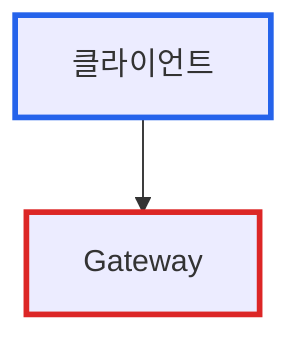
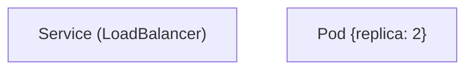

# Mermaid 다이어그램 규칙

## 스타일 규칙

- **배경색 사용 금지**: `fill` 속성 사용하지 않음
- **테두리만 사용**: `stroke` 속성으로 구분
- **이유**: 다크모드/라이트모드 호환성, 접근성

## 기본 패턴

## 특수 문자 처리

노드 라벨에 특수 문자 (`()`, `{}`, `[]`)가 있으면 큰따옴표로 감싸기:

## 색상 팔레트 (Tailwind 기반)

| 색상 | 용도 |
|---|---|
| `#2563eb` | blue-600 - 주요 요소 |
| `#16a34a` | green-600 - 정상/성공 |
| `#ea580c` | orange-600 - 주의/경고 |
| `#dc2626` | red-600 - 오류/문제 |
| `#4b5563` | gray-600 - 일반/중립 |
